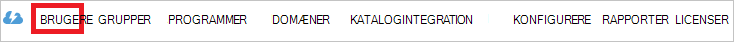

<properties
    pageTitle="Selvstudium: Azure Active Directory-integration med BetterWorks | Microsoft Azure"
    description="Lær at konfigurere single sign-on mellem Azure Active Directory og BetterWorks."
    services="active-directory"
    documentationCenter=""
    authors="jeevansd"
    manager="femila"
    editor=""/>

<tags
    ms.service="active-directory"
    ms.workload="identity"
    ms.tgt_pltfrm="na"
    ms.devlang="na"
    ms.topic="article"
    ms.date="09/29/2016"
    ms.author="jeedes"/>

# Selvstudium: Azure Active Directory-integration med BetterWorks

Formålet med dette selvstudium er at se, hvordan du integrerer BetterWorks med Azure Active Directory (Azure AD).

Integrering af BetterWorks med Azure AD giver dig følgende fordele:

- Du kan styre i Azure AD, der har adgang til BetterWorks
- Du kan aktivere dine brugere til automatisk få logget på til BetterWorks (Single Sign-On) med deres Azure AD-konti
- Du kan administrere dine konti på ét centralt sted - portalen Azure klassisk

Hvis du vil vide flere oplysninger om SaaS app integration med Azure AD, skal du se [Hvad er adgang til programmer og single sign-on med Azure Active Directory](active-directory-appssoaccess-whatis.md).

## Forudsætninger

Hvis du vil konfigurere Azure AD-integration med BetterWorks skal bruge du følgende elementer:

- Et Azure AD-abonnement
- BetterWorks enkelt-logger på aktiveret abonnement

> [AZURE.NOTE] Hvis du vil afprøve trinnene i dette selvstudium skal anbefaler vi ikke ved hjælp af et produktionsmiljø.

Hvis du vil afprøve trinnene i dette selvstudium, skal du følge disse anbefalinger:

- Du skal ikke bruge dit produktionsmiljø, medmindre det er nødvendigt.
- Hvis du ikke har et prøveabonnement Azure AD-miljø, kan du få en én måned prøveversion [her](https://azure.microsoft.com/pricing/free-trial/).

## Scenarie beskrivelse
Formålet med dette selvstudium er at gør det muligt at teste Azure AD enkeltlogon i et testmiljø.

Dette scenario, der er beskrevet i dette selvstudium består af to primære dokumentkomponenter:

1. Tilføje BetterWorks fra galleriet
2. Konfigurere og teste Azure AD single sign-on –

## Tilføje BetterWorks fra galleriet
Hvis du vil konfigurere integrationen mellem BetterWorks Azure AD, skal du tilføje BetterWorks fra galleriet til listen over administrerede SaaS apps.

**Hvis du vil tilføje BetterWorks fra galleriet, skal du udføre følgende trin:**

1. Klik på **Active Directory**i **Azure klassisk Portal**, i den venstre navigationsrude. 

    ![Active Directory][1]

2. Vælg den mappe, hvor du vil aktivere katalogintegration fra listen **adresseliste** .

3. For at åbne visningen programmer i visningen directory, skal du klikke på **programmer** i den øverste menu.
    
    ![Programmer][2]

4. Klik på **Tilføj** i bunden af siden.
    
    ![Programmer][3]

5. Dialogboksen **Hvad vil du gøre** , klik på **Tilføj et program i galleriet**.

    ![Programmer][4]

6. Skriv **BetterWorks**i søgefeltet.

    

7. Vælg **BetterWorks**i resultatruden, og klik derefter på **udført** for at tilføje programmet.

    

##  Konfigurere og teste Azure AD single sign-on –
Formålet med dette afsnit er at se, hvordan du konfigurerer og afprøver Azure AD single sign-on – med BetterWorks baseret på en testbruger ved navn "Britta Thomas".

Azure AD skal se, hvad brugeren modstykke i BetterWorks til en bruger i Azure AD er for single sign-on til arbejde. Med andre ord, skal et link forholdet mellem en Azure AD-bruger og den pågældende bruger i BetterWorks oprettes.

Denne link relation er etableret ved at tildele værdien af det **brugernavn** i Azure AD som værdien i feltet **brugernavn** i BetterWorks.

For at konfigurere og teste Azure AD single sign-on – med BetterWorks, skal du udføre følgende grundpillerne:

1. **[Konfiguration af Azure AD Single Sign-On](#configuring-azure-ad-single-single-sign-on)** – til at aktivere dine brugere at bruge denne funktion.
2. **[Oprette en Azure AD teste bruger](#creating-an-azure-ad-test-user)** - teste Azure AD single sign-on – med Britta Simon.
3. **[Oprette en BetterWorks teste bruger](#creating-a-betterworks-test-user)** - skal have et modstykke Britta Simon i BetterWorks, der er knyttet til Azure AD-repræsentation af hende.
4. **[Tildele Azure AD teste bruger](#assigning-the-azure-ad-test-user)** – til at aktivere Britta Simon bruge Azure AD enkeltlogon.
5. **[Test af Single Sign-On](#testing-single-sign-on)** – til at kontrollere, om konfigurationen fungerer.

### Konfiguration af Azure AD-Single Sign-On

Formålet med dette afsnit er at aktivere Azure AD enkeltlogon i portalen Azure klassisk og for at konfigurere single sign-on i BetterWorks programmet.

BetterWorks programmet forventer SAML påstande i et bestemt format. Konfigurer følgende krav om dette program. Du kan administrere værdierne i disse attributter fra fanen "**Atrribute**" af programmet. Følgende skærmbillede viser et eksempel af dette. 

**Hvis du vil konfigurere Azure AD single sign-on – med BetterWorks skal du udføre følgende trin:**

1. Klik på **attributter**i Azure klassisk-portalen på **BetterWorks** programmets integrationsside, i menuen i øverst.

    

2. Dialogboksen **SAML token attributter** for hver række, der er vist i nedenstående tabel, du udføre følgende trin:
    

  	| Attributnavn | Attributværdien |
  	| --- | --- |    
  	| saml_token | bd189cf6-1701-11e6-8f90-d26992eca2a5 |

    en. Klik på **Tilføj bruger attribut** for at åbne dialogboksen **Tilføj bruger Attribure** .

    
    
    b. Skriv det attributnavn, der vises for den pågældende række i tekstfeltet **Attributnavn** .
    
    c. På listen **Attributværdien** , Skriv saml token-ID'ET vises for den pågældende række.
    
    d. Klik på **fuldført**

3. Klik på **Hurtig Start**i menuen øverst.

     

4. Vælg **Azure AD Single Sign-On**på siden **hvordan vil du brugere til at logge BetterWorks** , og klik derefter på **Næste**.
    
    

5. På siden **Konfigurer App indstillinger** dialogboksen, hvis du vil konfigurere programmet i **IDP startet tilstand**, skal du udføre følgende trin:

    

    en. I tekstfeltet **id** skal du skrive URL-adressen i følgende mønster:`https://app.betterworks.com/saml2/metadata/`

    b. I tekstfeltet **Svar URL-adresse** skal du skrive URL-adressen i følgende mønster:`https://app.betterworks.com/saml2/acs/`

    c. Klik på **Næste**

6. På siden **Konfigurer App indstillinger** dialogboksen, hvis du vil konfigurere programmet i **SP startet tilstand**, skal udføre den på følgende trin:

    

    en.  Vælg **Vis avancerede indstillinger (valgfrit)**.

    b. I tekstfeltet **Log på URL-adresse** skal du skrive URL-adressen bruges af dine brugere at sign-on til dit BetterWorks program ved hjælp af følgende mønster:`https://app.betterworks.com`

    b. Klik på **Næste**.

7. Siden **Konfigurer single sign-on – på BetterWorks** skal udføre følgende trin og klikke på **Næste**:

    

    en. Klik på **Hent metadata**, og derefter gemme filen på din computer.

    b. Klik på **Næste**.

8. Kontakt supportteamet BetterWorks via for at få konfigureret for dit program SSO, <mailto:support@betterworks.com>. Vedhæfte metadatafilen hentede, og del den med BetterWorks team til at konfigurere SSO i deres side.

9. Vælge enkelt sign-on – konfiguration bekræftelsen i klassisk-portalen, og klik derefter på **Næste**.
    
    ![Azure AD-Single Sign-On][10]

10. **Enkelt sign-on –** bekræftelsessiden, klik på **udført**.  
    
    ![Azure AD-Single Sign-On][11]

### Oprette en Azure AD testbruger
Formålet med dette afsnit er at oprette en testbruger i portalen klassisk kaldet Britta Simon.

![Oprette Azure AD-bruger][20]

**For at oprette en testbruger i Azure AD, skal du udføre følgende trin:**

1. Klik på **Active Directory**i **Azure klassisk Portal**, i den venstre navigationsrude.

    

2. Vælg den mappe, hvor du vil aktivere katalogintegration fra listen **adresseliste** .

3. Klik på **brugere**for at få vist listen over brugere, i menuen øverst.
    
    

4. For at åbne dialogboksen **Tilføj bruger** på værktøjslinjen nederst skal du klikke på **Tilføj bruger**.

    

5. På siden **fortælle os om denne bruger** dialogboksen skal du udføre følgende trin:

    

    en. Vælg ny bruger i organisationen som Type af bruger.

    b. Skriv **BrittaSimon**i brugernavn **tekstfelt**.

    c. Klik på **Næste**.

6.  På siden **Brugerprofil** dialogboksen skal du udføre følgende trin:
    
    

    en. Skriv **Britta**i tekstfeltet **Fornavn** .  

    b. I **Efternavn** tekstfeltet skal type **Thomas**.

    c. I tekstfeltet **Navn** skal du skrive **Britta Thomas**.

    d. Vælg **bruger,**på listen **rolle** .

    e. Klik på **Næste**.

7. Klik på **Opret**på siden **Hent midlertidige adgangskode** dialogboksen.
    
    

8. På siden **få midlertidige adgangskode** dialogboksen skal du udføre følgende trin:
    
    

    en. Notér værdien af den **Nye adgangskode**.

    b. Klik på **udført**.   

### Oprette en BetterWorks testbruger

I dette afsnit, skal oprette du en bruger, kaldet Britta Simon i BetterWorks. 

Skal du samarbejde med supportteam BetterWorks via <mailto:support@betterworks.com> at føje brugerne i BetterWorks platformen.

### Tildele Azure AD test brugeren

Formålet med dette afsnit er at aktivere Britta Simon bruge Azure enkeltlogon ved at give adgang til BetterWorks.
    
   ![Tildele bruger][200]

**Hvis du vil tildele Britta Simon til BetterWorks, skal du udføre følgende trin:**

1. I klassisk Portal, for at åbne visningen programmer i visningen directory, ved at klikke på **programmer** i den øverste menu.
    
    ![Tildele bruger][201]

2. Vælg **BetterWorks**i listen over programmer.
    
    

1. Klik på **brugere**i menuen øverst.
    
    ![Tildele bruger][203]

1. Vælg **Britta Thomas**på listen brugere.

2. Klik på **Tildel**på værktøjslinjen nederst.
    
    ![Tildele bruger][205]

### Test af Single Sign-On

Formålet med dette afsnit er at teste din Azure AD enkelt sign-on – konfiguration ved hjælp af panelet adgang.
 
Når du klikker på feltet BetterWorks i panelet adgang, du bør få automatisk logget på BetterWorks-program.

## Yderligere ressourcer

* [Liste over selvstudier om, hvordan du integrerer SaaS Apps med Azure Active Directory](active-directory-saas-tutorial-list.md)
* [Hvad er adgang til programmer og single sign-on med Azure Active Directory?](active-directory-appssoaccess-whatis.md)

<!--Image references-->

[1]: ./media/active-directory-saas-betterworks-tutorial/tutorial_general_01.png
[2]: ./media/active-directory-saas-betterworks-tutorial/tutorial_general_02.png
[3]: ./media/active-directory-saas-betterworks-tutorial/tutorial_general_03.png
[4]: ./media/active-directory-saas-betterworks-tutorial/tutorial_general_04.png

[6]: ./media/active-directory-saas-betterworks-tutorial/tutorial_general_05.png
[10]: ./media/active-directory-saas-betterworks-tutorial/tutorial_general_06.png
[11]: ./media/active-directory-saas-betterworks-tutorial/tutorial_general_07.png
[20]: ./media/active-directory-saas-betterworks-tutorial/tutorial_general_100.png

[200]: ./media/active-directory-saas-betterworks-tutorial/tutorial_general_200.png
[201]: ./media/active-directory-saas-betterworks-tutorial/tutorial_general_201.png
[203]: ./media/active-directory-saas-betterworks-tutorial/tutorial_general_203.png
[204]: ./media/active-directory-saas-betterworks-tutorial/tutorial_general_204.png
[205]: ./media/active-directory-saas-betterworks-tutorial/tutorial_general_205.png
