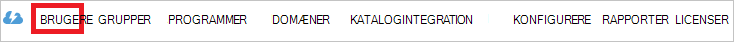

<properties
    pageTitle="Selvstudium: Azure Active Directory-integration med stedfortræder | Microsoft Azure"
    description="Lær at konfigurere single sign-on mellem Azure Active Directory og stedfortræder."
    services="active-directory"
    documentationCenter=""
    authors="jeevansd"
    manager="femila"
    editor=""/>

<tags
    ms.service="active-directory"
    ms.workload="identity"
    ms.tgt_pltfrm="na"
    ms.devlang="na"
    ms.topic="article"
    ms.date="09/28/2016"
    ms.author="jeedes"/>

# Selvstudium: Azure Active Directory-integration med stedfortræder

Formålet med dette selvstudium er at se, hvordan du integrerer stedfortræder med Azure Active Directory (Azure AD).

Integrering af stedfortræder med Azure AD giver dig følgende fordele:

- Du kan styre i Azure AD, der har adgang til stedfortræder
- Du kan aktivere dine brugere til automatisk få logget på til stedfortræder (Single Sign-On) med deres Azure AD-konti
- Du kan administrere dine konti på ét centralt sted - portalen Azure klassisk

Hvis du vil vide flere oplysninger om SaaS app integration med Azure AD, skal du se [Hvad er adgang til programmer og single sign-on med Azure Active Directory](active-directory-appssoaccess-whatis.md).

## Forudsætninger

Hvis du vil konfigurere Azure AD-integration med stedfortræder skal bruge du følgende elementer:

- Et Azure AD-abonnement
- En stedfortræder enkelt – Log på aktiveret abonnement

> [AZURE.NOTE] Hvis du vil afprøve trinnene i dette selvstudium skal anbefaler vi ikke ved hjælp af et produktionsmiljø.

Hvis du vil afprøve trinnene i dette selvstudium, skal du følge disse anbefalinger:

- Du skal ikke bruge dit produktionsmiljø, medmindre det er nødvendigt.
- Hvis du ikke har et prøveabonnement Azure AD-miljø, kan du få en én måned prøveversion [her](https://azure.microsoft.com/pricing/free-trial/).

## Scenarie beskrivelse
Formålet med dette selvstudium er at gør det muligt at teste Azure AD enkeltlogon i et testmiljø.

Dette scenario, der er beskrevet i dette selvstudium består af to primære dokumentkomponenter:

1. Tilføje stedfortræder fra galleriet
2. Konfigurere og teste Azure AD single sign-on –

## Tilføje stedfortræder fra galleriet
Hvis du vil konfigurere integrationen mellem stedfortræder Azure AD, skal du tilføje stedfortræder fra galleriet til listen over administrerede SaaS apps.

**Hvis du vil tilføje stedfortræder fra galleriet, skal du udføre følgende trin:**

1. Klik på **Active Directory**i **Azure klassisk Portal**, i den venstre navigationsrude. 

    ![Active Directory][1]

2. Vælg den mappe, hvor du vil aktivere katalogintegration fra listen **adresseliste** .

3. For at åbne visningen programmer i visningen directory, skal du klikke på **programmer** i den øverste menu.
    
    ![Programmer][2]

4. Klik på **Tilføj** i bunden af siden.
    
    ![Programmer][3]

5. Dialogboksen **Hvad vil du gøre** , klik på **Tilføj et program i galleriet**.

    ![Programmer][4]

6. Skriv **stedfortræder**i søgefeltet.

    

7. Vælg **stedfortræder**i resultatpanelet, og klik derefter på **udført** for at tilføje programmet.

    

##  Konfigurere og teste Azure AD single sign-on –
Formålet med dette afsnit er at se, hvordan du konfigurerer og afprøver Azure AD single sign-on – med stedfortræder, der er baseret på en testbruger ved navn "Britta Thomas".

Azure AD skal se, hvad brugeren modstykke i stedfortræder for en bruger i Azure AD er for single sign-on til arbejde. Med andre ord, skal et link forholdet mellem en Azure AD-bruger og den pågældende bruger i stedfortræder oprettes.

Denne link relation er etableret ved at tildele værdien af det **brugernavn** i Azure AD som værdien i feltet **brugernavn** i stedfortræder.

For at konfigurere og teste Azure AD single sign-on – med stedfortræder, skal du udføre følgende grundpillerne:

1. **[Konfiguration af Azure AD Single Sign-On](#configuring-azure-ad-single-single-sign-on)** – til at aktivere dine brugere at bruge denne funktion.
2. **[Oprette en Azure AD teste bruger](#creating-an-azure-ad-test-user)** - teste Azure AD single sign-on – med Britta Simon.
3. **[Oprette en stedfortræder teste bruger](#creating-a-deputy-test-user)** - skal have et modstykke Britta Simon i stedfortræder, der er knyttet til Azure AD-repræsentation af hende.
4. **[Tildele Azure AD teste bruger](#assigning-the-azure-ad-test-user)** – til at aktivere Britta Simon bruge Azure AD enkeltlogon.
5. **[Test af Single Sign-On](#testing-single-sign-on)** – til at kontrollere, om konfigurationen fungerer.

### Konfiguration af Azure AD enkeltlogon

I dette afsnit, skal du aktivere Azure AD enkeltlogon i portalen klassisk og konfigurere Enkeltlogon i stedfortræder programmet.

**Hvis du vil konfigurere Azure AD single sign-on – med stedfortræder skal du udføre følgende trin:**

1. I portalen klassisk, på siden **stedfortræder** application integration, klik på **Konfigurer single sign-on –** for at åbne dialogboksen **Konfigurer Single Sign-On** .
     
    ![Konfigurere Single Sign-On][6] 

2. Vælg **Azure AD Single Sign-On**på siden **hvordan vil du brugere til at logge stedfortræder** , og klik derefter på **Næste**.
    
    

3. På siden **Konfigurer App indstillinger** dialogboksen Hvis du vil konfigurere programmet i **IDP startet tilstand**, skal du udføre følgende trin og klikke på **Næste**:

    

    en. I tekstfeltet **id** skal du skrive en URL-adresse ved hjælp af følgende mønster: `https://<your-subdomain>.<region>.deputy.com`.

    b. I tekstfeltet **Svar URL-adresse** skal du skrive en URL-adresse ved hjælp af følgende mønster: `https://<your-subdomain>.<region>.deputy.com/exec/devapp/samlacs`.

    c. Klik på **Næste**.

4. Hvis du vil konfigurere programmet i **SP startet tilstand** på siden **Konfigurer App-indstillinger** i dialogboksen, klik på **"Vis avancerede indstillinger (valgfrit)"** og derefter angive **Log på URL-adresse** og klikke på **Næste**.

    

    en. I tekstfeltet **Log på URL-adresse** skal du skrive en URL-adresse ved hjælp af følgende mønster: `https://<your-subdomain>.<region>.deputy.com`.

    b. Klik på **Næste**.

    > [AZURE.NOTE] Stedfortræder område suffiks er opitional, eller den skal bruge en af disse: au | ikke.tilgængelig | EU | som | la | af | en | ent au | ent na | ent-EU-| ent-som | Ent-la | Ent af | Ent en

5. Siden **Konfigurer single sign-on – på stedfortræder** skal udføre følgende trin og klikke på **Næste**:

    

    en. Klik på **Hent certifikat**, og derefter gemme filen på din computer.

    
6. Gå til følgende URL-adressen: https://(your-subdomain).deputy.com/exec/config/system_config. Gå til **Indstillinger for sikkerhed** , og klik på **Rediger**.

    

7. I Azure klassisk-portalen på den konfigurere Enkeltlogon på siden for stedfortræder skal du kopiere SAML SSO URL. 

8. På denne **Sikkerhedsindstillinger** side skal du udføre under trin.

    

    en. Aktivere **sociale Login**.

    b. Åbn dit Base64-kodet certifikat i Notesblok, kopiere indholdet af den i Udklipsholder og sætte den ind på tekstfeltet **OpenSSL certifikat** .

    c. I tekstfeltet Søren SSO URL-adresse skal du skrive`https://<your subdomain>.deputy.com/exec/devapp/samlacs?dpLoginTo=<saml sso url>`
    
    d. Erstat teksten i tekstfeltet Søren SSO URL-adressen `<your subdomain>` med et underdomæne.

    e. Erstat teksten i tekstfeltet Søren SSO URL-adressen `<saml sso url>` med SAML SSO URL-adressen du har kopieret fra Azure klassisk portal.

    f. Klik på **Gem indstillinger**.

9. Vælge enkelt sign-on – konfiguration bekræftelsen i klassisk-portalen, og klik derefter på **Næste**.
    
    ![Azure AD-Single Sign-On][10]

10. **Enkelt sign-on –** bekræftelsessiden, klik på **udført**.  
    
    ![Azure AD-Single Sign-On][11]

### Oprette en Azure AD testbruger
Formålet med dette afsnit er at oprette en testbruger i portalen klassisk kaldet Britta Simon.

![Oprette Azure AD-bruger][20]

**For at oprette en testbruger i Azure AD, skal du udføre følgende trin:**

1. Klik på **Active Directory**i **Azure klassisk Portal**, i den venstre navigationsrude.

    

2. Vælg den mappe, hvor du vil aktivere katalogintegration fra listen **adresseliste** .

3. Klik på **brugere**for at få vist listen over brugere, i menuen øverst.
    
    

4. For at åbne dialogboksen **Tilføj bruger** på værktøjslinjen nederst skal du klikke på **Tilføj bruger**.

    

5. På siden **fortælle os om denne bruger** dialogboksen skal du udføre følgende trin:

    

    en. Vælg ny bruger i organisationen som Type af bruger.

    b. Skriv **BrittaSimon**i brugernavn **tekstfelt**.

    c. Klik på **Næste**.

6.  På siden **Brugerprofil** dialogboksen skal du udføre følgende trin:
    
    

    en. Skriv **Britta**i tekstfeltet **Fornavn** .  

    b. I **Efternavn** tekstfeltet skal type **Thomas**.

    c. I tekstfeltet **Navn** skal du skrive **Britta Thomas**.

    d. Vælg **bruger,**på listen **rolle** .

    e. Klik på **Næste**.

7. Klik på **Opret**på siden **Hent midlertidige adgangskode** dialogboksen.
    
    

8. På siden **få midlertidige adgangskode** dialogboksen skal du udføre følgende trin:
    
    

    en. Notér værdien af den **Nye adgangskode**.

    b. Klik på **udført**.   

### Oprette en stedfortræder testbruger

For at aktivere Azure AD-brugere at logge på stedfortræder, skal de klargøres til stedfortræder. Klargøring af er stedfortræder, en manuel opgave.

####Hvis du vil tildele en brugerkonto, skal du udføre følgende trin:

1.  Log på din stedfortræder virksomheds websted som administrator.

2.  Klik på **personer**i den øverste navigationsrude.

    ![Personer] (./media/active-directory-saas-deputy-tutorial/tutorial_deputy_001.png "Personer")

3.  Klik på knappen **Tilføj personer** , og klik på **Tilføj en enkelt person**.

    ![Tilføje personer] (./media/active-directory-saas-deputy-tutorial/tutorial_deputy_002.png "Tilføje personer")

4.  Udfør følgende trin, og klik på **Gem og invitere**.

    ![Ny bruger] (./media/active-directory-saas-deputy-tutorial/tutorial_deputy_003.png "Ny bruger")

    en. I tekstfeltet **navn** skal du skrive **Britta** og **Thomas**.  

    b. Skriv mailadressen på en Azure AD-konto, du vil klargøre i tekstfeltet **mail** .

    c. Skriv bussniess navn i tekstfeltet **arbejde ved** .

    d. Klik på knappen **Gem og invitere** .

    >[AZURE.NOTE]AAD kontoindehaver vil modtage en mail og følge et link for at bekræfte deres konto, før den bliver aktiv. Du kan bruge en hvilken som helst anden stedfortræder bruger konto værktøjer til oprettelse eller API'er, som stedfortræder til klargøring AAD brugerkonti.

### Tildele Azure AD test brugeren

Formålet med dette afsnit er at aktivere Britta Simon bruge Azure enkeltlogon ved at give adgang til stedfortræder.
    
![Tildele bruger][200]

**Hvis du vil tildele Britta Simon stedfortræder skal du udføre følgende trin:**

1. I klassisk Portal, for at åbne visningen programmer i visningen directory, ved at klikke på **programmer** i den øverste menu.
    
    ![Tildele bruger][201]

2. Vælg **stedfortræder**i listen over programmer.
    
    

3. Klik på **brugere**i menuen øverst.
    
    ![Tildele bruger][203]

4. Vælg **Britta Thomas**på listen brugere.

5. Klik på **Tildel**på værktøjslinjen nederst.
    
    ![Tildele bruger][205]

### Test af enkeltlogon

Formålet med dette afsnit er at teste din Azure AD enkelt sign-on – konfiguration ved hjælp af panelet adgang.
 
Når du klikker på stedfortræder flisen i panelet adgang, du skal få automatisk logget på din stedfortræder-program.

## Yderligere ressourcer

* [Liste over selvstudier om, hvordan du integrerer SaaS Apps med Azure Active Directory](active-directory-saas-tutorial-list.md)
* [Hvad er adgang til programmer og single sign-on med Azure Active Directory?](active-directory-appssoaccess-whatis.md)

<!--Image references-->

[1]: ./media/active-directory-saas-deputy-tutorial/tutorial_general_01.png
[2]: ./media/active-directory-saas-deputy-tutorial/tutorial_general_02.png
[3]: ./media/active-directory-saas-deputy-tutorial/tutorial_general_03.png
[4]: ./media/active-directory-saas-deputy-tutorial/tutorial_general_04.png

[6]: ./media/active-directory-saas-deputy-tutorial/tutorial_general_05.png
[10]: ./media/active-directory-saas-deputy-tutorial/tutorial_general_06.png
[11]: ./media/active-directory-saas-deputy-tutorial/tutorial_general_07.png
[20]: ./media/active-directory-saas-deputy-tutorial/tutorial_general_100.png

[200]: ./media/active-directory-saas-deputy-tutorial/tutorial_general_200.png
[201]: ./media/active-directory-saas-deputy-tutorial/tutorial_general_201.png
[203]: ./media/active-directory-saas-deputy-tutorial/tutorial_general_203.png
[204]: ./media/active-directory-saas-deputy-tutorial/tutorial_general_204.png
[205]: ./media/active-directory-saas-deputy-tutorial/tutorial_general_205.png
