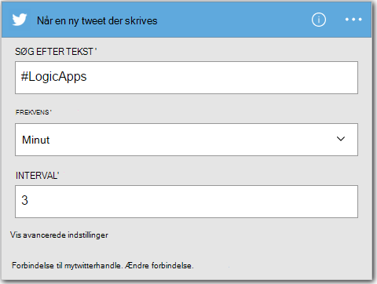
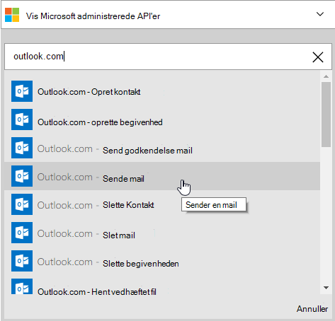
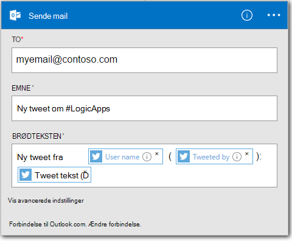

<properties
    pageTitle="Oprette en logik App | Microsoft Azure"
    description="Lær at oprette en logik App forbindelse SaaS tjenester"
    authors="jeffhollan"
    manager="dwrede"
    editor=""
    services="logic-apps"
    documentationCenter=""/>

<tags
    ms.service="logic-apps"
    ms.workload="na"
    ms.tgt_pltfrm="na"
    ms.devlang="na"
    ms.topic="get-started-article"
    ms.date="10/18/2016"
    ms.author="jehollan"/>

# Oprette en ny logik app forbindelse SaaS tjenester

I dette emne beskrives, hvordan, i et par minutter, du kan komme i gang med [Azure logik Apps](app-service-logic-what-are-logic-apps.md). Vi gennemgår en simpel arbejdsproces, kan du sende interessante tweets til din mail.

Hvis du vil bruge dette scenario, skal du:

- Et Azure-abonnement
- En Twitter-konto
- En Outlook.com eller hostet Office 365-postkasse

## Oprette en ny logik app Hvis du vil sende du tweets

1. Vælg **Ny**på [Azure portalen dashboard](https://portal.azure.com). 
2. Søge efter 'logik app' i søgepanelet, og vælg derefter **Logik App**. Du kan også vælge **Ny** **Web + Mobile**, og vælg **Logik App**. 
3. Angiv et navn til din logik app, Vælg en placering, ressourcegruppe, og vælg **Opret**.  Hvis du vælger **Fastgør til Dashboard** åbnes appen logik automatisk efter installation.  
4. Når du har åbnet din logik app for første gang kan du vælge fra en skabelon til at starte.  Klik på **Tom logik App** for at opbygge ud fra bunden for nu. 
1. Det første element, du vil oprette er udløseren.  Dette er den begivenhed, begynder din logik app.  Søge efter **twitter** i feltet udløser Søg, og vælg den.
7. Nu skal du skrive et søgeord udløses på.  **Hyppigheden** og **Interval** der bestemmer, hvor ofte din logik app søger efter nye tweets (og alle tweets under, tid omfanget ENTER).
    

5. Vælg knappen **nyt trin** , og vælg derefter **Tilføj en handling** eller **Tilføj en betingelse**
6. Når du vælger **Tilføj en handling**, kan du søge fra [tilgængelige forbindelser](../connectors/apis-list.md) til at vælge en handling. For eksempel kan du vælge **Outlook.com - Send mail** til at sende mail fra en outlook.com-adresse:  
    

7. Nu skal udfylde parametrene for den mail, du vil:  

8. Til sidst, kan du vælge **Gem** gøre din app logik live.

## Administrere din logik app efter oprettelse af

Nu er din logik app oppe at køre. Det søger med jævne mellemrum efter tweets med søgeordet har angivet. Når det finder en tilsvarende tweet, får det tilsendt en mail. Til sidst skal du se, hvordan du deaktiverer app eller se, hvordan den fungerer.

1. Gå til [Azure Portal](https://portal.azure.com)

1. Klik på **Gennemse** i venstre side af skærmen, og vælg **Logik Apps**.

2. Klik på den nye logik app, du lige har oprettet for at få vist aktuelle status og generelle oplysninger.

3. Hvis du vil redigere din nye logik app, skal du klikke på **Rediger**.

5. Hvis du vil deaktivere app, skal du klikke på **Deaktiver** i kommandolinjen.

1. Få vist Kør og udløser oversigter for at overvåge, når din logik app'en kører.  Du kan klikke på **Opdater** for at se de nyeste data.

På mindre end 5 minutter er du kan konfigurere en simpel logik app kører i skyen. Hvis du vil vide mere om at bruge logik Apps-funktioner, skal du se [Brug logik app-funktioner]. Hvis du vil vide mere om logik App definitionerne selv, se [forfatternavn logik App definitioner](app-service-logic-author-definitions.md).

<!-- Shared links -->
[Azure portal]: https://portal.azure.com
[Brug logik app-funktioner]: app-service-logic-create-a-logic-app.md
