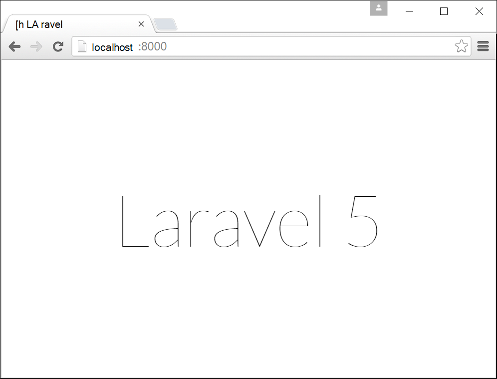

<properties
    pageTitle="Oprette, konfigurere og installere en PHP WebApp til Azure"
    description="En introduktion, der viser, hvordan du får en PHP (Laravel) web-app til at køre i Azure App-tjeneste. Lær, hvordan du konfigurerer Azure App tjenesten, så det opfylder kravene i den PHP, som du vælger."
    services="app-service\web"
    documentationCenter="php"
    authors="cephalin"
    manager="wpickett"
    editor=""
    tags="mysql"/>

<tags
    ms.service="app-service-web"
    ms.workload="web"
    ms.tgt_pltfrm="na"
    ms.devlang="PHP"
    ms.topic="article"
    ms.date="06/03/2016" 
    ms.author="cephalin"/>

# Oprette, konfigurere og installere en PHP WebApp til Azure

[AZURE.INCLUDE [tabs](../../includes/app-service-web-get-started-nav-tabs.md)]

Dette selvstudium viser, hvordan du opretter, konfigurere og installere en PHP WebApp til Azure, og hvordan du konfigurerer Azure App Service, så det opfylder kravene i din PHP WebApp. Ved slutningen af selvstudiet har du en fungerende [Laravel](https://www.laravel.com/) online kører direkte i [Azure App-tjeneste](../app-service/app-service-value-prop-what-is.md).

Som PHP udvikler, kan du tage dine foretrukne PHP framework til Azure. Dette selvstudium bruger Laravel blot som et eksempel på cement app. Du kan få mere at vide: 

- Installere ved hjælp af ciffer
- Angiv PHP version
- Bruge en startfil, der ikke er i programmet rodmappe
- Access-miljø-specifikke variabler
- Opdatere din app i Azure

Du kan anvende, hvad du lærer her til andre PHP webapps, du anvender Azure.

>[AZURE.INCLUDE [app-service-linux](../../includes/app-service-linux.md)] 

## Forudsætninger

- Installere [PHP 5.6.x](http://php.net/downloads.php) (PHP 7 support er beta)
- Installere [Komponist](https://getcomposer.org/download/)
- Installer [Azure CLI](../xplat-cli-install.md)
- Installere [ciffer](http://www.git-scm.com/downloads)
- Få en Microsoft Azure-konto. Hvis du ikke har en konto, kan du [tilmelde dig en gratis prøveversion](/pricing/free-trial/?WT.mc_id=A261C142F) eller [aktivere dine Visual Studio abonnement fordele](/pricing/member-offers/msdn-benefits-details/?WT.mc_id=A261C142F).

>[AZURE.NOTE] Se en WebApp i handling. [Prøv App Service](http://go.microsoft.com/fwlink/?LinkId=523751) med det samme og oprette en forbigående starter app – ingen kreditkort er påkrævet, ingen forpligtelser.

## Oprette en app PHP (Laravel) på computeren Udviklingscenter

1. Åbn en ny Windows-kommandoprompt, PowerShell-vinduet, Linux shell eller OS X terminal. Kør følgende kommandoer for at bekræfte, at de nødvendige værktøjer er installeret korrekt på din computer. 

        php --version
        composer --version
        azure --version
        git --version

    

    Hvis du ikke har installeret værktøjerne, kan du finde [forudsætninger](#Prerequisites) Hent links.
    
2. Installer Laravel som vist her:

        composer global require "laravel/installer

3. `CD`i en arbejdsmappe og oprette et nyt Laravel program som vist her:

        cd <working_directory>
        laravel new <app_name>

4. `CD`i det nyoprettede `<app_name>` directory og test appen som vist her:

        cd <app_name>
        php artisan serve
        
    Du bør kunne gå nu til http://localhost:8000 i en browser og se velkomstskærmen Laravel.
    
    
    
Så langt, skal du blot almindelige Laravel arbejdsprocessen, og du er ikke her for at <a href="https://laravel.com/docs/5.2" rel="nofollow">Få mere at vide Laravel</a>. Så lad os gå videre.

## Oprette en Azure-WebApp og konfigurere ciffer installation

>[AZURE.NOTE] "Vent! Hvad nu, hvis jeg gerne vil installere med FTP?" Der findes et [FTP-selvstudium](web-sites-php-mysql-deploy-use-ftp.md) til dine behov. 

Du kan oprette en WebApp i Azure App Service og implementerer ciffer-installation med en enkelt linje med kommandoen med CLI Azure. Lad os gøre dette.

1. Ændre til ASM tilstand, og log på Azure:

        azure config mode asm
        azure login
    
    Følg Hjælp-meddelelsen for at fortsætte logon.
    
    

4. Kør kommandoen til at oprette Azure online med ciffer installation. Når du bliver bedt om det, du Angiv antallet af det ønskede område.

        azure site create --git <app_name>
    
    
    
    >[AZURE.NOTE] Hvis du aldrig har konfigureret installation legitimationsoplysninger for abonnementet Azure, bliver du bedt om at oprette dem.. Disse legitimationsoplysninger, ikke dine Azure-kontolegitimationsoplysninger, der bruges af App Service kun for ciffer installationer og FTP-logon. 
    
    Denne kommando opretter en ny ciffer lager i den aktuelle mappe (med `git init`) og tilsluttes til lager i Azure som en remote ciffer (med `git remote add`).

<a name="configure"/>
## Konfigurere Azure WebApp

I din Laravel app til at arbejde i Azure, skal du være opmærksom på flere ting. Du bruger denne lignende opgave til din PHP framework efter valg.

- Konfigurere PHP 5.5.9 eller nyere. Du kan se [Seneste Laravel 5.2 serverkrav](https://laravel.com/docs/5.2#server-requirements) til hele listen over serverkrav. Resten af listen er udvidelser, der er allerede aktiveret ved Azure's PHP installationer. 
- Angive miljøvariabler din app skal. Laravel bruger den `.env` fil til nem konfiguration af miljøvariabler. Da det er ikke meningen bekræftes i versionsstyring (se [Laravel miljø konfiguration](https://laravel.com/docs/5.2/configuration#environment-configuration), du vil angive app indstillingerne for din Azure WebApp i stedet.
- Sørg for, at appen Laravel indsætningspunkt, `public/index.php`, er indlæst først. Se [Oversigt over Laravel livscyklus](https://laravel.com/docs/5.2/lifecycle#lifecycle-overview). Med andre ord, du vil angive den online rod URL-adressen til at pege på den `public` directory.
- Aktivere filtypenavnet komponist i Azure, fordi du har en composer.json. På den måde, kan du lade komponist bekymre dig om at få dine nødvendige pakker, når du installerer med `git push`. Det er et spørgsmål om nemmere. Hvis du ikke aktiverer komponist automatisering, skal du blot fjerne `/vendor` fra den `.gitignore` filen, så ciffer omfatter ("FN-ignorerer") alt i den `vendor` directory, når du gemmer og implementere kode.

Lad os konfigurere disse opgaver sekventielt.

4. Angiv den PHP version, der kræver, at din Laravel app.

        azure site set --php-version 5.6

    Du er færdig, angive PHP versionen! 
    
4. Oprette en ny `APP_KEY` for din Azure web app og angive den som en app indstilling af din Azure online.

        php artisan key:generate --show
        azure site appsetting add APP_KEY="<output_of_php_artisan_key:generate_--show>"

4. Desuden slå Laravel fejlfinding for at tilsidesætte alle kryptisk `Whoops, looks like something went wrong.` side.

        azure site appsetting add APP_DEBUG=true

    Det var indstilling miljøvariabler!
    
    >[AZURE.NOTE] Vent, Lad os langsommere lidt og forklare, hvad Laravel betyder, og hvad Azure betyder her. Laravel bruger den `.env` fil i rodmappen til at levere miljøvariabler til appen, hvor du kan finde linjen `APP_DEBUG=true` (samt `APP_KEY=...`). Denne variabel bruges i `config/app.php` af koden     `'debug' => env('APP_DEBUG', false),`. [ENV()](https://laravel.com/docs/5.2/helpers#method-env) er en Laravel hjælper metode, der bruger PHP [getenv()](http://php.net/manual/en/function.getenv.php) under overfladen.
    >
    >Dog `.env` ignoreres ved ciffer, fordi det er fremhævet den `.gitignore` fil i rodmappen. Bare `.env`  
 i din lokale ciffer lager er ikke overføres til Azure med resten af filerne. Naturligvis, kan du blot fjerne linjen fra `.gitignore`, men vi allerede har oprettet, gemmer filen i versionsstyring ikke anbefales. Dog du stadig har brug for en metode til at angive variablerne miljø i Azure. 
    >
    >Det positive er, at app indstillinger i Azure App Service understøtter [getenv()](http://php.net/manual/en/function.getenv.php)  
 i PHP. Så du kan bruge FTP- eller på anden måde for at overføre manuelt en `.env` fil til Azure, kan du blot angive de variabler, du vil som Azure-app indstillinger uden en `.env` i Azure, som du netop har foretaget dig. Desuden, hvis en variabel er i både en `.env` filen, og indstillingen Azure-app vinder i indstillingerne for Azure-app.     

4. De sidste to opgaver (den virtuelle mappe og aktivere komponist) kræver [Azure-portalen](https://portal.azure.com), så log på [portalen](https://portal.azure.com) med din Azure-konto.

4. Start fra menuen til venstre, skal du klikke på **App Services** > **&lt;app_name >** > **værktøjer**.

    
    
    >[AZURE.TIP] Hvis du klikker på **Indstillinger** i stedet for **værktøjer**, du vil kunne få adgang til **Programindstillinger**  
 blade, som gør det muligt at angive PHP versioner, app-indstillinger, og virtuelle mapper, som du netop har foretaget dig. 
    
4. Klik på **udvidelser** > **Tilføj** til at tilføje et filtypenavn.

4. Vælg **Komponist** i **Vælg lokalnummer** [blade](../azure-portal-overview.md) (*blade*: en portal-side, der åbnes vandret).

4. Klik på **OK** i bladet **Acceptér juridiske betingelser** . 

5. Klik på **OK** i bladet **Tilføj filtypenavn** .

    Når Azure er færdig tilføjer filtypenavnet, skal du se afsnittet en venlig pop op-meddelelse i hjørnet, samt  **Komponist** er angivet i bladet **filtypenavne** .

    

    Det var aktivering komponist!
    
4. Klik på **Indstillinger**tilbage i din online blade > **Programindstillinger**.

    

    Bemærk den PHP version, du angiver tidligere i bladet **Programindstillinger** :

    

    og app-indstillinger, du har tilføjet:
    
    

4. Rul til bunden af bladet og ændre den virtuelle rodmappe til at pege på **site\wwwroot\public** i stedet for **site\wwwroot**.

    

4. Klik på **Gem** øverst på bladet.

    Du er færdig, angive den virtuelle mappe! 

## Installer din WebApp med ciffer (og angive miljøvariabler)

Er du klar til at udrulle din kode nu. Du skal gøre dette tilbage i kommandoprompten eller terminal.

4. Acceptere alle ændringerne og installere din kode til Azure WebApp, som du ville gøre i en hvilken som helst ciffer lager:

        git add .
        git commit -m "Hurray! My first commit for my Azure app!"
        git push azure master 

    Når du kører `git push`, du vil blive bedt om at angive din adgangskode til installation af ciffer. Hvis du bliver bedt om at oprette installation legitimationsoplysninger på `azure site create` tidligere, skrive i feltet adgangskode, du har brugt.
    
5. Lad os se den kører i browseren ved at køre denne kommando:

        azure site browse

    Din browser skal vise velkomstskærmen Laravel.
    
    
    
    Tillykke, du har nu en Laravel WebApp i Azure.
             
## Foretage fejlfinding af almindelige fejl

Her er nogle de fejl, du kan støde på, når følge dette selvstudium:

- [Azure CLI viser "" websted"ikke er en azure kommandoen"](#clierror)
- [Online viser HTTP 403 fejl](#http403)
- [Online viser "Whoops, ser ud til at der opstod en fejl."](#whoops)
- [Online viser "Ingen understøttede kryptering fundet."](#encryptor)

### Azure CLI viser "" websted"ikke er en azure kommandoen"

Når du kører `azure site *` i kommandolinjen terminal skal du se fejlen`error:   'site' is not an azure command. See 'azure help'.` 

Det er normalt et resultat af Skift i til "ARM" (Azure Resource Manager) tilstand. Du kan løse problemet, skifte tilbage til "ASM" (Azure Service Management) tilstand ved at køre `azure config mode asm`.

### Online viser HTTP 403 fejl

Du har installeret din online til Azure korrekt, men når du går til din Azure online, får du en `HTTP 403` eller`You do not have permission to view this directory or page.`

Det er mest sandsynlige, fordi WebApp ikke kan finde indgangspunkt til appen Laravel. Sørg for, at du har ændret den virtuelle rodmappe til at pege på `site\wwwroot\public`, hvor Laravel's `index.php` er (se [konfiguration af Azure WebApp](#configure)).

### Online viser "Whoops, ser ud til at der opstod en fejl."

Du har installeret din online til Azure korrekt, men når du navigerer til din Azure WebApp, du får meddelelsen kryptisk`Whoops, looks like something went wrong.`

For at få en mere beskrivende fejl skal du aktivere Laravel fejlfinding ved at angive `APP_DEBUG` miljøvariablen til `true` (se [konfiguration af Azure WebApp](#configure)).

### Online viser "Ingen understøttede kryptering fundet."

Du har installeret din online til Azure korrekt, men når du går til din Azure online, får du en fejlmeddelelse om nedenfor:

    
Det er en yderst fejl, men mindst det er ikke kryptisk da du aktiveret Laravel fejlfinding. En overfladisk søgning strengens fejl i forummerne Laravel viser dig, at det er på grund af ikke angive APP_KEY i `.env`, eller i din sag ikke at have `.env` i Azure overhovedet. Du kan løse dette problem ved at tilføje indstillingen `APP_KEY` konfiguration som en Azure-app (se [konfiguration af Azure WebApp](#configure)).
    
## Næste trin

Lær at føje data til din app ved at [oprette en MySQL-database i Azure](../store-php-create-mysql-database.md). Se også mere nyttige links til PHP i Azure nedenfor:

- [PHP Developer Center](/develop/php/).
- [Oprette en web-app fra Azure Marketplace](app-service-web-create-web-app-from-marketplace.md)
- [Konfigurere PHP i Azure App Service Webapps](web-sites-php-configure.md)
- [Konvertere WordPress til flere lokationer i Azure App-tjeneste](web-sites-php-convert-wordpress-multisite.md)
- [Professionel WordPress på Azure App Service](web-sites-php-enterprise-wordpress.md)
