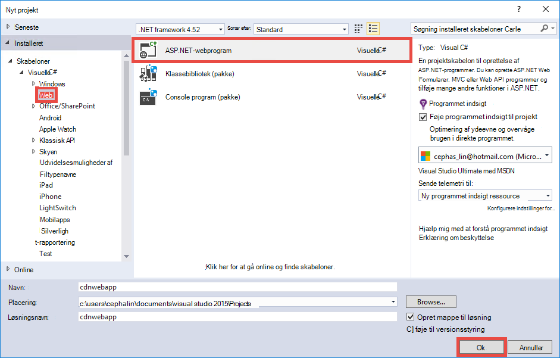

<properties 
    pageTitle="Bruge Azure CDN i Azure App-tjeneste" 
    description="Et selvstudium, som lærer du at installere en WebApp til Azure App-tjenesten, der fungerer indhold fra et integreret Azure CDN slutpunkt" 
    services="app-service\web,cdn" 
    documentationCenter=".net" 
    authors="cephalin" 
    manager="wpickett" 
    editor="jimbe"/>

<tags 
    ms.service="app-service" 
    ms.workload="tbd" 
    ms.tgt_pltfrm="na" 
    ms.devlang="dotnet" 
    ms.topic="article" 
    ms.date="07/01/2016" 
    ms.author="cephalin"/>


# <a name="use-azure-cdn-in-azure-app-service"></a>Bruge Azure CDN i Azure App-tjeneste

[App Service](http://go.microsoft.com/fwlink/?LinkId=529714) kan integreres med [Azure CDN](/services/cdn/), tilføje til de globale skalering funktioner, der er forbundet med [App Service Web Apps](http://go.microsoft.com/fwlink/?LinkId=529714) ved fungerer din web app-indhold globalt fra server noder i nærheden af dine kunder (en opdateret liste over alle aktuelle node placeringer kan findes [her](http://msdn.microsoft.com/library/azure/gg680302.aspx)). Denne integration kan øge ydeevnen for din Azure App Service Web Apps i scenarier som fungerer statiske billeder, og forbedrer din online brugeroplevelsen i hele verden. 

Integration Web Apps med Azure CDN giver dig følgende fordele:

- Integrere indholdsinstallation (billeder, scripts og typografiark) som en del af din online [fortløbende](app-service-continuous-deployment.md) installationsprocessen
- Opgrader nemt NuGet pakkerne i din online i Azure App-tjeneste, såsom jQuery eller Bootstrap versioner 
- Administrere dit webprogram og dit CDN served indhold fra den samme Visual Studio-grænseflade
- Integrere ASP.NET samler og minification med Azure CDN

[AZURE.INCLUDE [app-service-web-to-api-and-mobile](../../includes/app-service-web-to-api-and-mobile.md)] 

## <a name="what-you-will-build"></a>Hvad vil du opbygge ##

Du kan installere en WebApp til Azure App-tjenesten ved hjælp af standard ASP.NET MVC skabelon i Visual Studio, Tilføj kode for at levere indhold fra en integreret Azure CDN som et billede, controller handling resultater, og den standard JavaScript og CSS-filer, og også skrive programkode for at konfigurere fallback mulighed for pakker served, hvis CDN er offline.

## <a name="what-you-will-need"></a>Du skal bruge: ##

Dette selvstudium har følgende forudsætninger:

-   En aktiv [Microsoft Azure-konto](/account/)
-   Visual Studio 2015 med [Azure SDK til .NET](http://go.microsoft.com/fwlink/p/?linkid=323510&clcid=0x409). Hvis du bruger Visual Studio, kan trinnene variere.

> [AZURE.NOTE] Du skal bruge en Azure-konto til at udføre dette selvstudium:
> + Du kan [åbne en Azure-konto gratis](/pricing/free-trial/) – du får kredit du kan bruge til at prøve betalt Azure tjenester, og selv efter at de er vant du holder kontoen, og brug ledig Azure tjenester, som Web Apps.
> + Du kan [aktivere Visual Studio abonnement fordele](/pricing/member-offers/msdn-benefits-details/) – dit Visual Studio-abonnement giver dig kredit hver måned, som du kan bruge til betalt Azure services.
>
> Hvis du vil komme i gang med Azure App Service før tilmelding til en Azure-konto, skal du gå til [Prøve App Service](http://go.microsoft.com/fwlink/?LinkId=523751), hvor du straks kan oprette en forbigående starter WebApp i App-tjeneste. Ingen kreditkort, der kræves. ingen forpligtelser.

## <a name="deploy-a-web-app-to-azure-with-an-integrated-cdn-endpoint"></a>Installere en WebApp til Azure med et integreret CDN slutpunkt ##

I dette afsnit, skal du installere standard ASP.NET MVC programmet skabelon i Visual Studio 2015 til App-tjenesten og integrere den med et nyt CDN slutpunkt. Følg vejledningen nedenfor:

1. I Visual Studio-2015, oprette et nyt webprogram ASP.NET fra menulinjen ved at gå til **fil > Ny > projekt > Web > ASP.NET-webprogrammet**. Give den et navn, og klik på **OK**.

    

3. Vælg **MVC** , og klik på **OK**.

    

4. Hvis du ikke har logget på kontoen Azure endnu, skal du klikke på ikonet konto i det øverste højre hjørne, og følg dialogboksen til at logge på din Azure-konto. Når du er færdig, Konfigurer din app, som vist nedenfor, og derefter klikke på **Ny** for at oprette en ny App Service plan for din app.  

    

5. Konfigurere en ny App Service plan i dialogboksen, som vist nedenfor, og klik på **OK**. 

    

8. Klik på **Opret** for at oprette WebApp.

    

9. Når din ASP.NET-program er oprettet, publicere det i Azure i ruden Azure App serviceaktivitet ved at klikke på **Publicer `<app name>` til denne online nu**. Klik på **Publicer** for at fuldføre processen.

    

    Du får vist din publicerede online i browseren, når publicering er fuldført. 

1. Log på [Azure portal](https://portal.azure.com)for at oprette et CDN slutpunkt. 
2. Klik på **+ Ny** > **Media + CDN** > **CDN**.

    

3. Angiv **CDN**, **placering**, **ressourcegruppe**, **priser niveau**, og derefter klikke på **Opret**

       

4. Blade Klik på knappen **+ slutpunkt** i **CDN profil** . Give den et navn, Vælg **Web App** i rullemenuen **Origin Type** og din online i **Origin hostname** rullemenuen og derefter klikke på **Tilføj**.  

    


    > [AZURE.NOTE] Når der oprettes din CDN slutpunkt, viser bladet **slutpunkt** dig, dens CDN URL-adresse og den origin domæne, som det er integreret med. Dog kan det tage et øjeblik, før det nye CDN slutpunkts konfiguration, der skal overføres fuldstændigt til alle CDN node placeringer. 

3. Klik på navnet på den CDN slutpunkt, du lige har oprettet tilbage i bladet **slutpunkt** .

    

3. Klik på knappen **Konfigurer** . Vælg **Cache hver entydige URL-adresse** på **forespørgsel streng cachelagring funktionsmåde** rullelisten i bladet **Konfigurer** og derefter klikke på knappen **Gem** .


    

Når du aktiverer dette, cachelagres linket samme åbnes med forskellige forespørgselsstrenge som separate poster.

>[AZURE.NOTE] Mens aktivere forespørgselsstrengen ikke er nødvendigt for dette selvstudium, vil du gøre dette, så tidligt som muligt for nemmere siden ændringer her der skal tage tid at sprede til alle CDN noder, og du ikke vil have en hvilken som helst ikke forespørgsel-streng-aktiverede indhold for at fylde op CDN cachen (opdaterer CDN indhold beskrives senere).

2. Nu, gå til adressen, CDN slutpunkt. Hvis slutpunktet er klar, skal du se din online, vises. Hvis du får en **HTTP 404** -fejl, er du ikke klar CDN slutpunkt. Du skal muligvis vente til en time, så CDN konfigurationen kan overføres til alle noderne kant. 

    

1. Derefter skal du prøve at få adgang til filen **~/Content/bootstrap.css** i projektet ASP.NET. I browservinduet, gå til * *http://*&lt;cdnName >*.azureedge.net/Content/bootstrap.css**. I min konfiguration er denne URL-adresse:

        http://az673227.azureedge.net/Content/bootstrap.css

    Der svarer til følgende origin URL-adressen på CDN slutpunktet:

        http://cdnwebapp.azurewebsites.net/Content/bootstrap.css

    Når du navigerer til * *http://*&lt;cdnName >*.azureedge.net/Content/bootstrap.css**, bliver du bedt om at hente den bootstrap.css, der stammer fra din online i Azure. 

    

Du kan på samme måde få adgang til en hvilken som helst offentligt tilgængelige URL-adressen på * *http://*&lt;serviceName >*.cloudapp.net/** direkte fra din CDN slutpunkt. Eksempel:

-   En .js fil fra stien/script
-   En hvilken som helst indholdsfil fra mærket/Content sti
-   Controller/handlinger 
-   Hvis forespørgselsstrengen er aktiveret på din CDN slutpunkt, en URL-adresse med forespørgselsstrenge
-   Hele Azure web app, hvis alt indhold er offentlig

Bemærk, at det muligvis ikke altid en god ide (eller generelt en god ide) at kunne levere en hel Azure online via Azure CDN. Nogle af advarsler er:

-   Denne fremgangsmåde kræver, at hele webstedet skal være offentligt tilgængelig, fordi Azure CDN ikke kan fungere privat indhold.
-   Hvis CDN slutpunktet går offline for en eller anden grund, om planlagt vedligeholdelse eller brugerfejl, din hele online går offline medmindre kunderne kan blive omdirigeret til origin URL-adressen * *http://*&lt;sitename >*.azurewebsites.net/**. 
-   Selv med de brugerdefinerede Cache-Control-indstillinger (se [konfigurere indstillinger for cachelagring for statiske filer i din Azure online](#configure-caching-options-for-static-files-in-your-azure-web-app)), et CDN slutpunkt ikke forbedre ydeevnen for meget dynamisk indhold. Hvis du har forsøgt at indlæse siden hjem fra din CDN slutpunkt som vist ovenfor, Bemærk, at det tog mindst 5 sekunder for at indlæse standardstartsiden første gang, som er en ganske enkelt side. Forestil dig, hvad der ville ske til klient-oplevelsen, hvis denne side indeholder dynamisk indhold, der skal opdatere hvert minut. Fungerer dynamisk indhold fra et CDN slutpunkt kræver korte cachen udløb, som omsættes til hyppige udgivelsescachen på CDN slutpunkt. Det gør ondt ydeevnen for din Azure online og defeats formålet med et CDN.

Alternativet er at finde ud af, hvilket indhold der skal fungere fra Azure CDN på grundlag af tilfælde i din Azure online. Hertil, har du allerede set hvordan du kan få adgang til enkelte indhold filer fra CDN slutpunkt. Jeg viser dig, hvordan at kunne levere en bestemt controller handling gennem CDN slutpunktet i [levere indhold fra controller handlinger via Azure CDN](#serve-content-from-controller-actions-through-azure-cdn).

## <a name="configure-caching-options-for-static-files-in-your-azure-web-app"></a>Konfigurere indstillinger for cachelagring for statiske filer i din Azure online ##

Med Azure CDN integration i din Azure online, kan du angive, hvordan du vil statisk indhold cachelagres i CDN slutpunkt. Åbn *Web.config* fra projektet ASP.NET (fx **cdnwebapp**) for at gøre dette, og Tilføj en `<staticContent>` element til `<system.webServer>`. XML nedenfor konfigurerer cachen for at udløbe om 3 dage.  

    <system.webServer>
      <staticContent>
        <clientCache cacheControlMode="UseMaxAge" cacheControlMaxAge="3.00:00:00"/>
      </staticContent>
      ...
    </system.webServer>

Når du gør dette, se alle statiske filer i din Azure online samme reglen i din CDN cache. Tilføje en *Web.config* -fil til en anden mappe og tilføje dine indstillinger der mere detaljeret kontrol over cacheindstillinger. For eksempel føje en *Web.config* -fil til mappen *\Content* og erstatte indholdet med følgende XML:

    <?xml version="1.0"?>
    <configuration>
      <system.webServer>
        <staticContent>
          <clientCache cacheControlMode="UseMaxAge" cacheControlMaxAge="15.00:00:00"/>
        </staticContent>
      </system.webServer>
    </configuration>

Denne indstilling bevirker, at alle statiske filer fra mappen *\Content* cachelagres for 15 dage.

Du kan finde flere oplysninger om, hvordan du konfigurerer den `<clientCache>` element, se [Client Cache &lt;clientCache >](http://www.iis.net/configreference/system.webserver/staticcontent/clientcache).

I næste afsnit viser jeg også dig, hvordan du kan konfigurere cacheindstillinger controller handling resultater i CDN cachen.

## <a name="serve-content-from-controller-actions-through-azure-cdn"></a>Levere indhold fra controller handlinger via Azure CDN ##

Når du integrerer Web Apps med Azure CDN, er det relativt nemt at kunne levere indhold fra controller handlinger via Azure CDN. Igen, hvis du beslutter at kunne levere hele Azure online via din CDN, du behøver at gøre dette overhovedet, fordi alle controller handlingerne er tilgængelige via CDN allerede. Men på grund af jeg allerede fremhævet i [Implementer en Azure online med et integreret CDN slutpunkt](#deploy-a-web-app-to-azure-with-an-integrated-cdn-endpoint), kan du beslutte mod dette og vælge i stedet for at vælge den ønskede at betjene fra Azure CDN controller handling. [Maarten Balliauw](https://twitter.com/maartenballiauw) viser, hvordan du gør det med en sjov MemeGenerator controller i [reducere ventetid på internettet med Azure CDN](http://channel9.msdn.com/events/TechDays/Techdays-2014-the-Netherlands/Reducing-latency-on-the-web-with-the-Windows-Azure-CDN). Jeg vil blot genskabe det her.

Antag i din WebApp, du vil generere memes baseret på en små chucks Norris-billede (foto ved [Alan Light](http://www.flickr.com/photos/alan-light/218493788/)) sådan ud:


Du har en enkel `Index` handling, der gør det muligt for kunder til at angive superlatives i billedet, genererer derefter meme, når de sende indlæg til handlingen. Eftersom den er chucks Norris, forventer du denne side for at blive meget fra tur populære globalt. Dette er et godt eksempel på fungerer halvgennemsigtig dynamisk indhold med Azure CDN. 

Følg trinnene ovenfor for at konfigurere denne controller handling:

1. Oprette en ny .cs fil kaldet *MemeGeneratorController.cs* i mappen *\Controllers* , og Erstat indholdet med følgende kode. Erstatte din filstien til `~/Content/chuck.bmp` og dit CDN navn for `yourCDNName`.


        using System;
        using System.Collections.Generic;
        using System.Diagnostics;
        using System.Drawing;
        using System.IO;
        using System.Net;
        using System.Web.Hosting;
        using System.Web.Mvc;
        using System.Web.UI;

        namespace cdnwebapp.Controllers
        {
          public class MemeGeneratorController : Controller
          {
            static readonly Dictionary<string, Tuple<string ,string>> Memes = new Dictionary<string, Tuple<string, string>>();

            public ActionResult Index()
            {
              return View();
            }

            [HttpPost, ActionName("Index")]
            public ActionResult Index_Post(string top, string bottom)
            {
              var identifier = Guid.NewGuid().ToString();
              if (!Memes.ContainsKey(identifier))
              {
                Memes.Add(identifier, new Tuple<string, string>(top, bottom));
              }

              return Content("<a href=\"" + Url.Action("Show", new {id = identifier}) + "\">here's your meme</a>");
            }

            [OutputCache(VaryByParam = "*", Duration = 1, Location = OutputCacheLocation.Downstream)]
            public ActionResult Show(string id)
            {
              Tuple<string, string> data = null;
              if (!Memes.TryGetValue(id, out data))
              {
                return new HttpStatusCodeResult(HttpStatusCode.NotFound);
              }

              if (Debugger.IsAttached) // Preserve the debug experience
              {
                return Redirect(string.Format("/MemeGenerator/Generate?top={0}&bottom={1}", data.Item1, data.Item2));
              }
              else // Get content from Azure CDN
              {
                return Redirect(string.Format("http://<yourCDNName>.azureedge.net/MemeGenerator/Generate?top={0}&bottom={1}", data.Item1, data.Item2));
              }
            }

            [OutputCache(VaryByParam = "*", Duration = 3600, Location = OutputCacheLocation.Downstream)]
            public ActionResult Generate(string top, string bottom)
            {
              string imageFilePath = HostingEnvironment.MapPath("~/Content/chuck.bmp");
              Bitmap bitmap = (Bitmap)Image.FromFile(imageFilePath);

              using (Graphics graphics = Graphics.FromImage(bitmap))
              {
                SizeF size = new SizeF();
                using (Font arialFont = FindBestFitFont(bitmap, graphics, top.ToUpperInvariant(), new Font("Arial Narrow", 100), out size))
                {
                    graphics.DrawString(top.ToUpperInvariant(), arialFont, Brushes.White, new PointF(((bitmap.Width - size.Width) / 2), 10f));
                }
                using (Font arialFont = FindBestFitFont(bitmap, graphics, bottom.ToUpperInvariant(), new Font("Arial Narrow", 100), out size))
                {
                    graphics.DrawString(bottom.ToUpperInvariant(), arialFont, Brushes.White, new PointF(((bitmap.Width - size.Width) / 2), bitmap.Height - 10f - arialFont.Height));
                }
              }
              MemoryStream ms = new MemoryStream();
              bitmap.Save(ms, System.Drawing.Imaging.ImageFormat.Png);
              return File(ms.ToArray(), "image/png");
            }

            private Font FindBestFitFont(Image i, Graphics g, String text, Font font, out SizeF size)
            {
              // Compute actual size, shrink if needed
              while (true)
              {
                size = g.MeasureString(text, font);

                // It fits, back out
                if (size.Height < i.Height &&
                     size.Width < i.Width) { return font; }

                // Try a smaller font (90% of old size)
                Font oldFont = font;
                font = new Font(font.Name, (float)(font.Size * .9), font.Style);
                oldFont.Dispose();
              }
            }
          }
        }

2. Højreklik i standard `Index()` handling og vælge **Tilføj visning**.

    

3.  Acceptere indstillingerne nedenfor, og klik på **Tilføj**.

    

4. Åbn den nye *Views\MemeGenerator\Index.cshtml* og erstatte indholdet med følgende simple HTML til at sende superlatives:

        <h2>Meme Generator</h2>
        
        <form action="" method="post">
            <input type="text" name="top" placeholder="Enter top text here" />
            <br />
            <input type="text" name="bottom" placeholder="Enter bottom text here" />
            <br />
            <input class="btn" type="submit" value="Generate meme" />
        </form>

5. Udgive til Azure online igen, og gå til * *http://*&lt;serviceName >*.cloudapp.net/MemeGenerator/Index** i din browser. 

Når du sender formularværdier til `/MemeGenerator/Index`, `Index_Post` handling metode returnerer et link til den `Show` handling metode med respektive input-id. Når du klikker på linket, kan du når følgende kode:  

    [OutputCache(VaryByParam = "*", Duration = 1, Location = OutputCacheLocation.Downstream)]
    public ActionResult Show(string id)
    {
      Tuple<string, string> data = null;
      if (!Memes.TryGetValue(id, out data))
      {
        return new HttpStatusCodeResult(HttpStatusCode.NotFound);
      }

      if (Debugger.IsAttached) // Preserve the debug experience
      {
        return Redirect(string.Format("/MemeGenerator/Generate?top={0}&bottom={1}", data.Item1, data.Item2));
      }
      else // Get content from Azure CDN
      {
        return Redirect(string.Format("http://<yourCDNName>.azureedge.net/MemeGenerator/Generate?top={0}&bottom={1}", data.Item1, data.Item2));
      }
    }

Hvis din lokale fejlfindingen er tilsluttet, så får du den almindelige fejlfinding oplevelse med en lokal omdirigering. Hvis det kører i Azure WebApp, omdirigerer den til:

    http://<yourCDNName>.azureedge.net/MemeGenerator/Generate?top=<formInput>&bottom=<formInput>

Der svarer til følgende origin URL-adressen på dit CDN slutpunkt:

    http://<yourSiteName>.azurewebsites.net/cdn/MemeGenerator/Generate?top=<formInput>&bottom=<formInput>

Når URL-adressen på omskrivning regel, der tidligere er anvendt, er den faktiske fil, bliver cachelagret til din CDN slutpunkt:

    http://<yourSiteName>.azurewebsites.net/MemeGenerator/Generate?top=<formInput>&bottom=<formInput>

Du kan bruge den `OutputCacheAttribute` attributten i den `Generate` metode til at angive, hvordan resultatet handling skal gemmes i cachen, som vil overholde Azure CDN. Nedenstående kode angive et cachen udløb af 1 time (3.600 sekunder).

    [OutputCache(VaryByParam = "*", Duration = 3600, Location = OutputCacheLocation.Downstream)]

På samme måde, du kan tjene indhold fra noget controller i din Azure online via din Azure CDN med den ønskede indstilling for cachelagring.

I næste afsnit viser jeg dig, hvordan at kunne levere pakket og minified scripts og CSS via Azure CDN. 

## <a name="integrate-aspnet-bundling-and-minification-with-azure-cdn"></a>Integrere ASP.NET samler og minification med Azure CDN ##

Scripts og CSS typografiark ændres sjældent og er primære kandidater til Azure CDN cachen. Fungerer på hele online via din Azure CDN er den nemmeste måde at integrere samler og minification med Azure CDN. Men, som du kan vælge mod denne metode på grund af er beskrevet i [integrere et Azure CDN slutpunkt med Azure web app og tjener statisk indholdet på dine websider fra Azure CDN](#deploy-a-web-app-to-azure-with-an-integrated-cdn-endpoint), jeg viser dig, hvordan det kan gøres og samtidig bevare den ønskede develper oplevelse af ASP.NET samler og minification, f.eks.:

-   Gode fejlfinding tilstand oplevelse
-   Strømlinet installation
-   Øjeblikkelig opdateringer til klienter til script/CSS version opgraderinger
-   Fallback ordning, når din CDN slutpunkt mislykkes
-   Minimere kode ændring

Åbn *App_Start\BundleConfig.cs* i det ASP.NET-projekt, du oprettede i [integrere et Azure CDN slutpunkt med Azure web app og tjener statisk indholdet på dine websider fra Azure CDN](#deploy-a-web-app-to-azure-with-an-integrated-cdn-endpoint), og se nærmere på de `bundles.Add()` metode opkald.

    public static void RegisterBundles(BundleCollection bundles)
    {
        bundles.Add(new ScriptBundle("~/bundles/jquery").Include(
                    "~/Scripts/jquery-{version}.js"));
        ...
    }

Først `bundles.Add()` sætning føjer et script samlet på den virtuelle mappe `~/bundles/jquery`. Åbn derefter *Views\Shared\_Layout.cshtml* at se, hvordan mærket script samlet gengives. Du skal ikke kunne finde følgende linje i Razor kode:

    @Scripts.Render("~/bundles/jquery")

Når denne Razor-kode køres i Azure WebApp, det gengiver en `<script>` mærke til det script samlet stil med følgende: 

    <script src="/bundles/jquery?v=FVs3ACwOLIVInrAl5sdzR2jrCDmVOWFbZMY6g6Q0ulE1"></script>

Men, når den kører i Visual Studio ved at skrive `F5`, det gengiver hver scriptfil i samlet individuelt (i ovenstående tilfælde kun én script-fil er i samlet):

    <script src="/Scripts/jquery-1.10.2.js"></script>

Dette gør det muligt at foretage fejlfinding JavaScript-kode i dit udviklingsmiljø, mens reducere samtidige klientforbindelser (samler) og forbedre fil Hent ydeevne (minification) i fremstilling. Det er en god funktion til at bevare med Azure CDN integration. Desuden da gengivne samlet indeholder allerede en automatisk oprettede versionsstreng, vil du gentage denne funktionalitet, så når du opdaterer din jQuery version gennem NuGet, det kan blive opdateret på klientsiden så tidligt som muligt.

Følg trinnene nedenfor for integration ASP.NET samler og minification med din CDN slutpunkt.

1. Tilbage i *App_Start\BundleConfig.cs*, ændre den `bundles.Add()` metoder til at bruge en anden [Samlet parametre](http://msdn.microsoft.com/library/jj646464.aspx), en, der angiver et CDN adresse. Du kan erstatte den `RegisterBundles` metode definition med følgende kode:  
    
        public static void RegisterBundles(BundleCollection bundles)
        {
          bundles.UseCdn = true;
          var version = System.Reflection.Assembly.GetAssembly(typeof(Controllers.HomeController))
            .GetName().Version.ToString();
          var cdnUrl = "http://<yourCDNName>.azureedge.net/{0}?" + version;

          bundles.Add(new ScriptBundle("~/bundles/jquery", string.Format(cdnUrl, "bundles/jquery")).Include(
                "~/Scripts/jquery-{version}.js"));

          bundles.Add(new ScriptBundle("~/bundles/jqueryval", string.Format(cdnUrl, "bundles/jqueryval")).Include(
                "~/Scripts/jquery.validate*"));

          // Use the development version of Modernizr to develop with and learn from. Then, when you're
          // ready for production, use the build tool at http://modernizr.com to pick only the tests you need.
          bundles.Add(new ScriptBundle("~/bundles/modernizr", string.Format(cdnUrl, "bundles/modernizr")).Include(
                "~/Scripts/modernizr-*"));

          bundles.Add(new ScriptBundle("~/bundles/bootstrap", string.Format(cdnUrl, "bundles/bootstrap")).Include(
                "~/Scripts/bootstrap.js",
                "~/Scripts/respond.js"));

          bundles.Add(new StyleBundle("~/Content/css", string.Format(cdnUrl, "Content/css")).Include(
                "~/Content/bootstrap.css",
                "~/Content/site.css"));
        }


    Sørg for at erstatte `<yourCDNName>` med navnet på din Azure CDN.

    Dine egne ord, du skal angive `bundles.UseCdn = true` og føjet en nøje udformet CDN URL-adresse til hver samlet. For eksempel den første parametre i koden:

        new ScriptBundle("~/bundles/jquery", string.Format(cdnUrl, "bundles/jquery"))

    er den samme som: 

        new ScriptBundle("~/bundles/jquery", string.Format(cdnUrl, "http://<yourCDNName>.azureedge.net/bundles/jquery?<W.X.Y.Z>"))

    Denne konstruktør fortæller ASP.NET samler og minification til at gengive individuelle scriptfiler når foretages fejlfinding lokalt, men bruge den angivne CDN adresse at få adgang til det pågældende script. Bemærk imidlertid to vigtige egenskaber med denne nøje udformet CDN URL-adresse:
    
    - Kilde til denne CDN URL-adresse er `http://<yourSiteName>.azurewebsites.net/bundles/jquery?<W.X.Y.Z>`, som er den virtuelle mappe af script samlet i dit webprogram.
    - Da du bruger CDN parametre, indeholder mærket CDN script til samlet ikke længere automatisk oprettede versionsstrengen i gengivne URL-adressen. Du skal manuelt oprette en entydig versionsstreng, hver gang script samlet ændres for at tvinge en fundne forekomster på din Azure CDN. På samme tid, skal denne entydige versionsstreng forbliver konstante gennem aktivets levetid installation til at maksimere i cachen på din Azure CDN, når samlet er distribueret.

3. Forespørgselsstrengen `<W.X.Y.Z>` henter fra *Properties\AssemblyInfo.cs* i projektet ASP.NET. Du kan have en arbejdsproces for installation, der indeholder stigende samlingsversion, hver gang du publicerer til Azure. Eller du kan kun redigere *Properties\AssemblyInfo.cs* i dit projekt skal forøges versionsstrengen automatisk, hver gang du opretter, ved hjælp af jokertegnet ' *'. Eksempelvis ændre `AssemblyVersion` som vist nedenfor:
    
        [assembly: AssemblyVersion("1.0.0.*")]
    
    Andre strategi til at strømline Genererer en entydig streng i en installation levetid fungerer her.

3. Genpublicere ASP.NET-program, og få adgang til startsiden.
 
4. Få vist HTML-koden for siden. Du skal kunne se CDN URL-adressen, der gengives med en entydig version hver gang du genpublicere ændringer til din Azure online. Eksempel:  
    
        ...
        <link href="http://az673227.azureedge.net/Content/css?1.0.0.25449" rel="stylesheet"/>
        <script src="http://az673227.azureedge.net/bundles/modernizer?1.0.0.25449"></script>
        ...
        <script src="http://az673227.azureedge.net/bundles/jquery?1.0.0.25449"></script>
        <script src="http://az673227.azureedge.net/bundles/bootstrap?1.0.0.25449"></script>
        ...

5. I Visual Studio, udføre fejlfinding i ASP.NET-programmet i Visual Studio ved at skrive `F5`., 

6. Få vist HTML-koden for siden. Du ser stadig hver scriptfil gengives enkeltvis, så du kan have en ensartet fejlfinding i Visual Studio-oplevelse.  
    
        ...
        <link href="/Content/bootstrap.css" rel="stylesheet"/>
        <link href="/Content/site.css" rel="stylesheet"/>
        <script src="/Scripts/modernizr-2.6.2.js"></script>
        ...
        <script src="/Scripts/jquery-1.10.2.js"></script>
        <script src="/Scripts/bootstrap.js"></script>
        <script src="/Scripts/respond.js"></script>
        ...    

## <a name="fallback-mechanism-for-cdn-urls"></a>Fallback mulighed for CDN URL-adresser ##

Når din Azure CDN slutpunkt af en eller anden grund ikke lykkes, vil du websiden skal være i stand til at få adgang til webserveren origin som indstillingen fallback for indlæsning af JavaScript eller Bootstrap. Det er alvorlige nok at miste billeder på din online på grund af CDN utilgængelighed, men meget mere dårlige at miste afgørende page-funktioner, der leveres af scripts og typografiark.

Klassen [Samlet](http://msdn.microsoft.com/library/system.web.optimization.bundle.aspx) indeholder en egenskab, der kaldes [CdnFallbackExpression](http://msdn.microsoft.com/library/system.web.optimization.bundle.cdnfallbackexpression.aspx) , der gør det muligt at konfigurere fallback mulighed for CDN fejl. Hvis du vil bruge denne egenskab, skal du følge nedenstående trin:

1. Åbn i projektet ASP.NET *App_Start\BundleConfig.cs*, hvor du har tilføjet en CDN URL-adresse i hver [Samlet parametre](http://msdn.microsoft.com/library/jj646464.aspx), og Tilføj `CdnFallbackExpression` kode på fire steder, som vist at føje en fallback ordning til standard-pakker.  
    
        public static void RegisterBundles(BundleCollection bundles)
        {
          var version = System.Reflection.Assembly.GetAssembly(typeof(BundleConfig))
            .GetName().Version.ToString();
          var cdnUrl = "http://cdnurl.azureedge.net/.../{0}?" + version;
          bundles.UseCdn = true;

          bundles.Add(new ScriptBundle("~/bundles/jquery", string.Format(cdnUrl, "bundles/jquery")) 
                { CdnFallbackExpression = "window.jquery" }
                .Include("~/Scripts/jquery-{version}.js"));

          bundles.Add(new ScriptBundle("~/bundles/jqueryval", string.Format(cdnUrl, "bundles/jqueryval")) 
                { CdnFallbackExpression = "$.validator" }
                .Include("~/Scripts/jquery.validate*"));

          // Use the development version of Modernizr to develop with and learn from. Then, when you're
          // ready for production, use the build tool at http://modernizr.com to pick only the tests you need.
          bundles.Add(new ScriptBundle("~/bundles/modernizr", string.Format(cdnUrl, "bundles/modernizer")) 
                { CdnFallbackExpression = "window.Modernizr" }
                .Include("~/Scripts/modernizr-*"));

          bundles.Add(new ScriptBundle("~/bundles/bootstrap", string.Format(cdnUrl, "bundles/bootstrap"))     
                { CdnFallbackExpression = "$.fn.modal" }
                .Include(
                        "~/Scripts/bootstrap.js",
                        "~/Scripts/respond.js"));

          bundles.Add(new StyleBundle("~/Content/css", string.Format(cdnUrl, "Content/css")).Include(
                "~/Content/bootstrap.css",
                "~/Content/site.css"));
        }

    Når `CdnFallbackExpression` er ikke null-værdi, script er tilføjet i HTML-koden til at teste, om samlet er indlæst og, hvis ikke, få adgang til samlet direkte fra den oprindelige Web-server. Denne egenskab, skal være indstillet til et JavaScript-udtryk, der tester, om de respektive CDN samlet er indlæst korrekt. Det udtryk, der er behov for at teste hver samlet varierer, afhængigt af indholdet. For ovenstående standard pakker:
    
    - `window.jquery`er defineret i jquery-{version} .js
    - `$.validator`er defineret i jquery.validate.js
    - `window.Modernizr`er defineret i modernizer-{version} .js
    - `$.fn.modal`er defineret i bootstrap.js
    
    Du har måske bemærket, at jeg ikke har angivet CdnFallbackExpression for den `~/Cointent/css` samlet. Dette skyldes, at der er i øjeblikket [fejl i System.Web.Optimization](https://aspnetoptimization.codeplex.com/workitem/104) fra serveren en `<script>` mærke for fallback CSS i stedet for den forventede `<link>` mærke.
    
    Der er dog god [Typografi samlet reserve](https://github.com/EmberConsultingGroup/StyleBundleFallback) tilbydes efter [Ember Consulting gruppe](https://github.com/EmberConsultingGroup). 

2. Oprette en ny .cs-fil i projektet ASP.NET *App_Start* mappe med navnet *StyleBundleExtensions.cs*for at bruge denne løsning for CSS, og Erstat dens indhold med [kode fra GitHub](https://github.com/EmberConsultingGroup/StyleBundleFallback/blob/master/Website/App_Start/StyleBundleExtensions.cs). 

4. Omdøb navneområdet *App_Start\StyleFundleExtensions.cs*til ASP.NET-program navneområde (fx **cdnwebapp**). 

3. Gå tilbage til `App_Start\BundleConfig.cs` og erstatte sidst `bundles.Add` sætningen med følgende kode:  

        bundles.Add(new StyleBundle("~/Content/css", string.Format(cdnUrl, "Content/css"))
          .IncludeFallback("~/Content/css", "sr-only", "width", "1px")
          .Include(
            "~/Content/bootstrap.css",
            "~/Content/site.css"));

    Denne nye lokalnummer metode bruger den samme ide skal tilføjes script i HTML til at kontrollere DOM for den en tilsvarende klassenavnet, regelnavn og regel værdi, der er defineret i CSS samlet og falder tilbage til den oprindelige Web-server, hvis det ikke lykkes at finde samme.

4. Udgive til din Azure online igen, og få adgang til startsiden. 
5. Få vist HTML-koden for siden. Du skal finde indkoblet scripts som følger:    
    
    ```
    ...
    <link href="http://az673227.azureedge.net/Content/css?1.0.0.25474" rel="stylesheet"/>
<script>(function() {
                var loadFallback,
                    len = document.styleSheets.length;
                for (var i = 0; i < len; i++) {
                    var sheet = document.styleSheets[i];
                    if (sheet.href.indexOf('http://az673227.azureedge.net/Content/css?1.0.0.25474') !== -1) {
                        var meta = document.createElement('meta');
                        meta.className = 'sr-only';
                        document.head.appendChild(meta);
                        var value = window.getComputedStyle(meta).getPropertyValue('width');
                        document.head.removeChild(meta);
                        if (value !== '1px') {
                            document.write('<link href="/Content/css" rel="stylesheet" type="text/css" />');
                        }
                    }
                }
                return true;
            }())||document.write('<script src="/Content/css"><\/script>');</script>

    <script src="http://az673227.azureedge.net/bundles/modernizer?1.0.0.25474"></script>
    <script>(window.Modernizr)||document.write('<script src="/bundles/modernizr"><\/script>');</script>
    ... 
    <script src="http://az673227.azureedge.net/bundles/jquery?1.0.0.25474"></script>
    <script>(window.jquery)||document.write('<script src="/bundles/jquery"><\/script>');</script>

    <script src="http://az673227.azureedge.net/bundles/bootstrap?1.0.0.25474"></script>
    <script>($.fn.modal)||document.write('<script src="/bundles/bootstrap"><\/script>');</script>
    ...
    ```

    Bemærk, at indplantet script til CSS samlet stadig indeholder den fejlbehæftede rest fra den `CdnFallbackExpression` egenskab i linjen:

        }())||document.write('<script src="/Content/css"><\/script>');</script>

    Men siden den første del af den || udtrykket returnere altid SAND (i linjen direkte over den), funktionen document.write() kører aldrig.

6. Hvis du vil teste, om fallback scriptet virker, gå tilbage til den din CDN slutpunkt blade og klikke på **Stop**.

    

7. Opdater browservinduet til Azure WebApp. Du bør nu se, at alle scripts og typografiark er indlæst korrekt.

## <a name="more-information"></a>Få mere at vide 
- [Oversigt over Azure Content Delivery netværk (CDN)](../cdn/cdn-overview.md)
- [Brug af Azure CDN](../cdn/cdn-create-new-endpoint.md)
- [Integrere en skybaseret tjeneste med Azure CDN](../cdn/cdn-cloud-service-with-cdn.md)
- [ASP.NET samler og Minification](http://www.asp.net/mvc/tutorials/mvc-4/bundling-and-minification)

