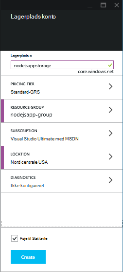
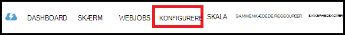
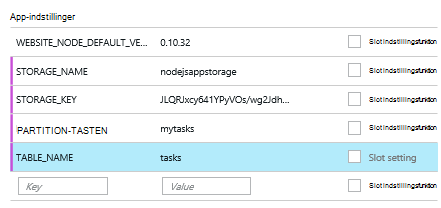

<properties
    pageTitle="Node.js online ved hjælp af tjenesten Azure-tabel"
    description="Dette selvstudium lærer du at bruge tjenesten Azure-tabel ved for at gemme data fra et program, Node.js som hostes i Azure App Service Web Apps."
    tags="azure-portal"
    services="app-service\web, storage"
    documentationCenter="nodejs"
    authors="rmcmurray"
    manager="wpickett"
    editor=""/>

<tags
    ms.service="storage"
    ms.workload="storage"
    ms.tgt_pltfrm="na"
    ms.devlang="nodejs"
    ms.topic="article"
    ms.date="08/11/2016"
    ms.author="robmcm"/>

# Node.js online ved hjælp af tjenesten Azure-tabel

## Oversigt

Dette selvstudium viser, hvordan du bruger tabel tjeneste fra Azure datastyring til at gemme og få adgang til data fra en [node] -program, der er hostet i [Azure App Service](http://go.microsoft.com/fwlink/?LinkId=529714) Web Apps. Dette selvstudium antages det, at du har nogle tidligere oplevelse ved hjælp af node og [ciffer].

Du kan få mere at vide:

* Sådan bruges npm (node pakke manager) til at installere node modulerne

* Sådan arbejder du med tjenesten Azure-tabel

* Sådan bruges Azure CLI til at oprette en WebApp.

Ved at følge dette selvstudium, du vil oprette en enkel webbaseret "opgaveliste" program, der kan oprette, hente og udføre opgaver. Opgaverne, der er gemt i tjenesten tabel.

Her er det færdige program:

![En webside, der viser en tom vha][node-table-finished]

>[AZURE.NOTE] Hvis du vil komme i gang med Azure App Service før tilmelding til en Azure-konto, skal du gå til [Prøve App Service](http://go.microsoft.com/fwlink/?LinkId=523751), hvor du straks kan oprette en forbigående starter WebApp i App-tjeneste. Ingen kreditkort, der kræves. ingen forpligtelser.

## Forudsætninger

Før du følge vejledningen i denne artikel kan du sikre dig, at du har installeret følgende:

* [node] version 0.10.24 eller nyere

* [Ciffer]

[AZURE.INCLUDE [create-account-and-websites-note](../../includes/create-account-and-websites-note.md)]

## Oprette en lagerplads-konto

Opret en konto til Azure-lager. Appen Brug denne konto til at gemme opgaveelementer.

1.  Log på [Azure-portalen](https://portal.azure.com/).

2. Klik på ikonet **Ny** på nederst til venstre i portalen, og klik derefter på **Data + lagerplads** > **lagerplads**. Giv kontoen lagerplads et entydigt navn, og oprette en ny [ressourcegruppe](../azure-resource-manager/resource-group-overview.md) til den.

    

    Når kontoen lagerplads er blevet oprettet, knappen **beskeder** blinker en grøn **succes** og lagerplads firmaets blade er åben til at vise, at den hører til den nye ressourcegruppe, du har oprettet.

5. Klik på **Indstillinger**i lagerplads firmaets blade > **taster**. Kopiere den primære hurtigtast til Udklipsholder.

    ![Hurtigtast][portal-storage-access-keys]

##Installere moduler og generere stilladser

I dette afsnit kan du oprette et nyt Node-program og bruger npm til at føje modul pakker. Du skal bruge [Express] og [Azure] modulerne for dette program. Modulet Express giver en Model Vis Controller ramme for node, mens de Azure moduler indeholder forbindelse til tjenesten tabel.

### Installere express og generere stilladser

1. Fra kommandolinjen skal du oprette en ny mappe med navnet **vha** og skifte til den pågældende mappe.  

2. Skriv følgende kommando for at installere modulet Express.

        npm install express-generator@4.2.0 -g

    Afhængigt af operativsystemet skal du placere 'sudo' før kommandoen:

        sudo npm install express-generator@4.2.0 -g

    Output vises som i følgende eksempel:

        express-generator@4.2.0 /usr/local/lib/node_modules/express-generator
        ├── mkdirp@0.3.5
        └── commander@1.3.2 (keypress@0.1.0)

    > [AZURE.NOTE] Den '-g' parameter installerer modulet globalt. På den måde, kan vi bruge **Hurtig** til at generere web app stilladser uden at skrive oplysninger om yderligere sti.

4. Angiv **udtrykkelig** kommandoen for at oprette stilladser for programmet:

        express

    Output fra denne kommando vises som i følgende eksempel:

           create : .
           create : ./package.json
           create : ./app.js
           create : ./public
           create : ./public/images
           create : ./routes
           create : ./routes/index.js
           create : ./routes/users.js
           create : ./public/stylesheets
           create : ./public/stylesheets/style.css
           create : ./views
           create : ./views/index.jade
           create : ./views/layout.jade
           create : ./views/error.jade
           create : ./public/javascripts
           create : ./bin
           create : ./bin/www

           install dependencies:
             $ cd . && npm install

           run the app:
             $ DEBUG=my-application ./bin/www

    Du har nu flere nye mapper og filer i mappen **vha** .

### Installere yderligere moduler

En af filerne, der **udtrykkelig** opretter er **package.json**. Denne fil indeholder en liste over modul afhængigheder. Senere, når du installerer programmet til App-tjenesten Web Apps, denne fil bestemmer, hvilke moduler skal installeres på Azure.

Skriv følgende kommando for at installere de moduler, der er beskrevet i filen **package.json** fra kommandolinjen. Du skal muligvis bruge 'sudo'.

    npm install

Output fra denne kommando vises som i følgende eksempel:

    debug@0.7.4 node_modules\debug

    cookie-parser@1.0.1 node_modules\cookie-parser
    ├── cookie-signature@1.0.3
    └── cookie@0.1.0

    [...]

Derefter skal du angive følgende kommando for at installere [azure], [node uuid], [nconf] og [asynkron] modulerne:

    npm install azure-storage node-uuid async nconf --save

Den **– Gem** flag tilføjer poster for disse moduler til filen **package.json** .

Output fra denne kommando vises som i følgende eksempel:

    async@0.9.0 node_modules\async

    node-uuid@1.4.1 node_modules\node-uuid

    nconf@0.6.9 node_modules\nconf
    ├── ini@1.2.1
    ├── async@0.2.9
    └── optimist@0.6.0 (wordwrap@0.0.2, minimist@0.0.10)

    [...]

## Oprette programmet

Nu er vi klar til at oprette programmet.

### Oprette en model

En *model* er et objekt, der repræsenterer dataene i dit program. For programmet er kun modellen et opgaveobjekt,, der repræsenterer et element på opgavelisten. Opgaver har følgende felter:

- PartitionKey
- RowKey
- navn (streng)
- kategori (streng)
- færdige (boolesk)

**PartitionKey** og **RowKey** bruges af tjenesten tabel som tabel nøgler. Du kan finde flere oplysninger, kan du se [om datamodellen tabel-tjenesten](https://msdn.microsoft.com/library/azure/dd179338.aspx).

1. Oprette en ny mappe med navnet **modeller**i mappen **vha** .

2. Oprette en ny fil med navnet **task.js**i mappen **modeller** . Denne fil indeholder modellen for de opgaver, der er oprettet af programmet.

3. Føj følgende kode for at referere til påkrævede biblioteker i starten af filen **task.js** :

        var azure = require('azure-storage');
        var uuid = require('node-uuid');
        var entityGen = azure.TableUtilities.entityGenerator;

4. Tilføj følgende kode for at definere og eksportere objektet opgave. Dette objekt er ansvarlig for at oprette forbindelse til tabellen.

        module.exports = Task;

        function Task(storageClient, tableName, partitionKey) {
          this.storageClient = storageClient;
          this.tableName = tableName;
          this.partitionKey = partitionKey;
          this.storageClient.createTableIfNotExists(tableName, function tableCreated(error) {
            if(error) {
              throw error;
            }
          });
        };

5. Føj følgende kode for at definere flere metoder til objektet opgave, som gør det muligt interaktion med data, der gemmes i tabellen:

        Task.prototype = {
          find: function(query, callback) {
            self = this;
            self.storageClient.queryEntities(this.tableName, query, null, function entitiesQueried(error, result) {
              if(error) {
                callback(error);
              } else {
                callback(null, result.entries);
              }
            });
          },

          addItem: function(item, callback) {
            self = this;
            // use entityGenerator to set types
            // NOTE: RowKey must be a string type, even though
            // it contains a GUID in this example.
            var itemDescriptor = {
              PartitionKey: entityGen.String(self.partitionKey),
              RowKey: entityGen.String(uuid()),
              name: entityGen.String(item.name),
              category: entityGen.String(item.category),
              completed: entityGen.Boolean(false)
            };
            self.storageClient.insertEntity(self.tableName, itemDescriptor, function entityInserted(error) {
              if(error){  
                callback(error);
              }
              callback(null);
            });
          },

          updateItem: function(rKey, callback) {
            self = this;
            self.storageClient.retrieveEntity(self.tableName, self.partitionKey, rKey, function entityQueried(error, entity) {
              if(error) {
                callback(error);
              }
              entity.completed._ = true;
              self.storageClient.updateEntity(self.tableName, entity, function entityUpdated(error) {
                if(error) {
                  callback(error);
                }
                callback(null);
              });
            });
          }
        }

6. Gem og Luk filen **task.js** .

### Oprette en controller

En *controller* håndterer HTTP-anmodninger og gengiver HTML svaret.

1. Opret en ny fil med navnet **tasklist.js** i mappen **vha/omdirigerer** og åbne den i et tekstredigeringsprogram.

2. Tilføj følgende kode til **tasklist.js**. Azure og asynkron moduler, der bruges af **tasklist.js**indlæses. Dette definerer også funktionen **vha** , som der overføres en forekomst af objektet **opgave** , som vi definerede tidligere:

        var azure = require('azure-storage');
        var async = require('async');

        module.exports = TaskList;

3. Definere et objekt **vha** .

        function TaskList(task) {
          this.task = task;
        }

4. Føje følgende metoder til **vha**:

        TaskList.prototype = {
          showTasks: function(req, res) {
            self = this;
            var query = new azure.TableQuery()
              .where('completed eq ?', false);
            self.task.find(query, function itemsFound(error, items) {
              res.render('index',{title: 'My ToDo List ', tasks: items});
            });
          },

          addTask: function(req,res) {
            var self = this;
            var item = req.body.item;
            self.task.addItem(item, function itemAdded(error) {
              if(error) {
                throw error;
              }
              res.redirect('/');
            });
          },

          completeTask: function(req,res) {
            var self = this;
            var completedTasks = Object.keys(req.body);
            async.forEach(completedTasks, function taskIterator(completedTask, callback) {
              self.task.updateItem(completedTask, function itemsUpdated(error) {
                if(error){
                  callback(error);
                } else {
                  callback(null);
                }
              });
            }, function goHome(error){
              if(error) {
                throw error;
              } else {
               res.redirect('/');
              }
            });
          }
        }

### Ændre app.js

1. Åbn filen **app.js** fra mappen **vha** . Denne fil der tidligere blev oprettet ved at køre kommandoen **udtrykkelig** .

2. I starten af fil, skal du tilføje følgende for at indlæse modulet azure, angive tabelnavnet, Partitionsnøgle, og angive legitimationsoplysninger lagerplads bruges i dette eksempel:

        var azure = require('azure-storage');
        var nconf = require('nconf');
        nconf.env()
             .file({ file: 'config.json', search: true });
        var tableName = nconf.get("TABLE_NAME");
        var partitionKey = nconf.get("PARTITION_KEY");
        var accountName = nconf.get("STORAGE_NAME");
        var accountKey = nconf.get("STORAGE_KEY");

    > [AZURE.NOTE] nconf indlæse konfiguration værdierne fra miljøvariabler eller filen **config.json** , som vi opretter senere.

3. Rul ned til hvor der står følgende linje i filen app.js:

        app.use('/', routes);
        app.use('/users', users);

    Erstat linjerne ovenfor med den kode, der er vist nedenfor. Dette til starte en forekomst af <strong>opgaven</strong> med en forbindelse til kontoen lagerplads. Dette er overføres til <strong>vha</strong>, som skal bruge det til at kommunikere med tjenesten tabel:

        var TaskList = require('./routes/tasklist');
        var Task = require('./models/task');
        var task = new Task(azure.createTableService(accountName, accountKey), tableName, partitionKey);
        var taskList = new TaskList(task);

        app.get('/', taskList.showTasks.bind(taskList));
        app.post('/addtask', taskList.addTask.bind(taskList));
        app.post('/completetask', taskList.completeTask.bind(taskList));

4. Gem filen **app.js** .

### Ændre visningen indeks

1. Åbn filen **tasklist/views/index.jade** i et tekstredigeringsprogram.

2. Erstat hele indholdet af filen med følgende kode. Dette definerer en visning, der viser eksisterende opgaver og indeholder en formular til at tilføje nye opgaver og markere eksisterende som fuldført.

        extends layout

        block content
          h1= title
          br

          form(action="/completetask", method="post")
            table.table.table-striped.table-bordered
              tr
                td Name
                td Category
                td Date
                td Complete
              if (typeof tasks === "undefined")
                tr
                  td
              else
                each task in tasks
                  tr
                    td #{task.name._}
                    td #{task.category._}
                    - var day   = task.Timestamp._.getDate();
                    - var month = task.Timestamp._.getMonth() + 1;
                    - var year  = task.Timestamp._.getFullYear();
                    td #{month + "/" + day + "/" + year}
                    td
                      input(type="checkbox", name="#{task.RowKey._}", value="#{!task.completed._}", checked=task.completed._)
            button.btn(type="submit") Update tasks
          hr
          form.well(action="/addtask", method="post")
            label Item Name:
            input(name="item[name]", type="textbox")
            label Item Category:
            input(name="item[category]", type="textbox")
            br
            button.btn(type="submit") Add item

3. Gem og Luk **index.jade** fil.

### Ændre layoutet af globale

Filen **layout.jade** i mappen **visninger** er en global skabelon til andre **.jade** filer. I dette trin kan du ændre den for at bruge [Twitter-Bootstrap](https://github.com/twbs/bootstrap), som er en værktøjskassen, der gør det nemt at designe en flot udseende WebApp.

Hente og udpakke filerne til [Twitter-Bootstrap](http://getbootstrap.com/). Kopier filen **bootstrap.min.css** fra mappen Bootstrap **css** i mappen **offentlige/typografiark** i dit program.

Åbn **layout.jade** fra mappen **visninger** , og Erstat hele indholdet med følgende:

    doctype html
    html
      head
        title= title
        link(rel='stylesheet', href='/stylesheets/bootstrap.min.css')
        link(rel='stylesheet', href='/stylesheets/style.css')
      body.app
        nav.navbar.navbar-default
          div.navbar-header
          a.navbar-brand(href='/') My Tasks
        block content

### Oprette en konfigurationsfil

Hvis du vil køre programmet lokalt, sætte vi Azure-lager legitimationsoplysninger i en konfigurationsfil. Oprette en fil med navnet * *config.json* *med følgende JSON:

    {
        "STORAGE_NAME": "<storage account name>",
        "STORAGE_KEY": "<storage access key>",
        "PARTITION_KEY": "mytasks",
        "TABLE_NAME": "tasks"
    }

Erstatte **kontonavn lager** med navnet på lagerplads-konto, du oprettede tidligere, og Erstat **lagerplads adgangsnøgle** med tasten primære adgang til kontoen lagerplads. Eksempel:

    {
        "STORAGE_NAME": "nodejsappstorage",
        "STORAGE_KEY": "KG0oDd..."
        "PARTITION_KEY": "mytasks",
        "TABLE_NAME": "tasks"
    }

Gemme denne fil *én mappeniveau, der er højere* end mappen **vha** således:

    parent/
      |-- config.json
      |-- tasklist/

Årsag til at udføre dette er at undgå Tjek config-filen til versionsstyring, hvor den blive offentlige. Når vi installere appen på Azure, bruger vi miljøvariabler i stedet for en konfigurationsfil.

## Køre programmet lokalt

Hvis du vil teste programmet på din lokale computer, skal du udføre følgende trin:

1. Ændre mapper fra kommandolinjen, til mappen **vha** .

2. Brug følgende kommando for at starte programmet lokalt:

        npm start

3. Åbn en webbrowser og gå til http://127.0.0.1:3000.

    En webside, der ligner følgende eksempel vises.

    ![En webside, der viser en tom vha][node-table-finished]

4. Angiv et navn og en kategori for at oprette et nyt opgaveelement, og klik på **Tilføj element**. 

6. Markér **udført** for at markere en opgave som fuldført, og klik på **Opdater opgaver**.

    ![Et billede af det nye element på listen opgaver][node-table-list-items]

Selvom programmet kører lokalt, det lagring af data i tjenesten Azure-tabel.

## Installere programmet til Azure

Trinnene i dette afsnit Brug Azure kommandolinjen værktøjerne til at oprette en ny WebApp i App-tjeneste, og derefter bruge ciffer installere programmet. Du skal have et Azure-abonnement for at udføre disse trin.

> [AZURE.NOTE] Disse trin kan også udføres ved hjælp af [Azure-portalen](https://portal.azure.com/). Se [opbygge og anvende en Node.js WebApp i Azure App Service].
>
> Hvis dette er den første WebApp, du har oprettet, skal du bruge portalen Azure til at installere dette program.

For at komme i gang skal du installere [Azure CLI] ved at skrive følgende kommando fra kommandolinjen:

    npm install azure-cli -g

### Importere indstillinger for udgivelse

I dette trin, vil du downloade en fil, der indeholder oplysninger om dit abonnement.

1. Skriv følgende kommando:

        azure account download

    Denne kommando starter en browser og navigerer til overførselssiden. Hvis du bliver bedt om det, kan du logge på med den konto, der er knyttet til abonnementet Azure.

    <!-- ![The download page][download-publishing-settings] -->

    Filoverførsel begynder automatisk. Hvis ikke, kan du klikke på linket i starten af siden for at hente filen manuelt. Gem filen, og bemærk stien til filen.

2. Skriv følgende kommando for at importere indstillingerne:

        azure account import <path-to-file>

    Angiv stien og navnet på den publicering indstillingsfil, du har hentet i det forrige trin.

3. Når indstillingerne er importeret, kan du slette indstillingsfil Publicer. Det er ikke længere er brug og indeholder følsomme oplysninger om abonnementet Azure.

### Oprette en App Service WebApp

1. Ændre mapper fra kommandolinjen, til mappen **vha** .

2. Brug følgende kommando til at oprette en WebApp.

        azure site create --git

    Du vil blive bedt om web app-navn og placering. Angiv et entydigt navn og vælge den samme geografiske placering som kontoen Azure-lager.

    Den `--git` parameter opretter et ciffer lager på Azure for denne WebApp. Det starter også et ciffer lager i den aktuelle mappe, hvis ingen findes, og tilføjer en [ciffer remote] med navnet 'azure', som bruges til at publicere programmet til Azure. Til sidst skal opretter det en **web.config** -fil, som indeholder indstillinger, der bruges af Azure til host node programmer. Hvis du udelader de `--git` parameteren, men mappen indeholder et ciffer lager, kommandoen stadig opretter azure remote.

    Du får vist output, der svarer til følgende, når denne kommando er afsluttet. Bemærk, at den linje, der begynder med **websted, der er oprettet på** indeholder URL-adressen til WebApp.

        info:   Executing command site create
        help:   Need a site name
        Name: TableTasklist
        info:   Using location southcentraluswebspace
        info:   Executing `git init`
        info:   Creating default .gitignore file
        info:   Creating a new web site
        info:   Created web site at  tabletasklist.azurewebsites.net
        info:   Initializing repository
        info:   Repository initialized
        info:   Executing `git remote add azure https://username@tabletasklist.azurewebsites.net/TableTasklist.git`
        info:   site create command OK

    > [AZURE.NOTE] Hvis dette er første App Service web app til dit abonnement, bliver du bedt om at bruge portalen Azure til at oprette WebApp. Se [opbygge og anvende en Node.js WebApp i Azure App Service]kan finde flere oplysninger.

### Konfigurere miljøvariabler

I dette trin skal føje du miljøvariabler til konfiguration af din web app på Azure.
Fra kommandolinjen, skal du angive følgende:

    azure site appsetting add
        STORAGE_NAME=<storage account name>;STORAGE_KEY=<storage access key>;PARTITION_KEY=mytasks;TABLE_NAME=tasks

Erstatte **<storage account name>** med navnet på lagerplads konto, du oprettede tidligere, og Erstat **<storage access key>** med den primære hurtigtast for kontoen lagerplads. (Brug de samme værdier som den config.json-fil, du oprettede tidligere).

Du kan også angive miljøvariabler i [Azure-portalen](https://portal.azure.com/):

1.  Åbn den online blade ved at klikke på **Gennemse** > **Web Apps** > web app-navn.

1.  Klik på **Indstillinger for alle**i din online blade > **Programindstillinger**.

    <!--  -->

1.  Rul ned til sektionen **Indstillinger** , og Tilføj nøgle/værdi-par.

    

1. Klik på **Gem**.

### Publicere programmet

Udfør kode filerne til ciffer for at publicere app, og derefter push azure/master.

1. Angiv dine legitimationsoplysninger til installation.

        azure site deployment user set <name> <password>

2. Tilføje, og foretag dine programfiler.

        git add .
        git commit -m "adding files"

3. Push Bekræft App Service web App:

        git push azure master

    Brug **master** som destination gren. I slutningen af installationen, kan du se en sætning, der ligner følgende eksempel:

        To https://username@tabletasklist.azurewebsites.net/TableTasklist.git
         * [new branch]      master -> master

4. Når push-handlingen er afsluttet, gå til den web-app URL-adresse, der er returneret tidligere af den `azure create site` kommandoen til at få vist dit program.

## Næste trin

Trinnene i denne artikel beskriver ved hjælp af tjenesten tabel til at gemme oplysninger, men du kan også bruge [MongoDB](https://mlab.com/azure/). 

## Yderligere ressourcer

[Azure CLI]

## Hvad er ændret
* Finde en vejledning til ændring fra websteder til App-tjenesten: [Azure App Service og dets indvirkning på eksisterende Azure Services](http://go.microsoft.com/fwlink/?LinkId=529714)

<!-- URLs -->

[Opbygge og anvende en Node.js WebApp i Azure App Service]: web-sites-nodejs-develop-deploy-mac.md
[Azure Developer Center]: /develop/nodejs/

[node]: http://nodejs.org
[Ciffer]: http://git-scm.com
[Express]: http://expressjs.com
[for free]: http://windowsazure.com
[Ciffer remote]: http://git-scm.com/docs/git-remote

[Azure CLI]: ../xplat-cli-install.md

[Azure]: https://github.com/Azure/azure-sdk-for-node
[node uuid]: https://www.npmjs.com/package/node-uuid
[nconf]: https://www.npmjs.com/package/nconf
[asynkron]: https://www.npmjs.com/package/async

[Azure Portal]: https://portal.azure.com

[Create and deploy a Node.js application to an Azure Web Site]: web-sites-nodejs-develop-deploy-mac.md
 
<!-- Image References -->

[node-table-finished]: ./media/storage-nodejs-use-table-storage-web-site/table_todo_empty.png
[node-table-list-items]: ./media/storage-nodejs-use-table-storage-web-site/table_todo_list.png
[download-publishing-settings]: ./media/storage-nodejs-use-table-storage-web-site/azure-account-download-cli.png
[portal-new]: ./media/storage-nodejs-use-table-storage-web-site/plus-new.png
[portal-storage-account]: ./media/storage-nodejs-use-table-storage-web-site/new-storage.png
[portal-quick-create-storage]: ./media/storage-nodejs-use-table-storage-web-site/quick-storage.png
[portal-storage-access-keys]: ./media/storage-nodejs-use-table-storage-web-site/manage-access-keys.png
[go-to-dashboard]: ./media/storage-nodejs-use-table-storage-web-site/go_to_dashboard.png
[web-configure]: ./media/storage-nodejs-use-table-storage-web-site/sql-task-configure.png
[app-settings-save]: ./media/storage-nodejs-use-table-storage-web-site/savebutton.png
[app-settings]: ./media/storage-nodejs-use-table-storage-web-site/storage-tasks-appsettings.png
