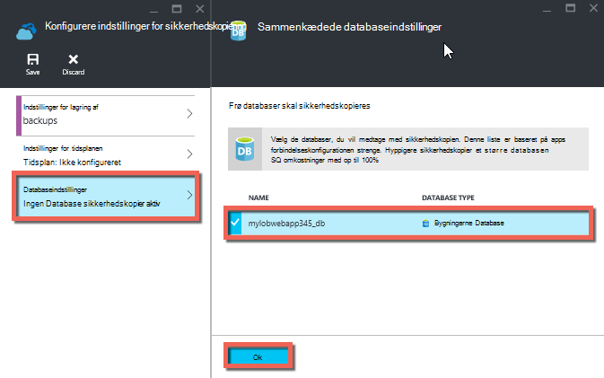

<properties 
    pageTitle="Sikkerhedskopiere din app i Azure" 
    description="Lær, hvordan du opretter sikkerhedskopier af dine apps i Azure App Service." 
    services="app-service" 
    documentationCenter="" 
    authors="cephalin" 
    manager="wpickett" 
    editor="jimbe"/>

<tags 
    ms.service="app-service" 
    ms.workload="na" 
    ms.tgt_pltfrm="na" 
    ms.devlang="na" 
    ms.topic="article" 
    ms.date="07/06/2016" 
    ms.author="cephalin"/>

# Sikkerhedskopiere din app i Azure

Funktionen Sikkerhedskopiering og gendannelse i [Azure App Service](../app-service/app-service-value-prop-what-is.md) kan du nemt oprette app sikkerhedskopier manuelt eller automatisk. Du kan gendanne din app til en tidligere tilstand, eller Opret en ny app, der er baseret på en af din oprindelige app sikkerhedskopier. 

Finde oplysninger om gendannelse af en app fra sikkerhedskopi, kan du se [gendanne en app i Azure](web-sites-restore.md).

## Hvad bliver sikkerhedskopieres 
App Service kan sikkerhedskopiere følgende oplysninger:

* App-konfiguration
* Filens indhold
* En hvilken som helst Azure SQL-databaser eller Azure MySQL (ClearDB) databaser, der er knyttet til din app (du kan vælge hvilke skal medtages i sikkerhedskopien)

Disse oplysninger er sikkerhedskopieret til Azure lagerplads konto og beholder, du angiver. 

> [AZURE.NOTE] Hver sikkerhedskopi er en fuldstændig offline kopi af din app, ikke en trinvis opdatering.

## Krav og begrænsninger

* Funktionen Sikkerhedskopiering og gendannelse kræver serviceaftale App, som skal være i den **almindelige** niveau eller højere. Du kan finde flere oplysninger om skalering din App serviceaftale, som du bruger et højere niveau, under [skalere op en app i Azure](web-sites-scale.md). Bemærk, at **Premium** niveau giver mulighed for et større antal daglige sikkerhedskopier end **Standard** niveau.
* Du har brug for en Azure lagerplads konto og beholder i den samme abonnement som app, du vil sikkerhedskopiere. Du kan finde flere oplysninger om Azure lagerplads konti, [links](#moreaboutstorage) i slutningen af denne artikel.
* Sikkerhedskopier kan være op til 10GB app og database indhold. Du får en fejl, hvis størrelsen på sikkerhedskopien overskrider denne grænse. 

## Oprette en sikkerhedskopi manuelt

2. Gå til din app blade i [Azure-portalen](https://portal.azure.com), skal du vælge **Indstillinger**og derefter **Sikkerhedskopier**. Bladet **Sikkerhedskopier** vises.
    
    ![Sikkerhedskopier side][ChooseBackupsPage]

    >[AZURE.NOTE]Hvis du får vist meddelelsen nedenfor, skal du klikke på den for at opgradere din App Service-plan, før du kan fortsætte med sikkerhedskopier.
Yderligere oplysninger finder du i [skalere op en app i Azure](web-sites-scale.md) .  
    >

3. I bladet **Sikkerhedskopier** , skal du klikke på **lager: ikke konfigureret** til at konfigurere en konto lagerplads.

    ![Vælg lagerplads konto][ChooseStorageAccount]
    
4. Vælg placeringen af sikkerhedskopien ved at vælge en **Lagerplads konto** og **beholder**. Kontoen lagerplads skal være medlem af den samme abonnement som den app, du vil sikkerhedskopiere. Hvis du vil, kan du oprette en ny lagerplads-konto eller en ny objektbeholder i de respektive blade. Når du er færdig, skal du klikke på **Vælg**.
    
    
    
5. Klik på **Indstillinger for**i bladet **Konfigurere indstillinger for sikkerhedskopiering** , der stadig stadig er åben, derefter Vælg de databaser, du vil medtage i sikkerhedskopier (SQL-database eller MySQL) og derefter klikke på **OK**.  

    

    > [AZURE.NOTE]  Til en database, der skal vises på listen, skal dens forbindelsesstreng findes i afsnittet **forbindelsesstrenge** af bladet **Programindstillinger** for din app.

6. Klik på **Gem**i bladet **Konfigurere indstillinger for sikkerhedskopiering** .  

7. I kommandolinjen af bladet **Sikkerhedskopier** , skal du klikke på **Sikkerhedskopi nu**.
    
    ![BackUpNow knap][BackUpNow]
    
    Du får vist meddelelsen status under sikkerhedskopieringen.

Når du har konfigureret en lagerplads konto og beholder for sikkerhedskopiering, kan du foretage en manuel sikkerhedskopiering når som helst.  

## Konfigurere automatiske sikkerhedskopier

1. Klik på i bladet **Sikkerhedskopier** **tidsplan: ikke konfigureret**. 

    
    
1. Blade **Indstillinger for sikkerhedskopiering tidsplan** sat **Planlagt sikkerhedskopiering** til **på**, og derefter konfigurere tidsplanen for sikkerhedskopiering efter behov og klikke på **OK**.
    
    ![Aktivere automatiske sikkerhedskopier][SetAutomatedBackupOn]
    
4. Klik på **Indstillinger for lagring af**i bladet **Konfigurere indstillinger for sikkerhedskopiering** , der stadig stadig er åben, og derefter vælge placeringen af sikkerhedskopien ved at vælge en **Lagerplads konto** og **beholder**. Kontoen lagerplads skal være medlem af den samme abonnement som den app, du vil sikkerhedskopiere. Hvis du vil, kan du oprette en ny lagerplads-konto eller en ny objektbeholder i de respektive blade. Når du er færdig, skal du klikke på **Vælg**.
    
    
    
5. Klik på **Indstillinger for**i bladet **Konfigurere indstillinger for sikkerhedskopiering** , derefter Vælg de databaser, du vil medtage i sikkerhedskopier (SQL-database eller MySQL) og derefter klikke på **OK**.  

    

    > [AZURE.NOTE]  Til en database, der skal vises på listen, skal dens forbindelsesstreng findes i afsnittet **forbindelsesstrenge** af bladet **Programindstillinger** for din app.

6. Klik på **Gem**i bladet **Konfigurere indstillinger for sikkerhedskopiering** .  

## Sikkerhedskopiering kun en del af din app

Undertiden vil du ikke sikkerhedskopiere alt på din app. Her er et par eksempler:

-   Du [konfigurere ugentlig sikkerhedskopier](web-sites-backup.md#configure-automated-backups) af din app, der indeholder statisk indhold, der aldrig ændrer som gamle blogindlæg eller billeder.
-   Din app har mere end 10GB indhold (, er den maksimale mængde, du kan forsøge at ad gangen).
-   Du vil ikke sikkerhedskopiere logfilerne.

Delvis sikkerhedskopier, kan du vælge præcis hvilke filer, du vil sikkerhedskopiere.

### Udelade filer fra sikkerhedskopien

Hvis du vil udelukke filer og mapper fra dine sikkerhedskopier, skal du oprette en `_backup.filter` filer i mappen D:\home\site\wwwroot af din app og angive listen over filer og mapper, du vil udelade, i der. Der er en nem måde at få adgang til denne via [Kudu Console](https://github.com/projectkudu/kudu/wiki/Kudu-console). 

Antag, at du har en app, der indeholder logfiler og statiske billeder fra tidligere år, der aldrig vil ændre. Du har allerede en komplet sikkerhedskopiering af appen, der indeholder de gamle billeder. Nu vil sikkerhedskopiere appen hver dag, men du vil ikke betale for lagring af logfiler eller statisk billedfilerne, der aldrig ændres.

![Logger mappe][LogsFolder]
![billeder mappe][ImagesFolder]
    
Den under trin viser, hvordan du vil udelade disse filer fra sikkerhedskopien.

1. Gå til `http://{yourapp}.scm.azurewebsites.net/DebugConsole` og identificere de mapper, du vil udelukke fra dine sikkerhedskopier. I dette eksempel skal du vil udelukke de følgende filer og mapper vises i Brugergrænsefladen:

        D:\home\site\wwwroot\Logs
        D:\home\LogFiles
        D:\home\site\wwwroot\Images\2013
        D:\home\site\wwwroot\Images\2014
        D:\home\site\wwwroot\Images\brand.png

    [AZURE.NOTE] Den sidste linje viser, at du kan udelukke enkeltpersoner filer samt mapper.

2. Oprette en fil kaldet `_backup.filter` og placere på listen ovenfor i filen, men fjerne `D:\home`. Listen en mappe eller fil hver linje. Så indholdet af filen skal være:

    \site\wwwroot\Logs \LogFiles \site\wwwroot\Images\2013 \site\wwwroot\Images\2014 \site\wwwroot\Images\brand.png

3. Overføre denne fil til den `D:\home\site\wwwroot\` mappe på webstedet med [ftp](web-sites-deploy.md#ftp) eller en anden metode. Hvis du vil, kan du oprette filen direkte i `http://{yourapp}.scm.azurewebsites.net/DebugConsole` og indsætte indhold der.

4. Kør sikkerhedskopier på samme måde, som du normalt ville gøre det, [manuelt](#create-a-manual-backup) eller [automatisk](#configure-automated-backups).

Nu, alle filer og mapper, der er angivet i `_backup.filter` udelades fra sikkerhedskopien. I dette eksempel vil logfilerne og billedfiler 2013 og 2014 ikke længere blive sikkerhedskopieret, samt brand.png.

>[AZURE.NOTE] Du gendanne delvis sikkerhedskopier af dit websted på samme måde, du vil [gendanne en almindelig sikkerhedskopiering](web-sites-restore.md). Gendannelsen vil gøre den rigtige ting.
>
>Når en fuld sikkerhedskopi er gendannet, skal erstattes alt indhold på webstedet med uanset hvad der er i sikkerhedskopien. Hvis filen er på webstedet, men ikke i sikkerhedskopien bliver det slettet. Men når en delvis sikkerhedskopi er gendannet, skal det indhold, der er placeret i en af de sortlistet adresselister eller en sortlistet fil, der er tilbage som den er.

## Hvordan sikkerhedskopier gemmes

Når du har foretaget et eller flere sikkerhedskopier for din app, bliver sikkerhedskopierne synlig på bladet **beholdere** af kontoen lagerplads, samt din app. I kontoen lagerplads består hver sikkerhedskopi af en .zip-fil, der indeholder de sikkerhedskopierede data og en .XML-fil, der indeholder et manifest for indholdet af .zip-filen. Du kan udpakke og gennemse filerne, hvis du vil have adgang til dine sikkerhedskopier uden at gennemføre en app gendannelse.

Sikkerhedskopien af databasen til appen gemmes i roden af .zip-filen. Dette er en BACPAC-fil (uden filtypenavn) og kan importeres til en SQL-database. For at oprette en ny SQL-database, der er baseret på BACPAC Eksportér skal du se [importere en BACPAC fil for at oprette en ny brugerdatabase](http://technet.microsoft.com/library/hh710052.aspx).

> [AZURE.WARNING] At ændre nogen af filerne i din **websitebackups** beholder, kan det medføre, at sikkerhedskopieringen at blive ugyldige og derfor ikke-backup.

## Næste trin
Du kan finde oplysninger om gendannelse af en app fra en sikkerhedskopi, kan du se [gendanne en app i Azure](web-sites-restore.md). Du kan også sikkerhedskopiere og gendanne App Service apps ved hjælp af REST-API (se [Brug RESTEN til at sikkerhedskopiere og gendanne App Service apps](websites-csm-backup.md)).

>[AZURE.NOTE] Hvis du vil komme i gang med Azure App Service før tilmelding til en Azure-konto, skal du gå til [Prøve App Service](http://go.microsoft.com/fwlink/?LinkId=523751), hvor du straks kan oprette en forbigående starter WebApp i App-tjeneste. Ingen kreditkort, der kræves. ingen forpligtelser.

<!-- IMAGES -->
[ChooseBackupsPage]: ./media/web-sites-backup/01ChooseBackupsPage.png
[ChooseStorageAccount]: ./media/web-sites-backup/02ChooseStorageAccount.png
[IncludedDatabases]: ./media/web-sites-backup/03IncludedDatabases.png
[BackUpNow]: ./media/web-sites-backup/04BackUpNow.png
[BackupProgress]: ./media/web-sites-backup/05BackupProgress.png
[SetAutomatedBackupOn]: ./media/web-sites-backup/06SetAutomatedBackupOn.png
[Frequency]: ./media/web-sites-backup/07Frequency.png
[StartDate]: ./media/web-sites-backup/08StartDate.png
[StartTime]: ./media/web-sites-backup/09StartTime.png
[SaveIcon]: ./media/web-sites-backup/10SaveIcon.png
[ImagesFolder]: ./media/web-sites-backup/11Images.png
[LogsFolder]: ./media/web-sites-backup/12Logs.png
[GhostUpgradeWarning]: ./media/web-sites-backup/13GhostUpgradeWarning.png
 
