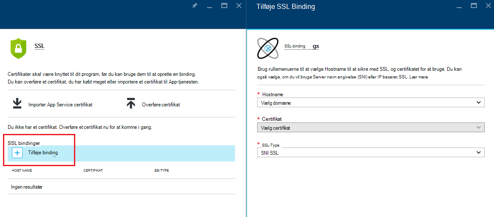
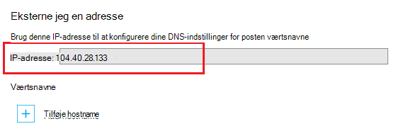
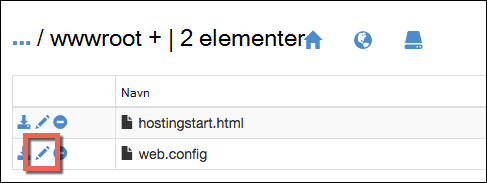

<properties
    pageTitle="Secure din app eget domæne med HTTPS | Microsoft Azure"
    description="Lær, hvordan secure brugerdefineret domænenavn til din app i Azure App Service ved at konfigurere en SSL-certifikat binding. Du kan også lære at få et SSL-certifikat fra flere værktøjer."
    services="app-service"
    documentationCenter=".net"
    authors="cephalin"
    manager="wpickett"
    editor="jimbe"
    tags="top-support-issue"/>

<tags
    ms.service="app-service"
    ms.workload="na"
    ms.tgt_pltfrm="na"
    ms.devlang="na"
    ms.topic="article"
    ms.date="08/08/2016"
    ms.author="cephalin"/>

# Secure din app eget domæne med HTTPS

> [AZURE.SELECTOR]
- [Købe SSL-certifikat i Azure](web-sites-purchase-ssl-web-site.md)
- [Brug SSL-certifikat fra et andet sted](web-sites-configure-ssl-certificate.md)

I denne artikel beskrives, hvordan du aktiverer HTTPS til en WebApp, en mobilapp back end- eller en API-app i [Azure App Service](../app-service/app-service-value-prop-what-is.md) , der bruger et brugerdefineret domænenavn. Det dækker kun server-godkendelse. Hvis du har brug for fælles godkendelse (herunder klientgodkendelse), kan du se [Hvordan til at konfigurere TLS Fællesgodkendelse til App-tjenesten](app-service-web-configure-tls-mutual-auth.md).

Hvis du vil sikre med HTTPS en app, der indeholder et brugerdefineret domænenavn, skal tilføje du et certifikat for det pågældende domænenavn. Som standard Azure sikrer den ** \*. azurewebsites.net** jokertegn domæne med et enkelt SSL-certifikat, så dine kunder kan allerede få adgang til din app på * *https://*&lt;Programnavn >*. azurewebsites.net**. Men hvis du vil bruge et brugerdefineret domæne, du gerne have **contoso.com**, **www.contoso.com**, og ** \*. contoso.com**, standardcertifikatet kan ikke sikre. Desuden som alle [certifikater med jokertegn](https://casecurity.org/2014/02/26/pros-and-cons-of-single-domain-multi-domain-and-wildcard-certificates/)er standardcertifikatet ikke så sikker som ved hjælp af et brugerdefineret domæne og et certifikat for det brugerdefinerede domæne.   

>[AZURE.NOTE] Du kan få hjælp fra Azure-eksperter når som helst i [Azure-fora](https://azure.microsoft.com/support/forums/). Gå til [Azure understøtter](https://azure.microsoft.com/support/options/) , og klik på **Få Support**til understøttelse af flere tilpassede.

## Hvad du bør
Hvis du vil sikre dit eget domænenavn med HTTPS, binder du et brugerdefineret SSL-certifikat til det brugerdefinerede domæne i Azure. Før indbinding et brugerdefineret certifikat, skal du gøre følgende:

- **Konfigurer dit eget domæne** - App Service kan kun tilføje et certifikat til et domænenavn, der allerede er konfigureret i din app. Yderligere oplysninger finder du [knytte et brugerdefineret domænenavn til en Azure-app](web-sites-custom-domain-name.md). 
- **Skalere op til grundlæggende niveau eller højere** App Service planer i nederste priser niveauer understøtter ikke brugerdefinerede SSL-certifikater. Flere oplysninger under [skalere op en app i Azure](web-sites-scale.md). 
- **Få et SSL-certifikat** - Hvis du ikke allerede har en, skal du få en fra en pålidelig [nøglecenter](http://en.wikipedia.org/wiki/Certificate_authority) (CA). Certifikatet, der skal opfylde følgende krav:

    - Det er signeret af et Nøglecenter (ingen privat CA servere).
    - Den indeholder en privat nøgle.
    - Den er oprettet for vigtige exchange og eksporteres til en. PFX-fil.
    - Det bruger et minimum af 2048-bit kryptering.
    - Emnenavnet svarer til dit eget domæne, der skal sikre. Hvis du vil sikre flere domæner med et certifikat, du skal bruge et jokertegn navn (fx ** \*. contoso.com**) eller angive subjectAltName værdier.
    - Den er flettet med alle **[mellemliggende certifikater](http://en.wikipedia.org/wiki/Intermediate_certificate_authorities)** bruges af din CA. Ellers kan der opstår problemer med at irreproducible interoperabilitet på nogle klienter.

        >[AZURE.NOTE] Den nemmeste måde at få et SSL-certifikat, der opfylder alle betingelserne er du         [køber et på Azure-portalen direkte](web-sites-purchase-ssl-web-site.md). I denne artikel beskrives, hvordan kan du gøre det manuelt og derefter binde det til dit eget domæne i App-tjeneste.
        >   
        > **Elliptic kurve kryptering (ECC) certifikater** kan arbejde med App-tjenesten, men ikke er omfattet af denne artikel. Arbejde med din CA på de nøjagtige trin til at oprette ECC certifikater.

## Trin 1. Få et SSL-certifikat

Fordi leverer de forskellige typer af SSL-certifikat i anden pris punkter, skal du starte ved at beslutte, hvilken type SSL-certifikat til at købe. Hvis du vil sikre et enkelt domænenavn (**www.contoso.com**), skal du blot et grundlæggende certifikat. Til at sikre flere domænenavne (**contoso.com** *og* **www.contoso.com** 
*og* **mail.contoso.com**), du har brug for et [certifikat med jokertegn](http://en.wikipedia.org/wiki/Wildcard_certificate) eller et certifikat med [Alternative emnenavn](http://en.wikipedia.org/wiki/SubjectAltName) (`subjectAltName`).

Når du ved, hvilken SSL-certifikat til at købe, kan du sende et certifikat logge anmode om (CSR) til et Nøglecenter. Når du får anmodede certifikat tilbage fra Nøglecenteret, oprette du en .pfx-fil fra certifikatet. Du kan udføre disse trin, ved hjælp af værktøjet efter eget valg. Her er instruktioner til de fælles værktøjer:

- [Certreq.exe trin](#bkmk_certreq) - værktøjet Windows til oprettelse af anmodninger om certifikater. Det er en del af Windows siden Windows XP/Windows Server 2000.
- [IIS Manager trin](#bkmk_iismgr) - værktøjet efter valg, hvis du allerede kender den.
- [OpenSSL trin](#bkmk_openssl) - et [open source-på tværs af platforme værktøj](https://www.openssl.org). Bruge det til at hjælpe dig med at få et SSL-certifikat fra en hvilken som helst platform.
- [subjectAltName trin ved hjælp af OpenSSL](#bkmk_subjectaltname) - trin til at få `subjectAltName` certifikater.

Hvis du vil teste konfigurationen i App-tjeneste, før du køber et certifikat, kan du oprette et [selvsigneret certifikat](https://en.wikipedia.org/wiki/Self-signed_certificate). Dette selvstudium giver dig to metoder til at generere den:

- [Selvsigneret certifikat, Certreq.exe trin](#bkmk_sscertreq)
- [Selvsigneret certifikat, OpenSSL trin](#bkmk_ssopenssl)

### Få et certifikat ved hjælp af Certreq.exe

1. Oprette en fil (fx **myrequest.txt**), og kopier i den følgende tekst og gemme den i en arbejdsmappe. Erstatte den `<your-domain>` pladsholder med det brugerdefinerede domænenavn af din app.

        [NewRequest]
        Subject = "CN=<your-domain>"  ; E.g. "CN=www.contoso.com", or "CN=*.contoso.com" for a wildcard certificate
        Exportable = TRUE
        KeyLength = 2048              ; Required minimum is 2048
        KeySpec = 1
        KeyUsage = 0xA0
        MachineKeySet = True
        ProviderName = "Microsoft RSA SChannel Cryptographic Provider"
        ProviderType = 12
        HashAlgorithm = SHA256

        [EnhancedKeyUsageExtension]
        OID=1.3.6.1.5.5.7.3.1         ; Server Authentication

    Du kan finde flere oplysninger om indstillingerne i Kundeservicerepræsentanten og andre tilgængelige indstillinger, [Certreq referencedokumentation](https://technet.microsoft.com/library/dn296456.aspx).

4. I en kommandoprompt, `CD` i dit arbejdsmappe, og Kør følgende kommando til at oprette Kundeservicerepræsentanten:

        certreq -new myrequest.txt myrequest.csr

    **myrequest.CSR** der nu oprettes i din aktuelle arbejdsmappe.

5. Sende **myrequest.csr** til et Nøglecenter til at hente et SSL-certifikat. Du enten overføre filen eller kopiere indholdet fra et tekstredigeringsprogram til en webformular.

    Se en liste over nøglecentre, der er tillid til af Microsoft [Microsoft der er tillid til Root Certificate Program: deltagere][cas].

6. Når Nøglecenteret har svaret til du med et certifikat (. Virksomheden)-filen, gemme den i din arbejdsmappe. Derefter køre følgende kommando for at fuldføre den ventende Kundeservicerepræsentant.

        certreq -accept -user <certificate-name>.cer

    Denne kommando gemmer det færdige certifikat i Windows certifikat store.

6. Hvis din CA bruger mellemliggende certifikater, skal du installere dem, før du fortsætter. De normalt, komme som en separat overførsel fra Nøglecenteret, og i flere formater for forskellige web servertyper. Vælg versionen til Microsoft IIS.

    Når du har hentet certifikater, skal du højreklikke på hver af dem i Windows Stifinder, og vælg  **Installer certifikat**. Brug standardværdierne i **Guiden Import for certifikat**, og fortsætte med at markere **Næste** , indtil importen er fuldført.

7. Hvis du vil eksportere dit SSL-certifikat fra certifikat store, skal du trykke på `Win` + `R` og køre **certmgr.msc** for at starte Certifikatstyring. Vælg **personlige** > **certifikater**. I kolonnen **Udstedt til** skal du se en post med dit eget domænenavn, og det Nøglecenter, du brugte til at generere certifikatet i kolonnen **Udstedt af** .

    ![indsætte billede af cert manager her][certmgr]

9. Højreklik på certifikatet, og vælg **Alle opgaver** > **eksportere**. I **Guiden Eksporter for certifikat**, skal du klikke på **Næste**, og derefter vælge **Ja, Eksporter privat nøgle**og klik derefter på **Næste** igen.

    ![Eksportere privat nøgle][certwiz1]

10. Vælg **Personal Information Exchange - PKCS #12**, **Medtag alle certifikater i certifikatstien, hvis det er muligt**, og **Eksporter alle udvidede egenskaber**. Klik derefter på **Næste**.

    ![medtage alle certifikater og udvidede egenskaber][certwiz2]

11. Vælg **adgangskode**, og Angiv og Bekræft adgangskoden. Klik på **Næste**.

    ![angive en adgangskode][certwiz3]

12. Giv en sti og et filnavn til den eksporterede certifikat med filtypenavnet **.pfx**. Klik på **Næste** at afslutte.

    ![angive en sti til filen][certwiz4]

Du er nu klar til at overføre den eksporterede PFX-fil til App-tjenesten. Se [trin 2. Overføre og binder det brugerdefinerede SSL-certifikat](#bkmk_configuressl).

### Få et certifikat ved hjælp af IIS Manager

1. Oprette en Kundeservicerepræsentant med IIS Manager til at sende til Nøglecenteret. Yderligere oplysninger om oprettelse af en Kundeservicerepræsentant, se [anmode om et Internet servercertifikat (IIS 7)][iiscsr].

3. Sende din CSR til et Nøglecenter at få et SSL-certifikat. Se en liste over nøglecentre, der er tillid til af Microsoft [Microsoft der er tillid til Root Certificate Program: deltagere][cas].

3. Udføre CSR med det certifikat, der sender CA tilbage til dig. Se [installere en Internet servercertifikat (IIS 7)]kan finde flere oplysninger om gennemførelse af Kundeservicerepræsentanten[installcertiis].

4. Hvis din CA bruger mellemliggende certifikater, skal du installere dem, før du fortsætter. De normalt, komme som en separat overførsel fra Nøglecenteret, og i flere formater for forskellige web servertyper. Vælg versionen til Microsoft IIS.

    Når du har hentet certifikater, skal du højreklikke på hver af dem i Windows Stifinder, og vælg **Installer certifikat**. 
    Brug standardværdierne i **Guiden Import for certifikat**, og fortsætte med at markere **Næste** , indtil importen er fuldført.

4. Eksportere SSL-certifikatet fra IIS Manager. Du kan finde flere oplysninger om at eksportere certifikatet, se [eksportere et servercertifikat (IIS 7)][exportcertiis]. 

    >[AZURE.IMPORTANT] Sørg for, at du vælger **Ja, Eksporter den private nøgle** i **Certifikat guiden Eksporter**  
    >
    >![Eksportere privat nøgle][certwiz1]  
    >
    > og også vælge **Personal Information Exchange - PKCS #12**, **Medtag alle certifikater i certifikatstien, hvis det er muligt**og     **eksportere alle udvidede egenskaber**.
    >
    >![medtage alle certifikater og udvidede egenskaber][certwiz2]

Du er nu klar til at overføre den eksporterede PFX-fil til App-tjenesten. Se [trin 2. Overføre og binder det brugerdefinerede SSL-certifikat](#bkmk_configuressl).

### Få et certifikat ved hjælp af OpenSSL

1. I kommandolinjen terminal skal `CD` til en arbejdsmappe generere en privat nøgle og CSR ved at køre følgende kommando:

        openssl req -sha256 -new -nodes -keyout myserver.key -out server.csr -newkey rsa:2048

2. Når du bliver bedt om det, kan du angive de nødvendige oplysninger. Eksempel:

        Country Name (2 letter code)
        State or Province Name (full name) []: Washington
        Locality Name (eg, city) []: Redmond
        Organization Name (eg, company) []: Microsoft
        Organizational Unit Name (eg, section) []: Azure
        Common Name (eg, YOUR name) []: www.microsoft.com
        Email Address []:

        Please enter the following 'extra' attributes to be sent with your certificate request

        A challenge password []:

    Når du er færdig, skal du har to filer i din arbejdsmappe: **myserver.key** og **server.csr**. 
    **Server.csr** indeholder Kundeservicerepræsentanten, og du skal bruge **myserver.key** senere.

3. Sende din CSR til et Nøglecenter at få et SSL-certifikat. Se en liste over nøglecentre, der er tillid til af Microsoft [Microsoft der er tillid til Root Certificate Program: deltagere][cas].

4. Når Nøglecenteret sender dig det ønskede certifikat, kan du gemme den på en fil med navnet **myserver.crt** i din arbejdsmappe. Hvis din CA leverer den i et tekstformat, du skal blot kopiere indholdet til **myserver.crt** i et tekstredigeringsprogram og Gem den. Filen skal se ud som følger:

        -----BEGIN CERTIFICATE-----
        MIIDJDCCAgwCCQCpCY4o1LBQuzANBgkqhkiG9w0BAQUFADBUMQswCQYDVQQGEwJV
        UzELMAkGA1UECBMCV0ExEDAOBgNVBAcTB1JlZG1vbmQxEDAOBgNVBAsTB0NvbnRv
        c28xFDASBgNVBAMTC2NvbnRvc28uY29tMB4XDTE0MDExNjE1MzIyM1oXDTE1MDEx
        NjE1MzIyM1owVDELMAkGA1UEBhMCVVMxCzAJBgNVBAgTAldBMRAwDgYDVQQHEwdS
        ZWRtb25kMRAwDgYDVQQLEwdDb250b3NvMRQwEgYDVQQDEwtjb250b3NvLmNvbTCC
        ASIwDQYJKoZIhvcNAQEBBQADggEPADCCAQoCggEBAN96hBX5EDgULtWkCRK7DMM3
        enae1LT9fXqGlbA7ScFvFivGvOLEqEPD//eLGsf15OYHFOQHK1hwgyfXa9sEDPMT
        3AsF3iWyF7FiEoR/qV6LdKjeQicJ2cXjGwf3G5vPoIaYifI5r0lhgOUqBxzaBDZ4
        xMgCh2yv7NavI17BHlWyQo90gS2X5glYGRhzY/fGp10BeUEgIs3Se0kQfBQOFUYb
        ktA6802lod5K0OxlQy4Oc8kfxTDf8AF2SPQ6BL7xxWrNl/Q2DuEEemjuMnLNxmeA
        Ik2+6Z6+WdvJoRxqHhleoL8ftOpWR20ToiZXCPo+fcmLod4ejsG5qjBlztVY4qsC
        AwEAATANBgkqhkiG9w0BAQUFAAOCAQEAVcM9AeeNFv2li69qBZLGDuK0NDHD3zhK
        Y0nDkqucgjE2QKUuvVSPodz8qwHnKoPwnSrTn8CRjW1gFq5qWEO50dGWgyLR8Wy1
        F69DYsEzodG+shv/G+vHJZg9QzutsJTB/Q8OoUCSnQS1PSPZP7RbvDV9b7Gx+gtg
        7kQ55j3A5vOrpI8N9CwdPuimtu6X8Ylw9ejWZsnyy0FMeOPpK3WTkDMxwwGxkU3Y
        lCRTzkv6vnHrlYQxyBLOSafCB1RWinN/slcWSLHADB6R+HeMiVKkFpooT+ghtii1
        A9PdUQIhK9bdaFicXPBYZ6AgNVuGtfwyuS5V6ucm7RE6+qf+QjXNFg==
        -----END CERTIFICATE-----

5. I kommandolinjen terminal skal du køre følgende kommando for at eksportere **myserver.pfx** fra **myserver.key** og **myserver.crt**:

        openssl pkcs12 -export -out myserver.pfx -inkey myserver.key -in myserver.crt

    Når du bliver bedt om det, du Definer en adgangskode for at sikre .pfx-fil.

    > [AZURE.NOTE] Hvis din CA bruger mellemliggende certifikater, skal du medtage dem med den `-certfile` parameter. De normalt, komme som en separat overførsel fra Nøglecenteret, og i flere formater for forskellige web servertyper. Vælg versionen med den `.pem` filtypenavn.
    >
    > Din `openssl -export` kommando skal se ud som i følgende eksempel, der opretter en .pfx-fil, der indeholder de mellemliggende certifikater fra filen **mellemniveau cets.pem** :
    >  
    > `openssl pkcs12 -chain -export -out myserver.pfx -inkey myserver.key -in myserver.crt -certfile intermediate-cets.pem`

Du er nu klar til at overføre den eksporterede PFX-fil til App-tjenesten. Se [trin 2. Overføre og binder det brugerdefinerede SSL-certifikat](#bkmk_configuressl).

### Få et SubjectAltName certifikat ved hjælp af OpenSSL

1. Oprette en fil med navnet **sancert.cnf**, Kopier følgende tekst i den og gemme den i en arbejdsmappe:

        # -------------- BEGIN custom sancert.cnf -----
        HOME = .
        oid_section = new_oids
        [ new_oids ]
        [ req ]
        default_days = 730
        distinguished_name = req_distinguished_name
        encrypt_key = no
        string_mask = nombstr
        req_extensions = v3_req # Extensions to add to certificate request
        [ req_distinguished_name ]
        countryName = Country Name (2 letter code)
        countryName_default =
        stateOrProvinceName = State or Province Name (full name)
        stateOrProvinceName_default =
        localityName = Locality Name (eg, city)
        localityName_default =
        organizationalUnitName  = Organizational Unit Name (eg, section)
        organizationalUnitName_default  =
        commonName              = Your common name (eg, domain name)
        commonName_default      = www.mydomain.com
        commonName_max = 64
        [ v3_req ]
        subjectAltName=DNS:ftp.mydomain.com,DNS:blog.mydomain.com,DNS:*.mydomain.com
        # -------------- END custom sancert.cnf -----

    I den linje, der begynder med `subjectAltName`, Erstat værdien med alle domænenavne, du vil sikre (ud over  `commonName`). Eksempel:

        subjectAltName=DNS:sales.contoso.com,DNS:support.contoso.com,DNS:fabrikam.com

    Du behøver ikke at ændre et andet felt, herunder `commonName`. Du bliver bedt om at angive dem i de næste par trin.

1. I kommandolinjen terminal skal `CD` i dit arbejdsmappe, og Kør følgende kommando:

        openssl req -sha256 -new -nodes -keyout myserver.key -out server.csr -newkey rsa:2048 -config sancert.cnf

2. Når du bliver bedt om det, kan du angive de nødvendige oplysninger. Eksempel:

        Country Name (2 letter code) []: US
        State or Province Name (full name) []: Washington
        Locality Name (eg, city) []: Redmond
        Organizational Unit Name (eg, section) []: Azure
        Your common name (eg, domain name) []: www.microsoft.com

    Når færdig, skal du har to filer i din arbejdsmappe: **myserver.key** og **server.csr**. 
    **Server.csr** indeholder Kundeservicerepræsentanten, og du skal bruge **myserver.key** senere.

3. Sende din CSR til et Nøglecenter at få et SSL-certifikat. Se en liste over nøglecentre, der er tillid til af Microsoft [Microsoft der er tillid til Root Certificate Program: deltagere][cas].

4. Når Nøglecenteret sender dig det ønskede certifikat, kan du gemme den på en fil med navnet **myserver.crt**. Hvis din CA leverer den i et tekstformat, du skal blot kopiere indholdet til **myserver.crt** i et tekstredigeringsprogram og Gem den. Filen skal se ud som følger:

        -----BEGIN CERTIFICATE-----
        MIIDJDCCAgwCCQCpCY4o1LBQuzANBgkqhkiG9w0BAQUFADBUMQswCQYDVQQGEwJV
        UzELMAkGA1UECBMCV0ExEDAOBgNVBAcTB1JlZG1vbmQxEDAOBgNVBAsTB0NvbnRv
        c28xFDASBgNVBAMTC2NvbnRvc28uY29tMB4XDTE0MDExNjE1MzIyM1oXDTE1MDEx
        NjE1MzIyM1owVDELMAkGA1UEBhMCVVMxCzAJBgNVBAgTAldBMRAwDgYDVQQHEwdS
        ZWRtb25kMRAwDgYDVQQLEwdDb250b3NvMRQwEgYDVQQDEwtjb250b3NvLmNvbTCC
        ASIwDQYJKoZIhvcNAQEBBQADggEPADCCAQoCggEBAN96hBX5EDgULtWkCRK7DMM3
        enae1LT9fXqGlbA7ScFvFivGvOLEqEPD//eLGsf15OYHFOQHK1hwgyfXa9sEDPMT
        3AsF3iWyF7FiEoR/qV6LdKjeQicJ2cXjGwf3G5vPoIaYifI5r0lhgOUqBxzaBDZ4
        xMgCh2yv7NavI17BHlWyQo90gS2X5glYGRhzY/fGp10BeUEgIs3Se0kQfBQOFUYb
        ktA6802lod5K0OxlQy4Oc8kfxTDf8AF2SPQ6BL7xxWrNl/Q2DuEEemjuMnLNxmeA
        Ik2+6Z6+WdvJoRxqHhleoL8ftOpWR20ToiZXCPo+fcmLod4ejsG5qjBlztVY4qsC
        AwEAATANBgkqhkiG9w0BAQUFAAOCAQEAVcM9AeeNFv2li69qBZLGDuK0NDHD3zhK
        Y0nDkqucgjE2QKUuvVSPodz8qwHnKoPwnSrTn8CRjW1gFq5qWEO50dGWgyLR8Wy1
        F69DYsEzodG+shv/G+vHJZg9QzutsJTB/Q8OoUCSnQS1PSPZP7RbvDV9b7Gx+gtg
        7kQ55j3A5vOrpI8N9CwdPuimtu6X8Ylw9ejWZsnyy0FMeOPpK3WTkDMxwwGxkU3Y
        lCRTzkv6vnHrlYQxyBLOSafCB1RWinN/slcWSLHADB6R+HeMiVKkFpooT+ghtii1
        A9PdUQIhK9bdaFicXPBYZ6AgNVuGtfwyuS5V6ucm7RE6+qf+QjXNFg==
        -----END CERTIFICATE-----

5. I kommandolinjen terminal skal du køre følgende kommando for at eksportere **myserver.pfx** fra **myserver.key** og **myserver.crt**:

        openssl pkcs12 -export -out myserver.pfx -inkey myserver.key -in myserver.crt

    Når du bliver bedt om det, du Definer en adgangskode for at sikre .pfx-fil.

    > [AZURE.NOTE] Hvis din CA bruger mellemliggende certifikater, skal du medtage dem med den `-certfile` parameter. De normalt, komme som en separat overførsel fra Nøglecenteret, og i flere formater for forskellige web servertyper. Vælg versionen med den `.pem` filtypenavn).
    >
    > Din `openssl -export` kommando skal se ud som i følgende eksempel, der opretter en .pfx-fil, der indeholder de mellemliggende certifikater fra filen **mellemniveau cets.pem** :
    >  
    > `openssl pkcs12 -chain -export -out myserver.pfx -inkey myserver.key -in myserver.crt -certfile intermediate-cets.pem`

Du er nu klar til at overføre den eksporterede PFX-fil til App-tjenesten. Se [trin 2. Overføre og binder det brugerdefinerede SSL-certifikat](#bkmk_configuressl).

### Oprette et selvsigneret certifikat ved hjælp af Certreq.exe ###

>[AZURE.IMPORTANT] Selvsignerede certifikater er til testformål kun. De fleste browsere returnerer fejl, når du besøger et websted, som er sikret med et selvsigneret certifikat. Nogle browsere nægte selv at gå til webstedet. 

1. Oprette en tekstfil (fx **mycert.txt**), Kopier i den følgende tekst og gemmer filen i en arbejdsmappe. Erstatte den `<your-domain>` pladsholder med det brugerdefinerede domænenavn af din app.

        [NewRequest]
        Subject = "CN=<your-domain>"  ; E.g. "CN=www.contoso.com", or "CN=*.contoso.com" for a wildcard certificate
        Exportable = TRUE
        KeyLength = 2048              ; KeyLength can be 2048, 4096, 8192, or 16384 (required minimum is 2048)
        KeySpec = 1
        KeyUsage = 0xA0
        MachineKeySet = True
        ProviderName = "Microsoft RSA SChannel Cryptographic Provider"
        ProviderType = 12
        HashAlgorithm = SHA256
        RequestType = Cert            ; Self-signed certificate
        ValidityPeriod = Years
        ValidityPeriodUnits = 1

        [EnhancedKeyUsageExtension]
        OID=1.3.6.1.5.5.7.3.1         ; Server Authentication

    Vigtig parameter er `RequestType = Cert`, som angiver et selvsigneret certifikat. 
    Du kan finde flere oplysninger om indstillingerne i Kundeservicerepræsentanten og andre tilgængelige indstillinger, [Certreq referencedokumentation](https://technet.microsoft.com/library/dn296456.aspx).

4. I kommandoprompten, `CD` til dine arbejdsmappe og Kør følgende kommando:

        certreq -new mycert.txt mycert.crt
    
    Dit nye selvsigneret certifikat er nu installeret i store certifikat.

7. Hvis du vil eksportere certifikat fra certifikat store, skal du trykke på `Win` + `R` og køre **certmgr.msc** for at starte Certifikatstyring. Vælg **personlige** > **certifikater**. I kolonnen **Udstedt til** skal du se en post med dit eget domænenavn, og det Nøglecenter, du brugte til at generere certifikatet i kolonnen **Udstedt af** .

    ![indsætte billede af cert manager her][certmgr]

9. Højreklik på certifikatet, og vælg **Alle opgaver** > **eksportere**. I **Guiden Eksporter for certifikat**, skal du klikke på **Næste**, og derefter vælge **Ja, Eksporter privat nøgle**og klik derefter på **Næste** igen.

    ![Eksportere privat nøgle][certwiz1]

10. Vælg **Personal Information Exchange - PKCS #12**, **Medtag alle certifikater i certifikatstien, hvis det er muligt**, og **Eksporter alle udvidede egenskaber**. Klik derefter på **Næste**.

    ![medtage alle certifikater og udvidede egenskaber][certwiz2]

11. Vælg **adgangskode**, og Angiv og Bekræft adgangskoden. Klik på **Næste**.

    ![angive en adgangskode][certwiz3]

12. Giv en sti og et filnavn til den eksporterede certifikat med filtypenavnet **.pfx**. Klik på **Næste** at afslutte.

    ![angive en sti til filen][certwiz4]

Du er nu klar til at overføre den eksporterede PFX-fil til App-tjenesten. Se [trin 2. Overføre og binder det brugerdefinerede SSL-certifikat](#bkmk_configuressl).

###Oprette et selvsigneret certifikat ved hjælp af OpenSSL ###

>[AZURE.IMPORTANT] Selvsignerede certifikater er til testformål kun. De fleste browsere returnerer fejl, når du besøger et websted, som er sikret med et selvsigneret certifikat. Nogle browsere nægte selv at gå til webstedet. 

1. Oprette en tekstfil med navnet **serverauth.cnf**, og derefter kopiere følgende indhold til den, og derefter gemme den i en arbejdsmappe:

        [ req ]
        default_bits           = 2048
        default_keyfile        = privkey.pem
        distinguished_name     = req_distinguished_name
        attributes             = req_attributes
        x509_extensions        = v3_ca

        [ req_distinguished_name ]
        countryName         = Country Name (2 letter code)
        countryName_min         = 2
        countryName_max         = 2
        stateOrProvinceName     = State or Province Name (full name)
        localityName            = Locality Name (eg, city)
        0.organizationName      = Organization Name (eg, company)
        organizationalUnitName      = Organizational Unit Name (eg, section)
        commonName          = Common Name (eg, your app's domain name)
        commonName_max          = 64
        emailAddress            = Email Address
        emailAddress_max        = 40

        [ req_attributes ]
        challengePassword       = A challenge password
        challengePassword_min       = 4
        challengePassword_max       = 20

        [ v3_ca ]
         subjectKeyIdentifier=hash
         authorityKeyIdentifier=keyid:always,issuer:always
         basicConstraints = CA:false
         keyUsage=nonRepudiation, digitalSignature, keyEncipherment
         extendedKeyUsage = serverAuth

2. I kommandolinjen terminal skal `CD` i dit arbejdsmappe, og Kør følgende kommando:

        openssl req -sha256 -x509 -nodes -days 365 -newkey rsa:2048 -keyout myserver.key -out myserver.crt -config serverauth.cnf

    Denne kommando opretter to filer: **myserver.crt** (et selvsigneret certifikat) og **myserver.key** (den privat nøgle), baseret på indstillingerne i **serverauth.cnf**.

3. Eksportere certifikatet til en .pfx-fil ved at køre følgende kommando:

        openssl pkcs12 -export -out myserver.pfx -inkey myserver.key -in myserver.crt

    Når du bliver bedt om det, du Definer en adgangskode for at sikre .pfx-fil.

Du er nu klar til at overføre den eksporterede PFX-fil til App-tjenesten. Se [trin 2. Overføre og binder det brugerdefinerede SSL-certifikat](#bkmk_configuressl).

## Trin 2. Overføre og binder det brugerdefinerede SSL-certifikat

Før du flytter, gennemse afsnittet [Hvad du skal bruge](#bkmk_domainname) , og Kontrollér, at:

- Du har et brugerdefineret domæne, der er tilknyttet din Azure-app
- din app kører i **grundlæggende** lag eller højere, og
- Du har et SSL-certifikat til dit eget domæne fra et Nøglecenter.

1. I din browser skal du åbne ** [Azure-portalen.](https://portal.azure.com/)**
2.  Klik på indstillingen **App Service** i venstre side af siden.
3.  Klik på navnet på din app, som du vil tildele dette certifikat. 
4.  **Indstillinger**, klik på **SSL-certifikater**
5.  Klik på **Overfør certifikat**
6.  Vælg den .pfx-fil, du eksporterede i [trin 1](#bkmk_getcert) og angive den adgangskode, du opretter før. Klik derefter på **Overfør** for at overføre certifikatet. Du bør nu se dine overførte certifikat tilbage i bladet **SSL-certifikat** .
7. I **ssl bindinger** afsnit Klik på **Tilføj bindinger**
8. Brug rullemenuerne til at vælge domænenavnet til at sikre med SSL, og certifikatet for at bruge bladet **Tilføje SSL Binding** . Du kan også vælge, om du vil bruge **[Server navn angivelse (SNI)](http://en.wikipedia.org/wiki/Server_Name_Indication)** eller IP baseret SSL.

    

       •    IP based SSL associates a certificate with a domain name by mapping the dedicated public IP address of the server to the domain name. This requires each domain name (contoso.com, fabricam.com, etc.) associated with your service to have a dedicated IP address. This is the traditional          method of associating SSL certificates with a web server.
       •    SNI based SSL is an extension to SSL and **[Transport Layer Security](http://en.wikipedia.org/wiki/Transport_Layer_Security)** (TLS) that allows multiple domains to share the same IP address, with separate security certificates for each domain. Most modern browsers (including Internet Explorer, Chrome, Firefox and Opera) support SNI, however older browsers may not support SNI. For more information on SNI, see the **[Server Name Indication](http://en.wikipedia.org/wiki/Server_Name_Indication)** article on Wikipedia.
     
9. Klik på **Tilføj Binding** for at gemme ændringerne og aktivere SSL.

## Trin 3. Ændre dit domæne navnetilknytning (IP baseret SSL kun)

Hvis du bruger **SNI SSL** bindinger kun skal du springe dette afsnit. Flere **SNI SSL** -bindinger kan arbejde sammen på den eksisterende delte IP-adresse tildelt til din app. Men hvis du opretter en **IP baseret SSL** binding, App Service opretter en dedikeret IP-adresse for binding da **IP baseret SSL** kræver en. Kun en dedikeret IP address kan oprettes, derfor kun én **IP baseret SSL** binding kan tilføjes.

På grund af denne dedikeret IP-adresse skal du konfigurere din app yderligere, hvis:

- Du [bruges en A-post for at tilknytte dit brugerdefinerede domæne](web-sites-custom-domain-name.md#a) til din Azure-app, og du lige har tilføjet en **IP baseret SSL** binding. I dette scenarie skal du knytte den nuværende en post til at pege på de dedikerede IP-adresse ved at følge disse trin:

    1. Når du har konfigureret en IP baseret SSL-binding, en dedikeret IP-adresse er tildelt til din app. Du kan finde denne IP-adresse på siden **brugerdefinerede domæne** under indstillinger for din app, lige over afsnittet **værtsnavne** . Det kan være angivet som **Ekstern IP-adresse**
    
        

    2. [Tilknytte igen A-posten for dit eget domænenavn til denne nye IP-adresse](web-sites-custom-domain-name.md#a).

- Du har allerede en eller flere **SNI SSL** bindinger i din app, og du har tilføjet lige en **IP baseret SSL** binding. Når bindingen er fuldført, skal din * &lt;Programnavn >*. azurewebsites.net domæne navn peger på den nye IP-adresse. Derfor eksisterende [CNAME tilknytning fra dit eget domæne](web-sites-custom-domain-name.md#cname) til * &lt;Programnavn >*. azurewebsites.net, herunder dem, der **SNI SSL** secure, modtager også trafik på den nye adresse, som er oprettet for den **IP baseret SSL** kun. I dette scenarie skal du sende **SNI SSL** -trafik tilbage til den oprindelige delte IP-adresse ved at følge disse trin:

    1. Identificere alle [CNAME tilknytninger af brugerdefinerede domæner](web-sites-custom-domain-name.md#cname) til din app, der indeholder en **SNI SSL** -binding.

    2. Tilknytte igen hver CNAME-post til **sni.** &lt;Programnavn >. azurewebsites.net i stedet for &lt;Programnavn >. azurewebsites.net.

## Trin 4. Test HTTPS til dit eget domæne

Alt, hvad der resterer nu er at sørge for, at HTTPS fungerer til dit eget domæne. Gå til i forskellige browsere, `https://<your.custom.domain>` at se, at det knyttet til din app.

- Hvis din app giver du certifikat valideringsfejl, kan du bruger sandsynligvis et selvsigneret certifikat.

- Hvis, der ikke er tilfældet, har du muligvis glemt mellemliggende certifikater når du eksporterer dit .pfx-certifikat. Gå tilbage til [det, du har brug for](#bkmk_domainname) at bekræfte, at din CSR opfylder alle med App-tjenesten.

## Gennemtvinge HTTPS på din app

Hvis du vil stadig tillade HTTP-adgang til din app, kan du springe dette trin over. App Service betyder *ikke* gennemtvinge HTTPS, så besøgende kan stadig få adgang til din app, ved hjælp af HTTP. Hvis du vil gennemtvinge HTTPS for din app, du kan definere en omskrivning regel i den `web.config` filen til din app. Hver App Service-app har denne fil, uanset sprog rammerne af din app.

> [AZURE.NOTE] Der er sprogspecifikke omdirigering af anmodninger om. ASP.NET MVC kan bruge filteret [krævhttps](http://msdn.microsoft.com/library/system.web.mvc.requirehttpsattribute.aspx) i stedet for omskrivning reglen i `web.config` (se [Implementer en sikker ASP.NET MVC 5-app til et online](web-sites-dotnet-deploy-aspnet-mvc-app-membership-oauth-sql-database.md)).

Følg disse trin:

1. Gå til konsollen Kudu fejlfinding for din app. Adressen, der er `https://<appname>.scm.azurewebsites.net/DebugConsole`.

2. I konsollen fejlfinding CD til `D:\home\site\wwwroot`.

3. Åbn `web.config` ved at klikke på blyantknappen.

    

    Hvis du installerer din app med Visual Studio eller ciffer, App Service genererer automatisk de relevante `web.config` for din .NET, PHP, Node.js eller Python app i roden af programmet. 
    Hvis `web.config` ikke eksisterer, skal du køre `touch web.config` i kommandoprompten webbaseret skal du oprette den. Eller du kan oprette i dit lokale projekt og geninstaller din kode.

4. Hvis du skulle oprette en `web.config`, Kopier den følgende kode i den og gemme den. Hvis du har åbnet en eksisterende web.config og derefter skal du blot kopiere hele `<rule>` mærke til din `web.config`'s `configuration/system.webServer/rewrite/rules` element.

        <?xml version="1.0" encoding="UTF-8"?>
        <configuration>
          <system.webServer>
            <rewrite>
              <rules>
                <!-- BEGIN rule TAG FOR HTTPS REDIRECT -->
                <rule name="Force HTTPS" enabled="true">
                  <match url="(.*)" ignoreCase="false" />
                  <conditions>
                    <add input="{HTTPS}" pattern="off" />
                  </conditions>
                  <action type="Redirect" url="https://{HTTP_HOST}/{R:1}" appendQueryString="true" redirectType="Permanent" />
                </rule>
                <!-- END rule TAG FOR HTTPS REDIRECT -->
              </rules>
            </rewrite>
          </system.webServer>
        </configuration>

    Denne regel returnerer en HTTP 301 (permanent omdirigering) til HTTPS-protokollen, når brugeren anmoder om en side med HTTP. Det omdirigerer fra http://contoso.com til https://contoso.com.

    >[AZURE.IMPORTANT] Hvis der er allerede andre `<rule>` koder i din `web.config`, placer den kopierede `<rule>` mærke før den anden `<rule>` mærker.

4. Gem filen i konsollen Kudu fejlfinding. Det skal træde i kraft med det samme omdirigeres alle anmodninger til HTTPS.

Finde flere oplysninger om modulet IIS omskrivning af URL-adresse, i dokumentationen [Omskrivning af URL-adresse](http://www.iis.net/downloads/microsoft/url-rewrite) .

## Flere ressourcer ##
- [Microsoft Azure Sikkerhedscenter](/support/trust-center/security/)
- [Konfigurationsindstillinger, der åbnes ved angivelse i Azure websteder](/blog/2014/01/28/more-to-explore-configuration-options-unlocked-in-windows-azure-web-sites/)
- [Aktivere logføring af diagnostik](web-sites-enable-diagnostic-log.md)
- [Konfigurere webapps i Azure App Service](web-sites-configure.md)
- [Azure Management-portalen](https://manage.windowsazure.com)

>[AZURE.NOTE] Hvis du vil komme i gang med Azure App Service før tilmelding til en Azure-konto, skal du gå til [Prøve App Service](http://go.microsoft.com/fwlink/?LinkId=523751), hvor du straks kan oprette en forbigående starter app i App-tjeneste. Ingen kreditkort, der kræves. ingen forpligtelser.

[customdomain]: web-sites-custom-domain-name.md
[iiscsr]: http://technet.microsoft.com/library/cc732906(WS.10).aspx
[cas]: http://social.technet.microsoft.com/wiki/contents/articles/31634.microsoft-trusted-root-certificate-program-participants-v-2016-april.aspx
[installcertiis]: http://technet.microsoft.com/library/cc771816(WS.10).aspx
[exportcertiis]: http://technet.microsoft.com/library/cc731386(WS.10).aspx
[openssl]: http://www.openssl.org/
[portal]: https://manage.windowsazure.com/
[tls]: http://en.wikipedia.org/wiki/Transport_Layer_Security
[staticip]: ./media/web-sites-configure-ssl-certificate/staticip.png
[website]: ./media/web-sites-configure-ssl-certificate/sslwebsite.png
[scale]: ./media/web-sites-configure-ssl-certificate/sslscale.png
[standard]: ./media/web-sites-configure-ssl-certificate/sslreserved.png
[pricing]: /pricing/details/
[configure]: ./media/web-sites-configure-ssl-certificate/sslconfig.png
[uploadcert]: ./media/web-sites-configure-ssl-certificate/ssluploadcert.png
[uploadcertdlg]: ./media/web-sites-configure-ssl-certificate/ssluploaddlg.png
[sslbindings]: ./media/web-sites-configure-ssl-certificate/sslbindings.png
[sni]: http://en.wikipedia.org/wiki/Server_Name_Indication
[certmgr]: ./media/web-sites-configure-ssl-certificate/waws-certmgr.png
[certwiz1]: ./media/web-sites-configure-ssl-certificate/waws-certwiz1.png
[certwiz2]: ./media/web-sites-configure-ssl-certificate/waws-certwiz2.png
[certwiz3]: ./media/web-sites-configure-ssl-certificate/waws-certwiz3.png
[certwiz4]: ./media/web-sites-configure-ssl-certificate/waws-certwiz4.png

