<properties
    pageTitle="Oprette forbindelse til en WebApp i Azure App Service til Redis Cache via Memcache protokollen | Microsoft Azure"
    description="Forbinde en WebApp i Azure App service til Redis Cache ved hjælp af Memcache protokollen"
    services="app-service\web"
    documentationCenter="php"
    authors="SyntaxC4"
    manager="wpickett"
    editor="riande"/>

<tags
    ms.service="app-service-web"
    ms.devlang="php"
    ms.topic="get-started-article"
    ms.tgt_pltfrm="windows"
    ms.workload="na"
    ms.date="02/29/2016"
    ms.author="cfowler"/>

# <a name="connect-a-web-app-in-azure-app-service-to-redis-cache-via-the-memcache-protocol"></a>Oprette forbindelse til en WebApp i Azure App Service til Redis Cache via Memcache protokollen

I denne artikel, du lærer hvordan du knytter et WordPress WebApp i [Azure App Service](http://go.microsoft.com/fwlink/?LinkId=529714) til [Azure Redis Cache] [ 12] ved hjælp af [Memcache] [ 13] protocol. Hvis du har en eksisterende WebApp, der bruger en Memcached for cachelagring af i hukommelsen, kan du overføre den til Azure App Service og bruge løsningen oprindeligt cachelagring i Microsoft Azure med få eller ingen ændringer til din programkode. Desuden kan du bruge din eksisterende Memcache ekspertise til at oprette meget SVG distribueret apps i Azure App Service med Azure Redis Cache for cachelagring af i hukommelsen, mens du bruger populære program strukturer som .NET, PHP, Node.js, Java og Python.  

App Service Web Apps giver mulighed for dette program scenarie med Web Apps Memcache shim, som er en lokal Memcached-server, der fungerer som en Memcache proxy for cachelagring af opkald til Azure Redis Cache. Dette gør det muligt for en app, der kommunikerer ved hjælp af Memcache protokollen til cachedata med Redis Cache. Dette Memcache shim fungerer på niveauet for protokol, så den kan bruges af alle de programmer eller program framework, så længe den kommunikerer ved hjælp af Memcache-protokollen.

[AZURE.INCLUDE [app-service-web-to-api-and-mobile](../../includes/app-service-web-to-api-and-mobile.md)] 

## <a name="prerequisites"></a>Forudsætninger

Web Apps Memcache shim kan bruges med et program, forudsat den kommunikerer ved hjælp af Memcache-protokollen. For dette eksempel er programmet reference et SVG WordPress websted, som kan klargøres fra Azure Marketplace.

Følg trinnene beskrevet i følgende artikler:

* [Klargøre en forekomst af den Azure Redis Cachetjeneste][0]
* [Installere et SVG WordPress websted i Azure][1]

Når du har installeret SVG WordPress webstedet og en forekomst af Redis Cache klargjort vil du være klar til at fortsætte med at aktivere Memcache shim i Azure App Service Web Apps.

## <a name="enable-the-web-apps-memcache-shim"></a>Aktivere Web Apps Memcache shim

Hvis du vil konfigurere Memcache shim, skal du oprette tre indstillinger. Dette kan gøres ved hjælp af en række forskellige metoder, herunder [Azure-portalen](http://go.microsoft.com/fwlink/?LinkId=529715), [Klassisk portal][3], [Azure PowerShell-cmdlet'er] [ 5] eller [Azure kommandolinjen][5]. I forbindelse med denne meddelelse, jeg vil bruge [Azure Portal] [ 4] til at angive app-indstillinger. Følgende værdier kan hentes fra **Indstillinger** blade af din Redis Cache forekomst.

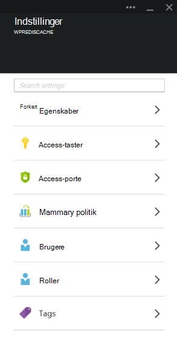

### <a name="add-redishost-app-setting"></a>Tilføj REDIS_HOST app indstilling

Den første app-indstilling, skal du oprette er den **REDIS\_HOST** app indstilling. Denne indstilling angiver destinationen, shim videresender cacheoplysningerne om. Den værdi, der kræves til indstillingen REDIS_HOST app kan hentes fra bladet **Egenskaber** for din Redis Cache forekomst.

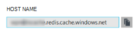

Indstille nøglen af indstillingen app til **REDIS\_HOST** og værdien af indstillingen app til **hostname** af forekomsten Redis Cache.

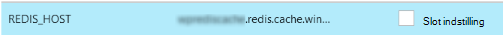

### <a name="add-rediskey-app-setting"></a>Tilføj REDIS_KEY app indstilling

Den anden app-indstilling, skal du oprette er den **REDIS\_nøgle** app indstilling. Denne indstilling giver tokenet godkendelse kræves sikker adgang forekomsten Redis Cache. Du kan hente den værdi, der kræves til indstillingen REDIS_KEY app fra **Access-taster** blade af forekomsten Redis Cache.

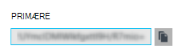

Indstille nøglen af indstillingen app til **REDIS\_nøgle** og værdien af indstillingen app til den **Primærnøgle** i forekomsten Redis Cache.

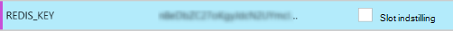

### <a name="add-memcacheshimredisenable-app-setting"></a>Tilføj MEMCACHESHIM_REDIS_ENABLE app indstilling

Indstillingen sidste app bruges til at aktivere Memcache Shim i Web Apps, som bruger REDIS_HOST og REDIS_KEY til at oprette forbindelse til Azure Redis cachen og videresende cachen opkald. Indstille nøglen af indstillingen app til **MEMCACHESHIM\_REDIS\_AKTIVERE** og værdien **Sand**.

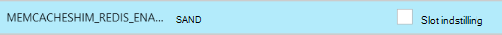

Når du er færdig med at tilføje de tre (3) app-indstillinger, klik på **Gem**.

## <a name="enable-memcache-extension-for-php"></a>Aktiver Memcache udvidelse til PHP

Det er nødvendigt at installere filtypenavnet Memcache til PHP – rammerne sprog for webstedet WordPress i rækkefølge for programmet til at tale Memcache protocol.

### <a name="download-the-phpmemcache-extension"></a>Hente php_memcache udvidelse

Gå til [PECL][6]. Klik på [memcache]under kategorien cachelagring[7]. Klik på linket DLL under kolonnen overførsler.


Hent linket ikke tråd sikre (NTS) x86 for versionen af PHP er aktiveret i Web Apps. (Standard er PHP 5.4)

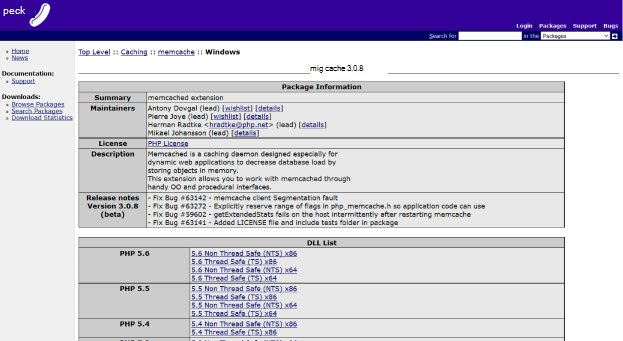

### <a name="enable-the-phpmemcache-extension"></a>Aktivere filtypenavnet php_memcache

Når du har hentet filen, Udpak filen, og Overfør den **php\_memcache.dll** til den **d:\\privat\\websted\\wwwroot\\placering\\lokal\\ ** directory. Når php_memcache.dll er overført i WebApp, skal du aktivere filtypenavnet til PHP Runtime. For at aktivere filtypenavnet Memcache i portalen Azure skal du åbne bladet **Programindstillinger** web App og derefter tilføje en ny app indstilling med nøgle **PHP\_FILTYPENAVNE** og værdien **placering\\lokal\\php_memcache.dll**.


> [AZURE.NOTE] Hvis WebApp skal at indlæse flere PHP filtypenavne, skal værdien af PHP_EXTENSIONS være en kommasepareret liste over relative stier til DLL-filer.

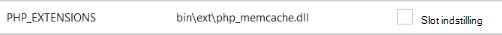

Når færdig, skal du klikke på **Gem**.

## <a name="install-memcache-wordpress-plugin"></a>Installere plug-in Memcache WordPress

> [AZURE.NOTE] Du kan også hente [Memcached objekt Cache plug-in](https://wordpress.org/plugins/memcached/) fra WordPress.org.

Klik på **Tilføj ny**på siden WordPress plug-ins.


Skriv **memcached** i søgefeltet, og tryk på **Enter**.

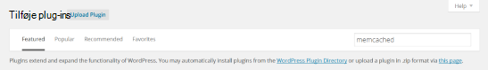

Find **Memcached objekt-Cache** på listen, og derefter klikke på **Installer nu**.

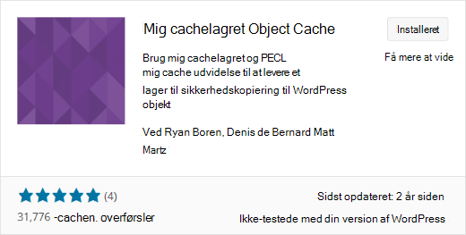

### <a name="enable-the-memcache-wordpress-plugin"></a>Aktivere Memcache WordPress plug-in'en

>[AZURE.NOTE] Følg vejledningen i denne blog om, [hvordan du aktiverer filtypenavnet websted i Web Apps] [ 8] at installere Visual Studio Team Services.

I den `wp-config.php` fil, skal du tilføje følgende kode over stop redigering kommentar i slutningen af filen.

```php
$memcached_servers = array(
    'default' => array('localhost:' . getenv("MEMCACHESHIM_PORT"))
);
```

Når denne kode er blevet indsat, gemmer monaco automatisk dokumentet.

Næste trin er at aktivere et objekt-cachen plug-in. Det gør du ved at trække og slippe **objekt cache.php** fra **wp-indhold/plug-ins/memcached** mappe til mappen **wp indhold** for at aktivere funktionen Memcache Object Cache.

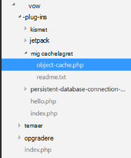

Nu hvor **objekt cache.php** filen er i mappen **wp-indhold** , er Memcached objekt-cachen nu aktiveret.

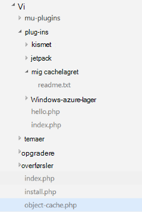

## <a name="verify-the-memcache-object-cache-plugin-is-functioning"></a>Kontrollere Memcache Object Cache plug-in'et fungerer

Alle disse trin for at aktivere Web Apps Memcache shim er nu færdig. Eneste venstre er at kontrollere, at dataene er udfylde din Redis Cache forekomst.

### <a name="enable-the-non-ssl-port-support-in-azure-redis-cache"></a>Aktivere understøttelse af port på ikke-SSL i Azure Redis Cache

>[AZURE.NOTE] Samtidig med at skrive i denne artikel, understøtter den Redis CLI ikke SSL-forbindelse, og som derfor følgende trin er nødvendigt.

Gå til den Redis Cache-forekomst, du har oprettet for denne WebApp i Azure-portalen. Når den cache blade er åben, skal du klikke på ikonet **Indstillinger** .

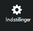

Vælg **Access porte** på listen.

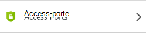

Klik på **Nej** for **Tillad adgang kun via SSL**.

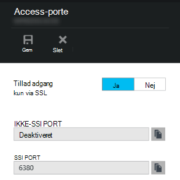

Du får vist, ikke-SSL-porten nu er angivet. Klik på **Gem**.

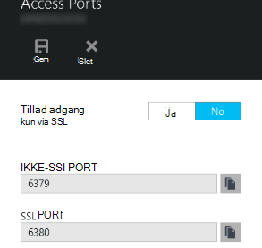

### <a name="connect-to-azure-redis-cache-from-redis-cli"></a>Oprette forbindelse til Azure Redis Cache fra redis cli

>[AZURE.NOTE] Dette trin forudsætter, redis er installeret lokalt på din computer og udvikling. [Installere Redis lokalt ved hjælp af disse instruktioner][9].

Åbne kommandolinjen konsollen efter valg og skrive følgende kommando:

```shell
redis-cli –h <hostname-for-redis-cache> –a <primary-key-for-redis-cache> –p 6379
```

Erstatte den ** &lt;hostname-til-redis-cache&gt; ** med de faktiske xxxxx.redis.cache.windows.net hostname og ** &lt;primær-nøgle-til-redis-cache&gt; ** hurtigtast for cachen, tryk derefter på **Enter**. Når CLI har forbindelse til Redis Cache-forekomsten, udstede redis kommandoer. Jeg har valgt til at få vist de pågældende taster i skærmbilledet nedenfor.

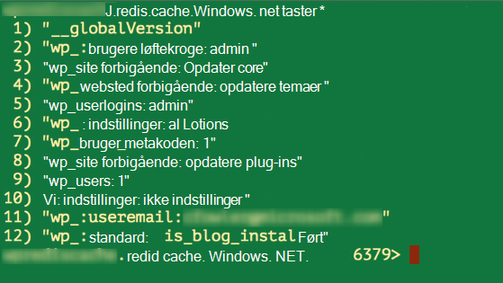

Opkaldet med listen over tasterne skal returnere en værdi. Hvis ikke, prøv at navigere til WebApp og prøve igen.

## <a name="conclusion"></a>Konklusion

Tillykke! Appen WordPress har nu en centralt i hukommelsen cache til støtte i stigende overførselshastighed. Husk, at Web Apps Memcache Shim kan bruges sammen med enhver Memcache klient uanset programmeringssprog eller program framework. Give feedback eller stille spørgsmål om shim Web Apps Memcache indlæg til [MSDN-foraene] [ 10] eller [Stackoverflow][11].

>[AZURE.NOTE] Hvis du vil komme i gang med Azure App Service før tilmelding til en Azure-konto, skal du gå til [Prøve App Service](http://go.microsoft.com/fwlink/?LinkId=523751), hvor du straks kan oprette en forbigående starter WebApp i App-tjeneste. Ingen kreditkort, der kræves. ingen forpligtelser.

## <a name="whats-changed"></a>Hvad er ændret
* Finde en vejledning til ændring fra websteder til App-tjenesten: [Azure App Service og dens indvirkning på eksisterende Azure Services](http://go.microsoft.com/fwlink/?LinkId=529714)


[0]: ../redis-cache/cache-dotnet-how-to-use-azure-redis-cache.md#create-a-cache
[1]: http://bit.ly/1t0KxBQ
[2]: http://manage.windowsazure.com
[3]: http://portal.azure.com
[4]: ../powershell-install-configure.md
[5]: /downloads
[6]: http://pecl.php.net
[7]: http://pecl.php.net/package/memcache
[8]: http://blog.syntaxc4.net/post/2015/02/05/how-to-enable-a-site-extension-in-azure-websites.aspx
[9]: http://redis.io/download#installation
[10]: https://social.msdn.microsoft.com/Forums/home?forum=windowsazurewebsitespreview
[11]: http://stackoverflow.com/questions/tagged/azure-web-sites
[12]: /services/cache/
[13]: http://memcached.org
