<properties
   pageTitle="Oprette en ASP.NET 5 WebApp i Visual Studio-kode"
   description="Dette selvstudium viser, hvordan du opretter en ASP.NET 5 WebApp, ved hjælp af Visual Studio-kode."
   services="app-service\web"
   documentationCenter=".net"
   authors="erikre"
   manager="wpickett"
   editor="jimbe"/>

<tags
    ms.service="app-service-web" 
    ms.workload="web" 
    ms.tgt_pltfrm="dotnet" 
    ms.devlang="na" 
    ms.topic="article" 
    ms.date="02/26/2016" 
    ms.author="cephalin"/>

# Oprette en ASP.NET 5 WebApp i Visual Studio-kode

## Oversigt

Dette selvstudium viser, hvordan du opretter en ASP.NET 5 online ved hjælp af [Visual Studio koden (VS)](http://code.visualstudio.com//Docs/whyvscode) og installerer det til [Azure App-tjenesten](../app-service/app-service-value-prop-what-is.md). 

> [AZURE.NOTE] Selvom denne artikel refererer til webapps, gælder det også for API-apps og mobilapps. 

ASP.NET 5 er et betydeligt nyt design af ASP.NET. ASP.NET 5 er en ny open source- og på tværs af platforme ramme opbygning af moderne skybaseret webapps ved hjælp af .NET. Se [Introduktion til ASP.NET 5](http://docs.asp.net/en/latest/conceptual-overview/aspnet.html)kan finde flere oplysninger. Du kan finde oplysninger om Azure App Service webapps [Web Apps oversigt](app-service-web-overview.md).

[AZURE.INCLUDE [app-service-web-try-app-service.md](../../includes/app-service-web-try-app-service.md)]

## Forudsætninger  

* Installere [eller-kode](http://code.visualstudio.com/Docs/setup).
* Installer- [Node.js](http://nodejs.org) - Node.js er en platform til udvikling af hurtigt og SVG serverprogrammer ved hjælp af JavaScript. Node er runtime (Node), og [npm](http://www.npmjs.com/) er Package Manager for Node moduler. Du vil bruge npm til scaffold en ASP.NET-5-WebApp i dette selvstudium.
* Installere ciffer – kan du installere det fra følgende steder: [Chocolatey](https://chocolatey.org/packages/git) eller [ciffer scm.com](http://git-scm.com/downloads). Hvis du er ny bruger af ciffer, Vælg [ciffer scm.com](http://git-scm.com/downloads) , og vælg indstillingen for at **Bruge ciffer fra Windows kommandoprompten**. Når du installerer ciffer, skal du også angive brugernavn ciffer og mail som det er påkrævet senere i selvstudiet (når du udfører en bekræftelse fra eller-kode).  

## Installere ASP.NET 5 og DNX
ASP.NET-5/DNX (.NET udførelse af miljø) er en slank .NET stak opbygning af moderne skyen og webapps, der kører på OS X, Linux og Windows. Det er blevet opbygget fra bunden til at levere en optimeret udvikling ramme til apps, der er enten installeret i skyen eller køre i det lokale miljø. Det består af modul komponenter med minimale omkostninger, så du bevare fleksibilitet under bygning af dine løsninger.

Dette selvstudium er udviklet til at komme i gang med at oprette programmer med de nyeste versioner udvikling af ASP.NET 5 og DNX. De følgende instruktioner er specifikke for Windows. Se [installere ASP.NET 5 og DNX](https://code.visualstudio.com/Docs/ASPnet5#_installing-aspnet-5-and-dnx)mere detaljeret installationsvejledning til OS X, Linux og Windows. 

1. Hvis du vil installere .NET Version Manager (DNVM) i Windows, Åbn en kommandoprompt, og køre følgende kommando.

        @powershell -NoProfile -ExecutionPolicy unrestricted -Command "&{$Branch='dev';iex ((new-object net.webclient).DownloadString('https://raw.githubusercontent.com/aspnet/Home/dev/dnvminstall.ps1'))}"

    Dette vil hente scriptet DNVM og placere den i din brugermappe profil. 

2. **Genstart Windows** for at fuldføre installationen DNVM. 

    Når du har genstartet Windows, kan du åbne kommandoprompten for at bekræfte placeringen af DNVM ved at skrive følgende:

        where dnvm

    Kommandoprompten, vises en sti i stil med følgende.

    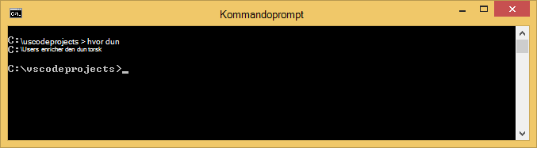

3. Nu hvor du har DNVM, skal du bruge det til at hente DNX for at køre dine programmer. Kør følgende ved kommandoprompten:

        dnvm upgrade

    Bekræft din DNVM, og få vist den aktive runtime ved at skrive følgende ved kommandoprompten:

        dnvm list

    Kommandoprompten viser oplysninger om den aktive runtime.

    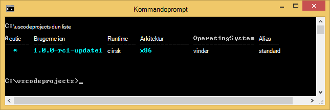

    Hvis mere end én DNX runtime er anført, kan du vælge at angive følgende (eller en nyere version) kommandoprompten til at angive den aktive DNX runtime. Angive den til den samme version, der bruges af ASP.NET 5 generator, når du opretter din online senere i dette selvstudium. *Du kan ikke nødvendigt at ændre den aktive runtime, hvis den er indstillet til den senest tilgængelig.*

        dnvm use 1.0.0-update1 –p

> [AZURE.NOTE] Se [installere ASP.NET 5 og DNX](https://code.visualstudio.com/Docs/ASPnet5#_installing-aspnet-5-and-dnx)mere detaljeret installationsvejledning til OS X, Linux og Windows. 

## Oprette WebApp 

Dette afsnit viser, hvordan du scaffold en ny app ASP.NET WebApp. Du vil bruge node pakke manager (npm) til at installere [Yeoman](http://yeoman.io/) (programmet stilladser værktøj – eller-kode udgave af Visual Studio **Filer > nyt projekt** handling), [Grunt](http://gruntjs.com/) (JavaScript opgave runner) og [Bower](http://bower.io/) (klient side pakke manager). 

1. Åbn en kommandoprompt med administratorrettigheder, og gå til det sted, hvor du vil oprette projektet ASP.NET. For eksempel oprette en *vscodeprojects* mappe i roden af C:\.

2. Angiv følgende ved kommandoprompten til at installere Yeoman og understøttende værktøjerne.

        npm install -g yo grunt-cli generator-aspnet bower

    > [AZURE.NOTE] Du kan få en advarsel, der viser, at din npm version er forældet. En advarsel påvirker ikke dette selvstudium.

3. Angiv følgende ved kommandoprompten til at oprette projektmappen og scaffold appen.

        yo aspnet

4. Brug piletasterne til at vælge den **Web Application grundlæggende** type fra ASP.NET 5 generator menuen, og tryk på ** &lt;Enter >**.

    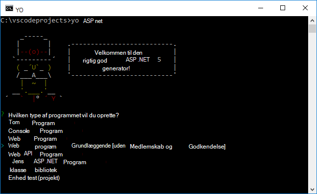

5. Angiv navnet på din nye ASP.NET WebApp til **SampleWebApp**. Da dette navn er anvendt i hele selvstudiet, hvis du vælger et andet navn, skal du erstatte hver forekomst af **SampleWebApp**. Når du trykker på ** &lt;Enter >**, Yeoman opretter en ny mappe med navnet **SampleWebApp** og de nødvendige filer til din nye app.

6. Ved kommandoprompten, skifte til den nye projektmappe:

        cd SampleWebApp

7. Også ved kommandoprompten, for at installere de nødvendige NuGet pakker for at køre programmet, Skriv følgende kommando:

        dnu restore

8. Åbne eller-kode ved at skrive følgende ved kommandoprompten:

        code .

## Køre WebApp lokalt

Nu, hvor du har oprettet WebApp og hentet alle NuGet-pakker til appen, kan du køre online lokalt.

1. **Kommandoen palet** eller-kode, skal du angive følgende for at få vist de tilgængelige køre kommandoindstillinger:

        dnx: Run Command

    > [AZURE.NOTE] Hvis serveren Omnisharp ikke kører i øjeblikket, starter det. Angiv ovenstående kommando igen.

    Derefter skal du vælge følgende kommando for at køre din online:
        
        dnx web - (SampleWebApp)

    Vises i kommandovinduet, at programmet er startet. Hvis kommandovinduet ikke vises denne meddelelse, skal du markere den nederste venstre corning af eller-kode for fejl i dit projekt.
    
    > [AZURE.NOTE]Udstede en kommando fra **Kommandoen paletten** kræver en **>** tegn i starten af kommandolinjen. Du kan få vist oplysninger, der er relateret til **web** -kommandoen i filen *project.json* .   
    > Hvis kommandoen ikke vises eller er ikke tilgængelig, skal du muligvis installere filtypenavnet C#. Køre `>Extensions: Install Extension` og `ext install c#` at installere C#-udvidelser.

2. Åbn en browser, og gå til følgende URL-adressen.

    **http://localhost:5000**

    Standardsiden af WebApp vises på følgende måde.

    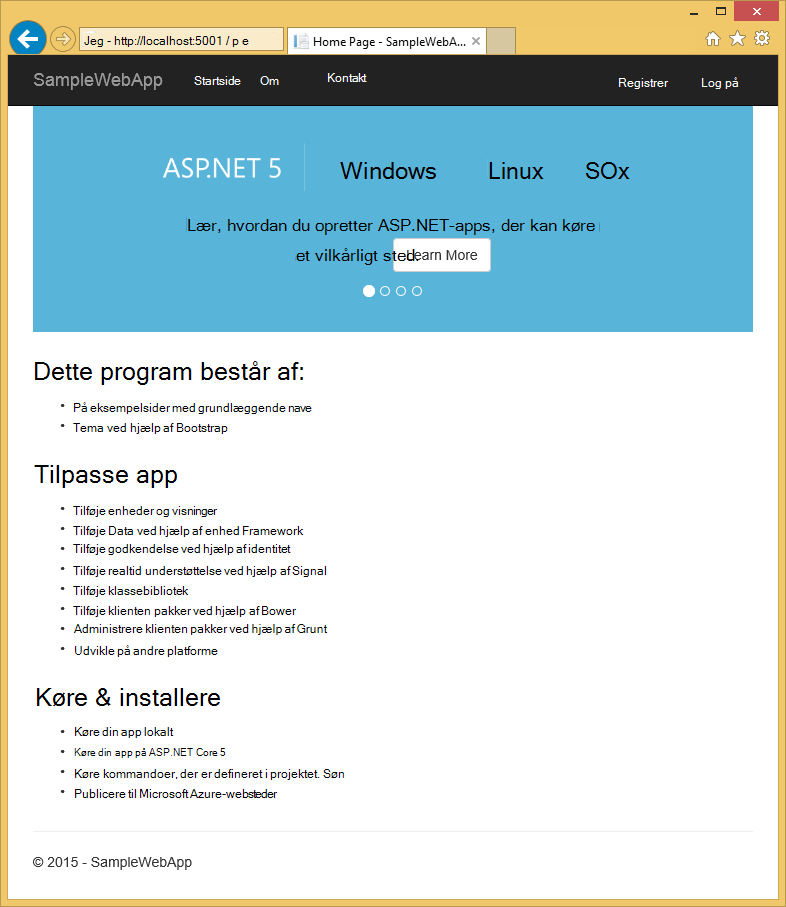

3. Luk browseren. Tryk på **Ctrl + C** for at lukke programmet og lukke **Vinduet med kommandoen**i **Kommandovindue**. 

## Oprette en WebApp i portalen Azure

Følgende trin hjælper dig med at oprette en web-app i portalen Azure.

1. Log på [Azure-portalen](https://portal.azure.com).

2. Klik på **Ny** øverst til venstre på portalen.

3. Klik på **Web Apps > Web App**.

    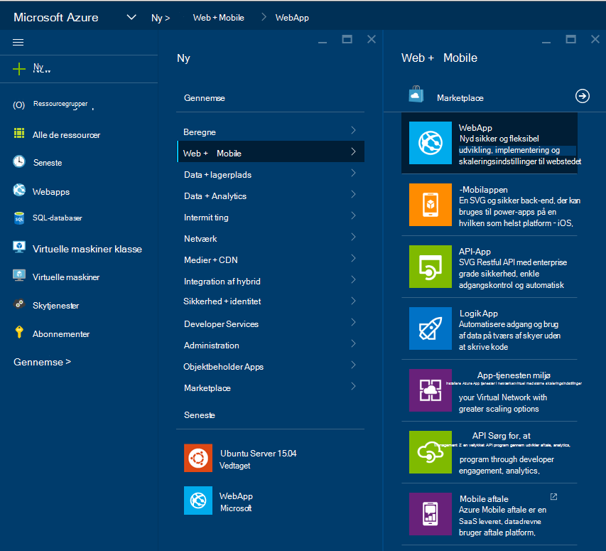

4. Indtast en værdi for **navn**, som **SampleWebAppDemo**. Bemærk, at dette navn skal være entydig og portalen gennemtvinger, når du forsøger at skrive navnet. Derfor, hvis du vælger en enter en anden værdi, skal du erstatte den pågældende værdi for hver forekomst af **SampleWebAppDemo** , der vises i dette selvstudium. 

5. Vælg en eksisterende **App Service planlægge** eller Opret en ny. Hvis du opretter en ny plan, Vælg det priser niveau, placering og andre indstillinger. Yderligere oplysninger om App tjenesteplanerne artiklen, [Azure App Service planer dybden oversigt](../app-service/azure-web-sites-web-hosting-plans-in-depth-overview.md).

    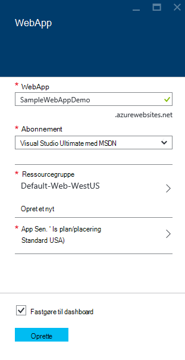

6. Klik på **Opret**.

    

## Aktivere ciffer udgivelse for den nye WebApp

Ciffer er et fordelt version control system, du kan bruge til at udrulle din Azure App Service WebApp. Du vil gemme den kode, du skriver til din online i et lokalt lager ciffer, og du skal installere din kode til Azure ved at trykke på til en ekstern lager.   

1. Log på [Azure-portalen](https://portal.azure.com).

2. Klik på **Gennemse**.

3. Klik på **Web Apps** for at få vist en liste over de webapps, der er knyttet til abonnementet Azure.

4. Vælg den WebApp, du har oprettet i dette selvstudium.

5. Klik på **Indstillinger**i bladet web app > **fortløbende installation**. 

    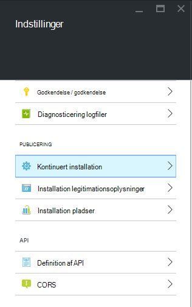

6. Klik på **Vælg kilde > lokale ciffer lager**.

7. Klik på **OK**.

    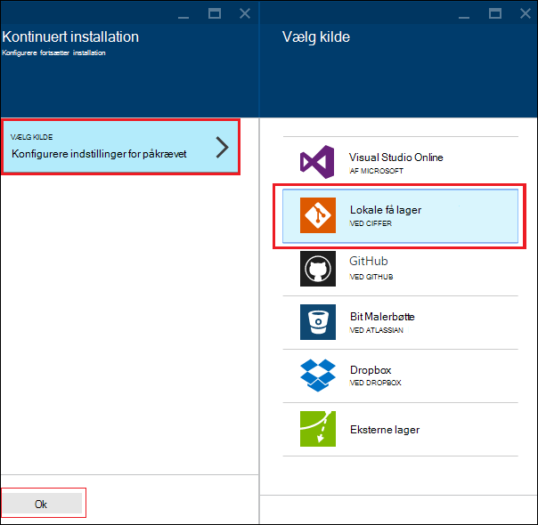

8. Hvis du tidligere har ikke har konfigureret installation legitimationsoplysninger til publicering af en WebApp eller andre App Service app konfigurere dem nu:

    * Klik på **Indstillinger for** > **installation legitimationsoplysninger**. Bladet **angive installation legitimationsoplysninger** vises.

    * Oprette et brugernavn og adgangskode.  Du skal bruge denne adgangskode senere, når du konfigurerer ciffer.

    * Klik på **Gem**.

9. Klik på i din online blade **Indstillinger > egenskaber**. URL-adressen til det remote ciffer lager, som du vil anvende til vises under **CIFFER URL-adresse**.

10. Kopiér værdien **CIFFER URL-adressen** til senere brug i selvstudiet.

    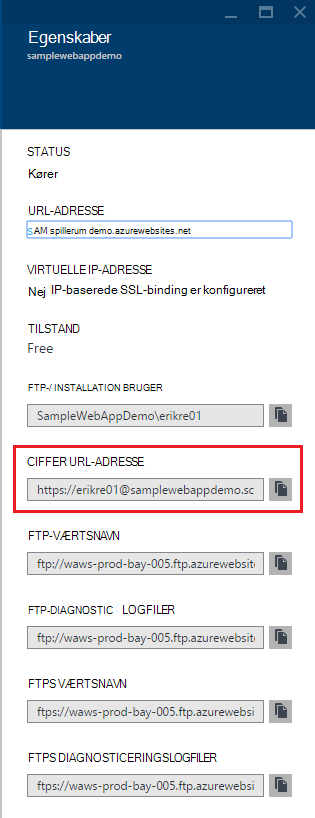

## Udgive din online til Azure App Service

I dette afsnit kan du oprette en lokal ciffer lager og opslagsnål fra lageret til Azure skal installeres din online til Azure.

1. I eller-kode, skal du vælge indstillingen **ciffer** i venstre navigationslinje.

    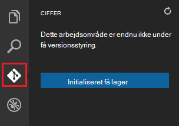

2. Vælg **initialiseret ciffer lager** at sikre, at dit arbejdsområde er underlagt ciffer versionsstyring. 

    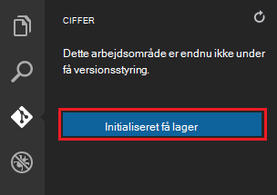

3. Åbn vinduet kommandoen og skifte til mappen på din online. Skriv følgende kommando:

        git config core.autocrlf false

    Denne kommando forhindrer et problem om tekst, hvor CRLF slutningen og LF slutningen er forbundet.

4. Tilføje en bekræftelse eller-kode, og klik på ikonet **Anvend alle** afkrydsningsfelt.

    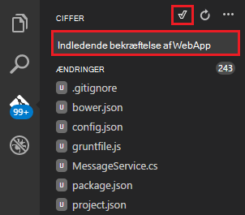

5. Når ciffer er fuldført behandling, ser du, at der er ingen filer, der vises i vinduet ciffer under **ændringer**. 

    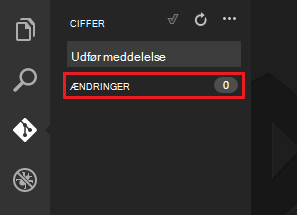

6. Skift tilbage til kommandovinduet hvor kommandoprompten peger til mappen, hvor din online er placeret.

7. Oprette en ekstern reference for at placere opdateringer til din online ved hjælp af ciffer URL-adressen (slut i ".git"), som du kopierede tidligere.

        git remote add azure [URL for remote repository]

8. Konfigurere ciffer for at gemme dine legitimationsoplysninger lokalt, så de, føjes automatisk til din push-kommandoer, der er dannet ud fra eller-kode.

        git config credential.helper store

9. Overføre dine ændringer til Azure ved at skrive følgende kommando. Når denne indledende opslagsnål til Azure, vil du kunne gøre alle push-kommandoer fra eller-kode. 

        git push -u azure master

    Du bliver bedt om den adgangskode, du oprettede tidligere i Azure. **Bemærk: Adgangskoden vil ikke være synlige.**

    Output fra ovenstående kommando slutter med en meddelelse, der vellykket udrulning.

        remote: Deployment successful.
        To https://user@testsite.scm.azurewebsites.net/testsite.git
        [new branch]      master -> master

> [AZURE.NOTE] Hvis du foretager ændringer i din app, kan du genudgive direkte i VS kode ved hjælp af indbyggede ciffer funktionaliteten ved at vælge indstillingen **Udfør alle** efterfulgt af indstillingen **Push** . Du kan finde indstillingen **Push** tilgængelig i rullemenuen ud for knapperne **Acceptere alle** og **opdatere** .

Hvis du har brug for til at samarbejde om et projekt, kan du overveje at skubbe til GitHub mellem skubber længere til Azure.

## Køre appen i Azure
Nu hvor du har installeret din online, Lad os køre app, mens Azure som vært. 

Dette kan gøres på to måder:

* Åbn en browser, og skriv navnet på din online på følgende måde.   

        http://SampleWebAppDemo.azurewebsites.net
 
* Find bladet web app til din online i Azure-portalen, og klik på **Gennemse** for at få vist din app 
* i din standardbrowser.

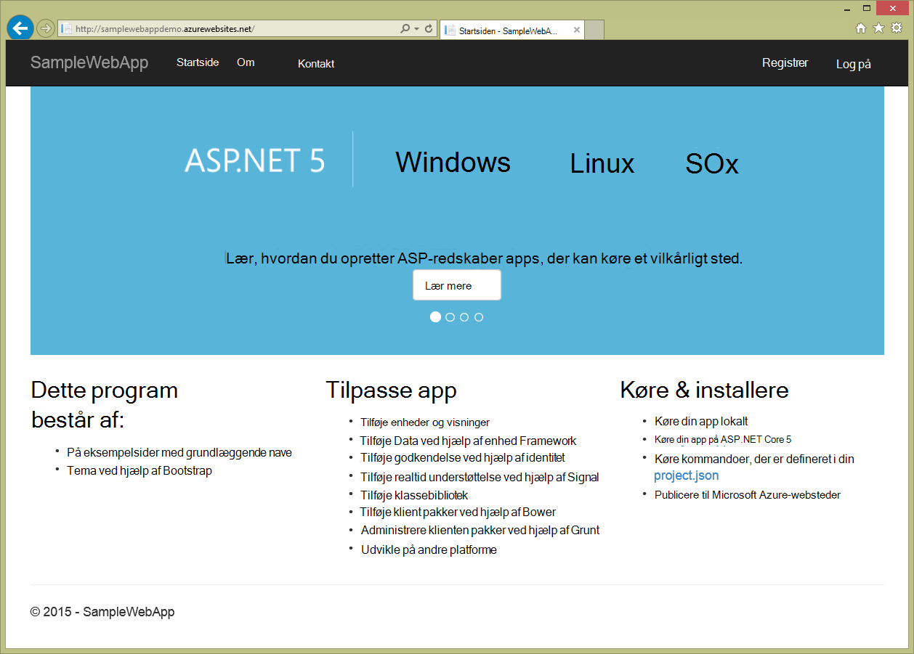

## Oversigt
I dette selvstudium, du har lært at oprette en WebApp eller-kode og installerer det til Azure. Du kan finde flere oplysninger om eller-kode artiklen, [Hvorfor Visual Studio kode?](https://code.visualstudio.com/Docs/) Du kan finde oplysninger om App Service webapps [Web Apps oversigt](app-service-web-overview.md). 
