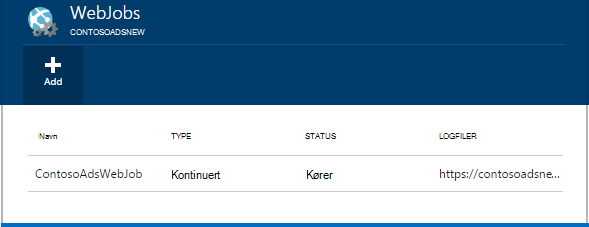
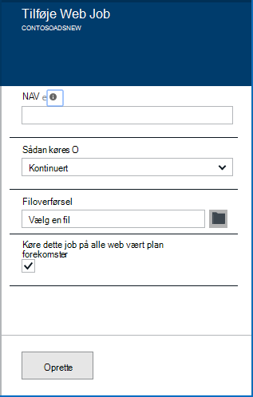
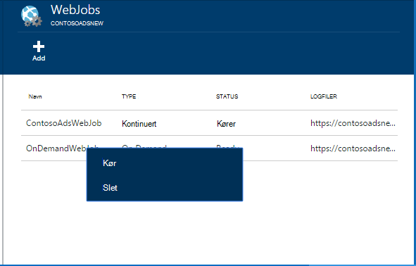
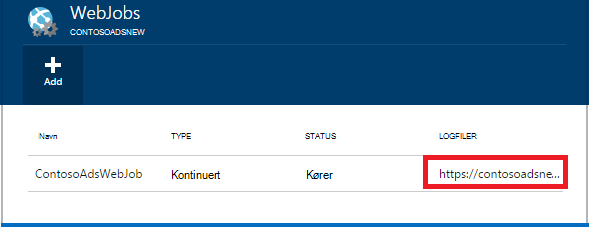

<properties 
    pageTitle="Køre baggrundsopgaverne med WebJobs" 
    description="Lær at køre opgaver i baggrunden i Azure webapps." 
    services="app-service" 
    documentationCenter="" 
    authors="tdykstra" 
    manager="wpickett" 
    editor="jimbe"/>

<tags 
    ms.service="app-service" 
    ms.workload="na" 
    ms.tgt_pltfrm="na" 
    ms.devlang="na" 
    ms.topic="article" 
    ms.date="04/27/2016" 
    ms.author="tdykstra"/>

# <a name="run-background-tasks-with-webjobs"></a>Køre baggrundsopgaverne med WebJobs

## <a name="overview"></a>Oversigt

Du kan køre programmer eller scripts i WebJobs i din [App Service](http://go.microsoft.com/fwlink/?LinkId=529714) WebApp på tre måder: efter behov, løbende, eller på en tidsplan. Der er gratis at bruge WebJobs.

I denne artikel viser, hvordan du installerer WebJobs ved hjælp af [Azure-portalen](https://portal.azure.com). For at få oplysninger om, hvordan du installerer ved hjælp af Visual Studio eller en fortløbende leveringsprocessen, se, [hvordan du installerer Azure WebJobs til Web Apps](websites-dotnet-deploy-webjobs.md).

Azure WebJobs SDK forenkler mange WebJobs programming opgaver. Se [Hvad er WebJobs SDK](websites-dotnet-webjobs-sdk.md)kan finde flere oplysninger.

 Azure-funktioner (i øjeblikket i preview) er en anden måde til at køre programmer og scripts i Azure App Service. Se [Oversigt over Azure funktioner](../azure-functions/functions-overview.md)kan finde flere oplysninger.

[AZURE.INCLUDE [app-service-web-to-api-and-mobile](../../includes/app-service-web-to-api-and-mobile.md)] 

## <a name="acceptablefiles"></a>Gyldige filformater for scripts eller programmer

Følgende filtyper accepteres:

* cmd., .bat, .exe (ved hjælp af windows cmd)
* .ps1 (ved hjælp af powershell)
* .sh (ved hjælp af fest)
* .php (ved hjælp af php)
* .py (ved hjælp af python)
* .js (ved hjælp af node)
* .JAR (ved hjælp af java)

## <a name="CreateOnDemand"></a>Oprette en on demand WebJob i portalen

1. Klik på i bladet **Online** [Azure Portal](https://portal.azure.com) **alle indstillinger > WebJobs** til at vise bladet **WebJobs** .
    
    
    
5. Klik på **Tilføj**. Dialogboksen **Tilføj WebJob** vises.
    
    
    
2. Angiv et navn til WebJob under **navn**. Navnet skal starte med et bogstav eller et tal og kan ikke indeholder nogen specialtegn andet end "-" og "_".
    
4. I feltet **Sådan Kør** skal du vælge **køres efter behov**.
    
3. I feltet **Filoverførsel** skal du klikke på mappeikonet og gå til den zip-fil, der indeholder dit script. Zip-filen skal indeholde din eksekverbar fil (.exe cmd. .bat .sh .php .py .js) samt eventuelle supplerende filer, der kræves for at køre programmet eller scriptet.
    
5. Markér **Opret** for at overføre scriptet til din online. 
    
    Det navn, du har angivet for WebJob vises på listen i bladet **WebJobs** .
    
6. Højreklik på navnet på listen for at køre WebJob, og klik på **Kør**.
    
    
    
## <a name="CreateContinuous"></a>Oprette en køre kontinuerligt WebJob

1. For at oprette en løbende udførelsen WebJob skal du følge de samme trin til oprettelse af en WebJob, kører én gang, men i feltet **Sådan Kør** vælger **fortløbende**.

2. Højreklik på WebJob på listen for at starte eller stoppe en fortløbende WebJob, og klik på **Start** eller **Stop**.
    
> [AZURE.NOTE] Hvis din online kører på mere end én forekomst, kører en køre kontinuerligt WebJob på alle dine forekomster. Efter behov og planlagte WebJobs køre på en enkelt forekomst, der er valgt til justering af belastning af Microsoft Azure.
    
> For fortløbende WebJobs til at køre pålideligt og på alle forekomster, Aktivér altid på * denne indstilling for ellers online de kan stoppe med at køre, når SCM udbyders websted har været inaktiv for længe.

## <a name="CreateScheduledCRON"></a>Oprette en planlagt WebJob ved hjælp af en CRON udtryk

Denne metode er tilgængelig for Web Apps, der kører i Basic, Standard eller Premium tilstand og kræver indstilling **Altid på** kan aktiveres på appen.

Du kan aktivere en på Demand WebJob i et planlagt WebJob ved blot at medtage en `settings.job` fil i roden af din WebJob zip-fil. Denne JSON-filen skal indeholde en `schedule` egenskaben med et [CRON udtryk](https://en.wikipedia.org/wiki/Cron), i eksemplet nedenfor.

Udtrykket CRON består af 6 felter: `{second} {minute} {hour} {day} {month} {day of the week}`.

For eksempel, at udløse din WebJob hver 15 minutter viser dine `settings.job` ville have:

```json
{
    "schedule": "0 */15 * * * *"
}
``` 

Andre CRON tidsplan eksempler:

- Hver time (dvs. Når antallet af minutter er 0):`0 0 * * * *` 
- Hver time fra 9 AM til 5 PM:`0 0 9-17 * * *` 
- På 9:30 Morgen hver dag:`0 30 9 * * *`
- På 9:30 AM hver ugedag:`0 30 9 * * 1-5`

**Bemærk**: Når du installerer en WebJob fra Visual Studio, Sørg for at markere din `settings.job` filegenskaber som 'Kopi Hvis nyere'.


## <a name="CreateScheduled"></a>Oprette en planlagt WebJob ved hjælp af Azure planlæggeren

Følgende alternative teknik gør brug af Azure planlæggeren. I dette tilfælde har din WebJob ikke kendskab direkte til tidsplanen. I stedet bliver Azure planlæggeren konfigureret til at udløse din WebJob på en tidsplan. 

Portalen Azure endnu har ikke mulighed for at oprette en planlagt WebJob, men indtil, der er tilføjet funktion, kan du gøre det ved at bruge [Klassisk portal](http://manage.windowsazure.com).

1. Gå til siden WebJob [Klassisk portal](http://manage.windowsazure.com) og klik på **Tilføj**.

1. Vælg **Kør på en tidsplan**i feltet **Sådan Kør** .
    
    ![Ny planlagte jobbet][NewScheduledJob]
    
2. Vælg **Scheduler område** for dit arbejde, og klik derefter på pilen nederst til højre i dialogboksen for at fortsætte til næste skærmbillede.

3. I dialogboksen **Opret jobbet** , Vælg typen **Gentagelse** ønskede: **enkelt** eller **tilbagevendende job**.
    
    ![Planlæg gentagelse][SchdRecurrence]
    
4. Også vælge et **Start** -tidspunkt: **nu** eller **på et bestemt tidspunkt**.
    
    ![Starttidspunktet for tidsplan][SchdStart]
    
5. Hvis du vil starte på et bestemt tidspunkt, skal du vælge startværdierne klokkeslæt under **Start på**.
    
    ![Planlæg Start på et bestemt tidspunkt][SchdStartOn]
    
6. Hvis du vælger en tilbagevendende opgave, du har den **tilbagevendende hver** indstilling for at angive hyppigheden for forekomst og indstillingen **Slutter på** for at angive et sluttidspunkt.
    
    ![Planlæg gentagelse][SchdRecurEvery]
    
7. Hvis du vælger **uger**, kan du markere afkrydsningsfeltet **På et bestemt tidsplan** og angive dagene i ugen, hvor du vil jobbet skal køre.
    
    ![Planlæg dage i ugen][SchdWeeksOnParticular]
    
8. Hvis du vælger **måneder** og markere afkrydsningsfeltet **På et bestemt tidsplan** , kan du angive et job skal køre på bestemte nummereret **dage** i måneden. 
    
    ![Planlæg bestemte datoer i måneden][SchdMonthsOnPartDays]
    
9. Hvis du vælger **Ugedage**, kan du vælge hvilke eller de dage i ugen i den ønskede jobbet skal køre måned.
    
    ![Planlægge bestemt ugedage i en måned][SchdMonthsOnPartWeekDays]
    
10. Til sidst skal du også kan bruge indstillingen **forekomster** for at vælge, hvilke uge i måneden (første, anden, tredje osv.) du vil have jobbet køres på de ugedage, du har angivet.
    
    ![Planlægge bestemt ugedage på bestemt uger i en måned][SchdMonthsOnPartWeekDaysOccurences]
    
11. Når du har oprettet en eller flere sager, vises deres navne under fanen WebJobs med deres status, tidsplantype og andre oplysninger. Historiske oplysninger om de seneste 30 WebJobs vedligeholdes.
    
    ![Gå til listen sager][WebJobsListWithSeveralJobs]
    
### <a name="Scheduler"></a>Planlagte opgaver og Azure Scheduler

Planlagte opgaver kan konfigureres yderligere i Azure Scheduler siderne i [Klassisk portal](http://manage.windowsazure.com).

1.  Klik på den sag **tidsplan** link til at navigere til siden Azure Scheduler-portalen på siden WebJobs. 
    
    ![Link til Azure Scheduler][LinkToScheduler]
    
2. Klikke på sag, på siden Scheduler.
    
    ![Jobbet på siden Scheduler-portalen][SchedulerPortal]
    
3. Siden **Job handling** åbnes, hvor du kan konfigurere jobbet yderligere. 
    
    ![Jobbet handling PageInScheduler][JobActionPageInScheduler]
    
## <a name="ViewJobHistory"></a>Få vist jobs

1. Klik på den tilsvarende link under kolonnen **logge** af bladet WebJobs for at få vist historikken for en sag, inklusive job, der er oprettet med SDK WebJobs udførelse af. (Du kan bruge ikonet Udklipsholder til at kopiere URL-adressen på siden log fil til Udklipsholder, hvis du vil.)
    
    
        
2. Klikker på linket åbner siden detaljer for WebJob. Denne side viser navnet på den kommando, der kører, de sidste tidspunkter, hvor det har kørt, og dets lykkes eller mislykkes. Klik på et tidspunkt for at se flere oplysninger under **seneste jobbet køres**.
    
    ![WebJobDetails][WebJobDetails]
    
3. Oplysningssiden **WebJob køre** vises. Klik på **Til/fra Output** for at få vist teksten i indholdet i logfilen. Output loggen er i tekstformat. 
    
    ![Web jobbet skal køres detaljer][WebJobRunDetails]
    
4. Klik på **knappen Hent** for at få vist outputteksten i et separat browservindue. Højreklik på linket for at hente selve teksten, og benyt webbrowserens mulighed for at gemme filindholdet.
    
    ![Hente log output][DownloadLogOutput]
    
5. Linket **WebJobs** øverst på siden indeholder en nem måde at få adgang til en liste over WebJobs på dashboardet til oversigten.
    
    ![Oprette et link til WebJobs liste][WebJobsLinkToDashboardList]
    
    ![Liste over WebJobs i oversigt over dashboard][WebJobsListInJobsDashboard]
    
    Klikke på en af disse links, kommer du til siden WebJob for den sag, du har valgt.


## <a name="WHPNotes"></a>Noter
    
- Webapps i gratis tilstand kan timeout, når 20 minutter, hvis der er ingen anmodninger om webstedet scm (installation), og den online portal er ikke åbnes i Azure. Anmodninger til det websted, der faktisk nulstiller ikke dette.
- Kode for en fortløbende sag skal skrives til at køre i en uendelig løkke.
- Kontinuert job køres løbende kun, når WebApp er op.
- Grundlæggende og Standard funktionsmåder tilbud altid på funktioner som, når den er aktiveret, forhindres Onlines bliver inaktiv.
- Du kan kun foretage fejlfinding af tiden kører WebJobs. Fejlfinding planlagte eller efter behov WebJobs understøttes ikke.

## <a name="NextSteps"></a>Næste trin
 
Du kan finde flere oplysninger, se [Azure WebJobs anbefalede ressourcer][WebJobsRecommendedResources].

[PSonWebJobs]:http://blogs.msdn.com/b/nicktrog/archive/2014/01/22/running-powershell-web-jobs-on-azure-websites.aspx
[WebJobsRecommendedResources]:http://go.microsoft.com/fwlink/?LinkId=390226

[OnDemandWebJob]: ./media/web-sites-create-web-jobs/01aOnDemandWebJob.png
[WebJobsList]: ./media/web-sites-create-web-jobs/02aWebJobsList.png
[NewContinuousJob]: ./media/web-sites-create-web-jobs/03aNewContinuousJob.png
[NewScheduledJob]: ./media/web-sites-create-web-jobs/04aNewScheduledJob.png
[SchdRecurrence]: ./media/web-sites-create-web-jobs/05SchdRecurrence.png
[SchdStart]: ./media/web-sites-create-web-jobs/06SchdStart.png
[SchdStartOn]: ./media/web-sites-create-web-jobs/07SchdStartOn.png
[SchdRecurEvery]: ./media/web-sites-create-web-jobs/08SchdRecurEvery.png
[SchdWeeksOnParticular]: ./media/web-sites-create-web-jobs/09SchdWeeksOnParticular.png
[SchdMonthsOnPartDays]: ./media/web-sites-create-web-jobs/10SchdMonthsOnPartDays.png
[SchdMonthsOnPartWeekDays]: ./media/web-sites-create-web-jobs/11SchdMonthsOnPartWeekDays.png
[SchdMonthsOnPartWeekDaysOccurences]: ./media/web-sites-create-web-jobs/12SchdMonthsOnPartWeekDaysOccurences.png
[RunOnce]: ./media/web-sites-create-web-jobs/13RunOnce.png
[WebJobsListWithSeveralJobs]: ./media/web-sites-create-web-jobs/13WebJobsListWithSeveralJobs.png
[WebJobLogs]: ./media/web-sites-create-web-jobs/14WebJobLogs.png
[WebJobDetails]: ./media/web-sites-create-web-jobs/15WebJobDetails.png
[WebJobRunDetails]: ./media/web-sites-create-web-jobs/16WebJobRunDetails.png
[DownloadLogOutput]: ./media/web-sites-create-web-jobs/17DownloadLogOutput.png
[WebJobsLinkToDashboardList]: ./media/web-sites-create-web-jobs/18WebJobsLinkToDashboardList.png
[WebJobsListInJobsDashboard]: ./media/web-sites-create-web-jobs/19WebJobsListInJobsDashboard.png
[LinkToScheduler]: ./media/web-sites-create-web-jobs/31LinkToScheduler.png
[SchedulerPortal]: ./media/web-sites-create-web-jobs/32SchedulerPortal.png
[JobActionPageInScheduler]: ./media/web-sites-create-web-jobs/33JobActionPageInScheduler.png
 
