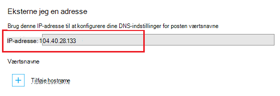

<properties
    pageTitle="Knytte et brugerdefineret domænenavn til en Azure-app"
    description="Lær at knytte et brugerdefineret domænenavn (vanity domæne) til din app i Azure App-tjeneste."
    services="app-service"
    documentationCenter=""
    authors="cephalin"
    manager="wpickett"
    editor="jimbe"
    tags="top-support-issue"/>

<tags
    ms.service="app-service"
    ms.workload="na"
    ms.tgt_pltfrm="na"
    ms.devlang="na"
    ms.topic="article"
    ms.date="07/27/2016"
    ms.author="cephalin"/>

# Knytte et brugerdefineret domænenavn til en Azure-app

[AZURE.INCLUDE [web-selector](../../includes/websites-custom-domain-selector.md)]

I denne artikel beskrives, hvordan manuelt tilknytte et brugerdefineret domænenavn til din online, mobilapp back end- eller API-app i [Azure App Service](../app-service/app-service-value-prop-what-is.md). 

Din app følger allerede med et entydigt underdomæne til azurewebsites.net. Eksempelvis hvis navnet på din app er **contoso**, er dens domænenavn **contoso.azurewebsites.net**. Dog kan du knytte et brugerdefineret domæne kald til app så, dens URL-adresse, som `www.contoso.com`, afspejler dit brand.

>[AZURE.NOTE] Få hjælp fra Azure-eksperter i [Azure-fora](https://azure.microsoft.com/support/forums/). Gå til [Azure supportwebsted](https://azure.microsoft.com/support/options/) for endnu højere niveauer af understøttelses, og klik på **Få Support**.

[AZURE.INCLUDE [introfooter](../../includes/custom-dns-web-site-intro-notes.md)]

## Køb et nyt brugerdefineret domæne Azure-portalen

Hvis du ikke allerede har købt et brugerdefineret domænenavn, kan du købe et og administrere den direkte i din app indstillinger i [Azure-portalen](https://portal.azure.com). Denne indstilling gør det nemt at knytte et brugerdefineret domæne til din app, om din app bruger [Azure trafik Manager](web-sites-traffic-manager-custom-domain-name.md) eller ej. 

Yderligere oplysninger finder du [købe et brugerdefineret domænenavn til App-tjenesten](custom-dns-web-site-buydomains-web-app.md).

## Knytte et brugerdefineret domæne, du har købt eksternt

Hvis du allerede har købt et brugerdefineret domæne fra [Azure DNS](https://azure.microsoft.com/services/dns/) eller fra en tredjepartsudbyder, er der tre hovedtrin tilknytte dit eget domæne til din app:

1. [ *(Kun a record)* få app IP-adresse](#vip).
2. [Oprette DNS-posterne at tilknytte dit domæne til din app](#createdns). 
    - **Hvor**: dit domæneregistrator egen værktøj til styring af (fx Azure DNS, GoDaddy osv.).
    - **Hvorfor**: så din domæneregistrator ved fortolkes det ønskede brugerdefinerede domæne til din Azure-app.
1. [Aktivere det brugerdefinerede domænenavn til din Azure-app](#enable).
    - **Hvor**: [Azure-portalen](https://portal.azure.com).
    - **Hvorfor**: så din app ved for at svare på mødeindkaldelser, der er foretaget i det brugerdefinerede domænenavn.
3. [Bekræfte DNS-overførsel](#verify).

### Typer af domæner, kan du knytte

Azure App Service kan du tilknytte følgende kategorier af brugerdefinerede domæner til din app.

- **Roddomænet** - det domænenavn, du reserveret hos domæneregistratoren (repræsenteret af den `@` hoste post typisk). For eksempel, **contoso.com**.
- **Underdomæne** - alle domæner, der er under din roddomænet. For eksempel **www.contoso.com** (repræsenteret af den `www` hoste post).  Du kan knytte forskellige underdomæner for samme roddomænet til forskellige apps i Azure.
- **Jokertegn domæne** - [et underdomæne, hvis længst til venstre DNS etiket er `*` ](https://en.wikipedia.org/wiki/Wildcard_DNS_record) (fx hoste poster `*` og `*.blogs`). For eksempel ** \*. contoso.com**.

### Typer af DNS-poster, du kan bruge

Afhængigt af dine behov, kan du bruge to forskellige typer standard DNS-poster for at tilknytte dit brugerdefinerede domæne: 

- [A](https://en.wikipedia.org/wiki/List_of_DNS_record_types#A) - kort dit eget domænenavn til appen Azure virtuelle IP-adresse til direkte. 
- [CNAME](https://en.wikipedia.org/wiki/CNAME_record) - knytter dit eget domænenavn til din app Azure domain name skal * *&lt;*programnavn*>. azurewebsites.net**. 

Fordelen ved CNAME er, at det fortsætter på tværs af ændringer i IP-adresser. Hvis du sletter og genskabe din app eller ændre fra et højere priser trin tilbage til det **delte** niveau, kan du ændre din app virtuel IP-adresse. En CNAME-post er gennem en ændring, stadig er gyldig, mens en A-post kræver en opdatering. 

Selvstudiet viser trin til brug af A-posten og også til brug af CNAME-posten.

>[AZURE.IMPORTANT] Opret ikke en CNAME-post til dit roddomænet (det vil sige "rod-post"). Du kan finde flere oplysninger, se [Hvorfor kan en CNAME-post ikke bruges i roden af domænet](http://serverfault.com/questions/613829/why-cant-a-cname-record-be-used-at-the-apex-aka-root-of-a-domain).
Hvis du vil knytte et roddomæne til Azure-app, skal du i stedet bruge en A-post.

## Trin 1. *(Kun a record)* Hente Apps IP-adresse
Hvis du vil knytte et brugerdefineret domænenavn ved hjælp af en A-post, skal du din Azure app IP-adresse. Hvis du vil tilknytte, med en CNAME-post i stedet skal du springe dette trin over og flytte til næste afsnit.

1.  Log på [Azure-portalen](https://portal.azure.com).

2.  Klik på **App-tjenester** i menuen til venstre.

4.  Klik på din app, og derefter klikke på **brugerdefinerede domæner**.

6.  Tage noter IP-adresse over værtsnavne sektion..

    

7.  Holde denne portalen blade åben. Du kommer tilbage til den, når du har oprettet DNS-posterne.

## Trin 2. Oprette DNS-poster

Log på din domæneregistrator og bruge deres værktøj til at tilføje en A-posten eller CNAME-post. Hver registrator Brugergrænsefladen er lidt anderledes, så du bør kontakte din udbyder dokumentation. Her er nogle generelle retningslinjer.

1.  Find siden til administration af DNS-poster. Se efter links eller områder på webstedet med navnet **Domænenavn**, **DNS**eller **Name Server Management**. Ofte, kan du finde linket ved at vise dine kontooplysninger, og klik derefter på udkig efter et link som **My domains**.
2.  Se efter et link, hvor du kan tilføje eller redigere DNS-poster. Dette kan være en **Zone file** eller **DNS-poster** link, eller et **Avanceret** konfiguration.
3.  Oprette posten og gemme dine ændringer.
    - [Instruktioner til en A-post, er her](#a).
    - [Instruktioner til en CNAME-post, er her](#cname).

### Oprette en A-post

Hvis du vil bruge en A-post til at knytte til din Azure app IP-adresse, skal du rent faktisk opretter både en A-post og en TXT-post. Er A-posten for DNS-opløsningen selve, og TXT-posten er til Azure at bekræfte, at du ejer det brugerdefinerede domænenavn. 

Konfigurere din A-post på følgende måde (@ repræsenterer typisk roddomænet):
 
<table cellspacing="0" border="1">
  <tr>
    <th>Eksempel på fulde Domænenavn</th>
    <th>En vært</th>
    <th>En værdi</th>
  </tr>
  <tr>
    <td>Contoso.com (rod)</td>
    <td>@</td>
    <td>IP-adresse fra <a href="#vip">trin 1</a></td>
  </tr>
  <tr>
    <td>www.contoso.com (sub)</td>
    <td>www</td>
    <td>IP-adresse fra <a href="#vip">trin 1</a></td>
  </tr>
  <tr>
    <td>*. contoso.com (jokertegn)</td>
    <td>*</td>
    <td>IP-adresse fra <a href="#vip">trin 1</a></td>
  </tr>
</table>

Tager din ekstra TXT-post på konferencen, der knytter fra &lt; *underdomæne*>. &lt; *rootdomain*> til &lt; *programnavn*>. azurewebsites.net. Konfigurere din TXT-post på følgende måde:

<table cellspacing="0" border="1">
  <tr>
    <th>Eksempel på fulde Domænenavn</th>
    <th>TXT Host</th>
    <th>TXT Value</th>
  </tr>
  <tr>
    <td>Contoso.com (rod)</td>
    <td>@</td>
    <td>&lt;<i>Programnavn</i>>. azurewebsites.net</td>
  </tr>
  <tr>
    <td>www.contoso.com (sub)</td>
    <td>www</td>
    <td>&lt;<i>Programnavn</i>>. azurewebsites.net</td>
  </tr>
  <tr>
    <td>*. contoso.com (jokertegn)</td>
    <td>*</td>
    <td>&lt;<i>Programnavn</i>>. azurewebsites.net</td>
  </tr>
</table>

###Oprette en CNAME-post

Hvis du bruger en CNAME-post til at knytte til din Azure app standarddomænenavn, behøver du en ekstra TXT-post, som du gør med en A-post. 

>[AZURE.IMPORTANT] Opret ikke en CNAME-post til dit roddomænet (det vil sige "rod-post"). Du kan finde flere oplysninger, se [Hvorfor kan en CNAME-post ikke bruges i roden af domænet](http://serverfault.com/questions/613829/why-cant-a-cname-record-be-used-at-the-apex-aka-root-of-a-domain).
Hvis du vil knytte et roddomæne til Azure-app, skal du i stedet bruge en [A-post](#a) .

Konfigurere din CNAME-post på følgende måde (@ repræsenterer typisk roddomænet):

<table cellspacing="0" border="1">
  <tr>
    <th>Eksempel på fulde Domænenavn</th>
    <th>CNAME Host</th>
    <th>CNAME-værdi</th>
  </tr>
  <tr>
    <td>www.contoso.com (sub)</td>
    <td>www</td>
    <td>&lt;<i>Programnavn</i>>. azurewebsites.net</td>
  </tr>
  <tr>
    <td>*. contoso.com (jokertegn)</td>
    <td>*</td>
    <td>&lt;<i>Programnavn</i>>. azurewebsites.net</td>
  </tr>
</table>

##Trin 3. Aktivere det brugerdefinerede domænenavn for din app

Tilbage i bladet **Brugerdefinerede domæner** i portalen Azure (se [trin 1](#vip)), skal du tilføje det fuldt kvalificerede domænenavn (fulde Domænenavn) af dit brugerdefinerede domæne til listen.

1.  Hvis du ikke har gjort det, log på [Azure-portalen](https://portal.azure.com).

2.  Klik på **App-tjenester** i menuen til venstre i Azure-portalen.

3.  Klik på din app, og klik derefter på **brugerdefinerede domæner** > **Tilføj hostname**.

4.  Tilføj det fuldstændige Domænenavn for dit brugerdefinerede domæne til listen (fx **www.contoso.com**).

    

    >[AZURE.NOTE] Azure forsøger at bekræfte det domænenavn, du bruger her. Sørg for, at det er navnet på det samme domæne, du har oprettet en DNS-post i [trin 2](#createdns). 

5.  Klik på **Valider**.

6.  Hvis du klikker på **Valider** Azure vil starte bekræfte domænet arbejdsproces. Dette søger efter ejerskab af domænet samt Hostname tilgængelighed og rapport lykkes eller detaljerede fejl med præskriptive guidence om, hvordan du retter fejlen.    

7.  Når bekræftelsen er fuldført **Tilføj hostname** knappen træder i kraft, og du vil kunne Tildel hostname. 

8.  Når Azure afsluttes konfiguration af dit brugerdefinerede domænenavn, skal du gå til dit eget domænenavn i en browser. Browseren skal åbne din Azure-app, hvilket betyder, at dit eget domænenavn er konfigureret korrekt.

> [AZURE.NOTE] Hvis DNS-post, er allerede i brug (active domain der tjener trafik scenarie), og du vil binde overskrides din online til den for at bekræfte domænet, derefter skal du blot oprette en TXT-poster som eksempler, der er vist i følgende tabel. Tager din ekstra TXT-post på konferencen, der knytter fra &lt; *underdomæne*>. &lt; *rootdomain*> til &lt; *programnavn*>. azurewebsites.net. 
> <table cellspacing="0" border="1">
  <tr>
    <th>Eksempel på fulde Domænenavn</th>
    <th>TXT Host</th>
    <th>TXT Value</th>
  </tr>
  <tr>
    <td>Contoso.com (rod)</td>
    <td>awverify.contoso.com</td>
    <td>&lt;<i>Programnavn</i>>. azurewebsites.net</td>
  </tr>
  <tr>
    <td>www.contoso.com (sub)</td>
    <td>awverify.www.contoso.com</td>
    <td>&lt;<i>Programnavn</i>>. azurewebsites.net</td>
  </tr>
    <tr>
    <td>*. contoso.com (sub)</td>
    <td>awverify.*.contoso.com</td>
    <td>&lt;<i>Programnavn</i>>. azurewebsites.net</td>
  </tr>
</table>
Når denne DNS-post er oprettet, kan du gå tilbage til Azure-portalen og føje dit eget domænenavn til din online.
 

##Bekræfte DNS-overførsel

Når du er færdig konfigurationstrinnene, kan det tage noget tid for at ændringerne kan overføres, afhængigt af din DNS-udbyder. Du kan kontrollere, at overførslen DNS fungerer som forventet ved hjælp af [http://digwebinterface.com/](http://digwebinterface.com/). Når du gå til webstedet, kan du angive værtsnavne i tekstfeltet og klikke på **grave**. Bekræfte resultaterne for at bekræfte, hvis de seneste ændringer er trådt i kraft.  

> [AZURE.NOTE] Overførslen af DNS-poster kan tage op til 48 timer (nogle gange længere). Hvis du har konfigureret alt korrekt, skal du stadig Vent overførslen kan udføres.

## Næste trin
Få mere at vide, hvordan du sikrer dit eget domænenavn med HTTPS ved at [købe et SSL-certifikat i Azure](web-sites-purchase-ssl-web-site.md) eller [bruge et SSL-certifikat fra et andet sted](web-sites-configure-ssl-certificate.md).

>[AZURE.NOTE] Hvis du vil komme i gang med Azure App Service før tilmelding til en Azure-konto, skal du gå til [Prøve App Service](http://go.microsoft.com/fwlink/?LinkId=523751), hvor du straks kan oprette en forbigående starter WebApp i App-tjeneste. Ingen kreditkort, der kræves. ingen forpligtelser.

[Introduktion til Azure DNS](../dns/dns-getstarted-create-dnszone.md)  
[Oprette DNS-poster til en WebApp i et brugerdefineret domæne](../dns/dns-web-sites-custom-domain.md)  
[Stedfortræder domæne til Azure DNS](../dns/dns-domain-delegation.md)

<!-- Images -->
[subdomain]: media/web-sites-custom-domain-name/azurewebsites-subdomain.png
