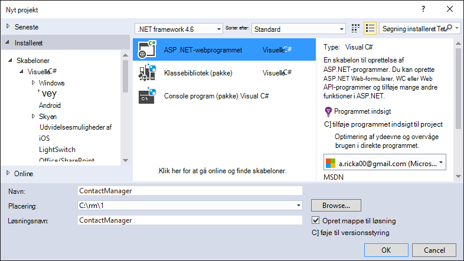

<properties 
    pageTitle="Oprette en ASP.NET MVC app med auth og SQL DB og installere til Azure App-tjenesten" 
    description="Lær at udvikle en ASP.NET MVC 5-app med en SQL-Database back end-, tilføje godkendelse og autorisation og installerer det til Azure." 
    services="app-service\web" 
    documentationCenter=".net" 
    authors="Rick-Anderson" 
    writer="Rick-Anderson" 
    manager="wpickett" 
    editor=""/>

<tags 
    ms.service="app-service-web" 
    ms.workload="web" 
    ms.tgt_pltfrm="na" 
    ms.devlang="dotnet" 
    ms.topic="article" 
    ms.date="03/21/2016" 
    ms.author="riande"/> 

# Oprette en ASP.NET MVC app med auth og SQL DB og installere til Azure App-tjenesten

Dette selvstudium viser, hvordan du opretter en sikker ASP.NET MVC 5 WebApp, hvor brugerne skal logge på med legitimationsoplysningerne fra Facebook eller Google. Appen er en simpel liste over kontakter, der bruger ADO.NET enhed Framework for adgang til databaser. Du skal installere appen til [Azure App-tjenesten](http://go.microsoft.com/fwlink/?LinkId=529714). 

På færdig selvstudiet, har du et sikkert databaserede webprogram op og kører i skyen og brug af en sky-database. Følgende illustration viser logonsiden til det færdige program.

![logonside][rxb]

Du kan lære følgende:

* Sådan oprettes en sikker ASP.NET MVC 5 webprojekt i Visual Studio.
* Sådan godkende og tillade brugere, der logger med legitimationsoplysningerne fra deres Google eller Facebook-konto (sociale udbyder godkendelse ved hjælp af [OAuth 2.0](http://oauth.net/2 "http://oauth.net/2")).
* Sådan godkende og tillade brugere, der registrerer i en database, der administreres af programmet (lokal godkendelse ved hjælp af [ASP.NET identitet](http://asp.net/identity/)).
* Sådan bruges ADO.NET enhed Framework 6 kode første til at læse og skrive data på en SQL-database.
* Sådan bruges enhed Framework kode første overførsler til at installere en database.
* Sådan gemmes relationelle data i skyen ved hjælp af Azure SQL-Database.
* Sådan installeres et webprojekt, der bruger en database til en [WebApp](http://go.microsoft.com/fwlink/?LinkId=529714) i Azure App-tjeneste.

>[AZURE.NOTE] Dette er en lang selvstudium. Hvis du vil en hurtig introduktion til Azure App Service og Visual Studio webprojekter, skal du se [oprette en ASP.NET WebApp i Azure App Service](web-sites-dotnet-get-started.md). Fejlfinding af oplysninger i afsnittet [fejlfinding](#troubleshooting) .
>
>Eller hvis du ønsker at komme i gang med Azure App Service før tilmelding til en Azure-konto, gå til [Prøve App Service](http://go.microsoft.com/fwlink/?LinkId=523751), hvor du straks kan oprette en forbigående starter WebApp i App-tjeneste. Ingen kreditkort, der kræves. ingen forpligtelser.

## Forudsætninger

For at fuldføre dette selvstudium skal bruge du en Microsoft Azure-konto. Hvis du ikke har en konto, kan du [aktivere dit Visual Studio abonnement fordele](/pricing/member-offers/msdn-benefits-details/?WT.mc_id=A261C142F) eller [Tilmeld dig en gratis prøveversion](/pricing/free-trial/?WT.mc_id=A261C142F).

Hvis du vil konfigurere dit udviklingsmiljø, skal du installere [Visual Studio 2013 Update 5](http://go.microsoft.com/fwlink/?LinkId=390521) eller nyere, og den seneste version af [Azure SDK til .NET](http://go.microsoft.com/fwlink/?linkid=324322&clcid=0x409). I denne artikel er skrevet til Visual Studio opdatering 4 og SDK 2.8.1. Samme vejledningen til Visual Studio-2015 med den seneste [Azure SDK til .NET](http://go.microsoft.com/fwlink/?linkid=518003&clcid=0x409) installeret, men nogle skærmbilleder ser anderledes end i illustrationer.

## Oprette en ASP.NET MVC 5-program

### Oprette projektet

1. Klik på **Nyt projekt**fra menuen **filer** .

    

1. I dialogboksen **Nyt projekt** udvide **C#** og vælg **Web** under **Installeret skabeloner**og derefter vælge **ASP.NET-webprogrammet**. Navngiv programmet **ContactManager**, og klik derefter på **OK**.

    
 
    **Note:** Kontrollér, at du angiver "ContactManager". Kode dokumentkomponenter, du skal kopierer senere forudsætter, at projektnavnet er ContactManager. 

1. Vælg **MVC** skabelonen i dialogboksen **Nyt ASP.NET-projekt** . Bekræft **godkendelse** er indstillet til **Individuelle brugerkonti**, **Host i skyen** er markeret, og **App Service** er markeret.

    

1. Klik på **OK**.

1. Dialogboksen **Konfigurer Microsoft Azure Web App indstillinger** vises. Du skal muligvis logge på, hvis du ikke allerede har gjort det, eller angive dine legitimationsoplysninger igen, hvis dit logon er udløbet.

1. Valgfrit – Skift værdien i **Web App-navn** feltet (se billedet nedenfor).

    URL-adressen til WebApp bliver {name} .azurewebsites .net, så navnet, der skal være entydigt i azurewebsites.net domænet. Konfigurationsguiden af foreslår et entydigt navn ved at tilføje et tal til projektnavnet "ContactManager", og det er fint til dette selvstudium.

5. I **ressourcegruppe** rullelisten Vælg en eksisterende gruppe eller **Opret ny ressourcegruppe**(se billedet nedenfor). 

    Hvis du foretrækker, kan du vælge en ressourcegruppe, som du allerede har. Men hvis du opretter en ny ressourcegruppe og kun bruge den til dette selvstudium, det nemt at slette alle Azure ressourcer, du har oprettet i dette selvstudium, når du er færdig med dem. Du kan finde oplysninger om ressourcegrupper [Azure ressourcestyring oversigt](../azure-resource-manager/resource-group-overview.md). 

5. I **App-serviceaftale** vælge rullelisten Vælg en eksisterende plan eller **oprette nye App Service planlægge**(se billedet nedenfor).

    Hvis du foretrækker, kan du vælge en App Service-plan, du allerede har. Du kan finde oplysninger om App Service planer [Azure App Service planer dybden oversigt](../app-service/azure-web-sites-web-hosting-plans-in-depth-overview.md). 

1. Tryk på **Gå på opdagelse ekstra Azure tjenester** for at tilføje en SQL-database.

    

1. Tryk på den **+** ikon for at tilføje en SQL-database.

    

1. Tryk på **Ny** i dialogboksen **Konfigurer SQL-Database** :

    

1. Angiv et navn til administratoren og en stærk adgangskode.

    

    Navnet på den server, skal være entydig. Det kan indeholde små bogstaver, numeriske cifre og bindestreger. Det kan ikke indeholde en efterstillede bindestreg. Brugernavn og adgangskode er nye legitimationsoplysninger, du opretter for den nye server. 

    Hvis du allerede har en databaseserver, kan du vælge, i stedet for at oprette en. Databaseservere er en værdifuld ressource, og du generelt kan oprette flere databaser på den samme server til test og udvikling i stedet for oprettelse af en databaseserver per database. Men i dette selvstudium skal du kun serveren midlertidigt, og ved at oprette serveren i samme ressourcegruppe som webstedet du gør det nemt at slette både web app og database ressourcer ved at slette ressourcegruppen, når du er færdig med selvstudiet. 

    Hvis du vælger en eksisterende databaseserver, skal du kontrollere dine online og database er i samme område.

    

4. Tryk på **Opret**.

    Visual Studio opretter ContactManager webprojekt, opretter ressourcegruppe og App-serviceaftale, du har angivet, og opretter en web-app i Azure App Service med det angivne navn.

### Angiv sidehoved og sidefod

1. Åbn filen *Layout.cshtml* i mappen *Views\Shared* i **Solution Explorer** .

    ![_Layout.cshtml i Solution Explorer][newapp004]

1. Erstat ActionLink i filen *Layout.cshtml* med følgende kode.

    @Html.ActionLink("CMDemo","Indeks","Kontakter", ny {område =" "}, ny { @class ="navigationslinje i-mærke"})
                   

    Sørg for, at du ændrer den tredje parameter "Hjemmefra" til "Kontakter". Den ovenstående markering opretter et link til "Kontakter" på hver side til metoden indeks kontakter fra domænecontrolleren. Ændre navnet på programmet i sidehovedet og sidefoden fra "Mine ASP.NET-program" og "Programnavn" til "Contact Manager" og "CM Demo". 
 
### Køre programmet lokalt

1. Tryk på CTRL + F5 for at køre appen.

    Startsiden program vises i standardbrowseren.

    

Dette er alt, skal du gøre nu til at oprette det program, du vil anvende til Azure. 

## Installere programmet til Azure

1. Højreklik på projektet i **Solution Explorer** i Visual Studio, og vælg **Publicer** i kontekstmenuen.

    
    
    Guiden **Udgiv websted** åbnes.

1. Klik på **Publicer**i dialogboksen **Udgiv websted** .

    

    Det program, du har oprettet kører nu i skyen. Næste gang du installerer programmet, installeres kun de ændrede (eller nye) filer.

    

## Aktivere SSL for projektet ##

1. Klik på **ContactManager** projektet i **Solution Explorer**, og derefter trykke på F4 for at åbne vinduet **Egenskaber** .

3. Ændre **SSL aktiveret** til **Sand**. 

4. Kopiere **SSL URL-adresse**.

    SSL URL-adressen bliver https://localhost:44300 / medmindre du tidligere har oprettet SSL webapps.

    ![aktivere SSL][rxSSL]
 
1. Højreklik på projektets **Contact Manager** i **Solution Explorer**, og klik på **Egenskaber**.

1. Klik på fanen **Web** .

1. Ændre **URL-adressen Project** for at bruge **SSL URL-adresse** og gemme siden (kontrolelement S).

    
 
1. Bekræft, at Internet Explorer er den browser, der starter Visual Studio, som vist i billedet nedenfor:

    

    Vælgeren browser kan du angive, hvilken browser Visual Studio starter. Du kan vælge flere webbrowsere og har Visual Studio opdatere hver browser, når du foretager ændringer. Du kan finde yderligere oplysninger [Ved hjælp af browseren Link i Visual Studio-2013](http://www.asp.net/visual-studio/overview/2013/using-browser-link).

    

1. Tryk på CTRL + F5 for at køre programmet. Klik på **Ja** for at starte processen med at have tillid til et selvsigneret certifikat, som IIS Express har genereret.

     

1. Læs dialogboksen **Sikkerhedsadvarsel** , og klik derefter på **Ja** , hvis du vil installere det certifikat, der repræsenterer **localhost**.

    

1. Internet Explorer viser siden *Hjem* , og der er ingen advarsler SSL.

     

     Internet Explorer er et godt valg, når du bruger SSL, fordi det accepterer certifikatet, og der vises HTTPS indholdet uden en advarsel. Microsoft Edge og Google Chrome også accepterer certifikatet. Firefox bruger sin egen lager, så den vises en advarsel.

     

## Føje en database til programmet

Derefter skal du opdatere appen for at tilføje muligheden for at få vist og opdatere kontakter og gemme dataene i en database. Appen anvender enhed Framework (ELEMENTÆRFILEN) til at oprette databasen og til at læse og opdatere data.

### Tilføje datamodel klasser til kontakterne

Du starter ved at oprette en simpel datamodel i kode.

1. Højreklik på mappen modeller i **Solution Explorer**, skal du klikke på **Tilføj**, og klik derefter **klasse**.

    

2. Navngiv den nye klassefil *Contact.cs*i dialogboksen **Tilføj nyt element** , og klik derefter på **Tilføj**.

    ![Tilføje dialogboksen Nyt element][adddb002]

3. Erstat indholdet af filen Contact.cs med følgende kode.

        using System.ComponentModel.DataAnnotations;
        using System.Globalization;
        namespace ContactManager.Models
        {
            public class Contact
            {
                public int ContactId { get; set; }
                public string Name { get; set; }
                public string Address { get; set; }
                public string City { get; set; }
                public string State { get; set; }
                public string Zip { get; set; }
                [DataType(DataType.EmailAddress)]
                public string Email { get; set; }
            }
        }
Klassen **kontakte** definerer de data, du vil gemme til hver af kontakter, samt en primær nøgle, *kontaktperson-id*, der skal bruges af databasen.

### Oprette websider, der aktiverer app-brugere til at arbejde med kontakter

Funktionen ASP.NET MVC stilladser kan automatisk oprette kode, som udfører oprette, læse, opdatere og slette (CRUD) handlinger. 

1. Opbygge projektet **(Ctrl + Shift + B)**. (Du skal oprette projektet inden du bruger stilladser ordningen.)
 
1. Højreklik på mappen enheder i **Solution Explorer**, og klik på **Tilføj**, og klik derefter på **Controller**.

    ![Tilføje Controller i genvejsmenuen for enheder mappe][addcode001]

5. Vælg **MVC 5 Controller med visninger, ved hjælp af ELEMENTÆRFILEN** , og klik derefter på **Tilføj**i dialogboksen **Tilføj Scaffold** .
    
    

1. Vælg **Kontakt (ContactManager.Models)**i rullemenuen **Model klasse** . (Se billedet nedenfor).

1. Vælg **ApplicationDbContext (ContactManager.Models)** **Data kontekst klasse**. **ApplicationDbContext** bruges til både medlemskab DB og vores kontaktdata.

    

1. Klik på **Tilføj**.

   Visual Studio opretter en controller med metoder og visninger for CRUD databasehandlinger for **Kontakt** objekter.

## Aktivere overførsler, oprette databasen, tilføje eksempeldata og en ved initialisering af data ##

Den næste opgave er at aktivere funktionen [Kode første overførsler](http://msdn.microsoft.com/library/hh770484.aspx) for at oprette databasetabeller baseret på den datamodel, du har oprettet.

1. Vælg **NuGet Package Manager** og derefter **Pakke Manager-konsollen**i menuen **Funktioner** .

    

2. Skriv følgende kommando i vinduet **Pakke Manager-konsollen** :

        enable-migrations

    Kommandoen **Aktivér overførsler** opretter en *overførsler* mappe, og den automatisk i den pågældende mappe en *Configuration.cs* -fil, som du kan redigere for at Send databasen og konfigurere overførsler. 

2. Skriv følgende kommando i vinduet **Pakke Manager-konsollen** :

        add-migration Initial

    Kommandoen **Tilføj overførsel indledende** genererer en fil med navnet ** &lt;date_stamp&gt;indledende** i mappen *overførsler* . Koden i denne fil opretter tabellerne i databasen. Den første parameter ( **indledende** ) bruges til at oprette navnet på filen. Du kan se de nye klasse-filer i **Solution Explorer**.

    Metoden **op** opretter tabellen kontaktpersoner på **første** årgang, og metoden **ned** (bruges, når du vil vende tilbage til den forrige tilstand) slipper den.

3. Åbn filen *Migrations\Configuration.cs* . 

4. Tilføj følgende `using` sætning. 

         using ContactManager.Models;

5. Erstat metoden *frø* med følgende kode:

        protected override void Seed(ContactManager.Models.ApplicationDbContext context)
        {
            context.Contacts.AddOrUpdate(p => p.Name,
               new Contact
               {
                   Name = "Debra Garcia",
                   Address = "1234 Main St",
                   City = "Redmond",
                   State = "WA",
                   Zip = "10999",
                   Email = "debra@example.com",
               },
                new Contact
                {
                    Name = "Thorsten Weinrich",
                    Address = "5678 1st Ave W",
                    City = "Redmond",
                    State = "WA",
                    Zip = "10999",
                    Email = "thorsten@example.com",
                },
                new Contact
                {
                    Name = "Yuhong Li",
                    Address = "9012 State st",
                    City = "Redmond",
                    State = "WA",
                    Zip = "10999",
                    Email = "yuhong@example.com",
                },
                new Contact
                {
                    Name = "Jon Orton",
                    Address = "3456 Maple St",
                    City = "Redmond",
                    State = "WA",
                    Zip = "10999",
                    Email = "jon@example.com",
                },
                new Contact
                {
                    Name = "Diliana Alexieva-Bosseva",
                    Address = "7890 2nd Ave E",
                    City = "Redmond",
                    State = "WA",
                    Zip = "10999",
                    Email = "diliana@example.com",
                }
                );
        }

    Denne kode starter (frø) databasen med kontaktoplysninger. Se [forhåndsudfyldning og fejlfinding enhed Framework (ELEMENTÆRFILEN) DBs](http://blogs.msdn.com/b/rickandy/archive/2013/02/12/seeding-and-debugging-entity-framework-ef-dbs.aspx)kan finde flere oplysninger om forhåndsudfyldning databasen. Opbyg projektet for at bekræfte, at der ikke er nogen kompileringsfejl.

6. Angiv kommandoen i **Pakke Manager-konsollen** :

        update-database

    ![Pakke Manager-konsollen kommandoer][addcode009]

    **Opdater database** kører den første migrering, som opretter databasen. Som standard oprettes databasen som en SQL Server Express LocalDB database. 

7. Tryk på CTRL + F5 for at køre programmet, og klik derefter på linket **CM Demo** ; eller gå til https://localhost:(port#)/Cm. 

    Programmet viser oprindelsesdata og Rediger, detaljer og Slet hyperlinks. Du kan oprette, redigere, slette og få vist data.

    ![MVC visning af data][rx2]

## Tilføje en OAuth2-udbyder

>[AZURE.NOTE] Detaljerede oplysninger om hvordan du bruger de Google og Facebook udvikler portalwebsteder, dette selvstudium links til selvstudier på ASP.NET-webstedet. Dog ændre Google og Facebook deres websteder hyppigere end disse selvstudier er opdateret, og de er nu forældet. Hvis du har problemer med at følge vejledningen, skal du se udvalgt Disqus kommentaren i slutningen af dette selvstudium for en liste over hvad der er ændret. 

[OAuth] (http://oauth.net/ "http://OAuth.NET/") er en åben protokol, der giver mulighed for sikker godkendelse i en simpel og standardversionen metode fra internettet, bærbare og stationære programmer. Skabelonen ASP.NET MVC internet bruger OAuth til at få vist Facebook, Twitter, Google og Microsoft som godkendelsesprovidere. Selvom dette selvstudium bruger kun Google som godkendelse udbyder, kan du nemt ændre koden for at bruge en af disse udbydere. Trin til at implementere andre udbydere ligner meget de trin, du ser i dette selvstudium. Hvis du vil bruge Facebook som en udbyder af godkendelse, skal du se [MVC 5 App med Facebook, Twitter, LinkedIn og Google OAuth2 Sign-on ](http://www.asp.net/mvc/tutorials/mvc-5/create-an-aspnet-mvc-5-app-with-facebook-and-google-oauth2-and-openid-sign-on).

Dette selvstudium bruger ud over godkendelse, roller til at implementere godkendelse. Kun disse brugere, du føjer til rollen *canEdit* er i stand til at ændre data (det vil sige, oprette, redigere eller slette kontakter).

1. Følg vejledningen i [MVC 5 App med Facebook, Twitter, LinkedIn og Google OAuth2 Sign-on](http://www.asp.net/mvc/tutorials/mvc-5/create-an-aspnet-mvc-5-app-with-facebook-and-google-oauth2-and-openid-sign-on#goog) under **oprette en Google-app til OAuth 2 for at konfigurere en Google-app til OAuth2**.

3. Kør og teste app for at bekræfte, at du kan logge på ved hjælp af Google godkendelse.

2. Hvis du vil oprette sociale login knapperne med providerspecifikke ikoner, skal du se [Ret sociale login knapper til ASP.NET MVC 5](http://www.jerriepelser.com/blog/pretty-social-login-buttons-for-asp-net-mvc-5)

## Ved hjælp af medlemskab API

I dette afsnit kan du tilføje en lokal bruger og rollen *canEdit* til medlemskab af databasen. Kun disse brugere i rollen *canEdit* vil kunne redigere data. Den bedste fremgangsmåde er navn roller ved de handlinger, de kan udføre, så *canEdit* er foretrukne over en rolle kaldet *administrator*. Når dit program udvikler sig, kan du tilføje nye roller som *canDeleteMembers* i stedet for mindre beskrivende *superAdmin*.

1. Åbn filen *migrations\configuration.cs* og tilføje følgende `using` sætninger:

        using Microsoft.AspNet.Identity;
        using Microsoft.AspNet.Identity.EntityFramework;

1. Føje følgende **AddUserAndRole** metode til klassen:

        bool AddUserAndRole(ContactManager.Models.ApplicationDbContext context)
        {
            IdentityResult ir;
            var rm = new RoleManager<IdentityRole>
                (new RoleStore<IdentityRole>(context));
            ir = rm.Create(new IdentityRole("canEdit"));
            var um = new UserManager<ApplicationUser>(
                new UserStore<ApplicationUser>(context));
            var user = new ApplicationUser()
            {
                UserName = "user1@contoso.com",
            };
            ir = um.Create(user, "P_assw0rd1");
            if (ir.Succeeded == false)
                return ir.Succeeded;
            ir = um.AddToRole(user.Id, "canEdit");
            return ir.Succeeded;
        }

1. Ringe til den nye metode fra metoden **frø** :

        protected override void Seed(ContactManager.Models.ApplicationDbContext context)
        {
            AddUserAndRole(context);
            context.Contacts.AddOrUpdate(p => p.Name,
                // Code removed for brevity
        }

    Følgende billeder viser ændringerne i *frø* metode:

    

    Denne kode opretter en ny rolle kaldet *canEdit*, opretter en ny lokal bruger *user1@contoso.com*, og tilføjer *user1@contoso.com* til rollen *canEdit* . Yderligere oplysninger finder du se [ASP.NET identitet selvstudier](http://www.asp.net/identity/overview/features-api) på ASP.NET-websted.

## Brug midlertidige koden for at tilføje nye sociale logon-brugere til at canEdit rolle  ##

I dette afsnit kan du midlertidigt ændre metoden **ExternalLoginConfirmation** i konto controlleren at tilføje nye brugere registrering med en OAuth-provider til rollen *canEdit* . Vi håber på at give et værktøj, der ligner [WSAT](http://msdn.microsoft.com/library/ms228053.aspx) fremover som gør det muligt at oprette og redigere brugerkonti og roller. Du kan udføre den samme funktion ved hjælp af midlertidige kode indtil derefter og.

1. Åbn filen **Controllers\AccountController.cs** , og gå til metoden **ExternalLoginConfirmation** .

1. Tilføj følgende opkaldet til **AddToRoleAsync** lige før **SignInAsync** opkaldet.

        await UserManager.AddToRoleAsync(user.Id, "canEdit");

   Ovenstående kode føjer den nyligt registrerede bruger til rollen "canEdit", som giver dem adgang til handling metoder, ændrer (edit) data. Følgende kodestykke viser den nye linje af kode i kontekst.

          // POST: /Account/ExternalLoginConfirmation
          [HttpPost]
          [AllowAnonymous]
          [ValidateAntiForgeryToken]
          public async Task ExternalLoginConfirmation(ExternalLoginConfirmationViewModel model, string returnUrl)
          {
             if (User.Identity.IsAuthenticated)
             {
                return RedirectToAction("Index", "Manage");
             }
             if (ModelState.IsValid)
             {
                // Get the information about the user from the external login provider
                var info = await AuthenticationManager.GetExternalLoginInfoAsync();
                if (info == null)
                {
                   return View("ExternalLoginFailure");
                }
                var user = new ApplicationUser { UserName = model.Email, Email = model.Email };
                var result = await UserManager.CreateAsync(user);
                if (result.Succeeded)
                {
                   result = await UserManager.AddLoginAsync(user.Id, info.Login);
                   if (result.Succeeded)
                   {
                      await UserManager.AddToRoleAsync(user.Id, "canEdit");
                      await SignInManager.SignInAsync(user, isPersistent: false, rememberBrowser: false);
                      return RedirectToLocal(returnUrl);
                   }
                }
                AddErrors(result);
             }
             ViewBag.ReturnUrl = returnUrl;
             return View(model);
          }

Du vil installere programmet til Azure, hvor du vil logge på med Google eller en anden udbyder af godkendelse fra tredjepart senere i selvstudiet. Dette føjer kontoen nyligt registrerede til rollen *canEdit* . Alle, der finder din online URL-adresse og har et Google-ID kan derefter registrere og opdatere din database. Hvis du vil forhindre andre i at gøre det, kan du stoppe webstedet. Du vil kunne bekræfte, hvem der deltager i rollen *canEdit* ved at undersøge databasen.

I **Pakke Manager-konsollen** har trykket på opadgående pil for at få vist følgende kommando:

        Update-Database

Kommandoen **Opdater Database** kører metoden **frø** , og den **AddUserAndRole** metode, du tilføjede tidligere til at køre. Metoden **AddUserAndRole** opretter brugeren *user1@contoso.com* og føjer hende til rollen *canEdit* .

## Beskytte programmet med SSL og godkende-attribut ##

I dette afsnit kan du anvende attributten [godkende](http://msdn.microsoft.com/library/system.web.mvc.authorizeattribute.aspx) for at begrænse adgangen til metoderne handling. Anonyme brugere vil kunne få vist kun **indeks** handling metoden privat domænecontrolleren. Registrerede brugere vil kunne se kontaktdata ( **indeks** og **Detaljer** sider Cm fra domænecontrolleren), siden om og siden. Kun brugere i rollen *canEdit* vil kunne access handling metoder, der ændrer data.

1. Åbn filen *App_Start\FilterConfig.cs* og erstatte metoden *RegisterGlobalFilters* med følgende (der tilføjes de to filtre):

        public static void RegisterGlobalFilters(GlobalFilterCollection filters)
        {
            filters.Add(new HandleErrorAttribute());
            filters.Add(new System.Web.Mvc.AuthorizeAttribute());
            filters.Add(new RequireHttpsAttribute());
        }
        
    Denne kode føjer [godkende](http://msdn.microsoft.com/library/system.web.mvc.authorizeattribute.aspx) filteret og filteret [krævhttps](http://msdn.microsoft.com/library/system.web.mvc.requirehttpsattribute.aspx) til programmet. [Godkende](http://msdn.microsoft.com/library/system.web.mvc.authorizeattribute.aspx) filteret forhindrer anonyme brugere får adgang til en hvilken som helst metoder i programmet på computeren. Du vil bruge attributten [AllowAnonymous](http://blogs.msdn.com/b/rickandy/archive/2012/03/23/securing-your-asp-net-mvc-4-app-and-the-new-allowanonymous-attribute.aspx) til fravælge kravet om godkendelse i nogle metoder, så anonyme brugere kan logge på og få vist siden hjem. [Hvis krævhttps](http://msdn.microsoft.com/library/system.web.mvc.requirehttpsattribute.aspx) kræver, at alle adgang til online via HTTPS.

    En alternativ metode er at føje attributten [godkende](http://msdn.microsoft.com/library/system.web.mvc.authorizeattribute.aspx) og attributten [krævhttps](http://msdn.microsoft.com/library/system.web.mvc.requirehttpsattribute.aspx) til hver controller, men det kan betragtes som sikkerhedsmæssige årsager til at anvende dem til hele programmet. Hver ny controller og en handling metode, som du har tilføjet automatisk er beskyttet ved at tilføje dem globalt – du behøver ikke at huske, at de anvendes. Finde flere oplysninger under [sikring af din ASP.NET MVC App og den nye AllowAnonymous attribut](http://blogs.msdn.com/b/rickandy/archive/2012/03/23/securing-your-asp-net-mvc-4-app-and-the-new-allowanonymous-attribute.aspx). 

1. Føje attributten [AllowAnonymous](http://blogs.msdn.com/b/rickandy/archive/2012/03/23/securing-your-asp-net-mvc-4-app-and-the-new-allowanonymous-attribute.aspx) til metoden **indeks** hjem fra domænecontrolleren. Attributten [AllowAnonymous](http://blogs.msdn.com/b/rickandy/archive/2012/03/23/securing-your-asp-net-mvc-4-app-and-the-new-allowanonymous-attribute.aspx) gør det muligt at hvid liste de metoder, du vil fravælge godkendelse. 

        public class HomeController : Controller
        {
          [AllowAnonymous]
          public ActionResult Index()
          {
             return View();
          }

    Hvis du gør en global søgning efter *AllowAnonymous*, ser du, at den bruges i metoderne login og registrering konto fra domænecontrolleren.

1. Tilføj i *CmController.cs* `[Authorize(Roles = "canEdit")]` til metoderne HttpGet og HttpPost, der ændrer data (Opret, Rediger, Slet, hver handling metode undtagen indeks og detaljer) i *Cm* controlleren. En del af den færdige kode er vist nedenfor: 

        // GET: Cm/Create
        [Authorize(Roles = "canEdit")]
        public ActionResult Create()
        {
           return View(new Contact { Address = "123 N 456 W",
            City="Great Falls", Email = "ab@cd.com", Name="Joe Smith", State="MT",
           Zip = "59405"});
        }
        // POST: Cm/Create
        // To protect from overposting attacks, please enable the specific properties you want to bind to, for 
        // more details see http://go.microsoft.com/fwlink/?LinkId=317598.
        [HttpPost]
        [ValidateAntiForgeryToken]
         [Authorize(Roles = "canEdit")]
        public ActionResult Create([Bind(Include = "ContactId,Name,Address,City,State,Zip,Email")] Contact contact)
        {
            if (ModelState.IsValid)
            {
                db.Contacts.Add(contact);
                db.SaveChanges();
                return RedirectToAction("Index");
            }
            return View(contact);
        }
        // GET: Cm/Edit/5
        [Authorize(Roles = "canEdit")]
        public ActionResult Edit(int? id)
        {
            if (id == null)
            {
                return new HttpStatusCodeResult(HttpStatusCode.BadRequest);
            }
            Contact contact = db.Contacts.Find(id);
            if (contact == null)
            {
                return HttpNotFound();
            }
            return View(contact);
        }
        
1. Tryk på CTRL + F5 for at køre programmet.

1. Hvis du stadig er logget på fra en tidligere session, der påløber linket **Log af** .

1. Klik på **om** eller **Kontakt** links. Du bliver omdirigeret til siden login, da anonyme brugere ikke kan få vist disse sider.

1. Klik på linket **registrere som en ny bruger** og tilføje en lokal bruger med mail *joe@contoso.com*. Kontrollér *Joe* kan se startside, om og kontakte sider. 

    

1. Klik på linket *CM Demo* og bekræfte, at du ser dataene.

1. Klik på et link til redigering på siden, du bliver brugeren omdirigeret til siden login (fordi en ny lokal bruger ikke er føjet til rollen *canEdit* ).

1. Log på som *user1@contoso.com* med adgangskoden til "P_assw0rd1" (den "0" i "word" er et nul). Du bliver omdirigeret til siden Rediger du tidligere har valgt. 
2. 

    Hvis du ikke logge på med den konto og adgangskode, prøve at kopiere adgangskoden fra kildekoden og indsætte det. Hvis du stadig ikke kan logge på skal du kontrollere kolonnen **brugernavn** i **AspNetUsers** tabellen for at bekræfte *user1@contoso.com* blev tilføjet. 

1. Kontrollér, at du kan foretage dataændringer.

## Installere appen på Azure

1. Højreklik på projektet i **Solution Explorer** i Visual Studio, og vælg **Publicer** i kontekstmenuen.

    ![Publicere i project genvejsmenu][firsdeploy003]

    Guiden **Udgiv websted** åbnes.

1. Klik på fanen **Indstillinger** i venstre side af dialogboksen **Udgiv websted** . 

2. Vælg den database, du har oprettet, da du oprettede projektet under **ApplicationDbContext** .
   

1. Vælg **Udføre kode første overførsler**under **ContactManagerContext**.

    

1. Klik på **Udgiv**.

1. Log på som *user1@contoso.com* (med adgangskoden til "P_assw0rd1"), og Kontrollér, at du kan redigere data.

1. Log af.

1. Gå til [Google udviklere Console](https://console.developers.google.com/) og **legitimationsoplysninger** under fanen Opdater Omdiriger URI'ER og JavaScript Orgins bruge Azure URL-adressen.

1. Log på ved hjælp af Google eller Facebook. Føjer Google eller Facebook-konto til rollen **canEdit** . Hvis du får en HTTP 400 fejl med meddelelsen *Omdiriger URI i anmodningen: https://contactmanager {min version}.azurewebsites.net/signin-google stemmer ikke overens registrerede Omdiriger URI.*, du er nødt til at vente, indtil du har foretaget ændringerne er blevet overført. Hvis du får denne fejl, når du har mere end et par minutter, kan du kontrollere URI'er er korrekte.

### Stoppe online for at forhindre andre i registrering  

1. I **Server Explorer**skal du gå til **Azure > App Service > {ressourcegruppe} > {din online}**.

4. Højreklik på WebApp og vælge **Stop**. 

    Alternativt kan du fra [Azure-portalen](https://portal.azure.com/), gå til den online blade og klik derefter på ikonet **Stop** øverst i bladet.

    

### Fjerne AddToRoleAsync, udgive og teste

1. Skrive en kommentar ud eller fjerne følgende kode fra metoden **ExternalLoginConfirmation** i konto controlleren:

        await UserManager.AddToRoleAsync(user.Id, "canEdit");

1. Opbygge projektet (som gemmer filen ændringer og bekræfter du ikke har kompileringsfejl).

5. Højreklik på projektet i **Solution Explorer** , og vælg **Publicer**.

       
    
4. Klik på knappen **Start Preview** . Kun de filer, der skal opdateres er installeret.

5. Start af WebApp, fra Visual Studio eller fra portalen. **Du kan ikke udgive, mens WebApp er stoppet**.

    

5. Gå tilbage til Visual Studio, og klik på **Publicer**.

3. Din Azure-App åbnes i din standardbrowser. Hvis du er logget på, logge, så du kan få vist siden hjem som anonym bruger.  

4. Klik på linket **om** . Du bliver omdirigeret til siden logon.

5. Klik på linket **registrere** på siden Log på siden, og Opret lokale konti. Vi bruger denne lokale konto til at bekræfte, at du kan få adgang til de Læs kun sider, men du kan ikke få adgang til sider, der ændrer data (som er beskyttet af rollen *canEdit* ). Senere i selvstudiet fjerner du adgang til lokale konto. 

    

1. Kontrollér, at du kan navigere til siderne *om* og *Kontakt* .

    

1. Klik på linket **CM Demo** for at gå til **Cm** controlleren. Alternativt kan du føje *Cm* til URL-adressen. 

    
 
1. Klik på et link til redigering. 

    Du bliver omdirigeret til siden login. 

2. Under **Brug af en anden tjeneste til at logge på**, skal du klikke på Google eller Facebook og log på med den konto, du tidligere har registreret. (Hvis du arbejder hurtigt og din sessionscookie ikke fik timeout, skal du bliver automatisk logget på med den Google eller Facebook-konto, du tidligere har brugt.)

2. Kontrollér, at du kan redigere data, mens du er logget på denne konto.

    **Note:** Du kan ikke logge af Google fra denne app og logfiler til en anden google-konto med den samme browser. Hvis du bruger en browser, er du nødt til at gå til Google og logge af. Du kan logge på med en anden konto fra samme fra tredjepart godkenderen (såsom Google) ved hjælp af en anden browser.

    Hvis du ikke har udfyldt første og sidste navnet på din Google-kontooplysninger, opstår der en undtagelsesfejl.

## Undersøge SQL Azure DB ##

1. I **Server Explorer**skal du gå til **Azure > SQL-databaser > {databasen}**

2. Højreklik på databasen, og derefter vælge **Åbn i SQL Server Object Explorer**.
 
    
 
3. Hvis du ikke har forbindelse til denne database tidligere, bliver du muligvis bedt om at tilføje en firewallregel for at få adgang til din aktuelle IP-adresse. IP-adressen er allerede udfyldt. Blot klikke på **Tilføj firewallregel** for at aktivere adgang.

    

3. Log på databasen med det brugernavn og adgangskode, du angav, da du oprettede databaseserveren. 
 
1. Højreklik på tabellen **AspNetUsers** , og vælg **Visningsdata**.

    
 
1. Bemærk, at felterne Id fra den Google-konto, du har registreret med at være tildelt rollen **canEdit** og Id *user1@contoso.com*. Disse skal være kun brugere i rollen **canEdit** . (Du skal kontrollere, i næste trin.)

    
 
2. Højreklik på **AspNetUserRoles** i **SQL Server Object Explorer**, og vælg **Visningsdata**.

    
 
3. Bekræft, at **bruger-id** er fra *user1@contoso.com* og den Google-konto, du har registreret. 

## Fejlfinding i forbindelse med

Hvis du støder på problemer, er her nogle forslag til det kan du prøve.

* Fejl klargøring SQL Database - Sørg for, at du har den aktuelle SDK installeret. Versioner før 2.8.1 har en fejl, der forårsager fejl, når VS forsøger at oprette databaseserveren eller databasen i visse scenarier.
* Fejlmeddelelsen "handling understøttes ikke for din abonnementstype tilbud" Når oprettelsen af Azure ressourcer - samme som ovenfor.
* Fejl, når du installerer - overveje ved at følge i artiklen [grundlæggende ASP.NET-installation](web-sites-dotnet-get-started.md) . Installation scenarie er nemmere og hvis du har det samme problem der det kan være nemmere at isolere. For eksempel i nogle enterprise-miljøer kan virksomhedens firewall forhindre Web installere foretager typer af forbindelser til Azure, der kræver.
* Ikke muligt at vælge forbindelsesstreng i guiden Udgiv websted, når du installerer - Hvis du har brugt en anden metode til at oprette dine Azure ressourcer (for eksempel du forsøger at installere en web App og en SQL-database, der er oprettet i portalen,) SQL-databasen er muligvis ikke knyttet til WebApp. Den nemmeste løsning er at oprette en ny WebApp og database ved hjælp af VS, som vist i selvstudiet. Du behøver ikke at starte selvstudiet--i guiden Udgiv websted kan du vælge for at oprette en WebApp, og du får den samme oprettelse af dialogboksen til Azure ressource, som du får, når du opretter projektet.
* Kørselsvejledning til Google- eller Facebook udvikler portal er forældet – se udvalgt Disqus kommentaren i slutningen af dette selvstudium.

## Næste trin

Du har oprettet et grundlæggende ASP.NET MVC webprogram, der godkender brugere. Du kan finde flere oplysninger om almindelige godkendelsesopgaver og hvordan du beskytter følsomme data følgende selvstudier.

- [Oprette en sikker ASP.NET MVC 5 WebApp med logfiler i e-mail-bekræftelse og din adgangskode nulstille](http://www.asp.net/mvc/overview/getting-started/create-an-aspnet-mvc-5-web-app-with-email-confirmation-and-password-reset)
- [ASP.NET MVC 5 app med SMS og e-mail-to-faktor-godkendelse](http://www.asp.net/mvc/overview/getting-started/aspnet-mvc-5-app-with-sms-and-email-two-factor-authentication)
- [Bedste fremgangsmåder til implementering af adgangskoder og andre følsomme data til ASP.NET og Azure](http://www.asp.net/identity/overview/features-api/best-practices-for-deploying-passwords-and-other-sensitive-data-to-aspnet-and-azure) 
- [Oprette en ASP.NET MVC 5-App med Facebook og Google OAuth2](http://www.asp.net/mvc/tutorials/mvc-5/create-an-aspnet-mvc-5-app-with-facebook-and-google-oauth2-and-openid-sign-on ) Dette omfatter oplysninger om, hvordan du tilføjer profildata til bruger registreringen DB og detaljerede oplysninger om brug af Facebook som en udbyder af godkendelse.
- [Introduktion til ASP.NET MVC 5](http://www.asp.net/mvc/tutorials/mvc-5/introduction/getting-started)

For at få en mere avanceret selvstudium om, hvordan du bruger den enhed, som skal du se [Introduktion til ELEMENTÆRFILEN og MVC](http://www.asp.net/mvc/tutorials/getting-started-with-ef-using-mvc/creating-an-entity-framework-data-model-for-an-asp-net-mvc-application).

Dette selvstudium blev skrevet af [Rick Westermann](http://blogs.msdn.com/b/rickandy/) (Twitter- [@RickAndMSFT](https://twitter.com/RickAndMSFT)) med hjælp fra Tom Dykstra og Barry Dorrans (Twitter- [@blowdart](https://twitter.com/blowdart)). 

***Skal du give feedback*** på hvad du synes godt om eller du gerne vil se forbedret, ikke kun om selvstudiet selve, men også om de produkter, det viser. Din feedback hjælper os med at prioritere forbedringer. Du kan også anmode om og stemme om nye emner på [Vis mig hvordan med kode](http://aspnet.uservoice.com/forums/228522-show-me-how-with-code).

## Hvad er ændret

* Finde en vejledning til ændring fra websteder til App-tjenesten: [Azure App Service og dets indvirkning på eksisterende Azure Services](http://go.microsoft.com/fwlink/?LinkId=529714)

<!-- bookmarks -->
[Add an OAuth Provider]: #addOauth
[Using the Membership API]:#mbrDB
[Create a Data Deployment Script]:#ppd
[Update the Membership Database]:#ppd2

[setupwindowsazureenv]: #bkmk_setupwindowsazure
[createapplication]: #bkmk_createmvc4app
[deployapp1]: #bkmk_deploytowindowsazure1
[deployapp11]: #bkmk_deploytowindowsazure11
[adddb]: #bkmk_addadatabase

<!-- images-->
[rx2]: ./media/web-sites-dotnet-deploy-aspnet-mvc-app-membership-oauth-sql-database/rx2.png

[rx5]: ./media/web-sites-dotnet-deploy-aspnet-mvc-app-membership-oauth-sql-database-vs2013/rx5.png
[rx6]: ./media/web-sites-dotnet-deploy-aspnet-mvc-app-membership-oauth-sql-database-vs2013/rx6.png
[rx7]: ./media/web-sites-dotnet-deploy-aspnet-mvc-app-membership-oauth-sql-database-vs2013/rx7.png
[rx8]: ./media/web-sites-dotnet-deploy-aspnet-mvc-app-membership-oauth-sql-database-vs2013/rx8.png
[rx9]: ./media/web-sites-dotnet-deploy-aspnet-mvc-app-membership-oauth-sql-database-vs2013/rx9.png

[rxb]: ./media/web-sites-dotnet-deploy-aspnet-mvc-app-membership-oauth-sql-database/rxb.png

[rxSSL]: ./media/web-sites-dotnet-deploy-aspnet-mvc-app-membership-oauth-sql-database/rxSSL.png

[rxNOT]: ./media/web-sites-dotnet-deploy-aspnet-mvc-app-membership-oauth-sql-database-vs2013/rxNOT.png
[rxNOT2]: ./media/web-sites-dotnet-deploy-aspnet-mvc-app-membership-oauth-sql-database-vs2013/rxNOT2.png

[rxNOT]: ./media/web-sites-dotnet-deploy-aspnet-mvc-app-membership-oauth-sql-database-vs2013/rxNOT.png
[rxNOT]: ./media/web-sites-dotnet-deploy-aspnet-mvc-app-membership-oauth-sql-database-vs2013/rxNOT.png
[rxNOT]: ./media/web-sites-dotnet-deploy-aspnet-mvc-app-membership-oauth-sql-database-vs2013/rxNOT.png
[rr1]: ./media/web-sites-dotnet-deploy-aspnet-mvc-app-membership-oauth-sql-database-vs2013/rr1.png

[rxPrevDB]: ./media/web-sites-dotnet-deploy-aspnet-mvc-app-membership-oauth-sql-database-vs2013/rxPrevDB.png

[rxWSnew]: ./media/web-sites-dotnet-deploy-aspnet-mvc-app-membership-oauth-sql-database-vs2013/rxWSnew2.png
[rxCreateWSwithDB]: ./media/web-sites-dotnet-deploy-aspnet-mvc-app-membership-oauth-sql-database-vs2013/rxCreateWSwithDB.png

[setup007]: ./media/web-sites-dotnet-deploy-aspnet-mvc-app-membership-oauth-sql-database-vs2013/dntutmobile-setup-azure-site-004.png

[newapp004]: ./media/web-sites-dotnet-deploy-aspnet-mvc-app-membership-oauth-sql-database/dntutmobile-createapp-004.png

[firsdeploy003]: ./media/web-sites-dotnet-deploy-aspnet-mvc-app-membership-oauth-sql-database/dntutmobile-deploy1-publish-001.png

[adddb002]: ./media/web-sites-dotnet-deploy-aspnet-mvc-app-membership-oauth-sql-database/dntutmobile-adddatabase-002.png
[addcode001]: ./media/web-sites-dotnet-deploy-aspnet-mvc-app-membership-oauth-sql-database/dntutmobile-controller-add-context-menu.png

[addcode008]: ./media/web-sites-dotnet-deploy-aspnet-mvc-app-membership-oauth-sql-database-vs2013/dntutmobile-migrations-package-manager-menu.png
[addcode009]: ./media/web-sites-dotnet-deploy-aspnet-mvc-app-membership-oauth-sql-database/dntutmobile-migrations-package-manager-console.png

[Important information about ASP.NET in Azure web apps]: #aspnetwindowsazureinfo
[Next steps]: #nextsteps

[ImportPublishSettings]: ./media/web-sites-dotnet-deploy-aspnet-mvc-app-membership-oauth-sql-database-vs2013/ImportPublishSettings.png
 
