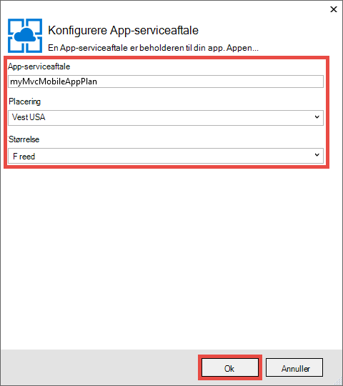
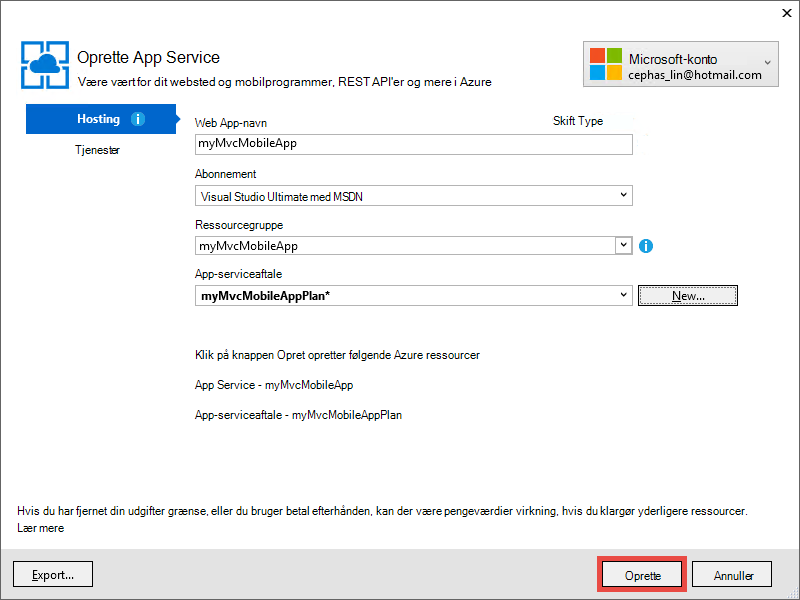

<properties 
    pageTitle="Installere en ASP.NET MVC 5 mobile WebApp i Azure App Service" 
    description="Et selvstudium, som lærer du at installere en WebApp til Azure App-tjenesten ved hjælp af mobile funktioner i ASP.NET MVC 5-webprogrammet." 
    services="app-service" 
    documentationCenter=".net" 
    authors="cephalin" 
    manager="wpickett" 
    editor="jimbe"/>

<tags 
    ms.service="app-service" 
    ms.workload="na" 
    ms.tgt_pltfrm="na" 
    ms.devlang="dotnet" 
    ms.topic="article" 
    ms.date="01/12/2016" 
    ms.author="cephalin;riande"/>

# Installere en ASP.NET MVC 5 mobile WebApp i Azure App Service

Dette selvstudium lærer du, om, hvordan at opbygge en ASP.NET MVC 5-WebApp, der er mobile-venlig og installerer det til Azure App Service. I dette selvstudium skal du [Visual Studio Express 2013 til Web] [ Visual Studio Express 2013] eller den professionelle udgave af Visual Studio, hvis du allerede har. Du kan bruge [Visual Studio 2015] , men skærmbilleder vil være forskellige, og du skal bruge ASP.NET 4.x skabeloner.

[AZURE.INCLUDE [create-account-and-websites-note](../../includes/create-account-and-websites-note.md)]

## Hvad du skal oprette

I dette selvstudium, du vil tilføje mobile funktioner til programmet enkel konference-posten, der er angivet i [starter project][StarterProject]. Følgende skærmbillede viser ASP.NET-sessioner i det færdige program, som det ses i browseren emulatoren i Internet Explorer 11 F12-udviklerværktøjer.

![][FixedSessionsByTag]

Du kan bruge [Fiddler værktøjet] og Internet Explorer 11 F12-udviklerværktøjer[ Fiddler] til at foretage fejlfinding af dit program. 

## Du skal lære færdigheder

Her er, hvad du lærer:

-   Sådan bruges Visual Studio 2013 til at udgive dit webprogram direkte til en WebApp i Azure App Service.
-   Hvordan ASP.NET MVC 5 skabeloner bruge CSS Bootstrap framework til at forbedre vises på mobile enheder
-   Sådan oprettes mobile-specifikke visninger for at målrette bestemte mobile browsere, som iPhone og Android
-   Sådan opretter du svarede visninger (visninger, der svarer til forskellige browsere på tværs af enheder)

## Konfigurere udviklingsmiljøet

Konfigurere din udviklingsmiljø ved at installere Azure SDK til .NET 2.5.1 eller nyere. 

1. Hvis du vil installere Azure SDK til .NET, skal du klikke på linket nedenfor. Hvis du ikke har Visual Studio 2013 installeret endnu, installeres ved linket. Dette selvstudium kræver Visual Studio-2013. [Azure SDK til Visual Studio 2013][AzureSDKVs2013]
1. Klik på **Installer** i vinduet Web Platform Installer og fortsætte med installationen.

Du skal også en browser til mobilenhed emulator. Et af følgende fungerer:

-   Browser Emulator i [Internet Explorer 11 F12-udviklerværktøjer] [ EmulatorIE11] (bruges i alle browser til mobilenhed skærmbilleder). Den har bruger agent streng forudindstillinger til Windows Phone 8, Windows Phone 7 og Apple iPad.
-   Browser Emulator i [Google Chrome DevTools][EmulatorChrome]. Den indeholder forudindstillinger for flere Android-enheder, samt Apple iPhone, iPad i Apple og Amazon Kindle Fire. Det også emulerer touch begivenheder.
-   [Opera Mobile Emulator][EmulatorOpera]

Visual Studio-projekter med C\# kildekode er tilgængelige til at afspilles i dette emne:

-   [Starter project download][StarterProject]
-   [Fuldført project download][CompletedProject]

##Installere projektet starter på en Azure-WebApp

1.  Hente konference-oversigt programmet [starter project][StarterProject].

2.  Derefter i Windows Stifinder, højreklik på den hentede ZIP-fil, og vælg *Egenskaber*.

3.  Vælg knappen **Fjern blokering** i dialogboksen **Egenskaber** . (Fjerne blokeringen af forhindrer en sikkerhedsadvarsel, der opstår, når du forsøger at bruge en *.zip* -fil, som du har hentet fra internettet).

4.  Højreklik på ZIP-filen, og vælg **Udpak alle** at udpakke filen. 

5.  Åbn filen *C#\Mvc5Mobile.sln* i Visual Studio.

6.  Højreklik på projektet i Solution Explorer, og klik på **Publicer**.

    ![][DeployClickPublish]

7.  Klik på **Microsoft Azure App Service**i Udgiv websted.

    ![][DeployClickWebSites]

8.  Hvis du ikke allerede er logget ind i Azure, skal du klikke på **Tilføj en konto**.

    ![][DeploySignIn]

9.  Følg vejledningen for at logge på din Azure-konto.

11. Dialogboksen App Service bør nu vise du som logget på. Klik på **Ny**.

    ![][DeployNewWebsite]  

12. Angiv et entydigt app navnepræfiks i feltet **Web App-navn** . Fuldt kvalificeret web app-navn bliver * &lt;præfiks >*. azurewebsites.net. Desuden vælge eller angive en ny ressource gruppenavn i **ressourcegruppe**. Klik derefter på **Ny** for at oprette en ny App Service-plan.

    ![][DeploySiteSettings]

13. Konfigurere den nye App Service-plan, og klik på **OK**. 

    

13. Klik på **Opret**tilbage i dialogboksen Opret App Service.

     

13. Efter Azure oprettes ressourcer, publicere internettet dialogboksen blive udfyldt med indstillingerne for din nye app. Klik på **Udgiv**.

    ![][DeployPublishSite]

    Når Visual Studio er færdig med at udgive projektet starter til Azure WebApp, åbnes computeren browseren for at få vist den direkte WebApp.

14. Start din browser til mobilenhed emulator, Kopiér URL-adressen til programmet konference (*<prefix>*. azurewebsites.net) til emulatoren, og klik derefter på knappen øverst til højre, og vælg **Gennemse efter mærke**. Hvis du bruger Internet Explorer 11 som standardbrowseren, skal du blot at skrive `F12`, derefter `Ctrl+8`, og skift derefter profilen browser til **Windows Phone**. Billedet nedenfor viser visningen *AllTags* i stående tilstand (fra vælge **Søg efter mærke**).

    ![][AllTags]

>[AZURE.TIP] Mens du kan foretage fejlfinding af dit MVC 5-program i Visual Studio, kan du publicere din online til Azure igen for at bekræfte den direkte Online direkte fra din browser til mobilenhed eller en browser-emulator.

Visningen er meget læsbar på en mobilenhed. Du kan også allerede kan se nogle af de visuelle effekter, der anvendes af Bootstrap CSS framework.
Klik på linket **ASP.NET** .

![][SessionsByTagASP.NET]

Visningen ASP.NET mærke er tilpasset zoom til skærm, hvor Bootstrap gør for dig automatisk. Du kan dog forbedre denne visning, så de passer bedre til mobilbrowseren. For eksempel er kolonnen **dato** svært at læse. Senere i selvstudiet skal du ændre visningen *AllTags* for at gøre det mobile-venlig.

##Bootstrap CSS Framework

Skabelonen er ny indbygget Bootstrap understøttelse i MVC 5. Du har allerede set hvordan det med det samme forbedrer forskellige visninger i dit program. Navigationslinjen øverst er for eksempel automatisk kan skjules, når browseren bredden er mindre. Prøve at ændre størrelsen på browservinduet på computeren browseren, og se, hvordan navigationslinjen ændrer dens udseende. Dette er den svarede webdesign, der er indbygget i Bootstrap.

Du kan se, hvordan WebApp vil se uden Bootstrap, åbne *App\_starte\\BundleConfig.cs* og kommentar de linjer, som indeholder *bootstrap.js* og *bootstrap.css*. Følgende kode viser de sidste to erklæringer af den `RegisterBundles` metode efter ændringen:

     bundles.Add(new ScriptBundle("~/bundles/bootstrap").Include(
              //"~/Scripts/bootstrap.js",
              "~/Scripts/respond.js"));

    bundles.Add(new StyleBundle("~/Content/css").Include(
              //"~/Content/bootstrap.css",
              "~/Content/site.css"));

Tryk på `Ctrl+F5` køre programmet.

Læg mærke til, kan skjules navigationslinjen nu er kun en almindelig ikke-sorteret liste. Klik på **Gennemse efter mærke** igen, og klik derefter på **ASP.NET**.
Du kan se nu, hvor det er ikke længere zoom tilpasset til skærmen, og du skal siden Rul ned for at kunne se i højre side af tabellen i visningen mobile emulator.

![][SessionsByTagASP.NETNoBootstrap]

Fortryde ændringen, og Opdater mobilbrowseren for at bekræfte, at visningen mobile-venlig er blevet genoprettet.

Bootstrap er ikke specifik for ASP.NET MVC 5, og du kan drage fordel af disse funktioner i en hvilken som helst webprogram. Men det er nu indbygget i skabelonen ASP.NET MVC 5 project, så dit MVC 5 webprogram kan drage fordel af Bootstrap som standard.

Du kan finde flere oplysninger om Bootstrap, gå til [Bootstrap] [ BootstrapSite] websted.

I næste afsnit skal du se, hvordan du giver mobile-browser bestemte visninger.

##Tilsidesætte de visninger, layout og delvis visninger

Du kan tilsidesætte alle visninger (herunder layout og delvis visninger) for mobile browsere Generelt for en enkelt browser til mobilenhed eller til en bestemt browser. For at give en mobile-specifikke visning, kan du kopiere en visningsfil og tilføje *. Mobile* til filnavnet. For eksempel for at oprette en mobilvisning *indeks* , du kan kopiere *visninger\\Home\\Index.cshtml* til *visninger\\Home\\Index.Mobile.cshtml*.

I dette afsnit, skal oprette du en mobile-specifikke layout-fil.

For at starte skal du kopiere *visninger\\delt\\\_Layout.cshtml* til *visninger\\delt\\\_Layout.Mobile.cshtml*. Åbn * \_Layout.Mobile.cshtml* og ændre titlen fra **MVC5 program** til **MVC5 program (mobil)**.

I hver `Html.ActionLink` ringe til navigationslinjen, ved at fjerne "Søg i" i hvert link *ActionLink*. Følgende kode viser den fuldførte `<ul class="nav navbar-nav">` mærke af filen mobillayout.

    <ul class="nav navbar-nav">
        <li>@Html.ActionLink("Home", "Index", "Home")</li>
        <li>@Html.ActionLink("Date", "AllDates", "Home")</li>
        <li>@Html.ActionLink("Speaker", "AllSpeakers", "Home")</li>
        <li>@Html.ActionLink("Tag", "AllTags", "Home")</li>
    </ul>

Kopiér den *visninger\\Home\\AllTags.cshtml* filen til *visninger\\Home\\AllTags.Mobile.cshtml*. Åbn den nye fil og ændre den `<h2>` element fra "Koder" til "mærker (M)":

    <h2>Tags (M)</h2>

Gå til siden mærker ved hjælp af en browser og browser til mobilenhed emulator. Browser til mobilenhed emulatoren viser de to ændringer, du har foretaget (titlen på * \_Layout.Mobile.cshtml* og titlen fra *AllTags.Mobile.cshtml*).

![][AllTagsMobile_LayoutMobile]

I modsætning computerskærmen ikke er ændret (med titler fra * \_Layout.cshtml* og *AllTags.cshtml*).

![][AllTagsMobile_LayoutMobileDesktop]

##Oprette Browser-specifikke visninger

Ud over mobile-specifikke og desktop-specifikke visninger, kan du oprette visninger for en enkelt browser. For eksempel kan du oprette visninger, der er specielt til iPhone eller Android-browser. I dette afsnit, skal oprette du et layout til iPhone browser og en iPhone version af visningen *AllTags* .

Åbn filen *Global.asax* og tilføje følgende kode til bunden af den `Application_Start` metode.

    DisplayModeProvider.Instance.Modes.Insert(0, new DefaultDisplayMode("iPhone")
    {
        ContextCondition = (context => context.GetOverriddenUserAgent().IndexOf
            ("iPhone", StringComparison.OrdinalIgnoreCase) >= 0)
    });

Denne kode definerer en ny skærmtilstand med navnet "iPhone", der skal matches med hver indgående anmodning. Hvis den indgående anmodning opfylder betingelsen, du har defineret (det vil sige, hvis brugeragenten indeholder strengen "iPhone"), ser ASP.NET MVC for visninger, hvis navn indeholder suffikset "iPhone".

>[AZURE.NOTE] Når du tilføjer bærbare browser-specifikke skærm funktionsmåder, f.eks. til iPhone og Android, skal du sørge for at angive det første argument til `0` (Indsæt øverst på listen) at sikre dig, at den browser-specifikke tilstand tilsidesætter mobile-skabelon (*. Mobile.cshtml). Hvis skabelonen mobile er øverst på listen i stedet, vil det være markeret over din tilsigtede skærmtilstand (den første match vinder og skabelonen mobile opfylder alle mobile browsere). 

I koden, skal du højreklikke på `DefaultDisplayMode`, Vælg **løse**, og vælg derefter `using System.Web.WebPages;`. Dette tilføjer en reference til den `System.Web.WebPages` navneområde, hvilket er hvor den `DisplayModeProvider` og `DefaultDisplayMode` typer er defineret.

![][ResolveDefaultDisplayMode]

Alternativt kan du blot manuelt føje følgende linje til den `using` afsnit i filen.

    using System.Web.WebPages;

Gemme ændringerne. Kopiér den *visninger\\delt\\\_Layout.Mobile.cshtml* filen til *visninger\\delt\\\_Layout.iPhone.cshtml*. Åbne den nye fil og derefter ændre titlen på `MVC5 Application (Mobile)` til `MVC5 Application (iPhone)`.

Kopiér den *visninger\\Home\\AllTags.Mobile.cshtml* filen til *visninger\\Home\\AllTags.iPhone.cshtml*. I den nye fil, kan du ændre den `<h2>` element fra "mærker (M)" til "Mærker (iPhone)".

Kør programmet. Køre en browser til mobilenhed emulator, kontrollere dets brugeragent er angivet til "iPhone", og gå til visningen *AllTags* . Hvis du bruger emulatoren i Internet Explorer 11 F12-udviklerværktøjer, kan du konfigurere emulering til følgende:

-   Browser profil = **Windows Phone**
-   Bruger agent streng = **brugerdefineret**
-   Brugerdefineret streng = **Apple-iPhone5C1/1001.525**

Følgende skærmbillede viser *AllTags* visningen gengives i emulatoren i Internet Explorer 11 F12-udviklerværktøjer med den brugerdefinerede agent streng (dette er en iPhone 5 C bruger agent streng).

![][AllTagsIPhone_LayoutIPhone]

Vælg linket **højttalere** i browseren til mobilenheden. Da der ikke er en mobilvisning (*AllSpeakers.Mobile.cshtml*), højttalere standardvisningen (*AllSpeakers.cshtml*) gengives ved hjælp af visningen mobillayout (*\_Layout.Mobile.cshtml*). Som vist nedenfor, titlen **MVC5 program (mobil)** er defineret i * \_Layout.Mobile.cshtml*.

![][AllSpeakers_LayoutMobile]

Du kan deaktivere en standardvisning (ikke-mobil) fra gengivelse i en mobillayout globalt ved at angive `RequireConsistentDisplayMode` til `true` i den *visninger\\\_ViewStart.cshtml* fil, som dette:

    @{
        Layout = "~/Views/Shared/_Layout.cshtml";
        DisplayModeProvider.Instance.RequireConsistentDisplayMode = true;
    }

Når `RequireConsistentDisplayMode` er indstillet til `true`, mobillayoutet (*\_Layout.Mobile.cshtml*) bruges kun til mobile visninger (dvs. når visningen filen er i formularen * **ViewName**. Mobile.cshtml*). Du vil angive `RequireConsistentDisplayMode` til `true` Hvis din mobillayout ikke virker sammen med din ikke-mobil-visninger. Skærmbilledet nedenfor viser, hvordan siden *højttalere* gengives hvornår `RequireConsistentDisplayMode` er indstillet til `true` (uden strengen "(mobil)" i værktøjslinjen navigationsmæssige øverst).

![][AllSpeakers_LayoutMobileOverridden]

Du kan deaktivere ensartet skærmtilstand i en bestemt visning ved at angive `RequireConsistentDisplayMode` til `false` i filen visning. Følgende kode i den *visninger\\Home\\AllSpeakers.cshtml* fil sæt `RequireConsistentDisplayMode` til `false`:

    @model IEnumerable<string>

    @{
        ViewBag.Title = "All speakers";
        DisplayModeProvider.Instance.RequireConsistentDisplayMode = false;
    }

I dette afsnit har vi set hvordan du opretter mobile layout og visninger, og hvordan du opretter layout og visninger for bestemte enheder som iPhone.
Den største fordel af Bootstrap CSS framework er dog svarede layoutet, hvilket betyder, at et enkelt typografiark kan anvendes på tværs af skrivebord, telefon og tablet browsere til at oprette et ensartet udseende. I næste afsnit får du vist, hvordan du kan udnytte Bootstrap for at oprette mobile-venlig visninger.

##Forbedre listen højttalere

Som du lige har set, visningen *højttalerne* kan læses, men linkene er små og er svære at trykke på en mobilenhed. I dette afsnit, skal foretage du visningen *AllSpeakers* mobile-venlig, som viser store, let tryk på links og indeholder et søgefelt for hurtigt at finde højttalere.

Du kan bruge Bootstrap [sammenkædede liste gruppen][] design til at forbedre visningen *højttalere* . I *visninger\\Home\\AllSpeakers.cshtml*, erstatte indholdet af filen Razor med nedenstående kode.

     @model IEnumerable<string>

    @{
        ViewBag.Title = "All Speakers";
    }

    <h2>Speakers</h2>

    

        @foreach (var speaker in Model)
        {
            @Html.ActionLink(speaker, "SessionsBySpeaker", new { speaker }, new { @class = "list-group-item" })
        }
    

Den `class="list-group"` attribut i den `
` mærke anvender udseende Bootstrap liste og `class="input-group-item"` attribut gælder Bootstrap listen element udseende for hvert link.

Opdatere mobilbrowseren. Visningen opdaterede ser sådan ud:

![][AllSpeakersFixed]

Bootstrap [gruppen sammenkædede liste][] stil gør hele feltet for hvert link klikbart, som er en meget bedre brugeroplevelse. Skift til pc-visning og ser ensartet udseende.

![][AllSpeakersFixedDesktop]

Selvom visningen mobilbrowser er forbedret, er det svært at navigere den lange liste over højttalere. Bootstrap indeholder ikke et filter funktionalitet out-for-feltet-søgefelt, men du kan tilføje det med et par kodelinjer. Du skal først føjer et søgefelt til visningen og derefter tilknyttes JavaScript-kode for filterfunktionen. I *visninger\\Home\\AllSpeakers.cshtml*, tilføje en \<formular\> mærke lige efter den \<h2\> mærker, som vist nedenfor:

    @model IEnumerable<string>

    @{
        ViewBag.Title = "All Speakers";
    }

    <h2>Speakers</h2>

    <form class="input-group">
        
        <input type="text" class="form-control" placeholder="Search speaker">
    </form>
     
    

        @foreach (var speaker in Model)
        {
            @Html.ActionLink(speaker, 
                             "SessionsBySpeaker", 
                             new { speaker }, 
                             new { @class = "list-group-item" })
        }
    

Bemærk, at den `<form>` og `<input>` mærker begge har Bootstrap typografierne anvendt i cellerne. Den `` element tilføjer en Bootstrap [glyphicon][] til søgeboksen.

Tilføje en JavaScript-fil kaldet *filter.js*i mappen *Scripts* . Åbn filen, og Indsæt følgende kode i den:

    $(function () {

        // reset the search form when the page loads
        $("form").each(function () {
            this.reset();
        });

        // wire up the events to the <input> element for search/filter
        $("input").bind("keyup change", function () {
            var searchtxt = this.value.toLowerCase();
            var items = $(".list-group-item");

            // show all speakers that begin with the typed text and hide others
            for (var i = 0; i < items.length; i++) {
                var val = items[i].text.toLowerCase();
                val = val.substring(0, searchtxt.length);
                if (val == searchtxt) {
                    $(items[i]).show();
                }
                else {
                    $(items[i]).hide();
                }
            }
        });
    });

Du skal også bruge filter.js i din registrerede pakker. Åbn *App\_starte\\BundleConfig.cs* og ændre de første pakker. Ændre først `bundles.Add` erklæringen (for **jquery** samlet) medtage *Scripts\\filter.js*, på følgende måde:

     bundles.Add(new ScriptBundle("~/bundles/jquery").Include(
                "~/Scripts/jquery-{version}.js",
                "~/Scripts/filter.js"));

**Jquery** samlet gengives allerede ved standard * \_Layout* visning. Senere, kan du anvende den samme JavaScript-kode for at anvende filteret funktionaliteten i andre listevisninger.

Opdater mobilbrowseren, og gå til visningen *AllSpeakers* . Skriv "sc" i søgefeltet. Listen højttalere bør nu filtreres efter søgestrengen.

![][AllSpeakersFixedSearchBySC]

##Forbedre listen mærker

Visningen *mærker* kan læses som visningen *højttalere* , men sammenkædningerne er lille og svær at trykke på en mobilenhed. Du kan løse visningen *mærker* på samme måde, du løse visningen *højttalere* , hvis du bruger de kodeændringer, der er beskrevet tidligere, men med følgende `Html.ActionLink` syntaksen til metoden i *visninger\\Home\\AllTags.cshtml*:

    @Html.ActionLink(tag, 
                     "SessionsByTag", 
                     new { tag }, 
                     new { @class = "list-group-item" })

Opdaterede computeren browseren ser ud som følger:

![][AllTagsFixedDesktop]

Og opdaterede mobilbrowseren ser ud som følger: 

![][AllTagsFixed]

>[AZURE.NOTE] Hvis du opdager, at den oprindelige listeformatering er der stadig i mobilbrowseren og undrer dig over, Hvad skete der med dine godt Bootstrap udseende, er dette en genstand af din tidligere handling til at oprette bestemte mobilvisninger. Men nu, hvor du bruger Bootstrap CSS framework til at oprette en svarede webdesign, gå i afsnit, og Fjern disse mobile-specifikke og mobile-specifikke layoutvisninger. Når du har gjort det, vises opdaterede mobilbrowseren Bootstrap udseende.

##Forbedre listen datoer

Du kan forbedre visningen *datoer* , som du forbedret visningerne *højttalere* og *mærker* , hvis du bruger de kodeændringer, der er beskrevet tidligere, men med følgende `Html.ActionLink` syntaksen til metoden i *visninger\\Home\\AllDates.cshtml*:

    @Html.ActionLink(date.ToString("ddd, MMM dd, h:mm tt"), 
                     "SessionsByDate", 
                     new { date }, 
                     new { @class = "list-group-item" })

Du får en opdaterede browser til mobilenhed visning således:

![][AllDatesFixed]

Du kan forbedre visningen *datoer* ved at organisere dato / klokkeslæt-værdier efter dato. Dette kan gøres med Bootstrap [paneler][] udseende. Erstatte indholdet af den *visninger\\Home\\AllDates.cshtml* filer med følgende kode:

    @model IEnumerable<DateTime>

    @{
        ViewBag.Title = "All Dates";
    }

    <h2>Dates</h2>

    @foreach (var dategroup in Model.GroupBy(x=>x.Date))
    {
        

            

                @dategroup.Key.ToString("ddd, MMM dd")
            

            

                @foreach (var date in dategroup)
                {
                    @Html.ActionLink(date.ToString("h:mm tt"), 
                                     "SessionsByDate", 
                                     new { date }, 
                                     new { @class = "list-group-item" })
                }
            

        

    }

Denne kode opretter en separat `
` mærke for hver entydige dato på listen, og anvender [gruppen sammenkædede liste][] til de respektive links som før. Her er, hvordan mobilbrowseren ser ud, når denne kode kører:

![][AllDatesFixed2]

Skifte til computeren browseren. Bemærk igen, ensartet udseende.

![][AllDatesFixed2Desktop]

##Forbedre visningen SessionsTable

I dette afsnit, skal du gøre visningen *SessionsTable* mere mobile-venlig. Denne ændring er mere omfattende tidligere ændringer.

Tryk på knappen **mærke** i mobilbrowseren, og derefter angive `asp` i søgefeltet.

![][AllTagsFixedSearchByASP]

Tryk på linket **ASP.NET** .

![][SessionsTableTagASP.NET]

Som du kan se er visningen formateret som en tabel, som er i øjeblikket er udviklet til at ses i computeren browseren. Det er dog lidt svært at læse på en browser til mobilenhed. Hvis du vil løse dette problem ved at åbne *visninger\\Home\\SessionsTable.cshtml* og derefter erstatte indholdet af filerne med følgende kode:

    @model IEnumerable<Mvc5Mobile.Models.Session>

    <h2>@ViewBag.Title</h2>

    

        

            @foreach (var session in Model)
            {
                

                    

                        @Html.ActionLink(session.Title, 
                                         "SessionByCode", 
                                         new { session.Code }, 
                                         new { @class="list-group-item active" })
                        

                            

                                @Html.Partial("_SpeakersLinks", session)
                            

                            

                                @session.DateText
                            

                            

                                @Html.Partial("_TagsLinks", session)
                            

                        

                    

                

            }
        

    

Koden gør 3 ting:

-   bruger Bootstrap [gruppen brugerdefinerede sammenkædede liste][] til at formatere oplysningerne om session lodret, så alle disse oplysninger kan læses i en browser til mobilenhed (ved hjælp af klasser som liste-gruppe-element-tekst)
-   gælder [gitter system][] for layoutet, så elementerne session dataflow vandret i computeren browseren og lodret i mobilbrowseren (ved hjælp af klassen kolonne-md-4)
-   bruger [svarede værktøjer][] til at skjule koderne session, når de vises i mobilbrowseren (ved hjælp af klassen skjult x'er)

Du kan også trykke på en titellinket for gå til den pågældende session. Billedet nedenfor afspejler ændringerne, kode.

![][FixedSessionsByTag]

Bootstrap gitter systemet, du har anvendt automatisk Arrangerer sessioner lodret i mobilbrowseren. Bemærk også, at mærkerne ikke vises. Skifte til computeren browseren.

![][SessionsTableFixedTagASP.NETDesktop]

Bemærk, at mærkerne vises nu i browser til computeren. Du kan også se, at du har anvendt Bootstrap gitter systemet arrangerer session elementer i to kolonner. Hvis du forstørre browseren, skal se du, at arrangementet ændres til tre kolonner.

##Forbedre visningen SessionByCode

Til sidst skal løser du visningen *SessionByCode* for at gøre det mobile-venlig.

Tryk på knappen **mærke** i mobilbrowseren, og derefter angive `asp` i søgefeltet.

![][AllTagsFixedSearchByASP]

Tryk på linket **ASP.NET** . Sessioner for mærket ASP.NET vises.

![][FixedSessionsByTag]

Vælg linket **opbygning af en enkelt side-program med ASP.NET og AngularJS** .

![][SessionByCode3-644]

Stationære standardvisningen er fint, men du kan forbedre udseendet nemt ved hjælp af nogle Bootstrap grafiske komponenter.

Åbn *visninger\\Home\\SessionByCode.cshtml* og erstatte indholdet med følgende markering:

    @model Mvc5Mobile.Models.Session

    @{
        ViewBag.Title = "Session details";
    }
    <h3>@Model.Title (@Model.Code)</h3>
    

        <strong>@Model.DateText</strong> in <strong>@Model.Room</strong>
    

    

        

            Speakers
        

        @foreach (var speaker in Model.Speakers)
        {
            @Html.ActionLink(speaker, 
                             "SessionsBySpeaker", 
                             new { speaker }, 
                             new { @class="panel-body" })
        }
    

    
@Model.Abstract

    

        

            Tags
        

        @foreach (var tag in Model.Tags)
        {
            @Html.ActionLink(tag, 
                             "SessionsByTag", 
                             new { tag }, 
                             new { @class = "panel-body" })
        }
    

Den nye markering bruger Bootstrap paneler design for at forbedre den mobilvisning. 

Opdatere mobilbrowseren. Følgende billede afspejler de kodeændringer,, du lige har foretaget:

![][SessionByCodeFixed3-644]

## Afslutte og gennemse

Dette selvstudium har vist, hvordan du bruger ASP.NET MVC 5 for at udvikle mobile-venlig webprogrammer. Dette omfatter:

-   Installere et ASP.NET MVC 5 program til en App Service WebApp
-   Brug Bootstrap til at oprette svarede Weblayout i programmet på MVC 5
-   Tilsidesætte layout, visninger og delvis visninger, både globalt og for en enkelt visning
-   Layout for kontrolelement: og delvis tilsidesætte aktivering ved hjælp af den `RequireConsistentDisplayMode` egenskab
-   Oprette visninger, der fokuserer på bestemte browsere, som iPhone browseren
-   Anvende Bootstrap udseende i Razor kode

## Se også

-   [9 grundlæggende principper for svarede webdesign](http://blog.froont.com/9-basic-principles-of-responsive-web-design/)
-   [Bootstrap][BootstrapSite]
-   [Officiel Bootstrap Blog][]
-   [Twitter Bootstrap selvstudium fra selvstudium Republik][]
-   [Bootstrap tennisklub][]
-   [W3C anbefaling Mobile Web Application bedste fremgangsmåder][]
-   [W3C kandidat anbefaling for medier forespørgsler][]

## Hvad er ændret
* Finde en vejledning til ændring fra websteder til App-tjenesten: [Azure App Service og dets indvirkning på eksisterende Azure Services](http://go.microsoft.com/fwlink/?LinkId=529714)

<!-- Internal Links -->
[Deploy the starter project to an Azure web app]: #bkmk_DeployStarterProject
[Bootstrap CSS Framework]: #bkmk_bootstrap
[Override the Views, Layouts, and Partial Views]: #bkmk_overrideviews
[Create Browser-Specific Views]:#bkmk_browserviews
[Improve the Speakers List]: #bkmk_Improvespeakerslist
[Improve the Tags List]: #bkmk_improvetags
[Improve the Dates List]: #bkmk_improvedates
[Improve the SessionsTable View]: #bkmk_improvesessionstable
[Improve the SessionByCode View]: #bkmk_improvesessionbycode

<!-- External Links -->
[Visual Studio Express 2013]: http://www.visualstudio.com/downloads/download-visual-studio-vs#d-express-web
[Visual Studio 2015]: https://www.visualstudio.com/downloads/download-visual-studio-vs
[AzureSDKVs2013]: http://go.microsoft.com/fwlink/p/?linkid=323510&clcid=0x409
[Fiddler]: http://www.fiddler2.com/fiddler2/
[EmulatorIE11]: http://msdn.microsoft.com/library/ie/dn255001.aspx
[EmulatorChrome]: https://developers.google.com/chrome-developer-tools/docs/mobile-emulation
[EmulatorOpera]: http://www.opera.com/developer/tools/mobile/
[StarterProject]: http://go.microsoft.com/fwlink/?LinkID=398780&clcid=0x409
[CompletedProject]: http://go.microsoft.com/fwlink/?LinkID=398781&clcid=0x409
[BootstrapSite]: http://getbootstrap.com/
[WebPIAzureSdk23NetVS13]: ./media/web-sites-dotnet-deploy-aspnet-mvc-mobile-app/WebPIAzureSdk23NetVS13.png
[gruppen sammenkædede liste]: http://getbootstrap.com/components/#list-group-linked
[glyphicon]: http://getbootstrap.com/components/#glyphicons
[paneler]: http://getbootstrap.com/components/#panels
[gruppen brugerdefinerede sammenkædede liste]: http://getbootstrap.com/components/#list-group-custom-content
[gitter system]: http://getbootstrap.com/css/#grid
[svarede værktøjer]: http://getbootstrap.com/css/#responsive-utilities
[Officiel Bootstrap Blog]: http://blog.getbootstrap.com/
[Twitter Bootstrap selvstudium fra selvstudium Republik]: http://www.tutorialrepublic.com/twitter-bootstrap-tutorial/
[Bootstrap tennisklub]: http://www.bootply.com/
[W3C anbefaling Mobile Web Application bedste fremgangsmåder]: http://www.w3.org/TR/mwabp/
[W3C kandidat anbefaling for medier forespørgsler]: http://www.w3.org/TR/css3-mediaqueries/

<!-- Images -->
[DeployClickPublish]: ./media/web-sites-dotnet-deploy-aspnet-mvc-mobile-app/deploy-to-azure-website-1.png
[DeployClickWebSites]: ./media/web-sites-dotnet-deploy-aspnet-mvc-mobile-app/deploy-to-azure-website-2.png
[DeploySignIn]: ./media/web-sites-dotnet-deploy-aspnet-mvc-mobile-app/deploy-to-azure-website-3.png
[DeployUsername]: ./media/web-sites-dotnet-deploy-aspnet-mvc-mobile-app/deploy-to-azure-website-4.png
[DeployPassword]: ./media/web-sites-dotnet-deploy-aspnet-mvc-mobile-app/deploy-to-azure-website-5.png
[DeployNewWebsite]: ./media/web-sites-dotnet-deploy-aspnet-mvc-mobile-app/deploy-to-azure-website-6.png
[DeploySiteSettings]: ./media/web-sites-dotnet-deploy-aspnet-mvc-mobile-app/deploy-to-azure-website-7.png
[DeployPublishSite]: ./media/web-sites-dotnet-deploy-aspnet-mvc-mobile-app/deploy-to-azure-website-8.png
[MobileHomePage]: ./media/web-sites-dotnet-deploy-aspnet-mvc-mobile-app/mobile-home-page.png
[FixedSessionsByTag]: ./media/web-sites-dotnet-deploy-aspnet-mvc-mobile-app/SessionsByTag-ASP.NET-Fixed.png
[AllTags]: ./media/web-sites-dotnet-deploy-aspnet-mvc-mobile-app/AllTags.png
[SessionsByTagASP.NET]: ./media/web-sites-dotnet-deploy-aspnet-mvc-mobile-app/SessionsByTag-ASP.NET.png
[SessionsByTagASP.NETNoBootstrap]: ./media/web-sites-dotnet-deploy-aspnet-mvc-mobile-app/SessionsByTag-ASP.NET-NoBootstrap.png
[AllTagsMobile_LayoutMobile]: ./media/web-sites-dotnet-deploy-aspnet-mvc-mobile-app/AllTagsMobile-_LayoutMobile.png
[AllTagsMobile_LayoutMobileDesktop]: ./media/web-sites-dotnet-deploy-aspnet-mvc-mobile-app/AllTagsMobile-_LayoutMobile-Desktop.png
[ResolveDefaultDisplayMode]: ./media/web-sites-dotnet-deploy-aspnet-mvc-mobile-app/Resolve-DefaultDisplayMode.png
[AllTagsIPhone_LayoutIPhone]: ./media/web-sites-dotnet-deploy-aspnet-mvc-mobile-app/AllTagsIPhone-_LayoutIPhone.png
[AllSpeakers_LayoutMobile]: ./media/web-sites-dotnet-deploy-aspnet-mvc-mobile-app/AllSpeakers-_LayoutMobile.png
[AllSpeakers_LayoutMobileOverridden]: ./media/web-sites-dotnet-deploy-aspnet-mvc-mobile-app/AllSpeakers-_LayoutMobile-Overridden.png
[AllSpeakersFixed]: ./media/web-sites-dotnet-deploy-aspnet-mvc-mobile-app/AllSpeakers-Fixed.png
[AllSpeakersFixedDesktop]: ./media/web-sites-dotnet-deploy-aspnet-mvc-mobile-app/AllSpeakers-Fixed-Desktop.png
[AllSpeakersFixedSearchBySC]: ./media/web-sites-dotnet-deploy-aspnet-mvc-mobile-app/AllSpeakers-Fixed-SearchBySC.png
[AllTagsFixedDesktop]: ./media/web-sites-dotnet-deploy-aspnet-mvc-mobile-app/AllTags-Fixed-Desktop.png 
[AllTagsFixed]: ./media/web-sites-dotnet-deploy-aspnet-mvc-mobile-app/AllTags-Fixed.png
[AllDatesFixed]: ./media/web-sites-dotnet-deploy-aspnet-mvc-mobile-app/AllDates-Fixed.png
[AllDatesFixed2]: ./media/web-sites-dotnet-deploy-aspnet-mvc-mobile-app/AllDates-Fixed2.png
[AllDatesFixed2Desktop]: ./media/web-sites-dotnet-deploy-aspnet-mvc-mobile-app/AllDates-Fixed2-Desktop.png
[AllTagsFixedSearchByASP]: ./media/web-sites-dotnet-deploy-aspnet-mvc-mobile-app/AllTags-Fixed-SearchByASP.png
[SessionsTableTagASP.NET]: ./media/web-sites-dotnet-deploy-aspnet-mvc-mobile-app/SessionsTable-Tag-ASP.NET.png
[SessionsTableFixedTagASP.NETDesktop]: ./media/web-sites-dotnet-deploy-aspnet-mvc-mobile-app/SessionsTable-Fixed-Tag-ASP.NET-Desktop.png
[SessionByCode3-644]: ./media/web-sites-dotnet-deploy-aspnet-mvc-mobile-app/SessionByCode-3-644.png
[SessionByCodeFixed3-644]: ./media/web-sites-dotnet-deploy-aspnet-mvc-mobile-app/SessionByCode-Fixed-3-644.png
 
