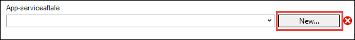

<properties
    pageTitle="Installere en ASP.NET-app til Azure App-tjenesten ved hjælp af Visual Studio | Microsoft Azure"
    description="Lær at anvende en ASP.NET web-projektet til en ny WebApp i Azure App-tjenesten ved hjælp af Visual Studio."
    services="app-service\web"
    documentationCenter=".net"
    authors="tdykstra"
    manager="wpickett"
    editor=""/>

<tags
    ms.service="app-service-web"
    ms.workload="web"
    ms.tgt_pltfrm="na"
    ms.devlang="dotnet"
    ms.topic="get-started-article"
    ms.date="07/22/2016"
    ms.author="rachelap"/>

# Installere en ASP.NET WebApp til Azure App-tjenesten ved hjælp af Visual Studio

[AZURE.INCLUDE [tabs](../../includes/app-service-web-get-started-nav-tabs.md)]

## Oversigt

Dette selvstudium viser, hvordan du installerer en ASP.NET web application til en [WebApp i Azure App Service](app-service-web-overview.md) ved hjælp af Visual Studio-2015.

Selvstudiet antages det, at du er en ASP.NET-udvikler, som har ingen tidligere oplevelse med ved hjælp af Azure. Når du er færdig, har du et simpelt webprogram op og kører i skyen.

Du kan lære følgende:

* Sådan oprettes en ny App Service WebApp, mens du opretter et nyt webprojekt i Visual Studio.
* Sådan installeres et webprojekt til en App Service-WebApp ved hjælp af Visual Studio.

Diagrammet viser, hvad du skal gøre i selvstudiet.

I slutningen af selvstudiet giver en sektion til [fejlfinding i forbindelse med](#troubleshooting) ideer til, hvad du skal gøre, hvis noget ikke virker, og en [Næste trin](#next-steps) sektion indeholder links til andre selvstudier, der indgår i flere dybde om at bruge Azure App Service.

Som det er en Introduktion – selvstudium, er webprojektet det viser, hvordan du kan installere en enkel en, der ikke bruger en database og ikke gøre godkendelse eller godkendelse. Links til mere avanceret installation emner, se, [hvordan du installerer en Azure-WebApp](web-sites-deploy.md).

Ud over den tid, der kræves for at installere Azure SDK til .NET, tager selvstudiet om 10-15 minutter for at gennemføre.

## Forudsætninger

* Selvstudiet antages, du har arbejdet med ASP.NET MVC og Visual Studio. Hvis du har brug for en introduktion, kan du se [Introduktion til ASP.NET MVC 5](http://www.asp.net/mvc/overview/getting-started/introduction/getting-started).

* Du har brug for en Azure-konto. Du kan [åbne en gratis Azure-konto](/pricing/free-trial/?WT.mc_id=A261C142F) eller [aktivere Visual Studio abonnement fordele](/pricing/member-offers/msdn-benefits-details/?WT.mc_id=A261C142F). 

    Hvis du vil Introduktion til Azure App Service, før du tilmelder dig en Azure-konto, skal du gå til [Prøve App Service](http://go.microsoft.com/fwlink/?LinkId=523751). Der kan du oprette en forbigående starter app i App Service – ingen kreditkort er påkrævet, og ingen forpligtelser.

## Konfigurere udviklingsmiljøet

Selvstudiet henvender sig til Visual Studio-2015 med [Azure SDK til .NET](../dotnet-sdk.md) 2,9 eller nyere. 

* Kan du [hente den nyeste Azure SDK til Visual Studio-2015](http://go.microsoft.com/fwlink/?linkid=518003). SDK installerer Visual Studio 2015, hvis du ikke allerede har den.

    >[AZURE.NOTE] Afhængigt af hvor mange af SDK afhængighederne du allerede har på computeren, kan installerer SDK tage lang tid, fra flere minutter at en halv time eller mere.

Hvis du har Visual Studio 2013 og foretrækker at bruge den, kan du [hente den nyeste Azure SDK til Visual Studio-2013](http://go.microsoft.com/fwlink/?LinkID=324322). Nogle skærmbilleder kan se anderledes ud end i illustrationer.

## Konfigurere et nyt webprojekt

Det næste trin er at oprette et webprojekt i Visual Studio og en WebApp i Azure App-tjeneste. I dette afsnit af selvstudiet konfigurere du det nye webprojekt. 

1. Åbne Visual Studio-2015.

2. Klik på **fil > Ny > Project**.

3. Klik på i dialogboksen **Nyt projekt** **Visual C# > Web > ASP.NET-webprogrammet**.

3. Sørg for, at **.NET Framework 4.5.2** er markeret som destination framework.

4.  [Azure programmet indsigt](../application-insights/app-insights-overview.md) overvåger din online for tilgængelighed, ydeevne og format. Afkrydsningsfeltet **Tilføj programmet indsigt til projekt** vælges som standard først gang du opretter et webprojekt efter installation af Visual Studio. Fjern markeringen i afkrydsningsfeltet, hvis den er markeret, men du ikke vil prøve programmet indsigt.

4. Navngiv programmet **MyExample**, og klik derefter på **OK**.

    

5. Vælg skabelonen, **MVC** i dialogboksen **Nyt ASP.NET-projekt** , og klik derefter på **Skift godkendelse**.

    Dette selvstudium skal installere du en ASP.NET MVC web project. Hvis du vil se, hvordan du installerer et ASP.NET Web API-projekt, skal du se afsnittet [Næste trin](#next-steps) . 

    

6. Klik på **Ingen godkendelse**i dialogboksen **Skift godkendelse** , og klik derefter på **OK**.

    

    For denne Introduktion – selvstudium du anvender en simpel app, der ikke gøre brugerlogon.

5. Sørg for, at **hoste i skyen** er markeret og, **App Service** er markeret på listen ned i afsnittet **Microsoft Azure** i dialogboksen **Ny ASP.NET-projekt** .

    

    Disse indstillinger direkte Visual Studio til at oprette en Azure-WebApp for webprojektet.

6. Klik på **OK**

## Konfigurere Azure ressourcer til en ny WebApp

Nu kan du se Visual Studio om de Azure ressourcer, som du vil oprette.

5. Klik på **Tilføj en konto**i dialogboksen **Opret App Service** , og derefter logge på Azure med-ID og adgangskoden til den konto, du kan bruge til at administrere dit Azure abonnement.

    

    Hvis du allerede er logget tidligere på den samme computer, kan du ikke kan se knappen **Tilføj en konto** . Det er tilfældet, kan du springe dette trin, eller du muligvis angive dine legitimationsoplysninger igen.
 
3. Angiv et **Web App-navn** , der er entydige i *azurewebsites.net* domænet. For eksempel kan du navngive den MyExample med tal til højre for at gøre det entydigt som MyExample810. Hvis en web standardnavnet er oprettet for dig, det vil være entydigt og kan du bruge den.

    Hvis en anden allerede har brugt det navn, du angiver, skal du se et rødt udråbstegn til højre i stedet for et grønt flueben, og du skal angive et andet navn.

    URL-adressen for dit program er dette navn plus *. azurewebsites.net*. Hvis navnet er eksempelvis `MyExample810`, URL-adressen er `myexample810.azurewebsites.net`.

    Du kan også bruge et brugerdefineret domæne med en Azure-WebApp. Se [konfigurere et brugerdefineret domænenavn i Azure App Service](web-sites-custom-domain-name.md)kan finde flere oplysninger.

6. Klik på knappen **Ny** ud for feltet **Ressourcegruppe** , og derefter indtaste "MyExample" eller et andet navn, hvis du foretrækker. 

    

    En ressourcegruppe er en samling af Azure ressourcer som Onlines, databaser og FOS. Et selvstudium er det normalt bedst til at oprette en ny ressourcegruppe, fordi, der gør det nemt at slette en hvilken som helst Azure ressourcer, som du opretter i dette selvstudium i ét trin. Se [Oversigt over Azure ressourcestyring](../azure-resource-manager/resource-group-overview.md)kan finde flere oplysninger.

4. Klik på knappen **Ny** ud for den **App Service planlægge** ned.

    

    Dialogboksen **Konfigurer App Service planlægge** vises.

    

    I de følgende trin, kan du konfigurere en App-serviceaftale til den nye ressourcegruppe. En App-serviceaftale angiver de Beregn ressourcer, der kører din online på. Eksempelvis hvis du vælger det gratis niveau, kører din API-app på delt FOS, mens for nogle betalt niveauer, der køres på dedikeret FOS. Se [Oversigt over App Service planer](../app-service/azure-web-sites-web-hosting-plans-in-depth-overview.md), kan finde flere oplysninger.

5. Angiv "MyExamplePlan" eller et andet navn, hvis du foretrækker, i dialogboksen **Konfigurer App Service planlægge** .

5. Vælg den placering, der er tættest på du i rullelisten **placering** .

    Denne indstilling angiver, hvilke Azure datacenter din app kører i. Du kan vælge en hvilken som helst område og den gøre ikke en chatanmodning forskel dette selvstudium. Men et fremstilling app, du vil din server skal være så tæt som muligt på de klienter, der har adgang til det, for at minimere [Ventetid](http://www.bing.com/search?q=web%20latency%20introduction&qs=n&form=QBRE&pq=web%20latency%20introduction&sc=1-24&sp=-1&sk=&cvid=eefff99dfc864d25a75a83740f1e0090).

5. Klik på **gratis**i rullemenuen **størrelse** .

    Dette selvstudium skal give det gratis priser niveau godt nok ydeevne.

6. Klik på **OK**i dialogboksen **Konfigurer App Service planlægge** .

7. Klik på **Opret**i dialogboksen **Opret App Service** .

## Visual Studio opretter projekt- og web app

I et øjeblik, normalt mindre end et minut opretter Visual Studio webprojektet og WebApp.  

Vinduet **Solution Explorer** viser filer og mapper i det nye projekt.

Vinduet **Azure App serviceaktivitet** viser, at WebApp er blevet oprettet.

**Skyen Stifinder** -vinduet kan du få vist og administrere Azure ressourcer, herunder den nye WebApp, som du lige har oprettet.

    
## Anvende webprojektet til Azure WebApp

I dette afsnit, skal installere du web project web App.

1. I **Solution Explorer**, skal du højreklikke på projektet, og vælg **Publicer**.

    

    Guiden **Udgiv websted** vises i et par sekunder. Guiden åbnes en *publicere profil* , der har indstillinger til implementering af webprojektet til den nye WebApp.

    Publicer-profil indeholder et brugernavn og adgangskode til installation.  Disse legitimationsoplysninger er oprettet for dig, og du behøver ikke at angive dem. Adgangskoden er krypteret i en skjult bruger-specifikke fil i den `Properties\PublishProfiles` mappe.
 
8. Klik på **Næste**under fanen **forbindelse** i guiden **Udgiv websted** .

    

    Næste er under fanen **Indstillinger** . Her kan du ændre konfigurationen af Generer for at installere et fejlfinding build til [ekstern fejlfinding](../app-service-web/web-sites-dotnet-troubleshoot-visual-studio.md#remotedebug). Fanen tilbyder også flere [Indstillinger for udgivelse af filen](https://msdn.microsoft.com/library/dd465337.aspx#Anchor_2).

10. Klik på **Næste**under fanen **Indstillinger** .

    

    Fanen **eksempel** skal der ske nu. Her kan du have mulighed for at se, hvilke filer der skal kopieres fra dit projekt til API-app. Når du anvender et projekt til en API-app, du allerede installeret på tidligere, kopieres kun ændrede filer. Hvis du vil se en liste over hvad der skal kopieres, kan du klikke på knappen **Start Preview** .

11. Klik på **Publicer**under fanen **Vis udskrift** .

    

    Når du klikker på **Udgiv**, begynder Visual Studio processen med at kopiere filerne til Azure-serveren. Det kan tage et par.

    Vinduerne **Output** og **Azure App serviceaktivitet** Vis hvad installation er taget og rapportere installationen er fuldført.

    

    Efter vellykket udrulning standardbrowseren åbnes automatisk til URL-adresse af udløst WebApp, og det program, du har oprettet kører nu i skyen. URL-adressen i browserens adresselinje viser, at WebApp er indlæst fra internettet.

    

    > [AZURE.TIP]Du kan aktivere værktøjslinjen **Web én-Klik på Udgiv** til hurtig installation. Klik på **Vis > Værktøjslinjer**, og vælg derefter **Web én-Klik på Publicer**. Du kan bruge værktøjslinjen til at vælge en profil, skal du klikke på en knap til at publicere, eller klik på en knap for at åbne guiden **Udgiv websted** .
    > 

## Fejlfinding i forbindelse med

Hvis der opstår et problem, mens du gennemgår dette selvstudium, skal du kontrollere, at du bruger den nyeste version af Azure SDK til .NET. Den nemmeste måde at gøre det er at [hente Azure SDK til Visual Studio-2015](http://go.microsoft.com/fwlink/?linkid=518003). Hvis du har den aktuelle version, der er installeret, kan du vide, at ingen installation er nødvendig Web Platform installationsprogrammet.

Hvis du er på virksomhedens netværk og forsøger at installere på Azure App Service via en firewall, skal du kontrollere, at port 443 og 8172 er åbne for Web installere. Hvis du ikke kan åbne disse porte, i afsnittet følgende næste trin for andre installationsindstillinger.

Når du har din ASP.NET WebApp, der kører i Azure App-tjeneste, kan du mere at vide om Visual Studio-funktioner, der forenkler fejlfinding. Ekstern fejlfinding og meget mere, se oplysninger om logføring [fejlfinding i forbindelse med Azure webapps i Visual Studio](web-sites-dotnet-troubleshoot-visual-studio.md).

## Næste trin

I dette selvstudium har du set hvordan du kan oprette et simpelt webprogram og installere den på en Azure-WebApp. Her er nogle relaterede emner og ressourcer for at lære mere om Azure App Service:

* Overvåge og administrere din online i [Azure-portalen](https://portal.azure.com/). 

    Se [en oversigt over portalen Azure](/services/management-portal/) og [Konfigurer webapps i Azure App Service](web-sites-configure.md)kan finde flere oplysninger.

* Anvende et eksisterende webprojekt til en ny WebApp, ved hjælp af Visual Studio

    Højreklik på projektet i **Solution Explorer**, og klik derefter på **Udgiv**. Vælg **Microsoft Azure App Service** som mål-Udgiv, og klik derefter på **Ny**. Dialogboksene er derefter den samme som hvad du har set i dette selvstudium.

* Installere et webprojekt ud fra versionsstyring

    Finde oplysninger om [automatisere installation](http://www.asp.net/aspnet/overview/developing-apps-with-windows-azure/building-real-world-cloud-apps-with-windows-azure/continuous-integration-and-continuous-delivery) fra en [kilde](http://www.asp.net/aspnet/overview/developing-apps-with-windows-azure/building-real-world-cloud-apps-with-windows-azure/source-control), skal du se [komme i gang med webapps i Azure App Service](app-service-web-get-started.md) , og [hvordan du installerer en Azure-WebApp](web-sites-deploy.md).

* Anvende en ASP.NET Web API til en API-app i Azure App Service

    Du har set hvordan du opretter en forekomst af Azure App tjeneste, der primært beregnet til at hoste et websted. App Service tilbyder også funktioner til at være vært Web API'er, som understøtter CORS og API metadata understøttelse af oprettelse af klienten kode. Du kan bruge API funktioner i en online, men hvis du vil hovedsageligt være vært for en API i en forekomst af App Service, en **API app** der ville være et bedre valg. Se [Introduktion til API-Apps og ASP.NET i Azure App Service](../app-service-api/app-service-api-dotnet-get-started.md)kan finde flere oplysninger. 

* Tilføje et brugerdefineret domænenavn og SSL

    Du kan finde oplysninger om, hvordan man bruger SSL og dit eget domæne (for eksempel www.contoso.com i stedet for contoso.azurewebsites.net), i følgende ressourcer:

    * [Konfigurere et brugerdefineret domænenavn i Azure App Service](web-sites-custom-domain-name.md)
    * [Aktivere HTTPS til et websted, der Azure](web-sites-configure-ssl-certificate.md)

* Slette den ressource, der indeholder din online og alle relaterede Azure ressourcer, når du er færdig med dem.

    Du kan finde oplysninger om at arbejde med grupper i portalen Azure [Implementer ressourcer til Ressourcestyring skabeloner og Azure-portalen](../resource-group-template-deploy-portal.md).   

*   Se flere eksempler for at oprette en ASP.NET Web App i App Service, under [oprette og anvende en ASP.NET WebApp i Azure App Service](https://github.com/Microsoft/HealthClinic.biz/wiki/Create-and-deploy-an-ASP.NET-web-app-in-Azure-App-Service) og [oprette og anvende en mobilapp i Azure App Service](https://github.com/Microsoft/HealthClinic.biz/wiki/Create-and-deploy-a-mobile-app-in-Azure-App-Service) fra [HealthClinic.biz](https://github.com/Microsoft/HealthClinic.biz) 2015 forbinde [demo](https://blogs.msdn.microsoft.com/visualstudio/2015/12/08/connectdemos-2015-healthclinic-biz/). Du kan finde flere Hurtig start-guider fra HealthClinic.biz videoen, [Azure udvikler værktøjer Hurtig start-guider](https://github.com/Microsoft/HealthClinic.biz/wiki/Azure-Developer-Tools-Quickstarts).
