<properties 
    pageTitle="Oprette en Azure line of business-app med AD FS-godkendelse | Microsoft Azure" 
    description="Lær, hvordan du opretter en line of business-app i Azure App-tjeneste, som godkender med STS lokalt hos. Dette selvstudium, er beregnet til AD FS som STS lokalt." 
    services="app-service\web" 
    documentationCenter=".net" 
    authors="cephalin" 
    manager="wpickett" 
    editor=""/>

<tags 
    ms.service="app-service-web" 
    ms.devlang="dotnet" 
    ms.topic="article" 
    ms.tgt_pltfrm="na" 
    ms.workload="web" 
    ms.date="08/31/2016" 
    ms.author="cephalin"/>

# Oprette en Azure line of business-app med AD FS-godkendelse

I denne artikel viser, hvordan du opretter et ASP.NET MVC line of business-program i [Azure App Service](../app-service/app-service-value-prop-what-is.md) ved hjælp af et lokalt [Active Directory Federation Services](http://technet.microsoft.com/library/hh831502.aspx) som identitetsudbyder. Dette scenarie kan arbejde, når du vil oprette line of business programmer i Azure App Service, men din organisation kræver directory data gemmes på stedet.

>[AZURE.NOTE] Du kan finde en oversigt over de forskellige enterprise godkendelse og autorisation indstillinger til Azure App Service, [Godkend med lokale Active Directory i din Azure-app](web-sites-authentication-authorization.md).

## Hvad vil du opbygge ##

Du kan oprette en grundlæggende ASP.NET-program i Azure App Service Web Apps med følgende funktioner:

- Godkender brugere mod AD FS
- Bruger `[Authorize]` til at tillade brugere til forskellige handlinger
- Statisk konfiguration til både fejlfinding i Visual Studio og publicere på App-tjenesten Web Apps (konfigurere én gang, fejlfinding og udgive når som helst)  

## Hvad du bør ##

[AZURE.INCLUDE [free-trial-note](../../includes/free-trial-note.md)]

Du skal bruge følgende for at udføre dette selvstudium:

- Et lokalt AD FS installation (for en til slut gennemgang af det testmiljø, der bruges i dette selvstudium, se [teste øvelse: enkeltstående STS med AD FS i Azure VM (for kun test)](https://blogs.msdn.microsoft.com/cephalin/2014/12/21/test-lab-standalone-sts-with-ad-fs-in-azure-vm-for-test-only/))
- Tilladelser til at oprette stole part tillidsforhold i AD FS Management
- Visual Studio 2013 opdatering 4 eller nyere
- [Azure SDK 2.8.1](http://go.microsoft.com/fwlink/p/?linkid=323510&clcid=0x409) eller nyere

## Bruge Northwind til line of business skabelon ##

Eksempelprogrammet i dette selvstudium [WebApp-WSFederation-DotNet)](https://github.com/AzureADSamples/WebApp-WSFederation-DotNet), er oprettet af Azure Active Directory-gruppe. Da AD FS understøtter WS-sammenslutning, kan du bruge det som en skabelon til at oprette line of business programmer med øget. Der er følgende funktioner:

- Bruger [WS-Federation](http://msdn.microsoft.com/library/bb498017.aspx) til at godkende med et lokalt AD FS-installation
- Log på og logge funktionalitet
- Bruger [Microsoft.Owin](http://www.asp.net/aspnet/overview/owin-and-katana/an-overview-of-project-katana) (i stedet for Windows Identity Foundation), som er fremtidige af ASP.NET og meget nemmere at konfigurere for godkendelse og autorisation end WIF

## Konfigurere eksempelprogrammet ##

2.  Klon eller hente eksempel opløsningen ved [WebApp-WSFederation-DotNet](https://github.com/AzureADSamples/WebApp-WSFederation-DotNet) til din lokale mappe.

    > [AZURE.NOTE] Vejledningen på [README.md](https://github.com/AzureADSamples/WebApp-WSFederation-DotNet/blob/master/README.md) viser dig, hvordan du konfigurerer programmet med Azure Active Directory. Men i dette selvstudium du konfigurere det med AD FS, så i stedet følge disse trin her.

3.  Åbn løsningen, og Åbn derefter Controllers\AccountController.cs i **Solution Explorer**.

    Du vil se, at koden blot problemer en godkendelse udfordring at godkende brugeren ved hjælp af WS-sammenslutning. Alle godkendelse er konfigureret i App_Start\Startup.Auth.cs.

4.  Åbn App_Start\Startup.Auth.cs. I den `ConfigureAuth` metode, Bemærk linjen:

        app.UseWsFederationAuthentication(
            new WsFederationAuthenticationOptions
            {
                Wtrealm = realm,
                MetadataAddress = metadata                                      
            });

    I verden OWIN er denne kodestykke virkelig som minimum skal du konfigurere WS-Federation godkendelse. Det er meget nemmere og mere elegant end WIF, hvor Web.config er tilføjet med XML over hele stedet. Er de eneste oplysninger, du har brug for den afhængige parts (RP)-id og URL-adressen på din ADFS-tjeneste metadatafil. Her er et eksempel:

    -   RP-id:`https://contoso.com/MyLOBApp`
    -   Metadata adresse:`http://adfs.contoso.com/FederationMetadata/2007-06/FederationMetadata.xml`

5.  Ændre følgende statisk streng definitioner i App_Start\Startup.Auth.cs:  
    <pre class="prettyprint">
    privat statisk streng startdomænet = ConfigurationManager.AppSettings["ida:<mark>RPIdentifier</mark>"]; <mark><del>privat statisk streng aadInstance = ConfigurationManager.AppSettings["ida:AADInstance"];</del></mark> 
     <mark><del>privat statisk streng lejer = ConfigurationManager.AppSettings["ida:Tenant"];</del></mark> 
     <mark><del>privat statisk streng metadata = streng. Format ("{0} / {1} /federationmetadata/2007-06/federationmetadata.xml", aadInstance, lejer);</del></mark> 
     <mark>privat statisk streng metadata = streng. Format ("https:// {0} /federationmetadata/2007-06/federationmetadata.xml", ConfigurationManager.AppSettings["ida:ADFS"]);</mark>

    <mark><del>streng nøglecenter = String.Format (CultureInfo.InvariantCulture, aadInstance, lejer)</del></mark>
    </pre>

6.  Nu, foretage de tilsvarende ændringer i Web.config. Åbn Web.config og ændre de følgende app-indstillinger:  
    <pre class="prettyprint">
    &lt;appSettings&gt;
    &lt;add key="webpages:Version" value="3.0.0.0" /&gt;
    &lt;add key="webpages:Enabled" value="false" /&gt;
    &lt;add key="ClientValidationEnabled" value="true" /&gt;
    &lt;add key="UnobtrusiveJavaScriptEnabled" value="true" /&gt;
      <mark><del>&lt;add key="ida:Wtrealm" value="[Enter the App ID URI of WebApp-WSFederation-DotNet https://contoso.onmicrosoft.com/WebApp-WSFederation-DotNet]" /&gt;</del></mark>
      <mark><del>&lt;add key="ida:AADInstance" value="https://login.windows.net" /&gt;</del></mark>
      <mark><del>&lt;add key="ida:Tenant" value="[Enter tenant name, e.g. contoso.onmicrosoft.com]" /&gt;</del></mark>
      <mark>&lt;add key="ida:RPIdentifier" value="[Enter the relying party identifier som er konfigureret i AD FS, f.eks. https://localhost:44320 /] "/&gt;</mark>
      <mark>&lt;føje nøgle ="ida: ADFS"værdi ="[Skriv det fuldstændige Domænenavn for AD FS-tjenesten, f.eks. adfs.contoso.com]"/&gt; </mark>        

    &lt;/appSettings&gt;
    </pre>

    Udfyld de nøgleværdier, der er baseret på dit respektive miljø.

7.  Opbygge programmet for at sikre, at der ikke er nogen fejl.

Det var det. Eksempelprogrammet er nu klar til at arbejde med AD FS. Du stadig nødt til at konfigurere et RP tillidsforhold med dette program i AD FS senere.

## Installere eksempelprogrammet til Azure App Service Web Apps

Her skal du publicere programmet til en WebApp i App-tjenesten Web Apps og samtidig bevare fejlfinding-miljø. Bemærk, at du vil publicere programmet, før den har et RP tillidsforhold med AD FS, så godkendelse stadig ikke virker endnu. Men hvis du gøre det nu kan du få web app URL-adressen, som du kan bruge til at konfigurere RP Hav tillid til senere.

1. Højreklik på dit projekt, og vælg **Publicer**.

    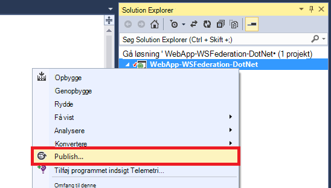

2. Vælg **Microsoft Azure App tjeneste**.
3. Hvis du ikke har logget på Azure, skal du klikke på **Log på** og bruge den Microsoft-konto for abonnementet Azure til at logge på.
4. Når du er logget, skal du klikke på **Ny** for at oprette en web-app.
5. Udfyld alle de obligatoriske felter. Du skal oprette forbindelse til lokal data senere, så ikke oprette en database til denne WebApp.

    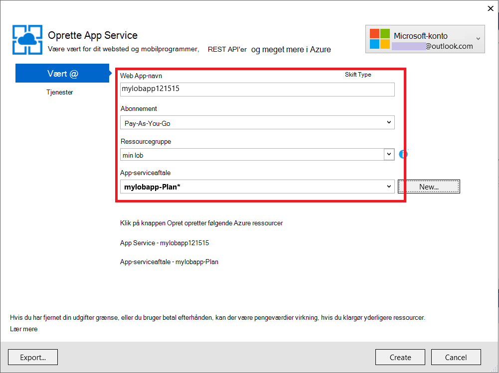

6. Klik på **Opret**. Når webappen er oprettet, åbnes dialogboksen Udgiv webside.
7. **URL-destinationsadressen**, ændre **http** til **https**. Kopiere hele URL-adressen til et tekstredigeringsprogram til senere brug. Klik derefter på **Udgiv**.

    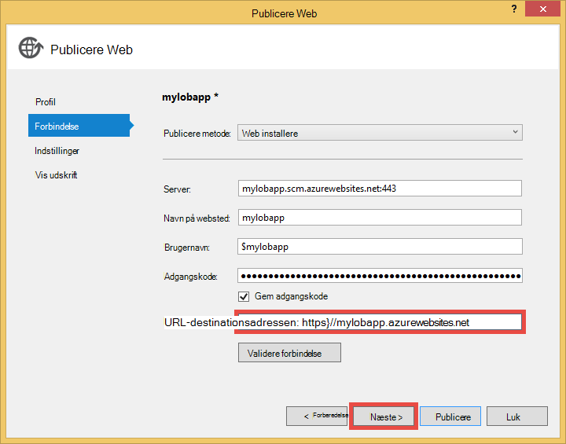

11. Åbn **Web.Release.config** i dit projekt i Visual Studio. Indsæt følgende XML-filen til den `<configuration>` mærke, og Erstat den nøgleværdi med din Publicer online URL-adresse.  
    <pre class="prettyprint">
&lt;appSettings&gt;
   &lt;føje nøgle = "ida: RPIdentifier" værdi = "<mark>[fx https://mylobapp.azurewebsites.net/]</mark>" xdt:Transform = "SetAttributes" xdt:Locator="Match(key)" /&gt;
&lt;/appSettings&gt;</pre>

Når du er færdig, har du to RP-id'er, der er konfigureret i dit projekt, en for dit fejlfinding miljø i Visual Studio og en til publicerede web app i Azure. Du kan konfigurere en RP sikkerhed og rettighedsadministration for hver af de to miljøer i AD FS. Under fejlfinding, er indstillingerne app i Web.config bruges til at foretage **fejlfinding af** konfigurationen arbejde med AD FS. Når den er blevet publiceret (som standard **Release** konfigurationen er blevet publiceret), en transformerede Web.config er overført, der indeholder app indstillingsændringerne i Web.Release.config.

Hvis du vil vedhæfte den publicerede web app i Azure til fejlfindingsværktøjet (det vil sige skal du overføre fejlfinding symboler i din kode i den publicerede online), kan du oprette en kopi af fejlfinding konfigurationen til Azure fejlfinding, men med sin egen brugerdefinerede Web.config Transformation (fx Web.AzureDebug.config), der bruger indstillingerne app fra Web.Release.config. Dette giver dig mulighed at bevare en statisk konfiguration på tværs af forskellige miljøer.

## Konfigurere afhængige part tillidsforhold i AD FS Management ##

Nu skal du konfigurere en RP tilliden AD FS Management, før du kan bruge din Northwind og faktisk godkende med AD FS. Du skal konfigurere to separate RP tillidsforhold, én for dit miljø til fejlfinding og én til din publicerede online.

> [AZURE.NOTE] Sørg for, at du gentage følgende trin i begge af dine miljøer.

4.  Log på med legitimationsoplysningerne, som har management rettigheder til AD FS på din ADFS-server.
5.  Åbn AD FS Management. Højreklik på **AD FS\Trusted Relationships\Relying part har tillid til** , og vælg **Tilføj stole part har tillid til**.

    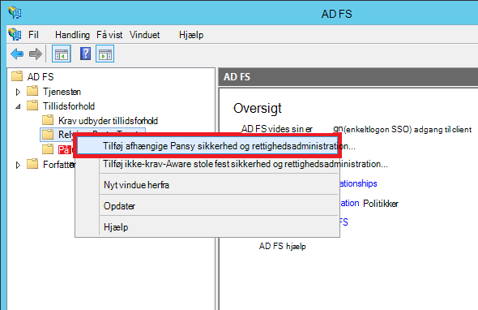

5.  **Vælg datakilde** på siden, vælge **Angiv data om den afhængige part manuelt**. 

    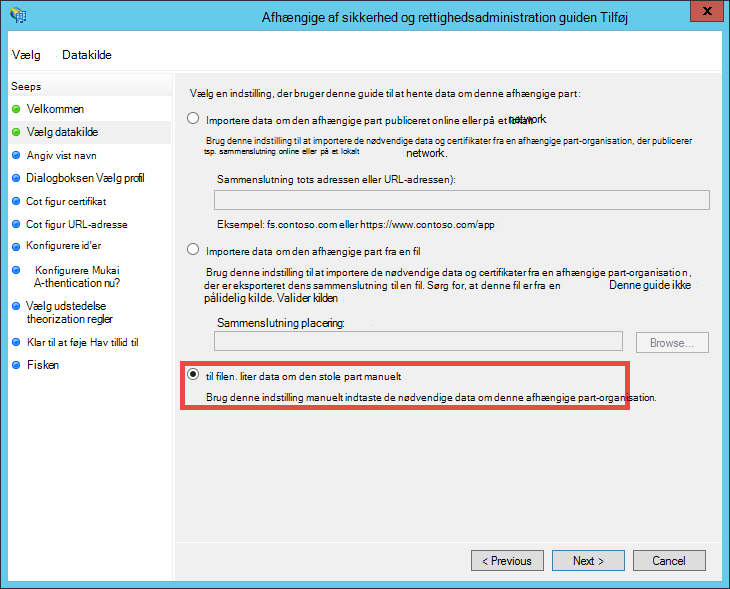

6.  Skriv et navn til programmet, og klik på **Næste**på siden **Angiv visningsnavn** .
7.  Klik på **Næste**på siden **Vælg Protocol** .
8.  Klik på **Næste**på siden **Konfigurer certifikat** .

    > [AZURE.NOTE] Da du skal bruge HTTPS allerede, er krypteret tokens valgfrie. Hvis du virkelig vil kryptere tokens ud fra AD FS på denne side, skal du også tilføje token dekryptere logik i din kode. Se [manuel konfiguration af OWIN WS-Federation programmer og acceptere krypterede tokens](http://chris.59north.com/post/2014/08/21/Manually-configuring-OWIN-WS-Federation-middleware-and-accepting-encrypted-tokens.aspx)kan finde flere oplysninger.
  
5.  Før du flytter til næste trin, skal du én oplysning fra dit Visual Studio-projekt. Bemærk **SSL URL-adressen** på programmet i egenskaberne for projektet. 

    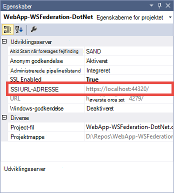

6.  Tilbage i AD FS-administration på siden **Konfigurer URL-adressen** i **Stole part har tillid til guiden Tilføj**, vælge **aktivere understøttelse af WS-Federation Passive protokollen** og skrive i SSL URL-adressen på dit Visual Studio-projekt, du har noteret i ovenstående trin. Klik derefter på **Næste**.

    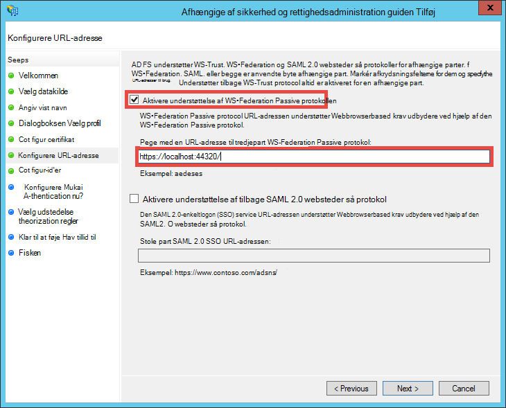

    > [AZURE.NOTE] URL-adressen angiver, hvor du vil sende klienten, når godkendelse er oprettet. For fejlfinding-miljø, de skal være <code>https://localhost:&lt;port&gt;/</code>. Publicerede web App, skal den være web app URL-adressen.

7.  Kontroller, at projektet SSL URL-adresse er allerede angivet **Konfigurere id'er** på siden, og klik på **Næste**. Klik på **Næste** helt til slutningen af guiden med standardvalg.

    > [AZURE.NOTE] I App_Start\Startup.Auth.cs af Visual Studio-projekt, er dette id matchet mod værdien af <code>WsFederationAuthenticationOptions.Wtrealm</code> under Samlet godkendelse. Som standard føjes programmets URL-adressen fra det forrige trin som RP id.

8.  Du har nu færdig med at konfigurere programmet RP for projektet i AD FS. Derefter skal konfigurere du dette program til at sende de krav, der kræves af programmet. Dialogboksen **Rediger Kræv regler** åbnes som standard for dig i slutningen af guiden så du kan begynde med det samme. Lad os konfigurere mindst følgende krav (med ved hjælp af skemaer i parentes):

    -   Navn (http://schemas.xmlsoap.org/ws/2005/05/identity/claims/name) - bruges af ASP.NET til hydrate `User.Identity.Name`.
    -   Brugerens hovednavn (http://schemas.xmlsoap.org/ws/2005/05/identity/claims/upn) - bruges til at entydigt identificerer brugere i organisationen.
    -   Gruppemedlemskaber som roller (http://schemas.microsoft.com/ws/2008/06/identity/claims/role) - kan bruges med `[Authorize(Roles="role1, role2,...")]` udsmykning til Godkend enheder/handlinger. Denne metode muligvis ikke de fleste performant for rolle authorization i virkeligheden. Hvis brugerne AD tilhører hundredvis af sikkerhedsgrupper, bliver de hundredvis af rolle krav i SAML tokenet. En alternativ metode er at sende et enkelt rolle krav betinget afhængigt af brugerens medlemskab i en bestemt gruppe. Men vi vil Hold det enkelt til dette selvstudium.
    -   Name ID (http://schemas.xmlsoap.org/ws/2005/05/identity/claims/nameidentifier) - kan bruges til mod forfalskning validering. Du kan finde flere oplysninger om, hvordan du gør det arbejde med mod forfalskning datavalidering i afsnittet **Tilføj line of business funktionalitet** oprettelse af [en linje of business - Azure-app med Azure Active Directory-godkendelse](web-sites-dotnet-lob-application-azure-ad.md#bkmk_crud).

    > [AZURE.NOTE] Typerne krav, du skal konfigurere for dit program bestemmes af programmets behov. Liste over krav, der understøttes af Azure Active Directory-programmer (det vil sige RP tillidsforhold), for eksempel se [understøttes Token og Kræv typer](http://msdn.microsoft.com/library/azure/dn195587.aspx).

8.  Klik på **Tilføj regel**i dialogboksen Rediger Kræv regler.
9.  Konfigurere de navn, UPN og rolle krav, som vist i skærmbilledet, og klik på **Udfør**.

    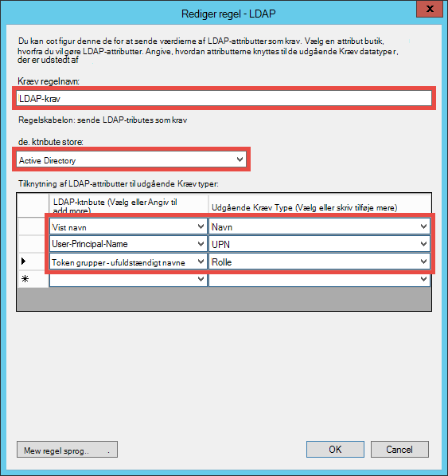

    Derefter skal oprette du et midlertidige navn, ID gøre krav på ved hjælp af de trin, der er vist i [Navnet id'er i SAML påstande](http://blogs.msdn.com/b/card/archive/2010/02/17/name-identifiers-in-saml-assertions.aspx).

9.  Klik på **Tilføj regel** igen.
10. Vælg **Send krav ved hjælp af en brugerdefineret regel** , og klik på **Næste**.
11. Indsæt følgende regel sprog i feltet **brugerdefineret regel** , Navngiv reglen **Per Session id** , og klik på **Udfør**.  
    <pre class="prettyprint">
    C1: [Type == "http://schemas.microsoft.com/ws/2008/06/identity/claims/windowsaccountname"] &amp; &amp; 
    c2: [Type == "http://schemas.microsoft.com/ws/2008/06/identity/claims/authenticationinstant"] = > Tilføj (gemme = "_OpaqueIdStore", typer = ("<mark>http://contoso.com/internal/sessionid</mark>"), forespørgsel = "{0}, {} 1}. {2}. {3}. {4} ", parameteren ="useEntropy", parameteren = c1. Værdi, parameteren = c1. OriginalIssuer, parameteren = "", parameteren = c2. Værdi);
    </pre>

    Brugerdefineret reglen skal se ud som dette skærmbillede:

    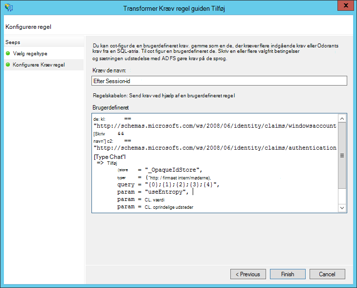

9.  Klik på **Tilføj regel** igen.
10. Vælg **transformere et indgående krav** , og klik på **Næste**.
11. Konfigurere reglen, som vist i skærmbilledet (ved hjælp af typen krav, du oprettede i den brugerdefinerede regel), og klik på **Udfør**.

    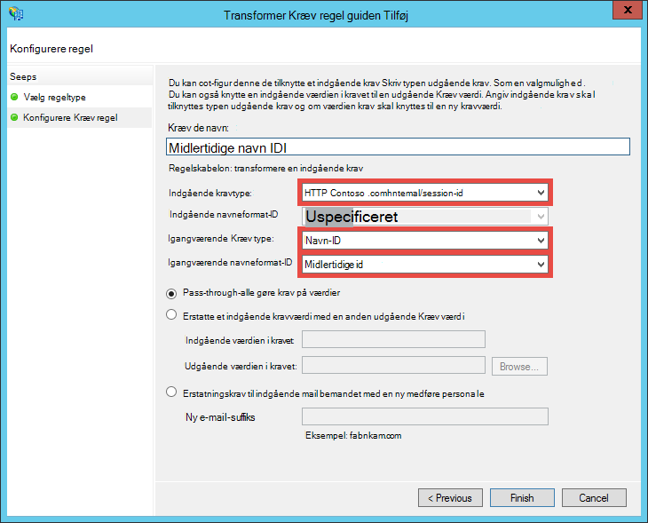

    Du kan finde detaljerede oplysninger om trinnene for midlertidige navn ID kravet [Navn id'er i SAML påstande](http://blogs.msdn.com/b/card/archive/2010/02/17/name-identifiers-in-saml-assertions.aspx).

12. Klik på **Anvend** i dialogboksen **Rediger Kræv regler** . Det ser nu sådan følgende skærmbillede:

    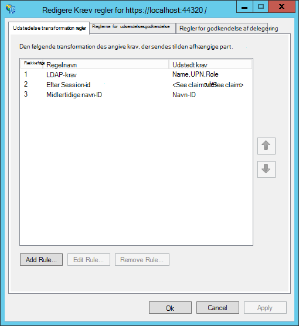

    > [AZURE.NOTE] Igen, Sørg for, at du Gentag disse trin for både dit miljø til fejlfinding og publicerede WebApp.

## Test samlet godkendelse for dit program

Du er klar til at teste dit program godkendelse logik mod AD FS. I min AD FS-testmiljø har jeg en testbruger, der tilhører en testgruppe i Active Directory (AD).

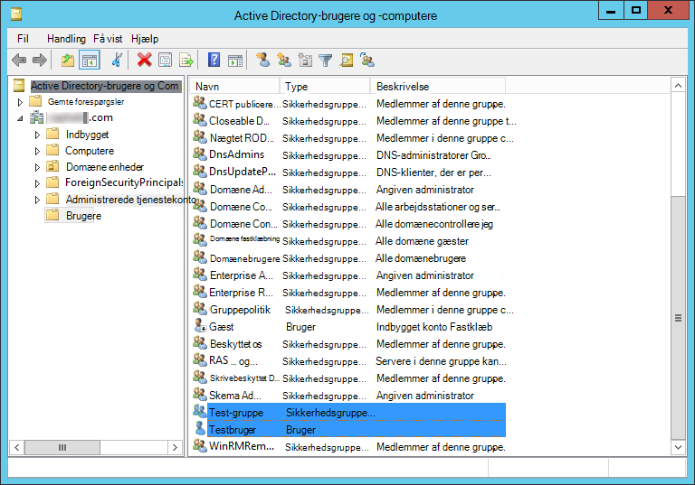

For at teste godkendelse i fejlfindingen, skal du gøre nu blot type `F5`. Hvis du vil teste godkendelse i publicerede WebApp, skal du gå til URL-adressen.

Når webprogrammet indlæses, skal du klikke på **Log på**. Du bør nu få en dialogboks til logon eller siden login served ved AD FS, afhængigt af den valgte ved AD FS godkendelsesmetode. Her er, hvad jeg fat i Internet Explorer 11.

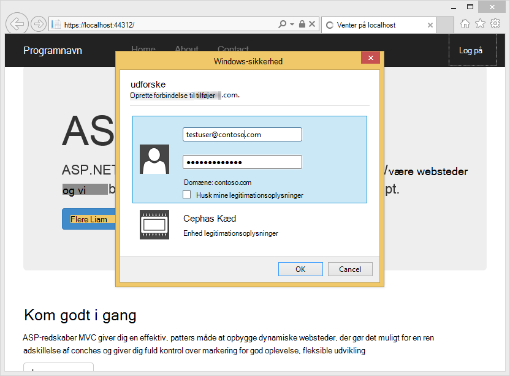

Når du logger på med en bruger i AD domænet for AD FS-installationen, du bør nu se på hjemmesiden igen med **Hej, <User Name>!** i hjørnet. Her er, hvad jeg får.

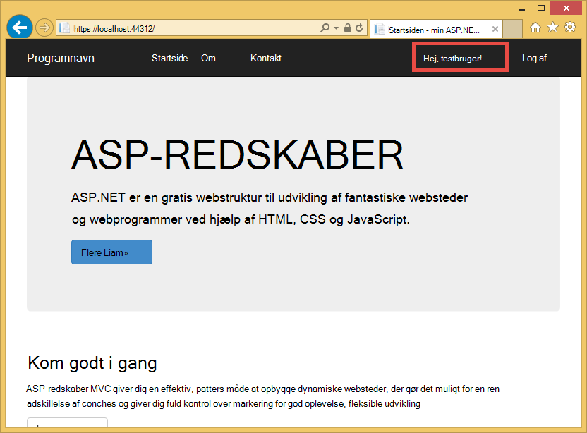

Hidtil, har du gennemført på følgende måder:

- Dit program er blevet nået AD FS og et tilsvarende RP-id bliver fundet i AD FS-database
- AD FS er blevet godkendt, en AD bruger og Omdiriger du tilbage til startsiden for det program
- AD FS som sendt navn kravet (http://schemas.xmlsoap.org/ws/2005/05/identity/claims/name) i dit program, som angivet af fakultet, brugernavnet vises i hjørnet. 

Hvis navnet kravet mangler, du vil har set **Hej,!**. Hvis du ser på Views\Shared\_LoginPartial.cshtml, finder du, at det bruger `User.Identity.Name` til at vise brugernavnet. Som tidligere nævnt, hvis navn gør krav på den godkendte bruger findes i SAML tokenet hydrates ASP.NET denne egenskab med den. For at se alle de krav, der sendes af AD FS skal du placere et pausepunkt i Controllers\HomeController.cs, i metoden indeks handling. Når brugeren er godkendt, undersøge det `System.Security.Claims.Current.Claims` af websteder.

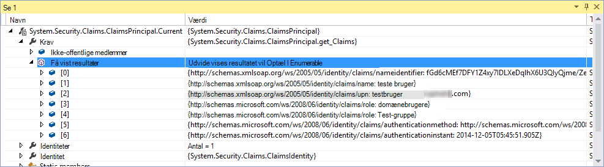 

## Godkend brugere for bestemte enheder eller handlinger

Da du har medtaget gruppemedlemskaber som rolle krav i konfigurationen RP Hav tillid til, kan du nu bruge dem direkte i den `[Authorize(Roles="...")]` udsmykning til enheder og handlinger. Du kan give bestemte roller for at få adgang til hver handling i et line of business-program med Opret-læse-opdatering-sletning (CRUD) mønster. Nu skal forsøger du bare ud af denne funktion på den eksisterende hjem controller.

1. Åbn Controllers\HomeController.cs.
2. Dekorere den `About` og `Contact` handling metoder ligner følgende kode, ved hjælp af sikkerhed gruppere medlemskaber, der indeholder din godkendte bruger.  
    <pre class="prettyprint">
    <mark>[Godkend (roller = "Test gruppe")]</mark> 
    offentlige ActionResult About() {ViewBag.Message = "Programmet beskrivelse siden.";

        return View();
    }

    <mark>[Godkend (roller = "Domæneadministrator")]</mark> 
    offentlige ActionResult Contact() {ViewBag.Message = "Kontakter siden.";

        return View();
    }  </pre>

    Da jeg føjet **Teste bruger** til **Test-gruppe** i min AD FS-testmiljø, jeg vil bruge Test-gruppe til at teste authorization på `About`. For `Contact`, jeg vil teste den negative sag af **Domæneadministrator**, som ikke hører hjemme **Teste bruger** .

3. Starte fejlfindingsværktøjet ved at skrive `F5` og logge på og derefter klikke på **om**. Du bør nu vist den `~/About/Index` siden korrekt, hvis din godkendte brugere har tilladelse til denne handling.
4. Klik nu på **Kontakt**, som i mit tilfælde ikke skal tillade **Testbruger** til handlingen. Dog omdirigeres browseren til AD FS, som viser til sidst i denne meddelelse:

    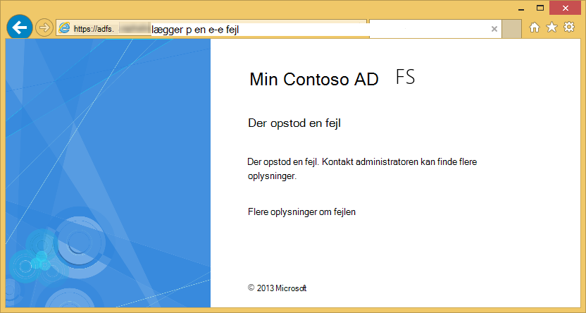

    Hvis du undersøge denne fejl i Logbog på AD FS-server, skal se du denne Undtagelsesmeddelelsen:  
    <pre class="prettyprint">
   Microsoft.IdentityServer.Web.InvalidRequestException: MSIS7042: <mark>samme klient browsersession, der har skrevet '6' anmodninger i de sidste '11' sekunder.</mark> Få mere at vide, skal du kontakte din administrator.
   på Microsoft.IdentityServer.Web.Protocols.PassiveProtocolHandler.UpdateLoopDetectionCookie (WrappedHttpListenerContext kontekst) på Microsoft.IdentityServer.Web.Protocols.WSFederation.WSFederationProtocolHandler.SendSignInResponse (WSFederationContext kontekst, MSISSignInResponse svar) på Microsoft.IdentityServer.Web.PassiveProtocolListener.ProcessProtocolRequest (ProtocolContext protocolContext, PassiveProtocolHandler protocolHandler) på Microsoft.IdentityServer.Web.PassiveProtocolListener.OnGetContext (WrappedHttpListenerContext kontekst) </pre>

    Årsagen til denne fejl er, som standard MVC returnerer en 401 Uautoriseret når en bruger roller ikke har tilladelse. Dette udløser en anmodning om godkendelse til din identitetsudbyder (AD FS). Da brugeren allerede er godkendt, returnerer AD FS til den samme side, som derefter problemer er en anden 401 oprettelse af en Omdiriger løkke. Du kan tilsidesætte Authorizeattribute's `HandleUnauthorizedRequest` metode med enkel logik til at vise noget, der giver mening i stedet for fortsætter Omdiriger løkke.

5. Oprette en fil i det projekt, der kaldes AuthorizeAttribute.cs, og Indsæt følgende kode i den.

        using System;
        using System.Web.Mvc;
        using System.Web.Routing;
        
        namespace WebApp_WSFederation_DotNet
        {
            [AttributeUsage(AttributeTargets.Class | AttributeTargets.Method, Inherited = true, AllowMultiple = true)]
            public class AuthorizeAttribute : System.Web.Mvc.AuthorizeAttribute
            {
                protected override void HandleUnauthorizedRequest(AuthorizationContext filterContext)
                {
                    if (filterContext.HttpContext.Request.IsAuthenticated)
                    {
                        filterContext.Result = new System.Web.Mvc.HttpStatusCodeResult((int)System.Net.HttpStatusCode.Forbidden);
                    }
                    else
                    {
                        base.HandleUnauthorizedRequest(filterContext);
                    }
                }
            }
        }

    Tilsidesæt koden sender en HTTP 403 (forbudt) i stedet for HTTP 401 (uautoriseret) i godkendte men uautoriseret tilfælde.

6. Køre fejlfindingsværktøjet igen med `F5`. Klikke på **Kontakt** nu vises fejlmeddelelsen mere informative (selvom skyggefarve):

    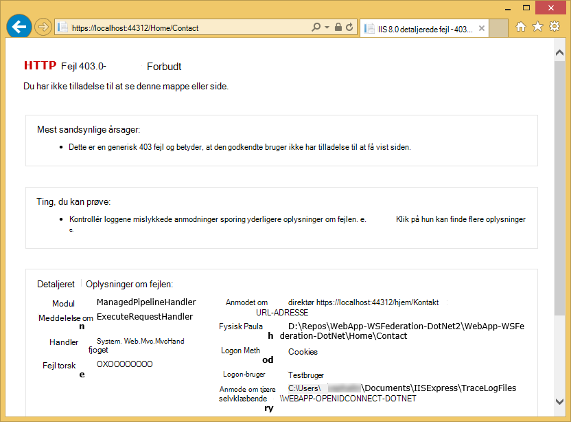

7. Publicere programmet til Azure App Service Web Apps igen, og teste funktionsmåden for programmet direkte.

## Oprette forbindelse til lokale data

En grund til, at du vil have til at implementere line of business programmet med AD FS i stedet for Azure Active Directory er overholdelse af problemer med at holde styr organisation data fra en lokal. Det kan også betyde, at din online i Azure skal have adgang til lokale-databaser, da du ikke kan bruge [SQL-Database](/services/sql-database/) som data niveau for din online.

Azure-App-tjenesten Web Apps understøtter adgang til lokale-databaser med en af følgende fremgangsmåder: [Hybrid forbindelser](../biztalk-services/integration-hybrid-connection-overview.md) og [Virtuelle netværk](web-sites-integrate-with-vnet.md). Se [Brug af VNET integration og Hybrid forbindelser til Azure App Service Web Apps](https://azure.microsoft.com/blog/2014/10/30/using-vnet-or-hybrid-conn-with-websites/)kan finde flere oplysninger.

## Yderligere ressourcer

- [Beskytte programmet med SSL og godkende-attribut](web-sites-dotnet-deploy-aspnet-mvc-app-membership-oauth-sql-database.md#protect-the-application-with-ssl-and-the-authorize-attribute)
- [Godkende med lokale Active Directory i din Azure-app](web-sites-authentication-authorization.md)
- [Oprette en Azure line of business-app med Azure Active Directory-godkendelse](web-sites-dotnet-lob-application-azure-ad.md)
- [Brug indstillingen lokale organisatoriske godkendelse (ADFS) med ASP.NET i Visual Studio 2013](http://www.cloudidentity.com/blog/2014/02/12/use-the-on-premises-organizational-authentication-option-adfs-with-asp-net-in-visual-studio-2013/)
- [Overføre et VS2013 webprojekt fra WIF til Katana](http://www.cloudidentity.com/blog/2014/09/15/MIGRATE-A-VS2013-WEB-PROJECT-FROM-WIF-TO-KATANA/)
- [Oversigt over Active Directory Federation Services](http://technet.microsoft.com/library/hh831502.aspx)
- [Specifikation af WS-Federation 1.1](http://download.boulder.ibm.com/ibmdl/pub/software/dw/specs/ws-fed/WS-Federation-V1-1B.pdf?S_TACT=105AGX04&S_CMP=LP)

