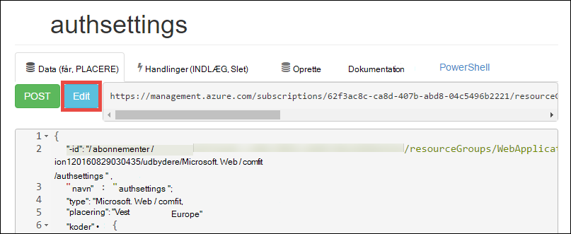

<properties 
    pageTitle="Oprette en Azure line of business-app med Azure Active Directory-godkendelse | Microsoft Azure" 
    description="Lær, hvordan du opretter en ASP.NET MVC line of business app i Azure App-tjeneste, der godkender med Azure Active Directory" 
    services="app-service\web, active-directory" 
    documentationCenter=".net" 
    authors="cephalin" 
    manager="wpickett" 
    editor=""/>

<tags 
    ms.service="app-service-web" 
    ms.devlang="dotnet" 
    ms.topic="article" 
    ms.tgt_pltfrm="na" 
    ms.workload="web" 
    ms.date="09/01/2016" 
    ms.author="cephalin"/>

# Oprette en Azure line of business-app med Azure Active Directory-godkendelse #

I denne artikel beskrives, hvordan du opretter en .NET line of business app i [Azure App Service Web Apps](http://go.microsoft.com/fwlink/?LinkId=529714) ved hjælp af den [godkendelse / godkendelse](../app-service/app-service-authentication-overview.md) funktion. Det kan også, hvordan du bruger [Azure Active Directory Graph API](https://msdn.microsoft.com/Library/Azure/Ad/Graph/api/api-catalog) til directory forespørgselsdata i programmet på computeren.

Azure Active Directory-lejeren, som du bruger kan være en kun Azure-mappe. Eller det kan være [synkroniseret med din lokalt Active Directory](../active-directory/active-directory-aadconnect.md) til at oprette en enkelt sign-on – oplevelse for medarbejdere, der er i det lokale miljø og andre placeringer. I denne artikel bruger standardmappen for din Azure-konto.

## Hvad vil du opbygge ##

Du kan bygge et enkelt program for line of business Opret-læse-opdatering-sletning (CRUD) i App-tjenesten Web Apps, Spor arbejdselementer med følgende funktioner:

- Godkender brugere mod Azure Active Directory
- Forespørgsler directory-brugere og grupper ved hjælp af [Azure Active Directory Graph API](http://msdn.microsoft.com/library/azure/hh974476.aspx)
- Brug af skabelonen ASP.NET MVC *Ingen godkendelse*

Hvis du skal bruge rollebaseret adgangskontrol (RBAC) til din line of business app i Azure, kan du se [Næste trin](#next).

## Hvad du bør ##

[AZURE.INCLUDE [free-trial-note](../../includes/free-trial-note.md)]

Du skal bruge følgende for at udføre dette selvstudium:

- En Azure Active Directory-lejer med brugere i forskellige grupper
- Tilladelser til at oprette programmer på Azure Active Directory-lejer
- Visual Studio 2013 opdatering 4 eller nyere
- [Azure SDK 2.8.1 eller nyere](https://azure.microsoft.com/downloads/)

## Oprette og anvende en web-app til Azure ##

1. Klik på **filer**fra Visual Studio, > **Ny** > **Project**.

2. Vælg **Webprogram ASP.NET**, Navngiv dit projekt, og klik på **OK**.

3. Vælg skabelonen, **MVC** og derefter ændre godkendelsen til **Ingen godkendelse**. Kontrollere **Host i skyen** er markeret, og klik på **OK**.

    

4. Klik på **Tilføj en konto** (og derefter **tilføje en konto** i rullemenuen) til at logge på din Azure-konto i dialogboksen **Opret App Service** .

5. Når du har logget på, skal du konfigurere din online. Oprette en ressourcegruppe og en ny App Service-plan ved at klikke på knappen respektive **Ny** . Klik på **Gennemse yderligere Azure tjenester** at fortsætte.

    

6. I fanen **tjenester** , skal du klikke på **+** at tilføje en SQL-Database til din app. 

    

7. **Konfigurere SQL-Database**, klik på **Ny** for at oprette en forekomst af SQL Server.

8. Konfigurere din SQL Server-forekomst i **Konfigurere SQL Server**. Klik derefter på **OK**, **OK**, og **Opret** for at starte oprettelsen app i Azure.

9. I **Azure App serviceaktivitet**, kan du se, hvor app oprettelse er færdig. Klik på * *Publicer &lt; *programnavn*> til denne online nu**og klik derefter på **Udgiv **. 

    Når Visual Studio afsluttes, skal åbnes Publicer app i browseren. 

    

## Konfigurere godkendelse og directory access

1. Log på [Azure-portalen](https://portal.azure.com).

2. Klik på **App-tjenester**fra menuen til venstre, > **&lt;*programnavn*>** > **godkendelse / godkendelse **.

    

3. Slå Azure Active Directory-godkendelse ved at klikke **på** > **Azure Active Directory** > **Express** > **OK**.

    

4. Klik på **Gem** i kommandolinjen.

    

    Når godkendelsesindstillingerne for er gemt, kan du prøve at navigere til din app igen i browseren. Standardindstillingerne gennemtvinge godkendelse for hele appen. Hvis du ikke allerede er logget, bliver du omdirigeret til en logonskærmen. Når du er logget på, kan du se din app sikret ved HTTPS. Derefter skal du aktivere adgang til directory-data. 

5. Gå til [Klassisk portal](https://manage.windowsazure.com).

6. Fra menuen til venstre, skal du klikke på **Active Directory** > **Default Directory** > **programmer** > **&lt;*programnavn*> **.

    

    Dette er det Azure Active Directory-program, App Service oprettet for dig at aktivere tilladelsen / godkendelse.

7. Klik på **brugere** og **grupper** for at sikre dig, at du har nogle brugere og grupper i kataloget. Hvis ikke, kan du oprette et par testbrugere og grupper.

    

7. Klik på **Konfigurer** for at konfigurere dette program.

8. Rul ned til sektionen **taster** , og Føj en nøgle ved at vælge en varighed. Derefter skal du klikke på **Delegerede tilladelser** , og vælg **læst directory data**. Klik på **Gem**.

    

8. Når dine indstillinger er gemt, Rul tilbage til afsnittet **taster** , og klik på knappen **Kopiér** for at kopiere tasten klient. 

    

    >[AZURE.IMPORTANT] Hvis du flytter nu væk fra denne side, kan du ikke få adgang til denne klient nøgle nogensinde igen.

9. Derefter skal du konfigurere din online med denne tast. Log på [Azure ressource Explorer](https://resources.azure.com) med din Azure-konto.

10. Klik på **Læse-og skriveadgang** for at foretage ændringer i Azure ressource Explorer øverst på siden.

    

11. Finde indstillinger for godkendelse for din app, findes i abonnementer > * *&lt;*subscriptionname*>** > **resourceGroups** > **&lt;*resourcegroupname*>** > **udbydere** > **Microsoft.Web** > **websteder** > **&lt;*programnavn*>** > **config** > **authsettings **.

12. Klik på **Rediger**.

    

13. I ruden redigering skal du angive den `clientSecret` og `additionalLoginParams` egenskaber på følgende måde.

        ...
        "clientSecret": "<client key from the Azure Active Directory application>",
        ...
        "additionalLoginParams": ["response_type=code id_token", "resource=https://graph.windows.net"],
        ...

14. Klik på **Placer** øverst for at sende dine ændringer.

    

14. Nu, hvis du vil teste, hvis du har tilladelsen tokenet til at få adgang til Azure Active Directory Graph API, ganske enkelt at navigere til * *https://&lt;*programnavn*>.azurewebsites.net/.auth/me** i din browser. Hvis du har konfigureret alt korrekt, skal du se de `access_token` egenskab i JSON svaret.

    Den `~/.auth/me` URL-sti administreres af App Service godkendelse / tilladelse til at give dig alle oplysninger, der er relateret til sessionen godkendt. Se [godkendelse og autorisation i Azure App Service](../app-service/app-service-authentication-overview.md)kan finde flere oplysninger.

    >[AZURE.NOTE] Den `access_token` har en udløbsperiode. Dog App Service godkendelse / godkendelse indeholder token Opdater funktionalitet med `~/.auth/refresh`. Du kan finde flere oplysninger om hvordan du bruger den,     [App Service Token Store](https://cgillum.tech/2016/03/07/app-service-token-store/).

Derefter skal gøre du noget nyttigt med directory-data.

## Føje line of business funktioner til din app

Nu skal oprette du en simpel CRUD arbejde elementer sporingen.  

5.  Oprette en klassefil med navnet WorkItem.cs i mappen ~\Models, og Erstat `public class WorkItem {...}` med følgende kode:

        using System.ComponentModel.DataAnnotations;

        public class WorkItem
        {
            [Key]
            public int ItemID { get; set; }
            public string AssignedToID { get; set; }
            public string AssignedToName { get; set; }
            public string Description { get; set; }
            public WorkItemStatus Status { get; set; }
        }

        public enum WorkItemStatus
        {
            Open,
            Investigating,
            Resolved,
            Closed
        }

7.  Opbyg projektet for at gøre den nye model, der er tilgængelige for stilladser logik i Visual Studio.

8.  Tilføje et nyt scaffolded element `WorkItemsController` til mappen ~\Controllers (højreklik på **enheder**, peg på **Tilføj**, og vælg **nyt scaffolded element**). 

9.  Vælg **MVC 5 Controller med visninger, ved hjælp af enhed Framework** , og klik på **Tilføj**.

10. Vælg den model, som du har oprettet, og klik derefter på **+** og derefter **tilføje** til at tilføje en datakontekst, og klik derefter på **Tilføj**.

    

14. ~\Views\WorkItems\Create.cshtml (et automatisk scaffolded element), find den `Html.BeginForm` hjælper metode og foretage de følgende fremhævede ændringer:  
<pre class="prettyprint">
    @modelWebApplication1.Models.WorkItem

    @{ViewBag.Title = &quot;oprette&quot;; }

    &lt;H2&gt;oprette&lt;/h2&gt;

    @using(Html.BeginForm (<mark>&quot;Opret&quot;, &quot;WorkItems&quot;, FormMethod.Post, ny {id = &quot;hovedformular&quot; }</mark>)) {@Html.AntiForgeryToken()

        &lt;div class=&quot;form-horizontal&quot;&gt;
            &lt;h4&gt;WorkItem&lt;/h4&gt;
            &lt;hr /&gt;
            @Html.ValidationSummary(true, &quot;&quot;, new { @class = &quot;text-danger&quot; })
            &lt;div class=&quot;form-group&quot;&gt;
                @Html.LabelFor(model =&gt; model.AssignedToID, htmlAttributes: new { @class = &quot;control-label col-md-2&quot; })
                &lt;div class=&quot;col-md-10&quot;&gt;
                    @Html.EditorFor(model =&gt; model.AssignedToID, new { htmlAttributes = new { @class = &quot;form-control&quot;<mark>, @type = &quot;hidden&quot;</mark> } })
                    @Html.ValidationMessageFor(model =&gt; model.AssignedToID, &quot;&quot;, new { @class = &quot;text-danger&quot; })
                &lt;/div&gt;
            &lt;/div&gt;

            &lt;div class=&quot;form-group&quot;&gt;
                @Html.LabelFor(model =&gt; model.AssignedToName, htmlAttributes: new { @class = &quot;control-label col-md-2&quot; })
                &lt;div class=&quot;col-md-10&quot;&gt;
                    @Html.EditorFor(model =&gt; model.AssignedToName, new { htmlAttributes = new { @class = &quot;form-control&quot; } })
                    @Html.ValidationMessageFor(model =&gt; model.AssignedToName, &quot;&quot;, new { @class = &quot;text-danger&quot; })
                &lt;/div&gt;
            &lt;/div&gt;

            &lt;div class=&quot;form-group&quot;&gt;
                @Html.LabelFor(model =&gt; model.Description, htmlAttributes: new { @class = &quot;control-label col-md-2&quot; })
                &lt;div class=&quot;col-md-10&quot;&gt;
                    @Html.EditorFor(model =&gt; model.Description, new { htmlAttributes = new { @class = &quot;form-control&quot; } })
                    @Html.ValidationMessageFor(model =&gt; model.Description, &quot;&quot;, new { @class = &quot;text-danger&quot; })
                &lt;/div&gt;
            &lt;/div&gt;

            &lt;div class=&quot;form-group&quot;&gt;
                @Html.LabelFor(model =&gt; model.Status, htmlAttributes: new { @class = &quot;control-label col-md-2&quot; })
                &lt;div class=&quot;col-md-10&quot;&gt;
                    @Html.EnumDropDownListFor(model =&gt; model.Status, htmlAttributes: new { @class = &quot;form-control&quot; })
                    @Html.ValidationMessageFor(model =&gt; model.Status, &quot;&quot;, new { @class = &quot;text-danger&quot; })
                &lt;/div&gt;
            &lt;/div&gt;

            &lt;div class=&quot;form-group&quot;&gt;
                &lt;div class=&quot;col-md-offset-2 col-md-10&quot;&gt;
                    &lt;input type=&quot;submit&quot; value=&quot;Create&quot; class=&quot;btn btn-default&quot;<mark> id=&quot;submit-button&quot;</mark> /&gt;
                &lt;/div&gt;
            &lt;/div&gt;
        &lt;/div&gt;
    }

    &lt;div&gt;
    @Html.ActionLink(&quot;tilbage til listen&quot;, &quot;indeks&quot;) &lt;/div    &gt;

    @sectionScripts { @Scripts.Render( &quot;~/bundles/jqueryval&quot;)     <mark> &lt;script&gt; 
     / / for person/gruppe datovælger kode varians maxResultsPerPage = 14;         varians input = document.getElementById (&quot;AssignedToName&quot;);

            // Access token from request header, and tenantID from claims identity
            var token = &quot;@Request.Headers[&quot;X-MS-TOKEN-AAD-ACCESS-TOKEN&quot;]&quot;;
            var tenant =&quot;@(System.Security.Claims.ClaimsPrincipal.Current.Claims
                            .Where(c => c.Type == &quot;http://schemas.microsoft.com/identity/claims/tenantid&quot;)
                            .Select(c => c.Value).SingleOrDefault())&quot;;

            var picker = new AadPicker(maxResultsPerPage, input, token, tenant);

            // Submit the selected user/group to be asssigned.
            $(&quot;#submit-button&quot;).click({ picker: picker }, function () {
                if (!picker.Selected())
                    return;
                $(&quot;#main-form&quot;).get()[0].elements[&quot;AssignedToID&quot;].value = picker.Selected().objectId;
            });
        &lt;/script&gt;</mark>
    }
    </pre>
    
    Bemærk, at `token` og `tenant` anvendes af den `AadPicker` objekt til at foretage Azure Active Directory Graph API opkald. Du skal tilføje `AadPicker` senere.   
    
    >[AZURE.NOTE] Du får lige så godt `token` og `tenant` fra klientsiden med `~/.auth/me`, men som ville være et yderligere servertyper opkald. Eksempel:
    >  
    >     $.ajax({
    >         dataType: "json",
    >         url: "/.auth/me",
    >         success: function (data) {
    >             var token = data[0].access_token;
    >             var tenant = data[0].user_claims
    >                             .find(c => c.typ === 'http://schemas.microsoft.com/identity/claims/tenantid')
    >                             .val;
    >         }
    >     });
    
15. Foretag de samme ændringer med ~ \Views\WorkItems\Edit.cshtml.

15. Den `AadPicker` objekt er defineret i et script, som du vil føje til projektet. Højreklik på mappen ~\Scripts, peg på **Føj**, og klik på **JavaScript-fil**. Skriv `AadPickerLibrary` for fil, og klik på **OK**.

16. Kopiér indholdet fra [her](https://raw.githubusercontent.com/cephalin/active-directory-dotnet-webapp-roleclaims/master/WebApp-RoleClaims-DotNet/Scripts/AadPickerLibrary.js) i ~ \Scripts\AadPickerLibrary.js.

    I scriptet på `AadPicker` objekt kalder [Azure Active Directory Graph API](https://msdn.microsoft.com/Library/Azure/Ad/Graph/api/api-catalog) til at søge efter brugere og grupper, der svarer til input.  

17. ~\Scripts\AadPickerLibrary.js bruger også [jQuery brugergrænseflade Autofuldførelse widget](https://jqueryui.com/autocomplete/). Så skal du føje jQuery brugergrænseflade til projektet. Højreklik på dit projekt i, og klik på **Administrer NuGet pakker**.

18. Klik på Gennemse i NuGet pakke Manager, Skriv **jquery brugergrænseflade** i søgepanelet, og på **jQuery.UI.Combined**.

    

19. I højre rude skal du klikke på **Installer**, og derefter klikke på **OK** for at fortsætte.

19. Åbne ~\App_Start\BundleConfig.cs og foretage de følgende fremhævede ændringer:  
    <pre class="prettyprint">
    offentlige statisk ugyldig RegisterBundles(BundleCollection bundles) {pakker. Tilføj (nye ScriptBundle (&quot;~/bundles/jquery&quot;). Medtage ( &quot;~/Scripts/jquery-{version}.js&quot;<mark>, &quot;~/Scripts/jquery-ui-{version}.js&quot;, &quot;~/Scripts/AadPickerLibrary.js&quot;</mark>));

        bundles.Add(new ScriptBundle(&quot;~/bundles/jqueryval&quot;).Include(
                    &quot;~/Scripts/jquery.validate*&quot;));

        // Use the development version of Modernizr to develop with and learn from. Then, when you&#39;re
        // ready for production, use the build tool at http://modernizr.com to pick only the tests you need.
        bundles.Add(new ScriptBundle(&quot;~/bundles/modernizr&quot;).Include(
                    &quot;~/Scripts/modernizr-*&quot;));

        bundles.Add(new ScriptBundle(&quot;~/bundles/bootstrap&quot;).Include(
                    &quot;~/Scripts/bootstrap.js&quot;,
                    &quot;~/Scripts/respond.js&quot;));

        bundles.Add(new StyleBundle(&quot;~/Content/css&quot;).Include(
                    &quot;~/Content/bootstrap.css&quot;,
                    &quot;~/Content/site.css&quot;<mark>,
                    &quot;~/Content/themes/base/jquery-ui.css&quot;</mark>));
    }
    </pre>

    Der er flere performant måder til at administrere JavaScript og CSS-filer i din app. Dog for enkel vil du kun til på pakker, der er indlæst med hver visning.

12. Til sidst i ~ \Global.asax, tilføje følgende linje af kode i den `Application_Start()` metode. `Ctrl`+`.`på de enkelte naming opløsning fejl at løse problemet.

        AntiForgeryConfig.UniqueClaimTypeIdentifier = ClaimTypes.NameIdentifier;
    
    > [AZURE.NOTE] Du skal bruge denne linje af kode, fordi MVC standardskabelonen bruger <code>[ValidateAntiForgeryToken]</code> udsmykning i nogle af handlingerne. På grund af funktionsmåden beskrevet ved [Bredgade Allen](https://twitter.com/BrockLAllen) på     [MVC 4, AntiForgeryToken og krav](http://brockallen.com/2012/07/08/mvc-4-antiforgerytoken-and-claims/) kan INDLÆGGET HTTP mislykkes mod forfalskning token datavalidering, fordi:

    > - Azure Active Directory sender ikke http://schemas.microsoft.com/accesscontrolservice/2010/07/claims/identityprovider, som kræves som standard af mod forfalskning tokenet.
    > - Hvis Azure Active Directory er mappe, der er synkroniseret med AD FS, sender AD FS tilliden som standard ikke http://schemas.microsoft.com/accesscontrolservice/2010/07/claims/identityprovider kravet enten, selvom du kan konfigurere AD FS for at sende kravet manuelt.

    > `ClaimTypes.NameIdentifies`Angiver kravet `http://schemas.xmlsoap.org/ws/2005/05/identity/claims/nameidentifier`, som leverer Azure Active Directory.  

20. Nu, publicere ændringerne. Højreklik på dit projekt, og klik på **Publicer**.

21. Klik på **Indstillinger**, Sørg for, at der er en forbindelsesstreng til SQL-Database skal du vælge **Opdater Database** til at ændre skema til din model, og klik på **Publicer**.

    

22. I browseren, gå til https://&lt;*programnavn*>.azurewebsites.net/workitems, og klik på **Opret ny**.

23. Klik i feltet **AssignedToName** . Du bør nu se brugere og grupper fra din Azure Active Directory-lejer på en rulleliste. Du kan skrive for at filtrere, eller du kan bruge den `Up` eller `Down` nøgle, eller klik for at vælge den bruger eller gruppe. 

    

24. Klik på **Opret** for at gemme ændringerne. Klik derefter på **Rediger** på den oprettede arbejdsopgave til opføre.

Congrats, kører du nu en line of business-app i Azure med directory access! Der er mange flere du kan gøre med Graph API. Se [Azure AD Graph API reference](https://msdn.microsoft.com/library/azure/ad/graph/api/api-catalog).

## Næste trin

Hvis du skal bruge rollebaseret adgangskontrol (RBAC) til din line of business app i azure, kan du se [WebApp-RoleClaims-DotNet](https://github.com/Azure-Samples/active-directory-dotnet-webapp-roleclaims) til en stikprøve af Azure Active Directory-gruppe. Det viser, hvordan du aktiverer roller for dit Azure Active Directory-program, og derefter godkende brugere med de `[Authorize]` udsmykning.

Hvis din line of business-app skal have adgang til lokale data, kan du se [Access lokale ressourcer ved hjælp af hybrid forbindelser i Azure App Service](web-sites-hybrid-connection-get-started.md).

## Yderligere ressourcer

- [Godkendelse og autorisation i Azure App Service](../app-service/app-service-authentication-overview.md)
- [Godkende med lokale Active Directory i din Azure-app](web-sites-authentication-authorization.md)
- [Oprette en line of business-app i Azure med AD FS-godkendelse](web-sites-dotnet-lob-application-adfs.md)
- [App Service Auth og Azure AD Graph API](https://cgillum.tech/2016/03/25/app-service-auth-aad-graph-api/)
- [Microsoft Azure Active Directory eksempler og dokumentation](https://github.com/AzureADSamples)
- [Azure Active Directory understøttes Token og Kræv typer](http://msdn.microsoft.com/library/azure/dn195587.aspx)

[Protect the Application with SSL and the Authorize Attribute]: web-sites-dotnet-deploy-aspnet-mvc-app-membership-oauth-sql-database.md#protect-the-application-with-ssl-and-the-authorize-attribute
