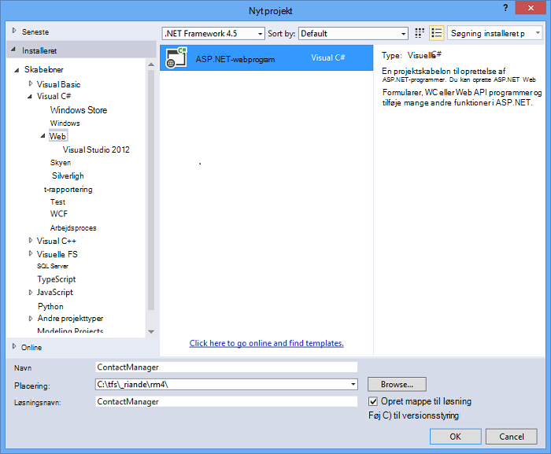
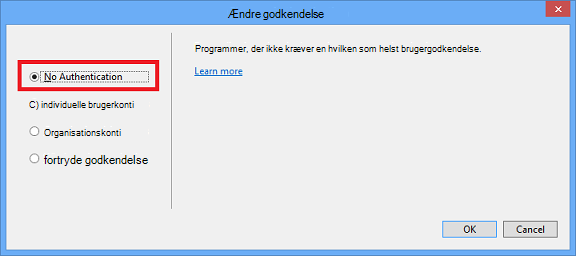
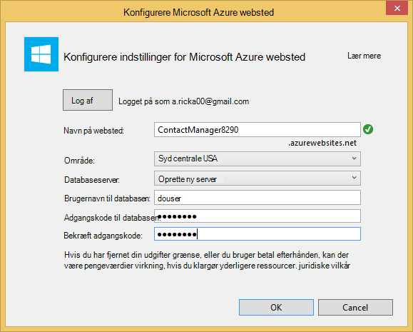
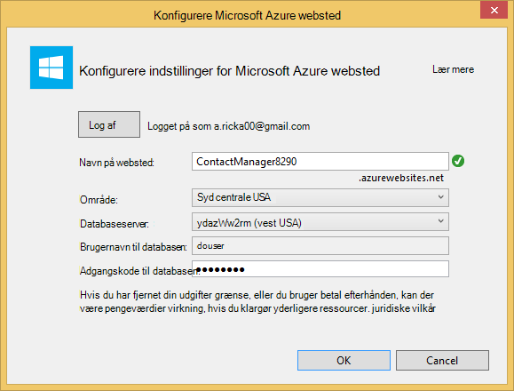
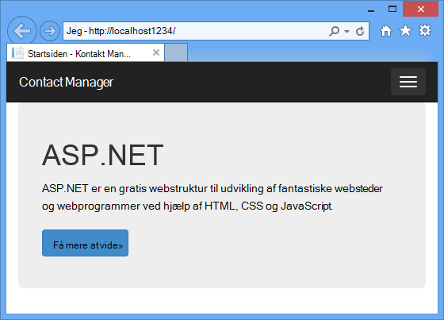
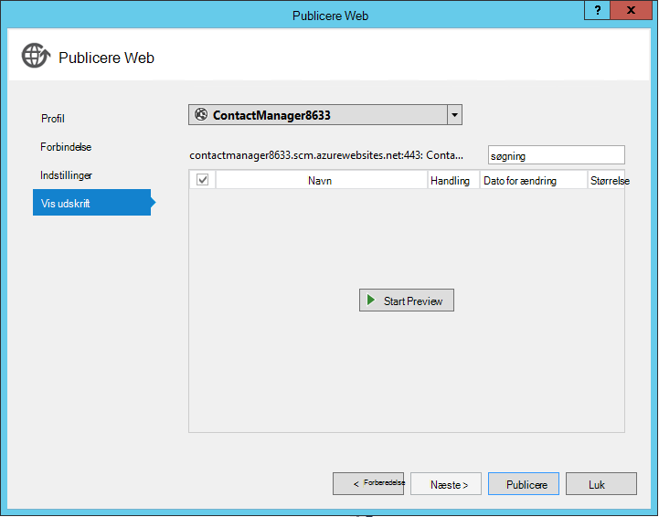
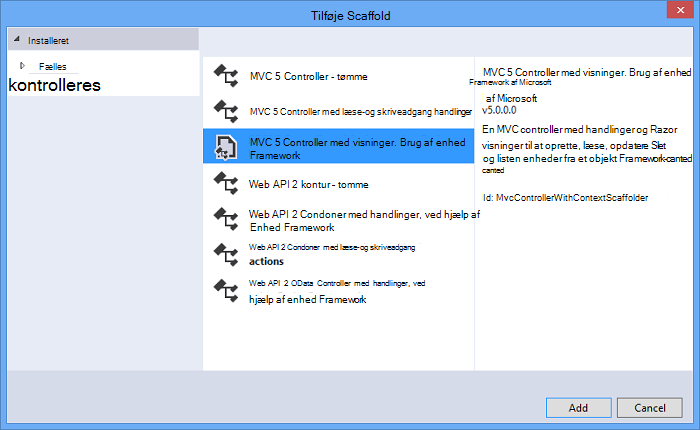
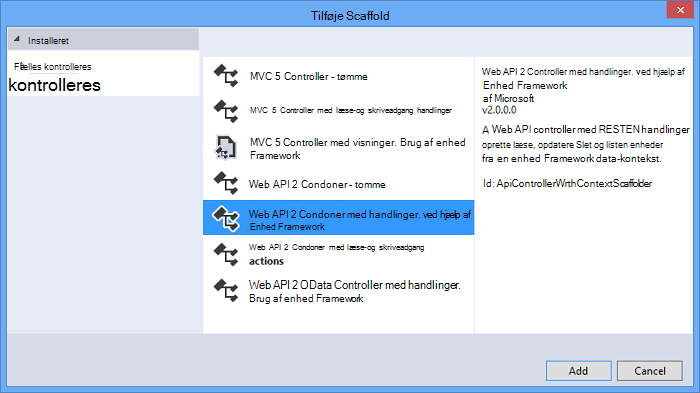
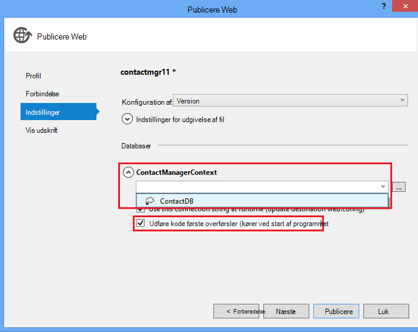

<properties 
    pageTitle="Oprette en REST-webtjeneste, ved hjælp af ASP.NET Web API og SQL-Database i Azure App Service" 
    description="Et selvstudium, som lærer du at installere en app, som bruger ASP.NET Web API til en Azure online ved hjælp af Visual Studio." 
    services="app-service\web" 
    documentationCenter=".net" 
    authors="Rick-Anderson" 
    writer="Rick-Anderson" 
    manager="wpickett" 
    editor=""/>

<tags 
    ms.service="app-service-web" 
    ms.workload="web" 
    ms.tgt_pltfrm="na" 
    ms.devlang="dotnet" 
    ms.topic="article" 
    ms.date="02/29/2016" 
    ms.author="riande"/>

# Oprette en REST-webtjeneste, ved hjælp af ASP.NET Web API og SQL-Database i Azure App Service

Dette selvstudium viser, hvordan du installerer en ASP.NET WebApp på en [Azure App Service](http://go.microsoft.com/fwlink/?LinkId=529714) ved hjælp af guiden Udgiv websted i Visual Studio 2013 eller Visual Studio 2013 Community Edition. 

Du kan åbne en Azure-konto gratis, og hvis du ikke allerede har Visual Studio 2013, installerer SDK automatisk Visual Studio-2013 for Web Express. Så kan du starte udvikling til Azure helt til gratis.

Dette selvstudium antages det, at du ikke har nogen foregående erfaring ved hjælp af Azure. I dette selvstudium er fuldført, har du en simpel WebApp op og kører i skyen.
 
Du kan lære følgende:

* Hvordan du aktiverer din computer og Azure udvikling ved at installere Azure SDK.
* Sådan oprettes et projekt i Visual Studio ASP.NET MVC 5 og publicere det i en Azure-app.
* Sådan bruges ASP.NET Web API til at aktivere Restful API-kald.
* Sådan bruges en SQL-database til at gemme data i Azure.
* Sådan udgive programmet opdateringer til Azure.

Du skal oprette en simpel liste over kontakter webprogram, der er bygget på ASP.NET MVC 5 og bruger ADO.NET enhed Framework for adgang til databaser. Følgende illustration viser det færdige program:

![skærmbillede af websted][intro001]

<!-- the next line produces the "Set up the development environment" section as see at http://azure.microsoft.com/documentation/articles/web-sites-dotnet-get-started/ -->
[AZURE.INCLUDE [create-account-and-websites-note](../../includes/create-account-and-websites-note.md)]

### Oprette projektet

1. Starte Visual Studio-2013.
1. Klik på **Nyt projekt**fra menuen **filer** .
3. I dialogboksen **Nyt projekt** Udvid **Visual C#** og vælg **websted** og derefter vælge **ASP.NET-webprogrammet**. Navngiv programmet **ContactManager** , og klik på **OK**.

    

1. Vælg skabelonen, **MVC** i dialogboksen **Nyt ASP.NET-projekt** , Markér **Web API** , og klik derefter på **Skift godkendelse**.

1. Klik på **Ingen godkendelse**i dialogboksen **Skift godkendelse** , og klik derefter på **OK**.

    

    Eksempelprogrammet, du opretter har ikke funktioner, som brugerne skal logge på. Oplysninger om, hvordan du implementere godkendelse og autorisation funktioner finder du i afsnittet [Næste trin](#nextsteps) i slutningen af dette selvstudium. 

1. Sørg for **Host i skyen** er markeret, og klik på **OK**i dialogboksen **Nyt ASP.NET-projekt** .

Hvis du ikke har tidligere har logget på Azure, bliver du bedt om at logge på.

1. Konfigurationsguiden foreslås et entydigt navn, der er baseret på *ContactManager* (se billedet nedenfor). Vælg et område i nærheden af dig. Du kan bruge [azurespeed.com](http://www.azurespeed.com/ "AzureSpeed.com") til at finde det laveste ventetid datacenter. 
2. Hvis du ikke har oprettet en databaseserver før, vælge **Opret ny server**skal du angive en databasebrugernavn og din adgangskode.

    

Hvis du har en databaseserver, skal du bruge det til at oprette en ny database. Databaseservere er en værdifuld ressource, og du generelt kan oprette flere databaser på den samme server til test og udvikling i stedet for oprettelse af en databaseserver per database. Kontrollér, at dit websted og database er i samme område.

### Angiv sidehoved og sidefod

1. Udvid mappen *Views\Shared* i **Solution Explorer**, og Åbn filen *_Layout.cshtml* .

    ![_Layout.cshtml i Solution Explorer][newapp004]

1. Erstat indholdet af filen *Views\Shared_Layout.cshtml* med følgende kode:

        <!DOCTYPE html>
        <html lang="en">
        <head>
            <meta charset="utf-8" />
            <title>@ViewBag.Title - Contact Manager</title>
            <link href="~/favicon.ico" rel="shortcut icon" type="image/x-icon" />
            <meta name="viewport" content="width=device-width" />
            @Styles.Render("~/Content/css")
            @Scripts.Render("~/bundles/modernizr")
        </head>
        <body>
            <header>
                

                    

                        
@Html.ActionLink("Contact Manager", "Index", "Home")

                    

                

            </header>
            

                @RenderSection("featured", required: false)
                <section class="content-wrapper main-content clear-fix">
                    @RenderBody()
                </section>
            

            <footer>
                

                    

                        
&copy; @DateTime.Now.Year - Contact Manager

                    

                

            </footer>
            @Scripts.Render("~/bundles/jquery")
            @RenderSection("scripts", required: false)
        </body>
        </html>
            
Markering over ændres appnavnet fra "Mine ASP.NET App" til "Contact Manager", og det fjerner kæderne til **Home**, **om** og **Kontakt**.

### Køre programmet lokalt

1. Tryk på CTRL + F5 for at køre programmet.
Startsiden program vises i standardbrowseren.
    

Dette er alt, skal du gøre nu til at oprette det program, du vil anvende til Azure. Senere skal du tilføje databasefunktioner.

## Installere programmet til Azure

1. Højreklik på projektet i **Solution Explorer** i Visual Studio, og vælg **Publicer** i kontekstmenuen.

    ![Publicere i project genvejsmenu][PublishVSSolution]

    Guiden **Udgiv websted** åbnes.

12. Klik på **Udgiv**.

Visual Studio begynder processen med at kopiere filerne til Azure-serveren. Vinduet **Output** viser, hvad installation er taget og rapporter installationen er fuldført.

14. Standardbrowseren åbnes automatisk til URL-adressen til webstedet udløst.

    Det program, du har oprettet kører nu i skyen.
    
    ![Til opgavelisten startsiden kører i Azure][rxz2]

## Føje en database til programmet

Derefter skal du opdatere MVC program tilladelse til at tilføje muligheden for at få vist og opdatere kontakter og gemme dataene i en database. Programmet anvender den enhed, som til at oprette databasen og til at læse og opdatere data i databasen.

### Tilføje datamodel klasser til kontakterne

Du starter ved at oprette en simpel datamodel i kode.

1. Højreklik på mappen modeller i **Solution Explorer**, skal du klikke på **Tilføj**, og klik derefter **klasse**.

    ![Tilføje klasse i modeller mappe genvejsmenu][adddb001]

2. Navngiv den nye klassefil *Contact.cs*i dialogboksen **Tilføj nyt element** , og klik derefter på **Tilføj**.

    ![Tilføje dialogboksen Nyt element][adddb002]

3. Erstat indholdet af filen Contacts.cs med følgende kode.

        using System.Globalization;
        namespace ContactManager.Models
        {
            public class Contact
            {
                public int ContactId { get; set; }
                public string Name { get; set; }
                public string Address { get; set; }
                public string City { get; set; }
                public string State { get; set; }
                public string Zip { get; set; }
                public string Email { get; set; }
                public string Twitter { get; set; }
                public string Self
                {
                    get { return string.Format(CultureInfo.CurrentCulture,
                         "api/contacts/{0}", this.ContactId); }
                    set { }
                }
            }
        }

Klassen **kontakte** definerer de data, du vil gemme til hver af kontakter, samt en primær nøgle, kontaktperson-id, der skal bruges af databasen. Du kan få flere oplysninger om datamodeller i sektionen [Næste trin](#nextsteps) i slutningen af dette selvstudium.

### Oprette websider, der aktiverer app-brugere til at arbejde med kontakter

ASP.NET MVC funktionen stilladser kan automatisk oprette kode, som udfører oprette, læse, opdatere og slette (CRUD) handlinger.

## Tilføje en Controller og en visning for dataene

1. I **Solution Explorer**skal du udvide mappen enheder.

3. Opbygge projektet **(Ctrl + Shift + B)**. (Du skal oprette projektet inden du bruger stilladser ordning.) 

4. Højreklik på mappen enheder og klikke på **Tilføj**, og klik derefter på **Controller**.

    ![Tilføje Controller i genvejsmenuen for enheder mappe][addcode001]

1. Vælg **MVC Controller med visninger, ved hjælp af enhed Framework** , og klik på **Tilføj**i dialogboksen **Tilføj Scaffold** .

 

6. Angiv navnet på controller til **HomeController**. Vælg **Kontakt** som klasse model. Klik på knappen **Ny datakontekst** og acceptere standardindstillingen "ContactManager.Models.ContactManagerContext" til den **nye kontekst datatype**. Klik på **Tilføj**.

    En dialogboks beder dig om: "en fil med navnet HomeController allerede afsluttet. Vil du erstatte det? ". Klik på **Ja**. Vi overskrive den Home Controller, som er oprettet med det nye projekt. Vi bruger den nye Home Controller til vores liste over kontakter.

    Visual Studio opretter controller metoder og visninger for CRUD databasehandlinger for **Kontakt** objekter.

## Aktivere overførsler, oprette databasen, tilføje eksempeldata og en ved initialisering af data ##

Den næste opgave er at aktivere funktionen [Kode første overførsler](http://curah.microsoft.com/55220) for at oprette den database, der er baseret på den datamodel, du har oprettet.

1. Vælg **Bibliotek Package Manager** og derefter **Pakke Manager-konsollen**i menuen **Funktioner** .

    ![Pakke Manager-konsollen i menuen Funktioner][addcode008]

2. Skriv følgende kommando i vinduet **Pakke Manager-konsollen** :

        enable-migrations 
  
    Kommandoen **Aktivér overførsler** opretter en *overførsler* mappe og vises i den pågældende mappe en *Configuration.cs* -fil, som du kan redigere for at konfigurere overførsler. 

2. Skriv følgende kommando i vinduet **Pakke Manager-konsollen** :

        add-migration Initial

    Kommandoen **Tilføj overførsel indledende** genererer en klasse, kaldet ** &lt;date_stamp&gt;indledende** , der opretter databasen. Den første parameter ( *indledende* ) er vilkårlig og bruges til at oprette navnet på filen. Du kan se de nye klasse-filer i **Solution Explorer**.

    Metoden **op** opretter tabellen kontaktpersoner på **første** årgang, og metoden **ned** (bruges, når du vil vende tilbage til den forrige tilstand) slipper den.

3. Åbn filen *Migrations\Configuration.cs* . 

4. Tilføj følgende navneområder. 

         using ContactManager.Models;

5. Erstat metoden *frø* med følgende kode:
        
        protected override void Seed(ContactManager.Models.ContactManagerContext context)
        {
            context.Contacts.AddOrUpdate(p => p.Name,
               new Contact
               {
                   Name = "Debra Garcia",
                   Address = "1234 Main St",
                   City = "Redmond",
                   State = "WA",
                   Zip = "10999",
                   Email = "debra@example.com",
                   Twitter = "debra_example"
               },
                new Contact
                {
                    Name = "Thorsten Weinrich",
                    Address = "5678 1st Ave W",
                    City = "Redmond",
                    State = "WA",
                    Zip = "10999",
                    Email = "thorsten@example.com",
                    Twitter = "thorsten_example"
                },
                new Contact
                {
                    Name = "Yuhong Li",
                    Address = "9012 State st",
                    City = "Redmond",
                    State = "WA",
                    Zip = "10999",
                    Email = "yuhong@example.com",
                    Twitter = "yuhong_example"
                },
                new Contact
                {
                    Name = "Jon Orton",
                    Address = "3456 Maple St",
                    City = "Redmond",
                    State = "WA",
                    Zip = "10999",
                    Email = "jon@example.com",
                    Twitter = "jon_example"
                },
                new Contact
                {
                    Name = "Diliana Alexieva-Bosseva",
                    Address = "7890 2nd Ave E",
                    City = "Redmond",
                    State = "WA",
                    Zip = "10999",
                    Email = "diliana@example.com",
                    Twitter = "diliana_example"
                }
                );
        }

    Denne ovenstående kode til starte databasen med kontaktoplysningerne. Du kan finde flere oplysninger om forhåndsudfyldning databasen, [fejlfinding enhed Framework (ELEMENTÆRFILEN) DBs](http://blogs.msdn.com/b/rickandy/archive/2013/02/12/seeding-and-debugging-entity-framework-ef-dbs.aspx).

1. Angiv kommandoen i **Pakke Manager-konsollen** :

        update-database

    ![Pakke Manager-konsollen kommandoer][addcode009]

    **Opdater database** kører den første migrering, som opretter databasen. Som standard oprettes databasen som en SQL Server Express LocalDB database.

1. Tryk på CTRL + F5 for at køre programmet. 

Programmet viser oprindelsesdata og Rediger, detaljer og Slet hyperlinks.

![MVC visning af data][rxz3]

## Rediger visningen

1. Åbn filen *Views\Home\Index.cshtml* . I næste trin erstatter vi oprettede markeringer med kode, der bruger [jQuery](http://jquery.com/) og [Knockout.js](http://knockoutjs.com/). Denne nye kode henter listen over kontaktpersoner fra ved hjælp af web API og JSON og derefter binder kontaktdata til Brugergrænsefladen ved hjælp af knockout.js. Yderligere oplysninger finder du i afsnittet [Næste trin](#nextsteps) i slutningen af dette selvstudium. 

2. Erstat indholdet af filerne med følgende kode.

        @model IEnumerable<ContactManager.Models.Contact>
        @{
            ViewBag.Title = "Home";
        }
        @section Scripts {
            @Scripts.Render("~/bundles/knockout")
            
        }
        <ul id="contacts" data-bind="foreach: contacts">
            <li class="ui-widget-content ui-corner-all">
                <h1 data-bind="text: Name" class="ui-widget-header"></h1>
                

                

                    ,
                    
                    
                

                

                
Email?

                

                
Twitter?

                
<a data-bind="attr: { href: Self }, click: $root.removeContact" class="removeContact ui-state-default ui-corner-all">Remove</a>

            </li>
        </ul>
        <form id="addContact" data-bind="submit: addContact">
            <fieldset>
                <legend>Add New Contact</legend>
                <ol>
                    <li>
                        <label for="Name">Name</label>
                        <input type="text" name="Name" />
                    </li>
                    <li>
                        <label for="Address">Address</label>
                        <input type="text" name="Address" >
                    </li>
                    <li>
                        <label for="City">City</label>
                        <input type="text" name="City" />
                    </li>
                    <li>
                        <label for="State">State</label>
                        <input type="text" name="State" />
                    </li>
                    <li>
                        <label for="Zip">Zip</label>
                        <input type="text" name="Zip" />
                    </li>
                    <li>
                        <label for="Email">E-mail</label>
                        <input type="text" name="Email" />
                    </li>
                    <li>
                        <label for="Twitter">Twitter</label>
                        <input type="text" name="Twitter" />
                    </li>
                </ol>
                <input type="submit" value="Add" />
            </fieldset>
        </form>

3. Højreklik på mappen indhold, og klik på **Tilføj**, og klik derefter på **Nyt element...**.

    ![Tilføje typografiark i indhold mappe genvejsmenu][addcode005]

4. Angiv **typografi** i øverste højre søgefeltet i dialogboksen **Tilføj nyt element** , og vælg derefter **Typografiark**.
    ![Tilføje dialogboksen Nyt element][rxStyle]

5. Navngiv filen *Contacts.css* , og klik på **Tilføj**. Erstat indholdet af filerne med følgende kode.
    
        .column {
            float: left;
            width: 50%;
            padding: 0;
            margin: 5px 0;
        }
        form ol {
            list-style-type: none;
            padding: 0;
            margin: 0;
        }
        form li {
            padding: 1px;
            margin: 3px;
        }
        form input[type="text"] {
            width: 100%;
        }
        #addContact {
            width: 300px;
            float: left;
            width:30%;
        }
        #contacts {
            list-style-type: none;
            margin: 0;
            padding: 0;
            float:left;
            width: 70%;
        }
        #contacts li {
            margin: 3px 3px 3px 0;
            padding: 1px;
            float: left;
            width: 300px;
            text-align: center;
            background-image: none;
            background-color: #F5F5F5;
        }
        #contacts li h1
        {
            padding: 0;
            margin: 0;
            background-image: none;
            background-color: Orange;
            color: White;
            font-family: Trebuchet MS, Tahoma, Verdana, Arial, sans-serif;
        }
        .removeContact, .viewImage
        {
            padding: 3px;
            text-decoration: none;
        }

    Vi bruger denne typografiark for layout, farver og typografier, der anvendes i appen kontaktpersoner manager.

6. Åbn filen *App_Start\BundleConfig.cs* .

7. Tilføj følgende kode for at registrere [udskæring](http://knockoutjs.com/index.html "KO") plug-in'et.

        bundles.Add(new ScriptBundle("~/bundles/knockout").Include(
                    "~/Scripts/knockout-{version}.js"));
    Dette eksempel bruger udskæring til at forenkle dynamiske JavaScript-kode, der håndterer skærmen skabeloner.

8. Rediger indhold/css-posten for at registrere *contacts.css* typografiark. Ændre følgende linje:

                 bundles.Add(new StyleBundle("~/Content/css").Include(
                   "~/Content/bootstrap.css",
                   "~/Content/site.css"));
Hvis du vil:

        bundles.Add(new StyleBundle("~/Content/css").Include(
                   "~/Content/bootstrap.css",
                   "~/Content/contacts.css",
                   "~/Content/site.css"));

1. Kør følgende kommando for at installere udskæring i pakke Manager-konsollen.

        Install-Package knockoutjs

## Tilføje en controller for grænsefladen Web API Restful

1. Højreklik på enheder i **Solution Explorer**, og klik på **Tilføj** og derefter **Controller...** 

1. Angiv **Web API 2 Controller med handlinger, ved hjælp af enhed Framework** , og klik derefter på **Tilføj**i dialogboksen **Tilføj Scaffold** .

    

4. Skriv "ContactsController" som navnet på din controller i dialogboksen **Tilføj Controller** . Vælg "Kontakt (ContactManager.Models)" i **Model klasse**.  Beholde standardværdien i **Data kontekst klasse**. 

6. Klik på **Tilføj**.

### Køre programmet lokalt

1. Tryk på CTRL + F5 for at køre programmet.

    ![Indeks-side][intro001]

2. Angiv en kontakt, og klik på **Tilføj**. Appen vender tilbage til startsiden og viser den kontakt, du har angivet.

    ![Indeksside med listen opgaveelementer][addwebapi004]

3. Føje **/api/contacts** til URL-adressen i browseren.

    Den resulterende URL-adresse vil minde om api-http://localhost:1234/kontakter. Den RESTful web API, du har tilføjet returnerer de lagrede kontakter. Firefox og Chrome vises dataene i XML-format.

    ![Indeksside med listen opgaveelementer][rxFFchrome]
    

    IE beder dig om at åbne eller gemme kontakterne.

    ![Web API gemme dialogboksen][addwebapi006]
    
    
    Du kan åbne de returnerede kontakter i Notesblok eller i en browser.
    
    Dette output kan blive brugt i et andet program som mobile webside eller et program.

    ![Web API gemme dialogboksen][addwebapi007]

    **Sikkerhedsadvarsel**: på dette tidspunkt dit program er usikker og udsatte for CSRF angreb. Senere i selvstudiet, vi fjerner sikkerhedsrisikoen. Finde flere oplysninger under [forhindre på tværs af websteder anmode om forfalskning (CSRF) angreb][prevent-csrf-attacks].
## Føje XSRF beskyttelse

Anmodning om på tværs af websteder forfalskning (også kendt som XSRF eller CSRF) er et angreb mod web-hostede programmer, hvorved et ondsindet websted kan påvirke interaktionen mellem en klient-browser og et websted, der er tillid til af denne browser. Disse angreb er gjort muligt, fordi webbrowsere sender godkendelsestokens automatisk med alle anmodninger til et websted. Vedtaget eksempel er en godkendelse cookie, som ASP. Nettooversigts Forms Authentication brugertilladelse. Websteder, der bruger en fast godkendelsesmetoden (som Windows-godkendelse, Basic og så videre) kan dog målrettes ved disse angreb.

Et XSRF angreb er adskiller sig fra et phishing-angreb. Phishing-angreb kræver interaktion fra offer. Et ondsindet websted vil efterligne webstedet mål i et phishing-angreb og offer lade dig narre til at sende følsomme oplysninger til hackeren. I et XSRF angreb, der ikke ofte ingen interaktion nødvendige fra offer. I stedet hackeren stole på browseren automatisk at sende alle relevante cookies til webstedet destination.

Se [Åbne Web Application sikkerhed projekt](https://www.owasp.org/index.php/Main_Page) (OWASP) [XSRF](https://www.owasp.org/index.php/Cross-Site_Request_Forgery_(CSRF))kan finde flere oplysninger.

1. Højre **ContactManager** project i **Solution Explorer**, og klik på **Tilføj** , og klik derefter på **klassen**.

2. Navngiv filen *ValidateHttpAntiForgeryTokenAttribute.cs* , og Føj følgende kode:

        using System;
        using System.Collections.Generic;
        using System.Linq;
        using System.Net;
        using System.Net.Http;
        using System.Web.Helpers;
        using System.Web.Http.Controllers;
        using System.Web.Http.Filters;
        using System.Web.Mvc;
        namespace ContactManager.Filters
        {
            public class ValidateHttpAntiForgeryTokenAttribute : AuthorizationFilterAttribute
            {
                public override void OnAuthorization(HttpActionContext actionContext)
                {
                    HttpRequestMessage request = actionContext.ControllerContext.Request;
                    try
                    {
                        if (IsAjaxRequest(request))
                        {
                            ValidateRequestHeader(request);
                        }
                        else
                        {
                            AntiForgery.Validate();
                        }
                    }
                    catch (HttpAntiForgeryException e)
                    {
                        actionContext.Response = request.CreateErrorResponse(HttpStatusCode.Forbidden, e);
                    }
                }
                private bool IsAjaxRequest(HttpRequestMessage request)
                {
                    IEnumerable<string> xRequestedWithHeaders;
                    if (request.Headers.TryGetValues("X-Requested-With", out xRequestedWithHeaders))
                    {
                        string headerValue = xRequestedWithHeaders.FirstOrDefault();
                        if (!String.IsNullOrEmpty(headerValue))
                        {
                            return String.Equals(headerValue, "XMLHttpRequest", StringComparison.OrdinalIgnoreCase);
                        }
                    }
                    return false;
                }
                private void ValidateRequestHeader(HttpRequestMessage request)
                {
                    string cookieToken = String.Empty;
                    string formToken = String.Empty;
                    IEnumerable<string> tokenHeaders;
                    if (request.Headers.TryGetValues("RequestVerificationToken", out tokenHeaders))
                    {
                        string tokenValue = tokenHeaders.FirstOrDefault();
                        if (!String.IsNullOrEmpty(tokenValue))
                        {
                            string[] tokens = tokenValue.Split(':');
                            if (tokens.Length == 2)
                            {
                                cookieToken = tokens[0].Trim();
                                formToken = tokens[1].Trim();
                            }
                        }
                    }
                    AntiForgery.Validate(cookieToken, formToken);
                }
            }
        }

1. Tilføj følgende *ved hjælp af* sætning til kontrakter controlleren, så du har adgang til attributten **[ValidateHttpAntiForgeryToken]** .

        using ContactManager.Filters;

1. Føje attributten **[ValidateHttpAntiForgeryToken]** til indlæg metoder til **ContactsController** til at beskytte mod XSRF trusler. Du vil føje det til metoderne "PutContact", "PostContact" og **DeleteContact** handling.

        [ValidateHttpAntiForgeryToken]
            public IHttpActionResult PutContact(int id, Contact contact)
            {

1. Opdater afsnittet *Scripts* i filen *Views\Home\Index.cshtml* medtage koden for at få XSRF tokens.

         @section Scripts {
            @Scripts.Render("~/bundles/knockout")
            
         }

## Udgive opdateringen til Azure og SQL-Database

Hvis du vil publicere programmet, skal gentage du denne procedure, du har fulgt tidligere.

1. Højreklik på projektet i **Solution Explorer**, og vælg **Publicer**.

    ![Publicere][rxP]

5. Klik på fanen **Indstillinger** .
    

1. Klik på ikonet **v** for at ændre *Remote forbindelsesstreng* til forbindelsesstrengen for databasen kontakter under **ContactsManagerContext(ContactsManagerContext)**. Klik på **ContactDB**.

    

7. Markér afkrydsningsfeltet for **Udføre kode første overførsler (kører ved start af programmet)**.

1. Klik på **Næste** , og klik derefter på **Vis udskrift**. Visual Studio viser en liste over de filer, der er tilføjet eller opdateret.

8. Klik på **Udgiv**.
Når installationen er fuldført, åbnes browseren til startsiden af programmet.

    ![Indeksside med ingen kontaktpersoner][intro001]

    Visual Studio publicere processen automatisk konfigureret forbindelsesstrengen i udløst *Web.config* -filen til at pege på SQL-databasen. Det også er konfigureret kode første overførsler for at opgradere automatisk databasen til den nyeste version første gang programmet får adgang til databasen efter installation.

    Som et resultat af denne konfiguration oprettet kode første databasen ved at køre koden i den **første** klasse, du oprettede tidligere. Det gjorde første gang programmet forsøgte at få adgang til databasen efter installation.

9. Angiv en kontakt, som du gjorde, da du kørte app lokalt, for at bekræfte, at databasen installation lykkedes.

Når du ser, at det element, du angiver gemmes og vises på siden for kontakter, ved du, at der er blevet gemt i databasen.

![Indeksside med kontakter][addwebapi004]

Programmet er nu aktiveret i skyen, bruger SQL-Database til at gemme dataene. Når du er færdig med at teste programmet i Azure, kan du slette den. Programmet er offentlig og har ikke en metode til at begrænse adgangen.

>[AZURE.NOTE] Hvis du vil komme i gang med Azure App Service før tilmelding til en Azure-konto, skal du gå til [Prøve App Service](http://go.microsoft.com/fwlink/?LinkId=523751), hvor du straks kan oprette en forbigående starter WebApp i App-tjeneste. Ingen kreditkort, der kræves. ingen forpligtelser.

## Næste trin

Et reelt tal til computeren, vil kræve godkendelse og godkendelse, og du vil bruge databasen medlemskab hertil. [Installere en Secure ASP.NET MVC program med OAuth, medlemskab og SQL-Database](web-sites-dotnet-deploy-aspnet-mvc-app-membership-oauth-sql-database.md) selvstudiet er baseret på dette selvstudium og viser, hvordan du installerer et webprogram med medlemskab databasen.

En anden måde at gemme data i et Azure-program er at bruge Azure-lager, som giver lagring af ikke-relationelle data i form af BLOB og tabeller. Følgende links giver flere oplysninger om Web API, ASP.NET MVC og vinduet Azure.
 

* [Introduktion til enhed Framework ved hjælp af MVC][EFCodeFirstMVCTutorial]
* [Introduktion til ASP.NET MVC 5](http://www.asp.net/mvc/tutorials/mvc-5/introduction/getting-started)
* [Dine første ASP.NET Web API](http://www.asp.net/web-api/overview/getting-started-with-aspnet-web-api/tutorial-your-first-web-api)
* [Fejlfinding WAWS](web-sites-dotnet-troubleshoot-visual-studio.md)

Dette selvstudium og eksempelprogrammet blev skrevet af [Rick Westermann](http://blogs.msdn.com/b/rickandy/) (Twitter- [@RickAndMSFT](https://twitter.com/RickAndMSFT)) med hjælp fra Tom Dykstra og Barry Dorrans (Twitter- [@blowdart](https://twitter.com/blowdart)). 

Skal du forbedret Forlad feedback på hvad du synes godt om eller du gerne vil se, ikke kun om selvstudiet selve, men også om de produkter, det viser. Din feedback hjælper os med at prioritere forbedringer. Vi er især interesseret i at finde ud af, hvor meget rente, der er i mere automatisering for processen til konfiguration og installation af medlemskab databasen. 

## Hvad er ændret
* Finde en vejledning til ændring fra websteder til App-tjenesten: [Azure App Service og dets indvirkning på eksisterende Azure Services](http://go.microsoft.com/fwlink/?LinkId=529714)

<!-- bookmarks -->
[Add an OAuth Provider]: #addOauth
[Add Roles to the Membership Database]:#mbrDB
[Create a Data Deployment Script]:#ppd
[Update the Membership Database]:#ppd2
[setupdbenv]: #bkmk_setupdevenv
[setupwindowsazureenv]: #bkmk_setupwindowsazure
[createapplication]: #bkmk_createmvc4app
[deployapp1]: #bkmk_deploytowindowsazure1
[adddb]: #bkmk_addadatabase
[addcontroller]: #bkmk_addcontroller
[addwebapi]: #bkmk_addwebapi
[deploy2]: #bkmk_deploydatabaseupdate

<!-- links -->
[EFCodeFirstMVCTutorial]: http://www.asp.net/mvc/tutorials/getting-started-with-ef-using-mvc/creating-an-entity-framework-data-model-for-an-asp-net-mvc-application
[dbcontext-link]: http://msdn.microsoft.com/library/system.data.entity.dbcontext(v=VS.103).aspx

<!-- images-->
[rxE]: ./media/web-sites-dotnet-rest-service-aspnet-api-sql-database/rxE.png
[rxP]: ./media/web-sites-dotnet-rest-service-aspnet-api-sql-database/rxP.png
[rx22]: ./media/web-sites-dotnet-rest-service-aspnet-api-sql-database/
[rxb2]: ./media/web-sites-dotnet-rest-service-aspnet-api-sql-database/rxb2.png
[rxz]: ./media/web-sites-dotnet-rest-service-aspnet-api-sql-database/rxz.png
[rxzz]: ./media/web-sites-dotnet-rest-service-aspnet-api-sql-database/rxzz.png
[rxz2]: ./media/web-sites-dotnet-rest-service-aspnet-api-sql-database/rxz2.png
[rxz3]: ./media/web-sites-dotnet-rest-service-aspnet-api-sql-database/rxz3.png
[rxStyle]: ./media/web-sites-dotnet-rest-service-aspnet-api-sql-database/rxStyle.png
[rxz4]: ./media/web-sites-dotnet-rest-service-aspnet-api-sql-database/rxz4.png
[rxz44]: ./media/web-sites-dotnet-rest-service-aspnet-api-sql-database/rxz44.png
[rxNewCtx]: ./media/web-sites-dotnet-rest-service-aspnet-api-sql-database/rxNewCtx.png
[rxPrevDB]: ./media/web-sites-dotnet-rest-service-aspnet-api-sql-database/rxPrevDB.png
[rxOverwrite]: ./media/web-sites-dotnet-rest-service-aspnet-api-sql-database/rxOverwrite.png
[rxPWS]: ./media/web-sites-dotnet-rest-service-aspnet-api-sql-database/rxPWS.png
[rxNewCtx]: ./media/web-sites-dotnet-rest-service-aspnet-api-sql-database/rxNewCtx.png
[rxAddApiController]: ./media/web-sites-dotnet-rest-service-aspnet-api-sql-database/rxAddApiController.png
[rxFFchrome]: ./media/web-sites-dotnet-rest-service-aspnet-api-sql-database/rxFFchrome.png
[intro001]: ./media/web-sites-dotnet-rest-service-aspnet-api-sql-database/dntutmobil-intro-finished-web-app.png
[rxCreateWSwithDB]: ./media/web-sites-dotnet-rest-service-aspnet-api-sql-database/rxCreateWSwithDB.png
[setup007]: ./media/web-sites-dotnet-rest-service-aspnet-api-sql-database/dntutmobile-setup-azure-site-004.png
[setup009]: ../Media/dntutmobile-setup-azure-site-006.png
[newapp002]: ./media/web-sites-dotnet-rest-service-aspnet-api-sql-database/dntutmobile-createapp-002.png
[newapp004]: ./media/web-sites-dotnet-rest-service-aspnet-api-sql-database/dntutmobile-createapp-004.png
[firsdeploy007]: ./media/web-sites-dotnet-rest-service-aspnet-api-sql-database/dntutmobile-deploy1-publish-005.png
[firsdeploy009]: ./media/web-sites-dotnet-rest-service-aspnet-api-sql-database/dntutmobile-deploy1-publish-007.png
[adddb001]: ./media/web-sites-dotnet-rest-service-aspnet-api-sql-database/dntutmobile-adddatabase-001.png
[adddb002]: ./media/web-sites-dotnet-rest-service-aspnet-api-sql-database/dntutmobile-adddatabase-002.png
[addcode001]: ./media/web-sites-dotnet-rest-service-aspnet-api-sql-database/dntutmobile-controller-add-context-menu.png
[addcode002]: ./media/web-sites-dotnet-rest-service-aspnet-api-sql-database/dntutmobile-controller-add-controller-dialog.png
[addcode004]: ./media/web-sites-dotnet-rest-service-aspnet-api-sql-database/dntutmobile-controller-modify-index-context.png
[addcode005]: ./media/web-sites-dotnet-rest-service-aspnet-api-sql-database/dntutmobile-controller-add-contents-context-menu.png
[addcode007]: ./media/web-sites-dotnet-rest-service-aspnet-api-sql-database/dntutmobile-controller-modify-bundleconfig-context.png
[addcode008]: ./media/web-sites-dotnet-rest-service-aspnet-api-sql-database/dntutmobile-migrations-package-manager-menu.png
[addcode009]: ./media/web-sites-dotnet-rest-service-aspnet-api-sql-database/dntutmobile-migrations-package-manager-console.png
[addwebapi004]: ./media/web-sites-dotnet-rest-service-aspnet-api-sql-database/dntutmobile-webapi-added-contact.png
[addwebapi006]: ./media/web-sites-dotnet-rest-service-aspnet-api-sql-database/dntutmobile-webapi-save-returned-contacts.png
[addwebapi007]: ./media/web-sites-dotnet-rest-service-aspnet-api-sql-database/dntutmobile-webapi-contacts-in-notepad.png
[Add XSRF Protection]: #xsrf
[WebPIAzureSdk20NetVS12]: ./media/web-sites-dotnet-rest-service-aspnet-api-sql-database/WebPIAzureSdk20NetVS12.png
[Add XSRF Protection]: #xsrf
[ImportPublishSettings]: ./media/web-sites-dotnet-rest-service-aspnet-api-sql-database/ImportPublishSettings.png
[ImportPublishProfile]: ./media/web-sites-dotnet-rest-service-aspnet-api-sql-database/ImportPublishProfile.png
[PublishVSSolution]: ./media/web-sites-dotnet-rest-service-aspnet-api-sql-database/PublishVSSolution.png
[ValidateConnection]: ./media/web-sites-dotnet-rest-service-aspnet-api-sql-database/ValidateConnection.png
[WebPIAzureSdk20NetVS12]: ./media/web-sites-dotnet-rest-service-aspnet-api-sql-database/WebPIAzureSdk20NetVS12.png
[prevent-csrf-attacks]: http://www.asp.net/web-api/overview/security/preventing-cross-site-request-forgery-(csrf)-attacks
 
