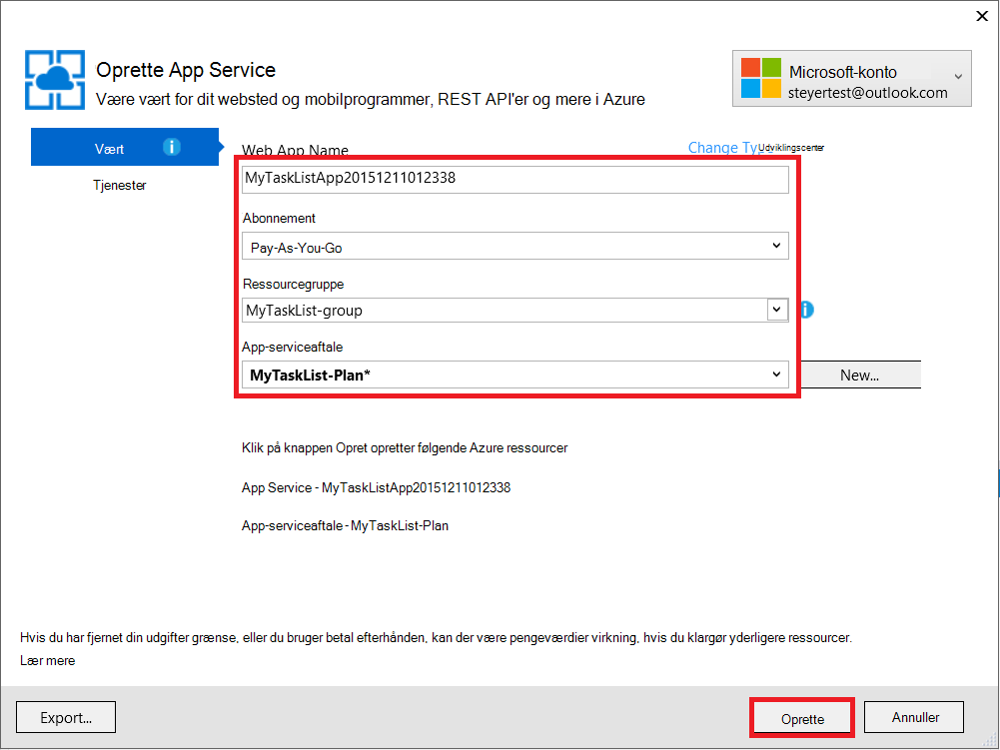
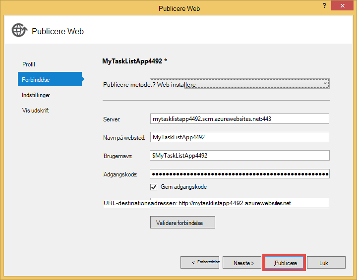

<properties 
    pageTitle="Oprette en WebApp i Azure, der opretter forbinder til MongoDB, der kører på en virtuel maskine" 
    description="Et selvstudium, som lærer du at bruge ciffer skal installeres en ASP.NET-app til Azure App Service tilsluttet MongoDB på en Azure Virtual Machine."
    tags="azure-portal" 
    services="app-service\web, virtual-machines" 
    documentationCenter=".net" 
    authors="cephalin" 
    manager="wpickett" 
    editor=""/>

<tags 
    ms.service="app-service-web" 
    ms.workload="web" 
    ms.tgt_pltfrm="na" 
    ms.devlang="dotnet" 
    ms.topic="article" 
    ms.date="02/29/2016" 
    ms.author="cephalin"/>

# Oprette en WebApp i Azure, der opretter forbinder til MongoDB, der kører på en virtuel maskine

Bruger ciffer, kan du installere en ASP.NET-program til Azure App Service Web Apps. I dette selvstudium skal du oprette en simpel front end ASP.NET MVC opgave listen program, der opretter forbinder til en MongoDB database, der kører på en virtuel maskine i Azure.  [MongoDB] [ MongoDB] er en populære Åbn kilde, høj ydeevne NoSQL database. Når du kører og tester ASP.NET-program på computeren udvikling, overfører du programmet til App-tjenesten Web Apps ved hjælp af ciffer.

>[AZURE.NOTE] Hvis du vil komme i gang med Azure App Service før tilmelding til en Azure-konto, skal du gå til [Prøve App Service](http://go.microsoft.com/fwlink/?LinkId=523751), hvor du straks kan oprette en forbigående starter WebApp i App-tjeneste. Ingen kreditkort, der kræves. ingen forpligtelser.

## Baggrund knowledge ##

Kendskab til følgende er nyttig til dette selvstudium, men ikke påkrævet:

* C# driver til MongoDB. Du kan finde flere oplysninger om udvikling af C# programmer mod MongoDB, se MongoDB [CSharp sprog Center][MongoC#LangCenter]. 
* ASP .NET web application framework. Du kan få at vide om den på [ASP.net websted][ASP.NET].
* ASP .NET MVC web application framework. Du kan få mere at vide om den på [ASP.NET MVC websted][MVCWebSite].
* Azure. Du kan komme i gang læse på [Azure][WindowsAzure].

## Forudsætninger ##

- [Visual Studio Express 2013 til Web]  [ VSEWeb] eller [Visual Studio 2013] [VSUlt]
- [Azure SDK til .NET](http://go.microsoft.com/fwlink/p/?linkid=323510&clcid=0x409)
- Et aktivt Microsoft Azure-abonnement

[AZURE.INCLUDE [create-account-and-websites-note](../../includes/create-account-and-websites-note.md)]

 
## Oprette en virtuel maskine og installere MongoDB ##

Dette selvstudium, antages det, du har oprettet en virtuel maskine i Azure. Når du har oprettet den virtuelle maskine skal du installere MongoDB på den virtuelle maskine:

* For at oprette en Windows virtuel maskine og installere MongoDB, skal du se [Installere MongoDB på en virtuel maskine, der kører Windows Server i Azure][InstallMongoOnWindowsVM].

Når du har oprettet den virtuelle maskine i Azure og installeret MongoDB, skal du huske på DNS-navnet på den virtuelle maskine ("testlinuxvm.cloudapp.net", for eksempel) og den eksterne port for MongoDB, du angav i slutpunktet.  Du skal bruge disse oplysninger senere i selvstudiet.

## Oprette programmet ##

I dette afsnit kan du oprette en ASP.NET-program kaldet "Min opgaveliste" ved hjælp af Visual Studio og udføre en indledende installation til Azure App Service Web Apps. Du vil køre programmet lokalt, men det kan oprette forbindelse til din virtuelle maskine på Azure og bruge den MongoDB-forekomst, du har oprettet der.

1. Klik på **Nyt projekt**i Visual Studio.

    ![Starte siden nyt projekt][StartPageNewProject]

1. Vælg **Visual C#**i vinduet **Nyt projekt** i venstre rude, og vælg derefter **Web**. I den midterste rude skal du vælge **ASP.NET webprogram**. Navngiv projektet "MyTaskListApp" i bunden, og klik derefter på **OK**.

    ![Dialogboksen nyt projekt][NewProjectMyTaskListApp]

1. Vælg **MVC**i dialogboksen **Nyt ASP.NET-projekt** , og klik derefter på **OK**.

    ![Vælg MVC skabelon][VS2013SelectMVCTemplate]

1. Hvis du ikke allerede er logget på Microsoft Azure, bliver du bedt om at logge på. Følg vejledningen for at logge på Azure.
2. Når du er logget på, kan du begynde at konfigurere din App Service WebApp. Angiv **Web App-navn**, **App-serviceaftale**, **ressourcegruppe**og **område**, og derefter klikke på **Opret**.

    

1. Efter projektet oprettelse af er fuldført, skal du vente online skal have oprettet i Azure App-tjeneste, som angivet i vinduet **Azure App tjenestens aktivitet** . Klik derefter på **Publicer MyTaskListApp til denne online nu**.

1. Klik på **Udgiv**.

    

    Når dit standardprogram til ASP.NET er blevet publiceret til Azure App Service Web Apps, vil den blive startet i browseren.

## Installere MongoDB C#-driver

MongoDB tilbyder klientsiden support til C# programmer via en driver, som du har brug for at installere på din lokale computer. C#-driver er tilgængelig via NuGet.

Sådan installeres MongoDB C#-driveren:

1. Højreklik på **MyTaskListApp** projektet i **Solution Explorer**, og vælg **Administrer NuGetPackages**.

    ![Administrere NuGet-pakker][VS2013ManageNuGetPackages]

2. I vinduet **Administrer NuGet pakker** i venstre rude skal du klikke på **Online**. Skriv "mongodb.driver" i feltet **Søg Online** til højre.  Klik på **Installer** for at installere driveren.

    ![Søge efter MongoDB C#-Driver][SearchforMongoDBCSharpDriver]

3. Klik på **jeg accepterer** for at acceptere 10gen, Inc. licensvilkår.

4. Klik på **Luk** , når driveren er installeret.
    ![MongoDB C#-Driver installeret][MongoDBCsharpDriverInstalled]

MongoDB C#-driver er nu installeret.  Referencer til **MongoDB.Bson**, **MongoDB.Driver**og **MongoDB.Driver.Core** biblioteker er blevet føjet til projektet.

![MongoDB C# Driver referencer][MongoDBCSharpDriverReferences]

## Tilføje en model ##
Højreklik på *modeller* mappe, og **Tilføj** en ny **klasse** i **Solution Explorer**, og kald den *TaskModel.cs*.  Erstat den eksisterende kode i *TaskModel.cs*, med følgende kode:

    using System;
    using System.Collections.Generic;
    using System.Linq;
    using System.Web;
    using MongoDB.Bson.Serialization.Attributes;
    using MongoDB.Bson.Serialization.IdGenerators;
    using MongoDB.Bson;
    
    namespace MyTaskListApp.Models
    {
        public class MyTask
        {
            [BsonId(IdGenerator = typeof(CombGuidGenerator))]
            public Guid Id { get; set; }
    
            [BsonElement("Name")]
            public string Name { get; set; }
    
            [BsonElement("Category")]
            public string Category { get; set; }
    
            [BsonElement("Date")]
            public DateTime Date { get; set; }
    
            [BsonElement("CreatedDate")]
            public DateTime CreatedDate { get; set; }
    
        }
    }

## Tilføje data access lag ##
I **Solution Explorer**, skal du højreklikke på *MyTaskListApp* projektet og **tilføje** en **Ny mappe** med navnet *DAL*.  Højreklik på *DAL* mappe, og **Tilføj** en ny **klasse**. Navngiv filen class *Dal.cs*.  Erstat den eksisterende kode i *Dal.cs*, med følgende kode:

    using System;
    using System.Collections.Generic;
    using System.Linq;
    using System.Web;
    using MyTaskListApp.Models;
    using MongoDB.Driver;
    using MongoDB.Bson;
    using System.Configuration;
    
    
    namespace MyTaskListApp
    {
        public class Dal : IDisposable
        {
            private MongoServer mongoServer = null;
            private bool disposed = false;
    
            // To do: update the connection string with the DNS name
            // or IP address of your server. 
            //For example, "mongodb://testlinux.cloudapp.net"
            private string connectionString = "mongodb://mongodbsrv20151211.cloudapp.net";
    
            // This sample uses a database named "Tasks" and a 
            //collection named "TasksList".  The database and collection 
            //will be automatically created if they don't already exist.
            private string dbName = "Tasks";
            private string collectionName = "TasksList";
    
            // Default constructor.        
            public Dal()
            {
            }
    
            // Gets all Task items from the MongoDB server.        
            public List<MyTask> GetAllTasks()
            {
                try
                {
                    var collection = GetTasksCollection();
                    return collection.Find(new BsonDocument()).ToList();
                }
                catch (MongoConnectionException)
                {
                    return new List<MyTask>();
                }
            }
    
            // Creates a Task and inserts it into the collection in MongoDB.
            public void CreateTask(MyTask task)
            {
                var collection = GetTasksCollectionForEdit();
                try
                {
                    collection.InsertOne(task);
                }
                catch (MongoCommandException ex)
                {
                    string msg = ex.Message;
                }
            }
    
            private IMongoCollection<MyTask> GetTasksCollection()
            {
                MongoClient client = new MongoClient(connectionString);
                var database = client.GetDatabase(dbName);
                var todoTaskCollection = database.GetCollection<MyTask>(collectionName);
                return todoTaskCollection;
            }
    
            private IMongoCollection<MyTask> GetTasksCollectionForEdit()
            {
                MongoClient client = new MongoClient(connectionString);
                var database = client.GetDatabase(dbName);
                var todoTaskCollection = database.GetCollection<MyTask>(collectionName);
                return todoTaskCollection;
            }
    
            # region IDisposable
    
            public void Dispose()
            {
                this.Dispose(true);
                GC.SuppressFinalize(this);
            }
    
            protected virtual void Dispose(bool disposing)
            {
                if (!this.disposed)
                {
                    if (disposing)
                    {
                        if (mongoServer != null)
                        {
                            this.mongoServer.Disconnect();
                        }
                    }
                }
    
                this.disposed = true;
            }
    
            # endregion
        }
    }

## Tilføje en controller ##
Åbn filen *Controllers\HomeController.cs* i **Solution Explorer** og erstatte den eksisterende kode med følgende:

    using System;
    using System.Collections.Generic;
    using System.Linq;
    using System.Web;
    using System.Web.Mvc;
    using MyTaskListApp.Models;
    using System.Configuration;
    
    namespace MyTaskListApp.Controllers
    {
        public class HomeController : Controller, IDisposable
        {
            private Dal dal = new Dal();
            private bool disposed = false;
            //
            // GET: /MyTask/
    
            public ActionResult Index()
            {
                return View(dal.GetAllTasks());
            }
    
            //
            // GET: /MyTask/Create
    
            public ActionResult Create()
            {
                return View();
            }
    
            //
            // POST: /MyTask/Create
    
            [HttpPost]
            public ActionResult Create(MyTask task)
            {
                try
                {
                    dal.CreateTask(task);
                    return RedirectToAction("Index");
                }
                catch
                {
                    return View();
                }
            }
    
            public ActionResult About()
            {
                return View();
            }
    
            # region IDisposable
    
            new protected void Dispose()
            {
                this.Dispose(true);
                GC.SuppressFinalize(this);
            }
    
            new protected virtual void Dispose(bool disposing)
            {
                if (!this.disposed)
                {
                    if (disposing)
                    {
                        this.dal.Dispose();
                    }
                }
    
                this.disposed = true;
            }
    
            # endregion
    
        }
    }

## Konfigurere typografierne ##
Hvis du vil ændre titel øverst på siden, skal du åbne den *Views\Shared\\_Layout.cshtml* filer i **Solution Explorer** og erstatte "Programnavn" i overskriften navigationslinje med "Mine opgave listen program", så den ser sådan ud:

    @Html.ActionLink("My Task List Application", "Index", "Home", null, new { @class = "navbar-brand" })

Åbn filen *\Views\Home\Index.cshtml* for at konfigurere menuen opgaveliste, og erstatte den eksisterende kode med følgende kode:
    
    @model IEnumerable<MyTaskListApp.Models.MyTask>
    
    @{
        ViewBag.Title = "My Task List";
    }
    
    <h2>My Task List</h2>
    
    <table border="1">
        <tr>
            <th>Task</th>
            <th>Category</th>
            <th>Date</th>
            
        </tr>
    
    @foreach (var item in Model) {
        <tr>
            <td>
                @Html.DisplayFor(modelItem => item.Name)
            </td>
            <td>
                @Html.DisplayFor(modelItem => item.Category)
            </td>
            <td>
                @Html.DisplayFor(modelItem => item.Date)
            </td>
            
        </tr>
    }
    
    </table>
    
  @Html.Partial("Create", new MyTaskListApp.Models.MyTask())

Hvis du vil tilføje muligheden for at oprette en ny opgave, skal du højreklikke på den *Views\Home\\ * mappe og **Tilføj** en **visning**.  Navngiv visningen *Opret*. Erstatte koden med følgende:

    @model MyTaskListApp.Models.MyTask
    
    
    
    
    
    @using (Html.BeginForm("Create", "Home")) {
        @Html.ValidationSummary(true)
        <fieldset>
            <legend>New Task</legend>
    
            

                @Html.LabelFor(model => model.Name)
            

            

                @Html.EditorFor(model => model.Name)
                @Html.ValidationMessageFor(model => model.Name)
            

    
            

                @Html.LabelFor(model => model.Category)
            

            

                @Html.EditorFor(model => model.Category)
                @Html.ValidationMessageFor(model => model.Category)
            

    
            

                @Html.LabelFor(model => model.Date)
            

            

                @Html.EditorFor(model => model.Date)
                @Html.ValidationMessageFor(model => model.Date)
            

    
            

                <input type="submit" value="Create" />
            

        </fieldset>
    }

**Solution Explorer** ser sådan ud:

![Solution Explorer][SolutionExplorerMyTaskListApp]

## Angive forbindelsesstrengen MongoDB ##
I **Solution Explorer**skal du åbne filen *DAL/Dal.cs* . Find følgende linje af kode:

    private string connectionString = "mongodb://<vm-dns-name>";

Erstatte `<vm-dns-name>` med DNS-navnet på den virtuelle maskine kører MongoDB, du har oprettet i [oprette en virtuel maskine og installere MongoDB][] trin i dette selvstudium.  For at finde DNS-navnet på din virtuelle maskine, gå til Azure-portalen, Vælg **virtuelle maskiner**og finde **DNS-navn**.

Hvis DNS-navnet på den virtuelle maskine er "testlinuxvm.cloudapp.net" og MongoDB lytter på standardporten 27017, vil streng forbindelseslinje af kode se ud:

    private string connectionString = "mongodb://testlinuxvm.cloudapp.net";

Hvis virtuelt slutpunktet angiver en anden ekstern port for MongoDB, kan du Angiv en port i forbindelsesstrengen:

    private string connectionString = "mongodb://testlinuxvm.cloudapp.net:12345";

Se [forbindelser]til flere oplysninger om MongoDB forbindelsesstrenge,[MongoConnectionStrings].

## Teste den lokale installation ##

Vælg **Start fejlfinding** fra menuen **fejlfinding** for at køre programmet på computeren udvikling, eller tryk på **F5**. IIS Express starter og en browser åbnes og starter programmets startsiden.  Du kan tilføje en ny opgave, som vil blive føjet til den MongoDB database, der kører på din virtuelle maskine i Azure.

![Min opgave listen program][TaskListAppBlank]

## Publicere til Azure App Service Webapps

I dette afsnit kan du publicere ændringerne til Azure App Service Web Apps.

1. I Solution Explorer skal du højreklikke på **MyTaskListApp** igen, og klik på **Publicer**.
2. Klik på **Udgiv**.

    Du bør nu se din online kører i Azure App Service og få adgang til databasen MongoDB i virtuelle Azure-computere.

## Oversigt ##

Du har nu installeret ASP.NET-program til Azure App Service Web Apps. Sådan får du vist online:

1. Log på portalen Azure.
2. Klik på **webapps**. 
3. Vælg din online på listen **Web Apps** .

Du kan finde flere oplysninger om udvikling af C# programmer mod MongoDB, se [CSharp sprog Center][MongoC#LangCenter]. 

[AZURE.INCLUDE [app-service-web-whats-changed](../../includes/app-service-web-whats-changed.md)]
 

<!-- HYPERLINKS -->

[AzurePortal]: http://manage.windowsazure.com
[WindowsAzure]: http://www.windowsazure.com
[MongoC#LangCenter]: http://docs.mongodb.org/ecosystem/drivers/csharp/
[MVCWebSite]: http://www.asp.net/mvc
[ASP.NET]: http://www.asp.net/
[MongoConnectionStrings]: http://www.mongodb.org/display/DOCS/Connections
[MongoDB]: http://www.mongodb.org
[InstallMongoOnWindowsVM]: ../virtual-machines/virtual-machines-windows-classic-install-mongodb.md
[VSEWeb]: http://www.microsoft.com/visualstudio/eng/2013-downloads#d-2013-express
[VSUlt]: http://www.microsoft.com/visualstudio/eng/2013-downloads

<!-- IMAGES -->

[StartPageNewProject]: ./media/web-sites-dotnet-store-data-mongodb-vm/NewProject.png
[NewProjectMyTaskListApp]: ./media/web-sites-dotnet-store-data-mongodb-vm/NewProjectMyTaskListApp.png
[VS2013SelectMVCTemplate]: ./media/web-sites-dotnet-store-data-mongodb-vm/VS2013SelectMVCTemplate.png
[VS2013DefaultMVCApplication]: ./media/web-sites-dotnet-store-data-mongodb-vm/VS2013DefaultMVCApplication.png
[VS2013ManageNuGetPackages]: ./media/web-sites-dotnet-store-data-mongodb-vm/VS2013ManageNuGetPackages.png
[SearchforMongoDBCSharpDriver]: ./media/web-sites-dotnet-store-data-mongodb-vm/SearchforMongoDBCSharpDriver.png
[MongoDBCsharpDriverInstalled]: ./media/web-sites-dotnet-store-data-mongodb-vm/MongoDBCsharpDriverInstalled.png
[MongoDBCSharpDriverReferences]: ./media/web-sites-dotnet-store-data-mongodb-vm/MongoDBCSharpDriverReferences.png
[SolutionExplorerMyTaskListApp]: ./media/web-sites-dotnet-store-data-mongodb-vm/SolutionExplorerMyTaskListApp.png
[TaskListAppBlank]: ./media/web-sites-dotnet-store-data-mongodb-vm/TaskListAppBlank.png
[WAWSCreateWebSite]: ./media/web-sites-dotnet-store-data-mongodb-vm/WAWSCreateWebSite.png
[WAWSDashboardMyTaskListApp]: ./media/web-sites-dotnet-store-data-mongodb-vm/WAWSDashboardMyTaskListApp.png
[Image9]: ./media/web-sites-dotnet-store-data-mongodb-vm/RepoReady.png
[Image10]: ./media/web-sites-dotnet-store-data-mongodb-vm/GitInstructions.png
[Image11]: ./media/web-sites-dotnet-store-data-mongodb-vm/GitDeploymentComplete.png

<!-- TOC BOOKMARKS -->
[Oprette en virtuel maskine og installere MongoDB]: #virtualmachine
[Create and run the My Task List ASP.NET application on your development computer]: #createapp
[Create an Azure web site]: #createwebsite
[Deploy the ASP.NET application to the web site using Git]: #deployapp
 