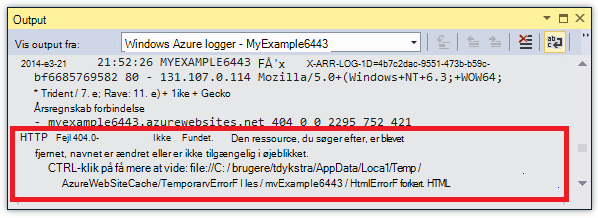
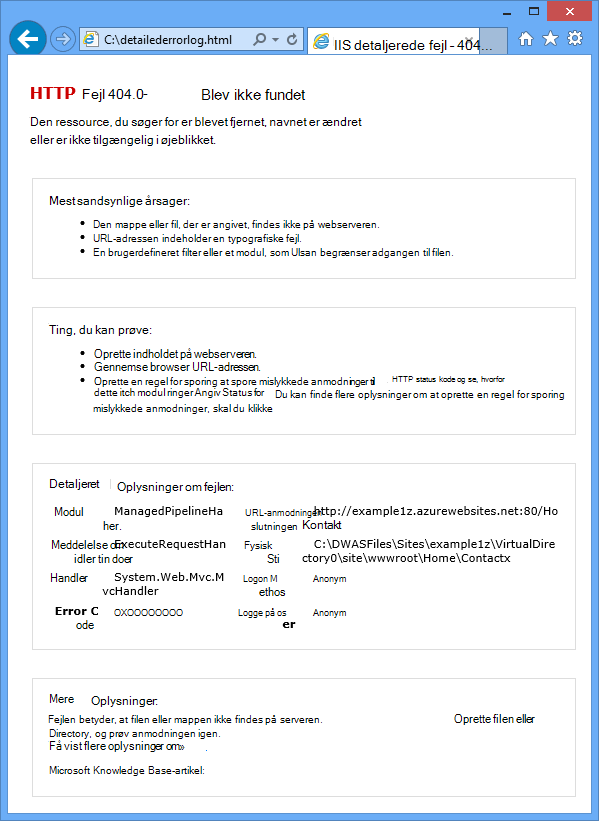
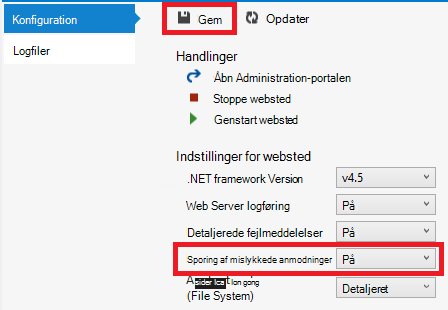

<properties 
    pageTitle="Fejlfinding i forbindelse med en WebApp i Azure App tjenesten ved hjælp af Visual Studio" 
    description="Lær, hvordan du udfører fejlfinding af en Azure-WebApp ved hjælp af ekstern fejlfinding, sporing og logføring værktøjer, der er indbygget i Visual Studio-2013." 
    services="app-service" 
    documentationCenter=".net" 
    authors="tdykstra" 
    manager="wpickett" 
    editor=""/>

<tags 
    ms.service="app-service" 
    ms.workload="na" 
    ms.tgt_pltfrm="na" 
    ms.devlang="dotnet" 
    ms.topic="article" 
    ms.date="08/29/2016" 
    ms.author="rachelap"/>

# Fejlfinding i forbindelse med en WebApp i Azure App tjenesten ved hjælp af Visual Studio

## Oversigt

Dette selvstudium viser, hvordan du bruger Visual Studio-værktøjer, som hjælp til fejlfinding af en WebApp i [App Service](http://go.microsoft.com/fwlink/?LinkId=529714), ved at køre i [foretage fejlfinding af tilstand](http://www.visualstudio.com/get-started/debug-your-app-vs.aspx) fra en fjernplacering eller ved at få vist programmet logfiler og web server hændelseslogge.

[AZURE.INCLUDE [app-service-web-to-api-and-mobile](../../includes/app-service-web-to-api-and-mobile.md)]

Du kan lære følgende:

* Hvilke Azure web app management-funktioner er tilgængelige i Visual Studio.
* Sådan bruges visning af Visual Studio fjernbetjening til at foretage hurtige ændringer i en ekstern WebApp.
* Sådan køres fejlsikret tilstand, mens et projekt fra en fjernplacering kører i Azure, både for en WebApp og for en WebJob.
* Sådan oprettes programmet spore logfiler og få dem vist, når programmet opretter dem.
* Sådan får du vist web server logfiler, herunder detaljerede fejlmeddelelser og mislykkedes anmodning sporing.
* Hvordan du kan sende diagnosticeringslogfiler til en Azure-lager-konto og få dem vist der.

Hvis du har Visual Studio Ultimate, kan du også bruge [IntelliTrace](http://msdn.microsoft.com/library/vstudio/dd264915.aspx) til fejlfinding. IntelliTrace er ikke omfattet i dette selvstudium.

## Forudsætninger

Dette selvstudium fungerer med udviklingsmiljø, web project og Azure WebApp, du konfigurerer i [Introduktion til Azure og ASP.NET][GetStarted]. I WebJobs afsnittene skal du det program, du opretter i [Introduktion til Azure WebJobs SDK][GetStartedWJ].

Kodeeksempler, vises i dette selvstudium er for et webprogram C# MVC, men fejlfinding procedurer er de samme programmer til Visual Basic og Web-formularer.

Selvstudiet antages, du bruger Visual Studio 2015 eller 2013. Hvis du bruger Visual Studio 2013, WebJobs funktioner kræver [opdatering 4](http://go.microsoft.com/fwlink/?LinkID=510314) eller nyere. 

Loggene streaming funktioner fungerer kun for programmer, der fokuserer på .NET Framework 4 eller nyere.

## Web app konfiguration og administration

Visual Studio giver adgang til et undersæt af de web app management-funktioner og konfigurationsindstillinger, der er tilgængelige i [Azure-portalen](http://go.microsoft.com/fwlink/?LinkId=529715). I dette afsnit får du vist, hvad der er tilgængeligt ved hjælp af **Server Explorer**. For at se de nyeste Azure integrationsfunktioner skal du afprøve **Skyen Explorer** også. Du kan åbne begge vinduer i menuen **Vis** . 

1. Hvis du ikke allerede logget på Azure i Visual Studio, skal du klikke på knappen **Opret forbindelse til Azure** i **Server Explorer**.

    I stedet kan du installere en management-certifikat, der giver adgang til din konto. Hvis du vælger at installere et certifikat, skal du højreklikke på noden **Azure** i **Server Explorer**, og klik derefter på **Administrer og Filter abonnementer** i genvejsmenuen. Klik på fanen **certifikater** i dialogboksen **Administrer Azure abonnementer** , og klik derefter på **Importer**. Følg vejledningen for at hente og derefter importere abonnementsfilen (også kaldet en *.publishsettings* -fil) til din Azure-konto.

    > [AZURE.NOTE]
    > Hvis du henter en abonnement-fil, gemme den på en mappe uden for din datakilde kode kataloger (for eksempel i mappen overførsler), og derefter slette den, når importen er færdig. En skadelig bruger, der får adgang til abonnementsfilen kan redigere, oprette og slette dine Azure tjenester.

    Du kan finde flere oplysninger om at oprette forbindelse til Azure ressourcer fra Visual Studio, skal du se [Administrer konti, abonnementer og Administrationsroller](http://go.microsoft.com/fwlink/?LinkId=324796#BKMK_AccountVCert).

2. Udvid **Azure** **Server Explorer**, og udvid **App Service**.

3. Udvid ressourcegruppen, der indeholder den web-app, du oprettede i [Introduktion til Azure og ASP.NET][GetStarted], og højreklik på noden web app, og klik på **Visningsindstillinger**.

    

    Fanen **Azure online** vises, og du kan se der web app administration og konfiguration af opgaverne, der er tilgængelige i Visual Studio.

    

    I dette selvstudium skal du bruge logføring og sporing af-rullelister. Du kan også bruge ekstern fejlfinding, men du skal bruge en anden metode til at aktivere den.
   
    Finde oplysninger om felterne App-indstillinger og strenge i dette vindue [Azure Web Apps: hvordan programmet strenge og forbindelse strenge arbejde](http://blogs.msdn.com/b/windowsazure/archive/2013/07/17/windows-azure-web-sites-how-application-strings-and-connection-strings-work.aspx).

    Hvis du vil udføre en opgave i web app management, der ikke kan udføres i dette vindue, skal du klikke på **Åbn i portalen til administration** for at åbne et browservindue på Azure-portalen.

## Access web app-filer i Server Explorer

Du typisk installerer et webprojekt med den `customErrors` flag i filen Web.config, der er angivet til `On` eller `RemoteOnly`, hvilket betyder, at du ikke får vist en nyttige fejlmeddelelse, når noget går galt. Alt, du får, er en side som en af følgende dem for mange fejl.

**Serverfejl i '/' Application:**

**Der opstod en fejl:**

**Webstedet kan ikke få vist siden**

Den nemmeste måde at finde årsagen til fejlen er ofte at aktivere detaljerede fejlmeddelelser, som først af de foregående skærmbilleder forklarer, hvordan du gør. Der kræver en ændring i filen udløst Web.config. Du kan redigere filen *Web.config* i projektet og geninstaller i projektet, eller oprette en [Web.config transformere](http://www.asp.net/mvc/tutorials/deployment/visual-studio-web-deployment/web-config-transformations) og installere et fejlfinding build, men der er en hurtigere måde: i **Solution Explorer** kan du direkte se og redigere filer i remote WebApp ved hjælp af funktionen *remote visning* .

1. Udvid **Azure** **Server Explorer**, udvide **App Service**, udvide ressourcegruppen, som din online er placeret i, og udvid derefter noden for din online.

    Du kan se noder, der giver dig adgang til online indhold filer og logfiler.

2. Udvid noden **filer** , og dobbeltklik på filen *Web.config* .

    

    Visual Studio åbner filen Web.config fra remote WebApp og viser [Remote] ud for filnavnet i titellinjen.

3. Tilføj følgende linje til den `system.web` element:

    `<customErrors mode="Off"></customErrors>`

    

4. Opdater browseren, der vises ikke brugbart fejlmeddelelsen, og nu du får vist en detaljeret fejlmeddelelse, som i følgende eksempel:

    

    (Fejlen vises blev oprettet ved at tilføje den linje, der vises med rødt *Views\Home\Index.cshtml*).

Redigere filen Web.config er kun ét eksempel på scenarier, hvor muligheden for at læse og redigere filer på din Azure online foretage fejlfinding nemmere.

## Remote fejlfinding online

Hvis den detaljerede fejlmeddelelse ikke indeholder nok oplysninger, og du ikke kan genskabe fejlen lokalt, er en anden måde at foretage fejlfinding af til at køre i fejlsikret tilstand fra en fjernplacering. Du kan angive pausepunkter, manipulere hukommelse direkte, gennemgå kode og endda ændre stien kode. 

Ekstern fejlfinding virker ikke i Express udgaver af Visual Studio.

Dette afsnit viser, hvordan du udfører fejlfinding ved hjælp af det projekt, du opretter i [Introduktion til Azure og ASP.NET][GetStarted].

1. Åbn den webprojekt, som du oprettede i [Introduktion til Azure og ASP.NET][GetStarted].

1. Åbn *Controllers\HomeController.cs*.

2. Slette den `About()` metode og Indsæt følgende kode i stedet.

        public ActionResult About()
        {
            string currentTime = DateTime.Now.ToLongTimeString();
            ViewBag.Message = "The current time is " + currentTime;
            return View();
        }

2. [Angive et pausepunkt](http://www.visualstudio.com/get-started/debug-your-app-vs.aspx) for den `ViewBag.Message` linje.

1. I **Solution Explorer**, skal du højreklikke på projektet, og klik på **Publicer**.

2. Vælg den samme profil, som du har brugt i [Introduktion til Azure og ASP.NET]i rullelisten **profil** [GetStarted].

3. Klik på fanen **Indstillinger** og ændre **konfiguration** til **fejlfinding**, og klik derefter på **Udgiv**.

    

4. Efter installation er afsluttet og browseren åbnes med Azure URL-adressen for din online, skal du lukke browseren.

5. I **Server Explorer**, skal du højreklikke på din online, og klik **Vedhæfte fejlfinding**. 

    

    Browseren åbnes automatisk til din startside, kører i Azure. Det være nødvendigt at vente 20 sekunder eller det, mens Azure konfigurerer serveren til fejlfinding. Denne forsinkelse sker kun første gang du kører i fejlsikret tilstand på en web-app. Efterfølgende gange inden for de næste 48 timer, når du starter fejlfinding igen der ikke en forsinkelse.

    **Note:** Hvis du har problemer med at starte fejlfindingsværktøjet, kan du prøve at gøre det ved hjælp af **Skyen Stifinder** i stedet for **Server Explorer**.

6. Klik på **om** i menuen.

    Visual Studio holder på pausepunktet, og koden, der kører på Azure, ikke på din lokale computer.

7. Hold markøren over den `currentTime` variablen for at se tidsværdien.

    

    Den tid, du får vist er Azure server tid, som kan være i en anden tidszone end din lokale computer.

8. Angiv en ny værdi for den `currentTime` variabel, som "Nu kører i Azure".

5. Tryk på F5 for at fortsætte.

    Siden om kører i Azure viser den nye værdi, du har angivet i currentTime variabel.

    

## Remote fejlfinding WebJobs

Dette afsnit viser, hvordan du udfører fejlfinding ved hjælp af det projekt- og web app, du opretter i [Introduktion til Azure WebJobs SDK](websites-dotnet-webjobs-sdk.md). 

De funktioner, der vises i dette afsnit er kun tilgængelig i Visual Studio 2013 med opdatering 4 eller nyere. 

Ekstern fejlfinding virker kun med fortløbende WebJobs. Planlagte og on demand WebJobs understøtter ikke fejlfinding.

1. Åbn den webprojekt, som du oprettede i [Introduktion til Azure WebJobs SDK][GetStartedWJ].

1. Åbn *Functions.cs*i project ContosoAdsWebJob.

2. [Angive et pausepunkt](http://www.visualstudio.com/get-started/debug-your-app-vs.aspx) på den første sætning i den `GnerateThumbnail` metode.

    

1. I **Solution Explorer**, skal du højreklikke på webprojektet (ikke WebJob projekt), og klik på **Publicer**.

2. Vælg den samme profil, som du har brugt i [Introduktion til Azure WebJobs SDK](websites-dotnet-webjobs-sdk.md)i rullelisten **profil** .

3. Klik på fanen **Indstillinger** og ændre **konfiguration** til **fejlfinding**, og klik derefter på **Udgiv**.

    Visual Studio installerer internettet og WebJob projekter, og din browser åbnes med Azure URL-adressen for din online.

5. Udvid i **Server Explorer** **Azure > App Service > din ressourcegruppe > din online > WebJobs > fortløbende**, og højreklik derefter på **ContosoAdsWebJob**.

7. Klik på **Vedhæft fejlfinding**. 

    

    Browseren åbnes automatisk til din startside, kører i Azure. Det være nødvendigt at vente 20 sekunder eller det, mens Azure konfigurerer serveren til fejlfinding. Denne forsinkelse sker kun første gang du kører i fejlsikret tilstand på en web-app. Næste gang du vedhæfte fejlfindingsværktøjet der ikke en forsinkelse, hvis du ikke gør det inden for 48 timer.

6. Oprette en ny ad i webbrowseren, der er åbnet til startsiden i Contoso Active Directory. 

    Oprette en annonce får meddelelsen kø skal oprettes, som kan hentes ved WebJob og behandles. Når WebJobs SDK ringer til funktionen til at behandle kø meddelelsen, tryk koden din pausepunkt.

7. Når fejlfindingsværktøjet sideskift ved din pausepunkt, kan du undersøge og ændre variable værdier, mens programmet, der kører i skyen. I følgende illustration viser fejlfindingsværktøjet indholdet af objektet blobInfo, der blev sendt til GenerateThumbnail metode.

    
 
5. Tryk på F5 for at fortsætte.

    Metoden GenerateThumbnail er færdig med at oprette miniaturebilledet.

6. Opdater indeks-siden i browseren, og du får vist miniaturen.

6. Tryk på SHIFT + F5 for at stoppe fejlfinding i Visual Studio.

7. Højreklik på noden ContosoAdsWebJob **Server Explorer**, og klik på **Vis Dashboard**.

8. Log på med legitimationsoplysningerne Azure, og klik derefter på navnet på WebJob for at gå til siden for din WebJob. 

    

    Dashboard viser, at funktionen GenerateThumbnail udføres for nylig.

    (Næste gang du klikker på **Vis Dashboard**, du behøver ikke at logge på og browseren sendes direkte til siden for din WebJob).

9. Klik på funktionsnavnet for at se oplysninger om funktionen udførelsen.

    

Hvis din funktionen [skrevet logge](websites-dotnet-webjobs-sdk-storage-queues-how-to.md#logs), kan du klikke på **ToggleOutput** få dem vist.

## Noter om ekstern fejlfinding

* Det anbefales ikke at køre i fejlsikret tilstand i fremstilling. Hvis din fremstilling online ikke er skaleret ud af, at flere forekomster af server, forhindrer fejlfinding webserveren i besvare andre anmodninger. Hvis du har flere forekomster af web server, når du knytter til fejlfindingsværktøjet får du en forekomst af tilfældige, og du har ingen måde at sikre, at efterfølgende browseranmodninger går til den pågældende forekomst. Desuden du typisk installerer ikke en fejlfinding build til fremstilling og compileren optimeringer for release builds kan gøre det muligt at vise, hvad der sker linje for linje i din kildekode. I forbindelse med fejlfinding fremstilling, er din bedste ressource program sporing og web server-logfilerne.

* Undgå lang Stop på pausepunkter når remote fejlfinding. Azure behandler en proces, der ikke er længere i mere end et par minutter som en svarer proces, og lukker den.

* Mens du fejlfinding, er serveren, der sender data til Visual Studio, som kan påvirke båndbredde gebyrer. Finde oplysninger om båndbredde satser, [Azure priser](/pricing/calculator/).

* Sørg for, at den `debug` attributten for de `compilation` element i filen *Web.config* er angivet til sand. Det er indstillet til SAND som standard, når du publicerer en fejlfinding build konfiguration.

        <system.web>
          <compilation debug="true" targetFramework="4.5" />
          <httpRuntime targetFramework="4.5" />
        </system.web>

* Hvis du synes, at fejlfindingsværktøjet ikke trinvist kode, du vil foretage fejlfinding, kan det være nødvendigt at ændre indstillingen kun mine kode.  Du kan finde flere oplysninger, se [Begræns væk til kun mine kode](http://msdn.microsoft.com/library/vstudio/y740d9d3.aspx#BKMK_Restrict_stepping_to_Just_My_Code).

* En timer starter på serveren, når du aktiverer funktionen remote fejlfinding, og efter 48 timer funktionen automatisk slået fra. Denne 48 timer grænse er gjort for sikkerhed og ydeevne årsager. Du kan nemt slå funktionen tilbage på så mange gange du vil. Vi anbefaler, at forlade det deaktiveret, når du ikke aktivt fejlfinding.

* Du kan manuelt knytte fejlfindingsværktøjet til en proces, ikke kun web app processen (w3wp.exe). Du kan finde flere oplysninger om, hvordan du bruger fejlsikret tilstand i Visual Studio, [fejlfinding i Visual Studio](http://msdn.microsoft.com/library/vstudio/sc65sadd.aspx).

## Oversigt over diagnosticeringslogfiler

En ASP.NET-program, der kører i en Azure WebApp kan oprette følgende typer af logfiler:

* **Logfiler for programmer sporing** 
  Programmet opretter disse logfiler ved at ringe til metoder til klassen [System.Diagnostics.Trace](http://msdn.microsoft.com/library/system.diagnostics.trace.aspx) .
* **Web server logfiler** 
  Webserveren opretter en logfil for hver HTTP-anmodning til WebApp.
* **Detaljeret fejllogge for meddelelse** 
  Webserveren opretter en HTML-side med nogle yderligere oplysninger om mislykkede HTTP-anmodninger (dem, der medfører statuskode 400 eller nyere). 
* **Mislykkedes logfiler for anmodning om sporing** 
  Webserveren opretter en XML-fil med detaljerede sporingsoplysningerne mislykkedes HTTP-anmodninger om. Webserveren indeholder også en XSL-fil for at formatere XML-filen i en browser.
  
Logføring indflydelse på web app performance, så Azure giver dig mulighed for at aktivere eller deaktivere de forskellige typer log efter behov. For programmet loggene, kan du angive, at kun logfiler over en bestemt prioritering skal skrives. Når du opretter en ny WebApp, som standard alle logføring er deaktiveret.

Logfiler skrives til filer i en *LogFiles* mappe i filsystemet for din online og er tilgængelige via FTP. Web server logfiler og programmet hændelseslogge kan også skrives til en Azure-lager-konto. Du kan bevare en større mængde logge på en lagerplads konto end det er muligt i filsystemet. Du er begrænset til maksimalt 100 MB af logfiler, når du bruger filsystemet. (System logfiler er kun for kortvarig opbevaring. Azure sletter gamle logfiler for at skabe plads til nye, når er nået.)  

## Oprette og få vist programmet sporingslogfiler

I dette afsnit skal du udføre følgende opgaver:

* Føje sporing sætninger til den webprojekt, du oprettede i [Introduktion til Azure og ASP.NET][GetStarted].
* Få vist logfilerne, når du kører projektet lokalt.
* Få vist logfilerne, som de er genereret via det program, der kører i Azure. 

Du kan finde oplysninger om, hvordan du opretter program logger på WebJobs, under [om at arbejde med Azure kø lagerplads ved hjælp af WebJobs SDK - hvordan du kan skrive logge](websites-dotnet-webjobs-sdk-storage-queues-how-to.md#logs). De følgende instruktioner til visning af logfiler og styre, hvordan de er gemt i Azure gælder også for programmet logfiler, der er oprettet af WebJobs. 

### Tilføje sporing sætninger til programmet

1. Åbn *Controllers\HomeController.cs*, og Erstat den `Index`, `About`, og `Contact` metoder med følgende kode for at tilføje `Trace` sætninger og en `using` -sætningen for `System.Diagnostics`:

        public ActionResult Index()
        {
            Trace.WriteLine("Entering Index method");
            ViewBag.Message = "Modify this template to jump-start your ASP.NET MVC application.";
            Trace.TraceInformation("Displaying the Index page at " + DateTime.Now.ToLongTimeString());
            Trace.WriteLine("Leaving Index method");
            return View();
        }
        
        public ActionResult About()
        {
            Trace.WriteLine("Entering About method");
            ViewBag.Message = "Your app description page.";
            Trace.TraceWarning("Transient error on the About page at " + DateTime.Now.ToShortTimeString());
            Trace.WriteLine("Leaving About method");
            return View();
        }
        
        public ActionResult Contact()
        {
            Trace.WriteLine("Entering Contact method");
            ViewBag.Message = "Your contact page.";
            Trace.TraceError("Fatal error on the Contact page at " + DateTime.Now.ToLongTimeString());
            Trace.WriteLine("Leaving Contact method");
            return View();
        }       

2. Tilføje en `using System.Diagnostics;` sætningen til toppen af filen.
                
### Se Sporing output lokalt

3. Tryk på F5 for at køre programmet i fejlsikret tilstand.

    Standard sporing lytteren skriver alle sporingsoutput til vinduet **Output** sammen med andre fejlfindingsoplysninger. Følgende illustration viser output fra sætningerne sporing, som du har føjet til den `Index` metode.

    

    Følgende trin viser, hvordan du får vist sporingsoutput i en webside, uden kompilering i fejlsikret tilstand.

2. Åbn filen programmet Web.config (det, findes i projektmappen) og tilføje en `<system.diagnostics>` element i slutningen af filen, lige før lukningen `</configuration>` element:

        <system.diagnostics>
            <trace>
              <listeners>
                <add name="WebPageTraceListener"
                    type="System.Web.WebPageTraceListener, 
                    System.Web, 
                    Version=4.0.0.0, 
                    Culture=neutral,
                    PublicKeyToken=b03f5f7f11d50a3a" />
              </listeners>
            </trace>
          </system.diagnostics>

    Den `WebPageTraceListener` kan du se spore output ved at gå til `/trace.axd`.

3. Føje en <a href="http://msdn.microsoft.com/library/vstudio/6915t83k(v=vs.100).aspx">sporing element</a> under `<system.web>` i filen Web.config som i følgende eksempel:

        <trace enabled="true" writeToDiagnosticsTrace="true" mostRecent="true" pageOutput="false" />

3. Tryk på CTRL + F5 for at køre programmet.

4. Føje *trace.axd* til URL-adressen i adresselinjen i browservinduet, og tryk derefter på Enter (URL-adressen være ligner http://localhost:53370/trace.axd).

5. Klik på **Vis detaljer** på den første linje (ikke linjen BrowserLink) på siden **Programmet sporing** .

    

    Siden **Anmod om** vises, og i afsnittet **Sporingsoplysninger** du se output fra sætningerne sporing, som du har føjet til den `Index` metode.

    

    Som standard `trace.axd` er kun tilgængelig lokalt. Hvis du vil gøre det tilgængeligt fra en ekstern WebApp, kan du tilføje `localOnly="false"` til den `trace` element i filen *Web.config* , som vist i følgende eksempel:

        <trace enabled="true" writeToDiagnosticsTrace="true" localOnly="false" mostRecent="true" pageOutput="false" />

    Aktivere dog `trace.axd` i en fremstilling online generelt anbefales ikke af sikkerhedsmæssige årsager, og i de følgende afsnit får du vist en nemmere måde at læse logfiler for sporing i en Azure WebApp.

### Se Sporing output i Azure

1. Højreklik på webprojektet i **Solution Explorer**, og klik på **Publicer**.

2. Klik på **Publicer**i dialogboksen **Udgiv websted** .

    Når Visual Studio publicerer opdateringen, åbnes et browservindue til Startside (Hvis du ikke fjerne **URL-destinationsadressen** under fanen **forbindelse** ).

3. Højreklik på din online **Server Explorer**, og vælg **Vis Streaming logfiler**. 

    

    Vinduet **Output** viser, at du har forbindelse til tjenesten log streaming og tilføjer en meddelelse om linje hvert minut, der går uden en logfil, der skal vises.

    

4. Klik på **Kontakt**i browservinduet, der viser startsiden programmet på computeren.

    Output fra fejlen-niveau i et par sekunder spor du føjet til den `Contact` metode vises i vinduet **Output** .

    

    Visual Studio kun viser fejlen niveau sporinger, fordi det er standardindstillingen, når du aktiverer logfilen overvågning tjeneste. Alle logføring er deaktiveret som standard, når du opretter en ny Azure WebApp, som du fik vist, når du har åbnet indstillingssiden for tidligere:

    

    Når du har valgt **Visning Streaming logfiler**, ændres Visual Studio automatisk dog **Programmet Logging(File System)** til **fejl**, hvilket betyder, at få rapporteret fejl niveau logfiler. For at se alle dine logfiler for sporing, kan du ændre denne indstilling til **detaljeret**. Når du vælger en lavere end fejl prioritering, rapporteres alle logfiler for alvor højere. Så når du vælger detaljeret, se du også oplysninger, advarsler og fejllogge.  

4. I **Server Explorer**, skal du højreklikke på WebApp og derefter klikke på **Indstillinger for visningen** , som du foretog tidligere.

5. Ændre **Programmet logføring (File System)** til **detaljeret**, og klik derefter på **Gem**.
 
    

6. Klik på **Startside**, og derefter klikke på **om**, og klik **Kontakt**i browservinduet, der nu vises siden **Kontakt** .

    Inden for et par sekunder viser vinduet **Output** alle dine sporing output.

    

    Du kan aktiveres og deaktiveres logføring ved hjælp af indstillinger for Azure web app i dette afsnit. Du kan også aktivere og deaktivere sporing lyttere ved at ændre filen Web.config. Dog får at ændre filen Web.config app domain til Papirkurv, mens aktivering af logføring via web app-konfiguration ikke gøre det. Hvis problemet tager lang tid at genskabe, eller er forbigående, genbrug app domain kan "ret" og tvinge dig til at vente, indtil der sker igen. Aktivere diagnosticering i Azure gøre ikke dette, så du kan begynde at indsamle oplysninger om fejlen med det samme.

### Output vinduet funktioner

Fanen **Azure logfiler** i vinduet **Output** indeholder flere knapper og et tekstfelt:

Disse udføre følgende funktioner:

* Fjern markeringen i vinduet **Output** .
* Aktivere eller deaktivere tekstombrydning.
* Starte eller stoppe med at overvåge logfiler.
* Angiv, hvor logfiler til at overvåge.
* Hent logfiler.
* Filtrere logfiler, der er baseret på en søgestreng eller et søgemønster.
* Luk vinduet **Output** .

Hvis du angiver en søgestreng eller regulære udtryk, filtrerer Visual Studio logføringsoplysninger på klienten. Det betyder, at du kan angive kriterierne, når loggene vises i vinduet **Output** , og du kan ændre filterkriterier uden at genoprette loggene.

## Vis web server logfiler

Web server logfiler registrere alle HTTP aktivitet i WebApp. For at kunne se dem i vinduet **Output** skal du aktivere dem for WebApp og fortælle Visual Studio, som du vil overvåge dem. 

1. Ændre Web Server logføring til **på**fanen **Konfiguration af Azure Web App** , som du har åbnet fra **Server Explorer**, og klik derefter på **Gem**.

    

2. Klik på knappen **Angiv, hvilke Azure logfiler til at overvåge** , i vinduet **Output** .
    
    

3. Vælg **Web server logfiler**i dialogboksen **Indstillinger for logføring af Azure** , og klik derefter på **OK**.

    

4. Klik på **Startside**, og derefter klikke på **om**, og klik **Kontakt**i browservinduet, der viser WebApp.

    Loggene programmet Generelt vises først, efterfulgt af loggene web server. Det være nødvendigt at vente et øjeblik, før logfilerne, der skal vises. 

    

Som standard, når du først aktivere web server logfiler ved hjælp af Visual Studio, skriver Azure loggene filsystemet. Du kan bruge portalen Azure som et alternativ til at angive webserveren logfiler skal skrives til en blob objektbeholder med en konto med lagerplads.

Hvis du bruger på portalen til at aktivere webserver logføring til en Azure-lager-konto, og deaktiver derefter gendannes logføring i Visual Studio, når du genaktiverer logføring i Visual Studio kontoindstillingerne lagerplads. 

## Få vist detaljerede fejllogge for meddelelse

Detaljeret fejllogge indeholder nogle flere oplysninger om HTTP-anmodninger, der medfører fejl Svarkoder (400 eller ovenfor). For at kunne se dem i vinduet **Output** , skal du aktivere dem for WebApp og fortælle Visual Studio, som du vil overvåge dem.

1. Ændre **Detaljerede fejlmeddelelser** til **på**fanen **Konfiguration af Azure Web App** , som du har åbnet fra **Server Explorer**, og klik derefter på **Gem**.

    

2. Klik på knappen **Angiv, hvilke Azure logfiler til at overvåge** , i vinduet **Output** .

3. Klik på **alle logfiler**i dialogboksen **Indstillinger for logføring af Azure** , og klik derefter på **OK**.

    

4. I adresselinjen i browservinduet skal du føje et ekstra tegn til URL-adressen til at få en 404-fejl (for eksempel `http://localhost:53370/Home/Contactx`), og tryk på Enter.

    Når du har flere sekunder vises detaljerede fejlloggen i Visual Studio **Output** indeholder.

    

    CTRL + klik på linket for at få vist log output formateret i en browser:

    

## Hente filer systemets logfiler

En hvilken som helst logfiler, som du kan overvåge i vinduet **Output** kan også hentes som en *.zip-* fil. 

1. Klik på **Hent Streaming logfiler**i vinduet **Output** .

    

    Åbn Stifinder åbnes i mappen *overførsler* med den hentede fil, der er markeret.

    

2. Udtrække *.zip-* filen, og du kan se følgende mappestrukturen:

    

    * Logfiler for sporing af programmet er i *.txt* -filer i mappen *LogFiles\Application* .
    * Der er Web server logfiler i *.log* filer i mappen *LogFiles\http\RawLogs* . Du kan bruge et værktøj som [Log-parseren](http://www.microsoft.com/download/details.aspx?displaylang=en&id=24659) til at få vist og redigere disse filer.
    * Der er detaljerede fejl meddelelse logfiler i *.html* -filer i mappen *LogFiles\DetailedErrors* .

    (Mappen *installationer* er for filer, der er oprettet af versionsstyring udgiver, der ikke er noget, der er relateret til Visual Studio udgivelse. Mappen *ciffer* er til sporinger, der er relateret til versionsstyring publicering og loggen gemmer streaming.)  

## Vis lagerplads logfiler

Logfiler for programmer sporing kan også sendes til en Azure-lager-konto, og du kan se dem i Visual Studio. For at gøre, at du vil oprette en lagerplads konto skal du aktivere lagerplads logge i portalen klassisk og få dem vist under fanen **logfiler** i **Azure Web App** -vinduet.

Du kan sende logfiler til et eller alle af tre forskellige placeringer:

* Typen af filsystem.
* Lagerplads konto tabeller.
* Lagerplads konto BLOB.

Du kan angive en anden prioritetsniveau for hver destination. 

Tabeller gør det nemt at få vist oplysninger om logfiler online, og de understøtter streaming; Du kan forespørge logfiler i tabeller og se nye logfiler, når de oprettes. BLOB gør det nemt at hente logge i filer og til at analysere dem ved hjælp af HDInsight, fordi HDInsight ved, hvordan du arbejder med blob-lager. Du kan finde flere oplysninger, se **Hadoop og MapReduce** i [Indstillingerne for datalagring (dokumentkomponent reale skyen Apps med Azure)](http://www.asp.net/aspnet/overview/developing-apps-with-windows-azure/building-real-world-cloud-apps-with-windows-azure/data-storage-options).

Du har i øjeblikket fil systemets logfiler, der er angivet til detaljeret plan følgende trin hjælper dig med at konfigurere oplysninger niveau logfiler til at gå til lagerplads konto tabeller. Du kan finde oplysninger niveau betyder, at alle logfiler, der er oprettet ved at ringe til `Trace.TraceInformation`, `Trace.TraceWarning`, og `Trace.TraceError` vises, men ikke de logfiler, der er oprettet ved at ringe til `Trace.WriteLine`.

Lagerplads konti tilbyder mere lagerplads og længerevarende opbevaring for loggene sammenlignet med filsystemet. En anden fordel ved at sende logfiler for programmer sporing til lager er, at du får nogle flere oplysninger sammen med hver log, som du ikke angiver fil systemets logfiler.

5. Højreklik på **lagerplads** under noden Azure, og klik derefter på **Opret lagerplads konto**.

3. Angiv et navn til kontoen lagerplads i dialogboksen **Opret lagerplads konto** . 

    Navnet skal være skal være entydig (ingen anden Azure-lager-konto kan have samme navn). Hvis det navn, du angiver er allerede i brug får du mulighed for at ændre den.

    URL-adressen til at få adgang til kontoen lagerplads bliver *{name}*. core.windows.net. 

5. Angive rullelisten **område eller en gruppe af forbindelse** til området nærmeste for dig.

    Denne indstilling angiver, hvilke Azure datacenter skal være vært for kontoen lagerplads. I dette selvstudium valget gøre ikke en chatanmodning forskel, men en fremstilling WebApp du vil webserveren og kontoen lagerplads skal være i samme område for at minimere ventetid og data udgangspunkt gebyrer. Web-app (som du vil oprette senere) skal køre i et område, så tæt som muligt at de browsere, få adgang til din online for at minimere ventetid.

6. Angiv rullelisten **Gentagelse** til **lokalt overflødige**. 

    Når geografisk replikering er aktiveret for en konto med lagerplads, replikeres det gemte indhold til en sekundær datacenter til at aktivere failover til den nye placering i tilfælde af nedbrud vigtigste i den primære placering. Geografisk gentagelse kan betale ekstra omkostninger. Test og udvikling-konto, skal vil du generelt ikke betale for geografisk gentagelse. Få mere at vide under [oprette, administrere, eller slette en lagerplads konto](../storage-create-storage-account/#replication-options).

5. Klik på **Opret**. 

      

1. Klik på fanen **logfiler** i Visual Studio **Azure Web App** -vinduet, og klik derefter på **Konfigurere logføring i administration Portal**.

    <!-- todo:screenshot of new portal if the VS page link goes to new portal -->
    

    Dette åbner fanen **Konfigurer** i klassisk portal til din online.

2. Rul ned til afsnittet program diagnosticering i portalen klassisk **Konfigurer** under fanen, og derefter ændre **Programmet logføring (Table Storage)** til **på**.

3. Ændre **logføringsniveau** til **oplysninger**.

4. Klik på **Administrer Table Storage**.

    

    I feltet **Administrer tabellagring for programmet diagnosticering** , kan du vælge kontoen lagerplads, hvis du har mere end ét. Du kan oprette en ny tabel eller bruge en eksisterende.

    

6. I feltet **Administrer tabellagring for programmet diagnosticering** skal du markere afkrydsningsfeltet for at lukke dialogboksen.

6. Klik på **Gem**i portalen klassisk **Konfigurer** under fanen.

7. Klik på **Startside**, og derefter klikke på **om**, og klik **Kontakt**i browservinduet, der viser online program.

    Oplysninger om logføring produceret ved at gennemse disse websider skrives til kontoen lagerplads.

8. Klik på **Opdater** under **Diagnosticering oversigt**under fanen **logfiler** i **Azure Web App** -vinduet i Visual Studio.

    

    Afsnittet **Diagnosticering oversigt** viser logfiler for de sidste 15 minutter som standard. Du kan ændre perioden for at få vist flere logfiler. 

    (Hvis du får fejlen "tabel blev ikke fundet", skal du kontrollere, at du har fundet de sider, der gør sporingen, når du har aktiveret **Programmet logføring (Storage)** , og når du har klikket på **Gem**.)

    

    Bemærk, denne visning viser **Proces-ID** og **Tråd-ID** for hver log, som du ikke modtager i filen systemets logfiler. Du kan se ekstra felter ved at få vist tabellen Azure lagerplads direkte.

8. Klik på **Vis alle programmet logfiler**.

    Tabellen sporing log vises i Azure lagerplads tabel fremviseren.
   
    (Hvis du får fejlen "sekvens indeholder ingen elementer", åbne **Server Stifinder**, udvid noden for kontoen lagerplads under noden **Azure** , og derefter skal du højreklikke på **tabeller** og klikke på **Opdater**.)

    

    Denne visning viser ekstra felter, du ikke kan se i andre visninger. Denne visning kan du også filtrere logfiler ved hjælp af specielle forespørgsel Builder brugergrænseflade til oprettelse af en forespørgsel. Få mere at vide under arbejde med tabel ressourcer - filtrering objekter i [Browsing lagerplads ressourcer med Server Explorer](http://msdn.microsoft.com/library/ff683677.aspx).

7. Hvis du vil se detaljerne for en enkelt række, skal du dobbeltklikke på en af rækkerne.

    

## Få vist mislykkede anmodninger sporing af logfiler

Logfiler for mislykkede anmodninger sporing er praktiske, når du har brug at forstå oplysninger om hvordan IIS håndtering af en HTTP-anmodning i scenarier som URL-adressen omskrivning af eller godkendelse problemer. 

Azure Onlines bruge de samme mislykkede anmodninger sporing funktioner, der er tilgængelige med IIS 7.0 eller nyere. Du har ikke adgang til IIS-indstillingerne, hvilke fejl få logget, men skal konfigureres. Når du aktiverer sporing af mislykkede anmodninger, er alle fejl hentet. 

Du kan aktivere sporing af mislykkede anmodninger ved hjælp af Visual Studio, men du kan ikke se dem i Visual Studio. Disse logfiler er XML-filer. Tjenesten streaming log overvåger kun filer, der anses for læsbare i almindelig teksttilstand: *.txt*, *.html*og *.log* filer.

Du kan få vist logfiler for mislykkede anmodninger sporing i en browser direkte via FTP eller lokalt efter brug af et FTP-værktøjet til at overføre dem til din lokale computer. I dette afsnit kan du se dem i en browser direkte.

1. Ændre **Mislykkedes anmode om sporing** til **på**fanen **konfiguration** af **Azure Web App** -vinduet, som du har åbnet fra **Server Explorer**, og klik derefter på **Gem**.

    

4. Tilføje et ekstra tegn til URL-adressen i adresselinjen i browservinduet, der viser WebApp, og klik på Enter for at få en 404-fejl.

    Derved en logfil over sporing af mislykkede anmodninger skal oprettes, og vejledningen nedenfor viser, hvordan at få vist eller hente logfilen.

2. I Visual Studio i fanen **konfiguration** af **Azure Web App** -vinduet, klik på **Åbn i Management Portal**.

3. Klik på **installation legitimationsoplysninger**i bladet [Azure Portal](https://portal.azure.com) **Indstillinger** for din online, og angiv derefter et nyt brugernavn og adgangskode.

    

    ** Når du logger på, vil du skal bruge den fulde brugernavn med præfikset til den web appnavn. Eksempelvis hvis du angiver "myid" som et brugernavn og et websted er "myexample", skal logge du på som "myexample\myid".

5. Gå til URL-adressen, som vises under **FTP-hostname** eller **FTPS hostname** i bladet **Web App** til din online i et nyt browservindue. 

6. Log på med de FTP-legitimationsoplysninger, som du oprettede tidligere (herunder web app navnepræfikset for brugernavnet).

    Browseren viser rodmappen af WebApp.

6. Åbn mappen *LogFiles* .

    

7. Åbn den mappe, der hedder W3SVC plus en numerisk værdi.

    

    Mappen indeholder XML-filer til eventuelle fejl, der er blevet gemt, når du har aktiveret sporing af mislykkede anmodninger og en XSL-fil, en browser kan bruge til at formatere XML.

    

8. Klik på XML-filen til mislykkedes anmodningen, du vil have vist sporingsoplysningerne for.

    Følgende illustration viser en del af sporingsoplysningerne for en eksempel-fejl.

    

## Næste trin

Du har set hvordan Visual Studio gør det nemt at få vist logfiler, der er oprettet af en Azure-WebApp. De følgende afsnit indeholder links til flere ressourcer på Relaterede emner:

* Fejlfinding af Azure web app
* Fejlfinding i Visual Studio 
* Fejlfinding i Azure Remote
* Sporing i ASP.NET-programmer
* Logfiler over analyse web-server
* Analyse af mislykkedes logfiler for anmodning om sporing
* Fejlfinding Cloud Services

### Fejlfinding af Azure web app

Se følgende ressourcer kan finde flere oplysninger om fejlfinding i forbindelse med webapps i Azure App Service:

* [Hvordan du kan overvåge webapps](/manage/services/web-sites/how-to-monitor-websites/)
* [Ved at undersøge hukommelsesfejl i Azure Webapps med Visual Studio-2013](http://blogs.msdn.com/b/visualstudioalm/archive/2013/12/20/investigating-memory-leaks-in-azure-web-sites-with-visual-studio-2013.aspx). Microsoft ALM blogindlæg om funktioner i Visual Studio til at analysere administrerede problemer med manglende hukommelse.
* [Azure web apps onlineværktøjer du bør vide om](/blog/2014/03/28/windows-azure-websites-online-tools-you-should-know-about-2/). Blogindlæg af Amit Apple.

Hjælp til et bestemt fejlfinding i forbindelse med spørgsmål, skal du starte en tråd i en af følgende forummerne:

* [Feltet Azure-forum på ASP.NET-webstedet](http://forums.asp.net/1247.aspx/1?Azure+and+ASP+NET).
* [Feltet Azure-forum på MSDN](http://social.msdn.microsoft.com/Forums/windowsazure/).
* [StackOverflow.com](http://www.stackoverflow.com).

### Fejlfinding i Visual Studio 

Du kan finde flere oplysninger om, hvordan du bruger fejlsikret tilstand i Visual Studio, se [fejlfinding i Visual Studio](http://msdn.microsoft.com/library/vstudio/sc65sadd.aspx) MSDN emne og [Tip til fejlfinding med Visual Studio 2010](http://weblogs.asp.net/scottgu/archive/2010/08/18/debugging-tips-with-visual-studio-2010.aspx).

### Fejlfinding i Azure Remote

Du kan finde flere oplysninger om ekstern fejlfinding til Azure webapps og WebJobs, se følgende ressourcer:

* [Introduktion til Remote fejlfinding Azure App Service Webapps](/blog/2014/05/06/introduction-to-remote-debugging-on-azure-web-sites/).
* [Introduktion til Remote fejlfinding Azure App Service Web Apps-del 2 - i ekstern fejlfinding](/blog/2014/05/07/introduction-to-remote-debugging-azure-web-sites-part-2-inside-remote-debugging/)
* [Introduktion til ekstern fejlfinding på Azure App Service Web Apps-del 3 – med flere forekomster miljø og CIFFER](/blog/2014/05/08/introduction-to-remote-debugging-on-azure-web-sites-part-3-multi-instance-environment-and-git/)
* [WebJobs fejlfinding (video)](https://www.youtube.com/watch?v=ncQm9q5ZFZs&list=UU_SjTh-ZltPmTYzAybypB-g&index=1)

Hvis din online bruger en Azure Web API eller Mobile tjenester back end-, og du har brug at foretage fejlfinding, skal du se [Fejlfinding .NET backend-version i Visual Studio](http://blogs.msdn.com/b/azuremobile/archive/2014/03/14/debugging-net-backend-in-visual-studio.aspx).

### Sporing i ASP.NET-programmer

Der findes ingen indgående og opdateret introduktionen til sporing af ASP.NET på internettet. Den bedste, du kan gøre er Introduktion til gamle indledende materialer, der er skrevet til Web-formularer fordi MVC ikke findes endnu, og tillæg, med nyere blog indlæg, der fokuserer på bestemte problemer. Nogle gode steder at starte er følgende ressourcer:

* [Overvågnings- og Telemetri (dokumentkomponent reale skyen Apps med Azure)](http://www.asp.net/aspnet/overview/developing-apps-with-windows-azure/building-real-world-cloud-apps-with-windows-azure/monitoring-and-telemetry).  E-bog kapitel med anbefalinger til sporing af meddelelser i Azure skyen programmer.
* [ASP.NET sporing](http://msdn.microsoft.com/library/ms972204.aspx) 
  Gamle, men stadig en god ressource til en grundlæggende introduktion til emnet.
* [Spore lyttere](http://msdn.microsoft.com/library/4y5y10s7.aspx) 
  Oplysninger om sporing lyttere, men ikke omtale [WebPageTraceListener](http://msdn.microsoft.com/library/system.web.webpagetracelistener.aspx).
* [Gennemgang: Integrering af ASP.NET sporing med System.Diagnostics sporing](http://msdn.microsoft.com/library/b0ectfxd.aspx) 
  For gamle, men det indeholder nogle flere oplysninger, der ikke dækker de indledende artikel.
* [Sporing i ASP.NET MVC Razor visninger](http://blogs.msdn.com/b/webdev/archive/2013/07/16/tracing-in-asp-net-mvc-razor-views.aspx) 
  Ud over sporing af meddelelser i Razor visninger, indlægget også forklares det, hvordan du opretter en fejl filter for at kunne logge alle ikke-afviklet undtagelser i et MVC program. Du kan finde oplysninger om, hvordan du logge alle ikke-afviklet undtagelser i et Web-formularer til computeren, skal du se Global.asax eksemplet i [Hele eksemplet for fejl programmer](http://msdn.microsoft.com/library/bb397417.aspx) på MSDN. I MVC eller Web-formularer, hvis du vil logge visse undtagelser, men lade standard rammerne håndtering af træde i kraft for dem, kan du fange og udløse igen som i følgende eksempel:

        try
        {
           // Your code that might cause an exception to be thrown.
        }
        catch (Exception ex)
        {
            Trace.TraceError("Exception: " + ex.ToString());
            throw;
        } 

* [Streaming diagnosticering sporing logføring fra Azure kommandolinjen (plus glimt!)](http://www.hanselman.com/blog/StreamingDiagnosticsTraceLoggingFromTheAzureCommandLinePlusGlimpse.aspx) 
  Hvordan du kan bruge kommandolinjen til at gøre hvad dette selvstudium viser, hvordan du gør i Visual Studio. [Glimt](http://www.hanselman.com/blog/IfYoureNotUsingGlimpseWithASPNETForDebuggingAndProfilingYoureMissingOut.aspx) er et værktøj til fejlfinding ASP.NET-programmer. 
* [Brug af Webapps logføring og diagnosticering - med David Ebbo](/documentation/videos/azure-web-site-logging-and-diagnostics/) og [Streaming hændelseslogge fra Webapps - med David Ebbo](/documentation/videos/log-streaming-with-azure-web-sites/) 
  Videoer ved Søren Hanselman og David Ebbo.

I logføring af fejl er et alternativ til at skrive din egen sporing kode at bruge et open source-logføring framework såsom [ELMAH](http://nuget.org/packages/elmah/). Se [Søren Hanselman blogindlæg om ELMAH](http://www.hanselman.com/blog/NuGetPackageOfTheWeek7ELMAHErrorLoggingModulesAndHandlersWithSQLServerCompact.aspx)kan finde flere oplysninger.

Bemærk også, at du ikke behøver at bruge ASP.NET eller System.Diagnostics sporing, hvis du vil hente streaming logfiler fra Azure. Azure-app streaming log webtjeneste bliver streame alle *.txt*, *.html*eller *.log* filer, der er angivet i mappen *LogFiles* . Derfor kan du oprette din egen logføring system, der skriver til filsystemet af WebApp, og filen bliver automatisk streamet og hentes. Alt, du skal gøre, er skrive programkode, der opretter filer i mappen *d:\home\logfiles* . 

### Logfiler over analyse web-server

Se følgende ressourcer kan finde flere oplysninger om analyse af logfiler over web-server:

* [LOGPARSER finder](http://www.microsoft.com/download/details.aspx?id=24659) 
  Et værktøj til visning af data i web server logfiler (*.log* filer).
* [Foretage fejlfinding af problemer med ydeevnen IIS eller programfejl ved hjælp af LOGPARSER finder](http://www.iis.net/learn/troubleshoot/performance-issues/troubleshooting-iis-performance-issues-or-application-errors-using-logparser) 
  En introduktion til værktøjet Log-parseren, som du kan bruge til at analysere web server logfiler.
* [Blogindlæg af Robert McMurray på ved hjælp af LOGPARSER finder](http://blogs.msdn.com/b/robert_mcmurray/archive/tags/logparser/) 
* [HTTP-statuskode i IIS 7.0, IIS 7.5 og IIS 8.0](http://support.microsoft.com/kb/943891)

### Analyse af mislykkedes logfiler for anmodning om sporing

Microsoft TechNet-webstedet indeholder et afsnit [Ved hjælp af mislykkedes anmode om sporing](http://www.iis.net/learn/troubleshoot/using-failed-request-tracing) , der kan være nyttige for at forstå, hvordan du bruger disse logfiler. Denne dokumentation fokuserer dog hovedsageligt om konfiguration af sporing af mislykkede anmodninger i IIS, som du ikke foretage dig i Azure Web Apps.

[GetStarted]: web-sites-dotnet-get-started.md
[GetStartedWJ]: websites-dotnet-webjobs-sdk.md
 
