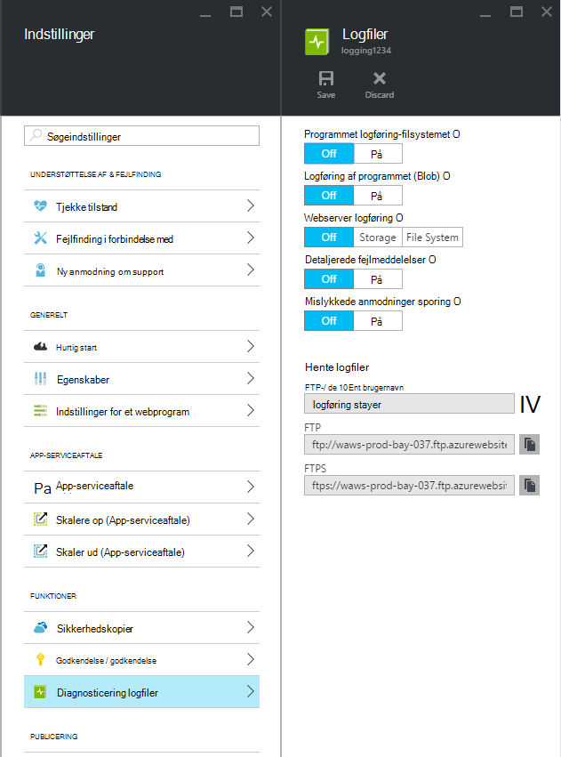
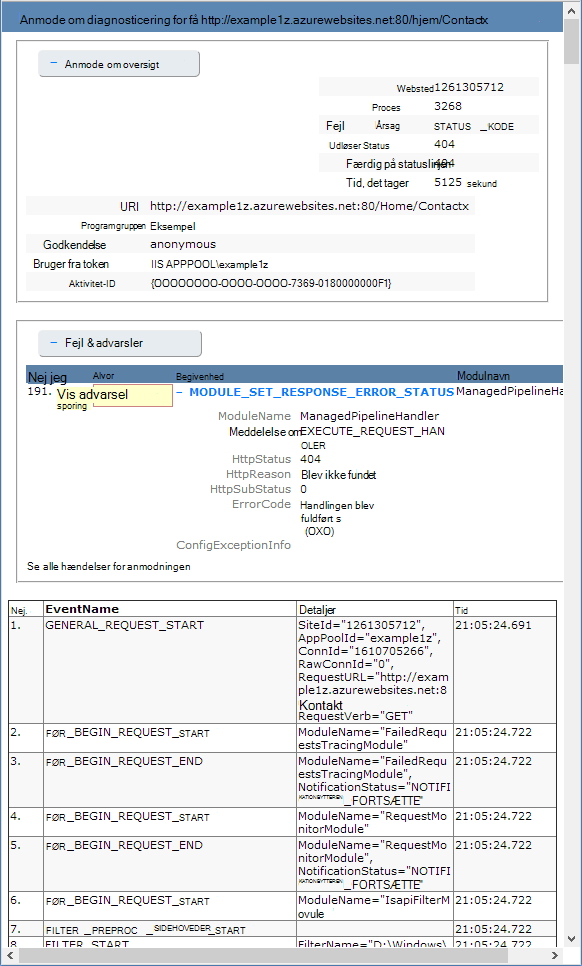

<properties
    pageTitle="Aktivere logføring af diagnosticering til webapps i Azure App Service"
    description="Lær, hvordan du kan aktivere logføring af diagnostik og føje instrumentation til dit program, samt hvordan du kan få adgang til de oplysninger, der er logget af Azure."
    services="app-service"
    documentationCenter=".net"
    authors="cephalin"
    manager="wpickett"
    editor="jimbe"/>

<tags
    ms.service="app-service"
    ms.workload="na"
    ms.tgt_pltfrm="na"
    ms.devlang="na"
    ms.topic="article"
    ms.date="06/06/2016"
    ms.author="cephalin"/>

# Aktivere logføring af diagnosticering til webapps i Azure App Service

## Oversigt

Azure leverer indbyggede diagnosticering for at hjælpe med fejlfinding en [App Service WebApp](http://go.microsoft.com/fwlink/?LinkId=529714). I denne artikel lærer du, hvordan du kan aktivere logføring af diagnostik og føje instrumentation til dit program, samt hvordan du kan få adgang til de oplysninger, der er logget af Azure.

I denne artikel bruges [Azure-portalen](https://portal.azure.com), Azure PowerShell og Azure kommandolinjen (Azure CLI) til at arbejde med diagnosticeringslogfiler. Du kan finde oplysninger om at arbejde med diagnosticeringslogfiler ved hjælp af Visual Studio [Fejlfinding i forbindelse med Azure i Visual Studio](web-sites-dotnet-troubleshoot-visual-studio.md).

[AZURE.INCLUDE [app-service-web-to-api-and-mobile](../../includes/app-service-web-to-api-and-mobile.md)]

## Web server diagnosticerings- og programmet diagnosticering

App Service webapps giver diagnosticering funktionalitet for oplysninger om logføring fra både Webserveren og webprogrammet. Disse er logisk adskilt i **web server diagnosticerings** - og **programmet diagnosticering**.

### Web server diagnosticering

Du kan aktivere eller deaktivere følgende typer af logfiler:

- **Detaljeret logføring af fejl** – detaljerede fejloplysninger for HTTP statuskoder, der angiver en fejl (statuskode 400 eller nyere). Dette kan indeholde oplysninger, der kan hjælpe med at finde ud af, hvorfor serveren returnerede fejlkoden.
- **Mislykkedes sporing af anmodning** - detaljerede oplysninger om mislykkede anmodninger, herunder en sporing af de IIS-komponenter, der bruges til at behandle anmodningen og den tid i hver komponent. Det kan være nyttigt, hvis du forsøger at øge webstedsydeevne eller isolere, hvad der forårsager en bestemt HTTP-fejl, der skal returneres.
- **Web Server logføring** - oplysninger om HTTP transaktioner med [W3C udvidet logon-filformat](http://msdn.microsoft.com/library/windows/desktop/aa814385.aspx). Dette er nyttigt, når du bestemmer overordnede websted målepunkter som antallet af anmodninger om håndteres, eller hvor mange anmodninger er fra en bestemt IP-adresse.

### Programmet diagnosticering

Programmet diagnosticering gør det muligt at registrere oplysninger, der er oprettet med et webprogram. ASP.NET-programmer kan bruge klassen [System.Diagnostics.Trace](http://msdn.microsoft.com/library/36hhw2t6.aspx) til at logge oplysninger programmets diagnosticering logfil. Eksempel:

    System.Diagnostics.Trace.TraceError("If you're seeing this, something bad happened");

Du kan hente disse logfiler med hjælp til fejlfinding på kørselstidspunktet. Se [fejlfinding i forbindelse med Azure webapps i Visual Studio](web-sites-dotnet-troubleshoot-visual-studio.md)kan finde flere oplysninger.

App Service Onlines også logge installationsoplysninger, når du publicerer indhold til en WebApp. Dette sker automatisk, og der er ingen konfigurationsindstillinger for installation logføring. Installation logføring giver dig mulighed at finde ud af, hvorfor en installation mislykkedes. Hvis du bruger et brugerdefineret installation script, kan du bruge installation logføring til at finde ud af, hvorfor scriptet går ned.

## Sådan aktiveres diagnosticering

Gå til bladet for din online for at aktivere diagnosticering i [Azure-portalen](https://portal.azure.com), og klik på **Indstillinger > diagnosticering logge**.

<!-- todo:cleanup dogfood addresses in screenshot -->

Når du aktiverer **programmet diagnosticering** kan du også vælge **niveau**. Denne indstilling kan du filtrere de oplysninger, der hentes til **orientering**, **Advarsel** eller **fejlmeddelelse** oplysninger. Værdien indstilles til **detaljeret** logfører alle oplysninger, der er oprettet med programmet.

> [AZURE.NOTE] I modsætning til ændring af filen web.config, at aktivere programmet diagnosticering eller ændre diagnosticeringsloggene niveauer ikke Papirkurv på app-domæne, at programmet kører i.

I fanen [Klassisk portal](https://manage.windowsazure.com) Web app **Konfigurer** kan du vælge **lagerplads** eller **filsystemet** for **webserver logføring**. Valg af **lagerplads** , kan du vælge en lagerplads konto og derefter en blob beholder loggene kan skrives til. Alle andre logfiler for **webstedet diagnosticering** skrives til filsystemet kun.

Fanen [Klassisk portal](https://manage.windowsazure.com) Web app **Konfigurer** har også yderligere indstillinger for programmet diagnosticering:

* **Filsystem** – gemmer diagnosticering programoplysninger til web app-filsystemet. Disse filer kan åbnes af FTP eller hentet som et Zip-arkiv ved hjælp af Azure PowerShell eller Azure kommandolinjen (Azure CLI).
* **Table storage** - gemmer diagnosticering programoplysninger i det angivne Azure lagerplads konto og tabellen navn.
* **Blob-lager** - gemmer programmet diagnosticering oplysningerne i den angivne Azure lagerplads konto og blob beholder.
* **Opbevaringsperiode** - som standard logge automatisk slettes ikke fra **blob-lager**. Vælg **Angiv opbevaring** og Angiv antallet dage til at holde logfiler, hvis du vil slette automatisk logge.

>[AZURE.NOTE] Hvis du [genoprette kontoen lagerplads access-taster](storage-create-storage-account.md#view-copy-and-regenerate-storage-access-keys), du skal nulstille den respektive logføring konfiguration bruge tasterne opdateret. Sådan gør du:
>
> 1. Angiv de respektive logføringsfunktionen til **fra**fanen **Konfigurer** . Gem din indstilling.
> 2. Aktivere logføring til lagerplads konto blob eller tabel igen. Gem din indstilling.

En vilkårlig kombination af filsystem, tabellagring eller blob-lager kan aktiveres på samme tid, og have individuelle log niveau konfigurationer. For eksempel kan du logge fejl og advarsler til blob storage sigt logføring, samtidig med at fil system logføring med et niveau af detaljeret.

Alle tre lagerplads placeringer giver de samme grundlæggende oplysninger om registrerede hændelser, log **tabellagring** og **blob-lager** yderligere oplysninger såsom forekomst-ID, tråd-ID og en mere detaljeret tidsstempel (aksemærker format) end logføring til **filsystem**.

> [AZURE.NOTE] Oplysninger, der er gemt i **tabellagring** eller **blob-lager** kan kun åbnes ved hjælp af en lagerplads-klient eller et program, der kan arbejde med disse lagerplads systemer direkte. For eksempel Visual Studio 2013 indeholder en lagerplads Stifinder, der kan bruges til at udforske tabel eller blob-lager, og HDInsight kan få adgang til data, der er gemt i blob-lager. Du kan også skrive et program, der har adgang til Azure-lager ved hjælp af [Azure SDK'er](/downloads/#).

> [AZURE.NOTE] Diagnosticering kan også være aktiveret fra Azure PowerShell ved hjælp af cmdlet'en **Set-AzureWebsite** til. Hvis du ikke har installeret Azure PowerShell eller ikke har konfigureret den til at anvende abonnementet Azure, se, [hvordan du bruger Azure PowerShell](/develop/nodejs/how-to-guides/powershell-cmdlets/).

##Sådan: hente logfiler

Diagnostiske oplysninger, der er gemt til web app-filsystemet kan åbnes direkte ved hjælp af FTP. Det kan hentes som et Zip-arkiv med Azure PowerShell eller kommandolinjen Azure.

Mappestrukturen, som gemmes loggene i er som følger:

* **Logfiler over program** - /LogFiles/programmer /. Denne mappe indeholder en eller flere tekstfiler, som indeholder de oplysninger, der er oprettet med programmet logføring.

* **Mislykkedes anmodning sporinger** - / LogFiles/W3SVC ### /. Denne mappe indeholder en XSL-fil og en eller flere XML-filer. Sørg for, at du henter XSL-filen til samme mappe som XML filen/filerne, fordi XSL-filen indeholder funktioner til formatering og filtrere indholdet af XML-filerne, når de vises i Internet Explorer.

* **Detaljeret Fejllogge** - /LogFiles/DetailedErrors /. Denne mappe indeholder en eller flere .htm-filer med omfattende oplysninger om HTTP-fejl, der er opstået.

* **Logfiler over web Server** - /LogFiles/http/RawLogs. Denne mappe indeholder en eller flere filer, der er formateret med [W3C udvidet logon-filformat](http://msdn.microsoft.com/library/windows/desktop/aa814385.aspx).

* **Installation logfiler over** - / LogFiles/ciffer. Denne mappe indeholder logfiler, der genereres af de interne installationsprocesser, der bruges af Azure webapps samt logfiler til ciffer installationer.

### FTP

Gå til **Dashboard** for din online i [Klassisk portal](https://manage.windowsazure.com)for at få adgang til diagnostiske oplysninger ved hjælp af FTP. Brug linket **FTP-diagnosticeringslogfiler** til at få adgang til de logfiler, ved hjælp af FTP i sektionen **Oversigt over** . Posten **Installation/FTP bruger** viser navnet på bruger, der skal bruges til at få adgang til FTP-webstedet.

> [AZURE.NOTE] Hvis posten **Installation/FTP bruger** ikke er angivet, eller du har glemt adgangskoden til denne bruger, kan du oprette en ny bruger og en adgangskode ved hjælp af linket **nulstille installation legitimationsoplysninger** i sektionen **Oversigt over** i **Dashboard**.

### Hente med Azure PowerShell

Starte en ny forekomst af Azure PowerShell for at hente logfilerne, og brug følgende kommando:

    Save-AzureWebSiteLog -Name webappname

Dette vil gemme logfiler til den web-app, der er angivet af den **-navn** -parameter til en fil med navnet **logs.zip** i den aktuelle mappe.

> [AZURE.NOTE] Hvis du ikke har installeret Azure PowerShell eller ikke har konfigureret den til at anvende abonnementet Azure, se, [hvordan du bruger Azure PowerShell](/develop/nodejs/how-to-guides/powershell-cmdlets/).

### Hente med Azure kommandolinjen

Åbn en ny kommandoprompt, PowerShell, Fest eller Terminal session for at hente de logfiler, ved hjælp af grænsefladen Azure kommandoen linje, og Skriv følgende kommando:

    azure site log download webappname

Dette vil gemme logfiler til den online med navnet 'webappname' til en fil med navnet **diagnostics.zip** i den aktuelle mappe.

> [AZURE.NOTE] Hvis du ikke har installeret kommandolinjen Azure (Azure CLI) eller ikke har konfigureret den til at anvende abonnementet Azure, se, [hvordan du bruger Azure CLI](../xplat-cli-install.md).

## Sådan: Vis logfiler i programmet indsigt

Visual Studio programmet indsigt indeholder værktøjer for filtrering og søgning logfiler og for korrelere logfiler med anmodninger om og andre begivenheder.

1. Føje programmet indsigt SDK til dit projekt i Visual Studio.
 * Højreklik på dit projekt i Solution Explorer, og vælg Tilføj programmet indsigt. Vejledes du gennem trin, der omfatter oprettelse af en programmet indsigt ressource. [Lær mere](../application-insights/app-insights-asp-net.md)
2. Føje sporing lytteren pakken til projektet.
 * Højreklik på dit projekt, og vælg Administrer NuGet pakker. Vælg `Microsoft.ApplicationInsights.TraceListener` [Få mere at vide](../application-insights/app-insights-asp-net-trace-logs.md)
3. Overfør dit projekt, og kør den for at generere logdata.
4. Gå til din nye programmet indsigt ressource i [Azure-portalen](https://portal.azure.com/), og Åbn **søgning**. Du får vist dataene log sammen med anmodningen, brug og andre telemetri. Nogle telemetri kan tage et par minutter ankommer: Klik på Opdater. [Lær mere](../application-insights/app-insights-diagnostic-search.md)

[Få flere oplysninger om ydeevnen registrering med programmet indsigt](../application-insights/app-insights-azure-web-apps.md)

##Sådan: streame logfiler

Mens du udvikle et program, er det ofte nyttigt at se oplysninger om logføring i nær realtid. Dette kan gøres ved streaming logføringsoplysninger til dit udviklingsmiljø ved hjælp af Azure PowerShell eller kommandolinjen Azure.

> [AZURE.NOTE] Visse typer logføring bufferen skrive logfil, hvilket kan medføre defekt begivenheder i strømmen. For eksempel en programpost logfil, der opstår, når en bruger besøger en side vises muligvis i strømmen før den tilsvarende HTTP log-posten for sideanmodning.

> [AZURE.NOTE] Log streaming også streame oplysninger, der er skrevet i en hvilken som helst tekstfil, der er gemt i den **D:\\privat\\LogFiles\\ ** mappe.

### Streaming med Azure PowerShell

At streame logføringsoplysninger, starte en ny forekomst af Azure PowerShell og bruge følgende kommando:

    Get-AzureWebSiteLog -Name webappname -Tail

Dette vil oprette forbindelse til den web-app, der er angivet af den **-navn** parameter og begynde at streaming oplysninger til vinduet PowerShell, som loghændelser indtræffer på WebApp. Nogle af de oplysninger, der er skrevet til filer, der ender med .txt, .log eller .htm, der er gemt i mappen /LogFiles (d:/hjem/logfiles) der sendes til den lokale konsol.

Hvis du vil filtrere bestemte hændelser, som fejl, kan du bruge den **-meddelelse** parameter. Eksempel:

    Get-AzureWebSiteLog -Name webappname -Tail -Message Error

Hvis du vil filtrere specifikke logfil typer, som HTTP, bruge den **-sti** parameter. Eksempel:

    Get-AzureWebSiteLog -Name webappname -Tail -Path http

Hvis du vil se en liste over tilgængelige stier, skal du bruge parameteren - ListPath.

> [AZURE.NOTE] Hvis du ikke har installeret Azure PowerShell eller ikke har konfigureret den til at anvende abonnementet Azure, se, [hvordan du bruger Azure PowerShell](/develop/nodejs/how-to-guides/powershell-cmdlets/).

### Streaming med Azure kommandolinjen

Til at streame logføringsoplysninger, Åbn en ny kommandoprompt, PowerShell, Fest eller Terminal session, og Skriv følgende kommando:

    azure site log tail webappname

Dette vil oprette forbindelse til den online med navnet 'webappname' og begynde at streaming oplysninger til vinduet, som loghændelser indtræffer på WebApp. Nogle af de oplysninger, der er skrevet til filer, der ender med .txt, .log eller .htm, der er gemt i mappen /LogFiles (d:/hjem/logfiles) der sendes til den lokale konsol.

Hvis du vil filtrere bestemte hændelser, som fejl, kan du bruge den **– Filter** parameter. Eksempel:

    azure site log tail webappname --filter Error

Hvis du vil filtrere specifikke logfil typer, som HTTP, bruge den **– stien** parameter. Eksempel:

    azure site log tail webappname --path http

> [AZURE.NOTE] Hvis du ikke har installeret kommandolinjen Azure, eller du ikke har konfigureret den til at anvende abonnementet Azure, se, [hvordan til at bruge Azure kommandolinjen](../xplat-cli-install.md).

##Sådan: forstå diagnosticering logfiler

### Programmet diagnosticering logfiler

Programmet diagnosticering gemmer oplysninger i et bestemt format for .NET-programmer, afhængigt af om du gemme logfiler til filsystemet, tabellagring eller blob-lager. Det grundlæggende sæt af data, der gemmes er den samme på tværs af alle tre lagerplads typer - datoen og klokkeslættet for hændelsen indtraf, proces-ID'ET, der produceret begivenheden, hændelsestype (oplysninger, advarsel, fejl), og meddelelsen begivenhed.

__Filsystemet__

Hver linje logget filsystemet eller modtaget ved hjælp af streaming bliver i følgende format:

    {Date}  PID[{process id}] {event type/level} {message}

For eksempel ville hændelsen fejl vises som følger:

    2014-01-30T16:36:59  PID[3096] Error       Fatal error on the page!

Logføring til filsystemet indeholder de mest grundlæggende oplysninger af tre tilgængelige metoder, giver kun tid, proces-id, begivenhed niveau og meddelelse.

__Tabellagerplads__

Når logføring til table storage, der yderligere egenskaber, der bruges til at det er nemmere at søge efter data, der er gemt i den tabel, samt mere detaljerede oplysninger om begivenheden. Følgende egenskaber (kolonner) bruges til de enkelte objekter (række), der er gemt i tabellen.

Egenskabsnavn|Værdiformat /
---|---
PartitionKey|Dato og klokkeslæt for hændelsen i yyyyMMddHH format
RowKey|En GUID-værdi, der entydigt identificerer dette objekt
Tidsstempel|Dato og klokkeslæt, hvor hændelsen indtraf
EventTickCount|Dato og klokkeslæt, hvor hændelsen indtraf i aksemærker format (større præcision)
ApplicationName|Web app-navn
Niveau|Begivenhed niveau (fx fejl, advarsel, oplysninger)
Begivenhedid|Denne hændelse begivenhed ID

Standardværdien er 0, hvis der ikke angivet
InstanceId|Forekomst af den web-app, som den lige forekom på
Personlige id|Proces-ID
Tid|Den tråd, der produceret begivenheden tråd ID
Meddelelse|Meddelelse om hændelse detaljer

__BLOB-lager__

Når logføring til at blob storage, gemmes data i kommaseparerede værdier (CSV)-format. Ligner tabellagring, logføres ekstra felter for at give mere detaljerede oplysninger om begivenheden. Følgende egenskaber bruges for hver række i CSV:

Egenskabsnavn|Værdiformat /
---|---
Dato|Dato og klokkeslæt, hvor hændelsen indtraf
Niveau|Begivenhed niveau (fx fejl, advarsel, oplysninger)
ApplicationName|Web app-navn
InstanceId|Forekomst af den web-app, begivenheden finder sted i
EventTickCount|Dato og klokkeslæt, hvor hændelsen indtraf i aksemærker format (større præcision)
Begivenhedid|Denne hændelse begivenhed ID

Standardværdien er 0, hvis der ikke angivet
Personlige id|Proces-ID
Tid|Den tråd, der produceret begivenheden tråd ID
Meddelelse|Meddelelse om hændelse detaljer

De data, der er gemt i en blob se ud som følger:

    date,level,applicationName,instanceId,eventTickCount,eventId,pid,tid,message
    2014-01-30T16:36:52,Error,mywebapp,6ee38a,635266966128818593,0,3096,9,An error occurred

> [AZURE.NOTE] Den første linje i loggen skal indeholde kolonneoverskrifterne, som repræsenteret i dette eksempel.

### Mislykkedes anmodning sporinger

Kunne ikke udføre anmodningen sporinger gemmes i XML-filer med navnet __fransk ### .xml__. Hvis du vil gøre det nemmere at få vist de registrerede oplysninger, leveres en XSL-typografiark med navnet __freb.xsl__ i den samme mappe som XML-filer. Åbne en XML-filer i Internet Explorer anvender XSL-typografiark til at give en formaterede visning af sporingsoplysningerne. Dette vises som følger:

### Detaljeret fejllogge

Detaljerede fejllogge er HTML-dokumenter, som giver mere detaljerede oplysninger på http-fejl, der er opstået. Da de er blot HTML-dokumenter, kan de ses via en webbrowser.

### Web server logfiler

Loggene web server er formateret med [W3C udvidet logon-filformat](http://msdn.microsoft.com/library/windows/desktop/aa814385.aspx). Disse oplysninger kan læses, ved hjælp af et tekstredigeringsprogram eller parses ved hjælp af funktioner som [Log-parseren](http://go.microsoft.com/fwlink/?LinkId=246619).

> [AZURE.NOTE] Loggene produceret af Azure Online understøtter ikke felterne __s-computernavn__, __s-IP-adresse__eller __cs-version__ .

##Næste trin

- [Hvordan du kan overvåge Webapps](/manage/services/web-sites/how-to-monitor-websites/)
- [Fejlfinding i forbindelse med Azure webapps i Visual Studio](web-sites-dotnet-troubleshoot-visual-studio.md)
- [Analysere online logger på HDInsight](http://gallery.technet.microsoft.com/scriptcenter/Analyses-Windows-Azure-web-0b27d413)

> [AZURE.NOTE] Hvis du vil komme i gang med Azure App Service før tilmelding til en Azure-konto, skal du gå til [Prøve App Service](http://go.microsoft.com/fwlink/?LinkId=523751), hvor du straks kan oprette en forbigående starter WebApp i App-tjeneste. Ingen kreditkort, der kræves. ingen forpligtelser.

## Hvad er ændret
* Finde en vejledning til ændring fra websteder til App-tjenesten: [Azure App Service og dets indvirkning på eksisterende Azure Services](http://go.microsoft.com/fwlink/?LinkId=529714)
* Finde en vejledning til ændring af portalen gamle til den nye portal: [Reference til at navigere i portalen Azure](http://go.microsoft.com/fwlink/?LinkId=529715)
 
