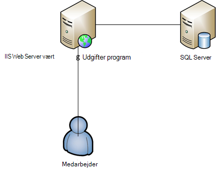

<properties 
    pageTitle="Azure-App-Web Apps servicetilbud til Enterprise" 
    description="Viser, hvordan du bruger Azure App Service Web Apps til at oprette enterprise websted løsninger til din virksomhed" 
    services="app-service\web" 
    documentationCenter="" 
    authors="apwestgarth" 
    manager="wpickett" 
    editor=""/>

<tags 
    ms.service="app-service-web" 
    ms.workload="web" 
    ms.tgt_pltfrm="na" 
    ms.devlang="na" 
    ms.topic="article" 
    ms.date="07/29/2016" 
    ms.author="anwestg"/>

# Azure-App-Web Apps servicetilbud for Enterprise-hvidbog #

Er nødvendigheden at reducere omkostninger og levere IT-løsninger, der er hurtigere i et hurtigt skiftende miljø opretter nye udfordringer for udviklere, IT-fagfolk og administratorer. Brugerne leder stigende efter deres linje for Business (LOB) webprogrammer skal være hurtig, svarede og er tilgængelig fra enhver enhed. Virksomheder, der forsøger at udnytte øget produktivitet og effektivitet, der kommer fra integration med skyen og mobile-tjenester på samme tid, det kan være noget så enkelt som single sign-on – på tværs af enheder, der bruger Active Directory til samarbejde i Office 365 ved hjælp af data, der er trukket fra et internt LOB-program, der også henter data fra virksomhed implementeringen af Salesforce. [Azure App Service Web Apps](http://go.microsoft.com/fwlink/?LinkId=529714) er en professionel skybaseret tjeneste til udvikling, test og kører web og mobilprogrammer, Web API'er og generisk websteder. Det kan bruges til at køre virksomhedens websteder, intranetsteder, virksomheder-apps og digitale marketingkampagner på et globalt netværk af datacentre, der er optimeret til skala og tilgængelighed, sammen med understøttelse af fortløbende integration og moderne DevOps fremgangsmåder.  

Denne hvidbog fremhæver funktionerne i tjenesten [Web Apps](/services/app-service/web/) specifikt fokuseret på kører LOB webprogrammer, som dækker overførsel af eksisterende webprogrammer og installation af nye LOB webprogrammer på platformen. 

## Målgruppe ##

IT-fagfolk, arkitekter og ledere leder til at overføre til skyen web-arbejdsbelastninger, som i øjeblikket kører i det lokale miljø. Web arbejdsbelastninger kan dække enten Business til medarbejder eller Business til partnere webprogrammer.

## Introduktion ##

App-tjenesten Web Apps er en ideel platform som vært både eksterne og interne web-programmer og tjenester, som det er en økonomisk, meget SVG, administrerede løsning, så du kan fokusere på levere forretningsværdi for dine brugere i stedet for at bruge betydeligt mængde tid, og de penge bevare og understøttende adskille miljøer. Web Apps giver en fleksibel platform, som du vil installere dine enterprise webprogrammer giver mulighed for at fortsætte med at godkende mod lokale Active Directory via integration med Microsoft Azure Active Directory, understøtter af nemt og hurtigt installationer gøre brug af din interne fortløbende integration og implementering fremgangsmåder, mens du automatisk skalering for at vokse med forretningsbehov – alt sammen på en administreret platform, som giver dig mulighed for at fokusere på dit program og ikke infrastrukturen. 

## Definition af problem ##

IT-liggende ændrer hurtigt, skal du benytte tjenester, skaleres automatisk til at håndtere Indlæs med en overgang væk fra vært på traditionelle servere med deres høj kapital omkostninger på lang leveringstider til en, der bruger efter behov. IT-afdelinger, blive bedt at reducere omkostningerne og miljøet for infrastruktur og vedligeholdelse bruger med fokus på at reducere Capex for indkøb mens også øget fleksibilitet. Slutningen af aktivets levetid ældre infrastruktur platforme, som Windows Server 2003, er foranstillede IT-afdelinger Gennemse skyen overførsel som en mulig måde at undgå nye langtidsaftale udgifter. Tidligere ville CIO'er få beslutninger omkring indkøb til andre afdelinger men stadig CMOs og andre business enhed hoveder tager en mere aktiv rolle i hvordan deres budget er brugt, og hvad er afkast af deres investeringer. Stadig flere virksomheder har behov for deres medarbejdere skal være langt mere mobile end nogensinde før med medarbejderne arbejde fra en fjernplacering, bruge mere tid med kunder, der er brug for adgang til systemer besvær gratis.

Business behov ændres månedligt, ugentligt, dagligt. Virksomheder, der søger efter Chat globale Skaler med almindelige opdaterede oplysninger om tjenesterne fyldt med nye funktioner, der er angivet af en tredjepart eller internt.  I nogle tilfælde virksomheder også søger efter funktionerne til at isolere deres programmer og få adgang til ressourcer samtidig også gøre brug af offentlige skyen facilitet. Brugere har højere forventninger med mange gør brug af tjenester i deres egen private liv som Office 365. De forventer at have adgang til lignende, altid er opdateret funktion omfattende services i deres arbejde levetid. At imødegå denne demand IT skal services udseende for at business til at aktivere denne gennem markering og integration med fra tredjepart, forsigtig markeringen af platforme, som kan tilpasse til forretningsbehov, samtidig også blive pålidelig med en samlede reducerede omkostninger.

Udviklingsteams er interesseret i at levere øjeblikkelig virksomhedens fordele, levere nye funktioner hyppigt. De søger efter en rentable og pålidelig platform, der integreres med deres eksisterende værktøjer og fremgangsmåder – udvikling, test, slip; og arbejde sammen med IT-afdelinger automatisere implementering, administration og advarer, alt sammen med formålet med nul nedetid.

<a href="highlevel" />
## Høj niveau løsning ##

Web platforme og rammer bliver stadig brugt til at udvikle, teste og være vært for line of business-applikationer.  Med en typisk linje med forretningsprogram, som et internt medarbejder udgifter system, ofte der kun består af en WebApp med en sikkerhedskopiering database til at gemme de data, der er forbundet med programmet.

App Service Web Apps er et godt valg til vært sådanne programmer med tilbud om SVG og pålidelig infrastruktur, der administreres og installeret for at udbedre med nær nul manuel handling og nedetid. Microsoft Azure-platform indeholder mange indstillinger for lagring af data til at understøtte webprogrammer baseret på Web Apps fra Microsoft Azure SQL Database, en administreret SVG relationel database-som-en-tjeneste, til populære-tjenester fra vores partnere som ClearDB MySQL-Database og MongoDB.

En alternativ metode er at gøre brug af din eksisterende investering lokalt. I dette eksempel scenario, et system til udgifter, kan du vil bevare dit datalager i din egen interne infrastruktur. Det kan skyldes integration med interne systemer (rapportering, løn, fakturering osv.) eller for at tilfredsstille kravet en IT-styring.  Web Apps indeholder en række metoder til at gøre det muligt at oprette forbindelse til infrastrukturen på det lokale miljø:

- [App Service miljøer](app-service-app-service-environment-intro.md) - App Service miljøer (ASE) er en ny Premium funktion som for nylig blev føjet til Microsoft Azure-App-servicetilbud.  ASEs giver et fuldt isolerede og dedikeret miljø til at køre sikkert Azure App Service apps skaleres til høj mens tilbyder også isolationsniveauet og sikker netværksadgang   
- [Hybrid forbindelser](../biztalk-services/integration-hybrid-connection-overview.md) – Hybrid forbindelser er en funktion i Microsoft Azure BizTalk Services og aktivere Web Apps til at oprette forbindelse til lokale ressourcer sikkert, for eksempel SQL Server, MySQL, Web API'er og brugerdefineret web-tjenester. 
- [Virtuel Network Integration](https://azure.microsoft.com/blog/2014/09/15/azure-websites-virtual-network-integration/) – Web Apps-integration med Azure virtuelt netværk kan du forbinde din online til en virtuel Azure netværk, som også kan være forbundet med infrastrukturen til lokale via en VPN til-websted. 

Følgende diagrammer viser et eksempel på højt niveau løsning med connectivity indstillinger for lokale ressourcer.  Det første eksempel viser, hvordan det kan ske ved hjælp af standardfunktioner Azure App-tjenesten og andet viser, hvordan det kan være opnået med premium med tilbud App Service miljøer.

Ved hjælp af Standard App Service funktioner:

Ved hjælp af en App Service-miljø:

## Business fordele ##

App Service Web Apps giver en lang række business fordele som dit funktion skal være meget mere økonomisk og fleksible i levering til forretningsbehov aktiveres. 

### PaaS Model ###

App Service Web Apps er bygget på en Platform som en tjeneste-model, som indeholder en række omkostninger og effektivitet sparer.  Ikke længere har du brug at bruge en masse timer administrere FOS, rettelse af operativsystemer og rammer. Web Apps er et automatisk opdateret miljø, som gør det muligt at fokusere på administrere webprogrammer og ikke FOS, at forlade teams til at angive yderligere forretningsværdi.

PaaS modellen understøtter Web Apps giver mulighed for læger af DevOps metode til at opfylde deres mål. Som en virksomhed betyder det fuld administration og integration i hele programmets hele livscyklus, herunder udvikling, test, version, overvågning og administration og support. 

For udviklingsteams, kan kontinuerlig integration og implementering arbejdsprocesser konfigureres fra Visual Studio Team Services, GitHub, TeamCity, Hudson eller BitBucket, aktivering af automatiseret build, test og aktivere hurtigere release skifter samtidig med at reducere friktionen involveret i sluppet i eksisterende infrastruktur-installation. Web Apps også understøtter oprettelse af flere test og arrangere miljøer for arbejdsprocessen udgave, ikke længere behøver at reservere eller tildele hardware til disse formål, kan du oprette så mange miljøer, som du vil og definere dine egne reklame for at frigøre arbejdsproces. Fremme en fase slot som en virksomhed, kan du beslutter at slippe en test slot fra versionsstyring, skal du udføre en række af test og efter vellykket gennemførelse og til sidst Ombyt fremstilling uden nedetid med en ekstra fordel, webprogrammer baseret på Web Apps er forudinstalleret og varmt får den bedste mulige kundeoplevelse.  Virksomheder, der kan desuden gøre brug af tester i fremstilling funktionerne i App-tjenesten Web Apps til at dirigere en sektion af trafik til en anden slot, validere ændringerne, før du skifter al trafik til den nye installation eller vende tilbage al trafik til den forrige installation. 

Handlinger teams kan føler dig tryg, at de er den bedst mulige placering til at reagere på eventuelle problemer med en af deres webprogrammer, der er baseret på Web Apps med det indbyggede i overvågning og beskeder funktioner. Handlinger Teams bør har allerede investeret i analyser og sådanne fra Microsoft Visual Studio programmet viden, nye Relic og AppDynamics overvågning løsninger. Disse understøttes også fuldt ud på Web Apps aktivere løbende og en velkendte miljøer, du vil overvåge dine webprogrammer fra.

Til sidst skal Onlines indeholder funktioner til automatisk at sikkerhedskopiere dine app(s) og tilknyttede databaser direkte til en objektbeholder Azure Blob-lager. Giver dig en nem måde og meget omkostninger effektiv metode, som du vil gendanne efter nedbrud, reducere behovet for komplekst på lokale hardware og software.

### Øget overførsel ###

Vedligeholdelse af hardware og rotation er en vigtig ting til virksomheder, som release skifter til hardware og operativsystemer hurtigere. Måske har du en antallet af Windows Server 2003 R2 servere, der kommer til slutningen af support i 2015, men de er stadig vært vigtige webprogrammer til din virksomhed? App Service Web Apps er en god kandidat som vært disse webprogrammer og for dig at rationaliseres business hardware ejendom. Web Apps giver dig adgang til et område af hardwarespecifikationer, som administreres og vedligeholdes som en del af tjenesten, så du ikke behøver med forhold i stedet og af administrationsomkostninger som en del af dit infrastruktur budget.  Overførsel kan være noget så enkelt som en kopi og indsætte handling fra din eksisterende installation til Web Apps eller en mere kompleks migrering, hvor bruge Web Apps-overførsel assistenten føjer værdi. Overførte webprogrammer få glæde af hele spektret af Azure services, integration af flere tjenester til webprogrammerne. For eksempel kan du overveje at tilføje Azure Active Directory for at styre adgangen til dit program, der er baseret på brugeres tilknytning til sikkerhedsgrupper. Et andet eksempel kan tilføje Cache Services til at forbedre ydeevnen og reducere ventetid, forudsat at bedre overordnede brugeroplevelsen. 

### Vært for Enterprise klasse ###

App Service Web Apps giver en stabil og pålidelig platform, som blev endnu skal fra small interne udvikling og test arbejdsbelastninger, meget skalerede høj trafik websteder skal kunne håndtere en lang række business. Ved hjælp af Web Apps, gør du brug af den samme virksomhed klasse hosting platform, som Microsoft, som anvender en virksomhed til høj værdi web arbejdsmængder. Webapps, sammen med alle tjenester på Azure-platformen, er oprettet med sikkerhed og overholdelse af lovbestemmelser, som ISO (ISO/IEC 27001:2005) Se [http://aka.ms/azurecompliance](/support/trust-center/compliance/), SOC1 og SOC2 SSAE 16/ISAE 3402 attester, HIPAA BAA, PCI og Fedramp essensen af hvert element og funktion, du kan finde flere oplysninger. 

Microsoft Azure platform kan rolle baseret godkendelse kontrolelementer aktivere enterprise niveauer af kontrolelementet til ressourcer i Web Apps. RBAC giver virksomheder mulighed for at implementere deres egne politikker for administration af adgang til alle deres aktiver i Azure-miljøet ved at tildele brugere til grupper og tildele igen de nødvendige tilladelser til disse grupper mod aktiv som en web-app. Du kan finde flere oplysninger om RBAC i Azure, [http://aka.ms/azurerbac](../active-directory/role-based-access-control-configure.md). Ved at benytte Web Apps, kan du være sikker på, at dine Webprogrammer er implementeret i et sikkert miljø, og du har fuld kontrol til hvilket område dine aktiver er installeret. 

Azure App Service miljøer [http://aka.ms/aseintro](http://aka.ms/aseintro) er en ny premium service plan mulighed for enterprise-kunder, der ønsker at gøre brug af Azure App Service, og disse giver et fuldt isolerede og dedikeret miljø.  Dette gør det muligt for enterprise-kunder at implementere programmer, der kan drage fordel af meget høj skala samtidig også har fuld kontrol over indgående og udgående netværkstrafik, og ASEs kan programmer har høj hastighed sikre forbindelser via virtuelt Network til lokale ressourcer.

App Service Webapps er også kunne bruge alle dine til lokale investeringer ved at tilbyde muligheden for at oprette forbindelse tilbage til dine interne ressourcer, som dine datawarehouse eller SharePoint-miljø. Som beskrevet i [høj grad løsning](#highlevel) kan du gøre brug af Hybrid forbindelser og virtuelle netværksforbindelsen til at oprette forbindelser til lokale infrastruktur og tjenester.

### Global skala ###

App Service Web Apps er en global og SVG platform, så dine webprogrammer til vokser og tilpasse til behovet i en virksomhed i vækst hurtigt og med minimale langtidsaftale planlægning og omkostninger. I typisk på lokale infrastruktur scenarier, udvidelse og stigning i demand både lokalt og geografisk ville kræver en stor mængde administration, planlægning og udgifter at blive klargjort og administrere ekstra infrastruktur til. Web Apps giver mulighed for at tilpasse dine webprogrammer med ebb og strømmen af dine behov. For eksempel ved hjælp af udgifter programmet som et eksempel i fleste månedens er brugerne light brugere af programmet, men som deadline hver måned for udgifter anmodninger skal angives og forøges på dit program, Web Apps har mulighed for automatisk at klargøre flere infrastruktur for dit program og derefter når Brug har subsided igen den kan skalere tilbage til den oprindelige infrastruktur, du definerer.

Web Apps findes globalt i 24 datacentre i hele verden og voksende. Du kan finde den mest opdaterede liste over områder og placering, [http://aka.ms/azlocations](http://aka.ms/azlocations). Med Web Apps, kan din virksomhed nemt opnå global rækkevidde og skalering. Som virksomheden vokser i nye regioner, rapportering programmet dashboards, som du bruger og -vært på Web Apps kan nemt skal installeres til yderligere datacentre og fungere lokale brugere meget hurtigere ved en kombination af Web Apps og Azure trafik Manager, alle med en ekstra fordel af SVG-infrastrukturen under at kunne sammentrække og udvide som behov for regionale kontorer ændringen.
 
## Løsning detaljer ##

Lad os se på et eksempel på et program overførsel scenario. Dette viser oplysninger om hvordan App Service Web Apps-funktioner samles at angive god løsning og forretningsværdi til.
 
I dette eksempel er linjen i forretningsprogram vi diskuterer udgiftstype rapportering program, der gør det muligt for medarbejdere til at sende deres udgifter for refusion. Programmet er placeret på Windows Server 2003 R2, der kører IIS6 og databasen er en SQL Server 2005-database. Årsagen vi Vælg ældre server ligger med kommende slutningen af tjenesten til Windows Server 2003 R2 og SQL Server 2005, og vi har [værktøjer](http://aka.ms/websitesmigration) og [vejledning](http://aka.ms/websitesmigrationresources) til at overføre automatisk arbejdsbelastninger til Azure. Med dette for øje anvende mønstret i dette eksempel bruges til en bred verity af overførselsscenarier. 

### Overføre eksisterende program ###

Første trin på den overordnede løsning til at flytte en line of business programmet til Web Apps er at identificere eksisterende programmet aktiver og arkitektur. Eksemplet i dette dokument er en ASP.NET-webprogram, der er hostet på en enkelt IIS-Server med hostes på en separat SQL Server-databasen, som vist i nedenstående illustration. Medarbejdere login i systemet, ved hjælp af en kombination af brugernavn og adgangskode, de angive oplysninger om udgifter, og Overfør scannede kopier af opskrifter eller til databasen, for hvert element af omkostninger. 
 

#### Elementer, der skal overveje ####

Når overførslen program fra et lokalt miljø, kan du skal huske på, få Onlines begrænsninger. Her er nogle vigtige emner skal være opmærksom på, når du overfører webprogrammer til Web Apps ([http://aka.ms/websitesmigrationresources](http://aka.ms/websitesmigrationresources)):

-   Port bindinger – Web Apps understøtter kun port 80 til HTTP og port 443 til HTTPS-trafikken. Hvis dit program bruger enhver anden port, og derefter én gang overflyttet får programmet anvendelse af port 80 til HTTP og port 443 til HTTPS trafik. Dette er ofte et skadelige problem, som det er fælles for på lokale installationer at gøre brug af forskellige porte for at løse brugen af domænenavne, især i udvikling og test miljøer
-   Godkendelse – Web Apps understøtter anonym godkendelse som standard og formulargodkendelse som identificeret med et program. Web Apps kan tilbyde Windows-godkendelse, når programmet er integreret med Azure Active Directory og ADFS kun. Dette er en funktion, der er beskrevet mere detaljeret [her](http://aka.ms/azurebizapp) 
-   GAC baseret assemblies – Web Apps giver ikke mulighed for installation af assemblies til den globale Cache (assembly). Derfor, hvis programmet bliver overflyttet gør brug af dette lokale skal du overveje at flytte assemblies til mappen bin af programmet.
-   IIS5 Kompatibilitetstilstand – Web Apps understøtter ikke IIS5 kompatibilitetstilstand, og som sådan hver Web Apps-forekomst og alle webprogrammer under den overordnede Web Apps-forekomst kører i den samme arbejdsproces i en enkelt programgruppen.
-   Brug af COM-biblioteker – Web Apps tillader ikke registrering af COM-komponenter på platformen. Derfor Hvis programmet er gøre brug af en hvilken som helst COM-komponenter kan disse skal skrives i administreret kode og installeret med programmet.
-   ISAPI-filtre – ISAPI-filtre kan understøttes på Web Apps. De skal installeres som en del af programmet og er registreret i webprogrammet web.config-filen. Du kan finde flere oplysninger [http://aka.ms/azurewebsitesxdt](web-sites-transform-extend.md). 

Når disse emner har taget i betragtning er dit webprogram klar til skyen. Og bare rolig Hvis nogle emner ikke fuldt ud er opfyldt, overførselsværktøjet giver bedste evne til overførsel. 

De næste trin i overførselsprocessen er at oprette en App Service WebApp og Azure SQL-Database. Der er flere størrelsen på Web Apps forekomster med skiftende antal CPU kerner og RAM beløb, der er tilgængelige for dig at vælge baseret på dine web-programmer behov. For flere oplysninger og priser, skal du se [http://aka.ms/azurewebsitesskus](/pricing/details/websites/). Microsoft Azure SQL Database caters på samme måde på alle en virksomhed behov med forskellige niveauer af tjenesten og ydeevne til at opfylde krav. Yderligere oplysninger finder du på [http://aka.ms/azuresqldbskus](/pricing/details/sql-database/). Når oprettet, er overført til App-tjenesten Web Apps, enten via FTP eller WebDeploy programmet, og derefter flytte til databasen.

I denne migrering bruger løsningen Azure SQL-Database, men det er ikke den eneste database, der understøttes på Azure. Selskaber kan også gøre brug af MySQL, MongoDB, Azure DocumentDB og mange flere via tilføjelsesprogrammer, der kan købes i [Azure Store](/marketplace/partner-program/). 

Når du opretter en Azure SQL-Database er et antal indstillinger er tilgængelige til at importere en eksisterende database fra en lokal server fra opretter et script på en eksisterende database til at bruge [Data lag programmet eksportere og importere](http://aka.ms/dacpac). 

Udgifter databasen er oprettet ved at oprette en ny Azure SQL-Database, oprette forbindelse til databasen ved hjælp af SQL Server Management Studio og derefter køre et script til at opbygge databaseskema og udfylde den med data fra lokale database.

Det sidste trin i dette første trin i overførslen kræver opdatering af forbindelsesstrenge til databasen til programmet. Det kan ske via Azure-portalen. Du kan ændre programmet bestemte indstillinger, herunder en hvilken som helst forbindelsesstrenge, der anvendes af programmet til at oprette forbindelse til en database, der bruges til hver WebApp.

### Alternativer til brugen af Azure SQL-Database ###

Azure-platformen tilbyder en række alternativer til brug af Azure SQL-Database som en programmer primære webdatabase, er at aktivere forskellige arbejdsbelastninger dvs. Brug af en NoSQL løsning eller til at aktivere platform til en business data behov. For eksempel en virksomhed kan indeholde data, der ikke skal være gemt eller i en offentlig cloud-miljø, og derfor ville se for at bevare brugen af deres lokale database.

#### Forbindelse til lokale ressourcer ####
App Service Web Apps giver flere muligheder for at oprette forbindelse til lokale ressourcer, som databaser, aktivere genbrug af eksisterende høj værdi infrastruktur. Indstillingerne er som angivet nedenfor:

- App Service miljøer isolerede og oprettet i et undernet af et virtuelt netværk og derfor aktivere miljø til at kommunikere med private slutpunkter, der er placeret i det samme virtuelle netværk - [http://aka.ms/appserviceasenetworking](http://aka.ms/appserviceasenetworking)
- Web Apps virtuelle Network Integration understøtter integration mellem Web Apps og et virtuelt Azure-netværk og tillade adgang til ressourcer, der kører på netværket virtuel hvilken, hvis tilsluttet netværket på det lokale miljø med VPN til-websted, kan connectivity direkte til din på lokale computere.
- Hybrid forbindelser er en funktion i Azure BizTalk Services og giver en nem måde at oprette forbindelse til individuelle lokale ressourcer som SQL Server, MySQL, HTTP Web API'er og mest brugerdefineret Web-tjenester.

#### Skala og fleksibilitet ####

Som en virksomhed vokser dens medarbejdere via indkøb eller neutralt organiske vækst, så for skal web programmer skala for at imødekomme disse kravene. Faktisk i dag er det almindeligt at se et endnu større opslag af samtidig placeret teams og eksterne medarbejdere, for eksempel virksomheder med kontorer i USA, Europa og Asien, med en salgs-mobile Gennemtving på mange flere områder. Web Apps har mulighed for at håndtere elastiske ændringer i skala nemt og automatisk.

App Service Web Apps giver mulighed for webprogrammer til konfigureres til at skalere automatisk via Azure-portalen, afhængigt af to vektorer – planlagte tidspunkter eller ved at CPU-brug. Web Apps automatisk skalering indeholder en rentable og meget fleksibel metode til at imødekomme større ændringer i brugen for alle business-programmer fra webprogrammer som vores udgifter rapportering med marketing websteder, som oplever en høj burst af trafik til en kort varighed af reklame. Se, [hvordan du skala websteder](web-sites-scale.md)for flere oplysninger og retningslinjer for skalering dine webprogrammer ved hjælp af Web Apps.

Ud over den skalering fleksibilitet af Web Apps kan den overordnede platform Forretningskontinuitet og fleksibilitet via mulige fordelingen af webprogrammer og deres aktiver på tværs af flere datacentre og geografiske områder.

## Oversigt ##
App Service Web Apps tilbyder en fleksibel, rentable, svarede løsning til dynamiske behovet for en forretning i et hurtigt skiftende miljø. Web Apps gør det muligt at virksomheder øge produktiviteten og effektivitet ved at foretage brug af en administreret platform med moderne DevOps funktioner og reduceret hænder på management, samtidig med at enterprise-funktioner i skala, spændstighed, sikkerhed og integration med lokale aktiver.

## Kald til handling ##
Yderligere oplysninger om de Azure App Service Web Apps-tjenesten, Besøg [http://aka.ms/enterprisewebsites](/services/websites/enterprise/) , hvor du kan finde flere oplysninger kan købes og logge til en prøveversion i dag på [http://aka.ms/azuretrial](/pricing/free-trial/) til at evaluere tjenesten og opdage fordelene til din virksomhed.

[AZURE.INCLUDE [app-service-web-whats-changed](../../includes/app-service-web-whats-changed.md)]

[AZURE.INCLUDE [app-service-web-try-app-service](../../includes/app-service-web-try-app-service.md)]
 
 
