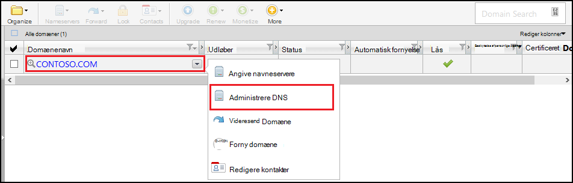
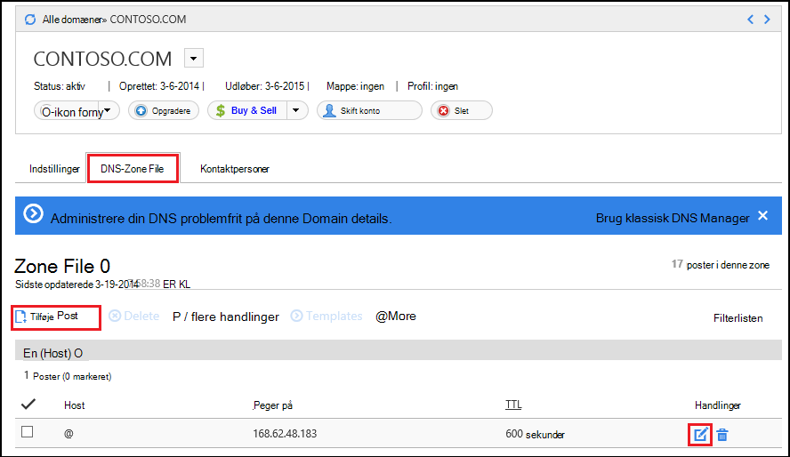
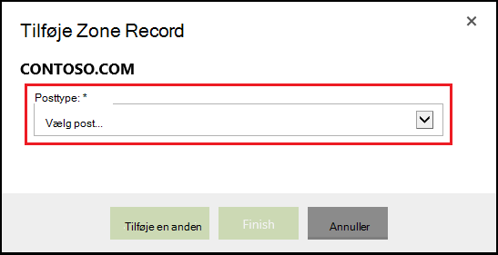
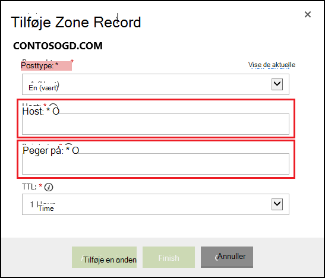

<properties
    pageTitle="Konfigurere et brugerdefineret domænenavn i Azure App Service (GoDaddy)"
    description="Lær at bruge et domænenavn fra GoDaddy til Azure Web Apps"
    services="app-service"
    documentationCenter=""
    authors="erikre"
    manager="wpickett"
    editor="jimbe"/>

<tags
    ms.service="app-service"
    ms.workload="na"
    ms.tgt_pltfrm="na"
    ms.devlang="na"
    ms.topic="article"
    ms.date="01/12/2016"
    ms.author="cephalin"/>

# Konfigurere et brugerdefineret domænenavn i Azure App Service (købt direkte fra GoDaddy)

[AZURE.INCLUDE [web-selector](../../includes/websites-custom-domain-selector.md)]

[AZURE.INCLUDE [intro](../../includes/custom-dns-web-site-intro.md)]

Hvis du har købt domæne via Azure App Service Web Apps derefter henvise til det sidste trin af [Købe domæne til Web Apps](custom-dns-web-site-buydomains-web-app.md).

I denne artikel indeholder en vejledning til brug af et brugerdefineret domænenavn, der blev købt direkte fra [GoDaddy](https://godaddy.com) til [App Service Web Apps](http://go.microsoft.com/fwlink/?LinkId=529714).

[AZURE.INCLUDE [introfooter](../../includes/custom-dns-web-site-intro-notes.md)]

##Forstå DNS-poster

[AZURE.INCLUDE [understandingdns](../../includes/custom-dns-web-site-understanding-dns-raw.md)]

## Tilføje en DNS-post til dit eget domæne

Hvis du vil knytte dit eget domæne med en WebApp i App-tjeneste, skal du tilføje en ny post i tabellen DNS for dit brugerdefinerede domæne ved hjælp af værktøjer, der leveres af GoDaddy. Følge nedenstående trin for at finde DNS-værktøjer til GoDaddy.com

1. Log på din konto med GoDaddy.com, og vælg **Min konto** og klik derefter på **Administrer mine domæner**. Markér rullemenuen for det domænenavn, du vil bruge med dine Azure WebApp, og vælg **Administrer DNS**.

    

2. Rul ned til fanen **DNS Zone File** på siden **Domain details** . Dette er den sektion, der bruges til at tilføje og redigere DNS-posterne for dit domænenavn.

    

    Vælg **Add Record** at tilføje en eksisterende post.

    **Redigere** en eksisterende post, Vælg ikonet pen og papir ud for posten.

    > [AZURE.NOTE] Bemærk, at GoDaddy allerede har oprettet DNS-poster for populære underdomæner (kaldet **Host** i editoren skal) som **mail**, **filer**, **mail**og andre, før du tilføjer nye poster. Hvis det navn, du vil bruge allerede findes, kan du ændre den eksisterende post i stedet for at oprette en ny.

4. Når du tilføjer en post, skal du først vælge posttypen.

    

    Derefter skal du angive **Host** (brugerdefinerede domæne eller underdomæne) og hvad det **peger på**.

    

    * Når du tilføjer en **post en (host)** - skal du angive feltet **Host** for enten **@** (dette repræsenterer rod domænenavn, som **contoso.com**) *(et jokertegn for tilsvarende flere underdomæner) eller det underdomæne, du vil bruge (for eksempel * *www**.) Du skal angive den * *peger på** til IP-adressen for din Azure online.

    * Når du tilføjer en **CNAME (alias) post** - skal du angive feltet **Host** til det underdomæne, du vil bruge. Eksempelvis **www**. Du skal angive **peger på** feltet den **. azurewebsites.net** domænenavn for din Azure online. For eksempel, **contoso.azurewebsites.net**.

5. Klik på **Tilføj en anden**.
6. Vælg **TXT** som posttypen, og derefter angive værdien **Host** af **@** og en værdi for **peger på** af ** &lt;yourwebappname&gt;. azurewebsites.net**.

    > [AZURE.NOTE] Denne TXT-post bruges af Azure til at validere, at du ejer det domæne, der er beskrevet ved A-posten eller den første TXT-post. Når domænet er knyttet til web app i portalen Azure, er det muligt at fjerne denne post TXT-post.

5. Når du er færdig med at tilføje eller ændre poster, skal du klikke på **Udfør** for at gemme ændringerne.

## Aktivere domænenavnet på din online

[AZURE.INCLUDE [modes](../../includes/custom-dns-web-site-enable-on-web-site.md)]

>[AZURE.NOTE] Hvis du vil komme i gang med Azure App Service før tilmelding til en Azure-konto, skal du gå til [Prøve App Service](http://go.microsoft.com/fwlink/?LinkId=523751), hvor du straks kan oprette en forbigående starter WebApp i App-tjeneste. Ingen kreditkort, der kræves. ingen forpligtelser.

## Hvad er ændret
* Finde en vejledning til ændring fra websteder til App-tjenesten: [Azure App Service og dets indvirkning på eksisterende Azure Services](http://go.microsoft.com/fwlink/?LinkId=529714)
