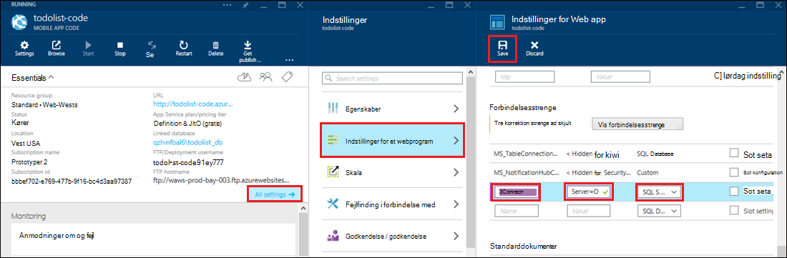

<properties 
    pageTitle="Få adgang til lokale ressourcer ved hjælp af hybrid forbindelser i Azure App Service" 
    description="Oprette en forbindelse mellem en WebApp i Azure App Service og en lokal ressource, der bruger en statisk TCP-port" 
    services="app-service" 
    documentationCenter="" 
    authors="cephalin" 
    manager="wpickett" 
    editor="mollybos"/>

<tags 
    ms.service="app-service" 
    ms.workload="na" 
    ms.tgt_pltfrm="na" 
    ms.devlang="na" 
    ms.topic="article" 
    ms.date="02/03/2016" 
    ms.author="cephalin"/>

#Få adgang til lokale ressourcer ved hjælp af hybrid forbindelser i Azure App Service

Du kan oprette forbindelse til en Azure App Service app alle lokale ressourcer, der bruger en statisk TCP-port, såsom SQL Server, MySQL, HTTP Web API'er og de fleste brugerdefineret Web-tjenester. I denne artikel beskrives, hvordan du opretter en hybrid forbindelse mellem App Service og en lokal SQL Server-database.

> [AZURE.NOTE] Web Apps-del af funktionen Hybrid forbindelser findes kun i [Azure-portalen](https://portal.azure.com). For at oprette en forbindelse i BizTalk-tjenester, skal du se [Hybrid forbindelser](http://go.microsoft.com/fwlink/p/?LinkID=397274). 
> 
> Dette indhold gælder også for Mobile-Apps i Azure App-tjeneste. 

## Forudsætninger
- Et Azure-abonnement. Du kan finde et gratis abonnement [Azure gratis prøveversion](https://azure.microsoft.com/pricing/free-trial/). 
 
    Hvis du vil komme i gang med Azure App Service før tilmelding til en Azure-konto, skal du gå til [Prøve App Service](http://go.microsoft.com/fwlink/?LinkId=523751), hvor du straks kan oprette en forbigående starter WebApp i App-tjeneste. Ingen kreditkort, der kræves. ingen forpligtelser.

- Hvis du vil bruge en lokal SQL Server eller SQL Server Express-database med en hybrid forbindelse, skal TCP/IP være aktiveret på en statisk port. Brug af en standardforekomst på SQL Server anbefales, fordi den bruger statisk port 1433. Finde oplysninger om installation og konfiguration af SQL Server Express til brug sammen med hybrid forbindelser, kan du se [oprette forbindelse til en lokal SQL Server fra et Azure-websted ved hjælp af Hybrid forbindelser](http://go.microsoft.com/fwlink/?LinkID=397979).

- Den computer, hvorpå du installerer lokale Hybrid Forbindelsesstyring agent beskrevet senere i denne artikel:

    - Skal kunne oprette forbindelse til Azure via port 5671
    - Skal kunne oprette forbindelse *hostname*:*portnummer* på din lokale ressource. 

> [AZURE.NOTE] Trinnene i denne artikel antager, at du bruger browseren fra den computer, der er vært for lokale hybrid Forbindelsesagent.

## Oprette en WebApp i portalen Azure ##

> [AZURE.NOTE] Hvis du allerede har oprettet en WebApp eller back end-Mobile-App i portalen Azure, du vil bruge til dette selvstudium, kan du gå videre til at [oprette en Hybrid forbindelse og en BizTalk-tjeneste](#CreateHC) og starte derfra.

1. Klik på **Ny**i øverste venstre hjørne af [Azure-portalen](https://portal.azure.com), > **Web + Mobile** > **Web App**.
    
    ![Nye WebApp][NewWebsite]
    
2. Angive en URL-adresse på bladet **WebApp** , og klik på **Opret**. 
    
    ![Webstedets navn][WebsiteCreationBlade]
    
3. Web-appen er oprettet efter et øjeblik og dens web app-blade vises. Bladet er et lodret kan rulles dashboard, hvor du kan administrere dit websted.
    
    ![Websted, der kører][WebSiteRunningBlade]
    
4. For at bekræfte, at webstedet er direkte, kan du klikke på ikonet **Gennemse** for at få vist standardsiden.
    
    ![Klik på Gennemse for at få vist din online][Browse]
    
    ![Standard app-webside][DefaultWebSitePage]
    
Derefter skal oprette du en hybrid forbindelse og en BizTalk-tjeneste til WebApp.

## Oprette en Hybrid forbindelse og en BizTalk-tjeneste ##

1. Klik på **Indstillinger for alle**i din web app-blade > **netværk** > **konfigurere hybrid Forbindelsesslutpunkterne**.
    
    ![Hybrid forbindelser][CreateHCHCIcon]
    
2. Klik på **Tilføj**på bladet Hybrid forbindelser.
    
    <!-- ![Add a hybrid connnection][CreateHCAddHC]
-->
    
3. **Tilføj en hybrid forbindelse** blade åbnes.  Da dette er første hybrid forbindelsen, indstillingen **Ny hybrid forbindelse** er markeret, og **Opret hybrid forbindelse** blade åbnes for dig.
    
    ![Oprette en hybrid-forbindelse][TwinCreateHCBlades]
    
    På **Opret hybrid forbindelse blade**:
    - Angiv et navn på forbindelsen for **navn**.
    - Skriv navnet på den lokale computer, hvor ressourcen for **Hostname**.
    - Angiv portnummeret, der bruges i din lokale ressourcer (1433 standardforekomst en SQL Server) for **Port**.
    - Klik på **Biz tale Service**

4. **Oprette BizTalk Service** blade åbnes. Angiv et navn til BizTalk-tjenesten, og klik derefter på **OK**.
    
    ![Oprette BizTalk service][CreateHCCreateBTS]
    
    **Oprette BizTalk Service** blade lukkes, og du vender tilbage til bladet **Opret hybrid forbindelse** .
    
5. Opret hybrid forbindelse blade, klik på **OK**. 
    
    ![Klik på OK][CreateBTScomplete]
    
6. Når processen afsluttes, informerer meddelelsesområdet i portalen dig, at forbindelsen er blevet oprettet.
    <! – Opgaveliste

    Alt mislykkes, når dette trin. Jeg kan ikke oprette en BizTalk-tjeneste i portalen dogfood. Jeg skifter til portalen klassisk (fuld portalen) og oprettet BizTalk-tjenesten, men det ikke ser ud til gør det muligt at connnect dem – når du er færdig med oprette hybrid conn trin, får du vist følgende fejlmeddelelse kunne ikke oprettes forbindelse til hybrid RelecIoudHC. Ressourcetypen blev ikke fundet i navneområdet 'Microsoft.BizTaIkServices for api version 2014-06-01'.
    
    Fejlen angiver den ikke kunne finde typen, ikke forekomsten.
    ![Besked om succes][CreateHCSuccessNotification]
    -->
7. På den online blade viser ikonet **Hybrid forbindelser** nu, 1 hybrid forbindelsen er blevet oprettet.
    
    ![En hybrid forbindelse oprettet][CreateHCOneConnectionCreated]
    
På dette tidspunkt, har du fuldført en vigtig del af skyinfrastruktur hybrid forbindelse. Derefter skal oprette du en tilsvarende lokale del.

## Installere den lokale Hybrid Forbindelsesstyring for at fuldføre forbindelsen ##

1. Klik på den online blade **alle indstillinger** > **netværk** > **konfigurere hybrid Forbindelsesslutpunkterne**. 
    
    ![Ikon for forbindelse hybrid][HCIcon]
    
2. På bladet **Hybrid forbindelser** viser kolonnen **Status** for tilføjet for nylig slutpunktet **ikke har forbindelse**. Klik på forbindelsen for at konfigurere den.
    
    ![Ikke har forbindelse][NotConnected]
    
    Bladet Hybrid forbindelse åbnes.
    
    ![NotConnectedBlade][NotConnectedBlade]
    
3. Klik på **Konfiguration af lytteren**bladet.
    
    ![Klik på lytteren konfiguration][ClickListenerSetup]
    
4. Bladet **Hybrid forbindelsesegenskaber** åbnes. Under **Lokal Hybrid Forbindelsesstyring**vælge **Klik her for at installere**.
    
    ![Klik her for at installere][ClickToInstallHCM]
    
5. Vælg **Kør** fortsat i programmet køre dialogboksen sikkerhedsadvarsel.
    
    ![Vælg Kør for at fortsætte][ApplicationRunWarning]
    
6.  Vælg **Ja**i dialogboksen **Kontrol af brugerkonti** .
    
    ![Vælg Ja][UAC]
    
7. Forbindelsesstyring Hybrid hentes og installeres for dig. 
    
    ![Installation af][HCMInstalling]
    
8. Når installationen er fuldført, skal du klikke på **Luk**.
    
    ![Klik på Luk][HCMInstallComplete]
    
    På bladet **Hybrid forbindelser** viser kolonnen **Status** nu **tilsluttet**. 
    
    ![Forbundne Status][HCStatusConnected]

Nu hvor hybrid forbindelse infrastruktur er fuldført, kan du oprette en hybrid-program, der bruger den. 

>[AZURE.NOTE]De følgende afsnit viser, hvordan du bruger en hybrid forbindelse med et Mobile Apps .NET back end-projekt.

## Konfigurere Mobile App .NET back end-projektet til at oprette forbindelse til SQL Server-databasen

Et Mobile Apps .NET back end-projekt er bare en ASP.NET web-app med en ekstra Mobile Apps SDK er installeret og initialiseret i App-tjeneste. Hvis du vil bruge din online som en Mobile-Apps back-end, skal du [hente og initialiseret back-end Mobile Apps .NET SDK](../app-service-mobile/app-service-mobile-dotnet-backend-how-to-use-server-sdk.md#install-sdk).  

For Mobile-Apps skal du også angive en forbindelsesstreng for den lokale database og ændre back-end for at bruge denne forbindelse. 

1. I Solution Explorer i Visual Studio, Åbn Web.config-filen til din Mobile App .NET back end-, Find sektionen **connectionStrings** , tilføje en ny post SqlClient som følgende oplysninger, der peger på den lokale SQL Server-database:

        <add name="OnPremisesDBConnection"
         connectionString="Data Source=OnPremisesServer,1433;
         Initial Catalog=OnPremisesDB;
         User ID=HybridConnectionLogin;
         Password=<**secure_password**>;
         MultipleActiveResultSets=True"
         providerName="System.Data.SqlClient" />

    Husk at erstatte `<**secure_password**>` i denne streng med den adgangskode, du har oprettet for *HybridConnectionLogin*.

3. Klik på **Gem** i Visual Studio til at gemme filen Web.config.

    > [AZURE.NOTE]Denne indstilling for forbindelse bruges, når du kører på den lokale computer. Når du kører i Azure, er denne indstilling forekomme af indstillingen forbindelse, der er defineret i portalen.

4. Udvid mappen **modeller** , og Åbn filen datamodel, der slutter med *Context.cs*.

6. Ændre forekomstkonstruktør **DbContext** for at sende værdien `OnPremisesDBConnection` til grundlæggende **DbContext** konstruktøren, svarende til følgende kodestykke:

        public class hybridService1Context : DbContext
        {
            public hybridService1Context()
                : base("OnPremisesDBConnection")
            {
            }
        }

    Tjenesten anvender nu den nye forbindelse til SQL Server-databasen.

## Opdatere Mobile-App back-end for at bruge forbindelsesstrengen lokalt

Derefter skal du tilføje en app indstilling af denne nye forbindelsesstreng, så den kan bruges fra Azure.  

1. Klik på **alle indstillinger**og derefter **Programindstillinger**tilbage i [Azure portal](https://portal.azure.com) i web app back end-koden for din Mobile-App.

3. Rul ned til **strenge** i bladet **Indstillinger for Web app** og tilføje en ny **SQL Server** -forbindelsesstreng med navnet `OnPremisesDBConnection` med en værdi som `Server=OnPremisesServer,1433;Database=OnPremisesDB;User ID=HybridConnectionsLogin;Password=<**secure_password**>`.

    Erstatte `<**secure_password**>` med sikker adgangskoden til din lokale database.

    

2. Tryk på **Gem** til at gemme hybrid forbindelse og forbindelsesstreng, du lige har oprettet.

Du kan på dette tidspunkt genpublicere server projektet og teste den nye forbindelse med dine eksisterende Mobile-Apps-klienter. Data vil læse fra og skrives til den lokale database ved hjælp af hybrid forbindelsen.

## Næste trin ##

- Oplysninger om oprettelse af en ASP.NET-webprogram, der bruger en hybrid forbindelse, kan du se [oprette forbindelse til en lokal SQL Server fra et Azure-websted ved hjælp af Hybrid forbindelser](http://go.microsoft.com/fwlink/?LinkID=397979). 

### Yderligere ressourcer

[Oversigt over dataforbindelser hybrid](http://go.microsoft.com/fwlink/p/?LinkID=397274)

[Josh Twist introducerer hybrid forbindelser (kanal 9 video)](http://channel9.msdn.com/Shows/Azure-Friday/Josh-Twist-introduces-hybrid-connections)

[Hybrid forbindelser-websted](https://azure.microsoft.com/services/biztalk-services/)

[BizTalk-tjenester: Dashboard, skærm, skala, konfigurere og Hybrid forbindelse faner](../biztalk-services/biztalk-dashboard-monitor-scale-tabs.md)

[Opbygning af en reale Hybrid sky med problemfri programmet mobilitet (kanal 9 video)](http://channel9.msdn.com/events/TechEd/NorthAmerica/2014/DCIM-B323#fbid=)

[Oprette forbindelse til en lokal SQL Server fra Azure Mobile-tjenester ved hjælp af Hybrid forbindelser (kanal 9 video)](http://channel9.msdn.com/Series/Windows-Azure-Mobile-Services/Connect-to-an-on-premises-SQL-Server-from-Azure-Mobile-Services-using-Hybrid-Connections)

## Hvad er ændret
* Finde en vejledning til ændring fra websteder til App-tjenesten: [Azure App Service og dets indvirkning på eksisterende Azure Services](http://go.microsoft.com/fwlink/?LinkId=529714)

<!-- IMAGES -->
[New]:./media/web-sites-hybrid-connection-get-started/B01New.png
[NewWebsite]:./media/web-sites-hybrid-connection-get-started/B02NewWebsite.png
[WebsiteCreationBlade]:./media/web-sites-hybrid-connection-get-started/B03WebsiteCreationBlade.png
[WebSiteRunningBlade]:./media/web-sites-hybrid-connection-get-started/B04WebSiteRunningBlade.png
[Browse]:./media/web-sites-hybrid-connection-get-started/B05Browse.png
[DefaultWebSitePage]:./media/web-sites-hybrid-connection-get-started/B06DefaultWebSitePage.png
[CreateHCHCIcon]:./media/web-sites-hybrid-connection-get-started/C01CreateHCHCIcon.png
[CreateHCAddHC]:./media/web-sites-hybrid-connection-get-started/C02CreateHCAddHC.png
[TwinCreateHCBlades]:./media/web-sites-hybrid-connection-get-started/C03TwinCreateHCBlades.png
[CreateHCCreateBTS]:./media/web-sites-hybrid-connection-get-started/C04CreateHCCreateBTS.png
[CreateBTScomplete]:./media/web-sites-hybrid-connection-get-started/C05CreateBTScomplete.png
[CreateHCSuccessNotification]:./media/web-sites-hybrid-connection-get-started/C06CreateHCSuccessNotification.png
[CreateHCOneConnectionCreated]:./media/web-sites-hybrid-connection-get-started/C07CreateHCOneConnectionCreated.png
[HCIcon]:./media/web-sites-hybrid-connection-get-started/D01HCIcon.png
[NotConnected]:./media/web-sites-hybrid-connection-get-started/D02NotConnected.png
[NotConnectedBlade]:./media/web-sites-hybrid-connection-get-started/D03NotConnectedBlade.png
[ClickListenerSetup]:./media/web-sites-hybrid-connection-get-started/D04ClickListenerSetup.png
[ClickToInstallHCM]:./media/web-sites-hybrid-connection-get-started/D05ClickToInstallHCM.png
[ApplicationRunWarning]:./media/web-sites-hybrid-connection-get-started/D06ApplicationRunWarning.png
[UAC]:./media/web-sites-hybrid-connection-get-started/D07UAC.png
[HCMInstalling]:./media/web-sites-hybrid-connection-get-started/D08HCMInstalling.png
[HCMInstallComplete]:./media/web-sites-hybrid-connection-get-started/D09HCMInstallComplete.png
[HCStatusConnected]:./media/web-sites-hybrid-connection-get-started/D10HCStatusConnected.png
 