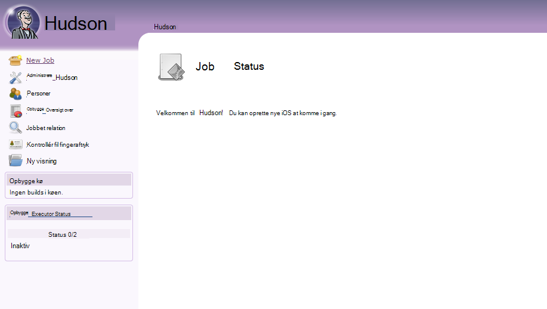
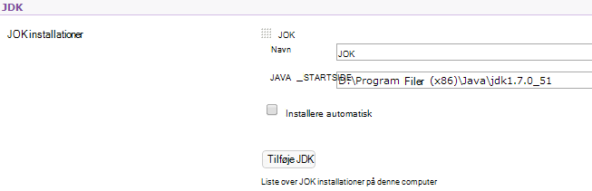
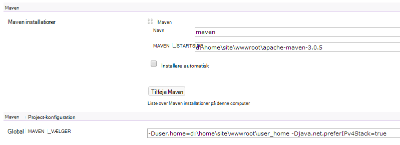

<properties 
    pageTitle="Overføre en brugerdefineret Java WebApp til Azure" 
    description="Dette selvstudium viser, hvordan du overfører en brugerdefineret Java WebApp til Azure App Service Web Apps." 
    services="app-service\web" 
    documentationCenter="java" 
    authors="rmcmurray" 
    manager="wpickett" 
    editor=""/>

<tags 
    ms.service="app-service-web" 
    ms.workload="web" 
    ms.tgt_pltfrm="na" 
    ms.devlang="Java" 
    ms.topic="article" 
    ms.date="08/11/2016" 
    ms.author="robmcm"/>

# Overføre en brugerdefineret Java WebApp til Azure

Dette emnet forklares, hvordan du overfører en brugerdefineret Java WebApp til [Azure App Service] Web Apps. Indeholder oplysninger, der gælder for en hvilken som helst Java websted eller web app og også nogle eksempler på bestemte programmer.

Bemærk, at Azure giver mulighed for at oprette Java webapps ved hjælp af portalen Azure konfiguration Brugergrænsefladen og Azure Marketplace, som beskrevet i [oprette en Java WebApp i Azure App Service](web-sites-java-get-started.md). Dette selvstudium er for scenarier, hvor du ikke vil bruge Azure Portal-konfigurationen, brugergrænseflade eller Azure Marketplace.  

## Retningslinjer for konfiguration

Følgende beskrives de indstillinger, der forventes for brugerdefinerede Java webapps på Azure.

- HTTP-port bruges af processen Java tildeles dynamisk.  Processen skal bruge port fra miljøvariablen `HTTP_PLATFORM_PORT`.
- Alle lytte porte end enkelt HTTP lytteren skal være deaktiveret.  I Tomcat, der anmodes lukning, HTTPS og AJP porte.
- Objektbeholderen skal være konfigureret til IPv4-trafik.
- Kommandoen **Start** for programmet skal angives i konfigurationen.
- Programmer, der kræver mapper med skrive tilladelse skal være placeret i den Azure online mappe med indhold, som er **D:\home**.  Variablen påvirkning `HOME` refererer til D:\home.  

Du kan angive miljøvariabler efter behov i filen web.config.

## Web.config httpPlatform konfiguration

Følgende oplysninger i denne artikel beskrives formatet **httpPlatform** i web.config.
                                 
**argumenter** (Standard = ""). Argumenter til den eksekverbare fil eller script, der er angivet i indstillingen **processPath** .

Eksempler (vises med **processPath** inkluderet):

    processPath="%HOME%\site\wwwroot\bin\tomcat\bin\catalina.bat"
    arguments="start"
    
    processPath="%JAVA_HOME\bin\java.exe"
    arguments="-Djava.net.preferIPv4Stack=true -Djetty.port=%HTTP\_PLATFORM\_PORT% -Djetty.base=&quot;%HOME%\site\wwwroot\bin\jetty-distribution-9.1.0.v20131115&quot; -jar &quot;%HOME%\site\wwwroot\bin\jetty-distribution-9.1.0.v20131115\start.jar&quot;"

**processPath** - stien til den eksekverbare fil eller script, der starter en proces, lytte til HTTP-anmodninger.

Eksempler:

    processPath="%JAVA_HOME%\bin\java.exe"

    processPath="%HOME%\site\wwwroot\bin\tomcat\bin\startup.bat"

    processPath="%HOME%\site\wwwroot\bin\tomcat\bin\catalina.bat"
                                                                                       
**rapidFailsPerMinute** (Standard = 10.) Antallet af gange den proces, der er angivet i **processPath** har tilladelse til at gå ned i minuttet. Hvis denne grænse overskrides, stopper **HttpPlatformHandler** start af processen for resten af minuttet.
                                    
**requestTimeout** (Standard = "00: 02:00".) Varighed, **HttpPlatformHandler** venter på svar fra processen lytter på `%HTTP_PLATFORM_PORT%`.

**startupRetryCount** (Standard = 10.) Antallet af gange **HttpPlatformHandler** forsøger at åbne den proces, der er angivet i **processPath**. Se **startupTimeLimit** få mere at vide.

**startupTimeLimit** (Standard = 10 sekunder.) Varighed, **HttpPlatformHandler** vil vente eksekverbar fil/scriptet til at starte en proces, lytte på porten.  Hvis denne gang grænse overskrides, derved **HttpPlatformHandler** afbryde processen, og prøv at åbne det igen **startupRetryCount** gange.
                                                                                      
**stdoutLogEnabled** (Standard = "true".) Hvis sand, **stdout** og **stderr** for den proces, der er angivet i indstillingen **processPath** omdirigeres til den fil, der er angivet i **stdoutLogFile** (se afsnittet **stdoutLogFile** ).
                                    
**stdoutLogFile** (Default="d:\home\LogFiles\httpPlatformStdout.log".) Absolut filsti, **stdout** og **stderr** fra den proces, der er angivet i **processPath** vil blive logført.
                                    
> [AZURE.NOTE] `%HTTP_PLATFORM_PORT%`er en speciel pladsholder, der skal angives som en del af **argumenter** eller som en del af listen **httpPlatform** **environmentVariables** . Dette erstattes af en internt genererede port ved **HttpPlatformHandler** , så den proces, der er angivet af **processPath** kan lytte på denne port.

## Installation

Java baseret webapps kan installeres nemt gennem de fleste af de samme midler, der bruges med Internet Information Services (IIS) baseret webprogrammer.  FTP, ciffer og Kudu understøttes alle som installation mekanismer, som er integreret SCM muligheden for webapps. WebDeploy fungerer som en protokol, men som Java ikke er udviklet i Visual Studio WebDeploy passer ikke med Java web app-installation Brug sager.

## Programkonfiguration eksempler

For følgende programmer, en web.config-fil og programmet leveres konfiguration som eksempler til at vise, hvordan du aktiverer dit Java-program på App-tjenesten Web Apps.

### Tomcat
Selvom der findes to variationer på Tomcat, der følger med App-tjenesten Web Apps, er det stadig helt muligt at overføre kunde specifikke forekomster. Nedenfor er et eksempel på en installation af Tomcat med en anden Java Virtual Machine (JVM).

    <?xml version="1.0" encoding="UTF-8"?>
    <configuration>
      <system.webServer>
        <handlers>
          <add name="httpPlatformHandler" path="*" verb="*" modules="httpPlatformHandler" resourceType="Unspecified" />
        </handlers>
        <httpPlatform processPath="%HOME%\site\wwwroot\bin\tomcat\bin\startup.bat" 
            arguments="">
          <environmentVariables>
            <environmentVariable name="CATALINA_OPTS" value="-Dport.http=%HTTP_PLATFORM_PORT%" />
            <environmentVariable name="CATALINA_HOME" value="%HOME%\site\wwwroot\bin\tomcat" />
            <environmentVariable name="JRE_HOME" value="%HOME%\site\wwwroot\bin\java" /> <!-- optional, if not specified, this will default to %programfiles%\Java -->
            <environmentVariable name="JAVA_OPTS" value="-Djava.net.preferIPv4Stack=true" />
          </environmentVariables>
        </httpPlatform>
      </system.webServer>
    </configuration>

På siden Tomcat er der nogle få ændringer i konfigurationen, der skal udføres. Server.xml skal redigeres, hvis du vil angive:

-   Lukning port = -1
-   HTTP-forbindelse port = ${port.http}
-   HTTP-forbindelse adressen = "127.0.0.1"
-   Skrive en kommentar ud HTTPS og AJP forbindelser
-   Indstillingen IPv4 kan også angives i filen catalina.properties, hvor du kan tilføje`java.net.preferIPv4Stack=true`
    
Direct3d opkald understøttes ikke på App-tjenesten Web Apps. For at deaktivere dem, skal du tilføje indstillingen følgende Java skal nok få dit program sådanne opkald:`-Dsun.java2d.d3d=false`

### Jetty

Som det er tilfældet for Tomcat, kan kunder overføre sin egen forekomster til Jetty. Hvis det er kører komplet installation af Jetty, ville konfigurationen se således ud:

    <?xml version="1.0" encoding="UTF-8"?>
    <configuration>
      <system.webServer>
        <handlers>
          <add name="httppPlatformHandler" path="*" verb="*" modules="httpPlatformHandler" resourceType="Unspecified" />
        </handlers>
        <httpPlatform processPath="%JAVA_HOME%\bin\java.exe" 
             arguments="-Djava.net.preferIPv4Stack=true -Djetty.port=%HTTP_PLATFORM_PORT% -Djetty.base=&quot;%HOME%\site\wwwroot\bin\jetty-distribution-9.1.0.v20131115&quot; -jar &quot;%HOME%\site\wwwroot\bin\jetty-distribution-9.1.0.v20131115\start.jar&quot;"
            startupTimeLimit="20"
          startupRetryCount="10"
          stdoutLogEnabled="true">
        </httpPlatform>
      </system.webServer>
    </configuration>

Jetty konfigurationen skal ændres i start.ini til at angive `java.net.preferIPv4Stack=true`.

### Springboot
Hvis du vil have en Springboot program, der kører du har brug for at overføre filen glas eller KRIG og tilføje følgende web.config-filen. Filen web.config er i mappen wwwroot. Justere argumenter til at pege på glas filen, i følgende eksempel glas filen er placeret i mappen wwwroot i web.config.  

    <?xml version="1.0" encoding="UTF-8"?>
    <configuration>
      <system.webServer>
        <handlers>
          <add name="httpPlatformHandler" path="*" verb="*" modules="httpPlatformHandler" resourceType="Unspecified" />
        </handlers>
        <httpPlatform processPath="%JAVA_HOME%\bin\java.exe"
            arguments="-Djava.net.preferIPv4Stack=true -Dserver.port=%HTTP_PLATFORM_PORT% -jar &quot;%HOME%\site\wwwroot\my-web-project.jar&quot;">
        </httpPlatform>
      </system.webServer>
    </configuration>

### Hudson

Vores test bruges Hudson 3.1.2 krig og Tomcat 7.0.50 standardforekomst, men uden brug af Brugergrænsefladen til at konfigurere tingene på.  Da Hudson er en software opbygge værktøj, er det anbefales at installere den på dedikeret forekomster, hvor du kan angive flaget **AlwaysOn** på WebApp.

1. Opret en **WebApp** mappe (hvis den ikke allerede findes) i din online rodmappe, det vil sige **d:\home\site\wwwroot**, og anbring Hudson.war i **d:\home\site\wwwroot\webapps**.
2. Hente apache maven 3.0.5 (kompatibelt med Hudson) og placere det i **d:\home\site\wwwroot**.
3. Oprette web.config i **d:\home\site\wwwroot** og indsætte følgende indholdet i den:
    
        <?xml version="1.0" encoding="UTF-8"?>
        <configuration>
          <system.webServer>
            <handlers>
              <add name="httppPlatformHandler" path="*" verb="*" 
        modules="httpPlatformHandler" resourceType="Unspecified" />
            </handlers>
            <httpPlatform processPath="%AZURE_TOMCAT7_HOME%\bin\startup.bat"
        startupTimeLimit="20"
        startupRetryCount="10">
        <environmentVariables>
          <environmentVariable name="HUDSON_HOME" 
        value="%HOME%\site\wwwroot\hudson_home" />
          <environmentVariable name="JAVA_OPTS" 
        value="-Djava.net.preferIPv4Stack=true -Duser.home=%HOME%/site/wwwroot/user_home -Dhudson.DNSMultiCast.disabled=true" />
        </environmentVariables>            
            </httpPlatform>
          </system.webServer>
        </configuration>

    På dette tidspunkt kan WebApp startes for at gøre ændringerne.  Oprette forbindelse til http://yourwebapp/hudson til at starte Hudson.

4. Når Hudson konfigurerer selve, skal du se følgende skærmbillede:

    
    
5. Få adgang til konfigurationssiden af Hudson: Klik på **Administrer Hudson**, og klik derefter på **Konfigurer System**.
6. Konfigurere JDK, som vist nedenfor:

    

7. Konfigurere Maven, som vist nedenfor:

    

8. Gemme indstillingerne. Hudson skulle nu være konfigureret og klar til brug.

Du kan finde flere oplysninger om Hudson skal [http://hudson-ci.org](http://hudson-ci.org).

### Liferay

Liferay understøttes på App-tjenesten Web Apps. Da Liferay kan kræve betydeligt hukommelse, skal WebApp til at køre på en mellemstore eller store dedikeret arbejder, hvilket kan give tilstrækkelig hukommelse. Liferay tager også flere minutter at starte. Det anbefales, at du angiver WebApp til **Altid på**derfor.  

Bruger Liferay 6.1.2 Community Edition GA3 sammen med Tomcat, skal er blevet følgende filer redigeret efter hente Liferay:

**Server.XML**

- Ændre lukning port til -1.
- Ændre HTTP-forbindelse til      `<Connector port="${port.http}" protocol="HTTP/1.1" connectionTimeout="600000" address="127.0.0.1" URIEncoding="UTF-8" />`
- Kommentere ud AJP forbindelsen.

Oprette en fil med navnet **portal ext.properties**i mappen **liferay\tomcat-7.0.40\webapps\ROOT\WEB-INF\classes** . Denne fil skal indeholde én linje, som vist her:

    liferay.home=%HOME%/site/wwwroot/liferay

Oprette en fil med navnet **web.config** med følgende indhold på det samme niveau directory som mappen tomcat 7.0.40:

    <?xml version="1.0" encoding="UTF-8"?>
    <configuration>
      <system.webServer>
        <handlers>
    <add name="httpPlatformHandler" path="*" verb="*"
         modules="httpPlatformHandler" resourceType="Unspecified" />
        </handlers>
        <httpPlatform processPath="%HOME%\site\wwwroot\tomcat-7.0.40\bin\catalina.bat" 
                      arguments="run" 
                      startupTimeLimit="10" 
                      requestTimeout="00:10:00" 
                      stdoutLogEnabled="true">
          <environmentVariables>
      <environmentVariable name="CATALINA_OPTS" value="-Dport.http=%HTTP_PLATFORM_PORT%" />
      <environmentVariable name="CATALINA_HOME" value="%HOME%\site\wwwroot\tomcat-7.0.40" />
            <environmentVariable name="JRE_HOME" value="D:\Program Files\Java\jdk1.7.0_51" /> 
            <environmentVariable name="JAVA_OPTS" value="-Djava.net.preferIPv4Stack=true" />
          </environmentVariables>
        </httpPlatform>
      </system.webServer>
    </configuration>

Under Bloker **httpPlatform** **requestTimeout** er indstillet til "00:10:00".  Det kan blive reduceret, men er du sandsynligvis at se nogle timeoutfejl, mens Liferay starte sig selv.  Hvis denne værdi er ændret, bør derefter **connectionTimeout** i tomcat server.xml også ændres.  

Det er værd at bemærke, at JRE_HOME environnment varariable er angivet i ovenstående web.config til at pege på 64-bit JDK. Standard er 32-bit, men da Liferay kan kræve høj grad af hukommelse, det anbefales at bruge 64-bit JDK.

Når du har foretaget disse ændringer, Genstart din online, der kører Liferay, Åbn derefter http://yourwebapp. Portalen Liferay er tilgængelig i web app-roden. 

## Næste trin

Du kan finde flere oplysninger om Liferay, [http://www.liferay.com](http://www.liferay.com).

Du kan finde flere oplysninger om Java, [Java Developer Center](/develop/java/).

[AZURE.INCLUDE [app-service-web-whats-changed](../../includes/app-service-web-whats-changed.md)]

[AZURE.INCLUDE [app-service-web-try-app-service](../../includes/app-service-web-try-app-service.md)]
 
 
<!-- External Links -->
[Azure App Service]: http://go.microsoft.com/fwlink/?LinkId=529714
