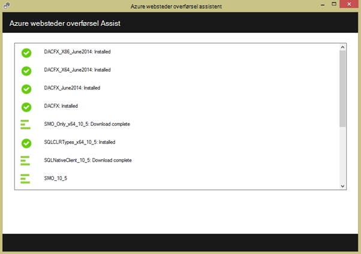

<properties 
    pageTitle="Overføre en enterprise online til Azure App Service" 
    description="Viser, hvordan du bruger Web Apps Migration Assistant kan du hurtigt overføre eksisterende IIS-websteder til Azure App Service Web Apps" 
    services="app-service" 
    documentationCenter="" 
    authors="cephalin" 
    writer="cephalin" 
    manager="wpickett" 
    editor=""/>

<tags 
    ms.service="app-service" 
    ms.workload="na" 
    ms.tgt_pltfrm="na" 
    ms.devlang="na" 
    ms.topic="article" 
    ms.date="07/01/2016" 
    ms.author="cephalin"/>

# Overføre en enterprise online til Azure App Service

Du kan nemt overføre dine eksisterende websteder, der kører på oplysninger IIS (Internet Service) 6 eller nyere for at kunne [App Service Web Apps](http://go.microsoft.com/fwlink/?LinkId=529714). 

>[AZURE.IMPORTANT] Windows Server 2003 nået slutningen af support på juli fra 14 2015. Hvis du er i øjeblikket er vært for dine websteder på en IIS-server, som er Windows Server 2003, Web Apps er en lav risiko, lave omkostninger, og lav friktion måde at holde dine websteder online, og Web Apps Migration Assistant kan hjælpe med at automatisere overførselsprocessen for dig. 

[Web Apps Migration Assistant](https://www.movemetothecloud.net/) kan analysere din IIS server-installation, skal du identificere hvilke websteder kan overføres til App Service, Fremhæv alle elementer, der kan ikke overføres, eller der ikke understøttes på platformen, og derefter overføre dine websteder og tilknyttede databaser til Azure.

[AZURE.INCLUDE [app-service-web-to-api-and-mobile](../../includes/app-service-web-to-api-and-mobile.md)]

## Elementer, der er bekræftet under analyse af kompatibilitet ##
Overførsel-assistenten oprettes en er klar til at identificere alle mulige årsager til problematisk, eller blokering problemer, der kan forhindre en vellykket overførsel fra lokale IIS til Azure App Service Web Apps. Nogle af de vigtigste elementer skal være opmærksom på er:

-   Port bindinger – Web Apps understøtter kun Port 80 for HTTP og Port 443 til HTTPS trafik. Anden portkonfigurationer ignoreres og trafik bliver dirigeret til 80 eller 443. 
-   Godkendelse – Web Apps understøtter anonym godkendelse som standard og formulargodkendelse givet af et program. Windows-godkendelse kan bruges ved at integrere med Azure Active Directory og ADFS kun. Alle andre former for godkendelse – for eksempel basisgodkendelse - understøttes ikke i øjeblikket. 
-   Globale samling Cache (GAC) – GAC understøttes ikke i Web Apps. Hvis dit program henviser til samlinger, som du normalt installerer til GAC, skal du installere til mappen programmer bin i Web Apps. 
-   IIS5 Kompatibilitetstilstand – dette understøttes ikke i Web Apps. 
-   Programgrupper – i Web Apps, hvert websted og dets underordnede programmer kører i samme programgruppen. Hvis webstedet har flere underordnede programmer ved hjælp af flere programgrupper, konsolidere dem til en enkelt programgruppen med almindelige indstillinger eller overføre hvert program til en separat WebApp.
-   COM-komponenter – Web Apps tillader ikke registrering af COM-komponenter på platformen. Hvis din websteder eller programmer gør brug af en hvilken som helst COM-komponenter, skal du skrive dem igen i administreret kode og installere dem med det websted eller et program.
-   ISAPI-filtre – Web Apps kan understøtter brugen af ISAPI-filtre. Du skal gøre følgende:
    -   installere DLL-filer med din online 
    -   registrere de DLL-filer ved hjælp af [Web.config](http://www.iis.net/configreference/system.webserver/isapifilters)
    -   placere en applicationHost.xdt fil i roden websted med indholdet nedenfor:

            <?xml version="1.0"?>
            <configuration xmlns:xdt="http://schemas.microsoft.com/XML-Document-Transform">
            <configSections>
                <sectionGroup name="system.webServer">
                  <section name="isapiFilters" xdt:Transform="SetAttributes(overrideModeDefault)" overrideModeDefault="Allow" />
                </sectionGroup>
              </configSections>
            </configuration>

        Se [transformere webstedet Microsoft Azure](http://blogs.msdn.com/b/waws/archive/2014/06/17/transform-your-microsoft-azure-web-site.aspx)flere eksempler på, hvordan du bruger XML-dokumentkonverteringer med dit websted.

-   Andre komponenter som SharePoint, forside server extensions (FPSE), FTP, SSL-certifikater, der ikke overføres.

## Sådan bruges overførsel assistent Web Apps ##
I denne sektion trin til et eksempel, der skal bruges til at overføre nogle websteder, der bruger en SQL Server-database og kører på en lokal Windows Server 2003 R2 (IIS 6.0) computer:

1.  Gå til [https://www.movemetothecloud.net/](https://www.movemetothecloud.net/) på IIS-serveren eller klientcomputeren 

    

2.  Installere Web Apps Migration Assistant ved at klikke på knappen **Dedikeret IIS-Server** . Flere indstillinger vil være indstillinger inden for kort tid. 
4.  Klik på knappen **Installer værktøjet** for at installere Web Apps Migration Assistant på din computer.

    

    >[AZURE.NOTE] Du kan også klikke på **Hent til offline Installer** for at hente en ZIP-fil til installation på servere, der ikke har forbindelse til internettet. Eller du kan klikke på **Overfør en eksisterende overførsel parathed rapport**, som er en avanceret indstilling til at arbejde med en eksisterende overførsel parathed rapport, du tidligere har oprettet (forklares senere).

5.  Klik på **Installer** at installere på din computer på skærmbilledet **Program installere** . Det også installeres tilsvarende afhængigheder som Web installere, DacFX og IIS, hvis det er nødvendigt. 

    

    Når installeret, starter Web Apps Migration Assistant automatisk.
  
6.  Vælg **Overfør websteder og databaser fra en fjernserver til Azure**. Angive legitimationsoplysninger for den eksterne server, og klik på **Fortsæt**. 

    

    Du kan selvfølgelig vælge at overføre fra den lokale server. Indstillingen remote er nyttig, når du vil overføre websteder fra en fremstilling IIS-server.
 
    På dette tidspunkt overførselsværktøjet vil inspicere på din IIS-server-konfiguration, som websteder, programmer, programmet grupper og afhængigheder til at identificere kandidat websteder for overførsel. 

8.  Skærmbilledet nedenfor viser tre websteder – **standardwebsted**, **TimeTracker**og **CommerceNet4**. Dem alle har en tilknyttet database, som vi vil overføre. Markér alle de websteder, du vil gerne Vurder, og klik derefter på **Næste**.

    
 
9.  Klik på **Overfør** for at overføre rapporten er klar. Hvis du klikker på **Gem filen lokalt**, kan du køre overførselsværktøjet igen senere og overføre gemte parathed rapporten som nævnt tidligere.

    
 
    Når du overfører rapporten er klar, Azure udfører parathed analyse og viser dig resultaterne. Læse vurdering detaljerne for hver websted, og Sørg for, at du forstår eller har behandlet alle problemer, før du fortsætter. 
 
    

12. Klik på **Begynder overførslen** for at starte overførslen. Du kan nu omdirigeres til Azure til at logge på din konto. Det er vigtigt, at du logger på med en konto, der har et aktivt Azure-abonnement. Hvis du ikke har en Azure konto kan derefter du tilmelde dig en gratis prøveversion [her](https://azure.microsoft.com/pricing/free-trial/?WT.srch=1&WT.mc_ID=SEM_). 

13. Vælg lejerkonto, Azure-abonnement og område, der skal bruge til dine overførte Azure webapps og databaser, og klik derefter på **Start overførsel**. Du kan vælge websteder til at overføre senere.

    

14. På det næste skærmbillede kan du foretage ændringer til overførsel standardindstillingerne, f.eks.:

    - bruge en eksisterende Azure SQL-Database eller oprette en ny Azure SQL-Database og konfigurere dens legitimationsoplysninger
    - Vælg websteder til at overføre
    - angive navne til Azure webapps og deres sammenkædede SQL-databaser
    - tilpasse de globale indstillinger og webstedsniveau indstillinger

    Skærmbilledet nedenfor viser alle de websteder, der er valgt til overførsel med standardindstillingerne.

    

    >[AZURE.NOTE] afkrydsningsfeltet **Aktivér Azure Active Directory** i brugerdefinerede indstillinger integrerer Azure WebApp med [Azure Active Directory](active-directory-whatis.md) ( **Default Directory**). Du kan finde flere oplysninger om synkronisering Azure Active Directory med din lokalt Active Directory, [katalogintegration](http://msdn.microsoft.com/library/jj573653).

16.  Når du foretage de ønskede ændringer, skal du klikke på **Opret** for at starte overførselsprocessen. Overførselsværktøjet Opret Azure SQL-Database og Azure WebApp, og derefter udgive webstedsindhold og -databaser. Overførsel status tydeligt vises i overførselsværktøjet til, og du får vist en oversigt over skærm i slutningen, hvilke oplysninger om webstederne overflyttet, uanset om de blev fuldført, links til de nyoprettede Azure webapps. 

    Hvis der opstår fejl under overførsel, angiver overførselsværktøjet tydeligt fejl og rollback ændringerne. Du vil også kunne sende fejlrapporten direkte til det tekniske hold ved at klikke på knappen **Send fejlrapport** med hentede manglende kaldestak og opbygge meddelelsens brødtekst. 

    

    Hvis overføre lykkes uden fejl, kan du også klikke på knappen **Giv Feedback** for at give din feedback direkte. 
 
20. Klik på linkene til Azure webapps, og Kontrollér, at overførslen er fuldført.

21. Du kan nu administrere overførte webapps i Azure App Service. Log på [Azure Portal](https://portal.azure.com)for at gøre dette.

22. Åbn bladet Web Apps for at se dine overførte websteder (vist som Onlines) i portalen Azure, og derefter klikke på en af dem til at begynde at administrere online, som konfigurerer fortløbende publicering, oprette sikkerhedskopier, autoskalering og overvåge brugen eller ydeevne.

    

>[AZURE.NOTE] Hvis du vil komme i gang med Azure App Service før tilmelding til en Azure-konto, skal du gå til [Prøve App Service](http://go.microsoft.com/fwlink/?LinkId=523751), hvor du straks kan oprette en forbigående starter WebApp i App-tjeneste. Ingen kreditkort, der kræves. ingen forpligtelser.

## Hvad er ændret
* Finde en vejledning til ændring fra websteder til App-tjenesten: [Azure App Service og dets indvirkning på eksisterende Azure Services](http://go.microsoft.com/fwlink/?LinkId=529714)
 
