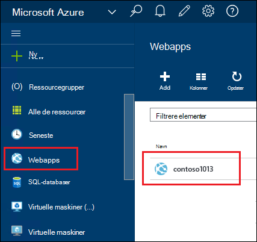
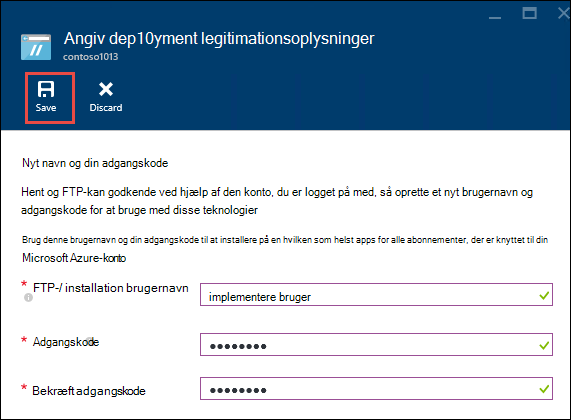
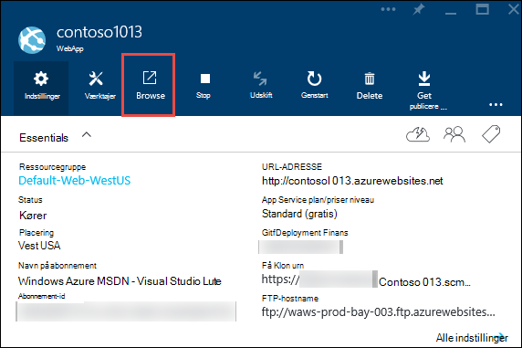
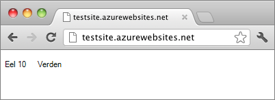

<properties
    pageTitle="Oprette en Node.js WebApp i Azure App Service | Microsoft Azure"
    description="Lær, hvordan du installerer et Node.js program til en WebApp i Azure App-tjeneste."
    services="app-service\web"
    documentationCenter="nodejs"
    authors="rmcmurray"
    manager="wpickett"
    editor=""/>

<tags
    ms.service="app-service-web"
    ms.workload="web"
    ms.tgt_pltfrm="na"
    ms.devlang="nodejs"
    ms.topic="hero-article"
    ms.date="08/11/2016"
    ms.author="robmcm"/>

# Oprette en Node.js WebApp i Azure App Service

> [AZURE.SELECTOR]
- [.NET](web-sites-dotnet-get-started.md)
- [Node.js](web-sites-nodejs-develop-deploy-mac.md)
- [Java](web-sites-java-get-started.md)
- [PHP - ciffer](web-sites-php-mysql-deploy-use-git.md)
- [PHP - FTP](web-sites-php-mysql-deploy-use-ftp.md)
- [Python](web-sites-python-ptvs-django-mysql.md)

Dette selvstudium viser, hvordan du opretter et enkelt [Node.js](http://nodejs.org) -program og installere det i en [Online](app-service-web-overview.md) i [Azure App Service](../app-service/app-service-value-prop-what-is.md) ved hjælp af [ciffer](http://git-scm.com). Vejledningen i dette selvstudium kan efterfølges på operativsystemer, der kan køre Node.js.

Du kan lære følgende:

* Sådan oprettes en web-app i Azure App Service ved hjælp af portalen Azure.
* Sådan installeres et Node.js program til online ved at trykke på til den online ciffer lager.

Det færdige program skriver en kort "Hej verden" streng til browseren.

![En browser, der viser meddelelsen 'Hej verden'.][helloworld-completed]

Selvstudier og eksempler på kode med mere komplekse Node.js programmer, eller til andre emner om, hvordan du bruger Node.js i Azure, skal du se [Node.js Developer Center](/develop/nodejs/).

> [AZURE.NOTE]
> For at fuldføre dette selvstudium skal bruge du en Microsoft Azure-konto. Hvis du ikke har en konto, kan du [aktivere dit Visual Studio abonnement fordele](/en-us/pricing/member-offers/msdn-benefits-details/?WT.mc_id=A261C142F) eller [Tilmeld dig en gratis prøveversion](/en-us/pricing/free-trial/?WT.mc_id=A261C142F).
>
> Hvis du vil Introduktion til Azure App Service, før du tilmelder dig en Azure-konto, skal du gå til [Prøve App Service](http://go.microsoft.com/fwlink/?LinkId=523751). Der, skal du straks kan oprette en forbigående starter WebApp i App Service – ingen kreditkort er påkrævet, og ingen forpligtelser.

## Oprette en WebApp og aktivere ciffer udgivelse

Følg disse trin for at oprette en web-app i Azure App Service og aktivere ciffer udgivelse. 

[Ciffer](http://git-scm.com/) er et fordelt version control system, du kan bruge til at udrulle webstedet Azure. Du vil gemme den kode, du skriver til din online i et lokalt lager ciffer, og du skal installere din kode til Azure ved at trykke på til en ekstern lager. Denne metode til installation er en funktion i App Service webapps.  

1. Log på [Azure-portalen](https://portal.azure.com).

2. Klik på ikonet **+ Ny** øverst til venstre på portalen Azure.

3. Klik på **Web + Mobile**, og klik derefter på **WebApp**.

    ![][portal-quick-create]

4. Angiv et navn til WebApp i feltet **WebApp** .

    Dette navn skal være entydige i azurewebsites.net domæne, fordi URL-adressen til WebApp bliver {name}. azurewebsites.net. Hvis det navn, du angiver ikke er entydige, vises et rødt udråbstegn i tekstfeltet.

5. Vælg et **abonnement**.

6. Vælg en **Ressourcegruppe** eller Opret en ny.

    Se [Oversigt over Azure ressourcestyring](../azure-resource-manager/resource-group-overview.md)kan finde flere oplysninger om ressourcegrupper.

7. Vælg en **App Service plan/placering** eller Opret en ny.

    Du kan finde flere oplysninger om App Service planer, se [Oversigt over Azure App Service-planer](../azure-web-sites-web-hosting-plans-in-depth-overview.md)

8. Klik på **Opret**.
   
    ![][portal-quick-create2]

    I et øjeblik, typisk mindre end et minut afsluttes Azure oprettelse af nye WebApp.

9. Klik på **Web apps > {din nye online}**.

    

10. Klik på **installation** del i bladet **WebApp** .

    ![][deployment-part]

11. Klik på **Vælg kilde** i bladet **Fortløbende installation**

12. Klik på **Lokale ciffer lager**, og klik derefter på **OK**.

    ![][setup-git-publishing]

13. Konfigurer installation legitimationsoplysninger, hvis du ikke allerede har gjort det.

    en. Klik på i bladet Web app **Indstillinger > installation legitimationsoplysninger**.

    ![][deployment-credentials]
 
    b. Oprette et brugernavn og adgangskode. 
    
    

14. Klik på **Indstillinger**i bladet Web app, og klik derefter på **Egenskaber**.
 
    Hvis du vil publicere, får du push til en ekstern ciffer lager. URL-adressen til lageret er angivet under **CIFFER URL-adresse**. Du skal bruge denne URL-adresse senere i selvstudiet.

    ![][git-url]

## Opbygge og teste dit program lokalt

I dette afsnit, skal oprette du en **server.js** -fil, der indeholder en ændret en smule version af eksemplet 'Hej verden' fra [nodejs.org]. Koden tilføjer process.env.PORT som port lytte på, når der benyttes i en Azure WebApp.

1. Oprette en mappe med navnet *helloworld*.

2. Brug en teksteditor til at oprette en ny fil med navnet **server.js** i mappen *helloworld* .

2. Kopier den følgende kode i filen **server.js** , og Gem derefter filen:

        var http = require('http')
        var port = process.env.PORT || 1337;
        http.createServer(function(req, res) {
          res.writeHead(200, { 'Content-Type': 'text/plain' });
          res.end('Hello World\n');
        }).listen(port);

3. Åbn kommandolinjen, og brug følgende kommando til at starte online lokalt.

        node server.js

4. Åbne din webbrowser og gå til http://localhost:1337. 

    En webside, der viser "Hej verden" vises, som vist på følgende skærmbillede.

    ![En browser, der viser meddelelsen 'Hej verden'.][helloworld-localhost]

## Publicere dit program

1. Hvis du ikke allerede har gjort det, skal du installere ciffer.

    Du kan finde installationsvejledning til din platform, [ciffer overførselssiden](http://git-scm.com/download).

1. Skifte til mappen **helloworld** fra kommandolinjen, og Skriv følgende kommando initialiseret et lokalt lager ciffer.

        git init

2. Brug følgende kommandoer til at føje filer til lageret:

        git add .
        git commit -m "initial commit"

3. Tilføje et ciffer remote for at placere opdateringer til den web-app, du oprettede tidligere, ved hjælp af følgende kommando:

        git remote add azure [URL for remote repository]

4. Overføre dine ændringer til Azure ved hjælp af følgende kommando:

        git push azure master

    Du bliver bedt om adgangskoden, du oprettede tidligere. Output ligner i følgende eksempel.

        Counting objects: 3, done.
        Delta compression using up to 8 threads.
        Compressing objects: 100% (2/2), done.
        Writing objects: 100% (3/3), 374 bytes, done.
        Total 3 (delta 0), reused 0 (delta 0)
        remote: New deployment received.
        remote: Updating branch 'master'.
        remote: Preparing deployment for commit id '5ebbe250c9'.
        remote: Preparing files for deployment.
        remote: Deploying Web.config to enable Node.js activation.
        remote: Deployment successful.
        To https://user@testsite.scm.azurewebsites.net/testsite.git
         * [new branch]      master -> master

5. For at få vist din app, skal du klikke på knappen **Gennemse** på **Web App** -del i portalen Azure.

    

    

## Publicere ændringer i dit program

1. Åbn filen **server.js** i et tekstredigeringsprogram, og Skift 'Hej World\n' til 'Hej Azure\n'. 

2. Gem filen.

2. Skifte til mappen **helloworld** fra kommandolinjen, og Kør følgende kommandoer:

        git add .
        git commit -m "changing to hello azure"
        git push azure master

    Du bliver bedt om din adgangskode igen.

3. Opdater browservinduet, som du har navigeret til den online URL-adresse.

    ![En webside, der viser 'Hej Azure'][helloworld-completed]

## Annullere en installation

Fra bladet **WebApp** kan du klikke på **Indstillinger > fortløbende installation** at se oversigten installation i bladet **installationer** . Hvis du har brug at vende tilbage til en tidligere installation, kan du markere det og derefter klikke på **Geninstaller** i bladet **Installationsoplysninger** .

## Næste trin

Du har installeret et Node.js program til en WebApp i Azure App-tjeneste. Du kan få flere oplysninger om hvordan App Service Onlines køre Node.js programmer, [Azure App Service Web Apps: Node.js](http://blogs.msdn.com/b/silverlining/archive/2012/06/14/windows-azure-websites-node-js.aspx) og [angive en Node.js version i et Azure-program](../nodejs-specify-node-version-azure-apps.md).

Node.js indeholder et omfattende netværk af moduler, der kan anvendes af dine programmer. Se [Brug af Node.js moduler med Azure-programmer](../nodejs-use-node-modules-azure-apps.md)for at få mere for at vide, hvordan Web Apps fungerer med moduler.

Hvis du støder på problemer med programmet, når den er blevet installeret på Azure, se, [hvordan du fejlfinding af et Node.js program i Azure App Service](web-sites-nodejs-debug.md) kan finde oplysninger om diagnosticering problemet.

I denne artikel bruges portalen Azure til at oprette en WebApp. Du kan også bruge [Azure kommandolinjen](../xplat-cli-install.md) eller [Azure PowerShell](../powershell-install-configure.md) til at udføre de samme handlinger.

Du kan finde flere oplysninger om, hvordan du udvikler programmer med Node.js på Azure, skal du se [Node.js Developer Center](/develop/nodejs/).

[helloworld-completed]: ./media/web-sites-nodejs-develop-deploy-mac/helloazure.png
[helloworld-localhost]: ./media/web-sites-nodejs-develop-deploy-mac/helloworldlocal.png
[portal-quick-create]: ./media/web-sites-nodejs-develop-deploy-mac/create-quick-website.png
[portal-quick-create2]: ./media/web-sites-nodejs-develop-deploy-mac/create-quick-website2.png
[setup-git-publishing]: ./media/web-sites-nodejs-develop-deploy-mac/setup_git_publishing.png
[go-to-dashboard]: ./media/web-sites-nodejs-develop-deploy-mac/go_to_dashboard.png
[deployment-part]: ./media/web-sites-nodejs-develop-deploy-mac/deployment-part.png
[deployment-credentials]: ./media/web-sites-nodejs-develop-deploy-mac/deployment-credentials.png
[git-url]: ./media/web-sites-nodejs-develop-deploy-mac/git-url.png
