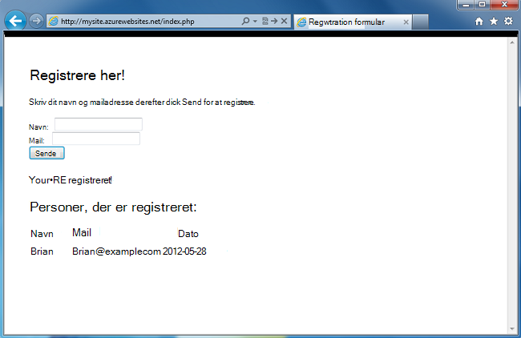
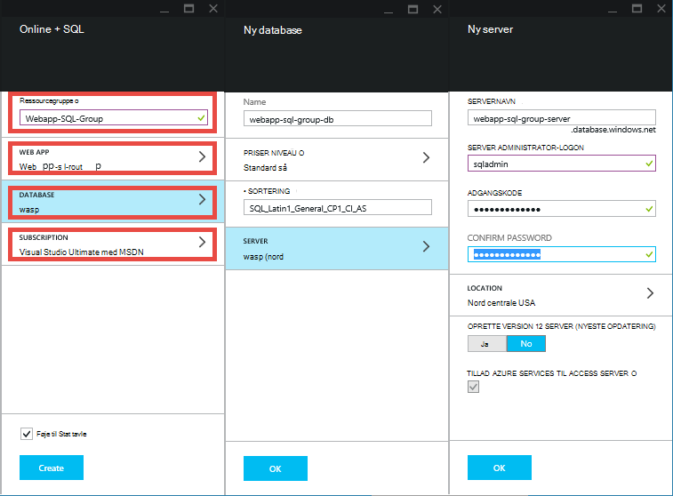
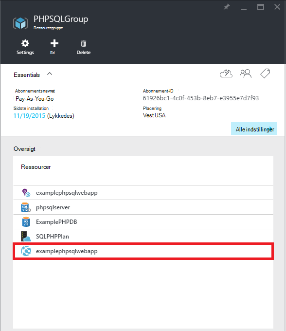
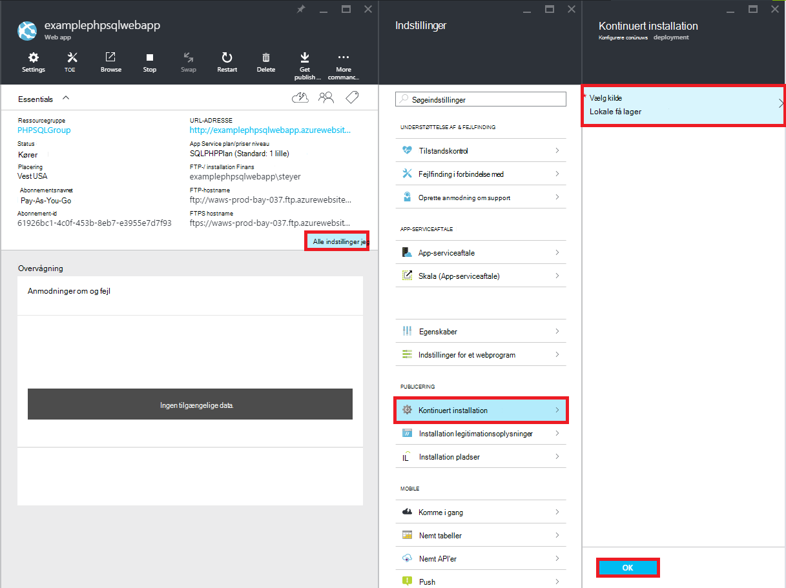
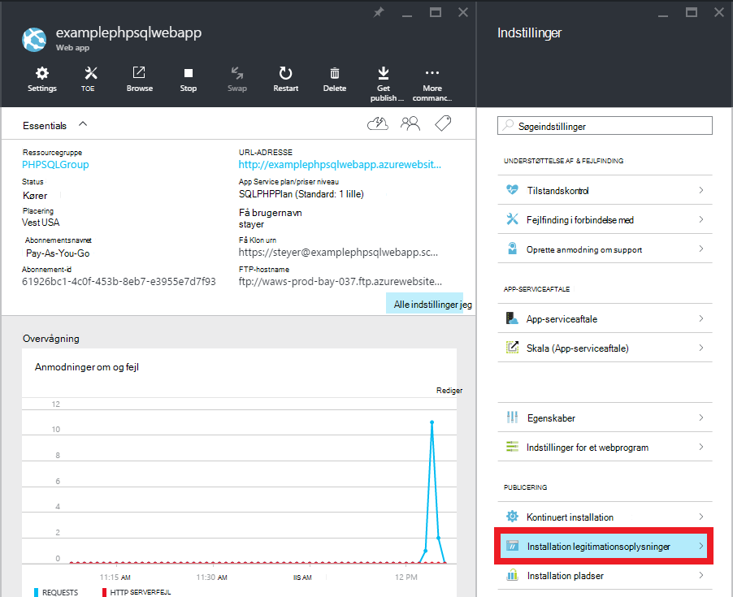
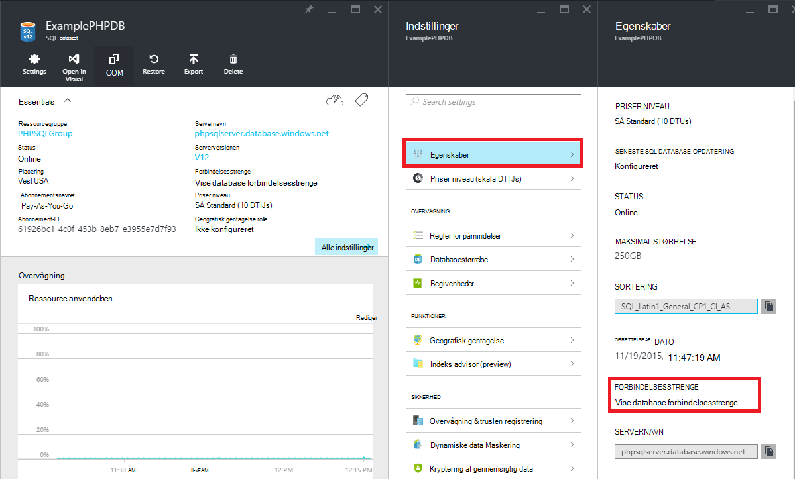

<properties 
    pageTitle="Oprette en PHP-SQL-WebApp og installere til Azure App-tjenesten ved hjælp af ciffer" 
    description="Et selvstudium, der viser, hvordan du opretter en PHP WebApp, der gemmer dataene i Azure SQL-Database og bruger ciffer installation til Azure App-tjenesten." 
    services="app-service\web, sql-database" 
    documentationCenter="php" 
    authors="rmcmurray" 
    manager="wpickett" 
    editor=""/>

<tags 
    ms.service="app-service-web" 
    ms.workload="web" 
    ms.tgt_pltfrm="na" 
    ms.devlang="PHP" 
    ms.topic="article" 
    ms.date="08/11/2016" 
    ms.author="robmcm"/>

# Oprette en PHP-SQL-WebApp og installere til Azure App-tjenesten ved hjælp af ciffer

Dette selvstudium viser, hvordan du opretter en PHP WebApp i [Azure App Service](http://go.microsoft.com/fwlink/?LinkId=529714) , som opretter forbinder til Azure SQL-Database og hvordan du installerer den med ciffer. Dette selvstudium forudsætter, at du har [PHP][install-php], [SQL Server Express][install-SQLExpress], [Microsoft drivere til SQL Server til PHP](http://www.microsoft.com/download/en/details.aspx?id=20098)og [ciffer] [ install-git] installeret på computeren. Når denne vejledning, har du en PHP-SQL-web-app, der kører i Azure.

> [AZURE.NOTE]
> Du kan installere og konfigurere PHP, SQL Server Express og Microsoft Drivers til SQL Server til PHP ved hjælp af [Microsoft Web Platform Installer](http://www.microsoft.com/web/downloads/platform.aspx).

Du kan få mere at vide:

* Sådan oprettes en Azure-WebApp og en SQL-Database ved hjælp af [Azure-portalen](http://go.microsoft.com/fwlink/?LinkId=529715). Da PHP er aktiveret i App-tjenesten Web Apps som standard, kræves ingenting speciel for at køre din PHP kode.
* Sådan publicerer og publicere dit program til Azure ved hjælp af ciffer.
 
Ved at følge dette selvstudium, kan du oprette en enkel registrering webprogram i PHP. Programmet skal placeres i en Azure-websted. Et skærmbillede af det færdige program er nedenfor:

[AZURE.INCLUDE [create-account-and-websites-note](../../includes/create-account-and-websites-note.md)]

>[AZURE.NOTE] Hvis du vil komme i gang med Azure App Service før tilmelding til en Azure-konto, skal du gå til [Prøve App Service](http://go.microsoft.com/fwlink/?LinkId=523751), hvor du straks kan oprette en forbigående starter WebApp i App-tjeneste. Ingen kreditkort, der kræves. ingen forpligtelser.

##Oprette en Azure-WebApp og konfigurere ciffer udgivelse

Følg disse trin for at oprette en Azure-WebApp og en SQL-Database:

1. Log på [Azure-portalen](https://portal.azure.com/).

2. Åbn Azure Marketplace ved at klikke på ikonet **Ny** øverst til venstre på dashboardet, klik på **Marker alt** ud for Marketplace og vælge **Web + Mobile**.
    
3. Vælg **Web + Mobile**på markedet.

4. Klik på ikonet **Online + SQL** .

5. Når du har læst beskrivelsen af online + SQL-app, skal du vælge **Opret**.

6. Klik på de enkelte dele (**Ressourcegruppe**, **Online**, **Database**og **abonnement**), og Angiv eller Vælg værdier for de obligatoriske felter:
    
    - Angive en URL-adresse efter eget valg   
    - Konfigurere database server-legitimationsoplysninger
    - Vælg det område, der er tættest på du

    

7. Klik på **Opret**, når du er færdig med at definere WebApp.

    Når webappen er blevet oprettet, blinker knappen **beskeder** , en grøn **succes** og ressource gruppe blade Åbn for at få vist både WebApp og SQL-databasen i gruppen.

4. Klik på den WebApp-ikonet i bladet ressource gruppe for at åbne den online blade.

    

5. Klik på **fortløbende installation**i **Indstillinger for**  > **Konfigurer påkrævet indstillinger**. Vælg **Lokale ciffer lager** , og klik på **OK**.

    

    Hvis du ikke har konfigureret et ciffer lager før, skal du angive et brugernavn og adgangskode. Klik på **Indstillinger for**at gøre dette, > **installation legitimationsoplysninger** i det online blade.

    

6. **Indstillinger** skal du klikke på **Egenskaber** for at se ciffer remote URL-adressen du skal bruge til at udrulle din PHP app senere.

##Få oplysninger om databaseforbindelsen SQL-Database

Oprette forbindelse til den forekomst af SQL-Database, der er knyttet til din online, din, har du brug for oplysninger om forbindelsen, som du angav, da du oprettede databasen. For at få forbindelsesoplysningerne SQL-Database skal du følge disse trin:

1. Klik på den SQL-database ikonet tilbage i ressourcegruppen blade.

2. Klik på **Indstillinger**i den SQL-database blade > **Egenskaber**, klik derefter på **Vis database forbindelsesstrenge**. 

    
    
3. I afsnittet **PHP** af dialogboksen resulterende noter værdierne for `Server`, `SQL Database`, og `User Name`. Du skal bruge disse værdier senere ved at publicere din PHP online til Azure App Service.

##Opbygge og teste dit program lokalt

Programmet registrering er en enkelt PHP-program, som gør det muligt at registrere for en begivenhed ved at indsende dit navn og e-mail-adresse. Oplysninger om tidligere registrerede vises i en tabel. Registreringsoplysninger er gemt i en forekomst af SQL-Database. Programmet består af to filer (kopiere/indsætte kode tilgængelige nedenfor):

* **Index.php**: Viser en formular til registrering og en tabel, der indeholder registrantens side oplysninger.
* **CreateTable.php**: opretter tabellen SQL-Database til programmet. Denne fil kan kun bruges én gang.

Hvis du vil køre programmet lokalt, skal du følge nedenstående trin. Bemærk, at disse trin antager, du har PHP og SQL Server Express konfigurere på din lokale computer, og at du har aktiveret [PDO udvidelse til SQL Server][pdo-sqlsrv].

1. Oprette en SQL Server-database, der hedder `registration`. Du kan gøre dette fra den `sqlcmd` kommandoprompt med disse kommandoer:

        >sqlcmd -S localhost\sqlexpress -U <local user name> -P <local password>
        1> create database registration
        2> GO   

2. Opret to filer i det - en kaldet i programmets rodmappe `createtable.php` og én kaldet `index.php`.

3. Åbn den `createtable.php` filer i et tekstredigeringsprogram eller IDE og tilføje nedenstående kode. Denne kode bruges til at oprette den `registration_tbl` tabel i den `registration` database.

        <?php
        // DB connection info
        $host = "localhost\sqlexpress";
        $user = "user name";
        $pwd = "password";
        $db = "registration";
        try{
            $conn = new PDO( "sqlsrv:Server= $host ; Database = $db ", $user, $pwd);
            $conn->setAttribute( PDO::ATTR_ERRMODE, PDO::ERRMODE_EXCEPTION );
            $sql = "CREATE TABLE registration_tbl(
            id INT NOT NULL IDENTITY(1,1) 
            PRIMARY KEY(id),
            name VARCHAR(30),
            email VARCHAR(30),
            date DATE)";
            $conn->query($sql);
        }
        catch(Exception $e){
            die(print_r($e));
        }
        echo "<h3>Table created.</h3>";
        ?>

    Bemærk, at du opdatere værdierne for <code>$user</code> og <code>$pwd</code> med dit lokale SQL Server-brugernavn og din adgangskode.

4. Skriv følgende kommando i en terminal i rodmappen af programmet:

        php -S localhost:8000

4. Åbn en webbrowser og gå til **http://localhost:8000/createtable.php**. Dette vil oprette den `registration_tbl` tabel i databasen.

5. Åbn filen **index.php** i et tekstredigeringsprogram eller IDE og tilføje den grundlæggende HTML og CSS-kode for siden (PHP koden, føjes i senere trin).

        <html>
        <head>
        <Title>Registration Form</Title>
        
        </head>
        <body>
        <h1>Register here!</h1>
        
Fill in your name and email address, then click <strong>Submit</strong> to register.

        <form method="post" action="index.php" enctype="multipart/form-data" >
              Name  <input type="text" name="name" id="name"/> 
              Email <input type="text" name="email" id="email"/> 
              <input type="submit" name="submit" value="Submit" />
        </form>
        <?php

        ?>
        </body>
        </html>

6. Tilføje PHP kode til at oprette forbindelse til databasen i mærker PHP.

        // DB connection info
        $host = "localhost\sqlexpress";
        $user = "user name";
        $pwd = "password";
        $db = "registration";
        // Connect to database.
        try {
            $conn = new PDO( "sqlsrv:Server= $host ; Database = $db ", $user, $pwd);
            $conn->setAttribute( PDO::ATTR_ERRMODE, PDO::ERRMODE_EXCEPTION );
        }
        catch(Exception $e){
            die(var_dump($e));
        }

    Igen, skal du opdatere værdierne for <code>$user</code> og <code>$pwd</code> med dit lokale MySQL-brugernavn og din adgangskode.

7. Efter koden forbindelse skal du tilføje kode til at indsætte registreringsoplysninger i databasen.

        if(!empty($_POST)) {
        try {
            $name = $_POST['name'];
            $email = $_POST['email'];
            $date = date("Y-m-d");
            // Insert data
            $sql_insert = "INSERT INTO registration_tbl (name, email, date) 
                           VALUES (?,?,?)";
            $stmt = $conn->prepare($sql_insert);
            $stmt->bindValue(1, $name);
            $stmt->bindValue(2, $email);
            $stmt->bindValue(3, $date);
            $stmt->execute();
        }
        catch(Exception $e) {
            die(var_dump($e));
        }
        echo "<h3>Your're registered!</h3>";
        }

8. Til sidst skal følge ovenstående kode, tilføje kode for at hente data fra database.

        $sql_select = "SELECT * FROM registration_tbl";
        $stmt = $conn->query($sql_select);
        $registrants = $stmt->fetchAll(); 
        if(count($registrants) > 0) {
            echo "<h2>People who are registered:</h2>";
            echo "<table>";
            echo "<tr><th>Name</th>";
            echo "<th>Email</th>";
            echo "<th>Date</th></tr>";
            foreach($registrants as $registrant) {
                echo "<tr><td>".$registrant['name']."</td>";
                echo "<td>".$registrant['email']."</td>";
                echo "<td>".$registrant['date']."</td></tr>";
            }
            echo "</table>";
        } else {
            echo "<h3>No one is currently registered.</h3>";
        }

Nu kan du gå til **http://localhost:8000/index.php** til at afprøve programmet.

##Publicere dit program

Når du har kontrolleret dit program lokalt, kan du publicere det i App-tjenesten Web Apps ved hjælp af ciffer. Skal du først at opdatere oplysningerne om databaseforbindelsen i programmet på computeren. Brug af oplysningerne om databaseforbindelsen du har hentet tidligere (i sektionen **få SQL-Database forbindelsesoplysningerne** ), opdatere følgende oplysninger i **både** den `createdatabase.php` og `index.php` filer med de tilsvarende værdier:

    // DB connection info
    $host = "tcp:<value of Server>";
    $user = "<value of User Name>";
    $pwd = "<your password>";
    $db = "<value of SQL Database>";

> [AZURE.NOTE]
> I den <code>$host</code>, værdien af Server skal sættes foran med <code>tcp:</code>.

Nu er du klar til at konfigurere ciffer publicering og udgive programmet.

> [AZURE.NOTE]
> Dette er de samme trin, der er angivet i slutningen af afsnittet **oprette en Azure-WebApp og konfigurere ciffer udgivelse** ovenfor.

1. Åbne GitBash (eller en terminal, hvis ciffer i din `PATH`), skifte til dit program (mappen **registrering** ) rodmappe, og Kør følgende kommandoer:

        git init
        git add .
        git commit -m "initial commit"
        git remote add azure [URL for remote repository]
        git push azure master

    Du bliver bedt om for den adgangskode, du oprettede tidligere.

2. Gå til **http://[web app name].azurewebsites.net/createtable.php** til at oprette tabellen SQL-database til programmet.
3. Gå til **http://[web app name].azurewebsites.net/index.php** til at begynde at bruge programmet.

Når du har udgivet dit program, kan du begynde at foretage ændringer af den og bruge ciffer til at publicere dem. 

##Publicere ændringer i dit program

Hvis du vil publicere ændringer-program, skal du følge disse trin:

1. Foretage ændringer i dit program lokalt.
2. Åbne GitBash (eller en terminal it ciffer er i din `PATH`), skifte til dit program rodmappe, og Kør følgende kommandoer:

        git add .
        git commit -m "comment describing changes"
        git push azure master

    Du bliver bedt om for den adgangskode, du oprettede tidligere.

3. Gå til **http://[web app name].azurewebsites.net/index.php** at se ændringerne.

## Hvad er ændret
* Finde en vejledning til ændring fra websteder til App-tjenesten: [Azure App Service og dets indvirkning på eksisterende Azure Services](http://go.microsoft.com/fwlink/?LinkId=529714)

[install-php]: http://www.php.net/manual/en/install.php
[install-SQLExpress]: http://www.microsoft.com/download/details.aspx?id=29062
[install-Drivers]: http://www.microsoft.com/download/details.aspx?id=20098
[install-git]: http://git-scm.com/
[pdo-sqlsrv]: http://php.net/pdo_sqlsrv
 
