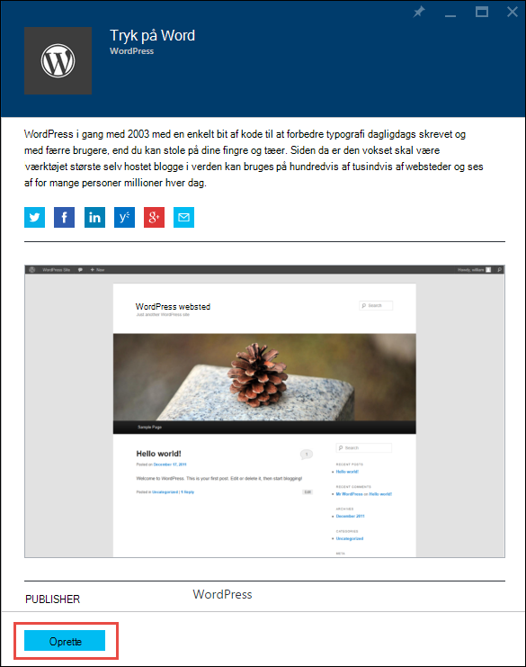

<properties
    pageTitle="Oprette en WordPress WebApp i Azure App Service | Microsoft Azure"
    description="Få mere at vide, hvordan du opretter en ny Azure online til en WordPress blog ved hjælp af portalen Azure."
    services="app-service\web"
    documentationCenter="php"
    authors="rmcmurray"
    manager="wpickett"
    editor=""/>

<tags
    ms.service="app-service-web"
    ms.workload="na"
    ms.tgt_pltfrm="na"
    ms.devlang="PHP"
    ms.topic="hero-article"
    ms.date="08/11/2016"
    ms.author="robmcm"/>

# Oprette en WordPress WebApp i Azure App Service

[AZURE.INCLUDE [tabs](../../includes/app-service-web-get-started-nav-tabs.md)]

Dette selvstudium viser, hvordan du kan installere blogwebsted WordPress fra Azure Marketplace.

Når du er færdig med selvstudiet har du din egen WordPress blogwebsted op og kører i skyen.

Du kan lære følgende:

* Sådan finder du en skabelon til programmet i Azure Marketplace.
* Sådan oprettes en web-app i Azure App-tjeneste, der er baseret på skabelonen.
* Sådan konfigureres Azure App Tjenesteindstillinger for den nye WebApp og database.

Azure Marketplace gør tilgængelige et bredt udvalg af populære Onlines udviklet af Microsoft, fra tredjepart firmaer, og Åbn kilde software initiativer. Webapps er bygget på et bredt udvalg af populære strukturer, som [PHP](/develop/nodejs/) i denne WordPress eksempel, [.NET](/develop/net/), [Node.js](/develop/nodejs/), [Java](/develop/java/)og [Python](/develop/python/), f.eks. Er den browser, du bruger til [Azure Portal](https://portal.azure.com/)for at oprette en web-app fra Azure Marketplace den kun software, du skal bruge. 

Webstedet WordPress, som du installerer i dette selvstudium bruger MySQL for databasen. Hvis du vil bruge i stedet for SQL-Database til databasen, skal du se [Project Nami](http://projectnami.org/). **Project Nami** er også tilgængelig via på Marketplace.

> [AZURE.NOTE]
> For at fuldføre dette selvstudium skal bruge du en Microsoft Azure-konto. Hvis du ikke har en konto, kan du [aktivere dit Visual Studio abonnement fordele](/pricing/member-offers/msdn-benefits-details/?WT.mc_id=A261C142F) eller [Tilmeld dig en gratis prøveversion](/en-us/pricing/free-trial/?WT.mc_id=A261C142F).
>
> Hvis du vil Introduktion til Azure App Service, før du tilmelder dig en Azure-konto, skal du gå til [Prøve App Service](http://go.microsoft.com/fwlink/?LinkId=523751). Der, skal du straks kan oprette en forbigående starter WebApp i App Service – ingen kreditkort er påkrævet, og ingen forpligtelser.

## Vælg WordPress og konfigurere til Azure App Service

1. Log på [Azure-portalen](https://portal.azure.com/).

2. Klik på **Ny**.
    
    ![Opret et nyt][5]
    
3. Søge efter **WordPress**, og klik derefter på **WordPress**. Hvis du vil bruge SQL-Database i stedet for MySQL, skal du søge efter **Project Nami**.

    ![WordPress listen][7]
    
5. Når du har læst beskrivelsen af WordPress-app, skal du klikke på **Opret**.

    

4. Angiv et navn til WebApp i feltet **WebApp** .

    Dette navn skal være entydige i azurewebsites.net domæne, fordi URL-adressen til WebApp bliver {name}. azurewebsites.net. Hvis det navn, du angiver ikke er entydige, vises et rødt udråbstegn i tekstfeltet.

8. Hvis du har mere end ét abonnement, skal du vælge det, du vil bruge. 

5. Vælg en **Ressourcegruppe** eller Opret en ny.

    Se [Oversigt over Azure ressourcestyring](../azure-resource-manager/resource-group-overview.md)kan finde flere oplysninger om ressourcegrupper.

5. Vælg en **App Service plan/placering** eller Opret en ny.

    Du kan finde flere oplysninger om App Service planer, se [Oversigt over Azure App Service-planer](../azure-web-sites-web-hosting-plans-in-depth-overview.md) 

7. Klik på **Database**, og angiv derefter de ønskede værdier til konfiguration af din MySQL-database i bladet **Nye MySQL-Database** .

    en. Skriv et nyt navn, eller lad standardnavnet.

    b. Lad **Database Type** er angivet til **delt**.

    c. Vælg den samme placering, som den, du har valgt til WebApp.

    d. Vælg et priser trin. Kviksølv (gratis med minimale tilladte forbindelser og diskplads) er fint til dette selvstudium.

8. Klik på **OK**i bladet **Nye MySQL-Database** . 

8. Acceptere juridiske betingelser i bladet **WordPress** , og klik derefter på **Opret**. 

    

    Azure App Service opretter online, typisk i mindre end et minut. Du kan se status ved at klikke på klokkeikonet øverst på siden med portalen.

    

## Start og administrere din WordPress online
    
7. Når web app oprettelse er afsluttet, gå på portalen Azure ressourcegruppen, hvor du har oprettet programmet, og du kan se WebApp og databasen.

    Ekstra ressourcen med ikonet pære er [Programmet viden](/services/application-insights/), som indeholder overvågning tjenester til din online.

1. Klik på web app-linjen i bladet **ressourcegruppe** .

    

2. Klik på **Gennemse**i bladet Web app.

    ![webstedets URL-adresse][browse]

3. Angiv de konfigurationsoplysninger, der kræves, før WordPress WordPress **Velkommen til** siden, og klik derefter på **Installere WordPress**.

    

4. Log på med legitimationsoplysningerne, som du oprettede på siden **Velkommen** .  

5. Dit Dashboard webstedsside åbnes.    

    

## Næste trin

Du har set, hvordan du opretter og installerer en PHP WebApp fra galleriet. Du kan finde flere oplysninger om brug af PHP i Azure, [PHP Developer Center](/develop/php/).

Du kan finde flere oplysninger om at arbejde med App-tjenesten Web Apps, kan du se linkene i venstre side af siden (for bred browservinduer) eller øverst på siden (for smal browservinduer). 

## Hvad er ændret
* For en vejledning til ændring fra websteder til App-tjenesten, skal du se [Azure App Service og dens indvirkning på eksisterende Azure-tjenester](http://go.microsoft.com/fwlink/?LinkId=529714).

[5]: ./media/web-sites-php-web-site-gallery/startmarketplace.png
[7]: ./media/web-sites-php-web-site-gallery/search-web-app.png
[browse]: ./media/web-sites-php-web-site-gallery/browse-web.png
