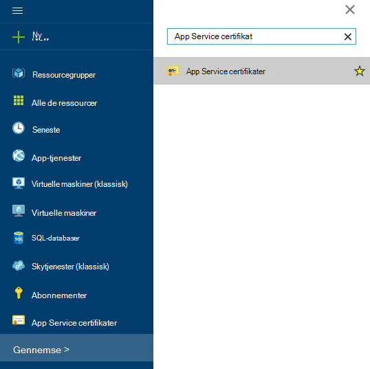
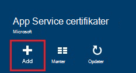
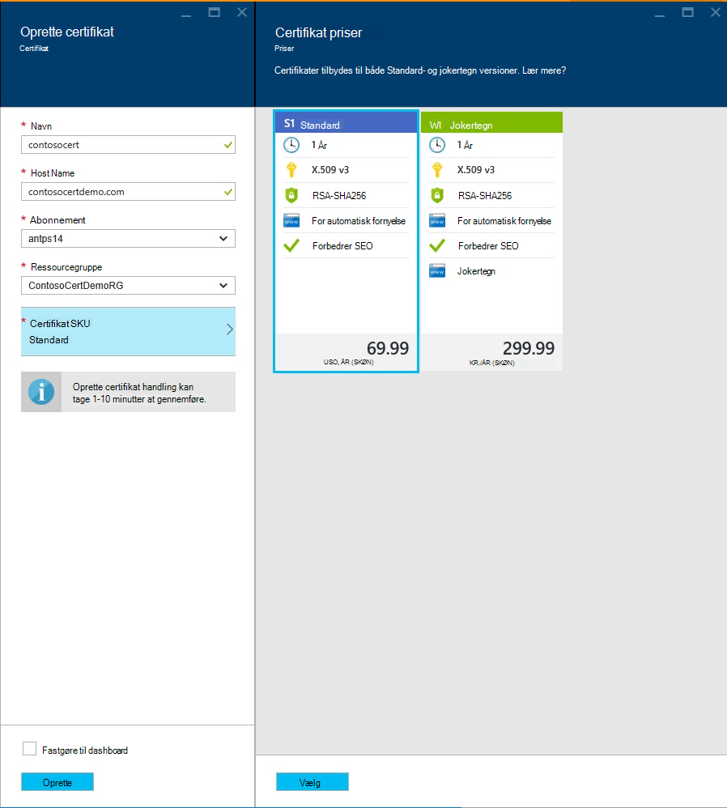
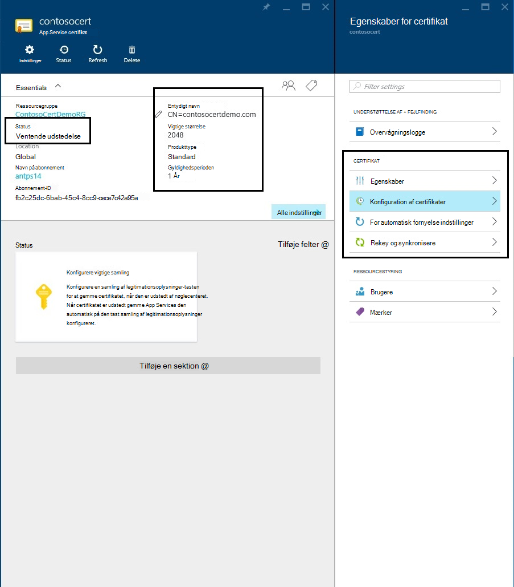
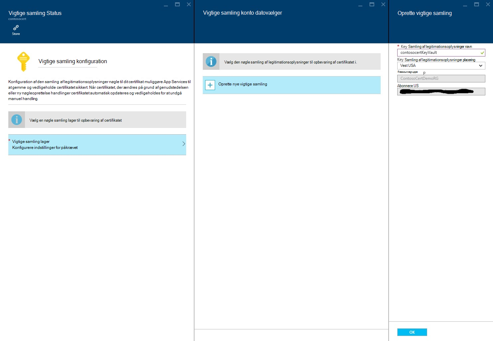
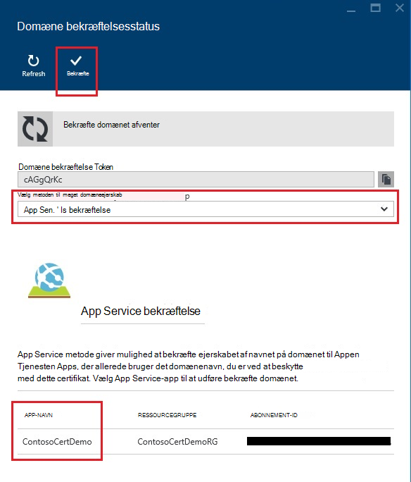
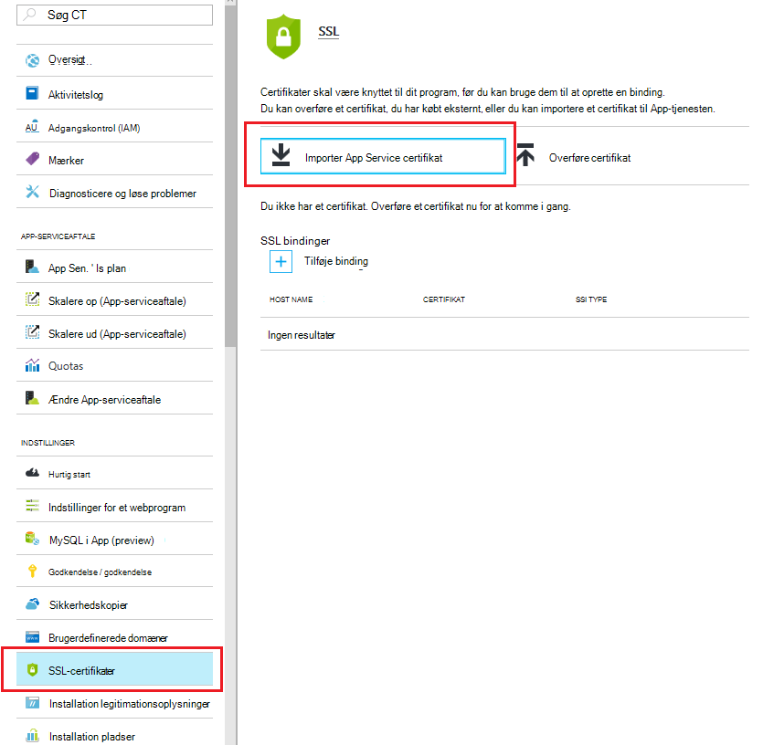
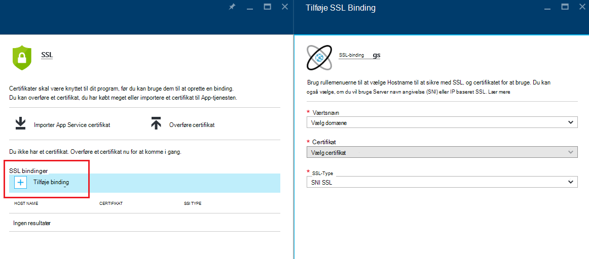
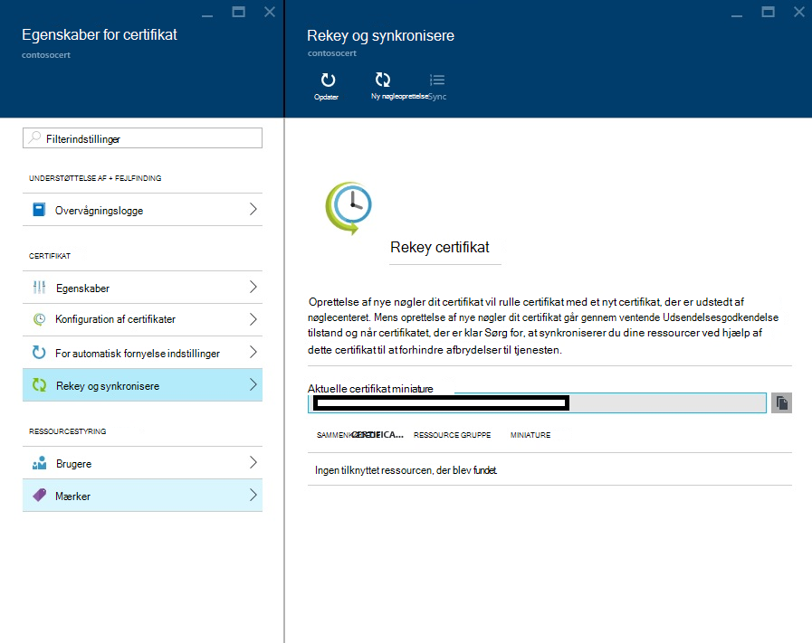

<properties
    pageTitle="Købe og konfigurere et SSL-certifikat til din Azure App-tjeneste"
    description="Lær at købe og konfigurere et SSL-certifikat til din Azure App-tjeneste."
    services="app-service"
    documentationCenter=".net"
    authors="apurvajo"
    manager="stefsch"
    editor="cephalin"
    tags="buy-ssl-certificates"/>

<tags
    ms.service="app-service"
    ms.workload="na"
    ms.tgt_pltfrm="na"
    ms.devlang="na"
    ms.topic="article"
    ms.date="09/19/2016"
    ms.author="apurvajo"/>

#Købe og konfigurere et SSL-certifikat til din Azure App-tjeneste

> [AZURE.SELECTOR]
- [Købe SSL-certifikat i Azure](web-sites-purchase-ssl-web-site.md)
- [Brug SSL-certifikat fra et andet sted](web-sites-configure-ssl-certificate.md)

Som standard **[Azure App Service](http://go.microsoft.com/fwlink/?LinkId=529714)** allerede aktiverer HTTPS til din online med et certifikat med jokertegn for *. azurewebsites.net domæne. Hvis du ikke har planer om at konfigurere et brugerdefineret domæne, kan du drage fordel HTTPS standardcertifikatet. Dog kan lide alle * [jokertegn domæner](https://casecurity.org/2014/02/26/pros-and-cons-of-single-domain-multi-domain-and-wildcard-certificates), det er ikke så sikker som bruger et brugerdefineret domæne med dit eget certifikat. Azure App Service giver dig nu en virkelig forenklet metode til at købe og administrere et SSL-certifikat direkte fra Azure Portal uden at forlade på portalen.  
I denne artikel beskrives det, hvordan du kan købe og konfigurere et SSL-certifikat til din **[Azure App Service](http://go.microsoft.com/fwlink/?LinkId=529714)** i 3 enkle trin. 

> [AZURE.NOTE]
> SSL-certifikater til brugerdefinerede domænenavne kan ikke bruges med gratis og delt WebApp. Du skal konfigurere dine WebApp til Basic, Standard eller Premium tilstand, hvilket kan blive ændret, hvor meget du er faktureret for dit abonnement. Du kan få flere oplysninger i **[Web Apps priser detaljer](https://azure.microsoft.com/pricing/details/web-sites/)** .

##Oversigt
> [AZURE.NOTE]
> Prøv forsøg ikke at købe et SSL-certifikat, der bruger du et abonnement, der ikke har et aktivt kreditkort, der er knyttet til den. Dette kan medføre dit abonnement deaktiveres. 

##<a>Købe, gemme og tildele et SSL-certifikat til dit eget domæne</a>
Hvis du vil aktivere HTTPS til et brugerdefineret domæne, som contoso.com, skal du først ** [konfigurere et brugerdefineret domænenavn i Azure App Service.](web-sites-custom-domain-name.md)**

Inden du anmoder om et SSL-certifikat, skal du først bestemme, hvilke domænenavne er sikret af certifikatet. Dette afgør, hvilken type certifikat skal du anskaffe. Hvis du lige har brug for til at sikre en enkelt domænenavn som contoso.com eller www.contoso.com en Standard (grundlæggende) er det certifikat, der er tilstrækkeligt. Hvis du har brug at sikre flere domænenavne, som contoso.com, www.contoso.com og mail.contoso.com, kan du få et ** [certifikat med jokertegn](http://en.wikipedia.org/wiki/Wildcard_certificate)**

##Trin 0: Afgiv ordre et SSL-certifikat

I dette trin skal lære du, hvordan du bestille et SSL-certifikat efter eget valg.

1.  **[Azure-portalen](https://portal.azure.com/)**, klik på Gennemse og skrive "App Service certifikater" i søgepanelet og vælg "App Service certifikater" på det resultat, og klik på Tilføj. 

    

    

2.  Angiv **fuldt navn** til dit SSL-certifikat.

3.  Angiv **værtsnavn**
> [AZURE.NOTE]
    Dette er en af de vigtigste dele af købet. Sørg for at indtaste korrekte værtsnavn (brugerdefinerede domæne), som du vil beskytte med dette certifikat. **Må du ikke** føje værtsnavn med WWW. Eksempelvis hvis dit eget domænenavn er www.contoso.com og derefter angive lige contoso.com i feltet værtsnavn, Beskyt det pågældende certifikat både www og rod domæner. 
    
4.  Vælg dit **abonnement**. 

    Hvis du har flere abonnementer, Sørg for at oprette et SSL-certifikat i det samme abonnement, du har brugt til dit brugerdefinerede domæne eller Web App pågældende.
       
5.  Vælg eller Opret en **ressourcegruppe**.

    Grupper gør det muligt at administrere relaterede Azure ressourcer som en enhed og er praktiske, når du opretter rollebaseret kontrolelement (RBAC) adgangsregler for dine apps. Yderligere oplysninger finder du se administration af dine Azure ressourcer.
     
6.  Vælg det **certifikat SKU** 

    Til sidst, Vælg certifikat SKU, der passer til dine behov, og klik på Opret. I dag, kan Azure App Service du købe to forskellige lagerenheder • S1 – Standard-certifikat med 1 års validiteten og automatisk fornyelse  
           • W1 – jokertegn certifikat med 1 års validiteten og automatisk fornyelse      
    Du kan få flere oplysninger i **[Web Apps priser detaljer](https://azure.microsoft.com/pricing/details/web-sites/)** .

> [AZURE.NOTE]
> Oprettelse af SSL-certifikat kan tage alt fra 1-10 minutter. Denne proces udfører flere trin i baggrunden, der ellers er meget besværligt at udføre manuelt.  

##Trin 1: Gemme certifikatet i Azure-tasten samling

I dette trin skal lære du, hvordan du placere en Store et SSL-certifikat, du har købt til Azure-tasten samling efter eget valg.

1.  Når SSL-certifikat køb er fuldført skal du åbne **App Service certifikater** ressource blade manuelt ved at gå til den igen (se trin 1 ovenfor)   

    

    Du vil bemærke, at certifikatstatus er **"ventende udstedelse"** , når der er nogle flere ting, du har brug for at fuldføre, før du kan begynde at bruge denne certifikater.
 
2. Klik på **"konfiguration af certifikater"** i Egenskaber for certifikat blade og klik på **"trin 1: gemme"** til at gemme dette certifikat i Azure-tasten samling.

3.  Fra **"nøgle samling Status"** Blade Klik på **"nøgle samling lager"** til at vælge en eksisterende nøgle samling af legitimationsoplysninger til at gemme dette certifikat **eller "oprette ny nøgle samling"** til at oprette nye nøgle samling i samme abonnement og ressource gruppe.
 
    
 
    > [AZURE.NOTE]
    Azure-tasten samling har minimale gebyrer til lagring af dette certifikat. Du kan få flere oplysninger i **[Azure nøgle samling priser detaljer](https://azure.microsoft.com/pricing/details/key-vault/)** .

4. Når du har valgt nøgle samling lager til at gemme dette certifikat i, skal du gå videre og gemme den ved at klikke på knappen **"Gem"** øverst i **"nøgle samling Status"** blade.  

    Dette skal du udføre trin at gemme det certifikat, du har købt med Azure-tasten samling efter eget valg. Efter opdateringen bladet, skal du se afsnittet grøn kontrollere markere mod dette trin samt.
    
##Trin 2: Bekræfte ejerskabet af domænet

I dette trin skal lære du, hvordan du udfører bekræfte domænet ejerskab for et SSL-certifikat, du netop har placeret en rækkefølge for. 

1.  Klik på **"trin 2: bekræfte"** trin fra bladet **"Konfiguration af certifikater"** . Der er 4 typer af domæne bekræftelse understøttes af App Service certifikater.

    * **App Service bekræftelse** 
    
        * Dette er den proces, der passer dig bedst, hvis du allerede har **dit eget domæne, der er tildelt til de Apps, App-tjenesten.** Denne metode kan du se ud af alle de App Service Apps, der opfylder dette kriterium. 
           For eksempel i dette tilfælde **contosocertdemo.com** er et brugerdefineret domæne, der er tildelt til App-tjenesten App hedder **"ContosoCertDemo"** og dermed, er det kun App Service App, der er angivet her. Hvis der er flere områder installation, vil det skrive dem alle på tværs af områderne.
        
           Metoden til bekræftelse er kun tilgængelig for Standard (grundlæggende) certifikat køb. Jokertegn certifikater, skal du gå videre og flytte til indstillingen B, C eller D nedenfor.
        * Klik på **"Bekræft"** for at udføre dette trin.
        * Klik på **"Opdater"** for at opdatere certifikatstatus, når bekræftelsen er fuldført. Det kan tage nogle minutter til godkendelse til at fuldføre.
        
             

    * **Bekræfte domænet** 

        * Dette er den mest praktiske proces **kun, hvis** du har **[har købt dit brugerdefinerede domæne fra Azure App Service.](custom-dns-web-site-buydomains-web-app.md)**
        
        * Klik på **"Bekræft"** for at udføre dette trin.
        
        * Klik på **"Opdater"** for at opdatere certifikatstatus, når bekræftelsen er fuldført. Det kan tage nogle minutter til godkendelse til at fuldføre.

    * **Mail bekræftelse**
        
        * Bekræftelsesmailen er allerede blevet sendt til den e-mail-adresse, der er knyttet til dette brugerdefinerede domæne.
         
        * Åbn mailen, og klik på linket kontrol for at fuldføre trinnet Mailbekræftelsen. 
        
        * Hvis du vil sende igen bekræftelsesmailen, klik på knappen **"sende mail"** .
         
    * **Manuel kontrol**    
                 
        1. **HTML-webside bekræftelse**
        
            * Oprette en HTML-fil med navnet **{Domæne bekræftelse Token}**.html (du kan kopiere tokenet fra han domæne bekræftelse Status Blade)
            
            * Indholdet af denne fil skal være det nøjagtige samme navn på **Domæne bekræftelse Token**.
            
            * Overføre denne fil i roden af den webserver, der er vært for dit domæne.
            
            * Klik på **"Opdater"** for at opdatere certifikatstatus, når bekræftelsen er fuldført. Det kan tage nogle minutter til godkendelse til at fuldføre.
            
            Eksempelvis hvis du køber et standard-certifikat til contosocertdemo.com med domæne bekræftelse Token **'cAGgQrKc'** derefter en webforespørgsel, der er foretaget i **'http://contosocertdemo.com/cAGgQrKc.html'** skal returnere **cAGgQrKc.**
        2. **DNS TXT-post bekræftelse**

            * Ved hjælp af din DNS-administrationen skal oprette en TXT-post på **'DZC'** underdomæne med værdi lig med den **domæne bekræftelse Token.**
            
            * Klik på **"Opdater"** for at opdatere certifikatstatus, når bekræftelsen er fuldført. Det kan tage nogle minutter til godkendelse til at fuldføre.
                              
            For eksempel for at udføre validering for et certifikat med jokertegn med hostname ** \*. contosocertdemo.com** eller ** \*. subdomain.contosocertdemo.com** og domæne bekræftelse Token **cAGgQrKc**, skal du oprette en TXT-post på dzc.contosocertdemo.com med værdi **cAGgQrKc.**     

##Trin 3: Tildele certifikat til App Service App

I dette trin skal lære du, hvordan du tildele det nyligt købt certifikat til din App Service Apps. 

> [AZURE.NOTE]
> Før du udfører trinnene i dette afsnit, skal du knytte et brugerdefineret domænenavn til din app. Se [konfigurere et brugerdefineret domænenavn til en web app.](web-sites-custom-domain-name.md) **kan finde flere oplysninger**

1.  I din browser skal du åbne ** [Azure-portalen.](https://portal.azure.com/)**
2.  Klik på indstillingen **App Service** i venstre side af siden.
3.  Klik på navnet på din app, som du vil tildele dette certifikat. 
4.  **Indstillinger**, klik på **SSL-certifikater**
5.  Klik på **Importér App Service certifikat** , og vælg det certifikat, som du lige har købt

    

6. I **ssl bindinger** afsnit Klik på **Tilføj bindinger**
7. Brug rullemenuerne til at vælge domænenavnet til at sikre med SSL, og certifikatet for at bruge bladet **Tilføje SSL Binding** . Du kan også vælge, om du vil bruge **[Server navn angivelse (SNI)](http://en.wikipedia.org/wiki/Server_Name_Indication)** eller IP baseret SSL.

    

       •    IP based SSL associates a certificate with a domain name by mapping the dedicated public IP address of the server to the domain name. This requires each domain name (contoso.com, fabricam.com, etc.) associated with your service to have a dedicated IP address. This is the traditional          method of associating SSL certificates with a web server.
       •    SNI based SSL is an extension to SSL and **[Transport Layer Security](http://en.wikipedia.org/wiki/Transport_Layer_Security)** (TLS) that allows multiple domains to share the same IP address, with separate security certificates for each domain. Most modern browsers (including Internet Explorer, Chrome, Firefox and Opera) support SNI, however older browsers may not support SNI. For more information on SNI, see the **[Server Name Indication](http://en.wikipedia.org/wiki/Server_Name_Indication)** article on Wikipedia.
       
7. Klik på **Tilføj Binding** for at gemme ændringerne og aktivere SSL.

Hvis du har valgt **IP baseret SSL** og dit eget domæne er konfigureret ved hjælp af en A-post, skal du udføre følgende yderligere trin:

* Når du har konfigureret en IP baseret SSL-binding, en dedikeret IP-adresse er tildelt til din app. Du kan finde denne IP-adresse på siden **brugerdefinerede domæne** under indstillinger for din app, lige over afsnittet **værtsnavne** . Det kan være angivet som **Ekstern IP-adresse**
    
    

    Bemærk, at denne IP-adresse er forskellig fra den virtuelle IP-adresse, der tidligere har brugt til at konfigurere A-posten for dit domæne. Hvis du er konfigureret til at bruge SNI baseret SSL eller er ikke konfigureret til at bruge SSL, vil der være angivet nogen adresse for denne post.
    
2. Ved hjælp af værktøjerne leveres af din domæneregistrator, ændre A-posten for dit eget domænenavn til at pege på IP-adressen fra det forrige trin.
På dette tidspunkt skal du kunne gå til din app med HTTPS:// i stedet for HTTP:// for at bekræfte, at certifikatet, der er blevet konfigureret korrekt.

##Rekey og synkronisere certifikatet

1. Af sikkerhedsmæssige årsager, hvis du får brug for at Rekey dit certifikat derefter blot Vælg **"Rekey og Synkroniser"** indstilling **"Egenskaber for certifikat"** Blade. 

2. Klik på **"Rekey"** for at starte processen. Denne proces kan tage 1-10 minutter at gennemføre. 

    

3. Oprettelse af nye nøgler dit certifikat vil rulle certifikat med et nyt certifikat, der er udstedt af nøglecenteret.
4. Du skal ikke betale for Rekeying for levetiden for certifikatet. 
5. Oprettelse af nye nøgler dit certifikat gennemgår ventende Udsendelsesgodkendelse tilstand. 
6. Kontrollér, at du synkroniserer dine ressourcer ved hjælp af dette certifikat til at forhindre afbrydelser til tjenesten, når certifikatet, der er klar.
7. Indstillingen Synkroniser er ikke tilgængelig for certifikater, der endnu ikke er knyttet til den Web App. 

## Flere ressourcer ##
- [Aktivere HTTPS for en app i Azure App-tjeneste](web-sites-configure-ssl-certificate.md)
- [Købe og konfigurere et brugerdefineret domænenavn i Azure App Service](custom-dns-web-site-buydomains-web-app.md)
- [Microsoft Azure Sikkerhedscenter](/support/trust-center/security/)
- [Konfigurationsindstillinger, der åbnes ved angivelse i Azure websteder](http://azure.microsoft.com/blog/2014/01/28/more-to-explore-configuration-options-unlocked-in-windows-azure-web-sites/)
- [Azure Management-portalen](https://manage.windowsazure.com)

>[AZURE.NOTE] Hvis du vil komme i gang med Azure App Service før tilmelding til en Azure-konto, skal du gå til [Prøve App Service](http://go.microsoft.com/fwlink/?LinkId=523751), hvor du straks kan oprette en forbigående starter WebApp i App-tjeneste. Ingen kreditkort, der kræves. ingen forpligtelser.

