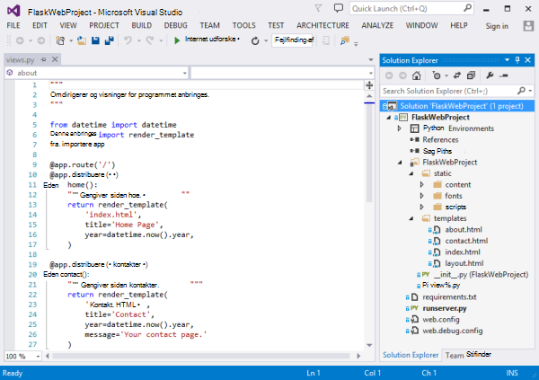
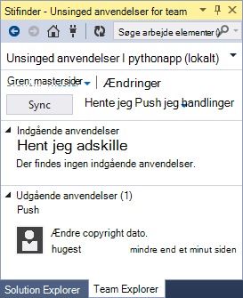
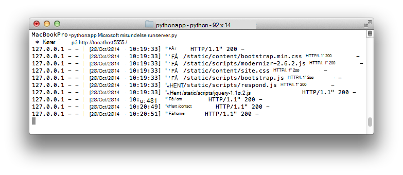

<properties 
    pageTitle="Oprettelse af online med anbringes i Azure" 
    description="Et selvstudium, der introducerer dig til at køre en Python WebApp på Azure." 
    services="app-service\web" 
    documentationCenter="python"
    tags="python"
    authors="huguesv" 
    manager="wpickett" 
    editor=""/>

<tags 
    ms.service="app-service-web" 
    ms.workload="web" 
    ms.tgt_pltfrm="na" 
    ms.devlang="python" 
    ms.topic="article" 
    ms.date="02/20/2016"
    ms.author="huvalo"/>

# Oprettelse af online med anbringes i Azure

Dette selvstudium beskriver, hvordan du kommer i gang kører Python i [Azure App Service Web Apps](http://go.microsoft.com/fwlink/?LinkId=529714).  Web Apps giver begrænset gratis vært og hurtig installation og du kan bruge Python!  Efterhånden som din app vokser, kan du skifte til betalt vært, og du kan også integrere med alle de andre Azure tjenester.

Du opretter et program ved hjælp af anbringes web framework (se alternative versioner af dette selvstudium for [Django](web-sites-python-create-deploy-django-app.md) og [flasker](web-sites-python-create-deploy-bottle-app.md)).  Du kan oprette webstedet fra galleriet Azure, konfigurere ciffer installation og klone lager lokalt.  Derefter vil du køre programmet lokalt, foretag ændringer, acceptere og overføre dem til Azure.  Selvstudiet viser, hvordan du gør dette fra Windows eller Mac/Linux.

[AZURE.INCLUDE [create-account-and-websites-note](../../includes/create-account-and-websites-note.md)]

>[AZURE.NOTE] Hvis du vil komme i gang med Azure App Service før tilmelding til en Azure-konto, skal du gå til [Prøve App Service](http://go.microsoft.com/fwlink/?LinkId=523751), hvor du straks kan oprette en forbigående starter WebApp i App-tjeneste. Ingen kreditkort, der kræves. ingen forpligtelser.

## Forudsætninger

- Windows, Mac eller Linux
- Python 2.7 eller 3.4
- setuptools, pip, virtualenv (kun Python 2.7)
- Ciffer
- [Python Tools til Visual Studio][] (PTVS) - Bemærk: Dette er valgfrit

**Bemærk**: TFS udgivelse understøttes ikke i øjeblikket for Python projekter.

### Windows

Hvis du ikke allerede har Python 2.7 eller 3,4 installerede (32-bit), anbefaler vi installation af [Azure SDK for Python 2.7] eller [Azure SDK for Python 3.4] ved hjælp af Web Platform Installer.  Dette installeres 32-bit versionen af Python, setuptools, pip, virtualenv osv (32-bit Python er, hvad der er installeret på Azure host-computere).  Du kan også åbne Python [python.org].

For ciffer anbefaler vi [Ciffer til Windows] eller [GitHub til Windows].  Hvis du bruger Visual Studio, kan du bruge den integrerede ciffer understøttelse.

Vi anbefaler også installerer [Python værktøjer 2.2 til Visual Studio].  Dette er valgfrit, men hvis du har [Visual Studio], herunder gratis Visual Studio Community 2013 eller Visual Studio Express 2013 til internettet, derefter dette giver dig en god IDE Python.

### Mac/Linux

Du skal have Python og ciffer, der allerede er installeret, men Sørg for, at du har Python 2.7 eller 3.4.

## Oprette online på Azure-portalen

Det første trin til oprettelse af din app er at oprette online via [Azure-portalen](https://portal.azure.com). 

1. Log på portalen Azure, og klik på knappen **Ny** i det nederste venstre hjørne. 
2. Klik på **Web + Mobile**.
3. Skriv "python" i søgefeltet.
4. Vælg **anbringes**i søgeresultaterne, og derefter klikke på **Opret**.
5. Konfigurere den nye anbringes-app, som opretter en ny App Service-plan og en ny ressourcegruppe til den. Klik derefter på **Opret**.
6. Konfigurere ciffer udgivelse for din nyoprettede online ved at følge vejledningen på [Lokale ciffer installation til Azure App-tjenesten](app-service-deploy-local-git.md).

## Oversigt over anvendelse

### Ciffer lager indhold

Her er en oversigt over de filer, finder du i den indledende ciffer lager, som vi vil klone i næste afsnit.

    \FlaskWebProject\__init__.py
    \FlaskWebProject\views.py
    \FlaskWebProject\static\content\
    \FlaskWebProject\static\fonts\
    \FlaskWebProject\static\scripts\
    \FlaskWebProject\templates\about.html
    \FlaskWebProject\templates\contact.html
    \FlaskWebProject\templates\index.html
    \FlaskWebProject\templates\layout.html

Primære kilder til programmet.  Består af 3 sider (indeks, om kontakten) med en masterlayoutet.  Statisk indhold og scripts, som omfatter bootstrap, jquery, modernizr og svar.

    \runserver.py

Understøttelse af lokale udvikling server. Brug dette til at køre programmet lokalt.

    \FlaskWebProject.pyproj
    \FlaskWebProject.sln

Project-filer til brug sammen med [Python Tools til Visual Studio].

    \ptvs_virtualenv_proxy.py

IIS-proxy for virtuelle miljøer og PTVS remote fejlfinding support.

    \requirements.txt

Eksterne pakker, der skal bruges af dette program. Scriptet installation vil pip installere de pakker, der er angivet i filen.
 
    \web.2.7.config
    \web.3.4.config

IIS konfigurationsfiler.  Scriptet installation kan bruge den relevante web.x.y.config og kopiere den som web.config.

### Valgfri filer - tilpasning installation

[AZURE.INCLUDE [web-sites-python-customizing-deployment](../../includes/web-sites-python-customizing-deployment.md)]

### Valgfri filer - Python runtime

[AZURE.INCLUDE [web-sites-python-customizing-runtime](../../includes/web-sites-python-customizing-runtime.md)]

### Flere filer på server

Nogle filer findes på serveren, men det er ikke føjet til ciffer lager.  Disse er oprettet af scriptet installation.

    \web.config

IIS konfigurationsfil.  Oprettet ud fra web.x.y.config på hver installation.

    \env\

Python virtuelt miljø.  Oprettes under installationen, hvis et kompatible virtuelt miljø ikke allerede findes på appen.  Pakker i requirements.txt er pip installeret, men pip springe installationen, hvis der allerede er installeret pakkerne.

I næste 3 afsnit beskrives, hvordan du kan fortsætte med web app udvikling under 3 forskellige miljøer:

- Windows, med Python Tools til Visual Studio
- Windows, med kommandolinjen
- Mac/Linux, med kommandolinjen

## Web app development - Windows - Python Tools til Visual Studio

### Klone lageret

Først skal klone lager ved hjælp af på URL-adressen på Azure-portalen. Se [Lokale ciffer installation til Azure App Service](app-service-deploy-local-git.md)kan finde flere oplysninger.

Åbn den løsningsfil (.sln), der er inkluderet i roden af lageret.

### Oprette virtuelle miljø

Nu skal vi oprette et virtuelt miljø til lokale udvikling.  Højreklik på **Python miljøer** Vælg **Tilføj virtuelt miljø …**.

- Sørg for, at navnet på miljøet er `env`.

- Vælg den grundlæggende fortolker.  Sørg for at bruge den samme version af Python, der er valgt til din online (i runtime.txt eller bladet **Programindstillinger** for din online i portalen Azure).

- Kontrollér, at muligheden for at hente og installere pakker er markeret.

Klik på **Opret**.  Dette vil oprette det virtuelle miljø, og Installer afhængigheder, der er angivet i requirements.txt.

### Køre ved hjælp af udviklingsserver

Tryk på F5 for at starte fejlfindingen og webbrowseren åbnes automatisk til den side, der kører lokalt.

Du kan angive pausepunkter i kilderne, bruge se windows osv.  Se [Python Tools til Visual Studio dokumentation] kan finde flere oplysninger om de forskellige funktioner.

### Foretage ændringer

Nu kan du eksperimentere ved at foretage ændringer i programmet kilder og/eller skabeloner.

Når du har kontrolleret dine ændringer, du acceptere dem til ciffer lager:

### Installere flere pakker

Programmet kan have afhængigheder ud over Python og anbringes.

Du kan installere flere pakker ved hjælp af pip.  Højreklik på det virtuelle miljø for at installere en pakke, og vælg **Installere Python pakke**.

Hvis du vil installere Azure SDK til Python, som giver dig adgang til Azure-lager, service bus og andre Azure tjenester, f.eks `azure`:

Højreklik på det virtuelle miljø, og vælg **Generer requirements.txt** opdatere requirements.txt.

Aktivere ændringerne til requirements.txt til ciffer lager.

### Installere på Azure

Hvis du vil udløse en installation, klik på **Synkroniser** eller **Push**.  Synkronisering sker både en opslagsnål og en hente.

Den første installation vil gå et stykke tid, som det opretter et virtuelt miljø, Installer-pakker osv.

Visual Studio få ikke vist status for installationen.  Hvis du vil gennemse output, skal du se afsnittet om [fejlfinding - installation](#troubleshooting-deployment).

Gå til Azure URL-adressen til at få vist ændringerne.

## Web app development - Windows - kommandolinjen.

### Klone lageret

Først skal klone lager ved hjælp af på URL-adressen på Azure-portalen, og Tilføj Azure lager som en remote. Se [Lokale ciffer installation til Azure App Service](app-service-deploy-local-git.md)kan finde flere oplysninger.

    git clone <repo-url>
    cd <repo-folder>
    git remote add azure <repo-url> 

### Oprette virtuelle miljø

Vi vil oprette et nyt virtuelt miljø til udviklingsformål (Undlad at føje det til lageret).  Virtuelle miljøer i Python er ikke flytbar, så alle arbejder på programmet udvikler kan oprette deres egne lokalt.

Sørg for at bruge den samme version af Python, der er valgt til din online (i runtime.txt eller bladet **Programindstillinger** for din online i portalen Azure).

For Python 2.7:

    c:\python27\python.exe -m virtualenv env

For Python 3.4:

    c:\python34\python.exe -m venv env

Installere eventuelle eksterne pakker, som kræves af dit program. Du kan bruge filen requirements.txt i roden af lageret for at installere pakkerne i din virtuelt miljø:

    env\scripts\pip install -r requirements.txt

### Køre ved hjælp af udviklingsserver

Du kan starte programmet under en udviklingsserver med følgende kommando:

    env\scripts\python runserver.py

Konsollen vises URL-adressen og port serveren lytter til:

Åbn derefter din webbrowser til URL-adressen.

### Foretage ændringer

Nu kan du eksperimentere ved at foretage ændringer i programmet kilder og/eller skabeloner.

Når du har kontrolleret dine ændringer, du acceptere dem til ciffer lager:

    git add <modified-file>
    git commit -m "<commit-comment>"

### Installere flere pakker

Programmet kan have afhængigheder ud over Python og anbringes.

Du kan installere flere pakker ved hjælp af pip.  Skriv for at installere Azure SDK til Python, som giver dig adgang til Azure-lager, service bus og andre Azure tjenester, f.eks.:

    env\scripts\pip install azure

Sørg for at opdatere requirements.txt:

    env\scripts\pip freeze > requirements.txt

Foretag ændringerne:

    git add requirements.txt
    git commit -m "Added azure package"

### Installere på Azure

Hvis du vil udløse en installation, du overføre ændringerne til Azure:

    git push azure master

Output fra scriptet installation, herunder virtuelt miljø oprettelse, installation af pakker, oprettelse af web.config vises.

Gå til Azure URL-adressen til at få vist ændringerne.

## Web app development Mac/Linux - kommandolinjen.

### Klone lageret

Først skal klone lager ved hjælp af på URL-adressen på Azure-portalen, og Tilføj Azure lager som en remote. Se [Lokale ciffer installation til Azure App Service](app-service-deploy-local-git.md)kan finde flere oplysninger.

    git clone <repo-url>
    cd <repo-folder>
    git remote add azure <repo-url> 

### Oprette virtuelle miljø

Vi vil oprette et nyt virtuelt miljø til udviklingsformål (Undlad at føje det til lageret).  Virtuelle miljøer i Python er ikke flytbar, så alle arbejder på programmet udvikler kan oprette deres egne lokalt.

Sørg for at bruge den samme version af Python, der er valgt til din online (i runtime.txt eller bladet **Programindstillinger** for din online i portalen Azure).

For Python 2.7:

    python -m virtualenv env

For Python 3.4:

    python -m venv env
eller pyvenv env

Installere eventuelle eksterne pakker, som kræves af dit program. Du kan bruge filen requirements.txt i roden af lageret for at installere pakkerne i din virtuelt miljø:

    env/bin/pip install -r requirements.txt

### Køre ved hjælp af udviklingsserver

Du kan starte programmet under en udviklingsserver med følgende kommando:

    env/bin/python runserver.py

Konsollen vises URL-adressen og port serveren lytter til:

Åbn derefter din webbrowser til URL-adressen.

### Foretage ændringer

Nu kan du eksperimentere ved at foretage ændringer i programmet kilder og/eller skabeloner.

Når du har kontrolleret dine ændringer, du acceptere dem til ciffer lager:

    git add <modified-file>
    git commit -m "<commit-comment>"

### Installere flere pakker

Programmet kan have afhængigheder ud over Python og anbringes.

Du kan installere flere pakker ved hjælp af pip.  Skriv for at installere Azure SDK til Python, som giver dig adgang til Azure-lager, service bus og andre Azure tjenester, f.eks.:

    env/bin/pip install azure

Sørg for at opdatere requirements.txt:

    env/bin/pip freeze > requirements.txt

Foretag ændringerne:

    git add requirements.txt
    git commit -m "Added azure package"

### Installere på Azure

Hvis du vil udløse en installation, du overføre ændringerne til Azure:

    git push azure master

Output fra scriptet installation, herunder virtuelt miljø oprettelse, installation af pakker, oprettelse af web.config vises.

Gå til Azure URL-adressen til at få vist ændringerne.

## Fejlfinding - pakkeinstallation

[AZURE.INCLUDE [web-sites-python-troubleshooting-package-installation](../../includes/web-sites-python-troubleshooting-package-installation.md)]

## Fejlfinding – virtuelt miljø

[AZURE.INCLUDE [web-sites-python-troubleshooting-virtual-environment](../../includes/web-sites-python-troubleshooting-virtual-environment.md)]

## Næste trin

Følg disse links for at få mere at vide om Python værktøjer, og der Visual Studio: 
 
- [Anbringes dokumentation]
- [Python Tools til Visual Studio dokumentation]

Oplysninger om brug af Azure-Tabellager og MongoDB:

- [MongoDB på Azure med Python Tools til Visual Studio, og der]
- [Azure-Tabellager på Azure med Python Tools til Visual Studio, og der]

Du kan finde flere oplysninger, se også [Python Developer Center](/develop/python/).

## Hvad er ændret
* Finde en vejledning til ændring fra websteder til App-tjenesten: [Azure App Service og dets indvirkning på eksisterende Azure Services](http://go.microsoft.com/fwlink/?LinkId=529714)

<!--Link references-->
[MongoDB på Azure med Python Tools til Visual Studio, og der]: https://github.com/microsoft/ptvs/wiki/Flask-and-MongoDB-on-Azure
[Azure-Tabellager på Azure med Python Tools til Visual Studio, og der]: web-sites-python-ptvs-flask-table-storage.md

<!--External Link references-->
[Azure SDK for Python 2.7]: http://go.microsoft.com/fwlink/?linkid=254281
[Azure SDK for Python 3.4]: http://go.microsoft.com/fwlink/?linkid=516990
[Python.org]: http://www.python.org/
[Ciffer til Windows]: http://msysgit.github.io/
[GitHub til Windows]: https://windows.github.com/
[Python Tools til Visual Studio]: http://aka.ms/ptvs
[Python Tools 2.2 til Visual Studio]: http://go.microsoft.com/fwlink/?LinkID=624025
[Visual Studio]: http://www.visualstudio.com/
[Python Tools til Visual Studio dokumentation]: http://aka.ms/ptvsdocs
[Anbringes dokumentation]: http://flask.pocoo.org/ 
 
