<properties 
    pageTitle="Flasker og Azure Table Storage på Azure med Python værktøjer 2.2 til Visual Studio" 
    description="Lær at bruge værktøjerne Python til Visual Studio til at oprette et flasker-program, der lagrer data i Azure Table Storage og anvende WebApp til Azure App Service Web Apps." 
    services="app-service\web" 
    documentationCenter="python" 
    authors="huguesv" 
    manager="wpickett" 
    editor=""/>

<tags 
    ms.service="app-service-web" 
    ms.workload="web" 
    ms.tgt_pltfrm="na" 
    ms.devlang="python" 
    ms.topic="article" 
    ms.date="07/07/2016"
    ms.author="huvalo"/>

# Flasker og Azure Table Storage på Azure med Python værktøjer 2.2 til Visual Studio 

I dette selvstudium bruger vi [Python Tools til Visual Studio] til at oprette en simpel afstemninger online ved hjælp af en af PTVS eksempelskabeloner. Dette selvstudium findes også som en [video](https://www.youtube.com/watch?v=GJXDGaEPy94).

Online afstemninger definerer en fremstilling til dens lager, så du nemt kan skifte mellem forskellige typer lagre (i hukommelsen, Azure Table Storage MongoDB).

Vi lærer hvordan du opretter en konto til Azure-lager, hvordan du konfigurerer online for at bruge Azure Table Storage, og hvordan publicere online til [Azure App Service Web Apps](http://go.microsoft.com/fwlink/?LinkId=529714).

Se [Python Developer Center] kan finde flere artikler, der dækker udvikling af Azure App Service Web Apps med PTVS ved hjælp af flasker, hvorefter og Django web strukturer, med MongoDB, Azure Table Storage, MySQL-og SQL-Database. Mens i denne artikel fokuserer på App Service, ligner trinnene, når udvikler [Azure Cloud Services].

## Forudsætninger

 - Visual Studio 2015
 - [Python Tools 2.2 til Visual Studio]
 - [Python Tools 2.2 til Visual Studio eksempler VSIX]
 - [Azure SDK værktøjer til VS 2015]
 - [Python 2.7 32-bit] eller [Python 3.4 32-bit]

[AZURE.INCLUDE [create-account-and-websites-note](../../includes/create-account-and-websites-note.md)]

>[AZURE.NOTE] Hvis du vil komme i gang med Azure App Service før tilmelding til en Azure-konto, skal du gå til [Prøve App Service](http://go.microsoft.com/fwlink/?LinkId=523751), hvor du straks kan oprette en forbigående starter WebApp i App-tjeneste. Ingen kreditkort, der kræves. ingen forpligtelser.

## Oprette projektet

I dette afsnit skal oprette vi en Visual Studio-projekt, ved hjælp af et eksempel på en skabelon. Vi oprette et virtuelt miljø og installere påkrævede pakker. Derefter skal vi køre programmet lokalt ved hjælp af standard i hukommelsen lager.

1.  I Visual Studio, skal du vælge **filer**, **Nyt projekt**.

1.  Project-skabeloner fra [Python værktøjer 2.2 til Visual Studio eksempler VSIX] er tilgængelige under **Python**, **eksempler**. Vælg **Afstemninger flasker webprojekt** , og klik på OK for at oprette projektet.

    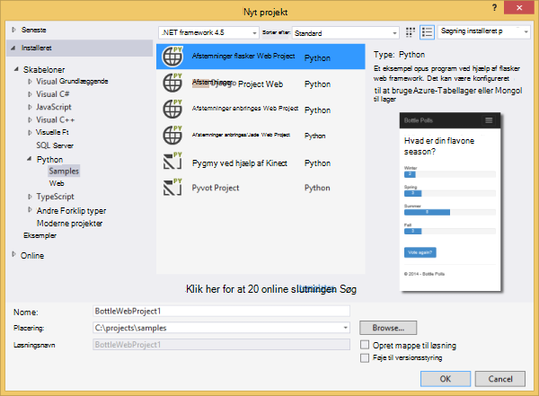

1.  Du bliver bedt om at installere eksterne pakker. Vælg **Installer i et virtuelt miljø**.

    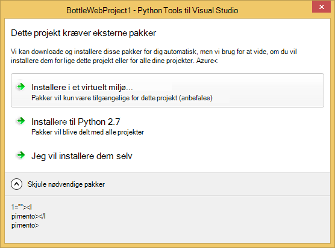

1.  Vælg **Python 2.7** eller **Python 3.4** som basis fortolker.

    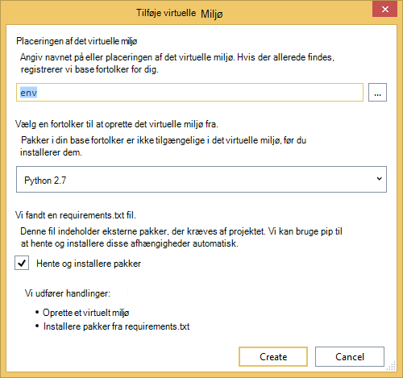

1.  Bekræft, at programmet fungerer, ved at trykke på `F5`. Som standard bruger programmet en i hukommelsen lager, ikke kræver en konfiguration. Alle data går tabt, når Webserveren stoppes.

1.  Klik på **Opret eksempel afstemninger**og derefter klikke på en afstemning og stemme.

    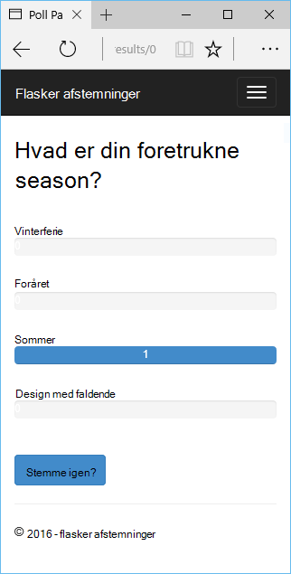

## Oprette en Azure-lager-konto

Hvis du vil bruge lagerplads handlinger, skal have du en Azure-lager-konto. Du kan oprette en lagerplads konto ved at følge disse trin.

1.  Log på [Azure-portalen](https://portal.azure.com/).

1. Klik på ikonet **Ny** øverst til venstre på portalen, klik derefter på **Data + lagerplads** > **Lagerplads konto**.  Klik på knappen **Opret** , tildele kontoen lagerplads et entydigt navn og oprette en ny [ressourcegruppe](../azure-resource-manager/resource-group-overview.md) til den.

    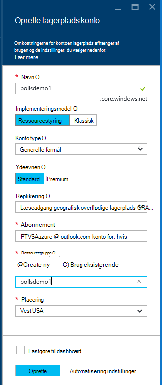

    Når kontoen lagerplads er blevet oprettet, knappen **beskeder** blinker en grøn **succes** og lagerplads firmaets blade er åben til at vise, at den hører til den nye ressourcegruppe, du har oprettet.

1. Klik på **Access-taster** del i lagerplads firmaets blade. Lægge mærke til det kontonavn og nøgle1.

    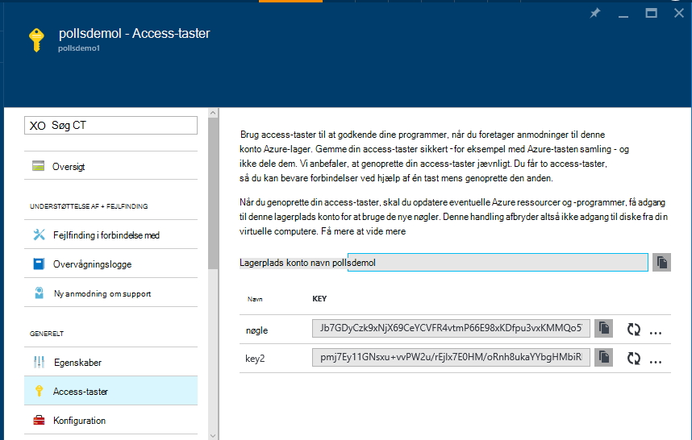

    Vi skal bruge disse oplysninger til at konfigurere dit projekt i næste afsnit.

## Konfigurere projektet

I dette afsnit, skal vi konfigurere vores program tilladelse til at bruge kontoen lagerplads vi lige har oprettet. Vi kan derefter køre programmet lokalt.

1.  Højreklik på din projektnode i Solution Explorer i Visual Studio, og vælg **Egenskaber**. Klik på fanen **fejlfinding** .

    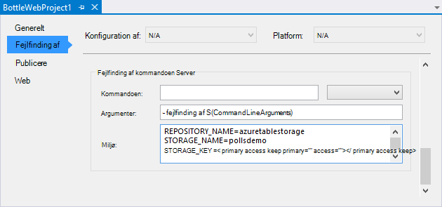

1.  Angive værdier miljø variabler, som kræves af programmet i **Foretage fejlfinding af kommandoen Server**, **miljø**.

        REPOSITORY_NAME=azuretablestorage
        STORAGE_NAME=<storage account name>
        STORAGE_KEY=<primary access key>

    Dette indstiller miljøvariabler når du **Starter fejlfinding**. Hvis du vil have variablerne, der skal angives, når du **Starter uden fejlfinding**, angive de samme værdier under **Kommandoen Kør Server** , der også.

    Du kan også angive miljøvariabler ved hjælp af Windows Kontrolpanel. Dette er et bedre alternativ, hvis du vil undgå at gemme legitimationsoplysninger i kildekode / project-fil. Bemærk, at du skal genstarte Visual Studio til de nye miljø værdier for at være tilgængelige for programmet.

1.  Den kode, der implementerer Azure Table Storage lager er i **models/azuretablestorage.py**. Se i [dokumentationen] til flere oplysninger om at bruge tabel Service fra Python.

1.  Køre programmet med `F5`. Forespørgsler, der er oprettet med **Oprette eksempel afstemninger** og de data, der blev sendt af afstemning kan serialiseres i Azure-Tabellager.

    > [AZURE.NOTE] Python 2.7 virtuelt miljø kan medføre en undtagelse sideskift i Visual Studio.  Tryk på `F5` til at fortsætte med at indlæse webprojektet. 

1.  Gå til siden **om** at bekræfte, at programmet bruger **Azure Table Storage** -lager.

    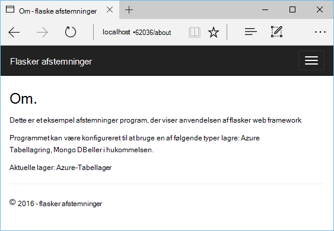

## Udforske Azure-Tabellager

Det er nemt at få vist og redigere lagerplads tabeller ved hjælp af skyen Explorer i Visual Studio. I dette afsnit skal vi bruge Server Explorer til at få vist indholdet af tabellerne afstemninger programmet på computeren.

> [AZURE.NOTE] Dette kræver Microsoft Azure værktøjer skal installeres, som er tilgængelige som en del af [Azure SDK til .NET].

1.  Åbn **Stifinder i skyen**. Udvid **Lagerplads konti**, kontoen lagerplads, derefter **tabeller**.

    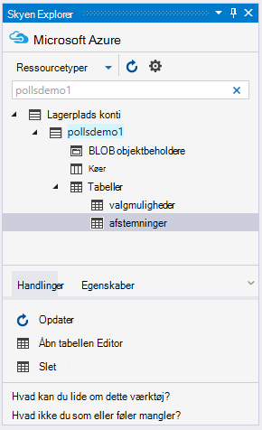

1.  Dobbeltklik på tabellen **afstemninger** eller **valgmuligheder** for at få vist indholdet af tabellen i et dokumentvindue, samt Tilføj/Fjern/rediger enheder.

    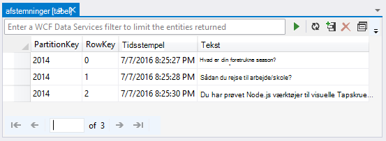

## Publicere online til Azure App Service

Azure .NET SDK indeholder en nem måde at anvende din online til Azure App Service.

1.  Højreklik på projektnoden i **Solution Explorer**, og vælg **Publicer**.

    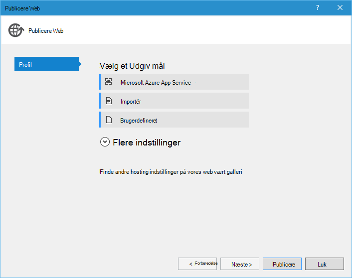

1.  Klik på **Microsoft Azure Webapps**.

1.  Klik på **Ny** for at oprette en ny WebApp.

1.  Udfyld følgende felter, og klik på **Opret**.
    -   **Web App-navn**
    -   **App-serviceaftale**
    -   **Ressourcegruppe**
    -   **Område**
    -   Forlade **databaseserver** indstillet til **ingen database**

1.  Accepter alle andre standardindstillinger, og klik på **Publicer**.

1.  Webbrowseren åbnes automatisk til den publicerede online. Hvis du navigerer til den om side, får du vist, bruges **I hukommelsen** lager, ikke **Azure Table Storage** -lager.

    Det skyldes, at miljøvariabler ikke er angivet på forekomsten Web Apps i Azure App-tjeneste, så det bruger de standardværdier, der er angivet i **settings.py**.

## Konfigurere forekomsten Web Apps

I dette afsnit, skal vi konfigurere miljøvariabler for forekomsten Web Apps.

1.  Åbn den online blade ved at klikke på **Gennemse**i [Azure-portalen], > **App Services** > web app-navn.

1.  Klik på **Indstillinger for alle**i din online blade, og derefter skal du klikke på **Indstillinger for et webprogram**.

1.  Rul ned til sektionen **Indstillinger** , og angiv værdier for **lager\_navnet**, **LAGERPLADS\_navnet** og **LAGERPLADS\_nøgle** som beskrevet i afsnittet **konfiguration af projektet** ovenfor.

    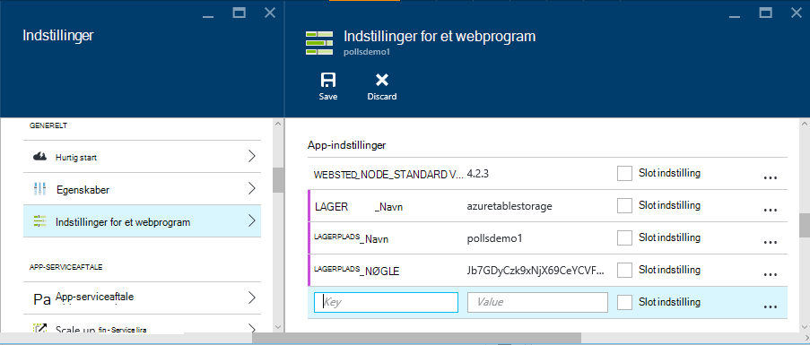

1.  Klik på **Gem**. Når du har modtaget i meddelelser, der blev anvendt ændringerne, klik på **Gennemse** fra den primære blade Web app.

1.  Du bør se web-appen fungerer som forventet, ved hjælp af **Azure Table Storage** -lager.

    Tillykke!

    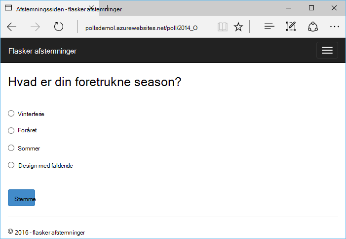

## Næste trin

Følg disse links for at lære mere om Python værktøjer til Visual Studio, flasker og Azure-Tabellager.

- [Python Tools til Visual Studio dokumentation]
  - [Webprojekter]
  - [Skybaseret tjenesteprojekter]
  - [Ekstern fejlfinding på Microsoft Azure]
- [Flasker dokumentation]
- [Azure-lager]
- [Azure SDK for Python]
- [Hvordan du bruger tjenesten tabel Storage fra Python]

## Hvad er ændret
* Finde en vejledning til ændring fra websteder til App-tjenesten: [Azure App Service og dets indvirkning på eksisterende Azure Services](http://go.microsoft.com/fwlink/?LinkId=529714)

<!--Link references-->
[Python Developer Center]: /develop/python/
[Azure-Skytjenester]: ../cloud-services-python-ptvs.md
[dokumentation]: ../storage-python-how-to-use-table-storage.md
[Hvordan du bruger tjenesten tabel Storage fra Python]: ../storage-python-how-to-use-table-storage.md

<!--External Link references-->
[Azure-portalen]: https://portal.azure.com
[Azure SDK til .NET]: http://azure.microsoft.com/downloads/
[Python Tools til Visual Studio]: http://aka.ms/ptvs
[Python Tools 2.2 til Visual Studio]: http://go.microsoft.com/fwlink/?LinkId=624025
[Python Tools 2.2 til Visual Studio eksempler VSIX]: http://go.microsoft.com/fwlink/?LinkId=624025
[Azure SDK værktøjer til VS 2015]: http://go.microsoft.com/fwlink/?LinkId=518003
[Python 2.7 32-bit]: http://go.microsoft.com/fwlink/?LinkId=517190 
[Python 3.4 32-bit]: http://go.microsoft.com/fwlink/?LinkId=517191
[Python Tools til Visual Studio dokumentation]: http://aka.ms/ptvsdocs
[Flasker dokumentation]: http://bottlepy.org/docs/dev/index.html
[Ekstern fejlfinding på Microsoft Azure]: http://go.microsoft.com/fwlink/?LinkId=624026
[Webprojekter]: http://go.microsoft.com/fwlink/?LinkId=624027
[Skybaseret tjenesteprojekter]: http://go.microsoft.com/fwlink/?LinkId=624028
[Azure-lager]: http://azure.microsoft.com/documentation/services/storage/
[Azure SDK for Python]: https://github.com/Azure/azure-sdk-for-python
 
