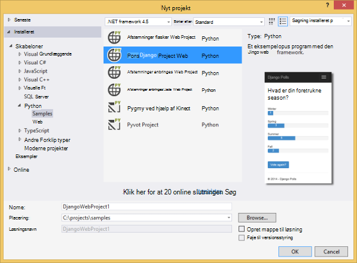
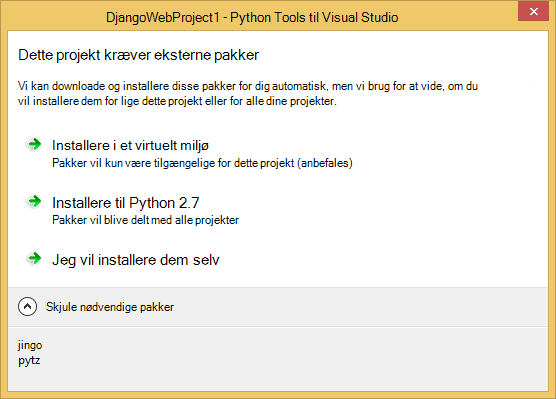
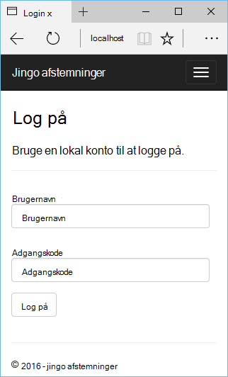
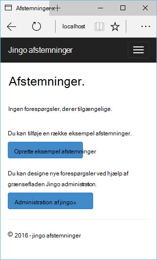
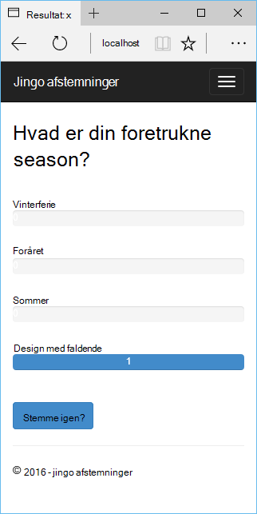
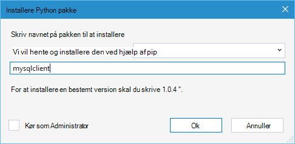
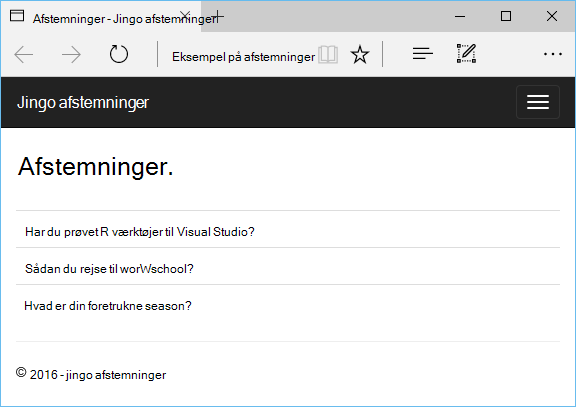

<properties 
    pageTitle="Django og MySQL på Azure med Python værktøjer 2.2 til Visual Studio" 
    description="Lær at bruge værktøjerne Python til Visual Studio til at oprette en Django WebApp, der lagrer data i en forekomst af MySQL-database og installerer det til Azure App Service Web Apps." 
    services="app-service\web" 
    documentationCenter="python" 
    authors="huguesv" 
    manager="wpickett" 
    editor=""/>

<tags 
    ms.service="app-service-web" 
    ms.workload="web" 
    ms.tgt_pltfrm="na" 
    ms.devlang="python"
    ms.topic="get-started-article" 
    ms.date="07/07/2016"
    ms.author="huvalo"/>

# Django og MySQL på Azure med Python værktøjer 2.2 til Visual Studio 

[AZURE.INCLUDE [tabs](../../includes/app-service-web-get-started-nav-tabs.md)]

I dette selvstudium skal du bruge [Python Tools til Visual Studio] (PTVS) til at oprette en simpel afstemninger online ved hjælp af en af PTVS eksempelskabeloner. Du skal lære, hvordan du bruger en MySQL-tjeneste, der er hostet på Azure, konfigurere online for at bruge MySQL og publicere online til [Azure App Service Web Apps](http://go.microsoft.com/fwlink/?LinkId=529714).

> [AZURE.NOTE] Oplysningerne i dette selvstudium findes også i den følgende video:
> 
> [PTVS 2.1: Django app med MySQL][video]

Se [Python Developer Center] kan finde flere artikler, der dækker udvikling af Azure App Service Web Apps med PTVS ved hjælp af flasker, hvorefter og Django web strukturer, med Azure Table Storage, MySQL og SQL-Database-tjenester. Mens i denne artikel fokuserer på App Service, ligner trinnene, når udvikler [Azure Cloud Services].

## Forudsætninger

 - Visual Studio 2015
 - [Python 2.7 32-bit] eller [Python 3.4 32-bit]
 - [Python Tools 2.2 til Visual Studio]
 - [Python Tools 2.2 til Visual Studio eksempler VSIX]
 - [Azure SDK værktøjer til VS 2015]
 - Django 1.9 eller nyere

[AZURE.INCLUDE [create-account-and-websites-note](../../includes/create-account-and-websites-note.md)]

<!-- This note should not render as part of the the previous include. -->

> [AZURE.NOTE] Hvis du vil komme i gang med Azure App Service før tilmelding til en Azure-konto, skal du gå til [Prøve App Service](http://go.microsoft.com/fwlink/?LinkId=523751), hvor du straks kan oprette en forbigående starter WebApp i App-tjeneste. Ingen kreditkort er påkrævet, og ingen forpligtelser er nødvendigt.

## Oprette projektet

I dette afsnit, skal oprette du en Visual Studio-projekt, ved hjælp af et eksempel på en skabelon. Du skal oprette et virtuelt miljø og installere påkrævede pakker. Du vil oprette en lokal database ved hjælp af sqlite. Derefter skal du køre programmet lokalt.

1. I Visual Studio, skal du vælge **filer**, **Nyt projekt**.

1. Project-skabeloner fra [Python værktøjer 2.2 til Visual Studio eksempler VSIX] er tilgængelige under **Python**, **eksempler**. Vælg **Afstemninger Django webprojekt** , og klik på OK for at oprette projektet.

    

1. Du bliver bedt om at installere eksterne pakker. Vælg **Installer i et virtuelt miljø**.

    

1. Vælg **Python 2.7** eller **Python 3.4** som basis fortolker.

    

1. Højreklik på projektnoden i **Solution Explorer**, og vælg **Python**, og vælg derefter **Django overføre**.  Vælg derefter **Django oprette superbruger**.

1. Dette vil åbne en Django Management Console og oprette en sqlite database i projektmappen. Følg vejledningen for at oprette en bruger.

1. Bekræft, at programmet fungerer, ved at trykke på `F5`.

1. Klik på **Log på** navigationslinjen øverst.

    

1. Angiv legitimationsoplysningerne for den bruger, du oprettede, da du synkroniserede databasen.

    

1. Klik på **Opret eksempel afstemninger**.

    

1. Klik på en afstemning, og stemme.

    

## Oprette en MySQL-Database

Til databasen, skal du oprette en hostet ClearDB MySQL-database på Azure.

Du kan oprette din egen virtuelle maskine kører i Azure, og derefter installere og administrere MySQL dig selv som et alternativ.

Du kan oprette en database med en gratis plan ved at følge disse trin.

1. Log på [Azure-portalen].

1. Klik på **Ny**, øverst i navigationsruden og derefter klikke på **Data + lagerplads**, og klik **MySQL-Database**. 

1. Konfigurere den nye MySQL-database ved at oprette en ny ressourcegruppe, og vælg den ønskede placering til den.

1. Når MySQL-database er oprettet, skal du klikke på **Egenskaber** i bladet database.

1. Brug knappen Kopiér til at indsætte værdien af **FORBINDELSESSTRENG** i Udklipsholder.

## Konfigurere projektet

I dette afsnit, skal du konfigurere vores online for at bruge den MySQL-database, du lige har oprettet. Du kan også installere yderligere Python-pakker, der er påkrævet for at bruge MySQL databaser med Django. Derefter skal du køre online lokalt.

1. I Visual Studio, skal du åbne **settings.py**fra mappen *Projektnavn* . Indsætte midlertidigt forbindelsesstrengen i editoren. Forbindelsesstrengen er i dette format:

        Database=<NAME>;Data Source=<HOST>;User Id=<USER>;Password=<PASSWORD>

    Ændre standarddatabasen **ENGINE** bruge MySQL, og Angiv værdierne for **navn**, **bruger**, **adgangskode** og **HOST** fra **CONNECTIONSTRING**.

        DATABASES = {
            'default': {
                'ENGINE': 'django.db.backends.mysql',
                'NAME': '<Database>',
                'USER': '<User Id>',
                'PASSWORD': '<Password>',
                'HOST': '<Data Source>',
                'PORT': '',
            }
        }

1. Højreklik på det virtuelle miljø i Solution Explorer under **Python miljøer**, og vælg **Installere Python pakke**.

1. Installere pakken `mysqlclient` ved hjælp af **pip**.

    

1. Højreklik på projektnoden i **Solution Explorer**, og vælg **Python**, og vælg derefter **Django overføre**.  Vælg derefter **Django oprette superbruger**.

    Dette vil oprette tabeller til den MySQL-database, du oprettede i forrige afsnit. Følg vejledningen for at oprette en bruger, der ikke har så det svarer til brugeren i den sqlite database, der er oprettet i den første sektion i denne artikel.

1. Køre programmet med `F5`. Forespørgsler, der er oprettet med **Oprette eksempel afstemninger** og de data, der blev sendt af afstemning kan serialiseres i MySQL-database.

## Publicere online til Azure App Service

Azure .NET SDK indeholder en nem måde at anvende din online til Azure App Service.

1. Højreklik på projektnoden i **Solution Explorer**, og vælg **Publicer**.

    

1. Klik på **Microsoft Azure App Service**.

1. Klik på **Ny** for at oprette en ny WebApp.

1. Udfyld følgende felter, og klik på **Opret**:
    - **Web App-navn**
    - **App-serviceaftale**
    - **Ressourcegruppe**
    - **Område**
    - Forlade **databaseserver** indstillet til **ingen database**

1. Accepter alle andre standardindstillinger, og klik på **Publicer**.

1. Webbrowseren åbnes automatisk til den publicerede online. Du bør se web-appen fungerer som forventet, ved hjælp af hostes på Azure **MySQL** -database.

    

    Tillykke! Du har publiceret din MySQL-baserede online til Azure.

## Næste trin

Følg disse links for at lære mere om Python værktøjer til Visual Studio, Django og MySQL.

- [Python Tools til Visual Studio dokumentation]
  - [Webprojekter]
  - [Skybaseret tjenesteprojekter]
  - [Ekstern fejlfinding på Microsoft Azure]
- [Django dokumentation]
- [MySQL]

Du kan finde yderligere oplysninger finder [Python Developer Center](/develop/python/).

<!--Link references-->

[Python Developer Center]: /develop/python/
[Azure-Skytjenester]: ../cloud-services-python-ptvs.md

<!--External Link references-->

[Azure-portalen]: https://portal.azure.com
[Python Tools til Visual Studio]: http://aka.ms/ptvs
[Python Tools 2.2 til Visual Studio]: http://go.microsoft.com/fwlink/?LinkID=624025
[Python Tools 2.2 til Visual Studio eksempler VSIX]: http://go.microsoft.com/fwlink/?LinkID=624025
[Azure SDK værktøjer til VS 2015]: http://go.microsoft.com/fwlink/?LinkId=518003
[Python 2.7 32-bit]: http://go.microsoft.com/fwlink/?LinkId=517190 
[Python 3.4 32-bit]: http://go.microsoft.com/fwlink/?LinkId=517191
[Python Tools til Visual Studio dokumentation]: http://aka.ms/ptvsdocs
[Ekstern fejlfinding på Microsoft Azure]: http://go.microsoft.com/fwlink/?LinkId=624026
[Webprojekter]: http://go.microsoft.com/fwlink/?LinkId=624027
[Skybaseret tjenesteprojekter]: http://go.microsoft.com/fwlink/?LinkId=624028
[Django dokumentation]: https://www.djangoproject.com/
[MySQL]: http://www.mysql.com/
[video]: http://youtu.be/oKCApIrS0Lo
