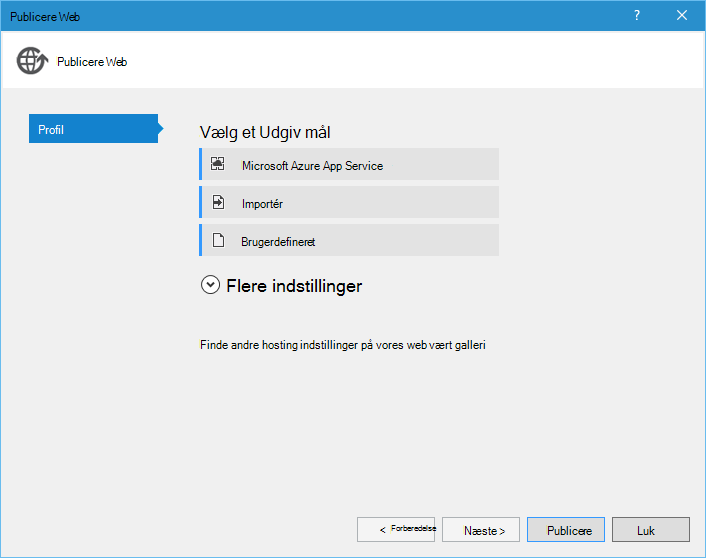

<properties 
    pageTitle="Django og SQL-Database på Azure med Python værktøjer 2.2 til Visual Studio" 
    description="Lær at bruge værktøjerne Python til Visual Studio til at oprette en Django WebApp, der lagrer data i en forekomst af SQL-database og installerer det til Azure App Service Web Apps." 
    services="app-service\web" 
    tags="python"
    documentationCenter="python" 
    authors="huguesv" 
    manager="wpickett" 
    editor=""/>

<tags 
    ms.service="app-service-web" 
    ms.workload="web" 
    ms.tgt_pltfrm="na" 
    ms.devlang="python" 
    ms.topic="article" 
    ms.date="07/07/2016"
    ms.author="huguesv"/>

# Django og SQL-Database på Azure med Python værktøjer 2.2 til Visual Studio 

I dette selvstudium bruger vi [Python Tools til Visual Studio] til at oprette en simpel afstemninger online ved hjælp af en af PTVS eksempelskabeloner. Dette selvstudium findes også som en [video](https://www.youtube.com/watch?v=ZwcoGcIeHF4).

Vi lærer hvordan du bruger en SQL-database, der er hostet på Azure, hvordan du konfigurerer online for at bruge en SQL-database, og hvordan du publicere online til [Azure App Service Web Apps](http://go.microsoft.com/fwlink/?LinkId=529714).

Se [Python Developer Center] kan finde flere artikler, der dækker udvikling af Azure App Service Web Apps med PTVS ved hjælp af flasker, hvorefter og Django web strukturer, med Azure Table Storage, MySQL-og SQL-Database. Mens i denne artikel fokuserer på App Service, ligner trinnene, når udvikler [Azure Cloud Services].

## Forudsætninger

 - Visual Studio 2015
 - [Python 2.7 32-bit]
 - [Python Tools 2.2 til Visual Studio]
 - [Python Tools 2.2 til Visual Studio eksempler VSIX]
 - [Azure SDK værktøjer til VS 2015]
 - Django 1.9 eller nyere

[AZURE.INCLUDE [create-account-and-websites-note](../../includes/create-account-and-websites-note.md)]

>[AZURE.NOTE] Hvis du vil komme i gang med Azure App Service før tilmelding til en Azure-konto, skal du gå til [Prøve App Service](http://go.microsoft.com/fwlink/?LinkId=523751), hvor du straks kan oprette en forbigående starter WebApp i App-tjeneste. Ingen kreditkort, der kræves. ingen forpligtelser.

## Oprette projektet

I dette afsnit skal oprette vi en Visual Studio-projekt, ved hjælp af et eksempel på en skabelon. Vi oprette et virtuelt miljø og installere påkrævede pakker. Vi vil oprette en lokal database ved hjælp af sqlite. Vi kan derefter køre online lokalt.

1.  I Visual Studio, skal du vælge **filer**, **Nyt projekt**.

1.  Project-skabeloner fra [Python værktøjer 2.2 til Visual Studio eksempler VSIX] er tilgængelige under **Python**, **eksempler**. Vælg **Afstemninger Django webprojekt** , og klik på OK for at oprette projektet.

    

1.  Du bliver bedt om at installere eksterne pakker. Vælg **Installer i et virtuelt miljø**.

    

1.  Vælg **Python 2.7** som basis fortolker.

    

1.  Højreklik på projektnoden i **Solution Explorer**, og vælg **Python**, og vælg derefter **Django overføre**.  Vælg derefter **Django oprette superbruger**.

1.  Dette vil åbne en Django Management Console og oprette en sqlite database i projektmappen. Følg vejledningen for at oprette en bruger.

1.  Bekræft, at programmet virker ved at trykke på <kbd>F5</kbd>.

1.  Klik på **Log på** navigationslinjen øverst.

    

1.  Angiv legitimationsoplysningerne for den bruger, du oprettede, da du synkroniserede databasen.

    

1.  Klik på **Opret eksempel afstemninger**.

    

1.  Klik på en afstemning, og stemme.

    

## Oprette en SQL-Database

Databasen, skal vi oprette en Azure SQL-database.

Du kan oprette en database ved at følge disse trin.

1.  Log på [Azure-portalen].

1.  Klik på **Ny**nederst i navigationsruden. , skal du klikke på **Data + lagerplads** > **SQL-Database**.

1.  Konfigurere den nye SQL-Database ved at oprette en ny ressourcegruppe, og vælg den ønskede placering til den.

1.  Når den SQL-Database er oprettet, kan du klikke på **Åbn i Visual Studio** i bladet database.
2.  Klik på **Konfigurer din firewall**.
3.  Tilføj en firewallregel med **START IP-** og **IP-slutningen** indstillet til den offentlige IP-adresse på din computer og udvikling i bladet **Firewall-indstillinger** . Klik på **Gem**.

    Dette vil tillade forbindelser til databaseserveren fra din computer og udvikling.

4.  Klik på **Egenskaber**tilbage i bladet database og derefter klikke på **Vis database forbindelsesstrenge**. 

2.  Brug knappen Kopiér til at indsætte værdien af **ADO.NET** i Udklipsholder.

## Konfigurere projektet

I dette afsnit, skal vi konfigurere vores online for at bruge den SQL-database, vi lige har oprettet. Vi vil også installere yderligere Python-pakker, der er påkrævet for at bruge SQL-databaser med Django. Vi kan derefter køre online lokalt.

1.  I Visual Studio, skal du åbne **settings.py**fra mappen *Projektnavn* . Indsætte midlertidigt forbindelsesstrengen i editoren. Forbindelsesstrengen er i dette format:

        Server=<ServerName>,<ServerPort>;Database=<DatabaseName>;User ID=<UserName>;Password={your_password_here};Encrypt=True;TrustServerCertificate=False;Connection Timeout=30;

Redigere definitionen af `DATABASES` bruge værdierne ovenfor.

        DATABASES = {
            'default': {
                'ENGINE': 'sql_server.pyodbc',
                'NAME': '<DatabaseName>',
                'USER': '<UserName>',
                'PASSWORD': '{your_password_here}',
                'HOST': '<ServerName>',
                'PORT': '<ServerPort>',
                'OPTIONS': {
                    'driver': 'SQL Server Native Client 11.0',
                    'MARS_Connection': 'True',
                }
            }
        }

1.  Højreklik på det virtuelle miljø i Solution Explorer under **Python miljøer**, og vælg **Installere Python pakke**.

1.  Installere pakken `pyodbc` ved hjælp af **pip**.

    

1.  Installere pakken `django-pyodbc-azure` ved hjælp af **pip**.

    

1.  Højreklik på projektnoden i **Solution Explorer**, og vælg **Python**, og vælg derefter **Django overføre**.  Vælg derefter **Django oprette superbruger**.

    Dette vil oprette tabeller til den SQL-database, vi oprettede i forrige afsnit. Følg vejledningen for at oprette en bruger, der ikke har så det svarer til brugeren i den sqlite database, der er oprettet i den første sektion.

1.  Køre programmet med `F5`. Forespørgsler, der er oprettet med **Oprette eksempel afstemninger** og de data, der blev sendt af afstemning kan serialiseres i SQL-database.

## Publicere online til Azure App Service

Azure .NET SDK indeholder en nem måde at anvende din online web til Azure App Service Web Apps.

1.  Højreklik på projektnoden i **Solution Explorer**, og vælg **Publicer**.

    

1.  Klik på **Microsoft Azure Webapps**.

1.  Klik på **Ny** for at oprette en ny WebApp.

1.  Udfyld følgende felter, og klik på **Opret**.
    -   **Web App-navn**
    -   **App-serviceaftale**
    -   **Ressourcegruppe**
    -   **Område**
    -   Forlade **databaseserver** indstillet til **ingen database**

1.  Accepter alle andre standardindstillinger, og klik på **Publicer**.

1.  Webbrowseren åbnes automatisk til den publicerede online. Du bør se web-appen fungerer som forventet, ved hjælp af hostes på Azure **SQL** -database.

    Tillykke!

    

## Næste trin

Følg disse links for at lære mere om Python værktøjer til Visual Studio, Django og SQL-Database.

- [Python Tools til Visual Studio dokumentation]
  - [Webprojekter]
  - [Skybaseret tjenesteprojekter]
  - [Ekstern fejlfinding på Microsoft Azure]
- [Django dokumentation]
- [SQL-Database]

## Hvad er ændret
* Finde en vejledning til ændring fra websteder til App-tjenesten: [Azure App Service og dets indvirkning på eksisterende Azure Services](http://go.microsoft.com/fwlink/?LinkId=529714)

<!--Link references-->
[Python Developer Center]: /develop/python/
[Azure-Skytjenester]: ../cloud-services-python-ptvs.md

<!--External Link references-->
[Azure-portalen]: https://portal.azure.com
[Python Tools til Visual Studio]: http://aka.ms/ptvs
[Python Tools 2.2 til Visual Studio]: http://go.microsoft.com/fwlink/?LinkID=624025
[Python Tools 2.2 til Visual Studio eksempler VSIX]: http://go.microsoft.com/fwlink/?LinkID=624025
[Azure SDK værktøjer til VS 2015]: http://go.microsoft.com/fwlink/?LinkId=518003
[Python 2.7 32-bit]: http://go.microsoft.com/fwlink/?LinkId=517190 
[Python Tools til Visual Studio dokumentation]: http://aka.ms/ptvsdocs
[Ekstern fejlfinding på Microsoft Azure]: http://go.microsoft.com/fwlink/?LinkId=624026
[Webprojekter]: http://go.microsoft.com/fwlink/?LinkId=624027
[Skybaseret tjenesteprojekter]: http://go.microsoft.com/fwlink/?LinkId=624028
[Django dokumentation]: https://www.djangoproject.com/
[SQL-Database]: /documentation/services/sql-database/
