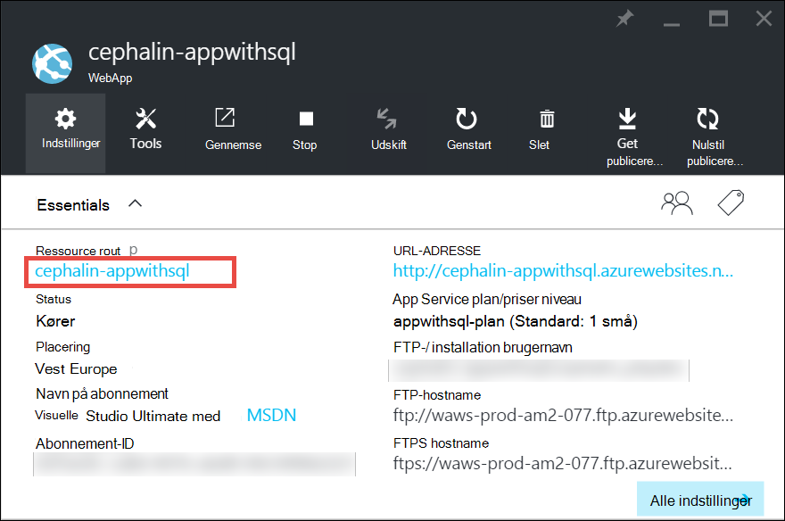
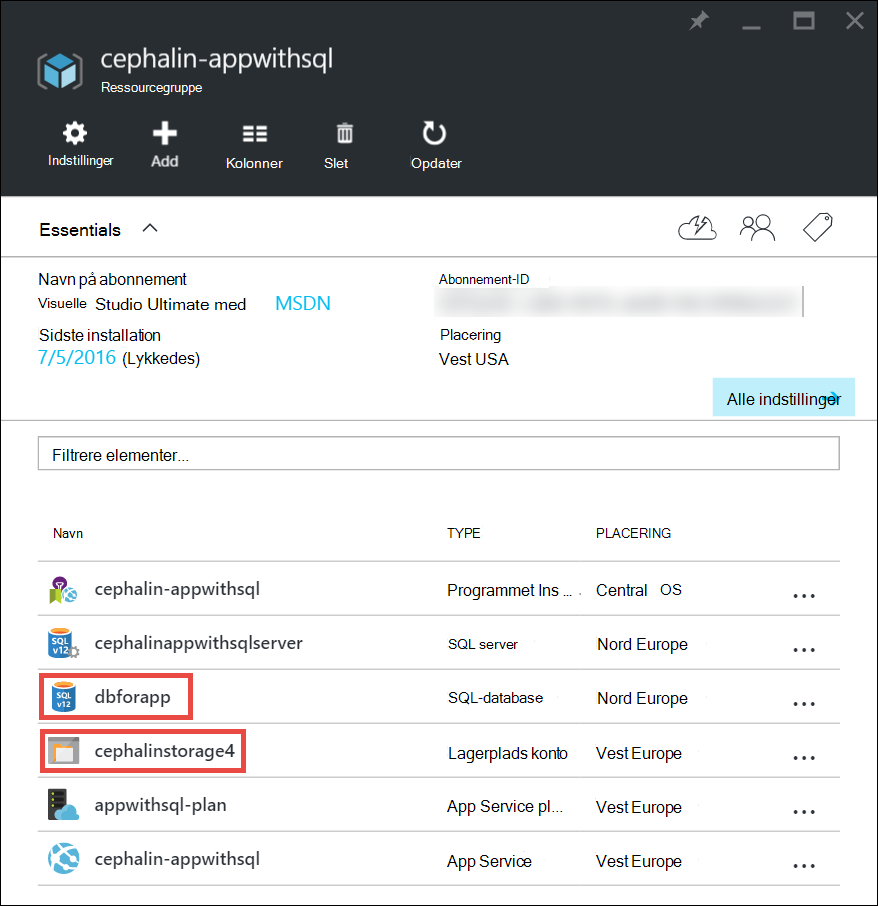
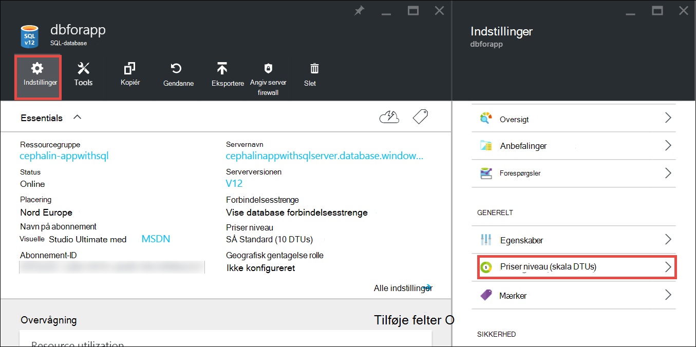
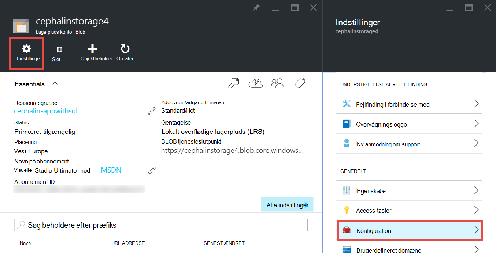

<properties
    pageTitle="Skalere op en app i Azure | Microsoft Azure"
    description="Lær at skalere op en app i Azure App-tjeneste til at tilføje kapacitet og funktioner."
    services="app-service"
    documentationCenter=""
    authors="cephalin"
    manager="wpickett"
    editor="mollybos"/>

<tags
    ms.service="app-service"
    ms.workload="na"
    ms.tgt_pltfrm="na"
    ms.devlang="na"
    ms.topic="article"
    ms.date="07/05/2016"
    ms.author="cephalin"/>

# Skalere op en app i Azure #

I denne artikel beskrives, hvordan skalere din app i Azure App-tjeneste. Der er to arbejdsprocesser for skalering, skala op og Skaler ud, og i denne artikel forklares skalaen op arbejdsproces.

- [Skalere op](https://en.wikipedia.org/wiki/Scalability#Horizontal_and_vertical_scaling): få flere CPU, hukommelse, diskplads og ekstra funktioner som dedikeret virtuelle maskiner (VM'er), brugerdefinerede domæner og certifikater, arrangere pladser og Autoskalering. Du kan skalere ved at ændre det priser niveau i den App serviceaftale, som din app tilhører.
- [Skaler ud](https://en.wikipedia.org/wiki/Scalability#Horizontal_and_vertical_scaling): Forøg antallet af VM forekomster, der kører din app.
Du kan skalere på op til 20 forekomster, afhængigt af din priser lag. [App Service miljøer](../app-service/app-service-app-service-environments-readme.md) i **Premium** lag, yderligere øger dit skala fra antal til 50 forekomster. Se [skalere forekomst Tæl manuelt eller automatisk](../monitoring-and-diagnostics/insights-how-to-scale.md)kan finde flere oplysninger om skalering af. Der kan du finde ud af, hvordan du bruger Autoskalering, hvilket er skalere forekomst tælle automatisk baseret på foruddefinerede regler og tidsplaner.

Skalaindstillingerne for tage kun sekunder at anvende og påvirker alle apps i din [App-serviceaftale](../app-service/azure-web-sites-web-hosting-plans-in-depth-overview.md).
De kræver ikke at ændre din kode eller geninstaller dit program.

Du kan finde oplysninger om priser og funktioner i individuelle App tjenesteplanerne [App oplysninger om priser](/pricing/details/web-sites/).  

> [AZURE.NOTE] Før du skifter en App-serviceaftale fra **gratis** niveau, skal du først fjerne den [bruger begrænsninger](/pricing/spending-limits/) i stedet for abonnementet Azure. For at få vist eller ændre indstillingerne for dit Microsoft Azure App Service abonnement skal du se [Microsoft Azure abonnementer][azuresubscriptions].

## Skalere op din priser niveau

1. I din browser skal du åbne [Azure portal][portal].

2. Klik på **Indstillinger for alle**i din app blade, og derefter klikke på **Skaler op**.

    ![Navigere for at skalere op Azure-app.][ChooseWHP]

4. Vælg dit niveau, og klik derefter på **Vælg**.

    Fanen **meddelelser** blinker en grøn **succes** , når handlingen er fuldført.

## Skalere relaterede ressourcer
Hvis din app er afhængigt af andre tjenester, som Azure SQL-Database eller Azure-lager, kan du også skalere disse ressourcer, der er baseret på dine behov. Disse ressourcer er ikke skaleret med App-serviceaftale og skal skaleres separat.

1. Klik på linket **ressourcegruppe** **Essentials**.

    

2. Klik på en ressource, som du vil skalere i **Oversigt** -del af bladet **ressourcegruppe** . Følgende skærmbillede viser en SQL-Database ressource og en ressource til Azure-lager.

    

3. Klik på **Indstillinger**for en SQL-Database ressource > **priser lag** til at skalere det priser klasse.

    

    Du kan også aktivere [geografisk gentagelse](../sql-database/sql-database-geo-replication-overview.md) til din forekomst af SQL-Database.

    Klik på **Indstillinger**for en ressource Azure-lager, > **konfiguration** skalere af dine indstillinger for lagring.

    

## Få mere at vide om udviklerfunktioner
Afhængigt af det priser niveau er følgende udvikler-et overblik over funktioner tilgængelige:

### Bittæthed ###

- De **grundlæggende**, **Standard**og **Premium** lag understøtter 64-bit og 32-bit-programmer.
- **Gratis** og **delt** plan niveauer understøtter kun 32-bit-programmer.

### Understøttelse af fejlfinding ###

- Understøttelse af fejlfindingsværktøjet er tilgængelig for **gratis**, **delt**og **grundlæggende** tilstande på én forbindelse i App-serviceaftale.
- Understøttelse af fejlfindingsværktøjet er tilgængelig for **Standard** og **Premium** tilstandene på fem samtidige forbindelser i App-serviceaftale.

## Få mere at vide om andre funktioner

- Du kan finde detaljerede oplysninger om alle de resterende funktioner i App Service-planer, herunder priser og funktioner i interesse for alle brugere (herunder udviklere) [App oplysninger om priser](/pricing/details/web-sites/).

>[AZURE.NOTE] Hvis du vil Introduktion til Azure App Service, før du tilmelder dig en Azure-konto, skal du gå til [Prøve App Service](http://go.microsoft.com/fwlink/?LinkId=523751) , hvor du straks kan oprette en forbigående starter WebApp i App-tjeneste. Der kræves ingen kreditkort, og der er ingen forpligtelser.

## Næste trin

- For at komme i gang med Azure skal du se [Microsoft Azure gratis prøveversion](/pricing/free-trial/).
- Besøg følgende links for at få oplysninger om priser, support og SERVICENIVEAUAFTALE.

    [Data overfører prisoplysninger](/pricing/details/data-transfers/)

    [Microsoft Azure Support-planer](/support/plans/)

    [Serviceaftaler](/support/legal/sla/)

    [SQL-Database priser detaljer](/pricing/details/sql-database/)

    [Virtuelt og skyen Service størrelser til Microsoft Azure][vmsizes]

    [Detaljer om App tjenesten priser](/pricing/details/app-service/)

    [App Service priser detaljer - SSL-forbindelser](/pricing/details/web-sites/#ssl-connections)

- Finde oplysninger om Azure App Service bedste fremgangsmåder, herunder opbygning af en SVG og tolerant arkitektur [bedste praksis: Azure App Service Web Apps](http://blogs.msdn.com/b/windowsazure/archive/2014/02/10/best-practices-windows-azure-websites-waws.aspx).

- Du kan finde videoer om skalering App Service apps, i følgende ressourcer:

    - [Hvornår skal jeg skalere Azure websteder - med Stefans Schackow](/documentation/videos/azure-web-sites-free-vs-standard-scaling/)
    - [Automatisk skalering Azure websteder, CPU eller planlagte - med Stefans Schackow](/documentation/videos/auto-scaling-azure-web-sites/)
    - [Hvordan Azure websteder Skaler - med Stefans Schackow](/documentation/videos/how-azure-web-sites-scale/)

<!-- LINKS -->
[vmsizes]:/pricing/details/app-service/
[SQLaccountsbilling]:http://go.microsoft.com/fwlink/?LinkId=234930
[azuresubscriptions]:http://go.microsoft.com/fwlink/?LinkID=235288
[portal]: https://portal.azure.com/

<!-- IMAGES -->
[ChooseWHP]: ./media/web-sites-scale/scale1ChooseWHP.png
[ChooseBasicInstances]: ./media/web-sites-scale/scale2InstancesBasic.png
[SaveButton]: ./media/web-sites-scale/05SaveButton.png
[BasicComplete]: ./media/web-sites-scale/06BasicComplete.png
[ScaleStandard]: ./media/web-sites-scale/scale3InstancesStandard.png
[Autoscale]: ./media/web-sites-scale/scale4AutoScale.png
[SetTargetMetrics]: ./media/web-sites-scale/scale5AutoScaleTargetMetrics.png
[SetFirstRule]: ./media/web-sites-scale/scale6AutoScaleFirstRule.png
[SetSecondRule]: ./media/web-sites-scale/scale7AutoScaleSecondRule.png
[SetThirdRule]: ./media/web-sites-scale/scale8AutoScaleThirdRule.png
[SetRulesFinal]: ./media/web-sites-scale/scale9AutoScaleFinal.png
[ResourceGroup]: ./media/web-sites-scale/scale10ResourceGroup.png
[ScaleDatabase]: ./media/web-sites-scale/scale11SQLScale.png
[GeoReplication]: ./media/web-sites-scale/scale12SQLGeoReplication.png
