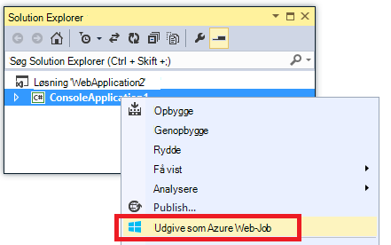

<properties 
    pageTitle="Installere WebJobs ved hjælp af Visual Studio" 
    description="Lær at implementere Azure WebJobs til Azure App Service Web Apps ved hjælp af Visual Studio." 
    services="app-service" 
    documentationCenter="" 
    authors="tdykstra" 
    manager="wpickett" 
    editor="jimbe"/>

<tags 
    ms.service="app-service" 
    ms.devlang="dotnet" 
    ms.topic="article" 
    ms.tgt_pltfrm="na" 
    ms.workload="na" 
    ms.date="04/27/2016" 
    ms.author="tdykstra"/>

# Installere WebJobs ved hjælp af Visual Studio

## Oversigt

Dette emne forklares, hvordan du bruger Visual Studio til at anvende en Console program-projektet til en WebApp i [App Service](http://go.microsoft.com/fwlink/?LinkId=529714) som en [Azure WebJob](http://go.microsoft.com/fwlink/?LinkId=390226). Du kan finde oplysninger om, hvordan du installerer WebJobs ved hjælp af [Azure Portal](https://portal.azure.com) [køre baggrund opgaver med WebJobs](web-sites-create-web-jobs.md).

Når Visual Studio installerer et WebJobs aktiverede Console programmet projekt, udfører to opgaver:

* Kopier runtime-filer til den relevante mappe i WebApp (*App_Data/job/fortløbende* for fortløbende WebJobs, *App_Data/job/udløste* planlagte og on demand WebJobs).
* Konfigurere [Azure planlægger-job](#scheduler) for WebJobs, der er planlagt til at køre på bestemte tidspunkter. (Dette er ikke nødvendigt for fortløbende WebJobs.)

Et WebJobs aktiverede projekt har føjet til den følgende elementer:

* Pakken [Microsoft.Web.WebJobs.Publish](http://www.nuget.org/packages/Microsoft.Web.WebJobs.Publish/) NuGet.
* En [webjob publicere settings.json](#publishsettings) -fil, der indeholder indstillinger for installation og Opgavestyring. 

Du kan føje disse elementer til et eksisterende projekt Console programmet eller bruge en skabelon til at oprette et nyt projekt WebJobs aktiverede Console-program. 

Du kan installere et projekt som en WebJob alene, eller du kan sammenkæde det til et webprojekt, så det installerer automatisk, når du installerer webprojektet. Hvis du vil sammenkæde projekter, omfatter Visual Studio navnet på projektet WebJobs aktiverede i filen [webjobs list.json](#webjobslist) i webprojektet.

## Forudsætninger

WebJobs installation funktioner er tilgængelige i Visual Studio 2015, når du installerer Azure SDK til .NET:

* [Azure SDK til .NET (Visual Studio-2015)](http://go.microsoft.com/fwlink/?linkid=518003).

## Aktivere WebJobs installation for et eksisterende projekt Console-program

Har du to muligheder:

* [Aktivere automatiske-installation med et webprojekt](#convertlink).

    Konfigurere et eksisterende projekt Console-program, så den automatisk har installerer som en WebJob, når du installerer et webprojekt. Brug denne indstilling, når du vil køre din WebJob i den samme WebApp, hvor du kører den relaterede webprogram.

* [Aktivere installation uden et webprojekt](#convertnolink).

    Konfigurere et eksisterende projekt Console programmet skal installeres som en WebJob alene, med ingen link til et webprojekt. Brug denne indstilling, når du vil køre en WebJob i en online alene med noget webprogram, der kører i WebApp. Du vil gøre dette for at kunne skalere ressourcerne WebJob uafhængigt af ressourcerne web application.

### Aktivere automatiske WebJobs-installation med et webprojekt
  
1. Højreklik på webprojektet i **Solution Explorer**, og klik derefter på **Tilføj** > **Eksisterende projekt som Azure WebJob**.

    
    
    Dialogboksen [Tilføj Azure WebJob](#configure) vises.

1. Vælg Console programmet projektet tilføje som en WebJob i rullelisten **Projektnavn** .

    

2. Fuldføre dialogboksen [Tilføj Azure WebJob](#configure) , og klik derefter på **OK**. 

### Aktivere WebJobs installation uden et webprojekt
  
1. Højreklik på Console programmet projektet i **Solution Explorer**, og klik derefter på **Udgiv som Azure WebJob**. 

    
    
    Dialogboksen [Tilføj Azure WebJob](#configure) vises med det projekt, der er valgt i feltet **Projektnavn** .

2.  Udfyld dialogboksen [Tilføj Azure WebJob](#configure) , og klik derefter på **OK**.

    Guiden **Udgiv websted** vises.  Hvis du ikke vil udgive med det samme, skal du lukke guiden. De indstillinger, du har angivet, gemmes til, når du vil [anvende projektet](#deploy).

## Oprette et nyt WebJobs aktiverede projekt

Hvis du vil oprette et nyt WebJobs aktiverede projekt, kan du bruge projektskabelon Console-program og aktivere WebJobs installation, som beskrevet i [forrige afsnit](#convert). Som et alternativ kan du bruge skabelonen WebJobs nyt projekt:

* [Brug af skabelonen WebJobs nyt projekt til en uafhængig WebJob](#createnolink)

    Oprette et projekt, og Konfigurer den til at udrulle alene som en WebJob, med ingen link til et webprojekt. Brug denne indstilling, når du vil køre en WebJob i en online alene med noget webprogram, der kører i WebApp. Du vil gøre dette for at kunne skalere ressourcerne WebJob uafhængigt af ressourcerne web application.

* [Brug af skabelonen WebJobs nyt projekt til en WebJob, der er knyttet til et webprojekt](#createlink)

    Oprette et projekt, der er konfigureret til at installere automatisk som en WebJob, når et webprojekt i den samme løsning er installeret. Brug denne indstilling, når du vil køre din WebJob i den samme WebApp, hvor du kører den relaterede webprogram.

> [AZURE.NOTE] Skabelonen WebJobs nyt projekt installerer NuGet pakker og indeholder kode i *Program.cs* til [WebJobs SDK](http://www.asp.net/aspnet/overview/developing-apps-with-windows-azure/getting-started-with-windows-azure-webjobs)automatisk. Hvis du ikke vil bruge i WebJobs SDK eller vil bruge en planlagt i stedet for fortløbende WebJob, fjerne eller ændre den `host.RunAndBlock` -sætning i *Program.cs*.

### Brug af skabelonen WebJobs nyt projekt til en uafhængig WebJob
  
1. Klik på **filer** > **Nyt projekt**, og klik derefter på **skyen**i dialogboksen **Nyt projekt**  > **Microsoft Azure WebJob**.

    
    
2. Følg anvisningerne vist tidligere for at [gøre programmet Console et uafhængigt WebJobs projekt i project](#convertnolink).

### Brug af skabelonen WebJobs nyt projekt til en WebJob, der er knyttet til et webprojekt

1. Højreklik på webprojektet i **Solution Explorer**, og klik derefter på **Tilføj** > **Azure WebJob projekt**.

    

    Dialogboksen [Tilføj Azure WebJob](#configure) vises.

2. Udfyld dialogboksen [Tilføj Azure WebJob](#configure) , og klik derefter på **OK**.

## Dialogboksen Tilføj Azure WebJob

Dialogboksen **Tilføj Azure WebJob** gør det muligt at angive WebJob navn og planlægning af indstillinger for din WebJob. 

Felterne i denne dialogboks svarer til felter i dialogboksen **Nyt Job** af portalen Azure. Du kan finde yderligere oplysninger finder [køre baggrund opgaver med WebJobs](web-sites-create-web-jobs.md).

For en planlagt WebJob (ikke for fortløbende WebJobs) opretter Visual Studio en [Azure Scheduler](/services/scheduler/) job af websteder, hvis der ikke findes, og der oprettes en sag i gruppen af websteder:

* Samlingen scheduler job hedder *WebJobs-{regionname}* hvor *{regionname}* refererer til området på World Wide web app er hostet i. For eksempel: WebJobs WestUS.
* Scheduler jobbet hedder *{webappname}-{webjobname}*. For eksempel: MyWebApp MyWebJob. 
 
>[AZURE.NOTE]
> 
>* Se oplysninger om kommandolinjen installation, [aktivering kommandolinjeparametre eller fortløbende levering af Azure WebJobs](/blog/2014/08/18/enabling-command-line-or-continuous-delivery-of-azure-webjobs/).
>* Hvis du konfigurerer et **Gentaget opgave** og angive gentagelseshyppighed til et antal minutter, er tjenesten Azure Scheduler ikke gratis. Andre frekvens (timer, dage og så videre) er gratis.
>* Hvis du installerer en WebJob og beslut derefter, du vil ændre typen af WebJob og genimplementeringen, skal du slette filen webjobs publicere settings.json. Det gør Visual Studio vise udgivelsesindstillingerne igen, så du kan ændre typen WebJob.
>* Hvis du installerer en WebJob og senere ændrer tilstanden køre fra fortløbende til ikke-sammenhængende eller omvendt, opretter Visual Studio en ny WebJob i Azure, når du geninstallere. Hvis du ændrer andre indstillinger for planlægning og Forlad køre tilstand den samme eller skifte mellem planlagt og On Demand, Visual Studio opdaterer eksisterende jobbet stedet for at oprette en ny.

## webjob publicere settings.json

Når du konfigurerer et Console program til WebJobs installation, Visual Studio installerer [Microsoft.Web.WebJobs.Publish](http://www.nuget.org/packages/Microsoft.Web.WebJobs.Publish/) NuGet pakke og gemmer planlægningsoplysninger i en *webjob publicere settings.json* fil i projektmappen *Egenskaber* for WebJobs projektet. Her er et eksempel af den pågældende fil:

        {
          "$schema": "http://schemastore.org/schemas/json/webjob-publish-settings.json",
          "webJobName": "WebJob1",
          "startTime": "2014-06-23T00:00:00-08:00",
          "endTime": "2014-06-27T00:00:00-08:00",
          "jobRecurrenceFrequency": "Minute",
          "interval": 5,
          "runMode": "Scheduled"
        }

Du kan redigere denne fil direkte, og Visual Studio indeholder IntelliSense. Skemaet fil er gemt på [http://schemastore.org](http://schemastore.org/schemas/json/webjob-publish-settings.json) og kan ses der.  

>[AZURE.NOTE]
>
>* Hvis du konfigurerer et **Gentaget opgave** og angive gentagelseshyppighed til et antal minutter, er tjenesten Azure Scheduler ikke gratis. Andre frekvens (timer, dage og så videre) er gratis.

## webjobs list.json

Når du sammenkæder et WebJobs aktiverede projekt til et webprojekt, gemmer Visual Studio navnet på projektet WebJobs i filen *webjobs list.json* i web projektets *Egenskaber for* mappe. Listen kan indeholde flere WebJobs projekter, som vist i følgende eksempel:

        {
          "$schema": "http://schemastore.org/schemas/json/webjobs-list.json",
          "WebJobs": [
            {
              "filePath": "../ConsoleApplication1/ConsoleApplication1.csproj"
            },
            {
              "filePath": "../WebJob1/WebJob1.csproj"
            }
          ]
        }

Du kan redigere denne fil direkte, og Visual Studio indeholder IntelliSense. Skemaet fil er gemt på [http://schemastore.org](http://schemastore.org/schemas/json/webjobs-list.json) og kan ses der.
  
## Installere et WebJobs projekt

Et WebJobs projekt, som du har knyttet til en project web installerer automatisk med webprojektet. Finde oplysninger om web project installation, se, [hvordan skal installeres til Web Apps](web-sites-deploy.md).

Hvis du vil installere et WebJobs projekt alene, skal du højreklikke på projektet i **Solution Explorer**, og klik på **Publicer som Azure WebJob**. 

    
For en uafhængig WebJob guiden samme **Udgiv websted** , der bruges til webprojekter vises, men med færre indstillinger, der er tilgængeligt til at ændre.

## Næste trin

I denne artikel har forklares, hvordan du kan installere WebJobs ved hjælp af Visual Studio. Du kan finde flere oplysninger om, hvordan du installerer Azure WebJobs [Azure WebJobs - anbefalede ressourcer - installation](http://www.asp.net/aspnet/overview/developing-apps-with-windows-azure/azure-webjobs-recommended-resources#deploying).
