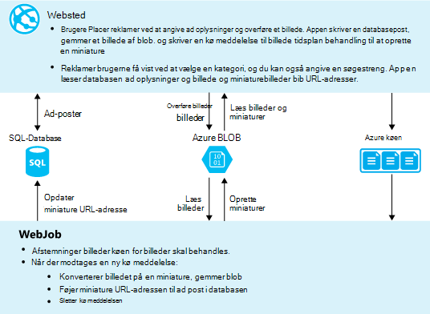

<properties
    pageTitle="Oprette en .NET WebJob i Azure App Service | Microsoft Azure"
    description="Oprette en med flere lag app ved hjælp af ASP.NET MVC og Azure. Den front end-kører i en WebApp i Azure App-tjeneste, og back end-kører som en WebJob. Appen bruger enhed Framework, SQL-Database og Azure lagerplads køer og BLOB."
    services="app-service"
    documentationCenter=".net"
    authors="tdykstra"
    manager="wpickett"
    editor="mollybos"/>

<tags
    ms.service="app-service"
    ms.workload="na"
    ms.tgt_pltfrm="na"
    ms.devlang="na"
    ms.topic="article"
    ms.date="10/28/2016"
    ms.author="tdykstra"/>

# Oprette en .NET WebJob i Azure App Service

Dette selvstudium viser, hvordan du kan skrive kode for et enkelt med flere lag ASP.NET MVC 5-program, der bruger [WebJobs SDK](websites-dotnet-webjobs-sdk.md).

Formålet med [WebJobs SDK](websites-webjobs-resources.md) er at forenkle den kode, du skriver til almindelige opgaver, en WebJob kan udføre som billedbehandling, kø behandling, RSS-sammenlægning, vedligeholdelse og sende mails. WebJobs SDK indeholder indbyggede funktioner til at arbejde med Azure-lager og Service Bus til planlægning af opgaver og håndtering af fejl og mange andre almindelige scenarier. Desuden den er udviklet til at være extensible, og der er en [åbne kilde lager til extensions](https://github.com/Azure/azure-webjobs-sdk-extensions/wiki/Binding-Extensions-Overview).

Eksempelprogrammet er en reklame opslagstavle. Brugere kan overføre billeder til Active Directory, og en back end-proces konverterer billeder til miniaturer. Listesiden ad viser miniature og oplysningssiden ad viser billedet i fuld størrelse. Her er et skærmbillede:

Dette eksempelprogram fungerer med [Azure køer](http://www.asp.net/aspnet/overview/developing-apps-with-windows-azure/building-real-world-cloud-apps-with-windows-azure/queue-centric-work-pattern) og [Azure BLOB](http://www.asp.net/aspnet/overview/developing-apps-with-windows-azure/building-real-world-cloud-apps-with-windows-azure/unstructured-blob-storage). Selvstudiet viser, hvordan du installerer programmet [Azure App tjeneste](http://go.microsoft.com/fwlink/?LinkId=529714) og [Azure SQL-Database](http://msdn.microsoft.com/library/azure/ee336279).

## Forudsætninger

Selvstudiet antages, at du ved, hvordan du arbejder med [ASP.NET MVC 5](http://www.asp.net/mvc/tutorials/mvc-5/introduction/getting-started) projekter i Visual Studio.

Selvstudiet er skrevet til Visual Studio-2013. Hvis du ikke allerede har Visual Studio, installeres den for dig automatisk når du installerer Azure SDK til .NET.

Selvstudiet kan bruges sammen med Visual Studio 2015, men før du kører programmet lokalt har du ændre den `Data Source` en del af SQL Server LocalDB forbindelsesstrengen i Web.config og App.config filerne fra `Data Source=(localdb)\v11.0` til `Data Source=(LocalDb)\MSSQLLocalDB`. 

> [AZURE.NOTE] Du skal bruge en Azure-konto til at udføre dette selvstudium:
  >
  > + Du kan [åbne en Azure-konto gratis](https://azure.microsoft.com/pricing/free-trial/?WT.mc_id=A261C142F): du får kredit du kan bruge til at prøve betalt Azure tjenester, og selv efter at de er vant op du holder kontoen, og brug ledig Azure tjenester, som websteder. Dit kreditkort vil aldrig blive faktureret, medmindre du eksplicit ændre dine indstillinger og bede om at betale.
  >
  > + Du kan [aktivere MSDN abonnement fordele](https://azure.microsoft.com/pricing/member-offers/msdn-benefits-details/?WT.mc_id=A261C142F): din MSDN-abonnement giver dig kredit hver måned, som du kan bruge til betalt Azure services.
  >
  >Hvis du vil komme i gang med Azure App Service før tilmelding til en Azure-konto, skal du gå til [Prøve App Service](http://go.microsoft.com/fwlink/?LinkId=523751), hvor du straks kan oprette en forbigående starter WebApp i App-tjeneste. Ingen kreditkort, der kræves. ingen forpligtelser.

## Hvad du lærer

Selvstudiet viser, hvordan du udføre følgende opgaver:

* Aktivere din computer og Azure udvikling ved at installere Azure SDK.
* Oprette et projekt i Console-program, der installerer automatisk som en Azure WebJob, når du installerer det tilknyttede webprojekt.
* Teste en WebJobs SDK back-end lokalt på udviklingscomputeren.
* Udgive et program med en WebJobs back-end en web App i App-tjeneste.
* Overføre filer og gemme dem i Azure Blob-tjenesten.
* Bruge Azure WebJobs SDK til at arbejde med Azure-lager køer og BLOB.

## Programmet arkitektur

Eksempelprogrammet bruger [kø-centreret arbejde mønster](http://www.asp.net/aspnet/overview/developing-apps-with-windows-azure/building-real-world-cloud-apps-with-windows-azure/queue-centric-work-pattern) til off-load CPU-intensivt arbejde for oprettelse af miniaturer til en back end-proces.

Appen gemmer reklamer i en SQL-database ved hjælp af enhed Framework kode første til at oprette tabellerne og få adgang til dataene. For hver ad, gemmes i databasen to URL-adresser: én for billedet i fuld størrelse og én efter miniaturen.

Når en bruger overfører et billede, WebApp gemmer billedet i en [Azure blob](http://www.asp.net/aspnet/overview/developing-apps-with-windows-azure/building-real-world-cloud-apps-with-windows-azure/unstructured-blob-storage)og ad oplysningerne gemmes i databasen med en URL-adresse, der peger på blob. På samme tid skriver det en meddelelse til en Azure kø. I en back end-processen kører som en Azure WebJob, undersøger WebJobs SDK køen for nye meddelelser. Når en ny meddelelse vises, skal WebJob opretter et miniaturebillede af billedet og opdaterer miniature databasefeltet for pågældende ad URL-adresse. Her er et diagram, der viser, hvordan delene af programmet interagere:

[AZURE.INCLUDE [install-sdk](../../includes/install-sdk-2015-2013.md)]

Selvstudium vejledningen gælder for Azure SDK til .NET 2.7.1 eller nyere.

## Oprette en Azure-lager-konto

En Azure lagerplads konto indeholder ressourcer til lagring af køen og blob data i skyen. Det bruges også i WebJobs SDK til at lagre logføring data for dashboard.

I et reale til computeren opretter du typisk separat konti for program data kontra logføring data og separate brugerkonti for testdata kontra fremstilling data. I dette selvstudium skal du bruge kun én konto.

1. Åbn vinduet **Server Explorer** i Visual Studio.

2. Højreklik på noden **Azure** , og klik derefter på **Opret forbindelse til Microsoft Azure**.

3. Log på med legitimationsoplysningerne Azure.

5. Højreklik på **lagerplads** under noden Azure, og klik derefter på **Opret lagerplads konto**.

3. Angiv et navn til kontoen lagerplads i dialogboksen **Opret lagerplads konto** .

    Navnet skal være skal være entydig (ingen anden Azure-lager-konto kan have samme navn). Hvis det navn, du angiver er allerede i brug får du mulighed for at ændre den.

    URL-adressen til at få adgang til kontoen lagerplads bliver *{name}*. core.windows.net.

5. Angive rullelisten **område eller en gruppe af forbindelse** til området nærmeste for dig.

    Denne indstilling angiver, hvilke Azure datacenter skal være vært for kontoen lagerplads. Dette selvstudium skal gøre valget ikke en chatanmodning forskel. En fremstilling web App vil du webserveren og kontoen lagerplads skal være i samme område for at minimere ventetid og data udgangspunkt gebyrer. Web-app (som du vil oprette senere) datacenter skal være så tæt som muligt til de browsere, få adgang til WebApp for at minimere ventetid.

6. Angiv rullelisten **Gentagelse** til **lokalt overflødige**.

    Når geografisk replikering er aktiveret for en konto med lagerplads, replikeres det gemte indhold til en sekundær datacenter til at aktivere failover til den nye placering i tilfælde af nedbrud vigtigste i den primære placering. Geografisk gentagelse kan betale ekstra omkostninger. Test og udvikling-konto, skal vil du generelt ikke betale for geografisk gentagelse. Få mere at vide under [oprette, administrere, eller slette en lagerplads konto](../storage-create-storage-account/#replication-options).

5. Klik på **Opret**.

    

## Hente programmet

1. Download og Udpak filen [fuldført løsning](http://code.msdn.microsoft.com/Simple-Azure-Website-with-b4391eeb).

2. Start Visual Studio.

3. Vælg menuen **fil** **åbne > Project/løsning**, gå til, du har overført løsningen, og Åbn derefter løsningsfilen.

4. Tryk på CTRL + SHIFT + B for at opbygge løsningen.

    Som standard gendanner Visual Studio automatisk NuGet pakke indholdet, som ikke blev inkluderet i *.zip-* filen. Hvis pakkerne ikke gendanne, skal du installere manuelt ved at gå til dialogboksen **Administrer NuGet pakker til løsning** og klikke på knappen **Gendan** øverst til højre.

5. I **Solution Explorer**skal du sørge for, **ContosoAdsWeb** er markeret som projektets start.

## Konfigurere program tilladelse til at bruge din lagerplads-konto

1. Åbn programmet *Web.config* -filen i ContosoAdsWeb projektet.

    Filen indeholder en SQL-forbindelsesstreng og en Azure lagerplads forbindelsesstreng til at arbejde med BLOB og køer.

    SQL-forbindelsesstrengen peger på en [SQL Server Express LocalDB](http://msdn.microsoft.com/library/hh510202.aspx) database.

    Forbindelsesstrengen lagerplads er et eksempel, der indeholder pladsholdere for lagerplads konto navn og en access-tasten. Du skal du erstatte med en forbindelsesstreng, der indeholder navnet på og tast til kontoen lagerplads.  

    <pre class="prettyprint">&lt;connectionStrings&gt;
   &lt;Tilføj navn = "ContosoAdsContext" connectionString = "datakilde = (localdb) \v11.0; Oprindeligt katalog = ContosoAds; Integreret sikkerhed = SAND; MultipleActiveResultSets = sand; "providerName="System.Data.SqlClient "/&gt;
   &lt;Tilføj navn ="AzureWebJobsStorage"connectionString =" DefaultEndpointsProtocol = https. Kontonavn =<mark>[kontonavn]</mark>; AccountKey =<mark>[accesskey]</mark>"/&gt; 
    &lt;/connectionStrings      &gt;</pre>

    Forbindelsesstrengen lagerplads har navnet AzureWebJobsStorage fordi det er det navn, WebJobs SDK bruger som standard. Det samme navn bruges her, så du skal angive kun én forbindelse strengværdi i Azure-miljø.

2. Højreklik på kontoen lagerplads under noden **lagerplads** i **Server Explorer**, og klik derefter på **Egenskaber**.

    

3. Klik på **Lagerplads konto tasterne**i vinduet **Egenskaber** , og klik på ellipsen.

    

4. Kopiere **forbindelsesstrengen**.

    

5. Erstat lagerplads forbindelsesstrengen i filen *Web.config* med den forbindelsesstreng, du lige har kopieret. Kontrollér, at du vælger alt i anførselstegn, men ikke inklusive anførselstegn før indsætte.

6. Åbn filen *App.config* i ContosoAdsWebJob projektet.

    Denne fil har to lagerplads forbindelsesstrenge, én til programmet data og én til logføring. Du kan bruge separat lagerplads konti for programmet data og logføring, og du kan bruge [flere lagerplads konti til data](https://github.com/Azure/azure-webjobs-sdk/blob/master/test/Microsoft.Azure.WebJobs.Host.EndToEndTests/MultipleStorageAccountsEndToEndTests.cs). I dette selvstudium skal du bruge en enkelt lagerplads konto. Forbindelse strengene har pladsholdere for tasterne lagerplads konto. 
    <pre class="prettyprint">&lt;konfiguration af&gt; 
    &lt;connectionStrings&gt;
   &lt;Tilføj navn = "AzureWebJobsDashboard" connectionString = "DefaultEndpointsProtocol = https. Kontonavn =<mark>[kontonavn]</mark>; AccountKey =<mark>[accesskey]</mark>"/&gt;
   &lt;Tilføj navn ="AzureWebJobsStorage"connectionString =" DefaultEndpointsProtocol = https. Kontonavn =<mark>[kontonavn]</mark>; AccountKey =<mark>[accesskey]</mark>"/&gt;
   &lt;Tilføj navn ="ContosoAdsContext"connectionString =" datakilde = (localdb) \v11.0; Oprindeligt katalog = ContosoAds; Integreret sikkerhed = SAND; MultipleActiveResultSets = sand; " /&gt; 
    &lt;/connectionStrings&gt;
   &lt;Start&gt;
   &lt;supportedRuntime version = "v4.0" sku = ". NETFramework, Version = v4.5 "/&gt; 
    &lt;/startup&gt;
&lt;/configuration                             &gt;</pre>

    Som standard søger i WebJobs SDK efter strenge med navnet AzureWebJobsStorage og AzureWebJobsDashboard. Som et alternativ kan du [store forbindelsen en streng, men du vil og sende dem i eksplicit til den `JobHost` objekt](websites-dotnet-webjobs-sdk-storage-queues-how-to.md#config).

7. Erstat begge lagerplads forbindelsesstrenge med den forbindelsesstreng, du kopierede tidligere.

8. Gem dine ændringer.

## Køre programmet lokalt

1. Tryk på CTRL + F5 for at starte web front end af programmet.

    Standardbrowseren åbnes med startsiden. (Webprojektet kører, fordi du har gjort det startprojektet).

    

2. For at starte WebJob backend-version af programmet, skal du højreklikke på ContosoAdsWebJob projektet i **Solution Explorer**, og klik på **fejlfinding af** > **Start ny forekomst**.

    En console programvindue åbnes og viser logføring af meddelelser, der angiver objektet WebJobs SDK JobHost er begyndt at køre.

    

3. Klik på **Opret en annonce**i din browser.

4. Angive nogle testdata og vælge et billede til at overføre, og klik derefter på **Opret**.

    

    Appen går til siden indeks, men det vises ikke et miniaturebillede af den nye ad, fordi behandlingen ikke er der sket endnu.

    I mellemtiden efter en kort ventetid vises logføring en meddelelse i programvinduet console, en kø meddelelse blev modtaget, og som er blevet behandlet.

    

5. Når du ser logføring af meddelelserne i programvinduet console skal du opdatere siden indeks for at få vist miniaturen.

    

6. Klik på **Detaljer** for din ad for at se billedet i fuld størrelse.

    

Du har kørt programmet på din lokale computer, og der anvendes en SQL Server database på computeren, men det fungerer med køer og BLOB i skyen. I følgende afsnit kører du programmet i skyen, ved hjælp af en sky database samt skyen BLOB og køer.  

## Køre programmet i skyen

Du skal gøre følgende for at køre programmet i skyen:

* Installere i Webapps. Visual Studio opretter automatisk en ny WebApp i App-tjenesten og en forekomst af SQL-Database.
* Konfigurere online for at bruge kontoen Azure SQL-database og lager.

Når du har oprettet nogle reklamer, mens du kører i skyen, kan du se WebJobs SDK dashboard for at få vist avancerede overvågningsfunktioner den har tilbyder.

### Installere på Webapps

1. Luk browseren og console-programvinduet.

2. I **Solution Explorer**, højreklik på ContosoAdsWeb projektet, og klik derefter på **Udgiv**.

3. Klik på **Microsoft Azure webapps**i trinnet **profil** i guiden **Udgiv websted** .

    

4. Log på Azure Hvis du stadig ikke er logget på.

5. Klik på **Ny**.

    Dialogboksen kan se en smule anderledes afhængigt af hvilken version af Azure SDK til .NET, du har installeret.

    

6. Angiv et entydigt navn i feltet **Web app-navn** i dialogboksen **Opret online på Microsoft Azure** .

    Den fulde URL består af hvad du angiver her plus. azurewebsites.net (som vist ud for tekstfeltet **Web app-navn** ). Eksempelvis hvis web app-navn er ContosoAds, være URL-adressen ContosoAds.azurewebsites.net.

7. Vælg **Opret ny App-serviceaftale**i rullelisten [App-serviceaftale](../app-service/azure-web-sites-web-hosting-plans-in-depth-overview.md) . Angiv et navn til App serviceaftale, som ContosoAdsPlan.

8. Vælg **Opret ny ressourcegruppe**i rullelisten [ressourcegruppe](../azure-resource-manager/resource-group-overview.md) .

9. Angiv et navn til ressourcegruppen som ContosoAdsGroup.

10. Vælg det samme område, du har valgt til kontoen lagerplads i rullelisten **område** .

    Denne indstilling angiver, hvilke Azure datacenter din online køres i. Holde styr på kontoen web app og lagring i det samme datacenter minimerer ventetid og data udgangspunkt gebyrer.

11. Vælg **Opret ny server**i rullelisten **databaseserveren** .

12. Angiv et navn til databaseserveren, som contosoadsserver + et tal eller dit navn for at gøre servernavnet entydigt. 

    Navnet på den server, skal være entydig. Det kan indeholde små bogstaver, numeriske cifre og bindestreger. Det kan ikke indeholde en efterstillede bindestreg. 

    Hvis dit abonnement allerede har en server, kan du også vælge serveren fra på rullelisten.

12. Angiv en administrator **databasebrugernavn** og **adgangskode til databasen**.

    Hvis du har markeret **Ny SQL-databaseserver** , du ikke at angive en eksisterende navn og en adgangskode her, angiver du et nyt navn og en adgangskode, som du definerer nu til senere brug, når du åbner databasen. Hvis du har valgt en server, du oprettede tidligere, bliver du bedt om adgangskoden til den administrative brugerkonto, du allerede har oprettet.

13. Klik på **Opret**.

    

    Visual Studio opretter løsningen, webprojektet, online i Azure og forekomsten Azure SQL-Database.

14. Klik på **Næste**i trinnet **forbindelse** i guiden **Udgiv websted** .

    

15. Fjern markeringen i afkrydsningsfeltet **Brug denne forbindelsesstreng på kørselstidspunktet** trinnet **Indstillinger** , og klik derefter på **Næste**.

    

    Du behøver ikke at bruge dialogboksen Udgiv til at angive SQL-forbindelsesstrengen, fordi du skal angive den pågældende værdi i Azure-miljøet senere.

    Du kan ignorere advarsler på denne side.

    * Kontoen lagerplads du bruger normalt, når kører i Azure ville være forskellig fra den, du bruger, når kører lokalt, men i dette selvstudium bruger du et samme i begge miljøer. Så behøver forbindelsesstrengen AzureWebJobsStorage ikke at være transformeret. Selvom du vil bruge en anden lagerplads konto i skyen, skal du ikke ville transformere forbindelsesstrengen, fordi app'en anvender en indstilling for Azure-miljø, når der køres i Azure. Du får vist dette senere i selvstudiet.

    * I dette selvstudium, der ikke skal foretaget ændringer i den datamodel, der bruges til ContosoAdsContext databasen, så det er ikke nødvendigt at bruge enhed Framework kode første overførsler til installation. Kode opretter først automatisk en ny database først gang appen forsøger at få adgang til SQL-data.

    I dette selvstudium er standardværdierne for indstillingerne under **Indstillinger for udgivelse af filer** fint.

16. Klik på **Start eksempel**trinnet **Preview** .

    

    Du kan ignorere advarslen om, at nogen databaser, der publiceres. Enhed Framework kode første opretter databasen. det skal ikke publiceres.

    Vinduet Vis udskrift viser, at binære filer og af konfigurationsfiler fra WebJob project skal kopieres til mappen *app_data\jobs\continuous* af WebApp.

    

17. Klik på **Udgiv**.

    Visual Studio installerer programmet og åbner URL-adressen til startsiden i browseren.

    Du kan ikke bruge WebApp, indtil du opretter forbindelsesstrenge i Azure-miljøet i næste afsnit. Du får vist en fejlside eller hjemmeside afhængigt af web app og database oprettelse af indstillinger, du tidligere har valgt.

### Konfigurere online for at bruge kontoen Azure SQL-database og lager.

Det er sikkerhedsmæssige årsager til at [undgå følsomme oplysninger som strenge i filer, der er gemt i typer lagre kilde kode](http://www.asp.net/aspnet/overview/developing-apps-with-windows-azure/building-real-world-cloud-apps-with-windows-azure/source-control#secrets). Azure leverer en metode til at gøre det: Du kan angive forbindelsesstreng og andre indstillingsværdier i Azure-miljø, og konfiguration af ASP.NET API'er Vælg automatisk efter disse værdier, når app'en kører i Azure. Du kan angive disse værdier i Azure ved hjælp af **Server Explorer**, portalen Azure, Windows PowerShell eller kommandolinjen på tværs af platforme. Du kan finde flere oplysninger, se [hvordan programmet strenge og forbindelse strenge arbejde](/blog/2013/07/17/windows-azure-web-sites-how-application-strings-and-connection-strings-work/).

I dette afsnit kan du bruge **Server Explorer** til at angive forbindelse strengværdier i Azure.

7. **Server Explorer**, højreklik på din online under **Azure > App Service > {ressourcegruppe}**, og klik derefter på **Indstillinger for visningen**.

    **Azure Web App** -vinduet åbnes under fanen **konfiguration** .

9. Ændre navnet på forbindelsesstrengen DefaultConnection til ContosoAdsContext.

    Azure oprettes automatisk denne forbindelsesstreng, når du har oprettet WebApp med en tilknyttede database, så den allerede har den rette forbindelse strengværdi. Du vil ændre kun navnet til hvad koden søger efter.

9. Tilføj to nye forbindelsesstrenge, som hedder AzureWebJobsStorage og AzureWebJobsDashboard. Indstil type til brugerdefineret, og Indstil strengværdi forbindelse til den samme værdi, du tidligere har brugt til *Web.config* og *App.config* -filer. (Sørg for, at du medtage hele forbindelsesstrengen, ikke kun på access-tasten, og ikke er medtaget i anførselstegn).

    Disse strenge anvendes af SDK WebJobs én for programmet data og én til logføring. Som du fik vist tidligere, bruges også til programmet data ved web-front end-koden.

9. Klik på **Gem**.

    

10. Højreklik på WebApp i **Server Explorer**, og klik derefter på **Stop**.

12. Når webappen stopper, højreklik på online igen, og klik derefter på **Start**.

    WebJob startes automatisk, når du publicerer, men det afbrydes, når du foretager en konfiguration, ændre. Hvis du vil genstarte den kan du genstarter WebApp eller genstarte WebJob i [Azure-portalen](http://go.microsoft.com/fwlink/?LinkId=529715). Det anbefales generelt for at genstarte online efter en konfigurationsændring af.

9. Opdater browservinduet, der indeholder URL-adressen med web app i dets adresselinjen.

    Startsiden vises.

10. Oprette en annonce, som du gjorde, når du har kørt programmet lokalt.

    Siden indeks viser uden en miniature i første omgang.

11. Opdater siden efter et par sekunder, og miniaturebilledet vises.

    Hvis miniaturen for den ikke vises, skal du muligvis vente et minut eller det til WebJob at genstarte. Hvis efter en et stykke tid du stadig ikke kan se miniaturen når du opdaterer siden, WebJob er muligvis ikke startet automatisk. Det er tilfældet, gå til fanen WebJobs på siden [Klassisk portal](https://manage.windowsazure.com) for din online, og klik derefter på **Start**.

### Få vist dashboardet WebJobs SDK

1. Vælg din online på [Klassisk portal](https://manage.windowsazure.com).

2. Klik på fanen **WebJobs** .

3. Klik på URL-adressen i kolonnen logfiler for din WebJob.

    

    Der åbnes en ny browserfane til WebJobs SDK dashboard. Dashboard viser, at WebJob kører og viser en liste over funktioner i din kode, som udløste WebJobs SDK.

4. Klik på en af funktionerne til at se oplysninger om dets udførelse af.

    

    

    Knappen **Genafspilning funktion** på denne side får WebJobs SDK framework til at kalde funktionen igen, og du får mulighed for at ændre de data, der overføres til funktionen først.

>[AZURE.NOTE] Når du er færdig med at teste, slette WebApp og forekomsten af SQL-Database. Web-appen er gratis, men den forekomst af SQL-Database og lagerplads konto periodiseres gebyrer (minimale på grund af lille størrelse). Hvis du lader web-appen kører, kan alle, der finder din URL-adresse også oprette og få vist reklamer. Gå til fanen **Dashboard** for din online i klassisk-portalen, og klik derefter på knappen **Slet** nederst på siden. Du kan derefter vælge et afkrydsningsfelt for at slette forekomsten af SQL-Database på samme tid. Hvis du blot ønsker at midlertidigt forhindre andre i at få adgang til WebApp, skal du klikke på **Stop** i stedet. I så fald fortsat gebyrer periodiseres for kontoen SQL-Database og lager. Du kan følge en lignende procedure for at slette kontoen SQL-database og lager, når du ikke længere har brug for dem.

## Oprette programmet fra bunden

I dette afsnit skal du udføre følgende opgaver:

* Opret en Visual Studio-løsning med et webprojekt.
* Tilføje et klasseprojekt bibliotek for det data access lag, der skal deles mellem front end- og back end.
* Tilføje et Console programmet projekt til back end-, med WebJobs installation aktiveret.
* Tilføje NuGet pakker.
* Konfigurere projektreferencer.
* Kopier-kode og konfiguration af programfiler fra det hentede program, du arbejdede med, i afsnittet tidligere i selvstudiet.
* Gennemse de dele af koden, der arbejder med Azure BLOB og køer og WebJobs SDK.

### Oprette en Visual Studio-løsning med en project web og bibliotek klasseprojekt

1. I Visual Studio, skal du vælge **Ny** > **Project** i menuen **filer** .

2. I dialogboksen **Nyt projekt** , Vælg **Visual C#** > **Web** > **ASP.NET-webprogrammet**.

3. Navngiv projektet ContosoAdsWeb, navn løsningen ContosoAdsWebJobsSDK (Skift navnet på løsningen, hvis du vil placere det i den samme mappe som hentede løsningen), og klik derefter på **OK**.

    

5. Vælg skabelonen MVC i dialogboksen **Nyt ASP.NET-projekt** , og fjern markeringen i afkrydsningsfeltet **Host i skyen** under **Microsoft Azure**.

    Hvis du markerer **Host i skyen** kan Visual Studio til automatisk at oprette en ny Azure-WebApp og SQL-Database. Da du allerede har oprettet disse tidligere, kan du ikke behøver at det nu mens du opretter projektet. Hvis du vil oprette en ny, skal du markere afkrydsningsfeltet. Du kan derefter konfigurere det nye WebApp og SQL-database på samme måde, som du gjorde tidligere, da du installerede programmet.

5. Klik på **Skift godkendelse**.

    

7. Vælg **Ingen godkendelse**i dialogboksen **Skift godkendelse** , og klik derefter på **OK**.

    

8. Klik på **OK**i dialogboksen **Nyt ASP.NET-projekt** .

    Visual Studio opretter løsningen og webprojektet.

9. I **Solution Explorer**, skal du højreklikke på løsningen (ikke projekt), og vælg **Tilføj** > **Nyt projekt**.

11. I dialogboksen **Tilføj nyt projekt** , Vælg **Visual C#** > **Windows-skrivebord** > **Klassebibliotek** skabelon.  

10. Navngiv projektet *ContosoAdsCommon*, og klik derefter på **OK**.

    Dette projekt indeholder konteksten enhed Framework og datamodellen som front end- og back-end skal bruge. Du kan definere de ELEMENTÆRFILEN-relaterede klasser i webprojektet og henviser til dette projekt fra WebJob projektet som et alternativ. Men derefter projektet WebJob ville have en reference til web assemblies det ikke har brug for.

### Tilføje et Console programmet projekt, der har WebJobs installation aktiveret

1. Højreklik på webprojektet (ikke løsningen eller bibliotek klasseprojekt), og klik derefter på **Tilføj** > **Azure WebJob projekt**.

    

2. Angiv ContosoAdsWebJob som både **Projektnavn** og **WebJob navn**i dialogboksen **Tilføj Azure WebJob** . Lad **WebJob køre tilstand** set til at **Køre løbende**.

3.  Klik på **OK**.

    Visual Studio opretter et Console-program, der er konfigureret til at installere som en WebJob, når du installerer webprojektet. For at gøre det, lavede programmet følgende opgaver efter oprettelse af projektet:

    * Tilføjet en *webjob publicere settings.json* fil i mappen WebJob project egenskaber.
    * Tilføjet en *webjobs list.json* -fil i mappen web project egenskaber.
    * Installeret pakken Microsoft.Web.WebJobs.Publish NuGet i WebJob projektet.

    Se, [hvordan du installerer WebJobs ved hjælp af Visual Studio](websites-dotnet-deploy-webjobs.md)kan finde flere oplysninger om disse ændringer.

### Tilføje NuGet-pakker

Skabelonen nyt projekt for et projekt, WebJob installeres automatisk pakken WebJobs SDK NuGet [Microsoft.Azure.WebJobs](http://www.nuget.org/packages/Microsoft.Azure.WebJobs) og dets afhængigheder.

En af de WebJobs SDK afhængigheder, som installeres automatisk i WebJob projektet er Azure lagerplads klient bibliotek (SCL). Men, skal du føje den til webprojektet til at arbejde med BLOB og køer.

1. Åbn dialogboksen **Administrer NuGet pakker** for løsningen.

2. Vælg **installerede pakker**i venstre rude.

3. Find pakken *Azure-lager* , og klik derefter på **Administrer**.

4. Markér afkrydsningsfeltet **ContosoAdsWeb** i boksen **Vælg projekter** , og klik derefter på **OK**.

    Alle tre projekter Brug den enhed, som til at arbejde med data i SQL-Database.

5. Vælg **Online**i venstre rude.

6. Finde *EntityFramework* NuGet pakken, og installer det i alle tre projekter.

### Angiv projekt-referencer

Både web og WebJob projekter arbejde med SQL-database, så begge har brug for en reference til ContosoAdsCommon projektet.

1. Angiv en reference til ContosoAdsCommon projekt i project ContosoAdsWeb. (Højreklik på ContosoAdsWeb projektet, og klik derefter på **Tilføj** > **Reference**. I dialogboksen **Reference Manager** skal du vælge **løsning** > **projekter** > **ContosoAdsCommon**, og klik derefter på **OK**.)

1. Angiv en reference til ContosAdsCommon projekt i project ContosoAdsWebJob.

    WebJob projektet skal referencer til at arbejde med billeder og for at få adgang til strenge.

3. Angiv en reference i project ContosoAdsWebJob `System.Drawing` og `System.Configuration`.

### Føje kode og konfiguration af filer

Dette selvstudium viser ikke [oprette MVC enheder og visninger ved hjælp af stilladser](http://www.asp.net/mvc/tutorials/mvc-5/introduction/getting-started), hvordan du kan [skrive enhed Framework programkode, der fungerer med SQL Server-databaser](http://www.asp.net/mvc/tutorials/getting-started-with-ef-using-mvc), eller [de grundlæggende regler for asynkron programming i ASP.NET 4.5](http://www.asp.net/aspnet/overview/developing-apps-with-windows-azure/building-real-world-cloud-apps-with-windows-azure/web-development-best-practices#async). Så alt, forbliver gøre er kopier kode og konfiguration af filer fra hentede løsningen til den nye løsning. Når du gør dette, i de følgende afsnit Vis og forklar vigtige dele af koden.

For at føje filer til et projekt eller en mappe, skal du højreklikke på det projekt eller den mappe, og klik på **Tilføj** > **Eksisterende element**. Vælg de filer, du vil, og klik på **Tilføj**. Hvis spurgt, om du vil erstatte eksisterende filer, skal du klikke på **Ja**.

1. Slet filen *Class1.cs* i project ContosoAdsCommon og føje i stedet følgende filer fra hentede projektet.

    - *Ad.CS*
    - *ContosoAdscontext.cs*
    - *BlobInformation.cs*  

2. Tilføj følgende filer fra det hentede projekt i project ContosoAdsWeb.

    - *Web.config*
    - *Global.asax.CS*  
    - I mappen *enheder* : *AdController.cs*
    - I mappen *Views\Shared* : *_Layout.cshtml* fil
    - I mappen *Views\Home* : *Index.cshtml*
    - I mappen *Views\Ad* (oprette mappen først): fem *.cshtml* filer  

3. Tilføj følgende filer fra det hentede projekt i project ContosoAdsWebJob.

    - *App.config* (ændring af file typefilter til **Alle filer**)
    - *Program.CS*
    - *Functions.CS*

Du kan nu oprette, køre og installere programmet, som beskrevet tidligere i selvstudiet. Før du gør dette, men stop WebJob, der stadig er aktiv i den første WebApp, du har installeret på. Ellers behandler pågældende WebJob kø meddelelser, der er oprettet lokalt eller ved at appen kører i en ny WebApp, da alle bruger den samme lagerplads-konto.

## Gennemse programkoden

I følgende afsnit beskrives den kode, der er relateret til at arbejde med WebJobs SDK og Azure-lager BLOB og køer.

> [AZURE.NOTE] For den kode, der er specifikke for WebJobs SDK, skal du gå til sektionerne [Program.cs og Functions.cs](#programcs) .

### ContosoAdsCommon - Ad.cs

Filen Ad.cs definerer en Optæl for ad kategorier og en POCO enhed klasse ad oplysninger.

        public enum Category
        {
            Cars,
            [Display(Name="Real Estate")]
            RealEstate,
            [Display(Name = "Free Stuff")]
            FreeStuff
        }

        public class Ad
        {
            public int AdId { get; set; }

            [StringLength(100)]
            public string Title { get; set; }

            public int Price { get; set; }

            [StringLength(1000)]
            [DataType(DataType.MultilineText)]
            public string Description { get; set; }

            [StringLength(1000)]
            [DisplayName("Full-size Image")]
            public string ImageURL { get; set; }

            [StringLength(1000)]
            [DisplayName("Thumbnail")]
            public string ThumbnailURL { get; set; }

            [DataType(DataType.Date)]
            [DisplayFormat(DataFormatString = "{0:yyyy-MM-dd}", ApplyFormatInEditMode = true)]
            public DateTime PostedDate { get; set; }

            public Category? Category { get; set; }
            [StringLength(12)]
            public string Phone { get; set; }
        }

### ContosoAdsCommon - ContosoAdsContext.cs

Klassen ContosoAdsContext angiver, at klassen Ad bruges i en DbSet af websteder, som lagrer enhed Framework i en SQL-database.

        public class ContosoAdsContext : DbContext
        {
            public ContosoAdsContext() : base("name=ContosoAdsContext")
            {
            }
            public ContosoAdsContext(string connString)
                : base(connString)
            {
            }
            public System.Data.Entity.DbSet<Ad> Ads { get; set; }
        }

Klassen har to konstruktører. Først der bruges af webprojekt, og angiver navnet på en forbindelsesstreng, der er gemt i filen Web.config eller Azure runtime-miljø. Den anden parametre gør det muligt at overføre i den faktiske forbindelsesstreng. Der er nødvendige ved WebJob projektet, fordi den ikke har en Web.config-fil. Du har set tidligere hvor forbindelsesstrengen blev gemt, og du får vist senere hvordan koden henter forbindelsesstrengen, når det starter klassen DbContext.

### ContosoAdsCommon - BlobInformation.cs

Den `BlobInformation` klasse bruges til at gemme oplysninger om et billede af blob i meddelelsen kø.

        public class BlobInformation
        {
            public Uri BlobUri { get; set; }

            public string BlobName
            {
                get
                {
                    return BlobUri.Segments[BlobUri.Segments.Length - 1];
                }
            }
            public string BlobNameWithoutExtension
            {
                get
                {
                    return Path.GetFileNameWithoutExtension(BlobName);
                }
            }
            public int AdId { get; set; }
        }

### ContosoAdsWeb - Global.asax.cs

Kode, der kaldes fra den `Application_Start` metode opretter en *billeder* blob objektbeholder og en *billeder* kø, hvis de ikke allerede findes. Dette sikrer, at hver gang du starter ved hjælp af en ny konto lagerplads, de nødvendige blob objektbeholder og kø oprettes automatisk.

Koden får adgang til kontoen lagerplads ved hjælp af forbindelsesstrengen lagerplads fra filen *Web.config* eller Azure runtime-miljø.

        var storageAccount = CloudStorageAccount.Parse
            (ConfigurationManager.ConnectionStrings["AzureWebJobsStorage"].ToString());

Og det får en reference til objektbeholderen *billeder* blob, opretter objektbeholderen, hvis den ikke allerede findes, og angiver adgangstilladelser for nye objektbeholderen. Som standard så ny og ubrugt kun kunder med lagerplads kontolegitimationsoplysninger til at få adgang til BLOB. Webapp'en skal BLOB skal være offentlig, så du kan få vist billeder ved hjælp af URL-adresser, der peger på billedet BLOB.

        var blobClient = storageAccount.CreateCloudBlobClient();
        var imagesBlobContainer = blobClient.GetContainerReference("images");
        if (imagesBlobContainer.CreateIfNotExists())
        {
            imagesBlobContainer.SetPermissions(
                new BlobContainerPermissions
                {
                    PublicAccess = BlobContainerPublicAccessType.Blob
                });
        }

Lignende kode får en reference til *thumbnailrequest* køen og opretter en ny kø. I dette tilfælde bruges ingen ændring af tilladelser. 

        CloudQueueClient queueClient = storageAccount.CreateCloudQueueClient();
        var imagesQueue = queueClient.GetQueueReference("thumbnailrequest");
        imagesQueue.CreateIfNotExists();

### ContosoAdsWeb - _Layout.cshtml

Filen *_Layout.cshtml* angiver appnavnet i sidehovedet og sidefoden og opretter en "Reklamer" menuen post.

### ContosoAdsWeb - Views\Home\Index.cshtml

Filen *Views\Home\Index.cshtml* viser kategori links på startsiden. Linkene Overfør heltalsværdien for den `Category` Optæl i en querystring variabel til siden reklamer indeks.

        <li>@Html.ActionLink("Cars", "Index", "Ad", new { category = (int)Category.Cars }, null)</li>
        <li>@Html.ActionLink("Real estate", "Index", "Ad", new { category = (int)Category.RealEstate }, null)</li>
        <li>@Html.ActionLink("Free stuff", "Index", "Ad", new { category = (int)Category.FreeStuff }, null)</li>
        <li>@Html.ActionLink("All", "Index", "Ad", null, null)</li>

### ContosoAdsWeb - AdController.cs

I *AdController.cs* filen parametre opkald på `InitializeStorage` metode til at oprette Azure lagerplads klientbibliotek objekter, som giver en API til at arbejde med BLOB og køer.

Koden bliver derefter en reference til objektbeholderen *billeder* blob, som du fik vist tidligere i *Global.asax.cs*. Mens du gør dette, angives et standard [forsøge politik](http://www.asp.net/aspnet/overview/developing-apps-with-windows-azure/building-real-world-cloud-apps-with-windows-azure/transient-fault-handling) passer til en WebApp. Standardpolitikken for eksponentiel backoff forsøg kan hænge web app til mere end et minut på gentagne forsøg for en midlertidig fejl. Politikken forsøg igen, der er angivet her venter 3 sekunder efter hver prøve for op til 3 forsøg.

        var blobClient = storageAccount.CreateCloudBlobClient();
        blobClient.DefaultRequestOptions.RetryPolicy = new LinearRetry(TimeSpan.FromSeconds(3), 3);
        imagesBlobContainer = blobClient.GetContainerReference("images");

Lignende kode får en reference til køen *billeder* .

        CloudQueueClient queueClient = storageAccount.CreateCloudQueueClient();
        queueClient.DefaultRequestOptions.RetryPolicy = new LinearRetry(TimeSpan.FromSeconds(3), 3);
        imagesQueue = queueClient.GetQueueReference("blobnamerequest");

De fleste af controller koden er typisk til at arbejde med en enhed Framework datamodel ved hjælp af en DbContext klasse. En undtagelse er HttpPost `Create` metode, som overfører en fil og gemmer den i blob-lager. Model projektmappen indeholder et [HttpPostedFileBase](http://msdn.microsoft.com/library/system.web.httppostedfilebase.aspx) objekt til metoden.

        [HttpPost]
        [ValidateAntiForgeryToken]
        public async Task<ActionResult> Create(
            [Bind(Include = "Title,Price,Description,Category,Phone")] Ad ad,
            HttpPostedFileBase imageFile)

Hvis brugeren har valgt en fil, koden overfører fil, gemmer den i en blob og opdaterer Ad databasepost med en URL-adresse, der peger på blob.

        if (imageFile != null && imageFile.ContentLength != 0)
        {
            blob = await UploadAndSaveBlobAsync(imageFile);
            ad.ImageURL = blob.Uri.ToString();
        }

Den kode, der betyder overførslen er i den `UploadAndSaveBlobAsync` metode. Det opretter et GUID navn til blob, overførsler og gemmer filen og returnerer en reference til den gemte blob.

        private async Task<CloudBlockBlob> UploadAndSaveBlobAsync(HttpPostedFileBase imageFile)
        {
            string blobName = Guid.NewGuid().ToString() + Path.GetExtension(imageFile.FileName);
            CloudBlockBlob imageBlob = imagesBlobContainer.GetBlockBlobReference(blobName);
            using (var fileStream = imageFile.InputStream)
            {
                await imageBlob.UploadFromStreamAsync(fileStream);
            }
            return imageBlob;
        }

Når du har HttpPost `Create` metode overfører et blob og opdaterer databasen, der oprettes en kø med besked om back end-processen, et billede er klar til konverteringen tilbage til en miniature.

        BlobInformation blobInfo = new BlobInformation() { AdId = ad.AdId, BlobUri = new Uri(ad.ImageURL) };
        var queueMessage = new CloudQueueMessage(JsonConvert.SerializeObject(blobInfo));
        await thumbnailRequestQueue.AddMessageAsync(queueMessage);

Koden for HttpPost `Edit` metode minder, bortset fra, hvis brugeren vælger en ny billedfil en hvilken som helst blob, der allerede findes for denne ad skal slettes.

        if (imageFile != null && imageFile.ContentLength != 0)
        {
            await DeleteAdBlobsAsync(ad);
            imageBlob = await UploadAndSaveBlobAsync(imageFile);
            ad.ImageURL = imageBlob.Uri.ToString();
        }

Her er den kode, der sletter blob, når du sletter en annonce:

        private async Task DeleteAdBlobsAsync(Ad ad)
        {
            if (!string.IsNullOrWhiteSpace(ad.ImageURL))
            {
                Uri blobUri = new Uri(ad.ImageURL);
                await DeleteAdBlobAsync(blobUri);
            }
            if (!string.IsNullOrWhiteSpace(ad.ThumbnailURL))
            {
                Uri blobUri = new Uri(ad.ThumbnailURL);
                await DeleteAdBlobAsync(blobUri);
            }
        }
        private static async Task DeleteAdBlobAsync(Uri blobUri)
        {
            string blobName = blobUri.Segments[blobUri.Segments.Length - 1];
            CloudBlockBlob blobToDelete = imagesBlobContainer.GetBlockBlobReference(blobName);
            await blobToDelete.DeleteAsync();
        }

### ContosoAdsWeb - Views\Ad\Index.cshtml og Details.cshtml

Filen *Index.cshtml* viser miniaturebilleder med de andre ad data:

        

Filen *Details.cshtml* viser billedet i fuld størrelse:

        

### ContosoAdsWeb - Views\Ad\Create.cshtml og Edit.cshtml

*Create.cshtml* og *Edit.cshtml* filer angive formular kodning, der gør det muligt for controlleren at få den `HttpPostedFileBase` objekt.

        @using (Html.BeginForm("Create", "Ad", FormMethod.Post, new { enctype = "multipart/form-data" }))

En `<input>` element fortæller browseren til at levere en dialogboks for markeringen.

        <input type="file" name="imageFile" accept="image/*" class="form-control fileupload" />

### ContosoAdsWebJob - Program.cs

Når WebJob starter, `Main` metode kalder WebJobs SDK `JobHost.RunAndBlock` metode til at starte udførelse af udløste funktioner på den aktuelle tråd.

        static void Main(string[] args)
        {
            JobHost host = new JobHost();
            host.RunAndBlock();
        }

### ContosoAdsWebJob - Functions.cs - GenerateThumbnail metode

WebJobs SDK kalder denne metode, når der modtages en meddelelse i køen. Metoden opretter en miniature og placerer miniaturen for den URL-adresse i databasen.

        public static void GenerateThumbnail(
        [QueueTrigger("thumbnailrequest")] BlobInformation blobInfo,
        [Blob("images/{BlobName}", FileAccess.Read)] Stream input,
        [Blob("images/{BlobNameWithoutExtension}_thumbnail.jpg")] CloudBlockBlob outputBlob)
        {
            using (Stream output = outputBlob.OpenWrite())
            {
                ConvertImageToThumbnailJPG(input, output);
                outputBlob.Properties.ContentType = "image/jpeg";
            }

            // Entity Framework context class is not thread-safe, so it must
            // be instantiated and disposed within the function.
            using (ContosoAdsContext db = new ContosoAdsContext())
            {
                var id = blobInfo.AdId;
                Ad ad = db.Ads.Find(id);
                if (ad == null)
                {
                    throw new Exception(String.Format("AdId {0} not found, can't create thumbnail", id.ToString()));
                }
                ad.ThumbnailURL = outputBlob.Uri.ToString();
                db.SaveChanges();
            }
        }

* Den `QueueTrigger` attribut omdirigerer WebJobs SDK at kalde denne metode, når der modtages en ny meddelelse i køen thumbnailrequest.

        [QueueTrigger("thumbnailrequest")] BlobInformation blobInfo,

    Den `BlobInformation` objektet i kø meddelelsen er automatisk deserialiserede til den `blobInfo` parameter. Når metoden er fuldført, slettes kø meddelelsen. Hvis metoden mislykkes, før du fuldfører skal slettes ikke kø meddelelsen. Når en 10 minutter rettighed udløber, er meddelelsen udgivet for at være valgte igen og behandles. Denne fremgangsmåde gentages ikke på ubestemt tid, hvis en meddelelse altid forårsager en undtagelse. Når 5 mislykkes forsøger at behandle en meddelelse, meddelelsen flyttes til en kø med navnet {queuename}-en. Det maksimale antal forsøg kan konfigureres.

* To `Blob` attributter indeholder objekter, der er bundet til BLOB: et til den eksisterende billede blob og en til en ny miniature blob, der metoden opretter.

        [Blob("images/{BlobName}", FileAccess.Read)] Stream input,
        [Blob("images/{BlobNameWithoutExtension}_thumbnail.jpg")] CloudBlockBlob outputBlob)

    BLOB navne kommer fra egenskaberne for den `BlobInformation` objekt, der er modtaget i køen meddelelsen (`BlobName` og `BlobNameWithoutExtension`). At få fuld funktionalitet af biblioteket lagerplads klient, du kan bruge den `CloudBlockBlob` klasse til at fungere sammen med BLOB. Hvis du vil genbruge kode, der er skrevet til at arbejde med `Stream` objekter, du kan bruge den `Stream` klasse.

Du kan finde flere oplysninger om, hvordan du kan skrive funktioner, der bruger WebJobs SDK attributter, du se følgende ressourcer:

* [Sådan bruger du Azure kø lagerplads med WebJobs SDK](websites-dotnet-webjobs-sdk-storage-queues-how-to.md)
* [Sådan bruger du Azure blob-lager med WebJobs SDK](websites-dotnet-webjobs-sdk-storage-blobs-how-to.md)
* [Sådan bruger du Azure-tabellager med WebJobs SDK](websites-dotnet-webjobs-sdk-storage-tables-how-to.md)
* [Sådan bruger du Azure Service Bus med WebJobs SDK](websites-dotnet-webjobs-sdk-service-bus.md)

> [AZURE.NOTE]
>
> * Hvis din online kører på flere FOS, flere WebJobs køre samtidig, og i nogle tilfælde kan det resultere i de samme data behandlet flere gange. Dette er ikke et problem, hvis du bruger den indbyggede kø, blob og Service Bus udløsere. SDK sikrer, din funktioner køres kun én gang til hver meddelelse eller blob.
>
> * Du kan finde oplysninger om, hvordan du implementere lukning [Lukning](websites-dotnet-webjobs-sdk-storage-queues-how-to.md#graceful).
>
> * Koden i den `ConvertImageToThumbnailJPG` metode (ikke vist) bruger klasser i den `System.Drawing` navneområdet for enkel. Dog er klasser i dette navneområde beregnet til brug sammen med Windows-formularer. De understøttes ikke til brug i en Windows eller ASP.NET-tjeneste. Se [Oprettelse af dynamisk billede](http://www.hanselman.com/blog/BackToBasicsDynamicImageGenerationASPNETControllersRoutingIHttpHandlersAndRunAllManagedModulesForAllRequests.aspx) og [Deep i billedstørrelse](http://www.hanselminutes.com/313/deep-inside-image-resizing-and-scaling-with-aspnet-and-iis-with-imageresizingnet-author-na)kan finde flere oplysninger om indstillinger for behandling billede.

## Næste trin

I dette selvstudium har du set et enkelt program til med flere lag, som bruger WebJobs SDK til back end-behandling. Dette afsnit indeholder nogle forslag til lære mere om ASP.NET med flere lag programmer og WebJobs.

### Manglende funktioner

Programmet har holdt enkle for en Introduktion – selvstudium. I et reale til computeren vil du implementere [afhængighed indsættelse](http://www.asp.net/mvc/tutorials/hands-on-labs/aspnet-mvc-4-dependency-injection) og den [lager og den enhed for arbejde mønstre](http://www.asp.net/mvc/tutorials/getting-started-with-ef-using-mvc/advanced-entity-framework-scenarios-for-an-mvc-web-application#repo), bruger [en grænseflade til logføring](http://www.asp.net/aspnet/overview/developing-apps-with-windows-azure/building-real-world-cloud-apps-with-windows-azure/monitoring-and-telemetry#log), bruge [ELEMENTÆRFILEN kode første overførsler](http://www.asp.net/mvc/tutorials/getting-started-with-ef-using-mvc/migrations-and-deployment-with-the-entity-framework-in-an-asp-net-mvc-application) til at administrere ændringer i datamodel og bruge [ELEMENTÆRFILEN forbindelse fleksibilitet](http://www.asp.net/mvc/tutorials/getting-started-with-ef-using-mvc/connection-resiliency-and-command-interception-with-the-entity-framework-in-an-asp-net-mvc-application) til at administrere midlertidige netværksfejl.

### Skalering WebJobs

WebJobs køre i konteksten af en WebApp og kan ikke SVG separat. Eksempelvis hvis du har en Standard web app-forekomst, du har kun én forekomst af din kører i baggrunden, og den ved hjælp af nogle af de serverressourcer (CPU, hukommelse osv.), der ellers ville være tilgængelige for at kunne levere webindhold.

Hvis trafik varierer efter tid på dagen eller ugedag, og hvis back end-behandling skal du kan vente, kan du planlægge din WebJobs til at køre på lav trafik tidspunkter. Hvis afkrydsningsfeltet Indlæs er stadig for høj for den pågældende løsning, kan du køre backend-version som en WebJob i en separat online dedikeret hertil. Du kan derefter skalere din back end-online uafhængigt fra din front end-WebApp.

Du kan finde flere oplysninger [Skalering WebJobs](websites-webjobs-resources.md#scale).

### Undgå web app timeout Luk-filterlister

For at sikre at din WebJobs kører altid, og kører på alle forekomster af din online, du skal aktivere funktionen [AlwaysOn](http://weblogs.asp.net/scottgu/archive/2014/01/16/windows-azure-staging-publishing-support-for-web-sites-monitoring-improvements-hyper-v-recovery-manager-ga-and-pci-compliance.aspx) .

### Ved hjælp af WebJobs SDK uden for WebJobs

Et program, der bruger WebJobs SDK har ikke til at køre i Azure i en WebJob. Den kan køre lokalt, og det kan også køre i andre miljøer som en skybaseret tjeneste arbejder rolle eller en Windows-tjeneste. Du kan dog kun åbne dashboardet WebJobs SDK gennem en Azure-WebApp. Hvis du vil bruge dashboardet, du har tilsluttet kontoen lagerplads du bruger ved at angive forbindelsesstrengen AzureWebJobsDashboard under fanen **Konfigurer** i portalen klassisk WebApp. Derefter kan du få til Dashboard ved hjælp af følgende URL-adressen:

https://{webappname}.SCM.azurewebsites.NET/azurejobs/#/functions

Se [få et dashboard til lokale udvikling med WebJobs SDK](http://blogs.msdn.com/b/jmstall/archive/2014/01/27/getting-a-dashboard-for-local-development-with-the-webjobs-sdk.aspx)kan finde flere oplysninger, men Bemærk, at den indeholder en gamle forbindelsesnavn for streng.

### Flere WebJobs dokumentation

Du kan finde yderligere oplysninger finder [Azure WebJobs dokumentationsressourcer](http://go.microsoft.com/fwlink/?LinkId=390226).
