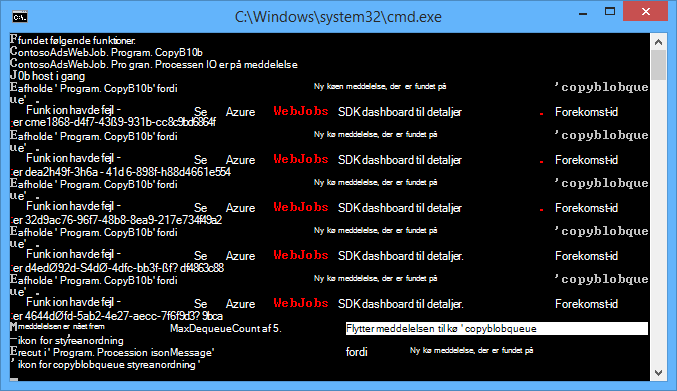
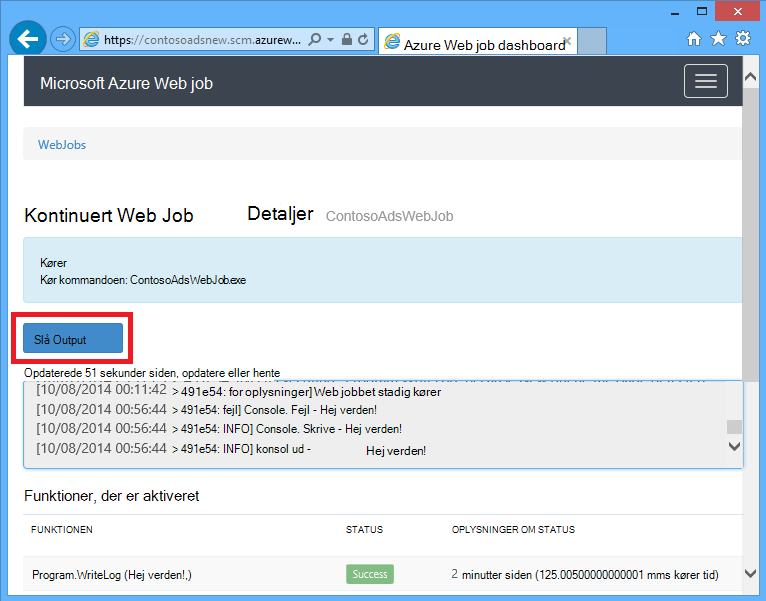
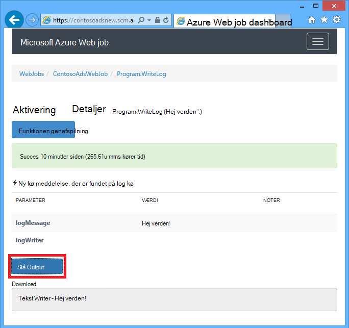
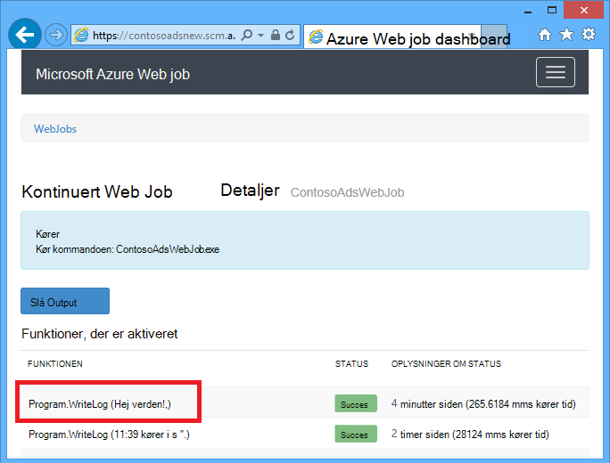
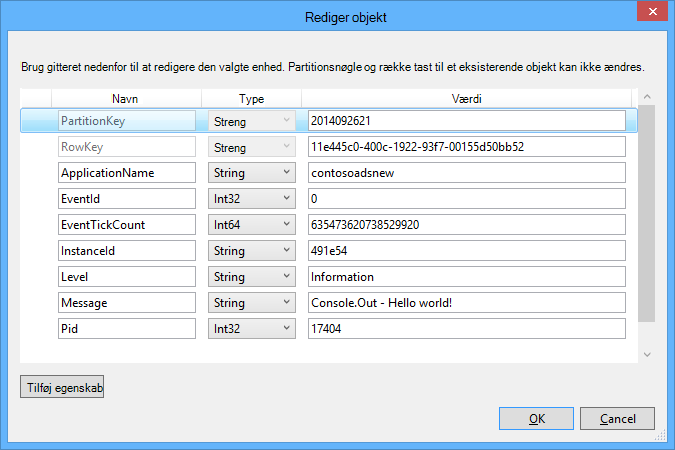
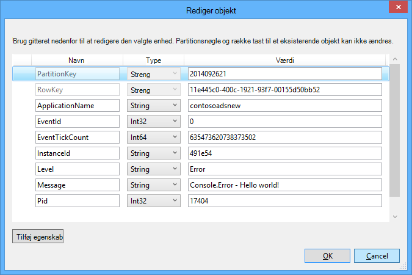

<properties 
    pageTitle="Sådan bruger du Azure kø lagerplads med WebJobs SDK" 
    description="Lær at bruge Azure kø lagerplads med WebJobs SDK. Oprette og slette køer; indsætte, Kig, hente og slette beskeder i kø og meget mere." 
    services="app-service\web, storage" 
    documentationCenter=".net" 
    authors="tdykstra" 
    manager="wpickett" 
    editor="jimbe"/>

<tags 
    ms.service="app-service-web" 
    ms.workload="web" 
    ms.tgt_pltfrm="na" 
    ms.devlang="dotnet" 
    ms.topic="article" 
    ms.date="06/01/2016" 
    ms.author="tdykstra"/>

# <a name="how-to-use-azure-queue-storage-with-the-webjobs-sdk"></a>Sådan bruger du Azure kø lagerplads med WebJobs SDK

## <a name="overview"></a>Oversigt

Denne vejledning indeholder C# kodeeksempler, der viser, hvordan du bruger versionen af Azure WebJobs SDK 1.x med tjenesten Azure kø storage.

Vejledningen antages det, at du ved, [hvordan du opretter et WebJob projekt i Visual Studio med strenge, der peger på kontoen lagerplads](websites-dotnet-webjobs-sdk-get-started.md#configure-storage) eller til [flere lagerplads konti](https://github.com/Azure/azure-webjobs-sdk/blob/master/test/Microsoft.Azure.WebJobs.Host.EndToEndTests/MultipleStorageAccountsEndToEndTests.cs).

De fleste af kodestykker Vis kun funktioner, ikke den kode, der opretter den `JobHost` objekt som i dette eksempel:

        static void Main(string[] args)
        {
            JobHost host = new JobHost();
            host.RunAndBlock();
        }
        
Vejledningen indeholder følgende emner:

-   [Hvordan du kan udløse en funktion, når der modtages en meddelelse i kø](#trigger)
    - Streng kø meddelelser
    - POCO kø meddelelser
    - Asynkron funktioner
    - Typer af attributten QueueTrigger fungerer med
    - Afstemning algoritme
    - Flere forekomster
    - Parallel udførelse
    - Få kø eller kø meddelelse metadata
    - Lukning
-   [Sådan oprettes en kø meddelelse under behandling af en kø meddelelse](#createqueue)
    - Streng beskeder i kø
    - POCO beskeder i kø
    - Oprette flere meddelelser eller i asynkron funktioner
    - Typer af attributten kø fungerer med
    - Brug WebJobs SDK attributter i brødteksten i en funktion
-   [Hvordan du kan læse og skrive BLOB under behandling af en kø meddelelse](#blobs)
    - Streng kø meddelelser
    - POCO beskeder i kø
    - Typer af attributten Blob fungerer med
-   [Sådan håndteres uautoriserede meddelelser](#poison)
    - Automatisk behandling af meddelelser
    - Manuel behandling af meddelelser
-   [Sådan angives konfigurationsindstillinger](#config)
    - Angive SDK forbindelsesstrenge i kode
    - Konfigurere indstillinger for QueueTrigger
    - Angive værdier for WebJobs SDK parametre parametre i kode
-   [Hvordan du manuelt udløse en funktion](#manual)
-   [Sådan skrives logfiler](#logs) 
-   [Sådan håndteres fejl og konfigurere timeout](#errors)
-   [Næste trin](#nextsteps)

## <a id="trigger"></a>Hvordan du kan udløse en funktion, når der modtages en meddelelse i kø

Hvis du vil skrive en funktion, der kalder WebJobs SDK, når der modtages en meddelelse i køen, bruge den `QueueTrigger` attributter. Attributkonstruktøren tager en strengparameter, der angiver navnet på den kø til afstemning. Du kan også [angive navnet på kø dynamisk](#config).

### <a name="string-queue-messages"></a>Streng kø meddelelser

I eksemplet nedenfor køen indeholder en streng meddelelse, så `QueueTrigger` anvendes på en strengparameter med navnet `logMessage` som indeholder indholdet af meddelelsen kø. Den funktionen [skriver en log meddelelse til Dashboard](#logs).
 

        public static void ProcessQueueMessage([QueueTrigger("logqueue")] string logMessage, TextWriter logger)
        {
            logger.WriteLine(logMessage);
        }

Ud over `string`, parameteren kan være en bytematrix; et `CloudQueueMessage` objekt eller en POCO, som du definerer.

### <a name="poco-plain-old-clr-objecthttpenwikipediaorgwikiplainoldclrobject-queue-messages"></a>POCO [(almindelig gamle CLR-objekt](http://en.wikipedia.org/wiki/Plain_Old_CLR_Object)) kø meddelelser

I eksemplet nedenfor kø meddelelsen indeholder JSON for en `BlobInformation` objekt, der indeholder en `BlobName` egenskab. SDK deserializes automatisk objektet.

        public static void WriteLogPOCO([QueueTrigger("logqueue")] BlobInformation blobInfo, TextWriter logger)
        {
            logger.WriteLine("Queue message refers to blob: " + blobInfo.BlobName);
        }

SDK bruger [Newtonsoft.Json NuGet pakke](http://www.nuget.org/packages/Newtonsoft.Json) sekventielt og deserialisere meddelelser. Hvis du opretter beskeder i kø i et program, der ikke bruger WebJobs SDK, kan du skrive programkode som i følgende eksempel til at oprette en meddelelse om POCO kø, SDK kan fortolkes. 

        BlobInformation blobInfo = new BlobInformation() { BlobName = "log.txt" };
        var queueMessage = new CloudQueueMessage(JsonConvert.SerializeObject(blobInfo));
        logQueue.AddMessage(queueMessage);

### <a name="async-functions"></a>Asynkron funktioner

Den følgende asynkron funktionen [skriver en logfil til Dashboard](#logs).

        public async static Task ProcessQueueMessageAsync([QueueTrigger("logqueue")] string logMessage, TextWriter logger)
        {
            await logger.WriteLineAsync(logMessage);
        }

Asynkron funktioner kan tage et [annulleringen token](http://www.asp.net/mvc/overview/performance/using-asynchronous-methods-in-aspnet-mvc-4#CancelToken), som vist i følgende eksempel som kopierer en blob. (Indeholder en beskrivelse af den `queueTrigger` pladsholder, finder du i afsnittet [BLOB](#blobs) .)

        public async static Task ProcessQueueMessageAsyncCancellationToken(
            [QueueTrigger("blobcopyqueue")] string blobName, 
            [Blob("textblobs/{queueTrigger}",FileAccess.Read)] Stream blobInput,
            [Blob("textblobs/{queueTrigger}-new",FileAccess.Write)] Stream blobOutput,
            CancellationToken token)
        {
            await blobInput.CopyToAsync(blobOutput, 4096, token);
        }

### <a id="qtattributetypes"></a>Typer af attributten QueueTrigger fungerer med

Du kan bruge `QueueTrigger` med følgende typer:

* `string`
* Typen POCO serialiseret som JSON
* `byte[]`
* `CloudQueueMessage`

### <a id="polling"></a>Afstemning algoritme

SDK implementerer et tilfældigt eksponentiel tilbage fra algoritme for at reducere effekten af idle-kø forespørge på lagerplads transaktionsomkostninger.  Når der findes en meddelelse, SDK venter to sekunder og derefter kontrollerer, om en anden meddelelse Når der er fundet nogen meddelelse venter om fire sekunder, før du prøver igen. Når du efterfølgende mislykkede forsøg på at får en meddelelse om kø, fortsat ventetiden øge, indtil den når den maksimale ventetid, som standard er et minut. [Den maksimale ventetiden kan konfigureres](#config).

### <a id="instances"></a>Flere forekomster

Hvis din online kører på flere forekomster, en fortløbende WebJob kører på hver enkelt computer, og hver computer skal vente på udløsere og forsøger at køre funktioner. WebJobs SDK kø udløse forhindrer automatisk en funktion i en kø meddelelse flere gange. funktioner har ikke kan skrives til være idempotent. Men hvis du vil sikre dig, at kun én forekomst af en funktion, der kører, selvom der er flere forekomster af host WebApp, kan du bruge den `Singleton` attributter. 

### <a id="parallel"></a>Parallel udførelse

Hvis du har flere funktioner, der lytter på forskellige køer, vil SDK kalde dem parallelt når meddelelser er modtaget samtidigt. 

Den samme er sand, når der modtages flere meddelelser til en enkelt kø. Som standard i SDK får en mængde beskeder i 16 kø ad gangen og udfører den funktion, der behandler dem parallelt. [Batchstørrelsen kan konfigureres](#config). Når det tal, behandles lukkes til halvdelen af batchstørrelsen, SDK får en anden batchen og starter behandle disse meddelelser. Derfor er det maksimale antal samtidige meddelelser behandles i funktionen én halvanden gange batchstørrelsen. Denne begrænsning gælder separat for hver funktion, der har en `QueueTrigger` attributter. 

Hvis du ikke vil parallel udførelse for meddelelser, der har modtaget på én kø, kan du angive batchstørrelsen til 1. Se også **mere kontrol over kø behandling** i [Azure WebJobs SDK 1.1.0 RTM](/blog/azure-webjobs-sdk-1-1-0-rtm/).

### <a id="queuemetadata"></a>Få kø eller kø meddelelse metadata

Du kan få følgende meddelelsesegenskaber ved tilføjelse af parametre i Metodesignaturen:

* `DateTimeOffset`expirationTime
* `DateTimeOffset`insertionTime
* `DateTimeOffset`nextVisibleTime
* `string`queueTrigger (indeholder tekst i en meddelelse)
* `string`id
* `string`popReceipt
* `int`dequeueCount

Hvis du vil arbejde direkte med Azure opbevaring API, du kan også tilføje en `CloudStorageAccount` parameter.

I følgende eksempel skriver alle disse metadata til en logfil med oplysninger om programmet. I eksemplet indeholder både logMessage og queueTrigger indholdet af meddelelsen kø.

        public static void WriteLog([QueueTrigger("logqueue")] string logMessage,
            DateTimeOffset expirationTime,
            DateTimeOffset insertionTime,
            DateTimeOffset nextVisibleTime,
            string id,
            string popReceipt,
            int dequeueCount,
            string queueTrigger,
            CloudStorageAccount cloudStorageAccount,
            TextWriter logger)
        {
            logger.WriteLine(
                "logMessage={0}\n" +
            "expirationTime={1}\ninsertionTime={2}\n" +
                "nextVisibleTime={3}\n" +
                "id={4}\npopReceipt={5}\ndequeueCount={6}\n" +
                "queue endpoint={7} queueTrigger={8}",
                logMessage, expirationTime,
                insertionTime,
                nextVisibleTime, id,
                popReceipt, dequeueCount,
                cloudStorageAccount.QueueEndpoint,
                queueTrigger);
        }

Her er en stikprøve logfil, der er skrevet af eksempelkoden:

        logMessage=Hello world!
        expirationTime=10/14/2014 10:31:04 PM +00:00
        insertionTime=10/7/2014 10:31:04 PM +00:00
        nextVisibleTime=10/7/2014 10:41:23 PM +00:00
        id=262e49cd-26d3-4303-ae88-33baf8796d91
        popReceipt=AgAAAAMAAAAAAAAAfc9H0n/izwE=
        dequeueCount=1
        queue endpoint=https://contosoads.queue.core.windows.net/
        queueTrigger=Hello world!

### <a id="graceful"></a>Lukning

En funktion, der kører i et sammenhængende WebJob kan acceptere en `CancellationToken` parameter, som gør det muligt for operativsystemet til at informere funktionen, når WebJob er ved at blive afsluttet. Du kan bruge denne meddelelse for at sikre, at funktionen ikke afslutte uventet på en måde, der bevarer dataene i en ustabil tilstand.

I følgende eksempel viser, hvordan du søger efter forestående WebJob afslutning i en funktion.

    public static void GracefulShutdownDemo(
                [QueueTrigger("inputqueue")] string inputText,
                TextWriter logger,
                CancellationToken token)
    {
        for (int i = 0; i < 100; i++)
        {
            if (token.IsCancellationRequested)
            {
                logger.WriteLine("Function was cancelled at iteration {0}", i);
                break;
            }
            Thread.Sleep(1000);
            logger.WriteLine("Normal processing for queue message={0}", inputText);
        }
    }

**Note:** Dashboardet vises muligvis ikke korrekt, status og output af funktioner, der har lukket.
 
Du kan finde flere oplysninger [WebJobs lukning](http://blog.amitapple.com/post/2014/05/webjobs-graceful-shutdown/#.VCt1GXl0wpR).   

## <a id="createqueue"></a>Sådan oprettes en kø meddelelse under behandling af en kø meddelelse

Hvis du vil skrive en funktion, der opretter en ny meddelelse i køen, bruge den `Queue` attributter. Sådan `QueueTrigger`, du overfører i kø navn som en streng, eller du kan [angive navnet på kø dynamisk](#config).

### <a name="string-queue-messages"></a>Streng kø meddelelser

Følgende eksempel på ikke-asynkron kode opretter en ny meddelelse i køen i køen med navnet "outputqueue" med det samme indhold som den kø meddelelse, der er modtaget i køen med navnet "inputqueue". (Brug af funktioner til asynkron `IAsyncCollector<T>` som vist senere i dette afsnit.)


        public static void CreateQueueMessage(
            [QueueTrigger("inputqueue")] string queueMessage,
            [Queue("outputqueue")] out string outputQueueMessage )
        {
            outputQueueMessage = queueMessage;
        }
  
### <a name="poco-plain-old-clr-objecthttpenwikipediaorgwikiplainoldclrobject-queue-messages"></a>POCO [(almindelig gamle CLR-objekt](http://en.wikipedia.org/wiki/Plain_Old_CLR_Object)) kø meddelelser

Hvis du vil oprette en kø meddelelse, der indeholder en POCO i stedet for en streng, du overfører typen POCO som en output-parameter til den `Queue` Attributkonstruktøren.
 
        public static void CreateQueueMessage(
            [QueueTrigger("inputqueue")] BlobInformation blobInfoInput,
            [Queue("outputqueue")] out BlobInformation blobInfoOutput )
        {
            blobInfoOutput = blobInfoInput;
        }

SDK serializes automatisk JSON objektet. Meddelelsen kø oprettes altid, selvom objektet er null.

### <a name="create-multiple-messages-or-in-async-functions"></a>Oprette flere meddelelser eller i asynkron funktioner

For at oprette flere meddelelser, skal du gøre parametertypen for output køen `ICollector<T>` eller `IAsyncCollector<T>`, som vist i følgende eksempel.

        public static void CreateQueueMessages(
            [QueueTrigger("inputqueue")] string queueMessage,
            [Queue("outputqueue")] ICollector<string> outputQueueMessage,
            TextWriter logger)
        {
            logger.WriteLine("Creating 2 messages in outputqueue");
            outputQueueMessage.Add(queueMessage + "1");
            outputQueueMessage.Add(queueMessage + "2");
        }

Alle de meddelelser, kø oprettes med det samme når den `Add` metode kaldes.

### <a name="types-that-the-queue-attribute-works-with"></a>Typer, attributten kø arbejder sammen med

Du kan bruge den `Queue` attribut på følgende parameter:

* `out string`(opretter kø meddelelse, hvis parameterværdi er ikke-null, når funktionen stopper)
* `out byte[]`(fungerer ligesom `string`) 
* `out CloudQueueMessage`(fungerer ligesom `string`) 
* `out POCO`(en serialiserbar type, opretter en meddelelse med en null-objekt Hvis paramter er null, når funktionen stopper)
* `ICollector`
* `IAsyncCollector`
* `CloudQueue`(for at oprette meddelelser manuelt med Azure Storage API direkte)

### <a id="ibinder"></a>Brug WebJobs SDK attributter i brødteksten i en funktion

Hvis du vil udføre nogle arbejde i din funktionen inden du bruger en WebJobs SDK attribut såsom `Queue`, `Blob`, eller `Table`, du kan bruge den `IBinder` interface.

I følgende eksempel tager en input kø meddelelse og opretter en ny meddelelse med det samme indhold i en output kø. Output kø navnet er angivet af kode i brødteksten i funktionen.

        public static void CreateQueueMessage(
            [QueueTrigger("inputqueue")] string queueMessage,
            IBinder binder)
        {
            string outputQueueName = "outputqueue" + DateTime.Now.Month.ToString();
            QueueAttribute queueAttribute = new QueueAttribute(outputQueueName);
            CloudQueue outputQueue = binder.Bind<CloudQueue>(queueAttribute);
            outputQueue.AddMessage(new CloudQueueMessage(queueMessage));
        }

Den `IBinder` interface kan også bruges sammen med den `Table` og `Blob` attributter.

## <a id="blobs"></a>Hvordan du kan læse og skrive BLOB og tabeller under behandling af en kø meddelelse

Den `Blob` og `Table` attributter gør det muligt at læse og skrive BLOB og tabeller. Eksemplerne i dette afsnit gælder for BLOB. Se, [hvordan du bruger Azure blob storage med WebJobs SDK](websites-dotnet-webjobs-sdk-storage-blobs-how-to.md)kodeeksempler, der viser, hvordan du kan udløse processer, når BLOB oprettes eller opdateres, og for kodeeksempler, læse og skrive tabeller, se, [hvordan du bruger Azure-tabellager med WebJobs SDK](websites-dotnet-webjobs-sdk-storage-tables-how-to.md).

### <a name="string-queue-messages-triggering-blob-operations"></a>En streng, der udløser blob handlinger beskeder i kø

For en kø meddelelse, der indeholder en streng, `queueTrigger` er en pladsholder, du kan bruge i den `Blob` attributten `blobPath` parameter, der indeholder indholdet af meddelelsen. 

I følgende eksempel bruges `Stream` objekter at læse og skrive BLOB. Meddelelsen kø er navnet på en blob, der er placeret i objektbeholderen textblobs. En kopi af blob med "-Ny" føjes til navnet oprettes i samme beholder. 

        public static void ProcessQueueMessage(
            [QueueTrigger("blobcopyqueue")] string blobName, 
            [Blob("textblobs/{queueTrigger}",FileAccess.Read)] Stream blobInput,
            [Blob("textblobs/{queueTrigger}-new",FileAccess.Write)] Stream blobOutput)
        {
            blobInput.CopyTo(blobOutput, 4096);
        }

Den `Blob` attribut parametre tager en `blobPath` parameter, der angiver navnet på objektbeholder og blob. Du kan finde flere oplysninger om denne pladsholder, se, [hvordan du bruger Azure blob-lager med WebJobs SDK](websites-dotnet-webjobs-sdk-storage-blobs-how-to.md) 

Når attributten dekorerer en `Stream` objekt, en anden parametre parameter angiver den `FileAccess` tilstand som læst, skriveadgang eller læse-og skriveadgang. 

I følgende eksempel bruges en `CloudBlockBlob` objekt for at slette en blob. Meddelelsen kø er navnet på blob.

        public static void DeleteBlob(
            [QueueTrigger("deleteblobqueue")] string blobName,
            [Blob("textblobs/{queueTrigger}")] CloudBlockBlob blobToDelete)
        {
            blobToDelete.Delete();
        }

### <a id="pocoblobs"></a>POCO [(almindelig gamle CLR-objekt](http://en.wikipedia.org/wiki/Plain_Old_CLR_Object)) kø meddelelser

Du kan bruge pladsholdere, hvor navnet egenskaber for objektet i for en POCO, der er gemt som JSON i kø meddelelsen, den `Queue` attributten `blobPath` parameter. Du kan også bruge [kø metadata egenskabsnavne](#queuemetadata) som pladsholdere. 

I følgende eksempel kopierer en blob til en ny blob med et andet filtypenavn. Kø meddelelsen er en `BlobInformation` objekt, der indeholder `BlobName` og `BlobNameWithoutExtension` egenskaber. Egenskabsnavne bruges som pladsholdere i blob stien til den `Blob` attributter. 
 
        public static void CopyBlobPOCO(
            [QueueTrigger("copyblobqueue")] BlobInformation blobInfo,
            [Blob("textblobs/{BlobName}", FileAccess.Read)] Stream blobInput,
            [Blob("textblobs/{BlobNameWithoutExtension}.txt", FileAccess.Write)] Stream blobOutput)
        {
            blobInput.CopyTo(blobOutput, 4096);
        }

SDK bruger [Newtonsoft.Json NuGet pakke](http://www.nuget.org/packages/Newtonsoft.Json) sekventielt og deserialisere meddelelser. Hvis du opretter beskeder i kø i et program, der ikke bruger WebJobs SDK, kan du skrive programkode som i følgende eksempel til at oprette en meddelelse om POCO kø, SDK kan fortolkes.

        BlobInformation blobInfo = new BlobInformation() { BlobName = "boot.log", BlobNameWithoutExtension = "boot" };
        var queueMessage = new CloudQueueMessage(JsonConvert.SerializeObject(blobInfo));
        logQueue.AddMessage(queueMessage);

Hvis du vil udføre nogle arbejde i din funktion, før du binder en blob til et objekt, kan du bruge egenskaben i brødteksten i funktionen, [som vist tidligere for attributten kø](#ibinder).

### <a id="blobattributetypes"></a>Du kan bruge attributten Blob med typer
 
Den `Blob` attribut kan bruges med følgende typer:

* `Stream`(Læs eller skriv, angivet ved hjælp af parameteren FileAccess parametre)
* `TextReader`
* `TextWriter`
* `string`(Læs)
* `out string`(skrive, opretter en blob kun, hvis Strengparameteren er ikke-null, når funktionen returnerer)
* POCO (læsning)
* af POCO (skrive; altid opretter en blob, opretter som null-objekt, hvis POCO parameter er null, når funktionen returnerer)
* `CloudBlobStream`(Skriv)
* `ICloudBlob`(Læs eller skriv)
* `CloudBlockBlob`(Læs eller skriv) 
* `CloudPageBlob`(Læs eller skriv) 

## <a id="poison"></a>Sådan håndteres uautoriserede meddelelser

Meddelelser, der medfører en funktion til at mislykkes, hvis indhold kaldes *uautoriserede meddelelser*. Når funktionen ikke, slettes ikke kø meddelelsen, og til sidst er valgte igen, forårsager cyklussen skal gentages. SDK kan automatisk afbryde cyklussen efter et begrænset antal gentagelser, eller du kan gøre det manuelt.

### <a name="automatic-poison-message-handling"></a>Automatisk behandling af meddelelser

SDK kalder en funktion op til 5 gange til at behandle en kø meddelelse. Hvis det femte prøve mislykkes, flyttes meddelelsen til en en kø. [Det maksimale antal forsøg kan konfigureres](#config). 

En køen hedder *{originalqueuename}*-en. Du kan skrive, der er brug for en funktion til at behandle meddelelser fra en køen ved logføring dem eller sende en meddelelse, der manuel opmærksomhed. 

I følgende eksempel på `CopyBlob` funktionen mislykkes, når meddelelsen kø indeholder navnet på en blob, der ikke findes. Når det sker, flyttes meddelelsen fra copyblobqueue køen til copyblobqueue forfalskning køen. Den `ProcessPoisonMessage` derefter logfører en meddelelse.

        public static void CopyBlob(
            [QueueTrigger("copyblobqueue")] string blobName,
            [Blob("textblobs/{queueTrigger}", FileAccess.Read)] Stream blobInput,
            [Blob("textblobs/{queueTrigger}-new", FileAccess.Write)] Stream blobOutput)
        {
            blobInput.CopyTo(blobOutput, 4096);
        }
        
        public static void ProcessPoisonMessage(
            [QueueTrigger("copyblobqueue-poison")] string blobName, TextWriter logger)
        {
            logger.WriteLine("Failed to copy blob, name=" + blobName);
        }

Følgende illustration viser console output fra disse funktioner, når en behandling af meddelelser behandles.



### <a name="manual-poison-message-handling"></a>Manuel behandling af meddelelser

Du kan finde antallet gange en meddelelse er blevet valgte til behandling ved at tilføje en `int` parameter med navnet `dequeueCount` til din funktion. Du kan derefter kontrollere dequeue antallet i funktionen kode og udføre din egen behandling af meddelelser for håndtering af når tallet er større end en grænseværdi, som vist i følgende eksempel.

        public static void CopyBlob(
            [QueueTrigger("copyblobqueue")] string blobName, int dequeueCount,
            [Blob("textblobs/{queueTrigger}", FileAccess.Read)] Stream blobInput,
            [Blob("textblobs/{queueTrigger}-new", FileAccess.Write)] Stream blobOutput,
            TextWriter logger)
        {
            if (dequeueCount > 3)
            {
                logger.WriteLine("Failed to copy blob, name=" + blobName);
            }
            else
            {
            blobInput.CopyTo(blobOutput, 4096);
            }
        }

## <a id="config"></a>Sådan angives konfigurationsindstillinger

Du kan bruge den `JobHostConfiguration` type til at angive følgende indstillinger:

* Angive SDK forbindelse strengene i kode.
* Konfigurere `QueueTrigger` indstillinger som maksimum annullering i kø Tæl.
* Få kø navne fra konfiguration.

### <a id="setconnstr"></a>Angive SDK forbindelsesstrenge i kode

Angive SDK forbindelse strengene i kode giver dig mulighed at bruge dit eget forbindelse streng navne i den åbne fil eller miljøvariabler, som vist i følgende eksempel.

        static void Main(string[] args)
        {
            var _storageConn = ConfigurationManager
                .ConnectionStrings["MyStorageConnection"].ConnectionString;
        
            var _dashboardConn = ConfigurationManager
                .ConnectionStrings["MyDashboardConnection"].ConnectionString;
        
            var _serviceBusConn = ConfigurationManager
                .ConnectionStrings["MyServiceBusConnection"].ConnectionString;
        
            JobHostConfiguration config = new JobHostConfiguration();
            config.StorageConnectionString = _storageConn;
            config.DashboardConnectionString = _dashboardConn;
            config.ServiceBusConnectionString = _serviceBusConn;
            JobHost host = new JobHost(config);
            host.RunAndBlock();
        }

### <a id="configqueue"></a>Konfigurere indstillinger for QueueTrigger

Du kan konfigurere følgende indstillinger, der gælder for kø meddelelsesbehandling:

- Det maksimale antal kø meddelelser, der er valgte op samtidigt skal udføres parallelt (standard er 16).
- Det maksimale antal forsøg, før en kø meddelelse er sendt til en en kø (standard er 5).
- Maksimalt Ventetid før forespørge igen, når en kø er tom (standard er 1 minut).

I følgende eksempel viser, hvordan du konfigurerer disse indstillinger:

        static void Main(string[] args)
        {
            JobHostConfiguration config = new JobHostConfiguration();
            config.Queues.BatchSize = 8;
            config.Queues.MaxDequeueCount = 4;
            config.Queues.MaxPollingInterval = TimeSpan.FromSeconds(15);
            JobHost host = new JobHost(config);
            host.RunAndBlock();
        }

### <a id="setnamesincode"></a>Angive værdier for WebJobs SDK parametre parametre i kode

Nogle gange du vil angive et navn i kø, et blob navn eller en objektbeholder, eller en tabel i kode i stedet for at fastlægge det navnet. For eksempel kan du få Angiv kø navn for `QueueTrigger` i en konfiguration fil eller miljø variabel. 

Du kan gøre det ved overførsel af en `NameResolver` objekt til den `JobHostConfiguration` type. Du kan medtage speciel pladsholdere omgivet af procenttegn (%) i WebJobs SDK attribut parametre parametre, og din `NameResolver` kode angiver de faktiske værdier, der bruges i stedet for disse pladsholdere.

Lad os antage, at du vil bruge en kø med navnet logqueuetest i testmiljøet og en navngivet logqueueprod fremstilling. I stedet for et faste kø navn, du vil angive navnet på en post på den `appSettings` af websteder, der ville have faktisk kø navn. Hvis den `appSettings` nøgle logqueue, og din funktionen kan se ud som i følgende eksempel.

        public static void WriteLog([QueueTrigger("%logqueue%")] string logMessage)
        {
            Console.WriteLine(logMessage);
        }

Din `NameResolver` klasse kan derefter hente kø navnet fra `appSettings` som vist i følgende eksempel:

        public class QueueNameResolver : INameResolver
        {
            public string Resolve(string name)
            {
                return ConfigurationManager.AppSettings[name].ToString();
            }
        }

Du overfører de `NameResolver` klasse i til den `JobHost` objekt som vist i følgende eksempel.

        static void Main(string[] args)
        {
            JobHostConfiguration config = new JobHostConfiguration();
            config.NameResolver = new QueueNameResolver();
            JobHost host = new JobHost(config);
            host.RunAndBlock();
        }
 
**Note:** Kø, tabel og blob navne løses, hver gang kaldes en funktion, men blob objektbeholder navne løses kun, når programmet starter. Du kan ikke ændre blob objektbeholder navn, mens jobbet kører. 

## <a id="manual"></a>Hvordan du manuelt udløse en funktion

Hvis du vil udløse en funktion manuelt, bruge den `Call` eller `CallAsync` metode på den `JobHost` objekt og `NoAutomaticTrigger` attributten i funktionen, som vist i følgende eksempel. 

        public class Program
        {
            static void Main(string[] args)
            {
                JobHost host = new JobHost();
                host.Call(typeof(Program).GetMethod("CreateQueueMessage"), new { value = "Hello world!" });
            }
        
            [NoAutomaticTrigger]
            public static void CreateQueueMessage(
                TextWriter logger, 
                string value, 
                [Queue("outputqueue")] out string message)
            {
                message = value;
                logger.WriteLine("Creating queue message: ", message);
            }
        }

## <a id="logs"></a>Sådan skrives logfiler

Dashboard viser logfiler i to forskellige steder: på siden til WebJob, og på siden til en bestemt WebJob Start. 





Output fra Console metoder, du ringer i en funktion eller i den `Main()` metode vises på siden Dashboard for WebJob, ikke på siden for aktivering af en bestemt metode. Output fra objektet TextWriter, som du angiver en parameter i Metodesignaturen vises på siden Dashboard for aktivering af en metode.

Console output kan sammenkædes med aktivering af en bestemt metode, fordi konsollen er single-threaded, mens mange jobfunktioner kan køre ad gangen. Det er grunden SDK indeholder hver funktion aktivering med sin egen entydige log writer objekt.

Hvis du vil skrive [logfiler for programmer sporing](web-sites-dotnet-troubleshoot-visual-studio.md#logsoverview), bruge `Console.Out` (der oprettes logfiler, der er markeret som oplysninger) og `Console.Error` (der oprettes logfiler, der er markeret som fejl). Et alternativ er at bruge [sporing eller TraceSource](http://blogs.msdn.com/b/mcsuksoldev/archive/2014/09/04/adding-trace-to-azure-web-sites-and-web-jobs.aspx), som indeholder detaljeret, advarsler og kritisk niveauer ud over oplysninger og fejl. Logfiler for programmer sporing vises i web app logfiler, Azure tabeller eller Azure BLOB afhængigt af hvordan du konfigurerer din Azure online. Som det er sandt om alle Console output, vises loggene seneste 100 program også på siden Dashboard for WebJob, ikke på siden til en funktion aktivering. 

Console output vises i dashboardet kun, hvis programmet kører i en Azure WebJob ikke, hvis programmet kører lokalt eller i nogle andre miljø.

Deaktiver logføring af dashboard for høj overførselshastighed scenarier. Som standard i SDK skriver logfiler til lager og denne aktivitet kan ydeevnen, når du behandler mange meddelelser. For at deaktivere logføring skal du angive forbindelsesstrengen dashboard til nul, som vist i følgende eksempel.

        JobHostConfiguration config = new JobHostConfiguration();       
        config.DashboardConnectionString = "";        
        JobHost host = new JobHost(config);
        host.RunAndBlock();

I følgende eksempel viser kan skrive logge på flere måder:

        public static void WriteLog(
            [QueueTrigger("logqueue")] string logMessage,
            TextWriter logger)
        {
            Console.WriteLine("Console.Write - " + logMessage);
            Console.Out.WriteLine("Console.Out - " + logMessage);
            Console.Error.WriteLine("Console.Error - " + logMessage);
            logger.WriteLine("TextWriter - " + logMessage);
        }

I WebJobs SDK Dashboard, output fra den `TextWriter` objekt viser dig, når du går til siden for en bestemt funktionen aktivering, og klik på **Til/fra Output**:




I dashboardet WebJobs SDK output de seneste 100 linjer i Console Vis op, når du gå til siden til WebJob (ikke for funktionen aktiveringen), og klik på **Til/fra Output**.
 


I en sammenhængende WebJob vises programmet logfiler i/data/job/fortløbende /*{webjobname}*/job_log.txt i web app typen af filsystem.

        [09/26/2014 21:01:13 > 491e54: INFO] Console.Write - Hello world!
        [09/26/2014 21:01:13 > 491e54: ERR ] Console.Error - Hello world!
        [09/26/2014 21:01:13 > 491e54: INFO] Console.Out - Hello world!

I en Azure blob programmet logfiler ser sådan ud: 2014-09-26T21:01:13,Information,contosoadsnew,491e54,635473620738373502,0,17404,17,Console.Write - Hej verden!, 2014-09-26T21:01:13,Error,contosoadsnew,491e54,635473620738373502,0,17404,19,Console.Error - Hej verden!, 2014-09-26T21:01:13,Information,contosoadsnew,491e54,635473620738529920,0,17404,17,Console.Out - Hej verden!,

Og i en Azure-tabel på `Console.Out` og `Console.Error` logge ser sådan ud:





Hvis du vil Tilslut din egen logføring, skal du se [dette eksempel](http://github.com/Azure/azure-webjobs-sdk-samples/blob/master/BasicSamples/MiscOperations/Program.cs).

## <a id="errors"></a>Sådan håndteres fejl og konfigurere timeout

WebJobs SDK indeholder også en [Timeout](http://github.com/Azure/azure-webjobs-sdk-samples/blob/master/BasicSamples/MiscOperations/Functions.cs) attribut, du kan bruge til at få en funktion til at blive annulleret, hvis ikke fuldføres inden for et bestemt tidsrum. Og hvis du vil hæve en besked, når der er for mange fejl sker inden for et angivet tidsrum, du kan bruge den `ErrorTrigger` attributter. Her er et [Eksempel på ErrorTrigger](https://github.com/Azure/azure-webjobs-sdk-extensions/wiki/Error-Monitoring).

```
public static void ErrorMonitor(
[ErrorTrigger("00:01:00", 1)] TraceFilter filter, TextWriter log,
[SendGrid(
    To = "admin@emailaddress.com",
    Subject = "Error!")]
 SendGridMessage message)
{
    // log last 5 detailed errors to the Dashboard
   log.WriteLine(filter.GetDetailedMessage(5));
   message.Text = filter.GetDetailedMessage(1);
}
```

Du kan også dynamisk deaktiverer og aktiverer funktioner til at styre, om de kan udløses, ved hjælp af en konfiguration parameter, der kan være en app indstilling eller navnet på miljøvariablen. Eksempel på kode, du kan finde den `Disable` attribut i [WebJobs SDK eksempler lager](https://github.com/Azure/azure-webjobs-sdk-samples/blob/master/BasicSamples/MiscOperations/Functions.cs).

## <a id="nextsteps"></a>Næste trin

Denne vejledning har leveret kodeeksempler, der viser, hvordan du håndterer almindelige scenarier, hvor arbejde med Azure køer. Du kan finde flere oplysninger om, hvordan du bruger Azure WebJobs og WebJobs SDK [Azure WebJobs anbefalede ressourcer](http://go.microsoft.com/fwlink/?linkid=390226).
 
