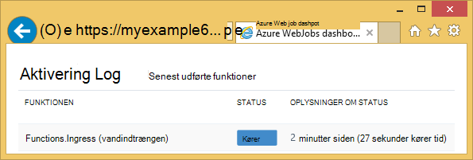
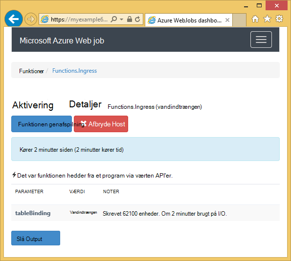
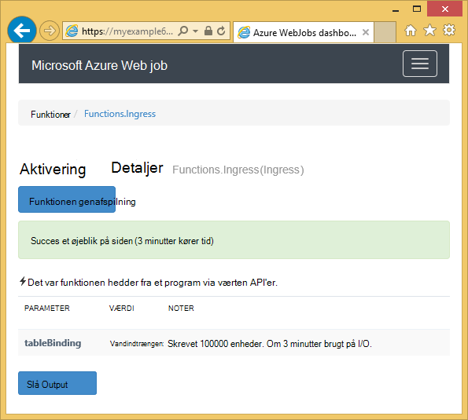

<properties 
    pageTitle="Sådan bruger du Azure-tabellager med WebJobs SDK" 
    description="Lær at bruge Azure-tabellager med WebJobs SDK. Oprette tabeller, føje objekter til tabeller, og Læs eksisterende tabeller." 
    services="app-service\web, storage" 
    documentationCenter=".net" 
    authors="tdykstra" 
    manager="wpickett" 
    editor="jimbe"/>

<tags 
    ms.service="app-service-web" 
    ms.workload="web" 
    ms.tgt_pltfrm="na" 
    ms.devlang="dotnet" 
    ms.topic="article" 
    ms.date="06/01/2016" 
    ms.author="tdykstra"/>

# Sådan bruger du Azure-tabellager med WebJobs SDK

## Oversigt

Denne vejledning indeholder C# kodeeksempler, der viser, hvordan du kan læse og skrive Azure lagerplads tabeller ved hjælp af [WebJobs SDK](websites-dotnet-webjobs-sdk.md) version 1.x.

Vejledningen antages det, at du ved, [hvordan du opretter et WebJob projekt i Visual Studio med strenge, der peger på kontoen lagerplads](websites-dotnet-webjobs-sdk-get-started.md) eller til [flere lagerplads konti](https://github.com/Azure/azure-webjobs-sdk/blob/master/test/Microsoft.Azure.WebJobs.Host.EndToEndTests/MultipleStorageAccountsEndToEndTests.cs).
        
Nogle af kode kodestykker Vis den `Table` attribut, der bruges i de funktioner, der [hedder manuelt](websites-dotnet-webjobs-sdk-storage-queues-how-to.md#manual)det vil sige, der ikke er ved hjælp af udløser attributter. 

## Hvordan du kan føje objekter til en tabel

Hvis du vil føje objekter til en tabel, skal du bruge den `Table` attribut med en `ICollector<T>` eller `IAsyncCollector<T>` parameter hvor `T` angiver skemaet for de enheder, du vil tilføje. Attributkonstruktøren tager en strengparameter, der angiver navnet på tabellen. 

Følgende eksempel-kode tilføjer `Person` objekter til en tabel med navnet *vandindtrængen*.

        [NoAutomaticTrigger]
        public static void IngressDemo(
            [Table("Ingress")] ICollector<Person> tableBinding)
        {
            for (int i = 0; i < 100000; i++)
            {
                tableBinding.Add(
                    new Person() { 
                        PartitionKey = "Test", 
                        RowKey = i.ToString(), 
                        Name = "Name" }
                    );
            }
        }

Typisk typen, du bruger med `ICollector` stammer fra `TableEntity` eller implementerer `ITableEntity`, men ikke være til. Et af følgende `Person` klasser arbejde med den kode, der vises i den foregående `Ingress` metode.

        public class Person : TableEntity
        {
            public string Name { get; set; }
        }

        public class Person
        {
            public string PartitionKey { get; set; }
            public string RowKey { get; set; }
            public string Name { get; set; }
        }

Hvis du vil arbejde direkte med Azure opbevaring API, kan du tilføje en `CloudStorageAccount` -parameter til metode signatur.

## Overvågning i realtid

Da data vandindtrængen funktioner behandle ofte store datamængder, indeholder dashboardet WebJobs SDK overvågning realtidsdata. Sektionen **Aktivering Log** fortæller dig, hvis funktionen stadig er aktiv.

**Aktivering** oplysningssiden rapporter funktionens status (antal enheder, der er skrevet) mens den kører og giver dig mulighed for at afbryde den. 

Når funktionen afsluttes, rapporterer **Aktivering** oplysningssiden antallet af rækker, der skrives.

## Hvordan du kan læse flere enheder fra en tabel

Hvis du vil læse en tabel, du bruger den `Table` attribut med en `IQueryable<T>` parameter hvor skrive `T` stammer fra `TableEntity` eller implementerer `ITableEntity`.

Følgende eksempel-kode læser og logfører alle rækker fra den `Ingress` tabel:
 
        public static void ReadTable(
            [Table("Ingress")] IQueryable<Person> tableBinding,
            TextWriter logger)
        {
            var query = from p in tableBinding select p;
            foreach (Person person in query)
            {
                logger.WriteLine("PK:{0}, RK:{1}, Name:{2}", 
                    person.PartitionKey, person.RowKey, person.Name);
            }
        }

### Hvordan du kan læse et enkelt objekt fra en tabel

Der er en `Table` attributkonstruktør med to yderligere parametre, kan du angive den Partitionsnøgle og række nøgle, når du vil binde til en enkelt tabel-enhed.

Følgende eksempel-kode læser en tabelrække for en `Person` enhed baseret på partition nøgle og række nøgleværdier modtaget i en kø meddelelse:  

        public static void ReadTableEntity(
            [QueueTrigger("inputqueue")] Person personInQueue,
            [Table("persontable","{PartitionKey}", "{RowKey}")] Person personInTable,
            TextWriter logger)
        {
            if (personInTable == null)
            {
                logger.WriteLine("Person not found: PK:{0}, RK:{1}",
                        personInQueue.PartitionKey, personInQueue.RowKey);
            }
            else
            {
                logger.WriteLine("Person found: PK:{0}, RK:{1}, Name:{2}",
                        personInTable.PartitionKey, personInTable.RowKey, personInTable.Name);
            }
        }

Den `Person` klasse i dette eksempel behøver ikke at implementere `ITableEntity`.

## Sådan bruges .NET Storage API direkte til at arbejde med en tabel

Du kan også bruge den `Table` attribut med en `CloudTable` objekt for større fleksibilitet i at arbejde med en tabel.

Følgende kode eksempel bruger en `CloudTable` objekt til at tilføje en enkelt enhed til tabellen *vandindtrængen* . 
 
        public static void UseStorageAPI(
            [Table("Ingress")] CloudTable tableBinding,
            TextWriter logger)
        {
            var person = new Person()
                {
                    PartitionKey = "Test",
                    RowKey = "100",
                    Name = "Name"
                };
            TableOperation insertOperation = TableOperation.Insert(person);
            tableBinding.Execute(insertOperation);
        }

Du kan finde flere oplysninger om, hvordan du bruger den `CloudTable` objekt, se, [hvordan du bruger Table Storage fra .NET](../storage/storage-dotnet-how-to-use-tables.md). 

## Relaterede emner, der er dækket af køer vejledning til artiklen

Du kan finde oplysninger om, hvordan du håndterer tabel behandling udløses ved meddelelsen kø eller for WebJobs SDK scenarier ikke specifikke for tabellen behandling, se, [hvordan du bruger Azure kø lagerplads med WebJobs SDK](websites-dotnet-webjobs-sdk-storage-queues-how-to.md). 

Emnerne i denne artikel omfatter følgende:

* Asynkron funktioner
* Flere forekomster
* Lukning
* Brug WebJobs SDK attributter i brødteksten i en funktion
* Angive SDK forbindelse strengene i kode
* Angive værdier for WebJobs SDK parametre parametre i kode
* Udløse en funktion manuelt
* Skrive logfiler

## Næste trin

Denne vejledning har leveret kodeeksempler, der viser, hvordan du håndterer almindelige scenarier, hvor arbejde med Azure tabeller. Du kan finde flere oplysninger om, hvordan du bruger Azure WebJobs og WebJobs SDK [Azure WebJobs anbefalede ressourcer](http://go.microsoft.com/fwlink/?linkid=390226).
 
