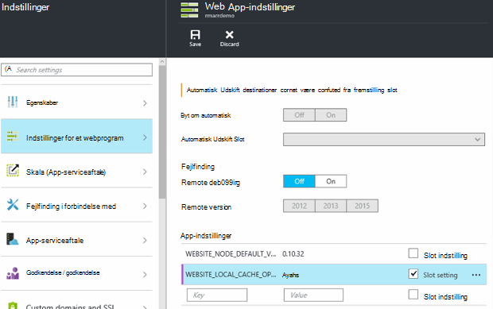

<properties
   pageTitle="Oversigt over Azure App Service lokale Cache | Microsoft Azure"
   description="I denne artikel beskrives det, hvordan du aktiverer, ændre størrelsen på og forespørgsel status for funktionen Azure App Service lokale Cache"
   services="app-service"
   documentationCenter="app-service"
   authors="SyntaxC4"
   manager="yochayk"
   editor=""
   tags="optional"
   keywords=""/>

<tags
   ms.service="app-service"
   ms.devlang="multiple"
   ms.topic="article"
   ms.tgt_pltfrm="na"
   ms.workload="na"
   ms.date="03/04/2016"
   ms.author="cfowler"/>

# <a name="azure-app-service-local-cache-overview"></a>Oversigt over Azure App Service lokale Cache

Azure web app-indhold er gemt på Azure-lager og er fået op på en robust måde, som en indhold del. Dette design er beregnet til at arbejde med en række forskellige apps og har følgende egenskaber:  

* Indholdet, der deles på tværs af flere VM (virtual machine) forekomster af WebApp.
* Indholdet er pålidelig og kan ændres ved at køre webapps.
* Logfiler og diagnosticering datafiler er tilgængelige under den samme delte indhold mappe.
* Publicere nyt indhold direkte opdaterer mappen indhold. Du kan straks få vist det samme indhold til webstedet SCM og kører WebApp (typisk nogle teknologier som ASP.NET starte en web app genstart nogle filer ændringer til at hente det seneste indhold).

Mens mange Onlines bruger en eller flere af disse funktioner, skal du bare en høj ydeevne, skrivebeskyttet indhold butik, som de kan køre fra med høj tilgængelighed visse webapps. Disse apps kan få glæde af en VM forekomst af en bestemt lokal cache.

Funktionen Azure App Service lokale Cache giver en web rolle visning af dit indhold. Dette indhold er en skrive-men-Slet cache af din lagerplads indhold, der er oprettet asynkront på webstedet Start. Når cachen er klar, skiftes der webstedet for at køre mod det cachelagrede indhold. Webapps, der kører på lokale Cache har følgende fordele:

* De er brugeren beskyttet til latenstider, der opstår, når de får adgang til indhold på Azure-lager.
* De er brugeren beskyttet til de planlagte opgraderinger eller ikke-planlagt defekt og andre afbrydelser med Azure-lager, der forekommer på servere, der fungerer indhold dele.
* De har færre app genstarter på grund af lagerplads del ændringer.

## <a name="how-local-cache-changes-the-behavior-of-app-service"></a>Hvordan lokale Cache ændres funktionsmåden for App Service

* Den lokale cache er en kopi af mapperne /site og /siteextensions af WebApp. Den er oprettet i den lokale VM forekomst på web app Start. Størrelsen af den lokale cache per online er begrænset til 300 MB som standard, men du kan øge op til 1 GB.
* Den lokale cache er skrivebeskyttet. Eventuelle ændringer bliver, dog kasseret, når online flytter virtuelle maskiner eller bliver genstartet. Du skal ikke bruge lokale Cache til apps, der lagrer vigtige data i indhold store.
* Webapps kan fortsætte med at skrive logfiler og diagnosticering data, som i øjeblikket. Logfiler og data, men er gemt lokalt på VM. Derefter kopieres de med jævne mellemrum til det delte indhold store. Feltet Kopiér til det delte indhold store stammer fra et bedst tænkelige der – Skriv bagsider kan du miste forfaldsdato til pludselig nedbrud af en forekomst af VM.
* Der findes en ændring i mappestrukturen i mapperne LogFiles og Data for webapps, der bruger lokale Cache. Der er nu undermapper i mappen lagerplads LogFiles og Data, som følger naming mønstret "Entydigt id" + tidsstempel. Hver undermapperne svarer til en forekomst af VM hvor web-app kører eller er kørt.  
* Du kan publicere publicering ændringer til online via en af funktioner til publicering til delt indhold store. Dette er designet, fordi vi vil publicerede indholdet skal være robust. Hvis du vil opdatere lokal cache af WebApp, skal den genstartes. Tilsyneladende dette som en unødvendig trin? For at gøre livscyklus problemfri, skal du se oplysninger senere i denne artikel.
* D:\Home peger på den lokale cache. D:\Local fortsat peger på den midlertidige VM bestemte lagerplads.
* Standardvisningen indhold på webstedet SCM fortsætter til at være i det delte indhold store.

## <a name="enable-local-cache-in-app-service"></a>Aktivere lokale Cache i App-tjeneste

Du kan konfigurere lokale Cache ved hjælp af en kombination af indstillinger for reserveret app. Du kan konfigurere disse indstillinger ved hjælp af følgende metoder:

* [Azure-portalen](#Configure-Local-Cache-Portal)
* [Azure ressourcestyring](#Configure-Local-Cache-ARM)

### <a name="configure-local-cache-by-using-the-azure-portal"></a>Konfigurere lokale Cache ved hjælp af portalen Azure
<a name="Configure-Local-Cache-Portal"></a>

Du kan aktivere lokale Cache på grundlag af per-online ved hjælp af denne app indstilling:`WEBSITE_LOCAL_CACHE_OPTION` = `Always`  



### <a name="configure-local-cache-by-using-azure-resource-manager"></a>Konfigurere lokale Cache ved hjælp af Azure ressourcestyring
<a name="Configure-Local-Cache-ARM"></a>

```
...

{
    "apiVersion": "2015-08-01",
    "type": "config",
    "name": "appsettings",
    "dependsOn": [
        "[resourceId('Microsoft.Web/sites/', variables('siteName'))]"
    ],
    "properties": {
        "WEBSITE_LOCAL_CACHE_OPTION": "Always",
        "WEBSITE_LOCAL_CACHE_SIZEINMB": "300"
    }
}

...
```

## <a name="change-the-size-setting-in-local-cache"></a>Ændre størrelsesindstillingen i lokal Cache

Som standard er den lokale cache **300 MB**. Dette omfatter /site og /siteextensions mapper, der er kopieret fra indhold store samt de lokalt oprettede logfiler og data mapper. Du kan øge denne grænse ved at bruge indstillingen app `WEBSITE_LOCAL_CACHE_SIZEINMB`. Du kan øge størrelsen op til **1 GB** (1000 MB) i WebApp.

## <a name="best-practices-for-using-app-service-local-cache"></a>Bedste fremgangsmåder til brug af App Service lokale Cache

Vi anbefaler, at du bruger lokale Cache sammen med funktionen [Midlertidige miljøer](../app-service-web/web-sites-staged-publishing.md) .

* Tilføj indstillingen _sticky_ app `WEBSITE_LOCAL_CACHE_OPTION` med værdien `Always` til din **fremstilling** slot. Hvis du bruger `WEBSITE_LOCAL_CACHE_SIZEINMB`, også tilføje den som en sticky indstilling til din fremstilling slot.
* Oprette en **midlertidige** slot og publicere din midlertidige slot. Du typisk angiver ikke den midlertidige slot bruge lokale Cache til at aktivere en problemfri build-installation test livscyklus til at arrangere, hvis du får fordelene ved lokale Cache for fremstilling-slot.
*   Test dit websted mod din midlertidige slot.  
*   Når du er klar, udstede en [Byt om handlingen](../app-service-web/web-sites-staged-publishing.md#to-swap-deployment-slots) mellem din test- og pladser.  
*   Indstillinger for sticky omfatter navn og sticky en slot. Når den midlertidige slot bliver skiftet til fremstilling, vil det så arve lokale Cache app-indstillinger. Den nyligt ombyttede fremstilling slot kører i forhold til den lokale cache efter nogle minutter og vil være varmet op som en del af slot varmer op efter Byt om. Så når slot Udskift er fuldført, køres din fremstilling slot mod den lokale cache.

## <a name="frequently-asked-questions-faq"></a>Ofte stillede spørgsmål (FAQ)

### <a name="how-can-i-tell-if-local-cache-applies-to-my-web-app"></a>Hvordan kan jeg se, hvis lokale Cache gælder for min WebApp?

Hvis din online kræver en høj ydeevne, pålidelig indhold butik, bruger ikke indhold store til at skrive vigtige data på kørselstidspunktet, og er mindre end 1 GB i samlede størrelse, er svaret "Ja"! For at få den samlede størrelse af mapperne /site og /siteextensions, kan du bruge filtypenavnet websted "Azure Web Apps på harddisken".  

### <a name="how-can-i-tell-if-my-site-has-switched-to-using-local-cache"></a>Hvordan kan jeg se, hvis mit websted har skiftet til at bruge lokale Cache?

Hvis du bruger funktionen lokale Cache med midlertidige miljøer, afsluttes handlingen Udskift ikke, indtil lokale Cache varmet op. Hvis du vil kontrollere, om dit websted kører mod lokale Cache, kan du se miljøvariablen arbejder proces `WEBSITE_LOCALCACHE_READY`. Bruge instruktionerne på siden [arbejder proces miljøvariablen](https://github.com/projectkudu/kudu/wiki/Process-Threads-list-and-minidump-gcdump-diagsession#process-environment-variable) til at få adgang til miljøvariablen arbejder processen på flere forekomster.  

### <a name="i-just-published-new-changes-but-my-web-app-does-not-seem-to-have-them-why"></a>Jeg har udgivet lige ændringer, men min online tilsyneladende ikke have dem. Hvorfor?

Hvis din online bruger lokale Cache, skal du genstarte webstedet for at få de seneste ændringer. Vil du publicere ændringer af et fremstilling websted ikke? Få vist indstillingerne slot i afsnittet forrige bedste praksis.

### <a name="where-are-my-logs"></a>Hvor er mine logfiler?

Med lokale Cache ser dine logfiler og datamapper lidt anderledes. Strukturen i din undermapper forbliver dog den samme, bortset fra at undermapper er placering under en undermappe med formatet "entydigt VM id" + tidsstempel.

### <a name="i-have-local-cache-enabled-but-my-web-app-still-gets-restarted-why-is-that-i-thought-local-cache-helped-with-frequent-app-restarts"></a>Jeg har lokale Cache er aktiveret, men stadig min WebApp bliver genstartet. Hvorfor er det? Forventet lokale Cache hjulpet med hyppige app genstarter.

Lokale Cache hjælper med at forhindre lagerplads beslægtede web app genstarter. Din online kan dog stadig gennemgå genstarter under planlagte infrastruktur opgraderinger af VM. De overordnede app genstarter, som du oplever med lokale Cache aktiveret skal være færre.
