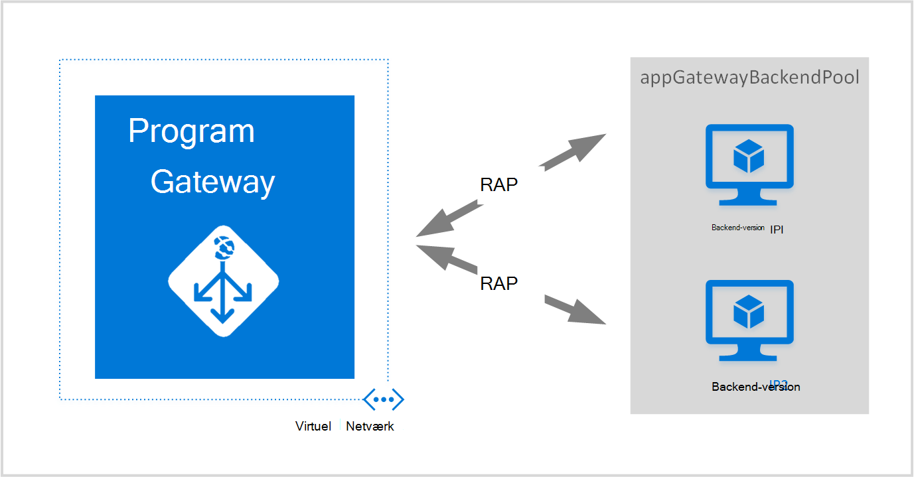
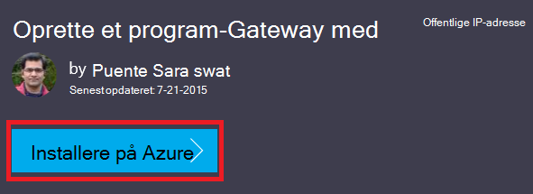
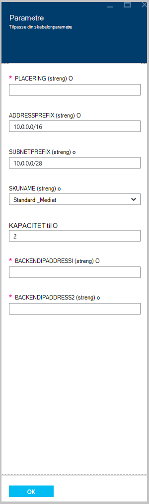

<properties
   pageTitle="Oprette et program-gateway ved hjælp af Azure ressourcestyring skabeloner | Microsoft Azure"
   description="Denne side indeholder en vejledning til at oprette en gateway Azure-program ved hjælp af skabelonen Azure ressourcestyring"
   documentationCenter="na"
   services="application-gateway"
   authors="georgewallace"
   manager="carmonm"
   editor="tysonn"/>
<tags
   ms.service="application-gateway"
   ms.devlang="na"
   ms.topic="article"
   ms.tgt_pltfrm="na"
   ms.workload="infrastructure-services"
   ms.date="10/25/2016"
   ms.author="gwallace"/>

# Oprette et program-gateway ved hjælp af skabelonen Azure ressourcestyring

> [AZURE.SELECTOR]
- [Azure-portalen](application-gateway-create-gateway-portal.md)
- [Azure ressourcestyring PowerShell](application-gateway-create-gateway-arm.md)
- [Azure klassisk PowerShell](application-gateway-create-gateway.md)
- [Azure ressourcestyring skabelon](application-gateway-create-gateway-arm-template.md)
- [Azure CLI](application-gateway-create-gateway-cli.md)

Azure Application Gateway er lag-7 belastningsjustering. Den indeholder failover, ydeevne-routing HTTP-anmodninger mellem forskellige servere, uanset om de er i skyen eller i det lokale miljø. Application Gateway indeholder mange programmet levering Controller (ADC) funktioner, herunder HTTP belastning, cookie-baserede session forbindelse, Secure Sockets Layer (SSL) offload, brugerdefinerede sundhed sonder, understøttelse af flere websted og mange andre. For at finde en komplet liste over understøttede funktioner skal du besøge [Programmet Gateway oversigt](application-gateway-introduction.md)

Lærer du at hente og redigere en eksisterende Azure ressourcestyring skabelon fra GitHub og anvende skabelonen fra GitHub, PowerShell og Azure CLI.

Hvis du blot anvender skabelonen Azure ressourcestyring direkte fra GitHub uden ændringer, kan du gå videre for at installere en skabelon fra GitHub.

## Scenarie

I dette scenarie skal du:

- Oprette et program-gateway med to forekomster.
- Oprette et virtuelt netværk med navnet VirtualNetwork1 med en reserveret CIDR blok med 10.0.0.0/16.
- Oprette et undernet, kaldet Appgatewaysubnet, der bruger 10.0.0.0/28 som dens CIDR blok.
- Konfigurere to konfigureret tidligere back end-IP'er for de webservere, du vil indlæse balance trafikken. I dette eksempel skabelon er back end-IP'er 10.0.1.10 og 10.0.1.11.

>[AZURE.NOTE] Disse indstillinger er parametre for denne skabelon. Hvis du vil tilpasse skabelonen, kan du ændre regler, lytteren og SSL-, der åbner azuredeploy.json.

## Hente og forstå skabelonen Azure ressourcestyring

Du kan hente skabelonen eksisterende Azure ressourcestyring til at oprette et virtuelt netværk og to undernet fra GitHub, foretag eventuelle ændringer, kan du ønsker, og du kan genbruge den. Gør du ved at bruge følgende trin:

1. Gå til [oprette Application Gateway](https://github.com/Azure/azure-quickstart-templates/tree/master/101-application-gateway-create).
2. Klik på **azuredeploy.json**, og klik derefter på **RAW**.
3. Gem filen til en lokal mappe på computeren.
4. Hvis du er bekendt med Azure ressourcestyring skabeloner, gå til trin 7.
5. Åbn den fil, du har gemt, og kig på indholdet under **parametre** i linje 5. Azure ressourcestyring Skabelonparametre giver en pladsholder for værdier, der kan udfyldes under installationen.

  	| Parameter | Beskrivelse |
  	|---|---|
  	| **placering** | Azure område, hvor gatewayen programmet er oprettet |
  	| **VirtualNetwork1** | Navn til det nye virtuelle netværk |
  	| **addressPrefix** | Adresseområde for det virtuelle netværk i CIDR format |
  	| **ApplicationGatewaysubnet** | Navnet på programmet gateway undernet |
  	| **subnetPrefix** | CIDR blokere for program gateway undernettet |
  	| **skuname** | SKU forekomst størrelse |
  	| **kapacitet** | Antallet af forekomster |
  	| **backendaddress1** | IP-adressen på den første webserver |
  	| **backendaddress2** | IP-adressen på den anden webserver |

    >[AZURE.IMPORTANT] Azure ressourcestyring skabeloner vedligeholdes i GitHub kan ændres med tiden. Sørg for, at du kontrollerer skabelonen, inden du bruger det.

6. Kontrollere indhold under **ressourcer** , og Bemærk følgende:

    - **type**. Type ressource, der har oprettet af skabelonen. I dette tilfælde er typen **Microsoft.Network/applicationGateways**, som repræsenterer et program-gateway.
    - **navn**. Ressourcens navn. Bemærk brugen af **[parameters('applicationGatewayName')]**, hvilket betyder, at navnet er angivet som input af dig eller en parameterfil under installationen.
    - **Egenskaber**. Liste over egenskaber for ressourcen. Denne skabelon bruger virtuelle Netværks- og offentlige IP-adresse under oprettelse af programmet gateway.

7. Gå tilbage til [https://github.com/Azure/azure-quickstart-templates/blob/master/101-application-gateway-create/](https://github.com/Azure/azure-quickstart-templates/blob/master/101-application-gateway-create).
8. Klik på **azuredeploy paremeters.json**, og klik derefter på **RAW**.
9. Gem filen til en lokal mappe på computeren.
10. Åbn den fil, du har gemt, og rediger værdierne for parametrene. Brug følgende værdier til at installere programmet gatewayen er beskrevet i dette scenario.

        {
        "$schema": "http://schema.management.azure.com/schemas/2015-01-01/deploymentParameters.json#",
        {
        "location" : {
        "value" : "West US"
        },
        "addressPrefix": {
        "value": "10.0.0.0/16"
        },
        "subnetPrefix": {
        "value": "10.0.0.0/24"
        },
        "skuName": {
        "value": "Standard_Small"
        },
        "capacity": {
        "value": 2
        },
        "backendIpAddress1": {
        "value": "10.0.1.10"
        },
        "backendIpAddress2": {
        "value": "10.0.1.11"
        }
        }

11. Gem filen. Du kan teste JSON skabelon og parameter skabelon ved hjælp af JSON validering onlineværktøjer som [JSlint.com](http://www.jslint.com/).

## Installere skabelonen Azure ressourcestyring ved hjælp af PowerShell

Hvis du aldrig har brugt Azure PowerShell, se, [hvordan du installerer og konfigurerer Azure PowerShell](../powershell-install-configure.md) , og følg vejledningen for at logge på Azure, og vælg dit abonnement.

### Trin 1

    Login-AzureRmAccount

### Trin 2

Markér abonnementer til kontoen.

    Get-AzureRmSubscription

Du bliver bedt om at godkende med dine legitimationsoplysninger.

### Trin 3

Vælg, hvilke af dine Azure abonnementer til brug.

    Select-AzureRmSubscription -Subscriptionid "GUID of subscription"

### Trin 4

Hvis det er nødvendigt, kan du oprette en ressourcegruppe ved hjælp af **Ny AzureResourceGroup** cmdlet. I eksemplet nedenfor kan du oprette en ressourcegruppe med navnet AppgatewayRG af US placering.

    New-AzureRmResourceGroup -Name AppgatewayRG -Location "East US"

Køre **Ny AzureRmResourceGroupDeployment** cmdlet for at installere det nye virtuelle netværk ved hjælp af de foregående skabelon og parameter filer, du har downloadet og ændret.

    New-AzureRmResourceGroupDeployment -Name TestAppgatewayDeployment -ResourceGroupName AppgatewayRG `
        -TemplateFile C:\ARM\azuredeploy.json -TemplateParameterFile C:\ARM\azuredeploy-parameters.json

## Installere skabelonen Azure ressourcestyring ved hjælp af Azure CLI

Hvis du vil installere den Azure ressourcestyring skabelon, du har hentet ved hjælp af Azure CLI, skal du følge nedenstående trin:

### Trin 1

Hvis du aldrig har brugt Azure CLI, se [installere og konfigurere Azure CLI](../xplat-cli-install.md) , og følg vejledningen op til det sted, hvor du kan vælge din Azure-konto og abonnement.

### Trin 2

Kør kommandoen **azure config tilstand** for at skifte til Ressourcestyring tilstand, som vist nedenfor.

    azure config mode arm

Her er den forventede afgang for kommandoen ovenfor:

    info:   New mode is arm

### Trin 3

Hvis det er nødvendigt, kan du køre kommandoen **azure gruppe oprette** til at oprette en ny ressourcegruppe som vist nedenfor. Bemærk output fra kommandoen. Listen vises, når output forklares de parametre, bruges. Du kan finde flere oplysninger om ressourcegrupper ved at besøge [Azure ressourcestyring oversigt](../azure-resource-manager/resource-group-overview.md).

    azure group create -n appgatewayRG -l eastus

**-n (eller -navn)**. Navn til den nye ressourcegruppe. I dette scenario er det *appgatewayRG*.

**-l (eller – placering)**. Azure område, hvor den nye ressourcegruppe er oprettet. I dette scenario er det *eastus*.

### Trin 4

Kør cmdlet **azure gruppe installation oprette** for at installere det nye virtuelle netværk ved hjælp af skabelonen og parameter filerne, du har downloadet og ændret ovenfor. Listen vises, når output forklares de parametre, bruges.

    azure group deployment create -g appgatewayRG -n TestAppgatewayDeployment -f C:\ARM\azuredeploy.json -e C:\ARM\azuredeploy-parameters.json

## Installere skabelonen Azure ressourcestyring ved hjælp af Klik her for at installere

Klik her for at installere er en anden måde at bruge Azure ressourcestyring skabeloner. Det er en nem måde at bruge skabeloner til portalen Azure.

### Trin 1

Gå til [Opret et program-gateway med offentlige IP-adresse](https://azure.microsoft.com/documentation/templates/101-application-gateway-public-ip/).

### Trin 2

Klik på **installeres til Azure**.

### Trin 3

Udfyld parametrene for skabelonen installation på portalen, og klik på **OK**.

### Trin 4

Vælg **juridiske begreber** , og klik på **Køb**.

### Trin 5

Klik på **Opret**på bladet brugerdefineret installation.

## Næste trin

Hvis du vil konfigurere SSL aflastning, skal du se [konfigurere et program-gateway til SSL offload](application-gateway-ssl.md).

Hvis du vil konfigurere et program-gateway til brug med en intern justering af belastning, skal du se [oprette et program-gateway med en intern justering af belastning (ILB)](application-gateway-ilb.md).

Hvis du vil finde flere oplysninger om indlæse indstillinger for justering af belastning Generelt, skal du besøge:

- [Azure justering af belastning](https://azure.microsoft.com/documentation/services/load-balancer/)
- [Azure trafik Manager](https://azure.microsoft.com/documentation/services/traffic-manager/)
