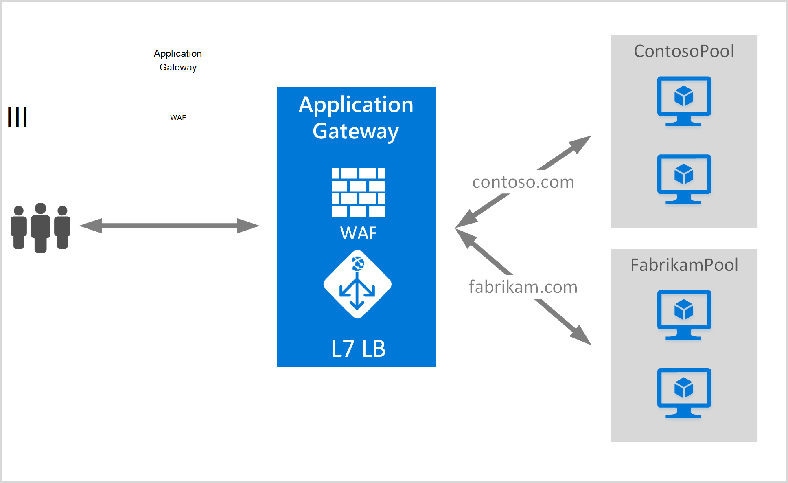

<properties
   pageTitle="Oprette et program-gateway som vært for flere websteder | Microsoft Azure"
   description="Denne side indeholder en vejledning til at oprette, konfigurere gateway en Azure-program som vært for flere webprogrammer på den samme gateway."
   documentationCenter="na"
   services="application-gateway"
   authors="amsriva"
   manager="rossort"
   editor="amsriva"/>
<tags
   ms.service="application-gateway"
   ms.devlang="na"
   ms.topic="article"
   ms.tgt_pltfrm="na"
   ms.workload="infrastructure-services"
   ms.date="10/25/2016"
   ms.author="amsriva"/>

# Oprette et program-gateway som vært for flere webprogrammer

> [AZURE.SELECTOR]
- [Azure-portalen](application-gateway-create-multisite-portal.md)
- [Azure ressourcestyring PowerShell](application-gateway-create-multisite-azureresourcemanager-powershell.md)

Flere vært for webstedet, kan du installere mere end én webprogram på samme programmet gatewayen. Det er baseret på tilstedeværelsen af host sidehoved i den indgående HTTP-anmodning, til at bestemme, hvilke lytteren vil modtage trafik. Lytteren omdirigerer derefter trafik til den relevante back end-puljen, som er konfigureret i definitionen af regler for gateway. I SSL aktiveret webprogrammer programmet gateway, der er afhængig af filtypenavnet Server navn angivelse (SNI) til at vælge den korrekte lytteren for web-trafikken. En almindelig anvendelse af vært for flere websted er at indlæse balance anmodninger om forskellige webdomæner til anden back end-server grupper. På samme måde flere underdomæner for samme roddomænet, kan også bruges på samme programmet gatewayen.

## Scenarie

I eksemplet nedenfor programmet gateway fungerer trafik til contoso.com og fabrikam.com med to grupper af back end-server: contoso server programgruppen og fabrikam server puljen. Konfiguration af lignende kan bruges til at host underdomæner som app.contoso.com og blog.contoso.com.

## Inden du går i gang

1. Installere den nyeste version af Azure PowerShell-cmdlet'er ved hjælp af Web Platform installationsprogrammet. Du kan hente og installere den nyeste version fra sektionen **Windows PowerShell** på [downloadsiden](https://azure.microsoft.com/downloads/).
2. De servere, der er føjet til back end-puljen bruge programmet gatewayen skal findes, eller har oprettet deres slutpunkter, enten i det virtuelle netværk i et separat undernet eller med en offentlige IP-/ VIP tildelt.

## Krav

- **Back end-server programgruppen:** Listen over IP-adresserne på back-end-servere. De viste IP-adresser skal enten tilhører det virtuelle netværksundernet eller skal være en offentlige IP-adresse/VIP. Fulde Domænenavn kan også bruges.
- **Back end-puljen serverindstillinger:** Hver puljen har indstillinger som port, protocol og cookie-baseret forbindelse. Disse indstillinger er knyttet til en gruppe og er anvendt på alle servere i gruppen.
- **Front end-port:** Denne port er den offentlige port, der er åbnet på gatewayen programmet på computeren. Trafik rammer denne port, og klik derefter viderestilles til en af back-end-servere.
- **Lytteren:** Lytteren har en front end-port, en protokol (Http eller Https disse værdier er store og små bogstaver), og SSL-certifikatnavnet (hvis konfiguration af SSL offload). For flere websted aktiveret programmet gateways tilføjes værtsnavn og indikatorer for SNI også.
- **Regel:** Reglen binder lytteren, puljen back end-server og definerer hvilken back end-server puljen trafikken skal sendes til, når det rammer en bestemt lytter.

## Oprette et program-gateway

Følgende er de trin, der bruges til at oprette et program-gateway:

1. Oprette en ressourcegruppe til Ressourcestyring.
2. Oprette et virtuelt netværk, undernet og offentlige IP-adresse til gatewayen programmet på computeren.
3. Oprette et program gateway konfigurationsobjekt.
4. Oprette en programmet gateway ressource.

## Oprette en ressourcegruppe til Ressourcestyring

Sørg for, at du bruger den nyeste version af Azure PowerShell. Flere oplysninger er tilgængelige på [Ved hjælp af Windows PowerShell med ressourcestyring](../powershell-azure-resource-manager.md).

### Trin 1

Log på Azure

    Login-AzureRmAccount

Du bliver bedt om at godkende med dine legitimationsoplysninger.

### Trin 2

Markér abonnementer til kontoen.

    Get-AzureRmSubscription

### Trin 3

Vælg, hvilke af dine Azure abonnementer til brug.

    Select-AzureRmSubscription -SubscriptionName "Name of subscription"

### Trin 4

Oprette en ressourcegruppe (Spring dette trin, hvis du bruger en eksisterende ressourcegruppe).

    New-AzureRmResourceGroup -Name appgw-RG -location "West US"

Alternativt kan du også oprette mærker for en ressourcegruppe til programmet gateway:

    $resourceGroup = New-AzureRmResourceGroup -Name appgw-RG -Location "West US" -Tags @{Name = "testtag"; Value = "Application Gateway multiple site"}

Azure ressourcestyring kræver, at alle ressourcegrupper angive en placering. Denne placering bruges som standardplacering til ressourcer i denne ressourcegruppe. Sørg for, at alle kommandoer til at oprette et program-gateway bruger samme ressourcegruppe.

I eksemplet ovenfor oprettede vi en ressourcegruppe med navnet "appgw-indbyggede RG" med en anden placering af "Vest os".

>[AZURE.NOTE] Hvis du vil konfigurere et brugerdefineret efterprøvning af af dit program gatewayen skal du se [oprette et program-gateway med brugerdefinerede sonder ved hjælp af PowerShell](application-gateway-create-probe-ps.md). Gå til [brugerdefineret sonder og sundhedsovervågning](application-gateway-probe-overview.md) kan finde flere oplysninger.

## Oprette et virtuelt netværk og undernet

I følgende eksempel viser, hvordan du opretter et virtuelt netværk ved hjælp af Ressourcestyring. To undernet er oprettet i dette trin. Det første undernet er af programmet gatewayen sig selv. Programmet gateway kræver sin egen undernet, at holde dens forekomster. Kun gateways andre programmer kan installeres i pågældende undernet. Det andet undernet bruges til at holde application back end-servere.

### Trin 1

Tildele adresse område 10.0.0.0/24 til variablen undernet skal bruges til at holde gatewayen programmet på computeren.

    $subnet = New-AzureRmVirtualNetworkSubnetConfig -Name appgatewaysubnet -AddressPrefix 10.0.0.0/24

### Trin 2

Tildele adresse område 10.0.1.0/24 til variablen subnet2 skal bruges til back end-grupper.

    $subnet2 = New-AzureRmVirtualNetworkSubnetConfig -Name backendsubnet -AddressPrefix 10.0.1.0/24

### Trin 3

Oprette et virtuelt netværk med navnet "appgwvnet" i ressource gruppe "appgw-indbyggede rg" til området Vest USA til brug af præfikset 10.0.0.0/16 med undernet 10.0.0.0/24 og 10.0.1.0/24.

    $vnet = New-AzureRmVirtualNetwork -Name appgwvnet -ResourceGroupName appgw-RG -Location "West US" -AddressPrefix 10.0.0.0/16 -Subnet $subnet,$subnet2

### Trin 4

Tildele en undernet variabel for de næste trin, der opretter et program-gateway.

    $appgatewaysubnet = Get-AzureRmVirtualNetworkSubnetConfig -Name appgatewaysubnet -VirtualNetwork $vnet
    $backendsubnet = Get-AzureRmVirtualNetworkSubnetConfig -Name backendsubnet -VirtualNetwork $vnet

## Oprette en offentlig IP-adresse til front end-konfiguration

Opret en offentlig IP-ressource "publicIP01" i ressource gruppe "appgw-indbyggede rg" for området, vest USA.

    $publicip = New-AzureRmPublicIpAddress -ResourceGroupName appgw-RG -name publicIP01 -location "West US" -AllocationMethod Dynamic

Der tildeles en IP-adresse til gatewayen programmet på computeren, når tjenesten starter.

## Oprette gatewayen programkonfiguration

Du skal konfigurere elementer til konfiguration af alle før du opretter gatewayen programmet på computeren. Følgende trin Opret de konfigurationselementer, der skal bruges for et program gateway ressource.

### Trin 1

Oprette en gateway IP-programkonfiguration med navnet "gatewayIP01". Når du starter programmet gateway, henter en IP-adresse fra det undernet, der er konfigureret og omdirigere netværkstrafik til IP-adresser i back end-IP-puljen. Husk på, at hver forekomst tager én IP-adresse.

    $gipconfig = New-AzureRmApplicationGatewayIPConfiguration -Name gatewayIP01 -Subnet $appgatewaysubnet

### Trin 2

Konfigurere back end-IP-adressegruppe med navnet "pool01" og "pool2" med IP-adresser "10.0.1.100, 10.0.1.101,10.0.1.102" til "pool1" og "10.0.1.103, 10.0.1.104, 10.0.1.105" til "pool2".

    $pool1 = New-AzureRmApplicationGatewayBackendAddressPool -Name pool01 -BackendIPAddresses 10.0.1.100, 10.0.1.101, 10.0.1.102
    $pool2 = New-AzureRmApplicationGatewayBackendAddressPool -Name pool02 -BackendIPAddresses 10.0.1.103, 10.0.1.104, 10.0.1.105

I dette eksempel er der to back end-grupper til at dirigere netværkstrafik baseret på det ønskede websted. Én puljen modtager trafik fra websted "contoso.com" og andre puljen modtager trafik fra websted "fabrikam.com". Du skal erstatte de foregående IP-adresser for at tilføje dine egne slutpunkter for programmet IP-adresse. I stedet for interne IP-adresser, kan du også bruge offentlige IP-adresser, fulde Domænenavn eller en VM NIC til back end-forekomster. Brug "-BackendFQDNs" parameter i PowerShell til at angive FQDN'er i stedet for IP-adresser.

### Trin 3

Konfigurere programmet gateway indstillingen "poolsetting01" og "poolsetting02" til netværkstrafik netværksbelastningen i back end-puljen. I dette eksempel skal konfigurere du forskellige back end-puljen indstillinger for back end-grupper. Hver back end-puljen kan have sin egen back end-puljen indstilling.

    $poolSetting01 = New-AzureRmApplicationGatewayBackendHttpSettings -Name "besetting01" -Port 80 -Protocol Http -CookieBasedAffinity Disabled -RequestTimeout 120
    $poolSetting02 = New-AzureRmApplicationGatewayBackendHttpSettings -Name "besetting02" -Port 80 -Protocol Http -CookieBasedAffinity Enabled -RequestTimeout 240

### Trin 4

Konfigurere den front end IP-adresse med offentlige IP-slutpunkt.

    $fipconfig01 = New-AzureRmApplicationGatewayFrontendIPConfig -Name "frontend1" -PublicIPAddress $publicip

### Trin 5

Konfigurere den front end-port for et program-gateway.

    $fp01 = New-AzureRmApplicationGatewayFrontendPort -Name "fep01" -Port 443

### Trin 6

Konfigurere to SSL-certifikater for de to websteder vi understøtter i dette eksempel. Et certifikat, der er til contoso.com trafik og den anden er til fabrikam.com trafik. Certifikaterne skal være et nøglecenter, der er udstedt certifikater til dine websteder. Selvsignerede certifikater er understøttet, men ikke anbefales til fremstilling trafik.

    $cert01 = New-AzureRmApplicationGatewaySslCertificate -Name contosocert -CertificateFile <file path> -Password <password>
    $cert02 = New-AzureRmApplicationGatewaySslCertificate -Name fabrikamcert -CertificateFile <file path> -Password <password>

### Trin 7

Konfigurere to lyttere til de to websteder i dette eksempel. Dette trin konfigurerer lyttere til offentlige IP-adresse, port og host bruges til at modtage indgående trafik. HostName parameter er påkrævet til understøttelse af flere websted og skal du vælge det relevante websted, hvor trafikken modtages. RequireServerNameIndication parameter skal være indstillet til Sand for websteder, der har brug for support til SSL i et scenarie med flere host. Hvis SSL-understøttelse er påkrævet, skal du også angive det SSL-certifikat, der bruges til at sikre trafikken for dette webprogram. Kombination af FrontendIPConfiguration, FrontendPort og HostName skal være entydige for en lytter. Hver lytteren kan understøtte ét certifikat.

    $listener01 = New-AzureRmApplicationGatewayHttpListener -Name "listener01" -Protocol Https -FrontendIPConfiguration $fipconfig01 -FrontendPort $fp01 -HostName "contoso11.com" -RequireServerNameIndication true  -SslCertificate $cert01
    $listener02 = New-AzureRmApplicationGatewayHttpListener -Name "listener02" -Protocol Https -FrontendIPConfiguration $fipconfig01 -FrontendPort $fp01 -HostName "fabrikam11.com" -RequireServerNameIndication true -SslCertificate $cert02

### Trin 8

Opret to regel indstillingen for to webprogrammerne i dette eksempel. En regel binder sammen lyttere, back end-grupper og HTTP-indstillinger. Dette trin konfigurerer gatewayen program for at bruge grundlæggende routing regel, en for hver enkelt websted. Trafik til hver websted modtages af dens konfigurerede lytteren, og derefter dirigeres til dens konfigurerede back end-puljen, ved hjælp af egenskaber, der er angivet i BackendHttpSettings.

    $rule01 = New-AzureRmApplicationGatewayRequestRoutingRule -Name "rule01" -RuleType Basic -HttpListener $listener01 -BackendHttpSettings $poolSetting01 -BackendAddressPool $pool1
    $rule02 = New-AzureRmApplicationGatewayRequestRoutingRule -Name "rule02" -RuleType Basic -HttpListener $listener02 -BackendHttpSettings $poolSetting02 -BackendAddressPool $pool2

### Trin 9

Konfigurer antallet af forekomster af og størrelsen af programmet gatewayen.

    $sku = New-AzureRmApplicationGatewaySku -Name "Standard_Medium" -Tier Standard -Capacity 2

## Oprette programmet gateway

Oprette et program-gateway med alle konfigurationsobjekter fra de forrige trin.

    $appgw = New-AzureRmApplicationGateway -Name appgwtest -ResourceGroupName appgw-RG -Location "West US" -BackendAddressPools $pool1,$pool2 -BackendHttpSettingsCollection $poolSetting01, $poolSetting02 -FrontendIpConfigurations $fipconfig01 -GatewayIpConfigurations $gipconfig -FrontendPorts $fp01 -HttpListeners $listener01, $listener02 -RequestRoutingRules $rule01, $rule02 -Sku $sku -SslCertificates $cert01, $cert02

>[AZURE.IMPORTANT] Klargøring af programmet Gateway er en længerevarende handling og kan gå et stykke tid at fuldføre.

## Få programmet gateway DNS-navn

Når gatewayen er oprettet, er næste trin at konfigurere front end til kommunikation. Når du bruger en offentlige IP-adresse, kræver programmet gateway et dynamisk tildelt DNS-navn, som ikke er fuldt. For at sikre slutbrugere kan ramme gatewayen programmet en CNAME-post kan bruges til at pege på det offentlige slutpunkt for programmet gateway. [Konfigurere et brugerdefineret domænenavn til i Azure](../cloud-services/cloud-services-custom-domain-name-portal.md). Hente oplysninger om programmet gatewayen og dens tilhørende IP-/ DNS-oplysninger om navn ved hjælp af det PublicIPAddress element, der er knyttet til gatewayen programmet for at gøre dette. Gatewayen programmet DNS-navn skal bruges til at oprette en CNAME-post, der peger på to webprogrammer til denne DNS-navn. Brug af A-poster anbefales ikke, da VIP kan ændre på Genstart for programmet gateway.
    
    Get-AzureRmPublicIpAddress -ResourceGroupName appgw-RG -Name publicIP01
        
    Name                     : publicIP01
    ResourceGroupName        : appgw-RG
    Location                 : westus
    Id                       : /subscriptions/<subscription_id>/resourceGroups/appgw-RG/providers/Microsoft.Network/publicIPAddresses/publicIP01
    Etag                     : W/"00000d5b-54ed-4907-bae8-99bd5766d0e5"
    ResourceGuid             : 00000000-0000-0000-0000-000000000000
    ProvisioningState        : Succeeded
    Tags                     : 
    PublicIpAllocationMethod : Dynamic
    IpAddress                : xx.xx.xxx.xx
    PublicIpAddressVersion   : IPv4
    IdleTimeoutInMinutes     : 4
    IpConfiguration          : {
                                 "Id": "/subscriptions/<subscription_id>/resourceGroups/appgw-RG/providers/Microsoft.Network/applicationGateways/appgwtest/frontendIP
                               Configurations/frontend1"
                               }
    DnsSettings              : {
                                 "Fqdn": "00000000-0000-xxxx-xxxx-xxxxxxxxxxxx.cloudapp.net"
                               }

## Næste trin

Lær, hvordan du beskytter dine websteder med [Application Gateway - Firewall til webprogrammer](application-gateway-webapplicationfirewall-overview.md)