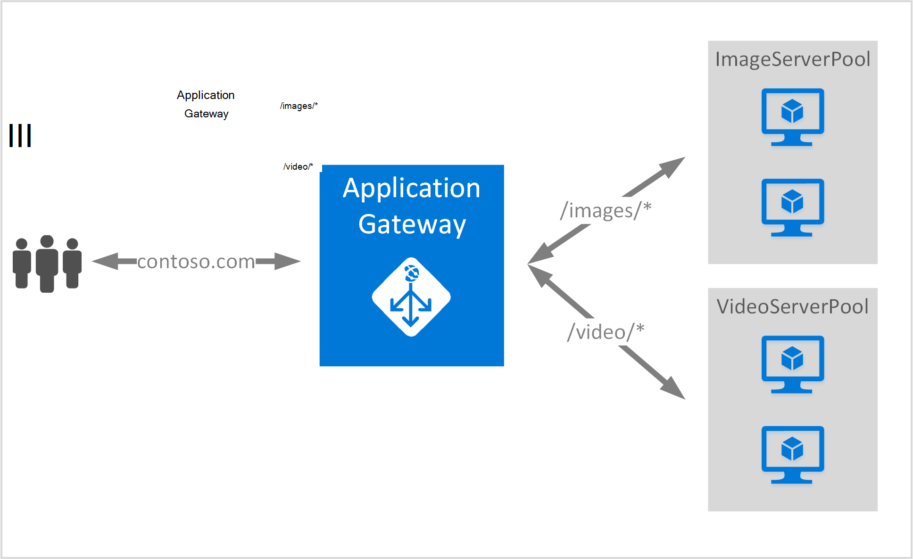

<properties
   pageTitle="Oprette et program-gateway ved hjælp af URL-adressen routing regler | Microsoft Azure"
   description="Denne side indeholder en vejledning til at oprette, konfigurere en Azure-program gateway ved hjælp af URL-adressen routing regler"
   documentationCenter="na"
   services="application-gateway"
   authors="georgewallace"
   manager="jdial"
   editor="tysonn"/>
<tags
   ms.service="application-gateway"
   ms.devlang="na"
   ms.topic="article"
   ms.tgt_pltfrm="na"
   ms.workload="infrastructure-services"
   ms.date="10/25/2016"
   ms.author="gwallace"/>

# Oprette et program-gateway ved hjælp af sti-baserede routing 

> [AZURE.SELECTOR]
- [Azure-portalen](application-gateway-create-url-route-portal.md)
- [Azure ressourcestyring PowerShell](application-gateway-create-url-route-arm-ps.md)

URL-sti-baserede routing gør det muligt at knytte omdirigerer baseret på URL-sti for HTTP-anmodning. Det kontrollerer, om der er en rute til en back end-puljen, der er konfigureret til listerne over URL-adressen i Application Gateway og send netværkstrafikken til definerede back end-puljen. En almindelig anvendelse af URL-baserede distributionen er at indlæse balance anmodninger om forskellige indholdstyper til anden back end-server grupper.

URL-baserede routing introducerer en ny regeltype til programmet gatewayen. Programmet gateway har to regeltyper: grundlæggende og PathBasedRouting. Grundlæggende regeltype giver round robin-tjeneste til back end-grupper under PathBasedRouting ud over round robin fordeling, også tager sti mønster af URL-anmodningen højde, mens du vælger back end-puljen.

>[AZURE.IMPORTANT] PathPattern: Listen over stien mønstre til at matche. Hver skal starte med / og det eneste sted en "\*" er tilladt, er i slutningen. Gyldige eksempler er /xyz, /xyz* eller /xyz/*. Den streng, der indføres til sti matcher ikke indeholde tekst efter først "?" eller "#", og de pågældende tegn er ikke tilladt. 

## Scenarie
I eksemplet nedenfor Application Gateway fungerer trafik for contoso.com med to grupper af back end-server: video server programgruppen og billede server puljen.

Anmodninger om http://contoso.com/image* , distribueres til billede server programgruppen (pool1), og http://contoso.com/video* , distribueres til video server programgruppen (pool2). Et standard server programgruppen (pool1) er markeret, hvis ingen af sti mønstrene svarer til.

## Inden du går i gang

1. Installere den nyeste version af Azure PowerShell-cmdlet'er ved hjælp af Web Platform installationsprogrammet. Du kan hente og installere den nyeste version fra sektionen **Windows PowerShell** på [downloadsiden](https://azure.microsoft.com/downloads/).
2. Du opretter et virtuelt netværk og undernet for Application Gateway. Sørg for, at ingen virtuelle maskiner eller skyen installationer bruger undernettet. Gatewayen programmet skal være alene i et virtuelt netværksundernet.
3. De servere, der er føjet til back end-puljen bruge programmet gatewayen skal findes, eller deres slutpunkter har oprettet i det virtuelle netværk eller med en offentlige IP-/ VIP tildelt.

## Hvad er påkrævet for at oprette et program-gateway?

- **Back end-server programgruppen:** Listen over IP-adresserne på back-end-servere. De viste IP-adresser skal enten tilhører det virtuelle netværksundernet eller skal være en offentlige IP-adresse/VIP.
- **Back end-puljen serverindstillinger:** Hver puljen har indstillinger som port, protocol og cookie-baseret forbindelse. Disse indstillinger er knyttet til en gruppe og er anvendt på alle servere i gruppen.
- **Front end-port:** Denne port er den offentlige port, der er åbnet på gatewayen programmet på computeren. Trafik rammer denne port, og klik derefter viderestilles til en af back-end-servere.
- **Lytteren:** Lytteren har en front end-port, en protokol (Http eller Https, er store og små bogstaver), og SSL-certifikatnavnet (hvis konfiguration af SSL offload).
- **Regel:** Reglen binder lytteren, puljen back end-server og definerer hvilken back end-server puljen trafikken skal sendes til, når det rammer en bestemt lytter.

## Oprette et program-gateway

Forskellen mellem at bruge Azure klassisk og Azure ressourcestyring er den rækkefølge, hvori du oprette gatewayen programmet og de elementer, der skal konfigureres.

Med ressourcestyring alle elementer, som gør et program-gateway er konfigureret enkeltvis, og angiv derefter sammen for at oprette programmet gateway ressourcen.

Her er de trin, som er nødvendige for at oprette et program-gateway:

1. Oprette en ressourcegruppe til Ressourcestyring.
2. Oprette et virtuelt netværk, undernet og offentlige IP-adresse til gatewayen programmet på computeren.
3. Oprette et program gateway konfigurationsobjekt.
4. Oprette en programmet gateway ressource.

## Oprette en ressourcegruppe til Ressourcestyring

Sørg for, at du bruger den nyeste version af Azure PowerShell. Flere oplysninger er tilgængelige ved [Hjælp af Windows PowerShell med ressourcestyring](../powershell-azure-resource-manager.md).

### Trin 1

Log på Azure

    Login-AzureRmAccount

Du bliver bedt om at godkende med dine legitimationsoplysninger. 

### Trin 2

Markér abonnementer til kontoen.

    Get-AzureRmSubscription

### Trin 3

Vælg, hvilke af dine Azure abonnementer til brug.  

    Select-AzureRmSubscription -Subscriptionid "GUID of subscription"

### Trin 4

Oprette en ressourcegruppe (Spring dette trin, hvis du bruger en eksisterende ressourcegruppe).

    New-AzureRmResourceGroup -Name appgw-RG -Location "West US"

Alternativt kan du også oprette mærker for en ressourcegruppe til programmet gateway:
    
    $resourceGroup = New-AzureRmResourceGroup -Name appgw-RG -Location "West US" -Tags @{Name = "testtag"; Value = "Application Gateway URL routing"} 

Azure ressourcestyring kræver, at alle ressourcegrupper angive en placering. Det bruges som standardplacering til ressourcer i denne ressourcegruppe. Sørg for, at alle kommandoer til at oprette et program-gateway bruger samme ressourcegruppe.

I eksemplet ovenfor oprettede vi en ressourcegruppe med navnet "appgw-indbyggede RG" og en placering "Vest os".

>[AZURE.NOTE] Hvis du vil konfigurere et brugerdefineret efterprøvning af af dit program gatewayen skal du se [oprette et program-gateway med brugerdefinerede sonder ved hjælp af PowerShell](application-gateway-create-probe-ps.md). Se [brugerdefinerede sonder og sundhedsovervågning](application-gateway-probe-overview.md) kan finde flere oplysninger.

## Oprette et virtuelt netværk og et undernet til gatewayen program

I følgende eksempel viser, hvordan du opretter et virtuelt netværk ved hjælp af Ressourcestyring.

### Trin 1

Tildele adresse område 10.0.0.0/24 til variablen undernet skal bruges til at oprette et virtuelt netværk.

    $subnet = New-AzureRmVirtualNetworkSubnetConfig -Name subnet01 -AddressPrefix 10.0.0.0/24

### Trin 2

Oprette et virtuelt netværk med navnet "appgwvnet" i ressource gruppe "appgw-indbyggede rg" til området Vest USA til brug af præfikset 10.0.0.0/16 med undernet 10.0.0.0/24.

    $vnet = New-AzureRmVirtualNetwork -Name appgwvnet -ResourceGroupName appgw-RG -Location "West US" -AddressPrefix 10.0.0.0/16 -Subnet $subnet

### Trin 3

Tildele en undernet variabel for de næste trin, der opretter et program-gateway.

    $subnet=$vnet.Subnets[0]

## Oprette en offentlig IP-adresse til front end-konfiguration

Opret en offentlig IP-ressource "publicIP01" i ressource gruppe "appgw-indbyggede rg" for området, vest USA.

    $publicip = New-AzureRmPublicIpAddress -ResourceGroupName appgw-RG -name publicIP01 -location "West US" -AllocationMethod Dynamic

Der tildeles en IP-adresse til gatewayen programmet på computeren, når tjenesten starter.

## Oprette gatewayen programkonfiguration

Elementer til konfiguration af alle skal konfigureres, før du opretter gatewayen programmet. Følgende trin Opret de konfigurationselementer, der skal bruges for et program gateway ressource.

### Trin 1

Oprette en gateway IP-programkonfiguration med navnet "gatewayIP01". Når Application Gateway starter, henter en IP-adresse fra det undernet, der er konfigureret og omdirigere netværkstrafik til IP-adresser i back end-IP-puljen. Husk på, at hver forekomst tager én IP-adresse.

    $gipconfig = New-AzureRmApplicationGatewayIPConfiguration -Name gatewayIP01 -Subnet $subnet

### Trin 2

Konfigurere back end-IP-adressegruppe med navnet "pool01" og "pool2" med IP-adresser "134.170.185.46, 134.170.188.221,134.170.185.50" til "pool1" og "134.170.186.46, 134.170.189.221,134.170.186.50" til "pool2".

    $pool1 = New-AzureRmApplicationGatewayBackendAddressPool -Name pool01 -BackendIPAddresses 134.170.185.46, 134.170.188.221,134.170.185.50

    $pool2 = New-AzureRmApplicationGatewayBackendAddressPool -Name pool02 -BackendIPAddresses 134.170.186.46, 134.170.189.221,134.170.186.50

I dette eksempel er der to back end-grupper til at dirigere netværkstrafik baseret på URL-sti. Én puljen modtager trafik fra URL-sti "/ video" og andre puljen modtage trafik fra stien "/ billede". Erstatte de foregående IP-adresser for at tilføje dine egne slutpunkter for programmet IP-adresse. 

### Trin 3

Konfigurere programmet gateway indstillingen "poolsetting01" og "poolsetting02" til netværkstrafik netværksbelastningen i back end-puljen. I dette eksempel skal konfigurere du forskellige back end-puljen indstillinger for back end-grupper. Hver back end-puljen kan have sin egen back end-puljen indstilling.

    $poolSetting01 = New-AzureRmApplicationGatewayBackendHttpSettings -Name "besetting01" -Port 80 -Protocol Http -CookieBasedAffinity Disabled -RequestTimeout 120

    $poolSetting02 = New-AzureRmApplicationGatewayBackendHttpSettings -Name "besetting02" -Port 80 -Protocol Http -CookieBasedAffinity Enabled -RequestTimeout 240

### Trin 4

Konfigurere den front end IP-adresse med offentlige IP-slutpunkt.

    $fipconfig01 = New-AzureRmApplicationGatewayFrontendIPConfig -Name "frontend1" -PublicIPAddress $publicip

### Trin 5 

Konfigurere den front end-port for et program-gateway.

    $fp01 = New-AzureRmApplicationGatewayFrontendPort -Name "fep01" -Port 80
### Trin 6

Konfigurere lytteren. Dette trin konfigurerer lytteren til den offentlige IP-adresse og port bruges til at modtage indgående netværkstrafik. 
 
    $listener = New-AzureRmApplicationGatewayHttpListener -Name "listener01" -Protocol Http -FrontendIPConfiguration $fipconfig01 -FrontendPort $fp01

### Trin 7 

Konfigurere URL-regel stier til back end-grupper. Dette trin konfigurerer den relative sti, der bruges af programmet gateway til at definere tilknytningen mellem URL-sti og hvilken back end-puljen er tildelt til at håndtere indgående trafik.

I eksemplet nedenfor opretter to regler: én for "/ billede /" sti dirigere trafik til back-end "pool1" og en anden for "/ video /" sti dirigere trafik til back-end "pool2".
    
    $imagePathRule = New-AzureRmApplicationGatewayPathRuleConfig -Name "pathrule1" -Paths "/image/*" -BackendAddressPool $pool1 -BackendHttpSettings $poolSetting01

    $videoPathRule = New-AzureRmApplicationGatewayPathRuleConfig -Name "pathrule2" -Paths "/video/*" -BackendAddressPool $pool2 -BackendHttpSettings $poolSetting02

Regel sti kort konfiguration konfigurerer også et standard adresse back end-puljen, hvis stien ikke matcher nogen af de foruddefinerede stiregler. 

    $urlPathMap = New-AzureRmApplicationGatewayUrlPathMapConfig -Name "urlpathmap" -PathRules $videoPathRule, $imagePathRule -DefaultBackendAddressPool $pool1 -DefaultBackendHttpSettings $poolSetting02

### Trin 8

Oprette en regel indstilling. Dette trin konfigurerer gatewayen program for at bruge URL-sti-baserede distribution.

    $rule01 = New-AzureRmApplicationGatewayRequestRoutingRule -Name "rule1" -RuleType PathBasedRouting -HttpListener $listener -UrlPathMap $urlPathMap

### Trin 9

Konfigurer antallet af forekomster af og størrelsen af programmet gatewayen.

    $sku = New-AzureRmApplicationGatewaySku -Name "Standard_Small" -Tier Standard -Capacity 2

## Oprette Application Gateway

Oprette et program-gateway med alle konfigurationsobjekter fra de forrige trin.

    $appgw = New-AzureRmApplicationGateway -Name appgwtest -ResourceGroupName appgw-RG -Location "West US" -BackendAddressPools $pool1,$pool2 -BackendHttpSettingsCollection $poolSetting01, $poolSetting02 -FrontendIpConfigurations $fipconfig01 -GatewayIpConfigurations $gipconfig -FrontendPorts $fp01 -HttpListeners $listener -UrlPathMaps $urlPathMap -RequestRoutingRules $rule01 -Sku $sku

## Få programmet gateway DNS-navn

Når gatewayen er oprettet, er næste trin at konfigurere front end til kommunikation. Når du bruger en offentlige IP-adresse, kræver programmet gateway et dynamisk tildelt DNS-navn, som ikke er fuldt. For at sikre slutbrugere kan ramme gatewayen programmet en CNAME-post kan bruges til at pege på det offentlige slutpunkt for programmet gateway. [Konfigurere et brugerdefineret domænenavn til i Azure](../cloud-services/cloud-services-custom-domain-name-portal.md). Hente oplysninger om programmet gatewayen og dens tilhørende IP-/ DNS-oplysninger om navn ved hjælp af det PublicIPAddress element, der er knyttet til gatewayen programmet for at gøre dette. Gatewayen programmet DNS-navn skal bruges til at oprette en CNAME-post, der peger på to webprogrammer til denne DNS-navn. Brug af A-poster anbefales ikke, da VIP kan ændre på Genstart for programmet gateway.
    
    Get-AzureRmPublicIpAddress -ResourceGroupName appgw-RG -Name publicIP01
        
    Name                     : publicIP01
    ResourceGroupName        : appgw-RG
    Location                 : westus
    Id                       : /subscriptions/<subscription_id>/resourceGroups/appgw-RG/providers/Microsoft.Network/publicIPAddresses/publicIP01
    Etag                     : W/"00000d5b-54ed-4907-bae8-99bd5766d0e5"
    ResourceGuid             : 00000000-0000-0000-0000-000000000000
    ProvisioningState        : Succeeded
    Tags                     : 
    PublicIpAllocationMethod : Dynamic
    IpAddress                : xx.xx.xxx.xx
    PublicIpAddressVersion   : IPv4
    IdleTimeoutInMinutes     : 4
    IpConfiguration          : {
                                 "Id": "/subscriptions/<subscription_id>/resourceGroups/appgw-RG/providers/Microsoft.Network/applicationGateways/appgwtest/frontendIP
                               Configurations/frontend1"
                               }
    DnsSettings              : {
                                 "Fqdn": "00000000-0000-xxxx-xxxx-xxxxxxxxxxxx.cloudapp.net"
                               }

## Næste trin

Hvis du vil vide Secure Sockets Layer (SSL) aflastning, skal du se [konfigurere et program-gateway til SSL offload](application-gateway-ssl-arm.md).