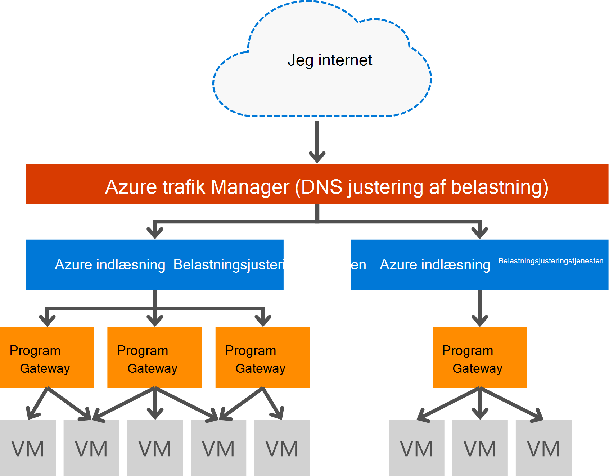

<properties
   pageTitle="Introduktion til Application Gateway | Microsoft Azure"
   description="Denne side indeholder en oversigt over tjenesten Application Gateway til lag 7 belastningsjustering, herunder gateway størrelser, HTTP indlæse justering af belastning, cookie-baserede session forbindelse og SSL offload."
   documentationCenter="na"
   services="application-gateway"
   authors="georgewallace"
   manager="carmonm"
   editor="tysonn"/>
<tags
   ms.service="application-gateway"
   ms.devlang="na"
   ms.topic="hero-article"
   ms.tgt_pltfrm="na"
   ms.workload="infrastructure-services"
   ms.date="10/25/2016"
   ms.author="gwallace"/>

# Programmet Gateway oversigt

## Hvad er Application Gateway

Microsoft Azure Application Gateway indeholder programmet levering Controller (ADC) som en tjeneste, som giver forskellige lag 7 justering af belastning funktioner for dit program. Det gør det muligt at optimere web farm produktivitet ved at overføre CPU-intensivt SSL-afslutning til gatewayen programmet. Den indeholder også andre routing lag 7-funktioner, herunder round robin fordelingen af indgående trafik, cookie baseret session forbindelse, URL-sti baseret routing og muligheden for at være vært for flere websteder bag en enkelt program Gateway. Application Gateway har også en firewall til webprogrammer (WAF), der beskytter dit program mod de fleste af de OWASP øverste 10 almindelige web svagheder. Application Gateway kan konfigureres som internettet modstående gateway, interne eneste gateway eller en kombination af begge. Application Gateway er fuldt Azure administreret, SVG og meget tilgængelige. Den indeholder bredt udvalg af diagnosticering og logføringsfunktioner til administration af bedre. Programmet gateway fungerer med virtuelle maskiner, skytjenester og interne og eksterne modstående webprogrammer.

Application Gateway er en dedikeret virtuelle maskinen for dit program og består af flere forekomster af arbejder for skalerbarhed og høj tilgængelighed. Når du opretter et program-gateway, der er knyttet et slutpunkt (offentlige VIP eller interne ILB IP), og den bruges til vandindtrængen netværkstrafik. Denne VIP eller ILB IP leveres af Azure belastning arbejde på transportniveauet for (TCP/UDP) og har al indgående netværkstrafik der Indlæs afstemmes til Application Gateway arbejder forekomsterne. Den Application Gateway derefter omdirigerer HTTP/HTTPS-trafik baseret på konfigurationen, uanset om det er et virtuelt skybaseret tjeneste, interne eller en ekstern IP-adresse. For SERVICENIVEAUAFTALEN og priser, referere til siderne [SERVICENIVEAUAFTALE](https://azure.microsoft.com/support/legal/sla/) og [priser](https://azure.microsoft.com/pricing/details/application-gateway/) .

## Funktioner

Application Gateway understøtter i øjeblikket lag 7 programmet levering med følgende funktioner:

- **[Firewall til webprogrammer (Preview)](application-gateway-webapplicationfirewall-overview.md)** – web application firewallen (WAF) i Azure Application Gateway beskytter webprogrammer fra fælles webbaserede angreb som SQL-indsættelse, angreb via scripts på tværs af websteder og session hijacks.
- **Http-belastningsjustering** - Application Gateway indeholder round robin belastning. Justering af belastning er udført på lag 7 og bruges til HTTP (S) trafik kun.
- **Cookie-baserede session forbindelse** - denne funktion er nyttig, når du vil beholde en brugersession med på den samme back-end. Ved hjælp af gatewayen administrerede cookies, er Application Gateway i stand til at dirigere efterfølgende trafik fra en brugersession til den samme back-end for behandling. Denne funktion er vigtige i tilfælde, hvor sessionstilstand er gemt lokalt på back-end-serveren for en brugersession.
- **[Secure Sockets Layer (SSL) offload](application-gateway-ssl-arm.md)** – denne funktion kræver dyrt opgaven dekryptere HTTPS trafik fra web-servere. Ved afslutning af SSL-forbindelse på programmet Gateway og videresende anmodningen til server ophævelse krypteret, unburdened webserveren ved dekryptering.  Application Gateway krypterer igen svaret før afsendelse tilbage til klienten. Denne funktion er nyttig i scenarier, hvor back end-er placeret i det samme sikrede virtuelle netværk som Application Gateway i Azure.
- **[Start til slut SSL](application-gateway-backend-ssl.md)** - Application Gateway understøtter start til slut kryptering af trafik. Application Gateway gør dette ved at afbryde SSL-forbindelse på programmet gateway. Gatewayen derefter gælder routing reglerne for trafikken, igen krypterer pakken eller videresender pakken til de relevante back-end, der er baseret på de routing regler, der er defineret. Eventuelle svar fra webserveren går gennem den samme fremgangsmåde tilbage til slutbrugeren.
- **[URL-baserede distribution af indhold](application-gateway-url-route-overview.md)** - denne funktion giver mulighed for at bruge forskellige back end-servere til forskellige trafik. Trafik til en mappe på webserveren eller til et CDN kan dirigeres til en anden back end-, reduceres unødvendige belastning på en back-end, ikke fungerer specifikt indhold.
- **[Flere websted routing](application-gateway-multi-site-overview.md)** - programmet på computeren gateway gør det muligt for dig at konsolidere op til 20 websteder på en enkelt program gateway.
- **[Websocket understøtter](application-gateway-websocket.md)** - en anden god funktion af Application Gateway er den indbyggede understøttelse af Websocket.
- **[Overvåge systemtilstand](application-gateway-probe-overview.md)** - Application gateway indeholder standard sundhed overvågning af back end-ressourcer og brugerdefinerede sonder for at overvåge for mere specifikke scenarier.

## Fordele

Application Gateway er nyttige til:

- Programmer, der kræver anmodninger fra den samme bruger/klient-session når den samme back end-virtuelle maskine. Eksempler på disse programmer ville indkøb indkøbskurv apps og web mailservere.
- Programmer, der vil frigive webserver-farme fra SSL opsigelse før omkostninger.
- Programmer, som et netværk til levering af indhold, der kræver flere HTTP-anmodninger på samme længerevarende TCP-forbindelsen til dirigeres eller indlæse afstemmes til forskellige back end-servere.
- Programmer, der understøtter websocket trafik
- Beskytte webprogrammer fra fælles webbaserede angreb som SQL-indsættelse, angreb via scripts på tværs af websteder og session hijacks.

Application Gateway indlæses justering af som en Azure-administreret tjeneste giver mulighed for klargøring af belastningsjustering lag 7 bag Azure software justering af belastning. Trafik manager kan bruges til at udføre dette scenario, som det fremgår i det følgende billede. Hvor trafikken Manager leverer omdirigering og tilgængelighed, belastningsjustering giver i område skalerbarhed og tilgængelighed, og programmet gateway cross område lag 7 belastning.

[AZURE.INCLUDE [load-balancer-compare-tm-ag-lb-include.md](../../includes/load-balancer-compare-tm-ag-lb-include.md)]

## Gatewayen størrelser og forekomster

Application Gateway tilbydes aktuelt i tre størrelser: lille, Medium og stor. Lille forekomst størrelser er beregnet til udvikling og test scenarier.

Der er i øjeblikket to SKU'er til Application Gateway: WAF og Standard.

Du kan oprette op til 50 programmet gateways per abonnement, og hver programmet gateway kan have op til 10 forekomster. Hvert program gateway kan bestå af 20 http lyttere. Gå til siden [Grænser](../azure-subscription-service-limits.md#application-gateway) for en komplet liste over begrænsninger for programmet gateway.

I følgende tabel vises en gennemsnitlig ydelse overførsel for hver programmet gateway forekomst:

| Back end-siden svar | Lille | Mediet | Store|
|---|---|---|---|
| 6K | 7.5 Mbps | 13 Mbps | 50 Mbps |
|100K | 35 Mbps | 100 Mbps| 200 Mbps |

>[AZURE.NOTE] Disse værdier er tilnærmet værdier for et program gateway overførselshastighed. Den faktiske overførselshastighed afhænger af forskellige miljø detaljer, som middel sidestørrelse, placering af back end-forekomster og behandlingstid at kunne levere en side. Nøjagtigt ydeevnen tal, skal du køre din egen test, der gives kun disse værdier til kapacitet, planlægning vejledning.

## Overvåge systemtilstand

Azure Application Gateway overvåger automatisk tilstanden for back end-forekomster gennem basic eller brugerdefineret sundhed sonder. Ved hjælp af sundhed sonder sikrer dette, at kun sund hosts besvare trafik. Se [Application Gateway sundhed overvågning oversigt](application-gateway-probe-overview.md)kan finde flere oplysninger.

## Konfiguration og administration af

Programmet gateway kan til dens slutpunkt har en offentlige IP-adresse, privat IP- eller begge dele, når den er konfigureret. Application Gateway er konfigureret i et virtuelt netværk i sin egen undernet. Undernet oprettet eller bruges til programmet gateway må ikke indeholde eventuelle andre typer ressourcer, de kun ressourcer, der er tilladt i undernettet er andre program-gateways. For at sikre dine back end-ressourcer i back-end kan være indeholdt servere i et andet undernet i det samme virtuelle netværk som gatewayen programmet på computeren. Dette yderligere undernet, der er det ikke et krav til back end-programmer, så længe gatewayen programmet kan få fat i IP-adressen, programmet gateway er kunne give ADC funktioner til back end-servere.

Du kan oprette og administrere et program-gateway ved hjælp af REST API'er, PowerShell-cmdletter, Azure CLI eller [Azure-portalen](https://portal.azure.com/).

## Næste trin

Du kan [oprette et program-gateway](application-gateway-create-gateway-portal.md) efter lære mere om Application gateway, eller du kan [oprette et program-gateway SSL offload](application-gateway-ssl-arm.md) på belastning HTTPS forbindelser.

For at lære at oprette et program-gateway ved hjælp af URL-baserede distribution af indhold, skal du gå til at [oprette et program-gateway ved hjælp af URL-baserede routing](application-gateway-create-url-route-arm-ps.md) kan finde flere oplysninger.

