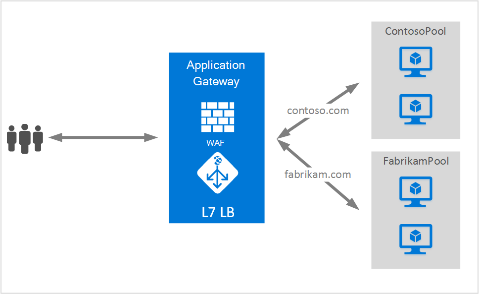

<properties
   pageTitle="Vært for flere websteder på Application Gateway | Microsoft Azure"
   description="Denne side indeholder en oversigt over Application Gateway med flere websted support."
   documentationCenter="na"
   services="application-gateway"
   authors="amsriva"
   manager="rossort"
   editor="amsriva"/>
<tags
   ms.service="application-gateway"
   ms.devlang="na"
   ms.topic="hero-article"
   ms.tgt_pltfrm="na"
   ms.workload="infrastructure-services"
   ms.date="10/25/2016"
   ms.author="amsriva"/>

# Application Gateway flere vært for websted

Flere vært for webstedet, kan du konfigurere mere end én webprogram på den samme programmet gateway forekomst. Denne funktion kan du konfigurere en mere effektiv topologi for dine installationer ved at føje op til 20 websteder til ét program gatewayen. Hvert websted kan omdirigeres til sin egen back end-puljen. I eksemplet nedenfor programmet gateway fungerer trafik til contoso.com og fabrikam.com fra to back end-server grupper kaldet ContosoServerPool og FabrikamServerPool.

Anmodninger om http://contoso.com, distribueres til ContosoServerPool og http://fabrikam.com, distribueres til FabrikamServerPool.

På samme måde kan to underdomæner for det samme overordnede domæne knyttes til den samme programmet gateway-installation. Eksempler på brug af underdomæner kan omfatte http://blog.contoso.com og http://app.contoso.com hostes på en enkelt program gateway-installation.

## HOST-headere og Server navn angivelse (SNI)

Der findes tre almindelige mekanismer for at aktivere flere websted vært på den samme infrastruktur.

1. Være vært for flere webprogrammer hver på en entydig IP-adresse.
2. Brug værtsnavn til at være vært for flere webprogrammer på den samme IP-adresse.
3. Bruge forskellige porte til at være vært for flere webprogrammer på den samme IP-adresse.

I øjeblikket får et program-gateway en enkelt offentlige IP-adresse, hvor det lytter til trafik. Derfor understøttelse af flere programmer, understøttes hver med sin egen IP-adresse, ikke i øjeblikket. Application Gateway understøtter vært for flere programmer hver lytter på forskellige porte, men dette scenario kræver programmerne til at acceptere trafik på ikke-standard-porte og er ofte ikke er en ønskede konfiguration. Application Gateway er afhængig af HTTP 1.1 host sidehoveder hoste mere end ét websted på den samme offentlige IP-adresse og port. Steder på programmet gateway kan også support SSL aflastning med Server navn angivelse (SNI) TLS filtypenavn. Dette scenarie betyder, klienten browser- og back end-webfarmen skal understøtte HTTP/1.1 og TLS lokalnummer, som defineret i RFC 6066.

## Lytteren konfiguration element

Eksisterende HTTPListener konfiguration element er udvidet til at understøtte host navn og server navn angivelse elementer, der bruges af programmet gateway til at dirigere trafik til relevante back end-puljen. Følgende kodeeksempel er kodestykke for HttpListeners element fra skabelonfil.

    "httpListeners": [
                {
                    "name": "appGatewayHttpsListener1",
                    "properties": {
                        "FrontendIPConfiguration": {
                            "Id": "/subscriptions/<subid>/resourceGroups/<rgName>/providers/Microsoft.Network/applicationGateways/applicationGateway1/frontendIPConfigurations/DefaultFrontendPublicIP"
                        },
                        "FrontendPort": {
                            "Id": "/subscriptions/<subid>/resourceGroups/<rgName>/providers/Microsoft.Network/applicationGateways/applicationGateway1/frontendPorts/appGatewayFrontendPort443'"
                        },
                        "Protocol": "Https",
                        "SslCertificate": {
                            "Id": "/subscriptions/<subid>/resourceGroups/<rgName>/providers/Microsoft.Network/applicationGateways/applicationGateway1/sslCertificates/appGatewaySslCert1'"
                        },
                        "HostName": "contoso.com",
                        "RequireServerNameIndication": "true"
                    }
                },
                {
                    "name": "appGatewayHttpListener2",
                    "properties": {
                        "FrontendIPConfiguration": {
                            "Id": "/subscriptions/<subid>/resourceGroups/<rgName>/providers/Microsoft.Network/applicationGateways/applicationGateway1/frontendIPConfigurations/appGatewayFrontendIP'"
                        },
                        "FrontendPort": {
                            "Id": "/subscriptions/<subid>/resourceGroups/<rgName>/providers/Microsoft.Network/applicationGateways/applicationGateway1/frontendPorts/appGatewayFrontendPort80'"
                        },
                        "Protocol": "Http",
                        "HostName": "fabrikam.com",
                        "RequireServerNameIndication": "false"
                    }
                }
            ],

Du kan besøge [ressourcestyring skabelon ved hjælp af flere websted vært](https://github.com/Azure/azure-quickstart-templates/blob/master/201-application-gateway-multihosting) for en start til slut skabelon-baseret installation.

## Reglen routing

Der er ingen ændring, der er påkrævet i routing reglen. Routing reglen 'Basic' bør fortsat vælges bindes relevante lytteren at tilsvarende back end-adresse puljen.

    "requestRoutingRules": [
    {
        "name": "<ruleName1>",
        "properties": {
            "RuleType": "Basic",
            "httpListener": {
                "id": "/subscriptions/<subid>/resourceGroups/<rgName>/providers/Microsoft.Network/applicationGateways/applicationGateway1/httpListeners/appGatewayHttpsListener1')]"
            },
            "backendAddressPool": {
                "id": "/subscriptions/<subid>/resourceGroups/<rgName>/providers/Microsoft.Network/applicationGateways/applicationGateway1/backendAddressPools/ContosoServerPool')]"
            },
            "backendHttpSettings": {
                "id": "/subscriptions/<subid>/resourceGroups/<rgName>/providers/Microsoft.Network/applicationGateways/applicationGateway1/backendHttpSettingsCollection/appGatewayBackendHttpSettings')]"
            }
        }

    },
    {
        "name": "<ruleName2>",
        "properties": {
            "RuleType": "Basic",
            "httpListener": {
                "id": "/subscriptions/<subid>/resourceGroups/<rgName>/providers/Microsoft.Network/applicationGateways/applicationGateway1/httpListeners/appGatewayHttpListener2')]"
            },
            "backendAddressPool": {
                "id": "/subscriptions/<subid>/resourceGroups/<rgName>/providers/Microsoft.Network/applicationGateways/applicationGateway1/backendAddressPools/FabrikamServerPool')]"
            },
            "backendHttpSettings": {
                "id": "/subscriptions/<subid>/resourceGroups/<rgName>/providers/Microsoft.Network/applicationGateways/applicationGateway1/backendHttpSettingsCollection/appGatewayBackendHttpSettings')]"
            }
        }

    }
    ]

## Næste trin

Gå til at [oprette et program-gateway ved hjælp af flere vært for webstedet](application-gateway-create-multisite-azureresourcemanager-powershell.md) til at oprette et program-gateway med mulighed for at understøtte mere end én webprogram efter learning om flere vært for webstedet.
