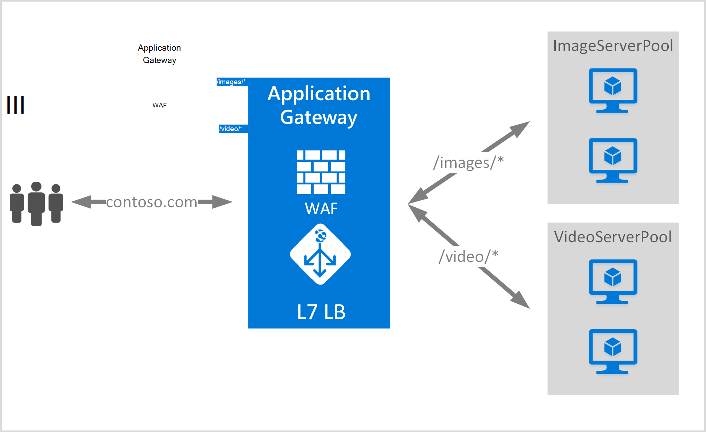

<properties
   pageTitle="URL-baserede routing oversigt over celleindhold | Microsoft Azure"
   description="Denne side indeholder en oversigt over URL-adressen webprogrammet Gateway-baseret distribution af indhold, UrlPathMap konfiguration og PathBasedRouting regel."
   documentationCenter="na"
   services="application-gateway"
   authors="georgewallace"
   manager="carmonm"
   editor="tysonn"/>
<tags
   ms.service="application-gateway"
   ms.devlang="na"
   ms.topic="hero-article"
   ms.tgt_pltfrm="na"
   ms.workload="infrastructure-services"
   ms.date="10/25/2016"
   ms.author="gwallace"/>

# URL-sti baseret Routing oversigt

URL-adressen baseret distribution af stier, kan du dirigere trafik til back end-server-grupper, der er baseret på URL-stier for din anmodning. Et af scenarierne er at distribuere anmodninger om forskellige indholdstyper til forskellige back end-server grupper.
I eksemplet nedenfor Application Gateway fungerer trafik for contoso.com fra tre back end-server grupper for eksempel: VideoServerPool, ImageServerPool og DefaultServerPool.

Anmodninger om http://contoso.com/video* , distribueres til VideoServerPool, og http://contoso.com/images* , distribueres til ImageServerPool. DefaultServerPool er markeret, hvis ingen af sti mønstrene svarer til.

## UrlPathMap konfiguration element

UrlPathMap element bruges til at angive stien mønstre til back end-server puljen tilknytninger. Følgende kodeeksempel er kodestykke for urlPathMap element fra skabelonfil.

    "urlPathMaps": [
    {
    "name": "<urlPathMapName>",
    "id": "/subscriptions/<subscriptionId>/../microsoft.network/applicationGateways/<gatewayName>/ urlPathMaps/<urlPathMapName>",
    "properties": {
        "defaultBackendAddressPool": {
            "id": "/subscriptions/<subscriptionId>/../microsoft.network/applicationGateways/<gatewayName>/backendAddressPools/<poolName>"
        },
        "defaultBackendHttpSettings": {
            "id": "/subscriptions/<subscriptionId>/../microsoft.network/applicationGateways/<gatewayName>/backendHttpSettingsList/<settingsName>"
        },
        "pathRules": [
            {
                "paths": [
                    <pathPattern>
                ],
                "backendAddressPool": {
                    "id": "/subscriptions/<subscriptionId>/../microsoft.network/applicationGateways/<gatewayName>/backendAddressPools/<poolName2>"
                },
                "backendHttpsettings": {
                    "id": "/subscriptions/<subscriptionId>/../microsoft.network/applicationGateways/<gatewayName>/backendHttpsettingsList/<settingsName2>"
                },

            },

        ],

    }
    }
    

>[AZURE.NOTE] PathPattern: Denne indstilling er en liste over stien mønstre til at matche. Hver skal starte med / og det eneste sted en "*" er tilladt er ved slutningen følgende en "/". Den streng, der indføres til sti matcher ikke indeholde tekst efter først? eller #, og disse tegn er ikke tilladt her. 

Du kan se en [ressourcestyring skabelon ved hjælp af URL-baserede routing](https://azure.microsoft.com/documentation/templates/201-application-gateway-url-path-based-routing) kan finde flere oplysninger.

## PathBasedRouting regel

RequestRoutingRule af typen PathBasedRouting bruges til at binde en lytter til en urlPathMap. Alle anmodninger, der er modtaget for denne lytteren distribueres baseret på politik, der er angivet i urlPathMap.
Udsnit af af PathBasedRouting regel:

    "requestRoutingRules": [
    {

    "name": "<ruleName>",
    "id": "/subscriptions/<subscriptionId>/../microsoft.network/applicationGateways/<gatewayName>/requestRoutingRules/<ruleName>",
    "properties": {
        "ruleType": "PathBasedRouting",
        "httpListener": {
            "id": "/subscriptions/<subscriptionId>/../microsoft.network/applicationGateways/<gatewayName>/httpListeners/<listenerName>"
        },
        "urlPathMap": {
            "id": "/subscriptions/<subscriptionId>/../microsoft.network/applicationGateways/<gatewayName>/ urlPathMaps/<urlPathMapName>"
        },

    }
    
## Næste trin

Når du lære mere om URL-baserede distribution af indhold, gå til at [oprette et program-gateway ved hjælp af URL-baserede routing](application-gateway-create-url-route-portal.md) til at oprette et program-gateway med URL-adressen routing regler.
