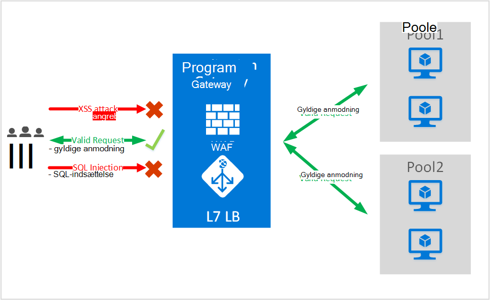
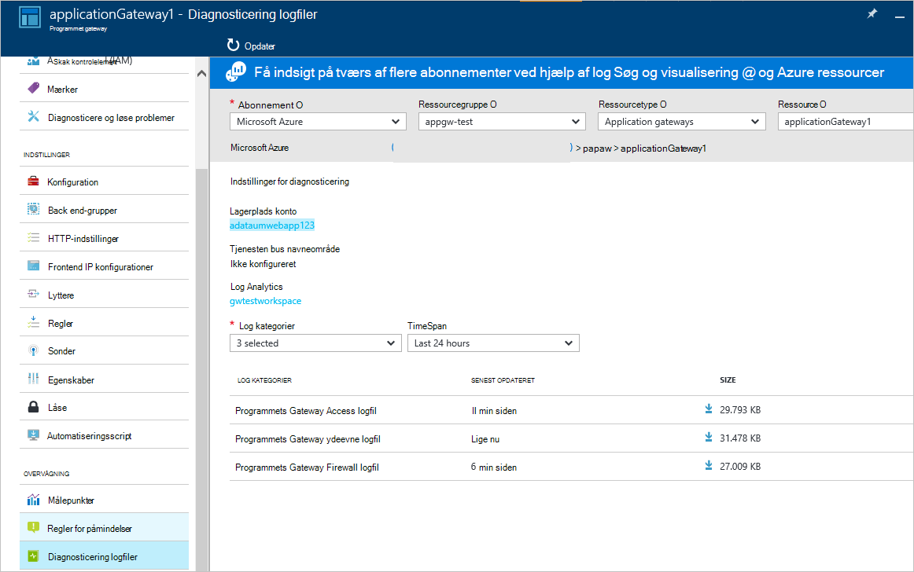

<properties
   pageTitle="Introduktion til Firewall til webprogrammer (WAF) for Application Gateway | Microsoft Azure"
   description="Denne side indeholder en oversigt over Web Application Firewall (WAF) for Application Gateway "
   documentationCenter="na"
   services="application-gateway"
   authors="amsriva"
   manager="rossort"
   editor="amsriva"/>
<tags
   ms.service="application-gateway"
   ms.devlang="na"
   ms.topic="hero-article"
   ms.tgt_pltfrm="na"
   ms.workload="infrastructure-services"
   ms.date="10/25/2016"
   ms.author="amsriva"/>

# Programmet Gateway Firewall til webprogrammer (preview)

Firewall til webprogrammer (WAF) er en funktion i azure-program gateway, der giver beskyttelse til webprogrammer, der udnytter programmet gateway for programmet leveringen Ctrl (ADC) standardfunktioner. Firewall til webprogrammer gør dette ved at beskytte dem mod de fleste af de OWASP øverste 10 almindelige web svagheder. Webprogrammer er stadig af angreb, der udnytte almindelige kendte svagheder mål. Almindelige blandt disse tilsidesættelse er SQL-injektionsangreb, scripting på tværs af websteder angreb for at navngive nogle. Forhindre aflytning i programkode kan være en udfordring og kan kræve strenge vedligeholdelse, retter og overvågning på flere lag af topologi for søgeprogram. Et centralt firewall til webprogrammer til at beskytte mod webangreb gør sikkerhed management meget nemmere og giver bedre assurance til programmet mod trusler fra hackere. En WAF løsning kan også reagere på en hurtigere sikkerhedsrisiko ved rettelse af en kendte sikkerhedsrisiko på en central placering kontra sikring af hver af individuelle webprogrammer. Eksisterende program-gateways kan konverteres til et program-gateway med firewall til webprogrammer nemt.

Application Gateway fungerer som en programmet levering controller og tilbyder SSL opsigelse før, cookie-baserede session forbindelse, round robin-indlæsning fordel indhold baseret routing, mulighed for at være vært for flere forbedringer af websteder og sikkerhed. Forbedringer af sikkerheden, som Application Gateway omfatter SSL politik for administration af start til slut SSL support. Vi styrke programmet sikkerhedsfunktioner af vores service ved at introducere WAF (firewall til webprogrammer) direkte integreret med ADC tilbyder. Dette giver en nem at konfigurere central placering for at administrere og beskytte dine webprogrammer mod almindelige web svagheder.

Konfiguration af WAF på programmet gateway indeholder følgende fordelene for dig:

- Beskytte dit webprogram fra web svagheder og angreb uden ændringer til back end-kode.
- Beskytte flere webprogrammer på samme tid bag et program-gateway. Programmet gateway understøtter vært for op til 20 websteder bag en enkelt gateway, der kan være alle beskyttet mod webangreb.
- Overvåge dit webprogram mod angreb ved hjælp af realtid rapport, der genereres af programmet gateway WAF logfiler.
- Visse overholdelse kontrolelementer kræver, at alle internet modstående slutpunkter til at være beskyttet af en WAF løsning. Ved hjælp af programmet gateway med WAF aktiveret, kan du opfylder disse krav.

## Oversigt

Programmet Gateway WAF tilbydes i en ny SKU (WAF SKU) og er forudkonfigureret med ModSecurity og OWASP Core regelsæt til at tilbyde oprindelige beskyttelse mod de fleste af de OWASP øverste 10 almindelige web svagheder.

- SQL-indsættelse beskyttelse
- Cross websted scripting beskyttelse
- Almindelige Web angreb beskyttelse som kommandoen indsættelse, HTTP-anmodning indsmugling HTTP-svar opdele, og eksterne fil skal indgå angreb
- Beskyttelse mod overtrædelse af HTTP-protokol
- Beskyttelse mod HTTP-protokollen afvigelser som mangler vært brugeragent og acceptere sidehoveder
- HTTP DoS beskyttelse herunder HTTP fyldning og langsom HTTP DoS forhindring
- Forebyggelse mod BOT'er, crawlers og scannere
- Registrering af almindelige fejlkonfigurationer program (det vil sige Apache, IIS osv.)

## WAF tilstande

Programmet Gateway WAF kan være konfigureret til at køre i de følgende to tilstande:

- **Tilstanden registrering** – når konfigureret til at køre i tilstanden med registrering programmet Gateway WAF overvåger og logfører alle truslen beskeder i en logfil. Skal du sikre dig, at logføring af diagnosticering til Application Gateway er aktiveret ved hjælp af afsnittet diagnosticering. Du skal også sikre, at WAF loggen er markeret og slået til.
- **Forebyggelse tilstand** – når konfigureret til at køre i forebyggelse tilstand, Application Gateway aktivt blokerer angreb, der er fundet af dens regler. Hackeren modtager en undtagelse for 403 uautoriseret adgang og forbindelsen er afbrudt. Forebyggelse tilstand fortsætter med at logge aflytning i loggene på WAF.

## Programmet Gateway WAF rapporter

Programmet Gateway WAF indeholder detaljeret rapportering på hver truslen, der registreres. Logføring er integreret med Azure diagnosticering logfiler og beskeder er registreret i json-format.

    {
        "resourceId": "/SUBSCRIPTIONS/<subscriptionId>/RESOURCEGROUPS/<resourceGroupName>/PROVIDERS/MICROSOFT.NETWORK/APPLICATIONGATEWAYS/<applicationGatewayName>",
        "operationName": "ApplicationGatewayFirewall",
        "time": "2016-09-20T00:40:04.9138513Z",
        "category": "ApplicationGatewayFirewallLog",
        "properties":     {
            "instanceId":"ApplicationGatewayRole_IN_0",
            "clientIp":"108.41.16.164",
            "clientPort":1815,
            "requestUri":"/wavsep/active/RXSS-Detection-Evaluation-POST/",
            "ruleId":"OWASP_973336",
            "message":"XSS Filter - Category 1: Script Tag Vector",
            "action":"Logged",
            "site":"Global",
            "message":"XSS Filter - Category 1: Script Tag Vector",
            "details":{"message":" Warning. Pattern match "(?i)(<script","file":"/owasp_crs/base_rules/modsecurity_crs_41_xss_attacks.conf","line":"14"}}
    }

## Programmet Gateway WAF SKU priser

Under eksempelvisning er der ingen yderligere gebyrer for programmet Gateway WAF brugen. Du fortsætte med at betale på eksisterende grundlæggende SKU gebyrer. Vi vil kommunikere WAF SKU gebyrer på GA tid. Kunder, der har valgt at installere programmet Gateway i WAF SKU vil starte periodisering af WAF SKU priser kun efter GA meddelelse.

## Næste trin

Når du få mere at vide om funktionerne i WAF, skal du gå til [Sådan konfigureres Firewall til webprogrammer på Application Gateway](application-gateway-web-application-firewall-portal.md).
