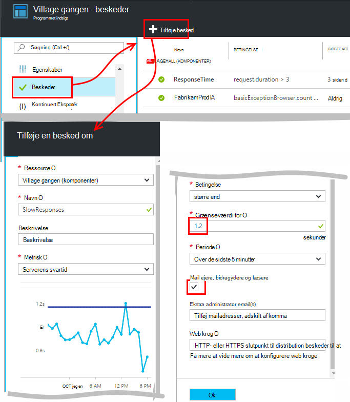
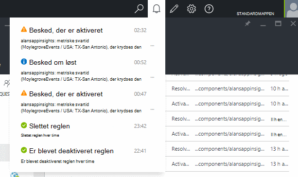
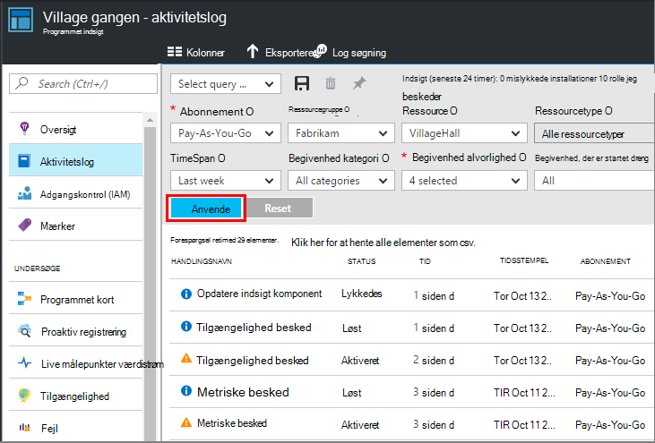

<properties 
    pageTitle="Angive beskeder i programmet indsigt | Microsoft Azure" 
    description="Få besked om langsom svar gange, undtagelser, og andre ydeevnen eller brugen ændringer i din online." 
    services="application-insights" 
    documentationCenter=""
    authors="alancameronwills" 
    manager="douge"/>

<tags 
    ms.service="application-insights" 
    ms.workload="tbd" 
    ms.tgt_pltfrm="ibiza" 
    ms.devlang="na" 
    ms.topic="article" 
    ms.date="10/14/2016" 
    ms.author="awills"/>
 
# Angive beskeder i programmet indsigt

[Visual Studio programmet indsigt] [ start] kan give dig besked om ændringer i ydeevnen eller brugen målepunkter i WebApp. 

Programmet indsigt overvåger din direkte app på en [lang række platforme] [ platforms] kan hjælpe dig med at diagnosticere problemer med ydeevnen og forstå brugsmønstre.

Der findes tre typer beskeder:

* **Metriske beskeder** fortæller dig, når en hvilken som helst metrisk krydser en grænseværdi for nogle periode - som svar gange, undtagelse tæller, CPU-brug eller sidevisninger. 
* [**Web test** ] [ availability] fortælle dig, når dit websted er ikke tilgængelig på internettet eller svarer langsomt. [Få mere at vide][availability].
* [**Proaktiv diagnosticering**](app-insights-proactive-diagnostics.md) er automatisk konfigureret til at give dig besked om usædvanlige ydeevne mønstre.

Vi fokusere på metriske beskeder i denne artikel.

## Indstille en metriske besked

Åbn bladet regler for påmindelser, og derefter bruge knappen Tilføj. 

* Angiv ressourcen, før de andre egenskaber. **Vælg "(komponenter)" ressourcen** , hvis du vil indstille påmindelser for ydeevnen eller brugen målepunkter.
* Det navn, du giver påmindelsen skal være entydig i ressourcegruppen (ikke blot dit program).
* Sørg for at være opmærksom på de enheder, hvor du bliver bedt om Angiv grænseværdien.
* Hvis du markerer afkrydsningsfeltet "Mail ejere...", sendes beskeder via mail til alle, der har adgang til denne ressourcegruppe. For at udvide denne sæt af personer, du Føj dem til [ressourcegruppe eller et andet abonnement](app-insights-resources-roles-access-control.md) (ikke ressourcen).
* Hvis du angiver "Yderligere mails", sendes beskeder til de personer eller grupper (uanset om du markeret feltet "mail ejere..."). 
* Angive en [webhook adresse](../monitoring-and-diagnostics/insights-webhooks-alerts.md) , hvis du har konfigureret en WebApp, der reagerer på beskeder. Det bliver kaldt både når påmindelsen er aktiveret (der udløses), og når den er løst. (Men Bemærk, at på nuværende tidspunkt, forespørgselsparametre sendes ikke gennem som webhook egenskaber).
* Du kan deaktivere eller aktivere beskeden: se knapperne øverst i bladet.

*Jeg kan ikke se knappen Tilføj besked.* 

- Bruger du en organisationskonto? Hvis du har ejer eller bidragyder, få adgang til denne ressource i programmet på computeren, kan du angive beskeder. Se nærmere på bladet adgangskontrol. [Få mere at vide om adgangskontrol][roles].

> [AZURE.NOTE] I bladet beskeder, får du vist, at der allerede er en besked om sæt: [Proaktiv diagnosticering](app-insights-proactive-failure-diagnostics.md). Dette er en automatisk besked, overvåger ét bestemt metriske, anmodning om manglende afkast. Medmindre du beslutter at deaktivere proaktiv beskeden, kan du ikke behøver at angive dine egne besked på anmodning om fejl ved sats. 

## Se dine beskeder

Du får en mail, når en besked om ændringer tilstand mellem inaktive og aktive. 

Den aktuelle tilstand for hver besked vises i bladet regler for påmindelser.

Der er en oversigt over nylige aktiviteter i sektionen beskeder i rullemenuen:

Oversigten over ændringer i tilstand er aktivitet log:

## Hvordan fungerer beskeder

* En besked har tre tilstande: "Aldrig aktiveret", "Aktiveret" og "Løst." Aktiveret betyder, at den angivne betingelse er sand, når det sidst blev evalueret.

* En meddelelse om genereres, når en påmindelse ændrer status. (Hvis betingelsen beskeder om var allerede SAND, da du oprettede beskeden, skal du muligvis ikke får en meddelelse indtil betingelsen er falsk.)

* Hver meddelelse genererer en mail, hvis du har markeret feltet mails eller leveres mailadresser. Du kan også se på rullelisten beskeder.

* En besked evalueres, hver gang en metrikværdi ankommer, men ikke på anden måde.

* Evalueringen samler metrikværdien i den foregående periode, og derefter det sammenlignes med grænseværdi til at bestemme den nye tilstand.

* Den periode, som du vælger angiver intervallet, hvor samles målepunkter. Den påvirker ikke hvor ofte påmindelsen evalueres: det afhænger af hyppigheden for modtagelse af målepunkter.

* Hvis du modtager ingen data for en bestemt metrikværdi i et stykke tid, har forskellige effekter på beskeder om evaluering og diagrammer i metriske explorer mellemrummet. Hvis ingen data kan ses i mere end diagrammets udvalg interval, viser diagrammet i metriske explorer, en værdi på 0. Men en besked, der er baseret på den samme metrikværdi er ikke evalueres igen, og den vigtige besked tilstand forbliver uændret. 

    Når data ankommer til sidst, springer diagrammet tilbage til en værdi ikke er nul. Beskeden evalueres baseret på de data, der er tilgængelige for den angivne periode. Hvis det nye datapunkt er den eneste, der er tilgængelige i perioden, bygger et aggregat lige ved, datapunkt.

* En besked kan blinker ofte mellem besked og sund tilstand, selvom du angiver en længere periode. Dette kan ske, hvis værdien metriske holdes rundt i grænseværdi for. Der ikke er nogen hysteresis i i grænseværdi: overgangen til besked sker der med den samme værdi som overgangen til sund.

## Hvad er god beskeder til at angive?

Det afhænger af dit program. Skal starte med er det bedst ikke at angive for mange målepunkter. Bruge nogle tid på at kigge på dine metriske diagrammer, mens din app kører, for at få føling hvordan det fungerer normalt. Dette hjælper dig med at finde måder at forbedre ydeevnen. Derefter konfigurere beskeder til at fortælle dig, når målepunkter gå uden for zonen normal. 

Populære beskeder omfatter:

* [Browser målepunkter][client], især Browser **sideindlæsningstider**, er gode til webprogrammer. Hvis siden har en masse scripts, får du vil pas på **browseren undtagelser**. Hvis du vil have disse målepunkter og beskeder, du skal konfigurere [webside overvågning][client].
* **Serverens svartid** for serversiden af webprogrammer. Hold øje denne metrikværdi for at se, hvis det varierer uforholdsmæssigt med høj anmodning satser samt konfigurere beskeder,:, der kan angive, at din app løbe tør for ressourcer. 
* **Server undtagelser** - for at se dem, du skal gøre nogle [yderligere opsætning](app-insights-asp-net-exceptions.md).

Husk, [proaktiv manglende rente diagnosticering](app-insights-proactive-failure-diagnostics.md) automatisk overvåge den rente, hvormed din app besvarer anmodninger med fejlkoder. 

## Automatisering

* [Bruge PowerShell til at automatisere konfigurationen af beskeder](app-insights-powershell-alerts.md)
* [Bruge webhooks til at automatisere reagere på beskeder](../monitoring-and-diagnostics/insights-webhooks-alerts.md)

## Se også

* [Tilgængelighed web test](app-insights-monitor-web-app-availability.md)
* [Automatisere konfigurationen af beskeder](app-insights-powershell-alerts.md)
* [Proaktiv diagnosticering](app-insights-proactive-diagnostics.md) 

<!--Link references-->

[availability]: app-insights-monitor-web-app-availability.md
[client]: app-insights-javascript.md
[platforms]: app-insights-platforms.md
[roles]: app-insights-resources-roles-access-control.md
[start]: app-insights-overview.md

 