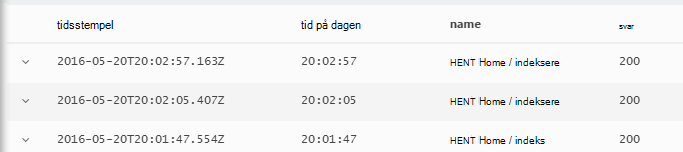
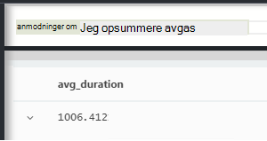

<properties 
    pageTitle="En rundvisning i programmet indsigt Analytics | Microsoft Azure" 
    description="Kort eksempler på alle de vigtigste forespørgsler i Analytics, effektive søgeværktøjet af programmet indsigt." 
    services="application-insights" 
    documentationCenter=""
    authors="alancameronwills" 
    manager="douge"/>

<tags 
    ms.service="application-insights" 
    ms.workload="tbd" 
    ms.tgt_pltfrm="ibiza" 
    ms.devlang="na" 
    ms.topic="article" 
    ms.date="10/15/2016" 
    ms.author="awills"/>


 
# <a name="a-tour-of-analytics-in-application-insights"></a>En rundvisning i Analytics i programmet indsigt


[Analytics](app-insights-analytics.md) er effektive søgefunktionen af [Programmet indsigt](app-insights-overview.md). Disse sider beskriver Analytics forespørgsel lanquage.


* **[Se indledende videoen](https://applicationanalytics-media.azureedge.net/home_page_video.mp4)**.
* **[Test drev analyser af vores simuleret data](https://analytics.applicationinsights.io/demo)** , hvis din app ikke sende data til programmet indsigt endnu.


Lad os en gennemgang nogle grundlæggende forespørgsler til at komme i gang.

## <a name="connect-to-your-application-insights-data"></a>Oprette forbindelse til dit program indsigt data

Åbne Analytics fra din app [Oversigt blade](app-insights-dashboards.md) i programmet indsigt:


    
## <a name="takeapp-insights-analytics-referencemdtake-operator-show-me-n-rows"></a>[Tage](app-insights-analytics-reference.md#take-operator): Vis n rækker

Datapunkter, der logger bruger handlinger (typisk HTTP-anmodninger modtages af din online) er gemt i en tabel med navnet `requests`. Hver række er et telemetri datapunkt, der er modtaget fra programmet indsigt SDK i din app.

Lad os starte med at undersøge et par eksempel rækker i tabellen:


> [AZURE.NOTE] Placer markøren et vilkårligt sted i sætningen før du klikker på farten. Du kan opdele en sætning over mere end én linje, men sæt ikke tomme linjer i en sætning. Tomme linjer er en praktisk metode til at undgå flere separate forespørgsler i vinduet.


Vælge kolonner, skal du trække dem, gruppere efter kolonner, og filtrere: 


Udvide et element for at se detaljerne:
 


> [AZURE.NOTE] Klik på afsnit i en kolonne for at ændre rækkefølgen af de resultater, der er tilgængelige i webbrowseren. Men vær opmærksom på, for et stort resultatsæt antallet af rækker, der er overført til browseren er begrænset. Sortere på denne måde viser ikke altid dig de faktiske højeste eller laveste elementer. Hvis du vil sortere elementer pålideligt, skal du bruge den `top` eller `sort` operator. 

## <a name="topapp-insights-analytics-referencemdtop-operator-and-sortapp-insights-analytics-referencemdsort-operator"></a>[Øverst](app-insights-analytics-reference.md#top-operator) og [Sortér](app-insights-analytics-reference.md#sort-operator)

`take`er praktisk til at få et hurtigt eksempel på et resultat, men den viser rækker fra tabellen i en bestemt rækkefølge. For at få en sorteret visning skal du bruge `top` (for eksempel) eller `sort` (oven over hele tabellen).

Vis mig de første n rækker, der er sorteret efter en bestemt kolonne:

```AIQL

    requests | top 10 by timestamp desc 
```

* *Syntaks:* De fleste udbydere har nøgleord parametre såsom `by`.
* `desc`= faldende rækkefølge, `asc` = stigende.


`top...`er en mere performant metode til at sige `sort ... | take...`. Vi kunne være skrevet:

```AIQL

    requests | sort by timestamp desc | take 10
```

Resultatet vil være den samme, men den vil køre en smule langsommere. (Du kan også skrive `order`, som er et alias for `sort`.)

Kolonneoverskrifter i tabelvisningen kan også bruges til at sortere resultaterne på skærmen. Men hvis du har brugt naturligvis `take` eller `top` til at hente kun en del af en tabel, du skal kun ændre rækkefølgen af de poster, du har hentet.


## <a name="projectapp-insights-analytics-referencemdproject-operator-select-rename-and-compute-columns"></a>[Projekt](app-insights-analytics-reference.md#project-operator): Vælg ved at omdøbe og beregne kolonner

Brug [`project`](app-insights-analytics-reference.md#project-operator) til at finde de ønskede kolonner:

```AIQL

    requests | top 10 by timestamp desc
             | project timestamp, name, resultCode
```


Du kan også Omdøb kolonner og definere nye:

```AIQL

    requests 
  	| top 10 by timestamp desc 
  	| project  
            name, 
            response = resultCode,
            timestamp, 
            ['time of day'] = floor(timestamp % 1d, 1s)
```



* [Kolonnenavne](app-insights-analytics-reference.md#names) kan indeholde mellemrum eller symboler, hvis de er kantede parenteser sådan ud: `['...']` eller`["..."]`
* `%`er den sædvanlige modulus operator. 
* `1d`(det er et tal, og klik derefter en havde ') er et ordret timespan dvs én dag. Her er nogle flere timespan konstanter: `12h`, `30m`, `10s`, `0.01s`.
* `floor`(alias `bin`) Runder værdien ned til nærmeste multiplum af værdien af du angiver. Så `floor(aTime, 1s)` Runder gangen ned til det nærmeste andet.

[Udtryk](app-insights-analytics-reference.md#scalars) kan medtage alle de sædvanlige operatorer (`+`, `-`,...), og der er et område af nyttige funktioner.

    

## <a name="extendapp-insights-analytics-referencemdextend-operator-compute-columns"></a>[Udvid](app-insights-analytics-reference.md#extend-operator): beregne kolonner

Hvis du blot ønsker at føje kolonner til de eksisterende, kan du bruge [`extend`](app-insights-analytics-reference.md#extend-operator):

```AIQL

    requests 
  	| top 10 by timestamp desc
  	| extend timeOfDay = floor(timestamp % 1d, 1s)
```

Ved hjælp af [`extend`](app-insights-analytics-reference.md#extend-operator) er mindre detaljeret end [`project`](app-insights-analytics-reference.md#project-operator) Hvis du vil beholde de eksisterende kolonner.


## <a name="summarizeapp-insights-analytics-referencemdsummarize-operator-aggregate-groups-of-rows"></a>[Summér](app-insights-analytics-reference.md#summarize-operator): sammenlægge grupper af rækker

`Summarize`anvender en bestemt *sammenlægning funktionen* over grupper af rækker. 

For eksempel den tid, der tager din online til at reagere på en anmodning om rapporteres i feltet `duration`. Lad os se på gennemsnitlig svartid alle anmodninger om:



Eller vi kunne Opdel resultatet i anmodninger af forskellige navne:


`Summarize`indsamler datapunkterne i strømmen i grupper, de `by` delsætningen evalueres lige. Hver værdi i den `by` udtryk - hver handlingsnavn i eksemplet ovenfor - resulterer i en række i tabellen resultat. 

Eller vi kunne gruppere resultaterne efter klokkeslæt:


Bemærk, hvordan vi bruger den `bin` funktionen (også kendt `floor`). Hvis vi blot anvendt `by timestamp`, hver input række ville ender i sin egen lille gruppe. For en hvilken som helst fortløbende skalarværdi som klokkeslæt eller tal, vi har at inddele sammenhængende område i et håndterbare antal dedikeret værdier og `bin` -der er blot den velkendte afrunding ned `floor` funktionen – er den nemmeste måde at gøre det.

Vi kan bruge den samme metode til at reducere områder af strenge:


Bemærk, at du kan bruge `name=` til at angive navnet på et resultat kolonne i sammenlægning udtryk eller delsætningen by.

## <a name="counting-sampled-data"></a>Optælling af prøver fra data

`sum(itemCount)`er det anbefalede sammenlægning til at tælle begivenheder. I mange situationer itemCount == 1, så funktionen blot tæller op antallet af rækker i gruppen. Men når [stikprøver, hvor der](app-insights-sampling.md) er i handlingen, kun en brøkdel af de oprindelige hændelser bevares som datapunkter i programmet viden, så for hvert datapunkt, du ser, der er `itemCount` begivenheder. 

Eksempelvis hvis udvalg sletter 75% af oprindelige begivenheder, og klik derefter på itemCount == 4 i under bevares poster – det vil sige, for alle bevares poster, der ikke er fire oprindelige poster. 

Tilpasset udvalg får itemCount skal være højere i perioder, når dit program der bruges mest.

Opsummering af itemCount derfor giver en god vurdering af det oprindelige antal begivenheder.


Der er også en `count()` sammenlægning (og en handling af Tæl), i de tilfælde hvor du virkelig vil tælle antallet af rækker i en gruppe.


Der er et område af [sammenlægningsfunktioner](app-insights-analytics-reference.md#aggregations).


## <a name="charting-the-results"></a>Oprettelse af diagrammer resultaterne


```AIQL

    exceptions 
       | summarize count()  
         by bin(timestamp, 1d)
```

Som standard resultater vises som en tabel:


Vi kan gøre bedre end tabelvisning. Lad os se på resultaterne i diagramvisningen med lodret søjle indstilling:


Bemærk, at selvom vi ikke sortere resultaterne af tid (som du kan se i visning af tabellen), diagramvisningen viser altid dato/klokkeslæt i korrekt rækkefølge.


## <a name="whereapp-insights-analytics-referencemdwhere-operator-filtering-on-a-condition"></a>[Hvor](app-insights-analytics-reference.md#where-operator): filtrering på en betingelse

Hvis du har konfigureret programmet indsigt overvågning for både [klienten](app-insights-javascript.md) og serveren sider af din app, er nogle af telemetri i databasen stammer fra browsere.

Lad os se kun undtagelser rapporteret fra browsere:

```AIQL

    exceptions 
  	| where client_Type == "Browser" 
  	|  summarize count() 
       by client_Browser, outerMessage 
```


Den `where` operator kræver et boolesk udtryk. Her er nogle vigtige punkter om dem:

 * `and`, `or`: Booleske operatorer
 * `==`, `<>` : er lig med og forskellig fra
 * `=~`, `!=` : case-insensitive streng lige og ikke lig med. Der er mange flere streng sammenligningsoperatorer.

Læs alt om [skalær udtryk](app-insights-analytics-reference.md#scalars).

### <a name="filtering-events"></a>Filtrere begivenheder

Finde mislykkes anmodninger:

```AIQL

    requests 
  	| where isnotempty(resultCode) and toint(resultCode) >= 400
```

`responseCode`har typen streng, så vi skal [konverteres den](app-insights-analytics-reference.md#casts) til en numerisk sammenligning.

Opsummere forskellige svar:

```AIQL

    requests
  	| where isnotempty(resultCode) and toint(resultCode) >= 400
  	| summarize count() 
      by resultCode
```

## <a name="timecharts"></a>Timecharts

Vis antallet af hændelser, der er hver dag:

```AIQL

    requests
      | summarize event_count=count()
        by bin(timestamp, 1d)
```

Vælg indstillingen diagram skærm:


## <a name="multiple-series"></a>Flere serier 

Flere udtryk i den `summarize` opretter flere kolonner.

Flere udtryk i den `by` delsætningen opretter flere rækker, en for hver kombination af værdier.


```AIQL

    requests
  	| summarize count(), avg(duration) 
      by bin(timestamp, 1d), client_StateOrProvince, client_City 
  	| order by timestamp asc, client_StateOrProvince, client_City
```


### <a name="segment-a-chart-by-dimensions"></a>Segment skal tildeles et diagram ved dimensioner

Hvis du diagrammet ud fra en tabel, der indeholder en strengkolonne og en numerisk kolonne, kan strengen, der bruges til at opdele de numeriske data i separate række punkter. Hvis der er mere end én strengkolonne, kan du vælge, hvilken kolonne der skal bruges som diskriminator. 


### <a name="display-multiple-metrics"></a>Få vist flere målepunkter

Hvis du diagram en tabel, der mere end én numerisk kolonne ud over tidsstemplet, kan du få vist en vilkårlig kombination af dem.


Du skal vælge ikke opdelt, før du kan vælge flere numeriske kolonner du ikke kan opdele efter en strengkolonne på samme tid som viser mere end én numerisk kolonne. 


## <a name="daily-average-cycle"></a>Daglig gennemsnitlige cyklus

Hvordan brugen variere over den gennemsnitlige dag?

Antal anmodninger af tid modulus én dag binned til timer:

```AIQL

    requests
  	| extend hour = floor(timestamp % 1d , 1h) 
          + datetime("2016-01-01")
  	| summarize event_count=count() by hour
```


>[AZURE.NOTE] Bemærk, at vi har til at konvertere tid varighed til dato/klokkeslæt for at få vist på i et diagram.


## <a name="compare-multiple-daily-series"></a>Sammenligne flere daglige serier

Hvordan brugen varierer over tid på dagen i forskellige lande?

```AIQL

 requests  | where tostring(operation_SyntheticSource)
     | extend hour= floor( timestamp % 1d , 1h)
           + datetime("2001-01-01")
     | summarize event_count=count() 
       by hour, client_CountryOrRegion 
     | render timechart
```


## <a name="plot-a-distribution"></a>Afbilde en fordeling

Hvor mange sessioner er der med forskellig længde?

```AIQL

    requests 
  	| where isnotnull(session_Id) and isnotempty(session_Id) 
  	| summarize min(timestamp), max(timestamp) 
      by session_Id 
  	| extend sessionDuration = max_timestamp - min_timestamp 
  	| where sessionDuration > 1s and sessionDuration < 3m 
  	| summarize count() by floor(sessionDuration, 3s) 
  	| project d = sessionDuration + datetime("2016-01-01"), count_
```

Den sidste linje kræves for at konvertere til dato/klokkeslæt. Aktuelt vises x-aksen i et diagram som en skalarværdi, kun, hvis det er en dato/klokkeslæt.

Den `where` delsætningen udelader one-shot sessioner (sessionDuration == 0) og angiver længden af x-aksen.


## <a name="percentilesapp-insights-analytics-referencemdpercentiles"></a>[Fraktiler](app-insights-analytics-reference.md#percentiles)

Hvilke områder af varigheder dækker forskellige procentdelene af sessioner?

Bruge den ovenstående forespørgsel, men erstatte den sidste linje:

```AIQL

    requests 
  	| where isnotnull(session_Id) and isnotempty(session_Id) 
  	| summarize min(timestamp), max(timestamp) 
      by session_Id 
  	| extend sesh = max_timestamp - min_timestamp 
  	| where sesh > 1s
  	| summarize count() by floor(sesh, 3s) 
  	| summarize percentiles(sesh, 5, 20, 50, 80, 95)
```

Vi fjernes også den øvre grænse i where-delsætning, for at få korrekte figurer, herunder alle sessioner med mere end én anmodning:


Vi kan se, hvor:

* 5% af sessioner har en varighed på mindre end 3 minutter 34s; 
* 50% af sessioner sidste mindre end 36 minnutes;
* 5% af sessioner seneste mere end 7 dage

Hvis du vil have en separat opdeling for hvert land, vi kun har til at hente opsummering kolonnen client_CountryOrRegion separat gennem begge operatorer:

```AIQL

    requests 
  	| where isnotnull(session_Id) and isnotempty(session_Id) 
  	| summarize min(timestamp), max(timestamp) 
      by session_Id, client_CountryOrRegion
  	| extend sesh = max_timestamp - min_timestamp 
  	| where sesh > 1s
  	| summarize count() by floor(sesh, 3s), client_CountryOrRegion
  	| summarize percentiles(sesh, 5, 20, 50, 80, 95)
      by client_CountryOrRegion
```


## <a name="joinapp-insights-analytics-referencemdjoin"></a>[Deltage i](app-insights-analytics-reference.md#join)

Vi har adgang til flere tabeller, herunder anmodninger og undtagelser.

For at finde de undtagelser, der er relateret til en anmodning, returneres en fejl ved svar skal vi kan deltage i tabellerne på `session_Id`:

```AIQL

    requests 
  	| where toint(responseCode) >= 500 
  	| join (exceptions) on operation_Id 
  	| take 30
```


Det er god praksis at bruge `project` at markere de kolonner, vi har brug for, før du udfører joinforbindelsen.
I de samme delsætninger Omdøb vi kolonnen tidsstempel.


## <a name="letapp-insights-analytics-referencemdlet-clause-assign-a-result-to-a-variable"></a>[Lade](app-insights-analytics-reference.md#let-clause): tildele et resultat til en variabel

Brug [lade](./app-insights-analytics-reference.md#let-statements) til at adskille dele af det forrige udtryk. Resultaterne er uændret:

```AIQL

    let bad_requests = 
      requests
        | where  toint(resultCode) >= 500  ;
    bad_requests
  	| join (exceptions) on session_Id 
  	| take 30
```

> Tip: Analytics-klienten ikke lagt tomme linjer mellem delene af dette. Sørg for at udføre hele.


## <a name="accessing-nested-objects"></a>Få adgang til indlejrede objekter

Indlejrede objekter kan nemt åbnes. I undtagelser strømmen får du vist strukturerede objekter som dette:


Du kan udjævne det ved at vælge de egenskaber, du er interesseret i at:

```AIQL

    exceptions | take 10
  	| extend method1 = tostring(details[0].parsedStack[1].method)
```

Bemærk, at du skal bruge en [cast](app-insights-analytics-reference.md#casts) for den relevante type.

## <a name="custom-properties-and-measurements"></a>Brugerdefinerede egenskaber og mål

Hvis dit program vedhæfter [brugerdefinerede mål (egenskaber) og brugerdefinerede mål](app-insights-api-custom-events-metrics.md#properties) begivenheder og derefter kan du se dem i den `customDimensions` og `customMeasurements` objekter.


For eksempel, hvis din app omfatter:

```C#

    var dimensions = new Dictionary<string, string> 
                     {{"p1", "v1"},{"p2", "v2"}};
    var measurements = new Dictionary<string, double>
                     {{"m1", 42.0}, {"m2", 43.2}};
    telemetryClient.TrackEvent("myEvent", dimensions, measurements);
```

Sådan udtrækkes disse værdier i Analytics:

```AIQL

    customEvents
  	| extend p1 = customDimensions.p1, 
      m1 = todouble(customMeasurements.m1) // cast to expected type

``` 

## <a name="tables"></a>Tabeller

Strømmen af telemetri modtaget fra din app er tilgængelig via flere tabeller. Skemaet af egenskaber, der er tilgængelige for hver tabel vises til venstre i vinduet.

### <a name="requests-table"></a>Anmodninger om tabel

Antal HTTP-anmodninger til din online og segmentet ved sidenavn:


Finde de anmodninger, mislykkes de fleste:


### <a name="custom-events-table"></a>Brugerdefinerede hændelser tabel

Hvis du bruger [TrackEvent()](app-insights-api-custom-events-metrics.md#track-event) til at sende din egen begivenheder, kan du læse dem fra denne tabel. 

Lad os et eksempel, hvor din app kode indeholder disse linjer:

```C#

    telemetry.TrackEvent("Query", 
       new Dictionary<string,string> {{"query", sqlCmd}},
       new Dictionary<string,double> {
           {"retry", retryCount},
           {"querytime", totalTime}})
```

Få vist hyppigheden for disse hændelser:
 


Udtrække mål og dimensioner fra hændelserne:


### <a name="custom-metrics-table"></a>Brugerdefineret målepunkter tabel

Hvis du bruger [TrackMetric()](app-insights-api-custom-events-metrics.md#track-metric) til at sende din egen metriske værdier, finder du resultaterne i **customMetrics** strømmen. Eksempel:  


> [AZURE.NOTE] I [Målepunkter Explorer](app-insights-metrics-explorer.md), alle brugerdefinerede målinger, der er knyttet til en hvilken som helst type telemetri vises sammen i bladet målepunkter sammen med målepunkter sendes ved hjælp af `TrackMetric()`. Men i Analytics, brugerdefinerede mål stadig er knyttet til typen telemetri, de er overført på - begivenheder eller anmodninger og så videre -, mens målepunkter, der er sendt af TrackMetric vises i deres egen strøm.

### <a name="performance-counters-table"></a>Ydeevnen tællere tabel

[Tællere i ydeevne](app-insights-performance-counters.md) viser dig grundlæggende system omfanget af din app, som CPU, hukommelse og udnyttelse af netværk. Du kan konfigurere SDK for at sende yderligere tællere, herunder dine egne brugerdefinerede tællere.

**PerformanceCounters** skemaet viser den `category`, `counter` navn, og `instance` navn for hver ydeevne tæller. Tæller forekomstnavne gælder kun for visse tællere i ydeevne og typisk angiver navnet på den proces, som relaterer til antallet. I telemetri for hvert program, får du vist kun tællerne for det pågældende program. For eksempel for at se, findes hvilke tællere: 


Sådan får du et diagram af tilgængelig hukommelse over den seneste periode: 


**PerformanceCounters** har også en kolonne som andre telemetri `cloud_RoleInstance` , der angiver værtsmaskinen som din app kører identitet. For eksempel, at sammenligne ydeevnen for din app på forskellige computere: 


### <a name="exceptions-table"></a>Undtagelser tabel

[Undtagelser rapporteret af din app](app-insights-asp-net-exceptions.md) er tilgængelige i denne tabel. 

Deltag i operation_Id for at finde den HTTP-anmodning, der håndtering af din app, når undtagelsen er opløftet:


### <a name="browser-timings-table"></a>Browser tidsindstillinger tabel

`browserTimings`Viser siden Indlæs data, der indsamles i dine brugeres browsere.

[Konfigurere din app til klientsiden telemetri](app-insights-javascript.md) for at kunne se disse målepunkter. 

Skemaet indeholder [målepunkter, der angiver længderne på forskellige stadier på siden indlæsning af processen](app-insights-javascript.md#page-load-performance). (De ikke angive tidsrummet, brugerne læse en side).  

Vise popularities på forskellige sider, og Indlæs tidspunkter for hver side:


### <a name="availbility-results-table"></a>Availbility Resultattabellen

`availabilityResults`Viser resultaterne af dit [web test](app-insights-monitor-web-app-availability.md). Hver enkelt kørsel af test fra hver test placering rapporteres separat. 


### <a name="dependencies-table"></a>Afhængigheder tabel

Indeholder resultatet af opkald, gør din app til databaser og REST API'er og andre opkald til TrackDependency().

### <a name="traces-table"></a>Spor tabel

Indeholder telemetri sendes af din app, ved hjælp af TrackTrace() eller [andre logføring strukturer](app-insights-asp-net-trace-logs.md).

## <a name="dashboards"></a>Dashboards

Du kan fastgøre resultaterne til et dashboard for at samle alle dine vigtigste diagrammer og tabeller.

* [Azure delte dashboard](app-insights-dashboards.md#share-dashboards): Klik på ikonet. Før du gør dette, skal du have et delt dashboard. I portalen Azure, Åbn eller Opret et dashboard og klikke på del.
* [Dashboard i Power BI](app-insights-export-power-bi.md): Klik på Eksporter, Power BI-forespørgsel. En fordelen ved denne alternativ er, at du kan få vist din forespørgsel sammen med en andre resultater fra en meget lang række kilder.


## <a name="next-steps"></a>Næste trin

* [Analytics sprogreference](app-insights-analytics-reference.md)

[AZURE.INCLUDE [app-insights-analytics-footer](../../includes/app-insights-analytics-footer.md)]


