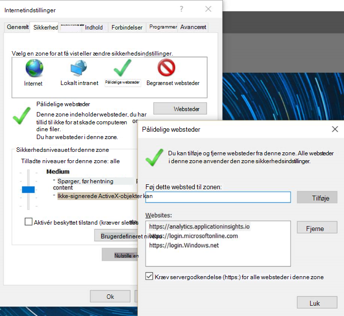
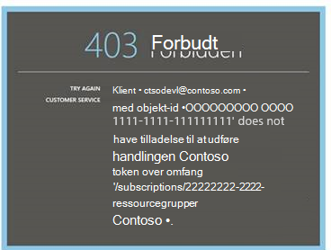

<properties 
    pageTitle="Fejlfinding i forbindelse med Analytics - værktøjet effektiv søgning i programmet indsigt | Microsoft Azure" 
    description="Problemer med programmet indsigt analytics? Start her. " 
    services="application-insights" 
    documentationCenter=""
    authors="alancameronwills" 
    manager="douge"/>

<tags 
    ms.service="application-insights" 
    ms.workload="tbd" 
    ms.tgt_pltfrm="ibiza" 
    ms.devlang="na" 
    ms.topic="article" 
    ms.date="07/11/2016" 
    ms.author="awills"/>

# Fejlfinding i forbindelse med Analytics i programmet indsigt

Problemer med [programmet indsigt Analytics](app-insights-analytics.md)? Start her. Analytics er effektive søgeværktøjet af Visual Studio programmet indsigt.

## Begrænsninger

* Resultater af en forespørgsel er begrænset til lige over en uge tidligere data på nuværende tidspunkt.
* Vi tester på browsere: seneste udgaver af Chrome, kant og Internet Explorer.

## Filtypenavne for kendte inkompatible browser

* Ghostery

Deaktivere filtypenavnet, eller brug en anden browser.

##"Uventet fejl"

Der opstod en intern fejl under portalen runtime – ikke-afviklet undtagelse.

* Rydde browserens cache. 

## 403... kan du prøve at genindlæse

En godkendelse relateret der opstod fejl (under godkendelse eller ved oprettelse af access token). På portalen muligvis ikke muligt at gendanne uden at ændre indstillinger for webbrowser.

* Kontrollere [tredjepartscookies er aktiveret](#cookies) i browseren. 

## 403... bekræfte sikkerhedszone

En godkendelse relateret der opstod fejl (under godkendelse eller ved oprettelse af access token). På portalen muligvis ikke muligt at gendanne uden at ændre indstillinger for webbrowser.

1. Kontrollere [tredjepartscookies er aktiveret](#cookies) i browseren. 

2. Du bruger en favorit, bogmærke eller gemt et hyperlink til at åbne portalen Analytics? Er du logget på med andre legitimationsoplysninger end du brugte, da du gemte linket?

2. Prøv at bruge en i-privat/inkognito browservindue (efter at have lukket alle vinduer). Du er nødt til at angive dine legitimationsoplysninger. 

2. Åbn en anden (almindelig) browservindue, og gå til [Azure](https://portal.azure.com). Log af. Åbn derefter link, og log på med de korrekte legitimationsoplysninger.

2. Kant- og Internet Explorer-brugere kan også få denne fejl, når der er tillid til zone indstillingerne ikke understøttes.

    Kontrollér både [Analytics-portalen](https://analytics.applicationinsights.io) og [Azure Active Directory-portalen](https://portal.azure.com) er i samme zonen:

 * Åbn **Internetindstillinger**, **sikkerhed**, **du har tillid til websteder**, **websteder**i Internet Explorer:

    

    Hvis nogle af de følgende URL-adresser er inkluderet, skal du kontrollere, at de andre er medtaget også på listen websteder:

    https://Analytics.applicationinsights.IO 
   https://login.microsoftonline.com 
   https://login.Windows.NET

## 404... Ressourcen blev ikke fundet

Programmet ressource er blevet slettet fra programmet indsigt og længere er ikke tilgængelig. Dette kan ske, hvis du har gemt URL-adressen til siden analyser.

## 403... Ikke godkendelse

Du har ikke tilladelse til at åbne dette program i analyser.

* Modtog du linket fra en anden? Bede dem om at sikre, at du er i [læsere eller bidragydere for denne ressourcegruppe](app-insights-resources-roles-access-control.md).
* Du gemmer på linket ved hjælp af forskellige legitimationsoplysninger? Åbn [Azure-portalen](https://portal.azure.com), logger af, og prøv derefter igen, dette link angiver de korrekte legitimationsoplysninger.

## 403... HTML5-lagerplads

Vores portal bruger HTML5 localStorage og sessionStorage.

* Chrome: Indstillinger for beskyttelse af personlige oplysninger, indstillinger for indhold.
* Internet Explorer: Internetindstillinger, under fanen Avanceret sikkerhed, aktiver DOM-lager

## 404... Abonnement, der blev ikke fundet

URL-adressen er ugyldig. 

* Åbn app ressourcen i [programmet indsigt portal](https://portal.azure.com). Brug derefter knappen analyser.

## 404... side ikke findes

URL-adressen er ugyldig.

* Åbn app ressourcen i [programmet indsigt portal](https://portal.azure.com). Brug derefter knappen analyser.

## Aktivere cookies fra tredjepart

  Se, [hvordan du deaktiverer tredjepartscookies](http://www.digitalcitizen.life/how-disable-third-party-cookies-all-major-browsers), men Bemærk vi nødt til at **aktivere** dem.

## Hvis alt andet mislykkes    

[Kontakt os](app-insights-get-dev-support.md).
 
[AZURE.INCLUDE [app-insights-analytics-footer](../../includes/app-insights-analytics-footer.md)]

